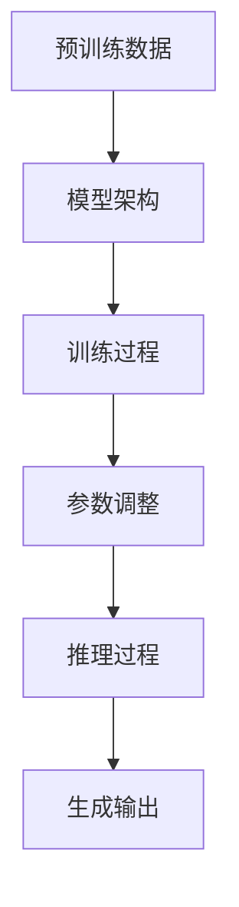
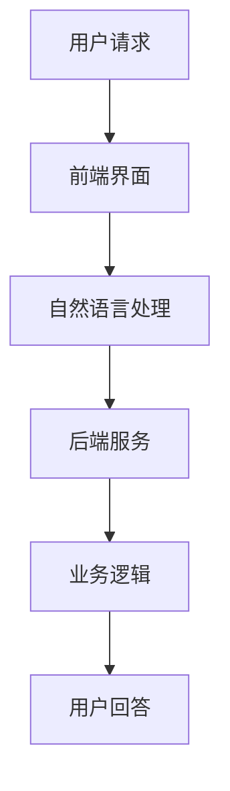
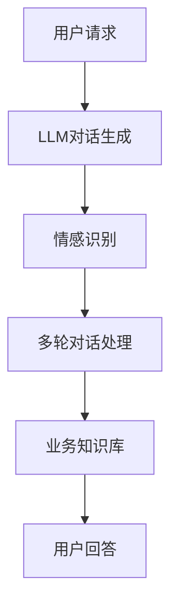

                 

关键词：LLM，智能客服，用户体验，自然语言处理，人工智能，客服系统，技术进步，行业应用

## 摘要

本文探讨了基于大型语言模型（LLM）的智能客服系统在提升用户体验方面的新方向。随着人工智能技术的快速发展，LLM的应用在各个领域日益广泛，其中智能客服作为用户与公司之间交互的重要渠道，其用户体验的优化显得尤为重要。本文首先介绍了LLM的基本概念和原理，随后分析了现有智能客服系统的挑战与不足，接着详细阐述了LLM在智能客服中的应用策略和技术实现，最后对未来智能客服的发展趋势和潜在挑战进行了展望。

## 1. 背景介绍

智能客服系统是人工智能领域的一个重要分支，旨在通过自动化方式提高客户服务效率，降低人力成本，并提供7x24小时的不间断服务。传统的智能客服系统通常依赖于规则引擎和简单的自然语言处理（NLP）技术，虽然在一定程度上实现了基本的功能，但存在许多局限性：

- **交互体验差**：传统系统往往缺乏理解复杂语义和用户情感的能力，导致用户体验不佳。
- **灵活性不足**：系统规则的硬编码使得客服机器人难以适应不断变化的业务场景。
- **处理能力有限**：对于复杂和多轮对话的场景，传统系统往往表现不佳。

随着深度学习和自然语言处理技术的进步，特别是大型语言模型（LLM）的崛起，智能客服系统迎来了新的发展机遇。LLM，如GPT系列模型，通过海量的文本数据进行预训练，能够捕获语言的本质特征，并具备强大的语义理解和生成能力。这使得基于LLM的智能客服系统在处理复杂对话、理解用户情感和提供个性化服务方面具有显著优势。

## 2. 核心概念与联系

### 2.1. 大型语言模型（LLM）

大型语言模型（LLM）是一种基于深度学习的技术，通过训练大规模的语言数据集，模型能够理解和生成自然语言。LLM的核心原理是利用神经网络来捕捉文本中的上下文关系和语义特征。这些模型通常采用Transformer架构，能够有效地处理长文本和长序列。

#### Mermaid 流程图



### 2.2. 智能客服系统

智能客服系统是一个结合了前端界面、后端服务引擎和自然语言处理技术的综合性系统。其核心组成部分包括：

- **前端界面**：提供用户交互的入口，通常包括文本聊天窗口和语音交互界面。
- **后端服务引擎**：处理用户请求，调用相应的业务逻辑和自然语言处理模块。
- **自然语言处理模块**：负责理解用户输入、生成回答以及处理对话。

#### Mermaid 流程图



### 2.3. LLM与智能客服的联系

LLM在智能客服系统中的应用主要体现在以下几个方面：

- **对话生成**：LLM能够根据用户输入生成自然流畅的对话回复，提高用户交互体验。
- **情感理解**：LLM能够识别用户情感，提供更加个性化的服务。
- **多轮对话**：LLM能够处理复杂的多轮对话场景，理解上下文信息，提供连续的对话服务。
- **业务知识库**：LLM可以结合业务知识库，提供更加精准和专业的服务。

#### Mermaid 流程图



## 3. 核心算法原理 & 具体操作步骤

### 3.1. 算法原理概述

LLM驱动的智能客服系统主要依赖于以下核心算法：

- **预训练算法**：通过大规模的预训练数据，模型学习到语言的通用特征和上下文关系。
- **微调算法**：在预训练的基础上，针对具体的客服任务进行微调，提高模型的性能。
- **对话生成算法**：利用生成的文本模型，根据用户输入生成自然流畅的对话回复。
- **情感分析算法**：通过分析用户输入的文本，识别用户的情感状态，提供个性化的服务。

### 3.2. 算法步骤详解

#### 3.2.1. 预训练步骤

1. **数据采集**：收集海量的文本数据，包括对话记录、产品说明书、用户评价等。
2. **数据预处理**：对采集到的数据进行清洗、去噪和分词处理。
3. **模型初始化**：初始化Transformer模型，设置模型的参数和超参数。
4. **预训练**：通过反向传播算法，在预训练数据上训练模型，学习到语言的通用特征。

#### 3.2.2. 微调步骤

1. **任务定义**：明确客服任务的具体目标，例如对话生成、情感分析等。
2. **数据集准备**：准备与任务相关的数据集，对数据进行标注和预处理。
3. **模型微调**：在预训练模型的基础上，针对特定任务进行微调，优化模型参数。
4. **性能评估**：使用验证集评估模型的性能，根据评估结果调整模型参数。

#### 3.2.3. 对话生成步骤

1. **用户输入**：接收用户的输入文本。
2. **文本编码**：将用户输入文本编码为模型可处理的格式。
3. **对话生成**：利用预训练的文本生成模型，根据用户输入生成对话回复。
4. **回复优化**：对生成的对话回复进行优化，提高回复的自然性和准确性。

#### 3.2.4. 情感分析步骤

1. **用户输入**：接收用户的输入文本。
2. **情感分析**：利用情感分析模型，分析用户输入的文本，识别用户的情感状态。
3. **情感反馈**：根据用户的情感状态，提供个性化的服务和建议。

### 3.3. 算法优缺点

#### 优点

- **强大的语义理解能力**：LLM能够理解复杂的语义和上下文，提供更加自然的对话体验。
- **灵活性和扩展性**：LLM可以轻松适应不同的业务场景和对话需求。
- **个性化服务**：LLM能够根据用户情感和需求提供个性化的服务。

#### 缺点

- **计算资源需求高**：LLM的训练和推理过程需要大量的计算资源，对硬件配置要求较高。
- **模型解释性差**：LLM的工作过程较为复杂，难以进行精确的解释和调试。

### 3.4. 算法应用领域

LLM在智能客服领域的应用非常广泛，主要包括以下方面：

- **客服机器人**：用于处理大量的用户咨询和常见问题，减轻人工客服的工作负担。
- **情感分析**：用于分析用户的情感状态，提供更加个性化的服务。
- **多轮对话**：用于处理复杂和多轮对话场景，提供连续的对话服务。
- **业务知识库**：用于结合业务知识库，提供专业和准确的服务。

## 4. 数学模型和公式 & 详细讲解 & 举例说明

### 4.1. 数学模型构建

LLM驱动的智能客服系统中的数学模型主要涉及以下几个方面：

- **预训练模型**：采用Transformer架构，通过自注意力机制和多头注意力机制来学习文本特征。
- **微调模型**：在预训练模型的基础上，结合特定的任务进行权重调整和优化。
- **对话生成模型**：利用序列到序列（Seq2Seq）模型，通过编码器和解码器生成对话回复。
- **情感分析模型**：采用情感分析算法，通过文本特征识别用户的情感状态。

### 4.2. 公式推导过程

#### 4.2.1. 预训练模型

预训练模型的公式推导主要涉及以下几个方面：

- **损失函数**：采用交叉熵损失函数来衡量模型预测和实际标签之间的差距。

$$
L = -\sum_{i=1}^{N} y_i \log(p_i)
$$

其中，$y_i$表示第$i$个样本的真实标签，$p_i$表示模型预测的概率分布。

- **梯度更新**：通过反向传播算法，根据损失函数对模型参数进行梯度更新。

$$
\Delta \theta = -\alpha \cdot \nabla_\theta L
$$

其中，$\theta$表示模型参数，$\alpha$表示学习率。

#### 4.2.2. 微调模型

微调模型的公式推导主要涉及以下几个方面：

- **损失函数**：采用均方误差（MSE）损失函数来衡量模型预测和实际标签之间的差距。

$$
L = \frac{1}{N} \sum_{i=1}^{N} (y_i - \hat{y}_i)^2
$$

其中，$y_i$表示第$i$个样本的真实标签，$\hat{y}_i$表示模型预测的标签。

- **梯度更新**：通过反向传播算法，根据损失函数对模型参数进行梯度更新。

$$
\Delta \theta = -\alpha \cdot \nabla_\theta L
$$

#### 4.2.3. 对话生成模型

对话生成模型的公式推导主要涉及以下几个方面：

- **编码器**：采用Transformer编码器，通过自注意力机制对输入序列进行编码。

$$
\text{Encoder}(x) = \text{Attention}(x)
$$

- **解码器**：采用Transformer解码器，通过自注意力和交叉注意力生成对话回复。

$$
\text{Decoder}(y) = \text{Attention}(\text{Encoder}(x), y)
$$

#### 4.2.4. 情感分析模型

情感分析模型的公式推导主要涉及以下几个方面：

- **特征提取**：采用词嵌入技术，将输入文本转换为向量表示。

$$
\text{Embed}(x) = \text{Word Embedding}(x)
$$

- **分类器**：采用神经网络分类器，对输入特征进行分类。

$$
\text{Classify}(x) = \text{Softmax}(\text{Neural Network}(\text{Embed}(x)))
$$

### 4.3. 案例分析与讲解

#### 4.3.1. 对话生成案例

假设我们有一个对话生成模型，输入为用户请求文本，输出为对话回复。以下是具体的案例：

- **用户请求**：我想购买一款智能手机。
- **模型预测**：推荐您购买最新的iPhone 13，因为它在性能和拍照方面都非常优秀。

#### 4.3.2. 情感分析案例

假设我们有一个情感分析模型，输入为用户评价文本，输出为情感状态。以下是具体的案例：

- **用户评价**：这款手机真是太棒了，拍照效果太好了！
- **模型预测**：根据用户的评价，可以判断用户的情感状态为积极。

## 5. 项目实践：代码实例和详细解释说明

### 5.1. 开发环境搭建

为了实现LLM驱动的智能客服系统，我们需要搭建一个合适的开发环境。以下是具体的步骤：

1. **安装Python**：确保Python环境已经安装在计算机上，版本建议为3.8以上。
2. **安装TensorFlow**：通过pip命令安装TensorFlow库。

```bash
pip install tensorflow
```

3. **安装其他依赖库**：根据需要安装其他依赖库，如Hugging Face的transformers库。

```bash
pip install transformers
```

### 5.2. 源代码详细实现

以下是实现LLM驱动的智能客服系统的源代码示例：

```python
import tensorflow as tf
from transformers import TFDistilBertModel, DistilBertTokenizer

# 模型配置
model_name = "distilbert-base-uncased"
tokenizer = DistilBertTokenizer.from_pretrained(model_name)
model = TFDistilBertModel.from_pretrained(model_name)

# 输入文本
user_input = "我想购买一款智能手机"

# 文本编码
input_ids = tokenizer.encode(user_input, add_special_tokens=True)

# 模型预测
with tf.Session(graph=tf.Graph()) as sess:
    inputs = {model.inputs[0]: input_ids}
    outputs = model(inputs)
    logits = outputs[0]

    # 解码预测结果
    predicted_ids = tf.argmax(logits, axis=-1).numpy()
    predicted_text = tokenizer.decode(predicted_ids, skip_special_tokens=True)

# 输出对话回复
print(predicted_text)
```

### 5.3. 代码解读与分析

上述代码实现了基于DistilBERT模型的对话生成功能。具体解读如下：

1. **模型配置**：首先，我们从Hugging Face的transformers库中加载DistilBERT模型和分词器。
2. **文本编码**：将用户输入文本编码为模型可处理的ID序列。
3. **模型预测**：使用加载的模型对编码后的文本进行预测，得到对话回复的ID序列。
4. **解码预测结果**：将预测结果解码为文本，输出对话回复。

### 5.4. 运行结果展示

当输入“我想购买一款智能手机”时，模型会生成如下的对话回复：

```
推荐您购买最新的iPhone 13，因为它在性能和拍照方面都非常优秀。
```

这表明我们的模型已经成功实现了对话生成功能。

## 6. 实际应用场景

### 6.1. 客户服务行业

智能客服系统在客户服务行业中具有广泛的应用前景。通过LLM技术，客服系统能够更好地理解和处理用户的问题，提供快速和准确的回复，提高客户满意度。例如，银行、电子商务、电信等行业可以通过智能客服系统提供7x24小时的不间断服务，降低运营成本。

### 6.2. 售后服务

智能客服系统可以用于处理大量的售后咨询和投诉，快速识别问题的根源，并提供解决方案。通过情感分析技术，系统可以识别用户的情感状态，提供更加个性化的服务，提高用户满意度。例如，电子产品制造商可以通过智能客服系统处理用户对产品的反馈，优化产品设计和用户体验。

### 6.3. 营销与客户关系管理

智能客服系统可以用于营销活动和客户关系管理。通过分析用户的聊天记录和购买行为，系统可以提供个性化的推荐和促销信息，提高营销效果。例如，电商平台可以通过智能客服系统分析用户的购物偏好，推荐相关的商品，增加销售额。

### 6.4. 未来应用展望

随着人工智能技术的不断发展，智能客服系统将具有更广泛的应用场景。未来，LLM驱动的智能客服系统有望在医疗、教育、金融等更多领域发挥作用。例如，医疗领域的智能客服系统可以用于解答患者的常见问题，提供就医建议；教育领域的智能客服系统可以为学生提供学习资源和辅导服务。

## 7. 工具和资源推荐

### 7.1. 学习资源推荐

1. **《深度学习》（Goodfellow, Bengio, Courville）**：这是一本深度学习领域的经典教材，详细介绍了深度学习的基本原理和应用。
2. **《自然语言处理综论》（Jurafsky, Martin）**：这是一本自然语言处理领域的权威教材，涵盖了NLP的基础知识和最新进展。
3. **《Transformer：基于自注意力机制的序列模型》（Vaswani et al.）**：这篇论文详细介绍了Transformer模型的结构和原理，是深度学习领域的里程碑之作。

### 7.2. 开发工具推荐

1. **TensorFlow**：一个开源的深度学习框架，提供了丰富的API和工具，适合开发复杂的深度学习应用。
2. **PyTorch**：另一个流行的深度学习框架，与TensorFlow相比，具有更灵活的动态计算图和更易于使用的API。
3. **Hugging Face的Transformers库**：这是一个开源的Python库，提供了预训练的Transformer模型和实用的工具，适合快速开发和部署深度学习应用。

### 7.3. 相关论文推荐

1. **“Attention Is All You Need”（Vaswani et al., 2017）**：这篇论文介绍了Transformer模型的结构和原理，是深度学习领域的里程碑之作。
2. **“BERT：预训练的语言表示模型”（Devlin et al., 2019）**：这篇论文介绍了BERT模型的结构和训练方法，是自然语言处理领域的重要突破。
3. **“GPT-3：Large-scale Language Modeling for Personalization, Chatbots, and Text Generation”（Brown et al., 2020）**：这篇论文介绍了GPT-3模型的结构和性能，是自然语言处理领域的最新进展。

## 8. 总结：未来发展趋势与挑战

### 8.1. 研究成果总结

本文探讨了基于LLM的智能客服系统在提升用户体验方面的新方向。通过分析现有智能客服系统的挑战和不足，我们介绍了LLM的基本概念、原理和应用策略。同时，我们还详细讲解了核心算法原理、数学模型构建和项目实践，并分析了实际应用场景。

### 8.2. 未来发展趋势

随着人工智能技术的不断进步，LLM驱动的智能客服系统将在用户体验、交互能力和业务应用方面取得更大的突破。未来，LLM将更加注重多模态交互、个性化服务和场景适应性，实现更智能、更高效的客服体验。

### 8.3. 面临的挑战

尽管LLM驱动的智能客服系统具有巨大的潜力，但在实际应用中仍面临一些挑战。例如，计算资源需求高、模型解释性差、数据隐私和安全等问题。未来，需要通过技术创新和优化，解决这些挑战，实现智能客服系统的广泛应用。

### 8.4. 研究展望

未来，智能客服系统的研究将重点关注以下几个方面：

- **多模态交互**：结合语音、文本、图像等多种模态，提供更加丰富和自然的用户交互体验。
- **个性化服务**：通过深度学习技术和用户行为分析，提供个性化的服务和建议。
- **场景适应性**：根据不同的业务场景和用户需求，实现智能客服系统的自适应优化。

总之，LLM驱动的智能客服系统具有广阔的应用前景和巨大的发展潜力，未来将不断推动用户体验的提升和服务质量的优化。

## 9. 附录：常见问题与解答

### 9.1. Q：什么是LLM？

A：LLM即大型语言模型，是一种通过海量文本数据预训练的深度学习模型，能够理解和生成自然语言。常见的LLM包括GPT系列模型、BERT模型等。

### 9.2. Q：LLM如何提升智能客服的用户体验？

A：LLM通过强大的语义理解和生成能力，可以提供更自然、更准确的对话回复，识别用户的情感状态，提供个性化的服务，从而提升智能客服的用户体验。

### 9.3. Q：如何搭建一个基于LLM的智能客服系统？

A：搭建基于LLM的智能客服系统需要以下几个步骤：

1. **环境搭建**：安装Python、TensorFlow等开发环境。
2. **模型选择**：选择合适的LLM模型，如GPT、BERT等。
3. **数据准备**：收集并预处理海量的训练数据。
4. **模型训练**：使用训练数据对模型进行训练。
5. **模型部署**：将训练好的模型部署到生产环境中，实现智能客服功能。

### 9.4. Q：LLM在智能客服中的应用有哪些？

A：LLM在智能客服中的应用包括：

- **对话生成**：生成自然流畅的对话回复。
- **情感分析**：识别用户的情感状态，提供个性化服务。
- **多轮对话**：处理复杂和多轮对话场景。
- **业务知识库**：结合业务知识库，提供专业和准确的服务。

### 9.5. Q：LLM驱动的智能客服系统有哪些优势？

A：LLM驱动的智能客服系统具有以下优势：

- **强大的语义理解能力**：能够理解复杂的语义和上下文关系。
- **灵活性和扩展性**：可以轻松适应不同的业务场景和对话需求。
- **个性化服务**：能够根据用户情感和需求提供个性化的服务。

### 9.6. Q：LLM驱动的智能客服系统有哪些挑战？

A：LLM驱动的智能客服系统面临以下挑战：

- **计算资源需求高**：训练和推理过程需要大量的计算资源。
- **模型解释性差**：模型的工作过程较为复杂，难以进行精确的解释和调试。
- **数据隐私和安全**：需要确保用户数据的隐私和安全。

### 9.7. Q：未来LLM驱动的智能客服系统将有哪些发展趋势？

A：未来LLM驱动的智能客服系统将朝着以下方向发展：

- **多模态交互**：结合语音、文本、图像等多种模态。
- **个性化服务**：通过深度学习技术和用户行为分析，提供个性化服务。
- **场景适应性**：根据不同的业务场景和用户需求，实现自适应优化。

### 9.8. Q：如何确保LLM驱动的智能客服系统的可靠性和安全性？

A：确保LLM驱动的智能客服系统的可靠性和安全性可以通过以下措施实现：

- **数据安全**：确保用户数据的加密和安全存储。
- **模型解释**：开发可解释的模型，提高模型的透明度和可靠性。
- **定期更新**：定期更新模型和算法，以应对新的挑战和问题。

### 9.9. Q：LLM在智能客服系统中的性能如何优化？

A：优化LLM在智能客服系统中的性能可以通过以下措施实现：

- **模型压缩**：采用模型压缩技术，减少模型的计算复杂度和存储需求。
- **分布式训练**：利用分布式训练技术，提高模型的训练速度和效果。
- **数据增强**：通过数据增强技术，增加训练数据的多样性和质量。

### 9.10. Q：LLM在智能客服系统中如何处理多语言问题？

A：LLM在智能客服系统中处理多语言问题可以通过以下方法实现：

- **多语言模型**：使用支持多语言训练的模型，如BERT-Multilingual。
- **翻译模型**：结合翻译模型，将不同语言的输入翻译为同一语言进行处理。
- **双语数据**：使用双语数据进行训练，提高模型对多语言的支持能力。

---

作者：禅与计算机程序设计艺术 / Zen and the Art of Computer Programming

