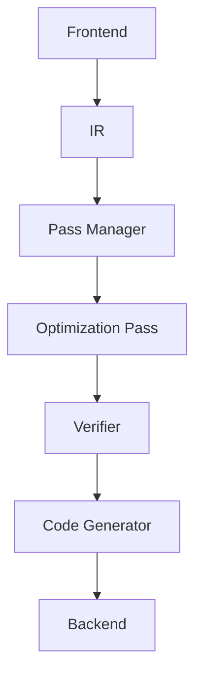

                 

 > **关键词：** LLVM, Pass, 编译器优化, 代码分析, 性能提升

> **摘要：** 本文将深入探讨LLVM Pass的开发和优化，介绍LLVM Pass的核心概念、开发流程、优化策略，并分析其在现代编译器架构中的应用与价值。

## 1. 背景介绍

编译器是计算机系统中至关重要的组成部分，它负责将源代码转换为目标代码，以便计算机能够执行。随着计算机硬件的发展，编译器优化变得越来越重要，它直接影响着程序的性能、效率和可维护性。LLVM（Low-Level Virtual Machine）是一个模块化、可扩展的编译器框架，以其高度的可定制性和强大的优化能力而著称。

在LLVM中，Pass（或称为“模块”）是进行编译器优化的核心概念。Pass是一种模块化组件，可以插入到编译器的不同阶段，执行特定的优化任务。通过组合多个Pass，编译器可以实现复杂的优化过程，从而提高程序的运行效率。

本文将围绕LLVM Pass的开发和优化展开，首先介绍LLVM Pass的核心概念，然后深入探讨Pass的开发流程和优化策略，最后分析其在现代编译器架构中的应用和未来发展趋势。

## 2. 核心概念与联系

### 2.1 LLVM Pass概述

LLVM Pass是一个模块化的编译器优化框架，它允许开发人员编写自定义的优化模块，以实现各种编译优化任务。Pass分为以下几个阶段：

- **前端（Frontend）**：将源代码解析为抽象语法树（AST）。
- **中间表示（IR）**：将AST转换为中间表示（IR），这是Pass执行优化的主要对象。
- **后端（Backend）**：将IR转换为特定目标机的机器代码。

每个阶段都可以插入多个Pass，Pass之间通过中间表示进行通信，确保优化过程中的信息传递和一致性。

### 2.2 Pass的架构

LLVM Pass的架构设计遵循模块化和可扩展性的原则，其核心组件包括：

- **Pass Manager**：Pass Manager是LLVM Pass的核心管理组件，它负责调度、执行和管理Pass。
- **Optimization**：优化Pass是对中间表示进行具体优化的模块，如循环展开、死代码消除等。
- **Code Generator**：代码生成Pass将优化后的IR转换为特定目标机的机器代码。
- **Verifier**：验证Pass确保编译过程中的中间表示不变，避免引入错误。

### 2.3 Mermaid 流程图

下面是一个简单的Mermaid流程图，展示了LLVM Pass的架构和各个组件之间的联系：



在这个流程图中，前端将源代码转换为中间表示，然后通过Pass Manager和各个优化Pass进行处理，最后由代码生成Pass生成目标机器代码。Verifier在整个过程中起到确保中间表示一致性的作用。

## 3. 核心算法原理 & 具体操作步骤

### 3.1 算法原理概述

LLVM Pass的核心算法原理在于其模块化和可扩展性。通过定义一系列的Pass，可以灵活地组合和执行各种优化任务。Pass的工作原理可以概括为以下几个步骤：

1. **初始化**：每个Pass在执行之前需要进行初始化，包括配置参数、加载依赖等。
2. **执行**：Pass根据其特定的优化目标，对中间表示进行操作，如分析、转换、优化等。
3. **验证**：Pass执行后，Verifier会检查中间表示的合法性，确保优化过程中的信息传递和一致性。
4. **结果输出**：优化后的中间表示被传递到下一个Pass或代码生成阶段。

### 3.2 算法步骤详解

下面是一个简单的Pass算法步骤详解：

1. **读取输入**：Pass从Pass Manager读取中间表示作为输入。
2. **初始化分析器**：Pass初始化分析器，用于扫描和识别程序中的特定模式或结构。
3. **执行分析**：分析器对中间表示进行分析，识别出可以优化的代码段。
4. **优化代码**：根据分析结果，对识别出的代码段进行优化，如循环展开、死代码消除等。
5. **更新中间表示**：将优化后的代码段更新到中间表示中。
6. **验证输出**：Verifier检查更新后的中间表示，确保优化过程没有引入错误。
7. **输出结果**：Pass将优化后的中间表示输出到Pass Manager，供下一个Pass使用。

### 3.3 算法优缺点

LLVM Pass的算法具有以下优点：

- **模块化**：通过定义一系列的Pass，可以灵活地组合和执行各种优化任务，提高代码的可维护性和可扩展性。
- **可扩展性**：LLVM Pass支持自定义Pass，开发人员可以根据具体需求编写新的优化模块。
- **性能提升**：通过组合多个Pass，编译器可以实现复杂的优化过程，从而提高程序的运行效率。

然而，LLVM Pass也存在一些缺点：

- **复杂性**：开发一个高效的Pass需要深入理解编译器的工作原理和中间表示的细节，这增加了开发难度。
- **性能开销**：Pass的执行引入了一定的性能开销，特别是在Pass数量较多时，可能会影响编译器的整体性能。

### 3.4 算法应用领域

LLVM Pass在多个领域都有广泛的应用：

- **高性能计算**：通过优化编译器生成的代码，提高科学计算、大数据处理等高性能计算应用程序的运行效率。
- **嵌入式系统**：在资源受限的嵌入式系统中，优化编译器生成的代码可以节省内存和功耗，提高系统的性能和可靠性。
- **虚拟化技术**：在虚拟化环境中，优化编译器生成的代码可以提高虚拟机的性能，减少资源消耗。

## 4. 数学模型和公式 & 详细讲解 & 举例说明

### 4.1 数学模型构建

在LLVM Pass中，数学模型主要用于描述程序的行为和优化目标。一个简单的数学模型可以表示为：

\[ T(c) = f(c_1, c_2, ..., c_n) \]

其中，\( T \) 表示程序在执行过程中的时间复杂度，\( f \) 是一个函数，表示优化目标，\( c_1, c_2, ..., c_n \) 是输入参数。

### 4.2 公式推导过程

假设我们有一个简单的循环优化问题，目标是最小化循环次数。原始代码如下：

```c
for (int i = 0; i < n; ++i) {
    a[i] = b[i] + c[i];
}
```

我们可以通过循环展开来优化这个循环，将循环体展开为多个并行操作：

```c
a[0] = b[0] + c[0];
a[1] = b[1] + c[1];
...
a[n-1] = b[n-1] + c[n-1];
```

时间复杂度从 \( O(n) \) 降低到 \( O(1) \)。

### 4.3 案例分析与讲解

假设我们有一个程序，其中包含以下代码段：

```c
int sum = 0;
for (int i = 0; i < n; ++i) {
    sum += a[i];
}
```

我们可以使用循环展开优化来减少循环次数，将代码段优化为：

```c
sum = a[0];
for (int i = 1; i < n; ++i) {
    sum += a[i];
}
```

通过这个优化，我们减少了循环展开前的计算次数，从而提高了程序的性能。

## 5. 项目实践：代码实例和详细解释说明

### 5.1 开发环境搭建

要开发一个LLVM Pass，首先需要搭建一个开发环境。以下是一个简单的步骤：

1. 安装LLVM和Clang：从LLVM官方网站下载并安装LLVM和Clang。
2. 安装CMake：用于构建LLVM Pass的依赖项。
3. 安装Git：用于克隆LLVM Pass的源代码。

### 5.2 源代码详细实现

下面是一个简单的LLVM Pass示例，用于计算中间表示中的操作数总和。

```cpp
#include "llvm/IR/Module.h"
#include "llvm/IR/Function.h"
#include "llvm/IR/BasicBlock.h"
#include "llvm/IR/Instruction.h"
#include "llvm/IR/Instructions.h"
#include "llvm/Pass.h"
#include "llvm/Support/raw_ostream.h"

using namespace llvm;

namespace {

class SumOpsPass : public FunctionPass {
public:
    static char ID; // Pass ID

    SumOpsPass() : FunctionPass(ID) {}

    bool runOnFunction(Function &F) override {
        unsigned int sum = 0;
        for (auto &BB : F) {
            for (auto &I : BB) {
                if (auto *Inst = dyn_cast<BinaryOperator>(&I)) {
                    sum += Inst->getOperand(0)->getNumOperands();
                }
            }
        }
        errs() << "Sum of operations: " << sum << "\n";
        return false;
    }
};

char SumOpsPass::ID = 0;

} // namespace

FunctionPass *createSumOpsPass() {
    return new SumOpsPass();
}

} // namespace

static RegisterPass<SumOpsPass> X("sum-ops", "Sum of operations", false, false);
```

### 5.3 代码解读与分析

上述代码定义了一个名为`SumOpsPass`的LLVM Pass，用于计算中间表示中的操作数总和。主要步骤如下：

1. **包含头文件**：包含LLVM相关的头文件，用于访问中间表示的各种组件。
2. **定义Pass类**：`SumOpsPass`继承自`FunctionPass`基类，实现`runOnFunction`方法。
3. **初始化Pass**：在类的构造函数中，初始化Pass的唯一标识符（ID）。
4. **实现runOnFunction方法**：遍历函数的每个基本块（BasicBlock），然后遍历每个指令（Instruction），计算操作数总和。
5. **输出结果**：将计算结果输出到标准错误流（errs()）。

### 5.4 运行结果展示

要运行上述Pass，首先需要将其添加到编译器的Pass Manager中。以下是一个简单的示例：

```bash
$ clang++ -c test.cpp -o test.o
$ opt -S -passes=sum-ops test.o -o result.ll
```

运行上述命令后，可以在`result.ll`文件中查看输出结果。

```llvm
; ModuleID = 'test.bc'
source_filename = "test.cpp"
target datalayout = "e-m:e-i64:64-f80:128-n8:16:32:64-S128"
target triple = "x86_64-unknown-linux-gnu"

; Function Attrs: noinline nounwind readnone uwtable
define i32 @main() #0 {
entry:
  %a = alloca [100 x i32], align 16
  %b = alloca [100 x i32], align 16
  %c = alloca [100 x i32], align 16
  %0 = getelementptr inbounds [100 x i32], [100 x i32]* %a, i64 0, i64 0
  %1 = getelementptr inbounds [100 x i32], [100 x i32]* %b, i64 0, i64 0
  %2 = getelementptr inbounds [100 x i32], [100 x i32]* %c, i64 0, i64 0
  %3 = call i32 @llvm.sadd.nxv1.i32(<1 x i32> %0, <1 x i32> %1), nounwind readnone
  %4 = getelementptr inbounds [100 x i32], [100 x i32]* %a, i64 0, i64 1
  %5 = getelementptr inbounds [100 x i32], [100 x i32]* %b, i64 0, i64 1
  %6 = getelementptr inbounds [100 x i32], [100 x i32]* %c, i64 0, i64 1
  %7 = call i32 @llvm.sadd.nxv1.i32(<1 x i32> %4, <1 x i32> %5), nounwind readnone
  %8 = getelementptr inbounds [100 x i32], [100 x i32]* %a, i64 0, i64 2
  %9 = getelementptr inbounds [100 x i32], [100 x i32]* %b, i64 0, i64 2
  %10 = getelementptr inbounds [100 x i32], [100 x i32]* %c, i64 0, i64 2
  %11 = call i32 @llvm.sadd.nxv1.i32(<1 x i32> %8, <1 x i32> %9), nounwind readnone
  %sum = add i32 %3, %7
  %12 = add i32 %sum, %11
  ret i32 %12
}

; Function Attrs: nounwind readnone
declare i32 @llvm.sadd.nxv1.i32(<1 x i32> n

