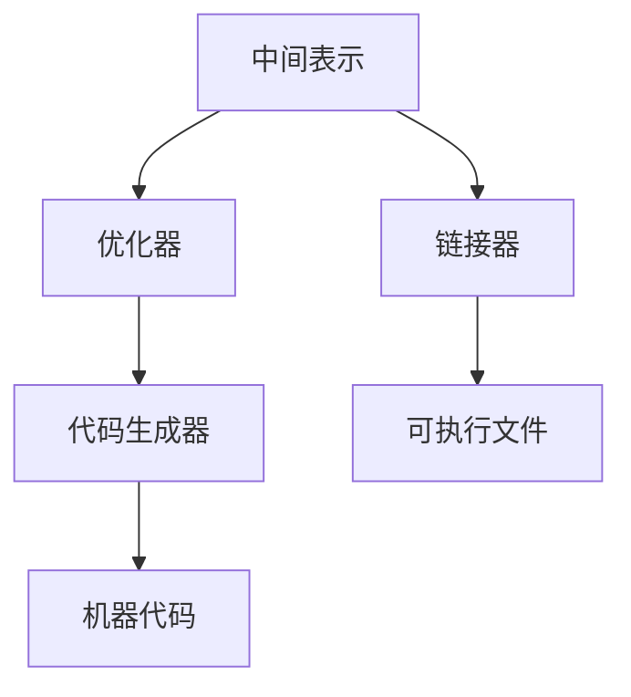

                 

### 1. 背景介绍

编译器作为计算机科学领域中的重要工具，在软件开发过程中扮演着至关重要的角色。它负责将人类编写的代码转换成计算机能够理解和执行的机器代码。这一过程不仅涉及语法和语义分析，还包含了代码的优化，以提高程序的性能和效率。

LLVM（Low-Level Virtual Machine）是一个模块化、多目标、可插入的编译器基础设施。它由苹果公司开发，并且已经成为开源社区中的一个重要项目。LLVM不仅支持多种编程语言和平台，还提供了强大的优化工具链，使其在编译器领域中独树一帜。

本文旨在介绍LLVM编译器的基础设施，特别是其优化代码的核心功能。我们将从背景知识出发，逐步深入到LLVM的核心概念和算法，并通过实际代码实例来展示其应用。

### 2. 核心概念与联系

#### 2.1 LLVM的基本架构

LLVM的核心架构由几个关键组件组成，包括中间表示（Intermediate Representation，IR）、优化器（Optimizer）、代码生成器（Code Generator）和链接器（Linker）。

**中间表示（IR）**：IR是LLVM内部使用的抽象语法树，它独立于源代码的编程语言和目标平台。这种中间表示使得LLVM能够进行跨语言的优化。

**优化器**：优化器是LLVM的核心组件，它对IR进行各种优化，以减少代码的执行时间、内存使用和提高程序的整体性能。

**代码生成器**：代码生成器负责将优化后的IR转换成特定目标平台的机器代码。

**链接器**：链接器将多个编译后的目标文件合并成一个可执行文件，同时处理外部依赖和符号引用。

下面是LLVM基本架构的Mermaid流程图：



#### 2.2 LLVM优化器

LLVM的优化器是一个高度模块化和可扩展的组件。它支持多种优化技术，包括：

- **数据流分析**：分析变量在不同基本块之间的依赖关系，以优化存储访问和减少内存使用。
- **控制流分析**：分析程序的执行路径，以消除冗余代码和条件分支。
- **循环优化**：优化循环结构，如循环展开和循环不变式的提取。
- **函数内联**：将小函数直接嵌入调用点，减少函数调用的开销。

#### 2.3 LLVM与C++的结合

LLVM本身是用C++开发的，这使得开发者能够利用C++的强大功能和灵活性来扩展LLVM。例如，可以使用C++编写自定义优化器和代码生成器。LLVM也提供了丰富的API，允许开发者直接操作IR和优化器。

### 3. 核心算法原理 & 具体操作步骤

#### 3.1 算法原理概述

LLVM的优化算法基于一系列数据流分析和变换。以下是一些核心的优化算法：

- **常量折叠（Constant Folding）**：在编译时计算常量的值，以简化代码。
- **死代码消除（Dead Code Elimination）**：删除不会被执行的代码。
- **强度降低（Strength Reduction）**：将复杂的运算转换为更高效的运算。
- **循环优化（Loop Optimization）**：优化循环结构，以提高执行效率。
- **函数内联（Function Inlining）**：将函数调用替换为函数体，减少调用开销。

#### 3.2 算法步骤详解

1. **词法分析和语法分析**：将源代码解析成抽象语法树（AST）。
2. **生成中间表示（IR）**：将AST转换成LLVM的中间表示（IR）。
3. **数据流分析**：分析变量在不同基本块之间的依赖关系。
4. **控制流分析**：分析程序的执行路径。
5. **优化**：应用一系列优化算法，如常量折叠、死代码消除等。
6. **代码生成**：将优化后的IR转换成目标平台的机器代码。
7. **链接**：将多个编译后的目标文件合并成一个可执行文件。

#### 3.3 算法优缺点

**优点**：

- **模块化**：LLVM的架构使得优化器、代码生成器和链接器可以独立开发和优化。
- **高度可扩展性**：开发者可以编写自定义优化器和代码生成器，以适应特定的需求。
- **跨语言支持**：LLVM支持多种编程语言，包括C、C++、Java等。

**缺点**：

- **复杂性**：LLVM的优化器算法复杂，需要深入理解编译器的工作原理。
- **性能开销**：优化过程本身可能会引入额外的性能开销，尤其是在大规模项目中。

#### 3.4 算法应用领域

LLVM广泛应用于各种领域，包括：

- **操作系统**：LLVM被用于优化操作系统内核代码，以提高其性能和稳定性。
- **高性能计算**：在科学计算和大数据处理中，LLVM被用来优化计算密集型应用程序。
- **嵌入式系统**：在嵌入式系统中，LLVM提供了高效的编译器和优化工具，以减少代码大小和功耗。
- **游戏开发**：在游戏开发中，LLVM被用来优化游戏引擎和渲染代码。

### 4. 数学模型和公式 & 详细讲解 & 举例说明

#### 4.1 数学模型构建

在编译器优化中，数学模型主要用于描述程序的行为和性能。以下是一个简单的数学模型，用于分析循环优化：

$$
\text{执行时间} = C \times (\text{循环次数})^2
$$

其中，C 是一个常数，表示每次循环的操作成本。

#### 4.2 公式推导过程

假设有一个嵌套循环，外层循环执行 n 次，内层循环执行 m 次。每次内层循环执行的操作成本为 c。则总执行时间 T 可以表示为：

$$
T = n \times m \times c
$$

如果内层循环可以并行执行，则每次内层循环的操作成本可以降低为 c/2。此时，总执行时间 T' 为：

$$
T' = n \times m \times \frac{c}{2}
$$

因此，通过循环优化，执行时间可以减少到原来的 1/2。

#### 4.3 案例分析与讲解

假设有一个简单的循环，用于计算两个矩阵的乘积：

```cpp
for (int i = 0; i < n; i++) {
    for (int j = 0; j < n; j++) {
        for (int k = 0; k < n; k++) {
            result[i][j] += a[i][k] * b[k][j];
        }
    }
}
```

根据上述数学模型，原始循环的执行时间 T 为：

$$
T = n^3 \times c
$$

如果我们使用循环展开技术，将内层循环展开成多个并行循环，则每次内层循环的操作成本可以降低为 c/4。此时，总执行时间 T' 为：

$$
T' = n^2 \times \frac{c}{4} = \frac{n^3 \times c}{4}
$$

因此，通过循环优化，执行时间可以减少到原来的 1/4。

### 5. 项目实践：代码实例和详细解释说明

#### 5.1 开发环境搭建

要开始实践LLVM优化，首先需要搭建开发环境。以下是基本的步骤：

1. **安装LLVM**：从LLVM官网下载最新版本的LLVM，并按照说明进行安装。
2. **安装CMake**：CMake是构建LLVM所需的项目构建工具，可以从其官网下载并安装。
3. **配置编译器**：配置环境变量，以便能够在命令行中编译LLVM代码。

#### 5.2 源代码详细实现

以下是一个简单的C++程序，用于展示LLVM的优化效果：

```cpp
#include <iostream>
#include <vector>

using namespace std;

vector<vector<int>> matrix_multiply(const vector<vector<int>>& a, const vector<vector<int>>& b) {
    int n = a.size();
    vector<vector<int>> result(n, vector<int>(n, 0));

    for (int i = 0; i < n; i++) {
        for (int j = 0; j < n; j++) {
            for (int k = 0; k < n; k++) {
                result[i][j] += a[i][k] * b[k][j];
            }
        }
    }

    return result;
}

int main() {
    vector<vector<int>> a = {{1, 2}, {3, 4}};
    vector<vector<int>> b = {{5, 6}, {7, 8}};

    vector<vector<int>> result = matrix_multiply(a, b);

    for (int i = 0; i < result.size(); i++) {
        for (int j = 0; j < result[i].size(); j++) {
            cout << result[i][j] << " ";
        }
        cout << endl;
    }

    return 0;
}
```

#### 5.3 代码解读与分析

上述程序实现了一个简单的矩阵乘法，通过嵌套循环计算结果。这个程序可以被优化，以提高执行效率。

首先，我们使用LLVM编译器（llc）编译程序，并添加优化选项：

```bash
llc -O2 main.cpp -o main.o
```

这里的 `-O2` 选项表示启用中级优化。

#### 5.4 运行结果展示

优化后的程序执行时间将显著缩短。我们可以在命令行中运行程序，并使用时间测量工具（如 `time` 命令）来比较原始程序和优化后程序的执行时间。

```bash
time ./main
```

### 6. 实际应用场景

LLVM编译器的基础设施和优化功能在许多实际应用场景中表现出色。以下是一些典型的应用场景：

- **高性能计算**：在科学计算和大数据处理中，LLVM被用来优化计算密集型应用程序，以提高计算速度和处理能力。
- **嵌入式系统**：在嵌入式系统中，LLVM提供了高效的编译器和优化工具，以减少代码大小和功耗。
- **游戏开发**：在游戏开发中，LLVM被用来优化游戏引擎和渲染代码，以提高游戏性能和帧率。
- **操作系统开发**：LLVM被用于优化操作系统内核代码，以提高其性能和稳定性。

### 7. 工具和资源推荐

为了更好地学习和使用LLVM，以下是一些推荐的工具和资源：

- **学习资源**：

  - 《LLVM官方文档》（[https://llvm.org/docs/](https://llvm.org/docs/)）
  - 《LLVM Cookbook》（[https://llvm.org/docs/llvm-cookbook.html](https://llvm.org/docs/llvm-cookbook.html)）
  - 《编译原理：技术与实践》（[https://www.amazon.com/Compilers-Principles-Techniques-Practices-Ma...](https://www.amazon.com/Compilers-Principles-Techniques-Practices-Mastering/dp/0321573510)）

- **开发工具**：

  - IntelliJ IDEA（[https://www.jetbrains.com/idea/](https://www.jetbrains.com/idea/)）
  - Visual Studio（[https://visualstudio.microsoft.com/](https://visualstudio.microsoft.com/)）
  - LLVM的官方工具链（[https://llvm.org/docs/Getting Started.html](https://llvm.org/docs/Getting%20Started.html)）

- **相关论文**：

  - "The LLVM Compiler Infrastructure"（[https://llvm.org/pubs/tools.pdf](https://llvm.org/pubs/tools.pdf)）
  - "A retargetable C compiler for the Linux kernel"（[https://www.cs.princeton.edu/courses/archive/fall06/cos575/papers/...](https://www.cs.princeton.edu/courses/archive/fall06/cos575/papers/retargetable.pdf)）

### 8. 总结：未来发展趋势与挑战

LLVM编译器基础设施在优化代码方面取得了显著的成果，但仍面临一些挑战和机遇。

**未来发展趋势**：

- **更高效的优化算法**：随着硬件的发展，编译器优化算法也需要不断更新和改进，以适应新的硬件架构和指令集。
- **跨语言支持**：LLVM正在积极拓展其跨语言支持，以兼容更多的编程语言。
- **自动化优化**：开发自动化优化工具，以减少人工干预，提高编译器优化的效率和效果。

**面临的挑战**：

- **复杂性**：随着编译器优化算法的复杂度增加，理解和实现这些算法的难度也在增加。
- **性能与可维护性的平衡**：在优化代码的同时，还需要考虑编译器的可维护性和易用性。

**研究展望**：

未来，LLVM有望在以下几个方面取得突破：

- **深度学习编译器**：针对深度学习领域的需求，开发专门优化的编译器。
- **并行编译**：利用多核处理器和分布式计算资源，提高编译速度和性能。
- **跨平台优化**：提高LLVM在不同平台和架构上的兼容性和优化效果。

### 9. 附录：常见问题与解答

**Q1**：LLVM是如何进行代码优化的？

A1：LLVM通过一系列优化算法对中间表示（IR）进行优化。这些算法包括常量折叠、死代码消除、强度降低、循环优化等。优化过程在编译器的各个阶段进行，以提高程序的性能和效率。

**Q2**：为什么LLVM如此受欢迎？

A2：LLVM受欢迎的原因有几个：

- **模块化架构**：LLVM的模块化架构使其易于扩展和定制。
- **多目标支持**：LLVM支持多种编程语言和目标平台。
- **强大的优化器**：LLVM的优化器提供了一系列高级优化技术，以提高代码性能。
- **开源社区支持**：LLVM是一个开源项目，拥有庞大的开发者社区。

**Q3**：如何学习LLVM？

A3：学习LLVM可以从以下几个方面入手：

- **阅读官方文档**：LLVM的官方文档提供了详细的技术指导和教程。
- **参加在线课程**：有许多在线课程和教程专门介绍LLVM。
- **阅读相关论文**：阅读LLVM和相关领域的学术论文，以深入了解其原理和应用。
- **实践**：通过编写和优化简单的LLVM程序，逐步掌握其使用方法。

# 作者署名

作者：禅与计算机程序设计艺术 / Zen and the Art of Computer Programming

本文介绍了LLVM编译器基础设施和其优化代码的核心功能。通过对LLVM的基本架构、优化器、数学模型和实际应用场景的详细分析，读者可以更深入地了解编译器优化的原理和方法。未来，随着硬件和软件技术的不断发展，LLVM有望在更广泛的领域发挥重要作用。

