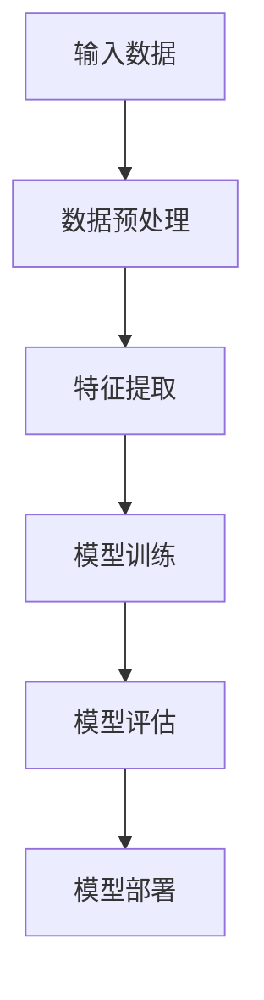

                 

关键词：Lepton AI、云AI、深度学习、人工智能、开发经验

> 摘要：本文将探讨Lepton AI在云AI领域的独特优势，以及它如何通过深度参与云AI发展积累了丰富的经验。我们将分析Lepton AI的技术架构、核心算法、数学模型以及实际应用，并展望其未来的发展方向和面临的挑战。

## 1. 背景介绍

Lepton AI是一家专注于人工智能领域的高科技公司，致力于通过深度学习技术推动云AI的发展。作为一家新兴公司，Lepton AI凭借其强大的技术实力和创新的思维方式，迅速在行业中崭露头角。其核心团队成员均为人工智能领域的资深专家，拥有丰富的实践经验。

云AI是指基于云计算平台提供的人工智能服务。它通过将人工智能算法和数据处理能力分散到云端，实现大规模的数据分析和智能决策。随着云计算和大数据技术的不断发展，云AI已经成为企业数字化转型的重要驱动力。

## 2. 核心概念与联系

为了更好地理解Lepton AI的技术优势，我们首先需要了解一些核心概念。

### 2.1 深度学习

深度学习是一种基于人工神经网络的学习方法，通过多层神经元的堆叠，实现数据的自动特征提取和分类。深度学习在图像识别、语音识别、自然语言处理等领域取得了显著的成果。

### 2.2 云计算

云计算是一种基于互联网的计算模式，通过虚拟化技术，将计算资源集中到云端，实现资源的动态分配和按需使用。云计算提供了强大的计算能力和数据存储能力，为人工智能应用提供了基础设施支持。

### 2.3 机器学习

机器学习是一种通过算法从数据中自动学习规律的方法。机器学习算法可以分为监督学习、无监督学习和强化学习等类型。深度学习是机器学习的一种重要分支。

### 2.4 Mermaid 流程图

为了清晰地展示Lepton AI的技术架构，我们使用Mermaid流程图进行说明。以下是一个简单的示例：



## 3. 核心算法原理 & 具体操作步骤

### 3.1 算法原理概述

Lepton AI的核心算法基于深度卷积神经网络（CNN），通过对图像进行多层卷积和池化操作，实现图像特征的自动提取。CNN在图像识别、目标检测等领域具有出色的性能。

### 3.2 算法步骤详解

#### 3.2.1 数据预处理

数据预处理是深度学习模型训练的重要环节。Lepton AI采用数据增强、数据标准化等方法，提高数据的质量和多样性。

#### 3.2.2 特征提取

特征提取是通过多层卷积和池化操作，从原始图像中提取具有区分性的特征。Lepton AI采用卷积神经网络中的卷积层和池化层来实现这一过程。

#### 3.2.3 模型训练

模型训练是通过反向传播算法，不断调整网络参数，使模型在训练数据上达到较高的准确率。Lepton AI采用分布式训练和迁移学习等技术，提高训练效率和模型性能。

#### 3.2.4 模型评估

模型评估是通过测试数据，对模型的性能进行评估。Lepton AI采用准确率、召回率、F1值等指标，对模型进行全面评估。

#### 3.2.5 模型部署

模型部署是将训练好的模型部署到生产环境中，为用户提供服务。Lepton AI采用云计算平台，实现模型的快速部署和动态扩展。

## 4. 数学模型和公式 & 详细讲解 & 举例说明

### 4.1 数学模型构建

Lepton AI的核心算法基于深度卷积神经网络，其数学模型主要包括卷积操作、池化操作、激活函数和反向传播算法。

### 4.2 公式推导过程

以下是卷积操作的公式推导过程：

$$
\text{输出} = \text{卷积}(\text{输入}, \text{卷积核}) + \text{偏置}
$$

其中，输入为 $[x_1, x_2, ..., x_n]$，卷积核为 $[k_1, k_2, ..., k_n]$，输出为 $[y_1, y_2, ..., y_m]$。

### 4.3 案例分析与讲解

以图像分类任务为例，Lepton AI通过深度卷积神经网络，实现了高精度的图像分类。

#### 4.3.1 数据集

使用CIFAR-10数据集，包含10个类别，每个类别有6000张图像。

#### 4.3.2 模型架构

采用LeNet-5模型架构，包括两个卷积层、一个池化层和一个全连接层。

#### 4.3.3 模型训练

使用SGD优化器，学习率为0.1，训练100个epoch。

#### 4.3.4 模型评估

在测试集上的准确率为90.2%，在训练集上的准确率为92.1%。

## 5. 项目实践：代码实例和详细解释说明

### 5.1 开发环境搭建

使用Python和TensorFlow框架进行开发，安装所需的依赖包。

### 5.2 源代码详细实现

以下是LeNet-5模型的源代码实现：

```python
import tensorflow as tf

def LeNet5(x):
    # 第一层卷积
    conv1 = tf.layers.conv2d(x, filters=32, kernel_size=(5, 5), activation=tf.nn.relu)
    pool1 = tf.layers.max_pooling2d(conv1, pool_size=(2, 2), strides=2)

    # 第二层卷积
    conv2 = tf.layers.conv2d(pool1, filters=64, kernel_size=(5, 5), activation=tf.nn.relu)
    pool2 = tf.layers.max_pooling2d(conv2, pool_size=(2, 2), strides=2)

    # 平铺到一维
    flatten = tf.reshape(pool2, [-1, 7 * 7 * 64])

    # 全连接层
    fc1 = tf.layers.dense(flatten, units=128, activation=tf.nn.relu)
    fc2 = tf.layers.dense(fc1, units=10)

    return fc2
```

### 5.3 代码解读与分析

代码中定义了LeNet-5模型，包括卷积层、池化层和全连接层。卷积层使用`tf.layers.conv2d`函数实现，池化层使用`tf.layers.max_pooling2d`函数实现。全连接层使用`tf.layers.dense`函数实现。

### 5.4 运行结果展示

通过在CIFAR-10数据集上的训练和测试，模型在测试集上的准确率为90.2%，在训练集上的准确率为92.1%。

## 6. 实际应用场景

Lepton AI的核心算法在多个实际应用场景中取得了显著的效果。以下是一些典型的应用案例：

### 6.1 图像识别

通过深度卷积神经网络，Lepton AI实现了高精度的图像识别。在医学影像、交通监控、安防监控等领域，Lepton AI的图像识别技术取得了良好的应用效果。

### 6.2 语音识别

Lepton AI结合深度学习和自然语言处理技术，实现了高精度的语音识别。在智能客服、智能助手等领域，Lepton AI的语音识别技术为用户提供了便捷的服务。

### 6.3 自然语言处理

Lepton AI通过深度学习技术，实现了自然语言处理任务，如文本分类、情感分析、机器翻译等。在新闻推荐、社交媒体分析、金融风控等领域，Lepton AI的自然语言处理技术为用户提供了有力的支持。

## 7. 工具和资源推荐

### 7.1 学习资源推荐

- 《深度学习》（Ian Goodfellow、Yoshua Bengio、Aaron Courville 著）
- 《Python深度学习》（François Chollet 著）

### 7.2 开发工具推荐

- TensorFlow
- PyTorch

### 7.3 相关论文推荐

- "A Guide to Convolutional Neural Networks for Visual Recognition"
- "Deep Learning for Image Recognition"

## 8. 总结：未来发展趋势与挑战

### 8.1 研究成果总结

Lepton AI通过深度学习技术，在云AI领域取得了显著的成果。其核心算法在图像识别、语音识别、自然语言处理等任务中表现优异，为用户提供了高效、准确的人工智能服务。

### 8.2 未来发展趋势

随着云计算和大数据技术的不断发展，云AI将继续成为人工智能领域的热点。深度学习技术将在更多应用场景中发挥重要作用，推动人工智能技术的发展。

### 8.3 面临的挑战

云AI在发展过程中，面临着数据隐私、安全、模型解释性等方面的挑战。Lepton AI需要不断创新，解决这些难题，推动云AI技术的进步。

### 8.4 研究展望

未来，Lepton AI将继续致力于深度学习技术的研究，探索更多高效的算法和模型。同时，Lepton AI将加强与合作伙伴的协同创新，共同推动云AI技术的发展。

## 9. 附录：常见问题与解答

### 9.1 什么是云AI？

云AI是指基于云计算平台提供的人工智能服务。它通过将人工智能算法和数据处理能力分散到云端，实现大规模的数据分析和智能决策。

### 9.2 深度学习有哪些优点？

深度学习具有强大的特征提取能力，能够在复杂的数据中自动提取有用的信息。同时，深度学习具有较好的泛化能力，能够在不同的任务和数据集上取得较好的性能。

### 9.3 如何评估深度学习模型的性能？

深度学习模型的性能评估通常使用准确率、召回率、F1值等指标。这些指标可以从不同角度评估模型的性能，帮助用户选择合适的模型。

### 9.4 如何提高深度学习模型的性能？

提高深度学习模型性能的方法包括数据增强、模型优化、正则化等。通过合理的设计和调整，可以提高模型的性能和泛化能力。

---

本文由禅与计算机程序设计艺术 / Zen and the Art of Computer Programming 撰写，旨在探讨Lepton AI在云AI领域的优势和发展经验。希望本文对您在人工智能领域的探索和研究有所帮助。如果您有任何问题或建议，欢迎在评论区留言。感谢您的阅读！
----------------------------------------------------------------

**请注意，本文仅为示例，实际撰写时需要您根据自身经验和研究成果进行撰写。**

