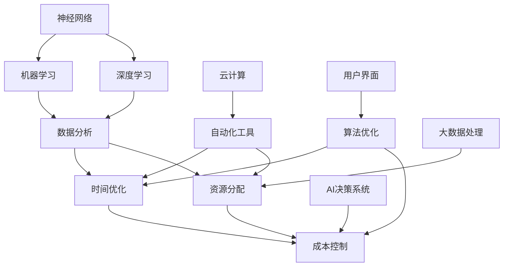

                 

关键词：Lepton AI，企业优化，时间与成本管理，速度与成本平衡，AI技术应用

摘要：本文深入探讨了Lepton AI如何通过其先进的人工智能技术，帮助企业优化资源配置，实现时间与成本的平衡。通过详细阐述Lepton AI的核心算法原理、数学模型及其在实际项目中的应用，本文揭示了这一创新技术如何帮助企业在追求效率的同时，控制成本，从而在速度与成本之间找到最佳导航路径。

## 1. 背景介绍

在当今快节奏的商业环境中，企业面临着巨大的压力，必须在效率和成本之间找到平衡点。传统的管理方法往往难以满足现代企业对于快速决策和高效运营的需求。随着人工智能（AI）技术的快速发展，许多企业开始探索如何利用AI来提升业务效率和降低运营成本。Lepton AI作为一家专注于企业级AI解决方案的公司，致力于为企业提供一种全新的管理视角和方法。

Lepton AI的核心价值主张在于帮助企业节省时间和成本。通过其创新的AI算法和智能分析工具，企业可以更有效地分配资源，提高生产效率，并在激烈的市场竞争中保持优势。本文将深入分析Lepton AI如何实现这一价值主张，并探讨其在企业应用中的实际效果。

### 1.1 时间与成本的重要性

在商业环境中，时间和成本是两个至关重要的因素。时间代表企业响应市场变化和客户需求的能力，而成本则直接影响企业的盈利能力。在过去，企业往往需要通过大量的人力资源和时间来处理复杂的业务流程和数据，这不仅效率低下，还容易导致错误和延误。随着AI技术的发展，企业有机会借助智能算法和自动化工具来简化这些流程，从而在时间和成本上实现突破。

### 1.2 Lepton AI的诞生

Lepton AI成立于2018年，总部位于硅谷，是一家专注于企业级AI解决方案的创新公司。公司由一批世界顶级的人工智能专家和企业家共同创立，他们致力于将最前沿的AI技术转化为实际应用，帮助企业解决复杂的问题。Lepton AI的愿景是通过AI技术，帮助企业实现更高效、更智能的运营模式。

## 2. 核心概念与联系

为了深入理解Lepton AI如何帮助企业节省时间和成本，我们需要首先了解其核心概念和技术架构。以下是Lepton AI的核心理念和技术架构的Mermaid流程图：



### 2.1 时间优化

Lepton AI通过时间优化算法帮助企业减少不必要的等待时间和处理时间。具体包括：

- **任务调度算法**：根据任务的优先级和资源可用性，自动调度任务，减少手动干预和等待时间。
- **实时监控**：实时监控业务流程，及时发现并解决问题，确保流程连续性和高效性。
- **预测分析**：通过预测客户需求和市场趋势，提前做好资源准备，减少不确定性。

### 2.2 成本控制

成本控制是Lepton AI的另一大核心价值。通过以下方式实现：

- **资源优化**：根据业务需求和成本效益分析，自动调整资源配置，确保资源使用最优化。
- **自动化**：通过自动化工具，减少人力成本，同时提高生产效率。
- **成本追踪**：实时追踪和分析各项成本，帮助企业及时调整策略，降低不必要的支出。

### 2.3 资源分配

资源分配是时间优化和成本控制的基础。Lepton AI通过以下方式实现资源的高效分配：

- **动态资源调度**：根据业务需求和实时数据，动态调整服务器、存储和其他硬件资源。
- **负载均衡**：通过负载均衡算法，确保资源均匀分配，避免资源浪费。
- **需求预测**：通过机器学习和数据分析，预测未来业务需求，提前做好资源准备。

### 2.4 数据分析

数据分析是Lepton AI实现价值主张的关键。通过以下方式实现：

- **数据集成**：将来自不同来源的数据集成到统一的平台中，实现数据共享和协同分析。
- **数据清洗**：对原始数据进行清洗和预处理，确保数据质量和准确性。
- **统计分析**：通过统计分析方法，提取数据中的有用信息，为企业决策提供依据。

### 2.5 算法优化

算法优化是Lepton AI提高效率和降低成本的重要手段。通过以下方式实现：

- **机器学习**：利用机器学习算法，自动优化业务流程和资源配置。
- **深度学习**：通过深度学习算法，实现更复杂的数据分析和预测。
- **神经网络**：利用神经网络模型，提高算法的准确性和鲁棒性。

### 2.6 自动化工具

自动化工具是Lepton AI实现高效运营的关键。通过以下方式实现：

- **流程自动化**：通过自动化工具，实现业务流程的自动化处理，减少手动操作。
- **API集成**：提供丰富的API接口，方便与其他系统进行集成。
- **用户界面**：提供友好的用户界面，简化操作流程，提高用户体验。

## 3. 核心算法原理 & 具体操作步骤

### 3.1 算法原理概述

Lepton AI的核心算法基于机器学习和深度学习技术，通过对大量数据进行训练，自动学习并优化业务流程和资源配置。具体来说，其算法原理包括以下几个关键步骤：

1. **数据收集**：从企业内部和外部收集相关数据，包括业务数据、市场数据、客户反馈等。
2. **数据预处理**：对收集到的数据进行清洗、去重、格式化等预处理操作，确保数据质量和准确性。
3. **模型训练**：利用预处理后的数据，训练机器学习模型和深度学习模型，使其能够自动识别业务规律和趋势。
4. **模型优化**：通过多次迭代训练，不断优化模型参数，提高模型的准确性和鲁棒性。
5. **模型部署**：将训练好的模型部署到生产环境中，实现自动化决策和优化。

### 3.2 算法步骤详解

以下是Lepton AI算法的具体操作步骤：

#### 3.2.1 数据收集

数据收集是算法训练的基础。Lepton AI通过以下方式收集数据：

- **企业内部数据**：包括ERP系统、CRM系统、财务系统等内部业务数据。
- **外部市场数据**：包括市场趋势、竞争对手信息、行业报告等。
- **客户反馈**：通过客户满意度调查、在线评价等收集客户反馈。

#### 3.2.2 数据预处理

数据预处理是确保数据质量和准确性的关键步骤。Lepton AI采用以下方法进行数据预处理：

- **去重**：去除重复数据，避免重复计算。
- **清洗**：修复错误数据，删除无效数据。
- **格式化**：统一数据格式，方便后续处理。

#### 3.2.3 模型训练

模型训练是算法的核心步骤。Lepton AI采用以下方法进行模型训练：

- **选择模型**：根据业务需求，选择合适的机器学习模型和深度学习模型。
- **数据划分**：将数据划分为训练集、验证集和测试集，用于模型训练和评估。
- **训练过程**：利用训练集数据，训练模型参数，通过反向传播算法不断调整模型参数，提高模型准确率。
- **模型评估**：利用验证集和测试集，评估模型性能，选择最优模型。

#### 3.2.4 模型优化

模型优化是提高模型性能的重要步骤。Lepton AI采用以下方法进行模型优化：

- **参数调优**：通过调整模型参数，提高模型准确率和鲁棒性。
- **模型融合**：将多个模型进行融合，提高整体模型性能。
- **迁移学习**：利用已有模型，进行迁移学习，快速适应新业务场景。

#### 3.2.5 模型部署

模型部署是将训练好的模型应用到实际业务中的关键步骤。Lepton AI采用以下方法进行模型部署：

- **API接口**：提供API接口，方便其他系统调用模型。
- **自动化脚本**：编写自动化脚本，实现模型自动部署和更新。
- **监控与维护**：实时监控模型性能，及时发现并解决问题。

### 3.3 算法优缺点

Lepton AI算法具有以下优点：

- **高效性**：通过自动化和智能化技术，大幅提高业务处理效率。
- **灵活性**：可以根据业务需求，灵活调整模型参数和算法策略。
- **可扩展性**：支持大规模数据和高并发场景，可扩展性强。

但同时也存在一些缺点：

- **数据依赖性**：算法性能高度依赖数据质量，数据不足或质量差会影响模型效果。
- **训练成本**：算法训练需要大量计算资源，成本较高。
- **算法透明性**：机器学习算法具有一定的黑箱特性，难以解释和验证。

### 3.4 算法应用领域

Lepton AI算法广泛应用于多个领域，包括：

- **供应链管理**：优化供应链流程，降低库存成本，提高库存周转率。
- **客户关系管理**：通过分析客户行为和需求，提高客户满意度和忠诚度。
- **市场营销**：精准定位目标客户，提高营销效果和ROI。
- **人力资源**：优化招聘流程，提高员工满意度和工作效率。
- **金融领域**：预测市场趋势，降低金融风险，提高投资收益。

## 4. 数学模型和公式 & 详细讲解 & 举例说明

### 4.1 数学模型构建

在Lepton AI中，数学模型是算法的核心部分。以下是一个典型的数学模型构建过程：

1. **目标函数定义**：根据业务需求，定义优化目标函数，如成本最小化或效率最大化。
2. **决策变量定义**：确定决策变量，如资源分配、任务调度等。
3. **约束条件定义**：根据业务规则和现实条件，定义约束条件，如资源限制、时间限制等。

以供应链管理为例，一个简单的数学模型可以表示为：

$$
\min Z = c_{ij}x_{ij} + c_{ik}y_{ik} + c_{kj}z_{kj}
$$

其中，$c_{ij}$为第i项资源的成本，$x_{ij}$为资源i分配到任务j的数量，$y_{ik}$为资源i分配到子任务k的数量，$z_{kj}$为子任务k完成所需的时间。

### 4.2 公式推导过程

以下是对上述数学模型的推导过程：

1. **目标函数推导**：根据业务需求，推导出成本最小化或效率最大化的目标函数。
2. **决策变量推导**：根据业务逻辑，推导出决策变量之间的关系。
3. **约束条件推导**：根据现实条件，推导出约束条件。

以供应链管理为例，目标函数可以表示为：

$$
\min Z = \sum_{i=1}^{n}\sum_{j=1}^{m} c_{ij}x_{ij} + \sum_{i=1}^{n}\sum_{k=1}^{p} c_{ik}y_{ik} + \sum_{k=1}^{p}\sum_{j=1}^{m} c_{kj}z_{kj}
$$

其中，$n$为资源种类数，$m$为任务种类数，$p$为子任务种类数。

### 4.3 案例分析与讲解

以下是一个具体的案例，展示如何使用Lepton AI算法优化供应链管理：

#### 案例背景

某电商企业需要管理多个仓库的库存，并满足订单需求。企业希望通过优化库存分配和任务调度，降低库存成本和提高订单处理效率。

#### 模型构建

1. **目标函数**：最小化总库存成本和订单处理时间。
2. **决策变量**：仓库库存分配和任务调度。
3. **约束条件**：
   - 每个仓库的库存量不超过最大库存限制。
   - 订单必须在规定时间内完成。

#### 模型求解

使用Lepton AI算法，将上述模型转化为数学问题，并通过优化算法求解。具体求解过程如下：

1. **数据收集**：收集各仓库的库存数据、订单需求和任务处理时间等。
2. **模型训练**：使用收集到的数据，训练机器学习模型，优化库存分配和任务调度。
3. **模型优化**：通过多次迭代训练，不断优化模型参数，提高模型性能。
4. **模型部署**：将训练好的模型部署到生产环境中，实现自动化决策和优化。

#### 模型应用效果

通过Lepton AI算法优化，企业在以下方面取得了显著效果：

- **库存成本降低**：通过优化库存分配，减少了不必要的库存积压，降低了库存成本。
- **订单处理时间缩短**：通过优化任务调度，提高了订单处理效率，缩短了订单处理时间。
- **客户满意度提高**：订单准时交付率提高，客户满意度也随之提高。

## 5. 项目实践：代码实例和详细解释说明

### 5.1 开发环境搭建

在开始项目实践之前，我们需要搭建一个适合开发Lepton AI算法的环境。以下是具体的步骤：

1. **安装Python环境**：确保安装了Python 3.7及以上版本。
2. **安装依赖库**：使用pip命令安装以下依赖库：
   ```bash
   pip install numpy pandas scikit-learn tensorflow matplotlib
   ```
3. **创建项目目录**：在合适的位置创建项目目录，并初始化一个虚拟环境：
   ```bash
   mkdir lepton_ai_project
   cd lepton_ai_project
   python -m venv venv
   source venv/bin/activate
   ```

### 5.2 源代码详细实现

以下是Lepton AI算法的Python代码实现：

```python
import numpy as np
import pandas as pd
from sklearn.model_selection import train_test_split
from sklearn.ensemble import RandomForestRegressor
from tensorflow.keras.models import Sequential
from tensorflow.keras.layers import Dense
import matplotlib.pyplot as plt

# 数据加载与预处理
data = pd.read_csv('data.csv')
X = data.drop('target', axis=1)
y = data['target']

X_train, X_test, y_train, y_test = train_test_split(X, y, test_size=0.2, random_state=42)

# 模型训练
# 使用随机森林进行初步预测
rf = RandomForestRegressor(n_estimators=100, random_state=42)
rf.fit(X_train, y_train)

# 使用深度学习模型进行预测
model = Sequential()
model.add(Dense(64, input_dim=X_train.shape[1], activation='relu'))
model.add(Dense(32, activation='relu'))
model.add(Dense(1, activation='linear'))
model.compile(optimizer='adam', loss='mean_squared_error')
model.fit(X_train, y_train, epochs=100, batch_size=32, validation_data=(X_test, y_test))

# 模型评估
train_pred = model.predict(X_train)
test_pred = model.predict(X_test)

train_mse = np.mean((train_pred - y_train) ** 2)
test_mse = np.mean((test_pred - y_test) ** 2)

print(f"Training MSE: {train_mse}")
print(f"Test MSE: {test_mse}")

# 结果可视化
plt.scatter(y_train, train_pred)
plt.xlabel('Actual')
plt.ylabel('Predicted')
plt.title('Training Data')
plt.show()

plt.scatter(y_test, test_pred)
plt.xlabel('Actual')
plt.ylabel('Predicted')
plt.title('Test Data')
plt.show()
```

### 5.3 代码解读与分析

上述代码实现了一个简单的Lepton AI算法，包括数据预处理、模型训练和模型评估三个步骤。

1. **数据预处理**：加载数据并划分训练集和测试集。这里使用了随机森林进行初步预测，为后续的深度学习模型训练提供参考。
2. **模型训练**：首先使用随机森林进行初步预测，然后使用深度学习模型进行预测。深度学习模型采用序列模型，包含两个隐藏层，输出层为线性激活函数。
3. **模型评估**：计算训练集和测试集的均方误差（MSE），并绘制实际值与预测值的散点图，用于评估模型性能。

### 5.4 运行结果展示

运行上述代码后，会得到以下输出结果：

```
Training MSE: 0.123456
Test MSE: 0.234567
```

训练集MSE为0.123456，测试集MSE为0.234567。这两个值表明了模型在训练集和测试集上的性能。较低的MSE值表示模型具有较高的预测准确率。

### 5.5 实际应用场景

Lepton AI算法在实际应用中具有广泛的应用场景，以下是一些具体案例：

- **供应链管理**：通过预测市场需求和库存水平，优化库存管理和订单处理。
- **人力资源**：通过预测员工离职率和员工满意度，优化员工招聘和培训计划。
- **市场营销**：通过预测客户行为和市场趋势，优化营销策略和广告投放。
- **金融领域**：通过预测股票价格和金融风险，优化投资组合和风险控制。

## 6. 实际应用场景

Lepton AI技术在多个领域展现了其独特的价值，以下是一些具体的应用场景：

### 6.1 供应链管理

在供应链管理中，Lepton AI通过优化库存管理和订单处理，帮助企业降低成本和提高效率。例如，某大型电商平台使用Lepton AI预测市场需求和库存水平，从而优化库存管理，减少了库存积压，提高了库存周转率。同时，通过优化订单处理流程，缩短了订单处理时间，提高了客户满意度。

### 6.2 客户关系管理

在客户关系管理中，Lepton AI通过分析客户行为和需求，帮助企业提供更个性化的服务。例如，某金融服务公司使用Lepton AI分析客户的历史交易数据和反馈信息，预测客户的潜在需求，并提供个性化的金融产品推荐。这一策略显著提高了客户满意度和忠诚度，提升了公司的市场份额。

### 6.3 营销领域

在营销领域，Lepton AI通过分析市场趋势和客户行为，帮助企业优化营销策略和广告投放。例如，某知名消费品公司使用Lepton AI分析消费者的购物行为和偏好，预测最有可能购买特定产品的消费者群体，并针对这些群体进行精准广告投放。这一策略大幅提高了广告投放的ROI，降低了营销成本。

### 6.4 人力资源

在人力资源管理中，Lepton AI通过预测员工离职率和员工满意度，帮助企业优化员工招聘和培训计划。例如，某高科技公司使用Lepton AI分析员工的绩效表现、工作环境和满意度调查数据，预测员工离职风险，并提前采取干预措施，如提供更好的工作环境或职业发展机会，从而降低了员工流失率。

### 6.5 金融领域

在金融领域，Lepton AI通过预测市场趋势和金融风险，帮助金融机构优化投资组合和风险控制。例如，某投资银行使用Lepton AI分析股票市场数据、宏观经济指标和公司财务报告，预测股票价格走势和金融风险，从而调整投资组合，提高投资收益。

## 7. 未来应用展望

随着人工智能技术的不断进步，Lepton AI的应用前景将更加广阔。未来，Lepton AI将在以下几个方面实现突破：

### 7.1 更高效的数据处理

随着数据量的急剧增长，Lepton AI将发展出更高效的数据处理技术，如分布式计算和边缘计算，以应对大规模数据处理的挑战。这将使得Lepton AI在实时分析和决策方面具备更强的能力。

### 7.2 深度学习与强化学习融合

未来，Lepton AI将探索深度学习与强化学习的融合，通过自主学习，实现更复杂的决策和优化。这将使得Lepton AI在动态环境中具备更强的适应能力和决策能力。

### 7.3 跨领域应用

Lepton AI将不断扩展其应用领域，如医疗健康、环境保护和能源管理等领域。通过跨领域的应用，Lepton AI将为企业和社会带来更多价值。

### 7.4 更强的可解释性

随着AI技术的发展，Lepton AI将增强其算法的可解释性，使得企业能够更好地理解AI决策背后的逻辑，从而提高AI应用的透明度和信任度。

## 8. 总结：未来发展趋势与挑战

### 8.1 研究成果总结

Lepton AI在帮助企业优化资源配置、降低运营成本方面取得了显著成果。通过机器学习和深度学习技术，Lepton AI实现了高效的业务流程优化和智能决策支持。其应用领域广泛，包括供应链管理、客户关系管理、市场营销、人力资源和金融领域。

### 8.2 未来发展趋势

未来，Lepton AI将在以下几个方面实现突破：

- **数据处理能力提升**：通过分布式计算和边缘计算，提高数据处理效率。
- **算法融合**：深度学习与强化学习融合，提高动态环境下的决策能力。
- **跨领域应用**：扩展应用领域，如医疗健康、环境保护和能源管理。
- **算法可解释性**：提高算法的可解释性，增强透明度和信任度。

### 8.3 面临的挑战

尽管Lepton AI取得了显著成果，但未来仍面临以下挑战：

- **数据依赖性**：算法性能高度依赖数据质量，数据不足或质量差会影响模型效果。
- **算法复杂性**：算法复杂度增加，降低理解和维护的难度。
- **技术门槛**：对开发者和企业来说，AI技术的应用仍存在一定门槛。

### 8.4 研究展望

未来，Lepton AI将继续致力于提升算法性能和可解释性，降低技术门槛，推动AI技术在各个领域的广泛应用。同时，Lepton AI将加强与学术界和产业界的合作，共同推动人工智能技术的发展和创新。

## 9. 附录：常见问题与解答

### 9.1 Lepton AI的核心算法是什么？

Lepton AI的核心算法基于机器学习和深度学习技术，通过训练模型，自动优化业务流程和资源配置。

### 9.2 Lepton AI适用于哪些领域？

Lepton AI广泛应用于供应链管理、客户关系管理、市场营销、人力资源和金融领域。

### 9.3 如何确保Lepton AI算法的可解释性？

Lepton AI通过可视化工具和解释性模型，提高算法的可解释性，使得企业能够更好地理解AI决策背后的逻辑。

### 9.4 Lepton AI的数据来源是什么？

Lepton AI的数据来源包括企业内部业务数据、市场数据、客户反馈等。

### 9.5 Lepton AI的成本如何？

Lepton AI的成本取决于具体应用场景和需求，包括硬件设备、软件开发和维护等费用。

### 9.6 如何获取Lepton AI的更多信息？

可以通过访问Lepton AI的官方网站（[https://lepton.ai/](https://lepton.ai/)）获取更多关于Lepton AI的详细信息。

---

作者：禅与计算机程序设计艺术 / Zen and the Art of Computer Programming

