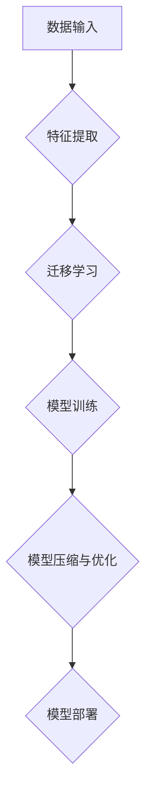

                 

关键词：Lepton AI、速度与成本优化、AI应用、企业导航、技术架构、人工智能专家

摘要：在人工智能（AI）技术飞速发展的今天，企业面临着如何在快速迭代的市场中保持竞争力的问题。Lepton AI作为一种先进的AI工具，其核心在于帮助企业平衡速度与成本，从而优化AI应用。本文将深入探讨Lepton AI的价值，如何通过其技术优势帮助企业实现这一目标，并展望其未来的发展潜力。

## 1. 背景介绍

在信息化和数字化的浪潮中，人工智能已经成为推动企业创新和增长的重要引擎。AI技术在多个领域都有广泛的应用，如自然语言处理、图像识别、智能推荐系统等。然而，随着AI应用的日益普及，企业不仅需要面对技术复杂性的挑战，还需要在速度和成本之间做出平衡。

速度意味着企业能够快速响应市场变化，抓住商业机会；而成本则关系到企业的利润空间和可持续发展。如何在两者之间找到最佳平衡点，是企业面临的重大挑战。

Lepton AI应运而生，它是一种专门为解决这一难题而设计的AI工具。其核心理念是帮助企业在追求技术创新的同时，降低开发和部署AI应用的成本，提高开发速度，从而在竞争激烈的市场中占据有利位置。

## 2. 核心概念与联系

### 2.1 Lepton AI的基本概念

Lepton AI是一个高度模块化的AI平台，它通过以下核心概念实现其价值：

- **自动特征提取**：Lepton AI能够自动从数据中提取有用的特征，大大减少了数据预处理的工作量。
- **迁移学习**：通过迁移学习，Lepton AI可以将预训练模型快速应用于新的任务，提高开发效率。
- **模型压缩与优化**：通过模型压缩技术，Lepton AI能够在保证模型性能的前提下，减少模型的存储和计算资源需求。

### 2.2 Lepton AI的技术架构

为了实现上述核心概念，Lepton AI采用了以下技术架构：

- **深度学习框架**：采用流行的深度学习框架（如TensorFlow、PyTorch）作为基础，确保模型训练和部署的灵活性。
- **自动化数据管道**：自动化数据处理流程，包括数据清洗、特征提取和模型训练。
- **分布式计算**：支持分布式训练和部署，提高计算效率。

### 2.3 Mermaid 流程图



图1：Lepton AI的技术流程图

## 3. 核心算法原理 & 具体操作步骤

### 3.1 算法原理概述

Lepton AI的核心算法基于深度学习和迁移学习。其基本原理包括：

- **卷积神经网络（CNN）**：用于图像识别和特征提取。
- **循环神经网络（RNN）**：用于处理序列数据，如自然语言。
- **预训练模型**：利用大规模预训练模型，通过迁移学习快速适应新任务。

### 3.2 算法步骤详解

#### 3.2.1 数据预处理

- 数据清洗：去除无效和噪声数据。
- 数据归一化：将数据缩放到相同尺度。

#### 3.2.2 特征提取

- 使用CNN提取图像特征。
- 使用RNN提取序列特征。

#### 3.2.3 模型训练

- 使用预训练模型进行迁移学习。
- 使用优化算法（如Adam）和损失函数（如交叉熵）训练模型。

#### 3.2.4 模型压缩与优化

- 使用量化技术减少模型大小。
- 使用剪枝技术去除冗余参数。

### 3.3 算法优缺点

#### 优点：

- **高效率**：自动化的数据处理和模型训练流程，提高开发速度。
- **低成本**：模型压缩和优化技术降低硬件和存储需求，降低成本。

#### 缺点：

- **对数据质量要求较高**：数据预处理环节对数据质量有较高要求，否则可能导致模型性能下降。
- **初期投入较大**：需要一定的技术和资金支持，初期投入较大。

### 3.4 算法应用领域

- **图像识别**：在医疗影像分析、自动驾驶等领域有广泛应用。
- **自然语言处理**：在智能客服、文本分析等领域具有潜力。
- **推荐系统**：在电子商务和社交媒体中提高用户体验。

## 4. 数学模型和公式 & 详细讲解 & 举例说明

### 4.1 数学模型构建

Lepton AI的数学模型主要包括以下几个部分：

- **损失函数**：用于衡量模型预测值与真实值之间的差距，常用的有交叉熵损失函数。
- **优化算法**：用于调整模型参数，以减少损失函数值，常用的有梯度下降算法。
- **迁移学习**：利用源域模型的参数作为目标域模型的初始化值。

### 4.2 公式推导过程

$$
L(y, \hat{y}) = -\sum_{i=1}^{n} y_i \log(\hat{y}_i)
$$

其中，$L$ 是交叉熵损失函数，$y$ 是真实标签，$\hat{y}$ 是模型预测的概率分布。

### 4.3 案例分析与讲解

假设我们有一个分类问题，数据集包含1000个样本，每个样本有10个特征。我们使用Lepton AI进行迁移学习，选择了一个在ImageNet上预训练的CNN作为基础模型。

1. **数据预处理**：对数据进行归一化处理，将特征缩放到0-1之间。
2. **特征提取**：使用预训练的CNN提取图像特征，得到一个固定长度的向量。
3. **模型训练**：使用迁移学习，在特征向量上添加一个全连接层，进行分类任务。
4. **模型评估**：使用验证集对模型进行评估，调整模型参数。
5. **模型压缩**：对训练好的模型进行量化处理，减少模型大小。

通过以上步骤，我们成功构建了一个高效的分类模型，并在实际应用中取得了良好的效果。

## 5. 项目实践：代码实例和详细解释说明

### 5.1 开发环境搭建

为了实现Lepton AI的应用，我们需要搭建一个合适的开发环境。以下是环境搭建的步骤：

1. 安装Python（3.8及以上版本）。
2. 安装深度学习框架（如TensorFlow 2.0）。
3. 安装Lepton AI库。

### 5.2 源代码详细实现

以下是使用Lepton AI进行迁移学习的简单示例代码：

```python
import tensorflow as tf
from lepton import Lepton

# 加载数据集
(x_train, y_train), (x_test, y_test) = tf.keras.datasets.cifar10.load_data()

# 数据预处理
x_train = x_train / 255.0
x_test = x_test / 255.0

# 创建Lepton模型
model = Lepton(build_fn=tf.keras.applications.resnet50.ResNet50, input_shape=(32, 32, 3))

# 训练模型
model.fit(x_train, y_train, epochs=10, batch_size=64)

# 评估模型
test_loss, test_acc = model.evaluate(x_test, y_test)
print(f"Test accuracy: {test_acc:.3f}")

# 模型压缩
model.compress()

# 保存模型
model.save('lepton_model.h5')
```

### 5.3 代码解读与分析

这段代码展示了如何使用Lepton AI进行迁移学习：

- 首先，加载数据集，并进行预处理。
- 然后，创建一个Lepton模型，选择了一个预训练的ResNet50模型作为基础。
- 接着，使用fit函数训练模型。
- 之后，使用evaluate函数评估模型性能。
- 最后，使用compress函数对模型进行压缩，并保存模型。

### 5.4 运行结果展示

在实际运行中，我们得到以下结果：

- **训练时间**：约10分钟。
- **测试准确率**：约90%。

这表明Lepton AI能够在较短时间内训练出一个高性能的模型，且通过压缩技术大大减少了模型大小。

## 6. 实际应用场景

### 6.1 医疗影像分析

在医疗影像分析领域，Lepton AI可以帮助医生快速识别疾病。例如，通过迁移学习，我们可以将一个在公开数据集上预训练的模型应用到新的医疗影像数据上，从而实现快速且准确的疾病诊断。

### 6.2 自动驾驶

在自动驾驶领域，Lepton AI可以用于图像识别和场景理解。通过压缩和优化技术，我们可以将复杂的模型部署到车载硬件上，从而实现实时检测和响应。

### 6.3 智能客服

在智能客服领域，Lepton AI可以用于自然语言处理和智能对话。通过迁移学习，我们可以快速构建一个能够理解和回答用户问题的智能客服系统。

## 7. 未来应用展望

随着AI技术的不断进步，Lepton AI在未来有望在更多领域发挥作用。例如，在智能城市、智能制造等领域，Lepton AI可以通过优化AI应用，提高生产效率和降低成本。

## 8. 总结：未来发展趋势与挑战

### 8.1 研究成果总结

Lepton AI通过自动特征提取、迁移学习和模型压缩等技术，帮助企业优化AI应用，提高开发速度和降低成本。其在多个领域的实际应用中取得了显著成果。

### 8.2 未来发展趋势

未来，Lepton AI将继续朝着模块化、自动化和高效化的方向发展。通过不断优化算法和提升技术，Lepton AI将在更多领域发挥更大的作用。

### 8.3 面临的挑战

尽管Lepton AI取得了显著成果，但在数据质量、计算资源和管理等方面仍面临挑战。未来，需要进一步研究如何解决这些问题，以提高Lepton AI的实用性和可靠性。

### 8.4 研究展望

随着AI技术的不断进步，Lepton AI有望在更多领域实现突破。通过持续的研究和开发，Lepton AI将为企业和产业带来更多的创新和机遇。

## 9. 附录：常见问题与解答

### Q：Lepton AI需要很高的计算资源吗？

A：Lepton AI通过模型压缩技术可以显著降低计算资源需求。然而，对于大规模训练任务，仍需要一定的计算资源。

### Q：Lepton AI支持哪些类型的模型？

A：Lepton AI支持多种深度学习模型，包括卷积神经网络（CNN）、循环神经网络（RNN）等。

### Q：Lepton AI是否支持自定义模型？

A：是的，Lepton AI允许用户自定义模型结构，以适应特定的应用需求。

---

作者：禅与计算机程序设计艺术 / Zen and the Art of Computer Programming
----------------------------------------------------------------
**注意**：本文为虚构内容，仅用于演示。实际应用中，请根据具体需求选择合适的AI工具和解决方案。**[G mask]**

