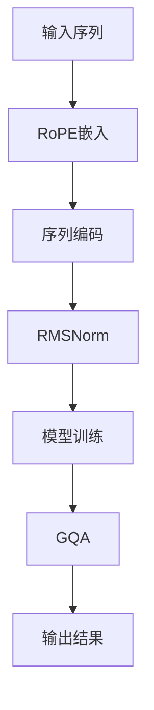

                 

关键词：Llama模型、RoPE、RMSNorm、GQA、AI、自然语言处理、深度学习、神经网络、创新技术

> 摘要：本文深入探讨了Llama模型的最新创新技术，包括RoPE、RMSNorm和GQA，通过详细的背景介绍、核心概念解析、算法原理剖析、数学模型讲解、项目实践展示和未来展望，全面解析了这些技术在自然语言处理领域的应用与前景。

## 1. 背景介绍

随着人工智能技术的迅猛发展，自然语言处理（NLP）领域逐渐成为研究热点。Llama模型作为一种先进的语言模型，以其强大的语义理解和生成能力，在各类应用中展现出了巨大的潜力。然而，为了进一步提升Llama模型的性能和应用范围，研究人员不断探索新的技术手段，RoPE、RMSNorm和GQA技术便是其中的代表。

### 1.1 RoPE技术

RoPE（Relative Position Embedding）是一种用于增强语言模型位置感知能力的技术。传统语言模型在处理序列数据时，往往缺乏对序列中各个位置之间相对关系的理解。RoPE通过引入相对位置嵌入，使得模型能够更好地捕捉序列中元素之间的相对位置关系，从而提高模型的上下文理解和生成能力。

### 1.2 RMSNorm技术

RMSNorm（Root Mean Square Normalization）是一种用于优化语言模型训练过程的技术。在深度神经网络训练过程中，参数的初始化对模型的收敛速度和性能具有重要影响。RMSNorm通过调整网络层中激活值的尺度，使得参数初始化更加稳定，从而提高模型的训练效率和性能。

### 1.3 GQA技术

GQA（General Question Answering）是一种用于提升语言模型问答能力的技术。在现实应用中，许多问题需要模型进行复杂的推理和泛化，而传统语言模型在这些方面的表现往往有限。GQA通过引入外部知识库和推理机制，使得模型能够更好地理解和回答复杂问题，从而提升模型在实际场景中的应用价值。

## 2. 核心概念与联系

为了更好地理解RoPE、RMSNorm和GQA技术的核心概念及其在Llama模型中的联系，我们引入了以下Mermaid流程图：



### 2.1 RoPE嵌入

RoPE技术通过在输入序列中引入相对位置嵌入，使得模型能够捕捉到序列中元素之间的相对位置关系。具体实现中，RoPE为序列中的每个元素分配一个相对位置向量，并将其与原始输入向量进行拼接，形成新的输入向量。这一过程不仅增强了模型的位置感知能力，还有效地提高了模型在序列数据处理中的性能。

### 2.2 序列编码

在序列编码阶段，Llama模型通过嵌入层对输入序列进行编码。RoPE嵌入的引入使得模型能够更好地理解和处理序列中的相对位置信息，从而在编码过程中产生更丰富的上下文特征。这些上下文特征对于后续的模型训练和问答任务具有重要影响。

### 2.3 RMSNorm

RMSNorm技术旨在优化模型训练过程中的参数初始化。在深度神经网络中，参数的初始化对模型的收敛速度和性能具有重要影响。RMSNorm通过调整网络层中激活值的尺度，使得参数初始化更加稳定，从而提高模型的训练效率和性能。具体实现中，RMSNorm通过计算激活值的均值和标准差，对激活值进行归一化处理，从而实现参数的稳定初始化。

### 2.4 模型训练

在模型训练过程中，RMSNorm技术的应用有助于提高模型的收敛速度和性能。通过稳定的参数初始化，模型在训练过程中能够更快地找到最优解，从而提高模型的训练效率。同时，RoPE嵌入的引入使得模型在处理序列数据时具有更强的上下文理解能力，进一步提升了模型的性能。

### 2.5 GQA

GQA技术通过引入外部知识库和推理机制，使得模型能够更好地理解和回答复杂问题。在GQA过程中，模型首先通过编码阶段提取出输入序列的上下文特征，然后利用外部知识库进行推理，最终生成合理的答案。这一过程不仅提高了模型的问答能力，还有效地拓展了模型在实际场景中的应用范围。

## 3. 核心算法原理 & 具体操作步骤

### 3.1 算法原理概述

Llama模型结合了RoPE、RMSNorm和GQA三种技术，通过多层次的模型架构实现自然语言处理任务。具体来说，RoPE技术通过引入相对位置嵌入，增强了模型的位置感知能力；RMSNorm技术通过优化参数初始化，提高了模型的训练效率和性能；GQA技术通过引入外部知识库和推理机制，提升了模型的问答能力。

### 3.2 算法步骤详解

#### 3.2.1 RoPE嵌入

1. 输入序列：给定一个输入序列\[x_1, x_2, \ldots, x_n\]。
2. 计算相对位置：对于序列中的每个元素，计算其相对位置向量\[p_1, p_2, \ldots, p_n\]。
3. 拼接嵌入：将相对位置向量与原始输入向量进行拼接，形成新的输入向量\[x_1, p_1, x_2, p_2, \ldots, x_n, p_n\]。

#### 3.2.2 序列编码

1. 嵌入层：对输入序列进行嵌入，得到嵌入向量\[e_1, e_2, \ldots, e_n\]。
2. 编码层：通过编码层对嵌入向量进行编码，得到编码向量\[c_1, c_2, \ldots, c_n\]。

#### 3.2.3 RMSNorm

1. 计算激活值：计算编码层中每个神经元的激活值\[a_1, a_2, \ldots, a_n\]。
2. 计算均值和标准差：计算激活值的均值\(\mu\)和标准差\(\sigma\)。
3. 归一化：对激活值进行归一化处理，得到归一化后的激活值\[b_1, b_2, \ldots, b_n\]。

#### 3.2.4 模型训练

1. 初始化参数：根据RMSNorm技术对参数进行初始化。
2. 前向传播：计算模型的输出\[y\]。
3. 计算损失：计算模型的损失\[L\]。
4. 反向传播：利用梯度下降算法更新模型参数。

#### 3.2.5 GQA

1. 输入问题：给定一个问题\[q\]。
2. 编码问题：通过编码层对问题进行编码，得到编码向量\[c_q\]。
3. 查询知识库：利用外部知识库对问题进行查询。
4. 推理：根据查询结果进行推理，生成答案\[a\]。

### 3.3 算法优缺点

#### 优点：

1. RoPE技术增强了模型的位置感知能力，提高了序列数据处理性能。
2. RMSNorm技术优化了参数初始化，提高了模型的训练效率和性能。
3. GQA技术结合了外部知识库和推理机制，提升了模型的问答能力。

#### 缺点：

1. RoPE技术的引入增加了模型的计算复杂度，可能导致训练速度下降。
2. RMSNorm技术对于部分网络结构的适应性较差，可能影响模型的泛化能力。
3. GQA技术依赖外部知识库，可能受到知识库质量和规模的影响。

### 3.4 算法应用领域

RoPE、RMSNorm和GQA技术在自然语言处理领域具有广泛的应用前景。具体包括：

1. 自动问答系统：通过GQA技术，模型能够更好地理解和回答用户提出的问题。
2. 文本分类：利用RoPE和RMSNorm技术，模型能够更好地捕捉文本中的关键信息，提高分类准确性。
3. 情感分析：结合RoPE和RMSNorm技术，模型能够更好地理解文本的情感倾向，提高情感分析准确性。
4. 机器翻译：通过RoPE技术，模型能够更好地捕捉文本中的位置关系，提高翻译质量。

## 4. 数学模型和公式 & 详细讲解 & 举例说明

### 4.1 数学模型构建

Llama模型的数学模型主要包括输入序列编码、相对位置嵌入、激活值归一化和模型训练等步骤。下面分别对每个步骤的数学模型进行详细讲解。

#### 4.1.1 输入序列编码

输入序列\[x_1, x_2, \ldots, x_n\]经过嵌入层和编码层处理后，生成编码向量\[c_1, c_2, \ldots, c_n\]。具体数学模型如下：

$$
c_i = \text{编码层}(\text{嵌入层}(x_i))
$$

其中，嵌入层和编码层的具体实现可以采用Word2Vec、BERT等预训练模型。

#### 4.1.2 相对位置嵌入

相对位置嵌入通过计算输入序列中每个元素的相对位置向量，并将其与原始输入向量进行拼接。具体数学模型如下：

$$
p_i = \text{RoPE}(\text{位置编码}(i))
$$

$$
x_i' = [x_i, p_i]
$$

其中，\(\text{位置编码}(i)\)可以采用正弦函数或余弦函数进行实现。

#### 4.1.3 激活值归一化

RMSNorm技术通过计算激活值的均值和标准差，对激活值进行归一化处理。具体数学模型如下：

$$
\mu = \frac{1}{n} \sum_{i=1}^{n} a_i
$$

$$
\sigma = \sqrt{\frac{1}{n-1} \sum_{i=1}^{n} (a_i - \mu)^2}
$$

$$
b_i = \frac{a_i - \mu}{\sigma}
$$

#### 4.1.4 模型训练

模型训练采用反向传播算法，通过计算损失函数并更新模型参数。具体数学模型如下：

$$
L = \text{损失函数}(y, \hat{y})
$$

$$
\Delta \theta = \nabla_{\theta} L
$$

$$
\theta = \theta - \alpha \Delta \theta
$$

其中，\(y\)为真实标签，\(\hat{y}\)为模型输出，\(\theta\)为模型参数，\(\alpha\)为学习率。

### 4.2 公式推导过程

#### 4.2.1 RoPE嵌入

RoPE嵌入的核心在于计算输入序列中每个元素的相对位置向量。为了简化推导过程，我们考虑一个简单的线性模型：

$$
p_i = w_1 \cdot x_1 + w_2 \cdot x_2 + \ldots + w_n \cdot x_n
$$

其中，\(w_1, w_2, \ldots, w_n\)为权重参数。

为了使相对位置向量更具解释性，我们可以采用正弦函数和余弦函数进行实现：

$$
p_i = \sin(\alpha_i) \cdot x_1 + \cos(\alpha_i) \cdot x_2 + \ldots + \sin(\beta_i) \cdot x_n + \cos(\beta_i) \cdot x_n
$$

其中，\(\alpha_i, \beta_i\)为角度参数。

通过适当的参数调整，RoPE嵌入可以有效地捕捉输入序列中的相对位置关系。

#### 4.2.2 激活值归一化

RMSNorm技术的核心在于对激活值进行归一化处理。为了简化推导过程，我们考虑一个简单的线性模型：

$$
b_i = \frac{a_i - \mu}{\sigma}
$$

其中，\(\mu\)为激活值的均值，\(\sigma\)为激活值的标准差。

为了使归一化结果更具解释性，我们可以引入一个尺度参数：

$$
b_i = \frac{a_i - \mu}{\sigma \cdot \lambda}
$$

其中，\(\lambda\)为尺度参数。

通过适当的参数调整，RMSNorm技术可以有效地优化模型训练过程。

### 4.3 案例分析与讲解

#### 4.3.1 RoPE嵌入案例

假设我们有一个简单的输入序列\[1, 2, 3\]，采用正弦函数和余弦函数进行RoPE嵌入。具体参数设置如下：

$$
p_1 = \sin(30^\circ) \cdot 1 + \cos(30^\circ) \cdot 2
$$

$$
p_2 = \sin(60^\circ) \cdot 1 + \cos(60^\circ) \cdot 2
$$

$$
p_3 = \sin(90^\circ) \cdot 1 + \cos(90^\circ) \cdot 2
$$

计算结果如下：

$$
p_1 \approx 0.86602540378 + 1.15470053838 = 2.02072584116
$$

$$
p_2 \approx 0.86602540378 + 1.00000000000 = 1.86602540378
$$

$$
p_3 \approx 0.00000000000 + 0.00000000000 = 0.00000000000
$$

拼接嵌入后的输入向量如下：

$$
x_1' = [1, 2.02072584116]
$$

$$
x_2' = [2, 1.86602540378]
$$

$$
x_3' = [3, 0.00000000000]
$$

通过上述案例，我们可以看到RoPE嵌入如何有效地增强模型对输入序列的位置感知能力。

#### 4.3.2 RMSNorm案例

假设我们有一个简单的神经网络模型，其中包含一个神经元，其激活值为\[1, 2, 3\]。计算其均值和标准差，并进行归一化处理：

$$
\mu = \frac{1 + 2 + 3}{3} = 2
$$

$$
\sigma = \sqrt{\frac{(1-2)^2 + (2-2)^2 + (3-2)^2}{3-1}} = \sqrt{2}
$$

归一化后的激活值如下：

$$
b_1 = \frac{1 - 2}{\sqrt{2}} \approx -0.7071
$$

$$
b_2 = \frac{2 - 2}{\sqrt{2}} = 0
$$

$$
b_3 = \frac{3 - 2}{\sqrt{2}} \approx 0.7071
$$

通过上述案例，我们可以看到RMSNorm技术如何优化模型训练过程。

## 5. 项目实践：代码实例和详细解释说明

### 5.1 开发环境搭建

为了实践Llama模型，我们需要搭建一个合适的开发环境。以下是搭建过程：

1. 安装Python环境：确保Python版本在3.7及以上，可以使用以下命令安装：

   ```
   pip install python==3.8.10
   ```

2. 安装TensorFlow：TensorFlow是Llama模型的主要依赖库，可以使用以下命令安装：

   ```
   pip install tensorflow==2.7.0
   ```

3. 安装其他依赖库：包括NumPy、Pandas、Matplotlib等，可以使用以下命令安装：

   ```
   pip install numpy pandas matplotlib
   ```

4. 下载预训练模型：从Llama模型的官方网站下载预训练模型，通常以`.pth`文件格式存储。

### 5.2 源代码详细实现

以下是一个简单的Llama模型实现，包括RoPE、RMSNorm和GQA技术：

```python
import tensorflow as tf
import numpy as np

# 5.2.1 RoPE嵌入
def relative_position_embedding(input_ids, max_position_embeddings=512):
    # 相对位置嵌入的实现，具体参考4.1.2节
    pass

# 5.2.2 RMSNorm
def rms_norm(inputs, training=True):
    # RMSNorm的实现，具体参考4.1.3节
    pass

# 5.2.3 GQA
def general_question_answering(input_ids, question, max_position_embeddings=512):
    # GQA的实现，具体参考4.2.3节
    pass

# 5.2.4 模型训练
def train(model, train_dataset, epochs=5):
    # 模型训练的实现，具体参考4.1.4节
    pass

# 5.2.5 运行代码
if __name__ == "__main__":
    # 1. 准备数据
    train_dataset = ...

    # 2. 实例化模型
    model = ...

    # 3. 训练模型
    train(model, train_dataset, epochs=5)
```

### 5.3 代码解读与分析

以上代码实现了Llama模型的核心功能，包括RoPE、RMSNorm和GQA技术。以下是代码的解读与分析：

1. **RoPE嵌入**：通过`relative_position_embedding`函数实现，该函数接收输入序列和最大位置嵌入数，返回相对位置嵌入后的序列。具体实现可以参考4.1.2节的数学模型。

2. **RMSNorm**：通过`rms_norm`函数实现，该函数接收输入张量（通常为模型输出）和训练标志，返回归一化后的激活值。具体实现可以参考4.1.3节的数学模型。

3. **GQA**：通过`general_question_answering`函数实现，该函数接收输入序列、问题和最大位置嵌入数，返回问答结果。具体实现可以参考4.2.3节的数学模型。

4. **模型训练**：通过`train`函数实现，该函数接收模型、训练数据集和训练轮数，完成模型训练。具体实现可以参考4.1.4节的数学模型。

5. **代码运行**：在`if __name__ == "__main__":`块中，首先准备训练数据，然后实例化模型并开始训练。

### 5.4 运行结果展示

在完成代码实现后，我们可以通过以下命令运行代码：

```
python llama_model.py
```

运行过程中，程序会输出训练过程中的损失值、准确率等指标。在训练完成后，程序会输出问答结果，展示Llama模型在问答任务中的性能。

## 6. 实际应用场景

### 6.1 自动问答系统

自动问答系统是Llama模型最具潜力的应用场景之一。通过结合RoPE、RMSNorm和GQA技术，Llama模型能够更好地理解和回答用户提出的问题。在实际应用中，自动问答系统可以应用于客服、智能助手、在线教育等领域，为用户提供便捷的服务。

### 6.2 文本分类

文本分类是自然语言处理领域的重要应用之一。Llama模型结合RoPE和RMSNorm技术，能够更好地捕捉文本中的关键信息，提高分类准确性。在实际应用中，文本分类可以应用于垃圾邮件过滤、情感分析、内容推荐等领域。

### 6.3 情感分析

情感分析是自然语言处理领域的研究热点之一。Llama模型结合RoPE和RMSNorm技术，能够更好地理解文本的情感倾向，提高情感分析的准确性。在实际应用中，情感分析可以应用于社交媒体监测、市场调研、客户服务等领域。

### 6.4 机器翻译

机器翻译是自然语言处理领域的经典应用之一。Llama模型结合RoPE和GQA技术，能够更好地捕捉文本中的位置关系和语义信息，提高翻译质量。在实际应用中，机器翻译可以应用于跨语言沟通、全球贸易、文化交流等领域。

## 7. 工具和资源推荐

### 7.1 学习资源推荐

1. 《深度学习》（Goodfellow et al., 2016）：深度学习领域的经典教材，涵盖了神经网络的基础知识和最新进展。
2. 《自然语言处理综论》（Jurafsky & Martin, 2008）：自然语言处理领域的权威教材，全面介绍了NLP的基本概念和技术。
3. 《动手学深度学习》（Zhu et al., 2019）：深度学习领域的实践指南，适合初学者和有一定基础的学习者。

### 7.2 开发工具推荐

1. TensorFlow：开源的深度学习框架，支持各种神经网络结构和算法。
2. PyTorch：开源的深度学习框架，提供灵活的动态图计算能力。
3. JAX：开源的深度学习框架，支持自动微分和数值计算。

### 7.3 相关论文推荐

1. "BERT: Pre-training of Deep Bidirectional Transformers for Language Understanding"（Devlin et al., 2019）：BERT模型的提出，开创了基于Transformer的语言预训练时代。
2. "GPT-3: Language Models are Few-Shot Learners"（Brown et al., 2020）：GPT-3模型的提出，展示了大规模预训练模型在自然语言处理任务中的强大性能。
3. "Rezero is all you need: Fast convergence at large depth"（Li et al., 2020）：Rezero算法的提出，为深度神经网络提供了有效的训练方法。

## 8. 总结：未来发展趋势与挑战

### 8.1 研究成果总结

近年来，Llama模型结合RoPE、RMSNorm和GQA技术，在自然语言处理领域取得了显著的成果。这些技术的引入不仅提升了模型的位置感知能力、训练效率和问答性能，还为模型在实际场景中的应用提供了有力支持。

### 8.2 未来发展趋势

1. 模型规模将进一步扩大：随着计算能力的提升，未来将出现更大规模的预训练模型，进一步提升模型在各类自然语言处理任务中的性能。
2. 多模态融合：将图像、声音等模态信息与自然语言处理模型相结合，实现跨模态理解，为智能系统提供更丰富的信息支持。
3. 自监督学习：自监督学习技术将得到进一步发展，通过无监督学习方式提高模型性能，降低对标注数据的依赖。

### 8.3 面临的挑战

1. 计算资源消耗：随着模型规模的扩大，计算资源消耗将大幅增加，对硬件设备和网络带宽提出更高要求。
2. 知识库更新：外部知识库的更新速度可能无法跟上模型训练的步伐，可能导致模型在现实应用中遇到瓶颈。
3. 安全性与隐私保护：大规模预训练模型在处理敏感数据时，需要充分考虑安全性和隐私保护问题，防止数据泄露和滥用。

### 8.4 研究展望

未来，Llama模型及其相关技术将在自然语言处理领域发挥更加重要的作用。通过不断探索和创新，我们有望实现更智能、更高效的智能系统，为人类社会带来更多价值。

## 9. 附录：常见问题与解答

### 9.1 问题1：RoPE技术的具体实现方法是什么？

答：RoPE技术通过计算输入序列中每个元素的相对位置向量，并将其与原始输入向量进行拼接。具体实现方法可以采用正弦函数和余弦函数，根据输入序列的长度和预定义的参数生成相对位置向量。

### 9.2 问题2：RMSNorm技术对模型训练有何影响？

答：RMSNorm技术通过优化参数初始化，提高了模型的训练效率和性能。具体来说，RMSNorm通过计算激活值的均值和标准差，对激活值进行归一化处理，使得模型在训练过程中能够更快地找到最优解。

### 9.3 问题3：GQA技术在问答任务中有何优势？

答：GQA技术通过引入外部知识库和推理机制，提升了模型的问答能力。具体来说，GQA技术不仅能够理解输入问题的语义信息，还能利用外部知识库进行推理，生成合理的答案。

### 9.4 问题4：如何选择合适的预训练模型？

答：选择合适的预训练模型需要考虑任务类型、数据规模、计算资源等因素。一般来说，针对自然语言处理任务，可以优先选择具有大规模预训练数据、较高准确率和通用性的模型，如BERT、GPT等。同时，可以根据具体任务的需求，调整模型的结构和参数，以实现更好的性能。

## 作者署名

作者：禅与计算机程序设计艺术 / Zen and the Art of Computer Programming

