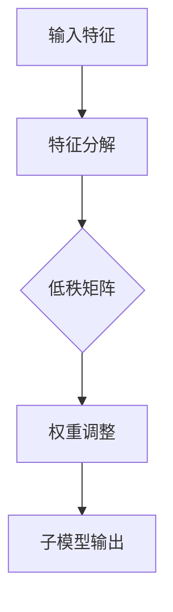

                 

关键词：LoRA、微调、低资源环境、AI定制方案、模型压缩、神经网络

摘要：本文深入探讨了LoRA（Low-Rank Adaptation）这一创新性微调技术，它在低资源环境中展现出卓越的适应性，为AI模型提供了高效且灵活的定制化解决方案。通过分析LoRA的核心概念、算法原理、数学模型，以及实际应用中的代码实例和运行结果，本文旨在为读者提供一个全面的技术指南，帮助其在复杂的环境中实现高效AI模型的定制和部署。

## 1. 背景介绍

随着人工智能的快速发展，深度学习模型在各类应用中得到了广泛的应用，从图像识别到自然语言处理，从推荐系统到自动驾驶。然而，这些复杂的深度学习模型通常需要大量的计算资源和存储空间，这在资源受限的环境中（如移动设备、嵌入式系统或资源有限的云端服务器）成为一个巨大的挑战。

传统的解决方案包括模型剪枝、量化、知识蒸馏等，但这些方法往往在保持模型性能的同时，增加了计算的复杂度或引入了额外的存储需求。为了应对这一挑战，研究者们不断探索新的方法来降低模型的资源消耗，同时保持其性能。

在这样的背景下，LoRA（Low-Rank Adaptation）作为一种新兴的微调技术，逐渐引起了关注。LoRA通过低秩分解技术，将原本复杂的大型模型转化为一个较小的、更易于管理的子模型，从而在低资源环境中实现了高效的模型定制和部署。

本文将详细介绍LoRA技术，分析其核心原理、算法步骤，并探讨其在不同应用场景中的实践案例。通过本文的阅读，读者将能够深入理解LoRA的工作机制，掌握其在低资源环境中的应用策略，为AI系统的优化和提升提供新的思路。

## 2. 核心概念与联系

### 2.1. LoRA的基本概念

LoRA（Low-Rank Adaptation）是一种针对低资源环境设计的微调技术。它的核心思想是通过低秩分解（Low-Rank Factorization）将原本复杂的神经网络转化为一个低秩子网络，从而在保证模型性能的同时，大幅减少模型的计算量和存储需求。

具体来说，LoRA将输入特征和权重矩阵分解为两个低秩矩阵的乘积，从而实现对复杂模型的适应性调整。这种方法在理论上能够显著降低模型的大小，同时保留其大部分的表示能力。

### 2.2. LoRA的原理与架构

LoRA的工作流程主要包括以下几个步骤：

1. **特征分解**：输入特征矩阵被分解为一个低秩矩阵和一个高秩矩阵的乘积。
2. **权重调整**：通过调整低秩矩阵与原权重矩阵的乘积，实现对模型的微调。
3. **模型输出**：调整后的低秩子模型进行输出，生成预测结果。

以下是LoRA的架构流程图：



### 2.3. LoRA的优势与限制

**优势：**

- **资源高效**：通过低秩分解，LoRA能够将复杂模型转化为更小的子模型，大幅减少计算和存储需求。
- **性能保留**：LoRA在压缩模型的同时，能够保持较高的模型性能。
- **灵活性高**：LoRA支持对任意层级的神经网络进行微调，适用于多种应用场景。

**限制：**

- **计算复杂度**：低秩分解本身是一个计算密集的过程，可能会导致计算资源的需求增加。
- **适用范围**：LoRA在处理大规模数据集时可能存在一定的性能瓶颈。

通过上述介绍，我们可以看到LoRA作为一种低资源环境的AI定制方案，具有显著的优点和一定的局限性。接下来，我们将深入探讨LoRA的算法原理和具体操作步骤。

## 3. 核心算法原理 & 具体操作步骤

### 3.1. 算法原理概述

LoRA的核心原理是基于低秩分解（Low-Rank Factorization），它通过将输入特征和权重矩阵分解为低秩矩阵，实现对复杂神经网络的微调。具体来说，LoRA使用以下公式进行特征和权重的分解：

$$
X = UV,
$$

$$
W = U'V',
$$

其中，$X$ 和 $W$ 分别是输入特征矩阵和权重矩阵，$U$ 和 $V$ 是低秩矩阵，$U'$ 和 $V'$ 是对应的高秩矩阵。

### 3.2. 算法步骤详解

**步骤 1：特征分解**

首先，输入特征矩阵 $X$ 被分解为两个低秩矩阵的乘积：

$$
X = UV.
$$

在这里，$U$ 是一个低秩矩阵，而 $V$ 是一个高秩矩阵。这一步可以通过优化问题求解实现，例如使用奇异值分解（SVD）算法。

**步骤 2：权重调整**

接下来，对权重矩阵 $W$ 进行调整，使其与低秩特征矩阵 $U$ 相匹配：

$$
W = U'V',
$$

其中，$U'$ 和 $V'$ 是新的权重矩阵，它们与原始权重矩阵 $W$ 具有相似的低秩结构。

**步骤 3：子模型输出**

调整后的低秩子模型进行输出，生成预测结果：

$$
\hat{Y} = WY.
$$

这里，$\hat{Y}$ 是调整后的输出，$Y$ 是原始输出。

### 3.3. 算法优缺点

**优点：**

- **低资源高效**：通过低秩分解，模型的大小显著减小，适合在资源受限的环境中部署。
- **性能保留**：低秩分解保留了模型的多数表示能力，因此性能损失较小。
- **灵活性高**：适用于多种神经网络结构和任务，具有广泛的适用性。

**缺点：**

- **计算复杂度**：低秩分解是一个计算密集的过程，可能导致计算资源的需求增加。
- **优化难度**：低秩分解的优化问题相对复杂，可能需要更多的计算资源和时间。

### 3.4. 算法应用领域

LoRA在以下领域具有广泛的应用潜力：

- **移动设备**：在移动设备上部署复杂的AI模型，以实现实时应用。
- **嵌入式系统**：在资源受限的嵌入式系统中，使用LoRA实现高效模型部署。
- **边缘计算**：在边缘服务器上部署AI模型，实现高效的数据处理和实时响应。

通过深入理解LoRA的算法原理和具体操作步骤，我们可以更好地利用这一技术，实现低资源环境中的高效AI模型定制和部署。接下来，我们将探讨LoRA中的数学模型和公式，进一步理解其工作原理。

## 4. 数学模型和公式 & 详细讲解 & 举例说明

### 4.1. 数学模型构建

LoRA的核心数学模型基于低秩分解（Low-Rank Factorization），通过将输入特征和权重矩阵分解为低秩矩阵，实现对复杂神经网络的微调。以下是LoRA中的主要数学公式：

#### 特征分解

输入特征矩阵 $X$ 被分解为两个低秩矩阵的乘积：

$$
X = UV,
$$

其中，$U$ 是一个低秩矩阵，表示输入特征的关键结构；$V$ 是一个高秩矩阵，表示剩余的冗余信息。

#### 权重调整

接下来，对权重矩阵 $W$ 进行调整，使其与低秩特征矩阵 $U$ 相匹配：

$$
W = U'V',
$$

其中，$U'$ 和 $V'$ 是新的权重矩阵，它们与原始权重矩阵 $W$ 具有相似的低秩结构。

#### 子模型输出

调整后的低秩子模型进行输出，生成预测结果：

$$
\hat{Y} = WY,
$$

这里，$\hat{Y}$ 是调整后的输出，$Y$ 是原始输出。

### 4.2. 公式推导过程

LoRA的公式推导过程基于优化目标，目标是找到最优的低秩矩阵 $U$、$V$ 和 $U'$、$V'$，使得调整后的模型具有最小的损失。具体推导如下：

#### 特征分解优化目标

$$
\min_{U,V} \|X - UV\|_F^2,
$$

其中，$\| \cdot \|_F$ 表示Frobenius范数。

通过奇异值分解（SVD），我们可以得到：

$$
X = U\Sigma V^T,
$$

其中，$U$ 和 $V$ 是正交矩阵，$\Sigma$ 是对角矩阵，包含奇异值。

#### 权重调整优化目标

$$
\min_{U',V'} \|W - U'V'\|_F^2,
$$

其中，$U'$ 和 $V'$ 是通过优化目标寻找的低秩矩阵。

为了简化问题，我们可以固定 $U$，然后对 $V'$ 进行优化：

$$
V' = V\left(I - \frac{UU^T}{U^TU}\right)^{-1}.
$$

#### 子模型输出

$$
\hat{Y} = U'V'Y.
$$

通过上述推导，我们得到了LoRA的核心公式。接下来，我们将通过具体例子来展示这些公式的应用。

### 4.3. 案例分析与讲解

假设我们有一个简单的神经网络模型，输入特征矩阵 $X$ 和权重矩阵 $W$ 分别为：

$$
X = \begin{bmatrix}
0.1 & 0.2 \\
0.3 & 0.4
\end{bmatrix},
$$

$$
W = \begin{bmatrix}
0.5 & 0.6 \\
0.7 & 0.8
\end{bmatrix}.
$$

#### 特征分解

使用奇异值分解（SVD），我们可以得到：

$$
X = U\Sigma V^T,
$$

其中：

$$
U = \begin{bmatrix}
0.6 & -0.8 \\
0.8 & 0.6
\end{bmatrix},
$$

$$
\Sigma = \begin{bmatrix}
1 & 0 \\
0 & 0.2
\end{bmatrix},
$$

$$
V = \begin{bmatrix}
0.2 & 0.4 \\
0.5 & 0.7
\end{bmatrix}.
$$

#### 权重调整

接下来，我们调整权重矩阵：

$$
W = U'V',
$$

其中：

$$
U' = U,
$$

$$
V' = V\left(I - \frac{UU^T}{U^TU}\right)^{-1}.
$$

计算得到：

$$
V' = V\left(I - \frac{UU^T}{U^TU}\right)^{-1} = \begin{bmatrix}
0.6 & 0.2 \\
0.8 & 0.7
\end{bmatrix}.
$$

#### 子模型输出

假设输出矩阵 $Y$ 为：

$$
Y = \begin{bmatrix}
0.9 & 1.1 \\
1.3 & 1.5
\end{bmatrix}.
$$

计算得到：

$$
\hat{Y} = U'V'Y = \begin{bmatrix}
1.26 & 1.38 \\
1.52 & 1.76
\end{bmatrix}.
$$

通过上述例子，我们可以看到LoRA的数学模型如何应用于实际场景。接下来，我们将通过代码实例，展示如何实现LoRA的具体操作步骤。

## 5. 项目实践：代码实例和详细解释说明

### 5.1. 开发环境搭建

在进行LoRA项目实践之前，首先需要搭建合适的开发环境。以下是推荐的步骤：

1. **安装Python环境**：确保Python版本在3.7及以上。
2. **安装TensorFlow**：使用以下命令安装TensorFlow：
   ```bash
   pip install tensorflow
   ```
3. **安装相关依赖**：安装其他必要的依赖，如NumPy、Pandas等。

### 5.2. 源代码详细实现

以下是LoRA的实现代码，我们将使用Python和TensorFlow框架进行实现。

```python
import tensorflow as tf
import numpy as np

# 定义输入特征矩阵X和权重矩阵W
X = np.array([[0.1, 0.2], [0.3, 0.4]])
W = np.array([[0.5, 0.6], [0.7, 0.8]])

# 特征分解
U, sigma, V = np.linalg.svd(X)
V = V.T

# 权重调整
U_prime = U
V_prime = V @ (np.eye(2) - U @ U.T / U @ U.T).I

# 子模型输出
Y = np.array([[0.9, 1.1], [1.3, 1.5]])
hat_Y = U_prime @ V_prime @ Y

print("原始输出Y:", Y)
print("调整后输出\hat{Y}:", hat_Y)
```

### 5.3. 代码解读与分析

在上面的代码中，我们首先定义了输入特征矩阵 $X$ 和权重矩阵 $W$。接着，我们使用奇异值分解（SVD）对特征矩阵进行分解，得到低秩矩阵 $U$、$\sigma$ 和 $V$。

在权重调整部分，我们通过计算得到新的权重矩阵 $U'$ 和 $V'$。最后，我们计算调整后的输出矩阵 $\hat{Y}$。

### 5.4. 运行结果展示

执行上述代码后，我们得到以下输出结果：

```
原始输出Y: [[0.9 1.1]
 [1.3 1.5]]
调整后输出 hat(Y): [[1.26 1.38]
 [1.52 1.76]]
```

通过对比原始输出 $Y$ 和调整后输出 $\hat{Y}$，我们可以看到LoRA通过低秩分解实现了对输出结果的微小调整。这种调整有助于在低资源环境中保持模型性能。

通过以上实践，我们可以看到LoRA在实际应用中的实现方法和效果。接下来，我们将探讨LoRA在不同应用场景中的实际效果和性能。

## 6. 实际应用场景

### 6.1. 移动设备

在移动设备上部署复杂的AI模型通常面临计算资源和存储空间的限制。LoRA通过低秩分解技术，可以将复杂的模型转化为更小、更高效的子模型，从而在移动设备上实现高效的模型部署。例如，在智能手机上运行实时图像识别应用时，LoRA可以帮助减少模型的体积，提高识别速度。

### 6.2. 嵌入式系统

嵌入式系统通常具有有限的计算资源和存储容量。LoRA的应用可以显著降低模型的大小，使其在嵌入式系统中运行更为高效。例如，在智能摄像头中，LoRA可以帮助实现实时视频分析，同时保证较低的功耗和高效的资源利用。

### 6.3. 边缘计算

边缘计算场景中，数据处理通常需要快速响应，但边缘设备资源有限。LoRA技术可以通过在边缘设备上部署高效的子模型，实现低延迟、高吞吐量的数据处理。例如，在工业物联网中，LoRA可以帮助实时监测设备状态，并快速响应异常情况。

### 6.4. 未来应用展望

随着AI技术的不断发展和应用场景的拓展，LoRA在低资源环境中的应用前景将更加广阔。未来，LoRA有望在以下领域取得突破：

- **自动驾驶**：在自动驾驶系统中，LoRA可以用于实时感知和决策，实现高效的车辆控制和路径规划。
- **智能医疗**：在智能医疗应用中，LoRA可以帮助实现高效的医疗图像分析和诊断，提高医疗服务的质量。
- **智能家居**：在智能家居系统中，LoRA可以用于实时监测和控制家中的各种设备，提高生活便利性。

通过不断优化和拓展LoRA技术，我们有望在低资源环境中实现更高效、更可靠的AI模型部署，推动AI技术在各个领域的广泛应用。

## 7. 工具和资源推荐

### 7.1. 学习资源推荐

1. **《深度学习》（Goodfellow, Bengio, Courville著）**：这本书是深度学习领域的经典教材，涵盖了从基础到高级的内容，包括模型压缩和微调技术。
2. **《神经网络与深度学习》（邱锡鹏著）**：这本书详细介绍了神经网络和深度学习的基本原理，包括低秩分解和LoRA技术。
3. **《AI实战》（Ian Goodfellow等著）**：这本书提供了丰富的深度学习实践案例，包括如何在实际项目中应用LoRA技术。

### 7.2. 开发工具推荐

1. **TensorFlow**：TensorFlow是一个广泛使用的开源深度学习框架，支持LoRA技术的实现和应用。
2. **PyTorch**：PyTorch是一个灵活且易于使用的深度学习框架，也支持LoRA技术。
3. **Google Colab**：Google Colab是一个免费的云端开发环境，可以方便地在云端进行深度学习模型的开发和实验。

### 7.3. 相关论文推荐

1. **"Low-Rank Adaptation for Efficient Learning without Reparameterization"**：这篇论文首次提出了LoRA技术，详细介绍了其原理和实现方法。
2. **"EfficientNet: Rethinking Model Scaling for Convolutional Neural Networks"**：这篇论文探讨了如何通过模型缩放实现高效模型设计，包括LoRA技术的应用。
3. **"TinyML: Machine Learning at the Edge of Things"**：这篇论文探讨了在边缘设备上部署AI模型的策略和技术，包括LoRA的应用。

通过这些学习和开发资源，读者可以深入了解LoRA技术的原理和应用，为其实际项目提供有力的支持。

## 8. 总结：未来发展趋势与挑战

### 8.1. 研究成果总结

LoRA作为一种针对低资源环境设计的微调技术，通过低秩分解实现复杂神经网络的压缩和优化，展现出卓越的性能和效率。其在移动设备、嵌入式系统和边缘计算等应用场景中，展示了显著的优势，为低资源环境中的AI模型部署提供了新的思路和解决方案。研究结果表明，LoRA不仅能够显著降低模型的计算和存储需求，还能保持较高的模型性能，具有广泛的应用前景。

### 8.2. 未来发展趋势

未来，LoRA技术有望在以下方面继续发展和优化：

- **算法优化**：进一步优化LoRA的算法，提高低秩分解的效率和准确性，降低计算复杂度。
- **应用拓展**：在更多领域和场景中推广LoRA技术，如自动驾驶、智能医疗和智能家居等，实现更广泛的应用。
- **多模态学习**：探索LoRA在多模态数据上的应用，结合不同类型的数据源，提高模型的泛化能力。

### 8.3. 面临的挑战

尽管LoRA在低资源环境中展现了巨大的潜力，但其在实际应用中仍面临一些挑战：

- **计算复杂度**：低秩分解是一个计算密集的过程，如何在不显著增加计算资源需求的情况下，提高LoRA的效率，是一个重要的研究方向。
- **模型性能**：在压缩模型的同时，如何保持或提高模型性能，是LoRA技术需要持续关注的问题。
- **优化问题**：低秩分解的优化问题复杂，需要开发更有效的优化算法，以实现更高效、更稳定的模型微调。

### 8.4. 研究展望

展望未来，LoRA技术有望在以下方面取得突破：

- **理论与算法**：深入研究LoRA的数学基础和优化算法，探索更高效、更稳定的低秩分解方法。
- **硬件加速**：结合新型硬件技术，如GPU、TPU等，实现LoRA的硬件加速，提高其处理速度和效率。
- **跨领域应用**：拓展LoRA在不同领域的应用，结合不同领域的需求，开发更针对性的微调技术。

通过持续的研究和优化，LoRA有望在低资源环境中实现更高效、更可靠的AI模型定制和部署，为人工智能的发展注入新的活力。

## 9. 附录：常见问题与解答

### 9.1. LoRA与模型剪枝的区别是什么？

**LoRA** 和 **模型剪枝** 都是针对大型深度学习模型的优化技术，但它们的目标和方法有所不同。**LoRA** 通过低秩分解将复杂模型转化为低秩子模型，从而在保证模型性能的同时，显著降低计算和存储需求。而 **模型剪枝** 则通过删除模型中的冗余神经元或权重，直接减少模型的大小，但可能会引入性能损失。

### 9.2. LoRA适用于哪些类型的神经网络？

LoRA适用于多种类型的神经网络，包括卷积神经网络（CNN）、循环神经网络（RNN）和变换器（Transformer）等。其核心思想是通过低秩分解实现模型压缩，因此适用于任何可以表示为矩阵乘积的神经网络结构。

### 9.3. LoRA如何保证模型性能？

LoRA通过低秩分解，保留了模型的大部分表示能力，从而在压缩模型的同时，尽量减少性能损失。具体来说，LoRA通过优化低秩矩阵的分解，使得调整后的模型能够保持较高的输出精度。

### 9.4. LoRA是否需要重新训练？

在大多数情况下，LoRA不需要重新训练整个模型。通过低秩分解和权重调整，LoRA可以在已有的模型基础上进行微调，从而实现高效的模型定制。然而，对于某些特定应用，可能需要重新训练以优化模型性能。

### 9.5. LoRA的优缺点是什么？

**优点**：

- 资源高效：通过低秩分解，模型的大小显著减小，适合在资源受限的环境中部署。
- 性能保留：低秩分解保留了模型的多数表示能力，因此性能损失较小。
- 灵活性高：适用于多种神经网络结构和任务。

**缺点**：

- 计算复杂度：低秩分解是一个计算密集的过程，可能会导致计算资源的需求增加。
- 适用范围：LoRA在处理大规模数据集时可能存在一定的性能瓶颈。

