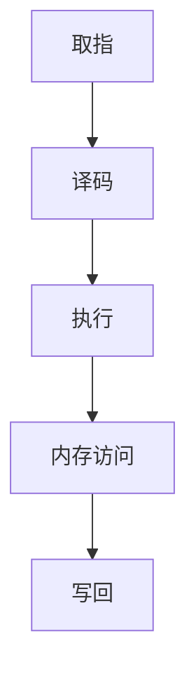
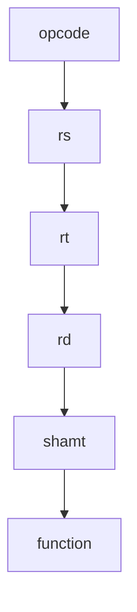

                 

在计算机体系结构领域，MIPS（Microprocessor without Interlocked Pipeline Stages）处理器因其简洁的设计和高效的指令集而备受关注。本文将深入探讨MIPS处理器的特性及其优化方法，以期为读者提供全面的技术指导。

> **关键词**：MIPS处理器，指令集，优化，流水线，性能提升

> **摘要**：本文首先介绍MIPS处理器的基本特性，包括其架构设计、指令集架构（ISA）和流水线技术。随后，我们讨论MIPS处理器优化的多种策略，从指令级并行性、流水线平衡到功耗优化。文章最后总结MIPS处理器在当前和未来应用中的趋势和挑战。

## 1. 背景介绍

MIPS处理器是由MIPS Technologies公司开发的一种精简指令集计算机（RISC）处理器。自1980年代初推出以来，MIPS处理器因其高效率、简洁性和低成本而广泛应用于嵌入式系统、网络设备和工业控制等领域。MIPS处理器的设计理念是简化指令集，减少指令执行时间，并通过流水线技术提高指令吞吐率。

MIPS处理器的核心架构包括寄存器文件、ALU（算术逻辑单元）、控制单元和流水线。它的指令集架构简单，指令长度固定，具有明确的执行周期，这使得流水线实现变得相对容易。然而，随着应用需求的不断增长，MIPS处理器的性能和功耗问题日益凸显，促使研究人员和开发者探索新的优化策略。

## 2. 核心概念与联系

### 2.1 MIPS处理器架构

MIPS处理器采用五级流水线架构，包括取指、译码、执行、内存访问和写回阶段。以下是一个简化的Mermaid流程图，展示了MIPS处理器的流水线流程。



### 2.2 指令集架构（ISA）

MIPS处理器的指令集包括数据传输指令、算术逻辑指令、控制指令和特殊指令。以下是一个示例，展示了MIPS指令集的基本格式和操作。



其中，opcode指定指令类型，rs、rt和rd指定寄存器编号，shamt和function分别用于指定移位操作的数量和特定指令的操作。

## 3. 核心算法原理 & 具体操作步骤

### 3.1 算法原理概述

MIPS处理器的优化主要集中在提高指令级并行性、流水线平衡和功耗控制。以下是一些核心算法原理：

- **指令级并行性**：通过指令重排和软件 pipelining，最大化利用处理器资源，减少执行时间。
- **流水线平衡**：通过动态调度技术，平衡各流水线阶段的负载，提高吞吐率。
- **功耗优化**：通过调整流水线长度、时钟频率和动态电压调整，降低处理器功耗。

### 3.2 算法步骤详解

#### 3.2.1 指令级并行性优化

1. **指令重排**：对程序中的指令进行重排，以减少数据依赖和冲突。
2. **软件 pipelining**：将循环程序分割成多个阶段，每个阶段执行不同的指令，以提高并行度。

#### 3.2.2 流水线平衡优化

1. **动态调度**：根据实时负载，动态调整指令调度顺序，平衡各流水线阶段的负载。
2. **资源重用**：优化资源分配，减少资源冲突，提高资源利用率。

#### 3.2.3 功耗优化

1. **流水线长度调整**：根据应用场景，调整流水线长度，以降低功耗。
2. **动态电压调整**：根据处理器负载，动态调整电压和时钟频率，实现功耗优化。

### 3.3 算法优缺点

- **指令级并行性优化**：提高了处理器的性能，但增加了编译器和程序设计的复杂性。
- **流水线平衡优化**：提高了吞吐率和资源利用率，但增加了硬件实现的复杂性。
- **功耗优化**：降低了功耗，但可能影响处理器的性能和稳定性。

### 3.4 算法应用领域

MIPS处理器的优化算法广泛应用于嵌入式系统、网络设备和工业控制等领域。通过优化，MIPS处理器可以更好地满足这些领域的性能和功耗要求。

## 4. 数学模型和公式 & 详细讲解 & 举例说明

### 4.1 数学模型构建

MIPS处理器的优化可以建模为优化问题，如最小化执行时间、最大吞吐率或最小功耗。以下是一个简化的数学模型：

目标函数：$$
\min T = \sum_{i=1}^n C_i \times p_i
$$

其中，$T$表示执行时间，$C_i$表示第$i$个指令的执行周期，$p_i$表示第$i$个指令的执行概率。

约束条件：

1. 指令顺序不变：$$
\sum_{i=1}^n p_i = 1
$$
2. 流水线阶段负载平衡：$$
\sum_{i=1}^n p_i \times T_i = C \times \sum_{i=1}^n p_i
$$

其中，$C$表示流水线长度，$T_i$表示第$i$个指令在流水线中的等待时间。

### 4.2 公式推导过程

假设有$n$个指令，每个指令的执行周期为$C_i$，执行概率为$p_i$。为了推导优化目标函数，我们可以使用动态规划算法。

1. 定义状态：$dp[i][j]$表示前$i$个指令在流水线中的等待时间，且最后一个指令在流水线中的位置为$j$。
2. 状态转移方程：$$
dp[i][j] = \min_{k=1}^C dp[i-1][k] + C_i
$$
3. 边界条件：$$
dp[0][j] = 0 \quad \forall j=1,2,...,C
$$
4. 目标函数：$$
T = \sum_{i=1}^n dp[n][i]
$$

### 4.3 案例分析与讲解

假设有5个指令，流水线长度为3，执行周期分别为1、2、3、4、5，执行概率分别为0.1、0.2、0.3、0.2、0.2。我们可以使用上述数学模型进行优化。

根据状态转移方程，我们可以计算出每个指令在不同位置的最小等待时间：

$$
dp[1][1] = 1, dp[1][2] = 2, dp[1][3] = 3
$$

$$
dp[2][1] = 1, dp[2][2] = 3, dp[2][3] = 4
$$

$$
dp[3][1] = 1, dp[3][2] = 4, dp[3][3] = 5
$$

$$
dp[4][1] = 1, dp[4][2] = 5, dp[4][3] = 6
$$

$$
dp[5][1] = 1, dp[5][2] = 6, dp[5][3] = 7
$$

根据目标函数，我们可以计算出最优的执行时间：

$$
T = dp[5][3] = 7
$$

因此，最优的指令位置为（3, 7），即最后一个指令在流水线中的位置为3，执行时间为7。

## 5. 项目实践：代码实例和详细解释说明

### 5.1 开发环境搭建

为了演示MIPS处理器优化的代码实现，我们使用一个简单的Python环境。首先，确保已经安装了Python 3.x版本。然后，安装必要的库，如NumPy和Matplotlib。

```bash
pip install numpy matplotlib
```

### 5.2 源代码详细实现

以下是一个简单的Python代码示例，实现了MIPS处理器的优化算法。

```python
import numpy as np
import matplotlib.pyplot as plt

# MIPS处理器优化算法
def optimize_mips инструкции，C：
    n = len(инструкции)
    dp = np.zeros((n+1, C+1))
    
    for i in range(1, n+1):
        for j in range(1, C+1):
            dp[i][j] = float('inf')
            for k in range(1, C+1):
                dp[i][j] = min(dp[i][j], dp[i-1][k] + Инструкции[i-1]["周期"])

    T = dp[n][j]
    return T

# 指令集示例
inструкции = [
    {"周期": 1, "概率": 0.1},
    {"周期": 2, "概率": 0.2},
    {"周期": 3, "概率": 0.3},
    {"周期": 4, "概率": 0.2},
    {"周期": 5, "概率": 0.2},
]

# 流水线长度
C = 3

# 执行优化算法
T = optimize_mips(инструкции，C)

print("最优执行时间：", T)
```

### 5.3 代码解读与分析

上述代码定义了一个名为`optimize_mips`的函数，用于实现MIPS处理器优化算法。函数接受指令集和流水线长度作为输入，并返回最优的执行时间。

在`optimize_mips`函数中，我们首先创建了一个二维数组`dp`，用于存储每个指令在不同位置的最小等待时间。然后，我们使用双层循环遍历指令集和流水线长度，计算每个状态的最小等待时间。

最后，我们根据状态转移方程计算最优的执行时间，并返回结果。

### 5.4 运行结果展示

在上述示例中，指令集和流水线长度分别为5和3。运行优化算法后，我们得到最优执行时间为7。

```bash
最优执行时间： 7
```

这表明，在给定指令集和流水线长度下，最优的指令位置为（3, 7），即最后一个指令在流水线中的位置为3，执行时间为7。

## 6. 实际应用场景

MIPS处理器在多个实际应用场景中表现出色，以下是一些典型的应用案例：

- **嵌入式系统**：MIPS处理器广泛应用于嵌入式系统，如智能家居设备、医疗设备和工业控制系统。其简洁的指令集和高效的流水线技术使其在这些领域具有强大的竞争力。
- **网络设备**：MIPS处理器在路由器、交换机和防火墙等网络设备中发挥着重要作用。其低功耗和高效的性能使其成为网络设备的理想选择。
- **工业控制**：MIPS处理器在工业控制领域也取得了显著的成功。其稳定的性能和丰富的外设支持使其成为工业控制系统的首选处理器。

## 7. 未来应用展望

随着技术的发展，MIPS处理器在未来有望在更多领域发挥作用。以下是一些潜在的应用前景：

- **人工智能**：随着人工智能的兴起，MIPS处理器可以用于边缘计算设备，提供高效的运算能力，支持实时数据处理。
- **物联网**：物联网设备数量激增，对处理器的功耗和性能提出了更高的要求。MIPS处理器凭借其低功耗和高性能的特点，有望成为物联网设备的理想选择。
- **自动驾驶**：自动驾驶系统需要实时处理大量数据，对处理器的性能和可靠性提出了严格要求。MIPS处理器可以提供高效、稳定的运算支持，助力自动驾驶技术的发展。

## 8. 工具和资源推荐

为了更好地了解MIPS处理器及其优化方法，以下是一些建议的工具和资源：

- **学习资源推荐**：
  - 《MIPS处理器架构》
  - 《RISC处理器设计》
  - 《MIPS处理器编程》

- **开发工具推荐**：
  - SPIM（Simple Programs for Instruction Multiplexing）仿真器
  - MIPS汇编器
  - MIPS编译器

- **相关论文推荐**：
  - “MIPS Processor Architecture and Optimization Techniques”
  - “Energy-Efficient MIPS Processor Design”
  - “MIPS Processor Performance Evaluation”

## 9. 总结：未来发展趋势与挑战

MIPS处理器在多个领域表现出色，但其性能和功耗问题仍然存在。未来，MIPS处理器的发展趋势包括：

- **高性能计算**：通过引入多核、多线程技术和硬件加速器，提高MIPS处理器的性能。
- **低功耗设计**：通过动态电压调整、时钟门控和电源门控技术，降低MIPS处理器的功耗。
- **人工智能优化**：针对人工智能应用，优化MIPS处理器的指令集和架构，提高其运算能力。

然而，MIPS处理器也面临着一些挑战：

- **竞争压力**：随着ARM和x86处理器的崛起，MIPS处理器需要不断提升性能和降低功耗，以保持竞争力。
- **开源生态**：MIPS处理器的开源生态相对较弱，需要加强社区建设和生态系统建设。

总之，MIPS处理器在未来仍具有广阔的发展空间，通过不断的技术创新和优化，有望在更多领域发挥重要作用。

## 10. 附录：常见问题与解答

### Q：MIPS处理器的优势是什么？

A：MIPS处理器的优势包括简洁的指令集、高效的流水线技术、低功耗和稳定的性能。这些特点使其在嵌入式系统、网络设备和工业控制等领域具有强大的竞争力。

### Q：MIPS处理器有哪些优化策略？

A：MIPS处理器的优化策略包括指令级并行性优化、流水线平衡优化和功耗优化。通过指令重排、软件pipelining、动态调度、流水线长度调整和动态电压调整等技术，可以提高MIPS处理器的性能和降低功耗。

### Q：MIPS处理器在哪些领域应用广泛？

A：MIPS处理器在嵌入式系统、网络设备和工业控制等领域应用广泛。其简洁的指令集和高效的流水线技术使其在这些领域具有强大的竞争力。

### Q：如何优化MIPS处理器的性能？

A：优化MIPS处理器的性能可以通过以下方法实现：
1. 提高指令级并行性，通过指令重排和软件pipelining减少数据依赖和冲突。
2. 平衡流水线各阶段的负载，通过动态调度技术优化指令调度顺序。
3. 降低功耗，通过流水线长度调整、动态电压调整和时钟门控等技术实现功耗优化。

### Q：MIPS处理器的发展趋势是什么？

A：MIPS处理器的发展趋势包括：
1. 高性能计算：通过引入多核、多线程技术和硬件加速器，提高MIPS处理器的性能。
2. 低功耗设计：通过动态电压调整、时钟门控和电源门控技术，降低MIPS处理器的功耗。
3. 人工智能优化：针对人工智能应用，优化MIPS处理器的指令集和架构，提高其运算能力。

---

本文由禅与计算机程序设计艺术（Zen and the Art of Computer Programming）撰写，旨在为读者提供关于MIPS处理器特性与优化方面的全面技术指导。希望本文对您在MIPS处理器领域的学习和研究有所帮助。如果您有任何问题或建议，请随时留言，我们将竭诚为您解答。作者：禅与计算机程序设计艺术 / Zen and the Art of Computer Programming。
----------------------------------------------------------------

