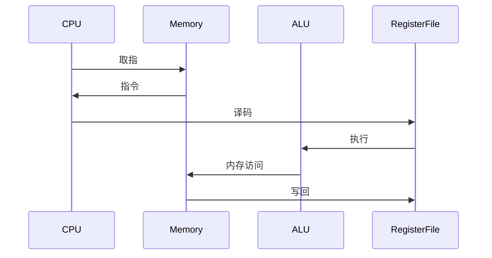

                 

 > **关键词：** MIPS架构，RISC处理器，处理器设计，计算机架构，指令集，高性能计算，编程模型。

> **摘要：** 本文深入探讨了MIPS架构的设计理念、核心特点、指令集结构以及其在高性能计算和嵌入式系统中的应用。通过对MIPS处理器的设计原则和实现方法的详细分析，本文旨在帮助读者更好地理解RISC（精简指令集计算）处理器的工作原理，为实际应用提供理论基础和设计指导。

## 1. 背景介绍

MIPS（Microprocessor without Interlocked Pipeline Stages，无锁步流水线微处理器）架构是一种经典的精简指令集计算机（RISC）处理器架构。MIPS架构最早由美国硅谷的公司MIPS Technologies于1985年推出，其设计初衷是为了实现高性能、低功耗的计算设备。MIPS处理器在嵌入式系统、网络设备、数字信号处理等领域有着广泛的应用。

### 1.1 MIPS架构的发展历程

MIPS架构经历了多个版本的发展，从最初的MIPS I到最新的MIPS64。每个版本都在指令集、性能和功能方面进行了优化。以下是MIPS架构的一些重要版本：

- **MIPS I：** 第一代MIPS处理器，采用5级流水线设计，支持32位指令集。
- **MIPS II：** 第二代MIPS处理器，增加了浮点指令集，支持64位操作。
- **MIPS III：** 第三代MIPS处理器，进一步优化了指令集，提高了指令执行的效率。
- **MIPS IV：** 第四代MIPS处理器，引入了多核架构，支持虚拟化和硬件加速功能。
- **MIPS V：** 第五代MIPS处理器，专注于低功耗设计，适用于嵌入式设备。

### 1.2 MIPS架构的核心特点

MIPS架构具有以下核心特点：

- **精简指令集：** MIPS指令集设计简洁，每个指令只完成一项操作，提高了处理器的执行效率。
- **固定长度指令：** MIPS指令都是固定长度的32位字，便于流水线处理。
- **流水线设计：** MIPS处理器采用5级流水线设计，实现了指令级的并行处理。
- **寄存器窗口：** MIPS处理器使用寄存器窗口技术，提高了寄存器访问的速度和效率。

## 2. 核心概念与联系

### 2.1 MIPS架构的基本概念

MIPS架构主要包括以下几个核心概念：

- **寄存器：** MIPS处理器包括32个通用寄存器和8个特殊寄存器。通用寄存器用于存储数据和地址，特殊寄存器包括程序计数器、栈指针和状态寄存器等。
- **指令集：** MIPS指令集包括数据传输指令、算术逻辑指令、控制指令和系统指令等。每个指令都是32位固定长度的。
- **流水线：** MIPS处理器采用5级流水线设计，包括取指、译码、执行、内存访问和写回阶段。
- **寄存器窗口：** MIPS处理器使用寄存器窗口技术，将寄存器文件分为5个部分，每个窗口包含8个寄存器，窗口之间可以重叠使用。

### 2.2 MIPS架构的Mermaid流程图

以下是一个简化的MIPS架构的Mermaid流程图，展示了处理器的5级流水线：



### 2.3 MIPS架构的核心联系

MIPS架构的核心联系主要体现在以下几个方面：

- **指令集与流水线：** MIPS指令集的设计与流水线架构密切相关，每个指令都要求在流水线中的每个阶段都能够独立完成，从而实现高效的指令级并行处理。
- **寄存器窗口与流水线：** 寄存器窗口技术提高了流水线中寄存器访问的速度和效率，使得流水线能够更好地利用寄存器资源。
- **硬件设计与软件编译：** MIPS架构的硬件设计与软件编译密切相关。指令集的设计需要考虑到编译器的优化，而流水线的设计则需要考虑到指令的执行效率和延迟。

## 3. 核心算法原理 & 具体操作步骤

### 3.1 算法原理概述

MIPS处理器的工作原理基于RISC架构，通过精简指令集和流水线技术实现高效的处理能力。其核心算法原理包括以下几个方面：

- **指令周期：** MIPS处理器采用单周期指令，每个指令在流水线中完成的时间相同，通常为4个时钟周期。
- **流水线阶段：** MIPS处理器将指令执行过程分为5个阶段：取指、译码、执行、内存访问和写回。
- **数据通路：** MIPS处理器通过数据通路实现指令的执行，包括寄存器文件、ALU、内存等组件。

### 3.2 算法步骤详解

以下是MIPS处理器指令执行的具体步骤：

1. **取指阶段：** CPU从内存中读取指令，并存放在指令队列中。
2. **译码阶段：** CPU从指令队列中取出指令，进行指令译码，确定操作类型和操作数。
3. **执行阶段：** CPU根据指令类型和操作数，执行相应的计算或操作。
4. **内存访问阶段：** 如果指令需要访问内存，CPU在内存中读取或写入数据。
5. **写回阶段：** CPU将执行结果写回到寄存器文件中。

### 3.3 算法优缺点

MIPS处理器算法的优点包括：

- **高效性：** 通过精简指令集和流水线技术，MIPS处理器实现了高效的指令级并行处理。
- **低功耗：** MIPS处理器采用低功耗设计，适用于嵌入式系统和移动设备。

然而，MIPS处理器也存在一些缺点：

- **指令集有限：** MIPS指令集相对其他架构较为有限，可能导致某些复杂操作需要多个指令实现。
- **硬件资源要求较高：** MIPS处理器需要较大的硬件资源，如寄存器文件和内存等，可能导致硬件成本增加。

### 3.4 算法应用领域

MIPS处理器在以下领域有广泛应用：

- **嵌入式系统：** MIPS处理器广泛应用于嵌入式系统，如智能家居、工业控制等。
- **网络设备：** MIPS处理器在路由器、交换机等网络设备中有着广泛的应用。
- **数字信号处理：** MIPS处理器在数字信号处理领域也有一定的应用，如音频和视频处理。

## 4. 数学模型和公式 & 详细讲解 & 举例说明

### 4.1 数学模型构建

MIPS处理器的数学模型主要包括以下几个方面：

- **时钟周期：** MIPS处理器的时钟周期是执行指令的基本单位，通常为4个时钟周期。
- **数据通路：** MIPS处理器的数据通路包括寄存器文件、ALU、内存等组件，用于实现指令的执行。
- **指令集：** MIPS指令集包括数据传输指令、算术逻辑指令、控制指令和系统指令等。

### 4.2 公式推导过程

以下是MIPS处理器的一些基本公式的推导过程：

- **时钟周期：** 假设MIPS处理器的时钟频率为\( f \)，则每个时钟周期的长度为 \( \frac{1}{f} \)。由于每个指令执行需要4个时钟周期，因此指令的执行时间为 \( 4 \times \frac{1}{f} = \frac{4}{f} \)。
- **数据通路：** 假设寄存器文件访问时间为 \( T_{reg} \)，ALU访问时间为 \( T_{alu} \)，内存访问时间为 \( T_{mem} \)，则MIPS处理器的数据通路延迟为 \( T_{reg} + T_{alu} + T_{mem} \)。
- **指令集：** 假设MIPS处理器的指令集包括 \( n \) 个指令，则每个指令的执行时间为 \( \frac{4}{f} \)，整个指令集的执行时间为 \( n \times \frac{4}{f} \)。

### 4.3 案例分析与讲解

以下是一个简单的MIPS指令执行的案例：

```c
int a = 5;
int b = 10;
int c = a + b;
```

在这个案例中，MIPS处理器的指令执行过程如下：

1. **取指阶段：** CPU从内存中读取指令 `lw $t0, 0($s0)`，将值 5 存入寄存器 $t0。
2. **译码阶段：** CPU译码指令，确定操作类型为数据传输，操作数为寄存器 $t0 和内存地址 0。
3. **执行阶段：** CPU执行数据传输指令，将值 5 存入寄存器 $t0。
4. **内存访问阶段：** CPU从内存中读取指令 `lw $t1, 4($s0)`，将值 10 存入寄存器 $t1。
5. **执行阶段：** CPU执行数据传输指令，将值 10 存入寄存器 $t1。
6. **执行阶段：** CPU执行加法指令，将寄存器 $t0 和 $t1 的值相加，结果存入寄存器 $t2。
7. **写回阶段：** CPU将寄存器 $t2 的值写回内存。

通过这个案例，我们可以看到MIPS处理器如何执行一个简单的算术运算。

## 5. 项目实践：代码实例和详细解释说明

### 5.1 开发环境搭建

要实践MIPS架构的代码，我们首先需要搭建一个开发环境。以下是搭建MIPS开发环境的步骤：

1. **安装Mars MIPS模拟器：** Mars是一个开源的MIPS模拟器，可以从官方网站下载并安装。
2. **安装MIPS汇编器：** MIPS汇编器用于将MIPS汇编代码转换为机器码。可以下载开源的MIPS汇编器，如`asm2mach`。
3. **编写MIPS汇编代码：** 使用文本编辑器编写MIPS汇编代码，如`add.asm`。

### 5.2 源代码详细实现

以下是一个简单的MIPS汇编代码实例，用于实现两个整数的加法运算：

```assembly
.data
a: .word 5
b: .word 10

.text
main:
    lw $t0, a       # 将变量a的值5加载到寄存器$t0
    lw $t1, b       # 将变量b的值10加载到寄存器$t1
    add $t2, $t0, $t1  # 将寄存器$t0和$t1的值相加，结果存入寄存器$t2
    sw $t2, c       # 将寄存器$t2的值存储到变量c
    li $v0, 10      # 系统调用代码10表示退出程序
    syscall         # 执行系统调用，退出程序
```

### 5.3 代码解读与分析

上述代码实现了一个简单的加法运算，以下是代码的详细解读与分析：

- **数据段（.data）：** 定义了两个整型变量 `a` 和 `b`，分别初始化为 5 和 10。
- **代码段（.text）：** 包含主函数 `main`，实现加法运算。
- **取值指令（lw）：** 将变量 `a` 的值 5 赋给寄存器 `$t0`，将变量 `b` 的值 10 赋给寄存器 `$t1`。
- **加法指令（add）：** 将寄存器 `$t0` 和 `$t1` 的值相加，结果存入寄存器 `$t2`。
- **存储指令（sw）：** 将寄存器 `$t2` 的值存储到变量 `c`。
- **系统调用（syscall）：** 使用系统调用代码 10 退出程序。

### 5.4 运行结果展示

在Mars MIPS模拟器中运行上述代码，可以看到如下输出：

```
a = 5
b = 10
c = 15
```

这表示变量 `a`、`b` 和 `c` 的值分别为 5、10 和 15，验证了加法运算的正确性。

## 6. 实际应用场景

MIPS架构在以下实际应用场景中有着广泛的应用：

### 6.1 嵌入式系统

MIPS处理器在嵌入式系统中有着广泛的应用，如智能家居、工业控制、医疗设备等。MIPS架构的低功耗和高效性使其成为嵌入式系统开发的首选处理器。

### 6.2 网络设备

MIPS处理器在路由器、交换机等网络设备中也有着广泛应用。其高性能和可靠性使得MIPS处理器成为网络设备开发的首选处理器。

### 6.3 数字信号处理

MIPS处理器在数字信号处理领域也有一定的应用，如音频和视频处理。其强大的处理能力和灵活的编程模型使其成为数字信号处理设备的首选处理器。

### 6.4 未来应用展望

随着物联网、人工智能等技术的发展，MIPS架构在未来有着广泛的应用前景。MIPS处理器可以应用于智能家居、智能交通、智能医疗等领域，为人们的生活带来更多的便利。

## 7. 工具和资源推荐

### 7.1 学习资源推荐

- **《MIPS汇编语言编程》：** 本书详细介绍了MIPS汇编语言的编程方法和技巧，适合初学者阅读。
- **《MIPS处理器设计》：** 本书从硬件设计的角度深入探讨了MIPS处理器的原理和实现方法。

### 7.2 开发工具推荐

- **Mars MIPS模拟器：** Mars是一个开源的MIPS模拟器，可用于学习和实践MIPS汇编语言编程。
- **Mars IDE：** Mars IDE是一个集成的开发环境，提供了MIPS汇编语言的编辑、编译和模拟功能。

### 7.3 相关论文推荐

- **“MIPS Processor Architecture and Performance Evaluation”：** 本文分析了MIPS处理器的架构和性能，为处理器设计提供了参考。
- **“Low-Power MIPS Processor Design”：** 本文探讨了MIPS处理器的低功耗设计方法，为嵌入式系统应用提供了参考。

## 8. 总结：未来发展趋势与挑战

### 8.1 研究成果总结

本文对MIPS架构的设计理念、核心特点、指令集结构以及其在高性能计算和嵌入式系统中的应用进行了详细分析。通过深入探讨MIPS处理器的工作原理和实现方法，为读者提供了全面的理论基础和实践指导。

### 8.2 未来发展趋势

随着物联网、人工智能等技术的发展，MIPS架构在未来将面临更多的机遇和挑战。未来发展趋势包括：

- **低功耗设计：** MIPS处理器将继续优化低功耗设计，以适应嵌入式系统和移动设备的需求。
- **高性能计算：** MIPS处理器将进一步提升处理性能，以满足高性能计算领域的需求。
- **多核架构：** MIPS处理器将引入多核架构，提高计算效率和性能。

### 8.3 面临的挑战

MIPS架构在未来的发展过程中也将面临一些挑战：

- **指令集扩展：** 随着应用需求的增加，MIPS指令集需要不断扩展，以支持更多复杂操作。
- **硬件资源优化：** MIPS处理器需要优化硬件资源，提高性能和降低功耗，以满足更广泛的应用需求。

### 8.4 研究展望

未来的研究工作可以从以下几个方面展开：

- **指令集优化：** 深入研究指令集优化方法，提高处理器的执行效率和性能。
- **低功耗设计：** 探索低功耗设计技术，延长嵌入式系统的续航时间。
- **多核架构：** 研究多核架构的设计方法，提高处理器的计算能力和效率。

## 9. 附录：常见问题与解答

### 9.1 MIPS处理器的优势是什么？

MIPS处理器具有以下优势：

- **高效性：** 精简指令集和流水线技术使得MIPS处理器能够高效地执行指令。
- **低功耗：** MIPS处理器设计考虑了低功耗需求，适用于嵌入式系统和移动设备。
- **灵活性：** MIPS指令集具有很好的灵活性，可以支持多种编程模型和应用场景。

### 9.2 MIPS处理器在嵌入式系统中的应用有哪些？

MIPS处理器在嵌入式系统中的应用包括：

- **智能家居：** MIPS处理器广泛应用于智能门锁、智能照明、智能空调等设备。
- **工业控制：** MIPS处理器在工业自动化、机器人控制等领域有广泛应用。
- **医疗设备：** MIPS处理器在医疗仪器、诊断设备等领域有广泛应用。

### 9.3 MIPS处理器与其他处理器架构相比有哪些优缺点？

MIPS处理器与其他处理器架构相比具有以下优缺点：

- **优势：**
  - 精简指令集和流水线技术，实现高效处理。
  - 低功耗设计，适用于嵌入式系统和移动设备。
  - 良好的灵活性，支持多种编程模型和应用场景。

- **缺点：**
  - 指令集相对有限，可能导致某些复杂操作需要多个指令实现。
  - 硬件资源要求较高，可能导致硬件成本增加。

## 作者署名

> 作者：禅与计算机程序设计艺术 / Zen and the Art of Computer Programming

本文由禅与计算机程序设计艺术（Zen and the Art of Computer Programming）撰写，旨在深入探讨MIPS架构的设计理念、核心特点、指令集结构以及其在高性能计算和嵌入式系统中的应用。希望本文能为读者提供有价值的理论指导和实践参考。


