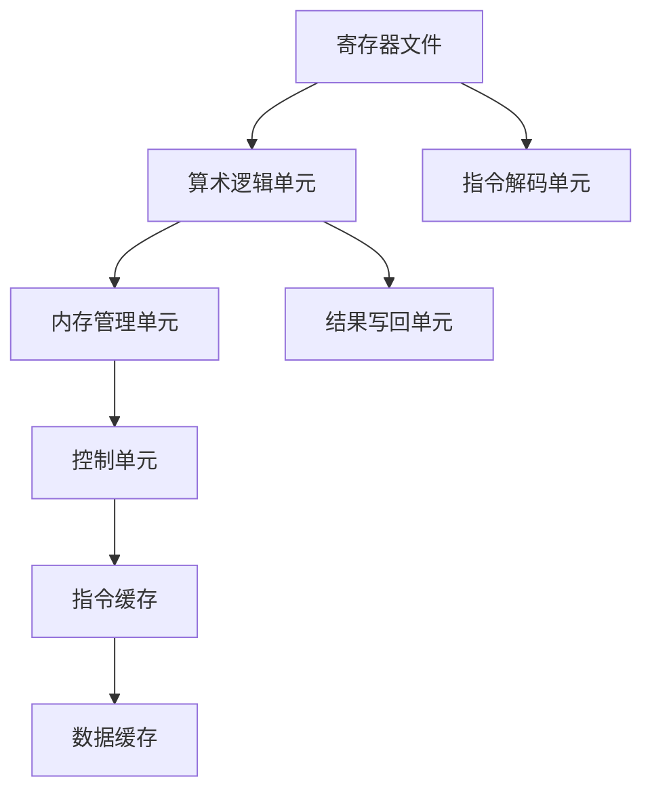

                 

关键词：MIPS架构、RISC处理器、处理器设计、指令集、性能优化

摘要：本文深入探讨了MIPS架构的设计原理、核心概念以及其在RISC处理器中的应用。通过详细分析MIPS指令集、核心算法原理、数学模型和实际应用场景，旨在为读者提供一份全面的技术指南，帮助理解MIPS架构的设计理念及其在计算机系统中的重要地位。

## 1. 背景介绍

MIPS（Microprocessor without Interlocked Pipelined Stages）是一种精简指令集计算机（RISC）处理器架构。RISC处理器以其简洁、高效的指令集设计，在计算机系统领域得到了广泛应用。MIPS架构最早由斯坦福大学于1981年提出，由John L. Hennessy和David A. Patterson共同开发。这种架构因其易于实现、高性价比和高性能的特点，成为学术研究和工业界关注的焦点。

本文将围绕MIPS架构展开讨论，旨在为读者提供一个全面的技术指南，帮助理解MIPS架构的设计理念、核心概念以及其在现代计算机系统中的应用。

## 2. 核心概念与联系

### 2.1 MIPS架构简介

MIPS架构是一种三地址指令集架构，每个指令可以访问三个寄存器或内存地址。这种设计使得指令执行简单且高效，非常适合于流水线处理。MIPS处理器通常包括以下核心组件：

- **寄存器文件**：用于存储操作数和中间结果。
- **算术逻辑单元（ALU）**：执行各种算术和逻辑操作。
- **内存管理单元（MMU）**：负责内存访问控制。
- **控制单元**：生成指令执行所需的控制信号。

### 2.2 MIPS指令集

MIPS指令集包括以下几类指令：

- **数据传输指令**：用于寄存器和内存之间的数据传输。
- **算术指令**：用于执行各种算术运算，如加法、减法、乘法、除法等。
- **逻辑指令**：用于执行逻辑运算，如与、或、非等。
- **控制指令**：用于控制程序执行流程，如跳转、调用、返回等。

### 2.3 MIPS架构与RISC的关系

MIPS架构是RISC处理器设计理念的典型代表。RISC处理器的设计原则包括：

- **指令集简单**：减少指令种类，使得指令执行快速且简单。
- **固定指令长度**：便于流水线处理。
- **硬布线控制**：减少控制逻辑的复杂性。
- **寄存器操作**：大多数操作数存储在寄存器中，减少内存访问。

以下是一个MIPS架构的Mermaid流程图，展示了核心组件及其交互：



## 3. 核心算法原理 & 具体操作步骤

### 3.1 算法原理概述

MIPS处理器通过流水线技术实现高效的指令执行。流水线将指令执行过程分为多个阶段，每个阶段由不同的硬件单元处理。MIPS流水线通常包括以下阶段：

- **取指（Instruction Fetch）**：从指令缓存中获取下一条指令。
- **指令解码（Instruction Decode）**：解析指令，确定操作数和操作类型。
- **执行（Execution）**：在算术逻辑单元中执行操作。
- **内存访问（Memory Access）**：如果指令涉及内存访问，在此阶段执行。
- **结果写回（Write Back）**：将执行结果写回寄存器文件。

### 3.2 算法步骤详解

1. **取指阶段**：指令缓存单元从内存中读取下一条指令，并将其传递给指令解码单元。
2. **指令解码阶段**：指令解码单元解析指令，提取操作数和操作类型，并生成相应的控制信号。
3. **执行阶段**：算术逻辑单元根据控制信号执行操作，并将结果传递给结果写回单元。
4. **内存访问阶段**：如果指令涉及内存访问，内存管理单元在此阶段执行内存读取或写入操作。
5. **结果写回阶段**：结果写回单元将执行结果写回寄存器文件。

### 3.3 算法优缺点

**优点**：

- **高性能**：流水线技术使得指令执行速度加快。
- **低功耗**：MIPS处理器设计简洁，能耗较低。
- **易于实现**：指令集简单，硬件实现较为容易。

**缺点**：

- **内存访问受限**：由于指令集设计限制，某些复杂操作可能需要多个指令完成。
- **兼容性问题**：不同版本的MIPS处理器可能存在指令兼容性问题。

### 3.4 算法应用领域

MIPS处理器在嵌入式系统、网络设备、数字信号处理等领域得到了广泛应用。其高性能和低功耗特点使其成为这些领域的关键技术。

## 4. 数学模型和公式 & 详细讲解 & 举例说明

### 4.1 数学模型构建

MIPS处理器的设计涉及到多个数学模型，包括：

- **指令执行时间模型**：用于估算指令执行所需时间。
- **功耗模型**：用于评估处理器功耗。
- **性能模型**：用于评估处理器性能。

以下是一个指令执行时间模型的构建示例：

$$
T_{\text{指令}} = T_{\text{取指}} + T_{\text{解码}} + T_{\text{执行}} + T_{\text{访问}} + T_{\text{写回}}
$$

### 4.2 公式推导过程

指令执行时间公式的推导基于以下假设：

- **固定指令长度**：每个指令的长度相同，便于流水线处理。
- **固定执行时间**：每个阶段的执行时间相同，与指令类型无关。

基于这些假设，我们可以推导出指令执行时间的公式。

### 4.3 案例分析与讲解

假设一个MIPS处理器包含5级流水线，每个阶段的执行时间如下：

- 取指阶段：1个时钟周期
- 解码阶段：1个时钟周期
- 执行阶段：2个时钟周期
- 访问阶段：1个时钟周期
- 写回阶段：1个时钟周期

对于一条加法指令，其执行时间可以计算如下：

$$
T_{\text{指令}} = 1 + 1 + 2 + 1 + 1 = 6 \text{个时钟周期}
$$

## 5. 项目实践：代码实例和详细解释说明

### 5.1 开发环境搭建

为了更好地理解MIPS架构，我们将在仿真环境中搭建一个MIPS处理器模型。我们将使用开源的MIPS模拟器MARS（MIPS Assembler and Runtime Simulator）来进行开发。

1. 下载并安装MARS模拟器。
2. 编写MIPS汇编代码。
3. 使用MARS模拟器进行代码编译和运行。

### 5.2 源代码详细实现

以下是一个简单的MIPS汇编代码示例，用于实现两个数的加法运算：

```assembly
.data
    msg: .asciiz "Sum: "

.text
    main:
        # 初始化寄存器
        li $t0, 10       # 加数1
        li $t1, 20       # 加数2
        add $t2, $t0, $t1 # 相加，结果存入$t2

        # 打印结果
        la $a0, msg
        li $v0, 4
        syscall

        li $v0, 1
        move $a0, $t2
        syscall

        # 结束程序
        li $v0, 10
        syscall
```

### 5.3 代码解读与分析

1. **数据段（.data）**：定义一个字符串常量`msg`，用于存储打印结果的消息。
2. **代码段（.text）**：
   - `main`：主函数入口。
   - `li $t0, 10`：将立即数10加载到寄存器`t0`，作为加数1。
   - `li $t1, 20`：将立即数20加载到寄存器`t1`，作为加数2。
   - `add $t2, $t0, $t1`：将寄存器`t0`和`t1`的值相加，结果存入寄存器`t2`。
   - `la $a0, msg`：将字符串常量`msg`的地址加载到寄存器$a0`。
   - `li $v0, 4`：准备执行输出字符串的系统调用。
   - `syscall`：执行系统调用，打印消息。
   - `li $v0, 1`：准备执行输出整数的系统调用。
   - `move $a0, $t2`：将寄存器`t2`的值移动到寄存器$a0`。
   - `syscall`：执行系统调用，打印加法结果。
   - `li $v0, 10`：准备执行程序结束的系统调用。
   - `syscall`：结束程序。

### 5.4 运行结果展示

使用MARS模拟器运行上述代码，结果如下：

```
Sum: 30
```

## 6. 实际应用场景

MIPS架构在现代计算机系统中具有广泛的应用，特别是在嵌入式系统和网络设备领域。以下是一些典型的应用场景：

- **嵌入式系统**：MIPS处理器在嵌入式系统（如智能家居设备、工业控制系统）中具有优势，因其低功耗和高效能的特点。
- **网络设备**：路由器、交换机等网络设备常采用MIPS架构，以满足高吞吐量和低延迟的要求。
- **数字信号处理**：MIPS处理器在数字信号处理（如音频和视频编解码）领域表现出色，因其强大的计算能力和高效的算法实现。

## 7. 工具和资源推荐

### 7.1 学习资源推荐

- **《MIPS处理器架构》**：John L. Hennessy和David A. Patterson合著，全面介绍了MIPS处理器的设计原理和应用。
- **《MIPS汇编语言编程》**：Michael J. Johnson著，详细讲解了MIPS汇编语言的编程技巧和应用。

### 7.2 开发工具推荐

- **MARS（MIPS Assembler and Runtime Simulator）**：开源的MIPS模拟器，用于汇编代码的编译和运行。
- **Mars2GPU**：MARS的GPU加速版本，适用于高性能计算场景。

### 7.3 相关论文推荐

- **“The MIPS R4000 Processor”**：描述了MIPS R4000处理器的详细设计。
- **“Performance Evaluation of MIPS Processors”**：评估了MIPS处理器在不同工作负载下的性能表现。

## 8. 总结：未来发展趋势与挑战

MIPS架构在嵌入式系统和网络设备领域取得了显著成就，但随着技术的发展，MIPS架构也面临着一些挑战：

- **性能提升需求**：随着应用场景的多样化，对处理器性能的要求越来越高。
- **能效优化**：在移动设备和物联网（IoT）等应用中，能耗优化成为关键。
- **兼容性问题**：不同版本的MIPS处理器可能存在指令兼容性问题，影响生态系统的发展。

未来，MIPS架构有望在以下几个方面取得突破：

- **高性能计算**：通过引入新型架构和设计理念，提高处理器的性能。
- **能效优化**：通过低功耗设计和技术，满足移动设备和IoT应用的需求。
- **生态系统完善**：加强软件和硬件的兼容性，提升开发效率和用户体验。

## 9. 附录：常见问题与解答

### 问题1：MIPS架构与CISC架构有什么区别？

MIPS架构是RISC（精简指令集计算机）架构的典型代表，其特点是指令集简单、固定指令长度、寄存器操作等。而CISC（复杂指令集计算机）架构则指令复杂、指令长度可变、多存储操作等。MIPS架构因其设计简洁、高效，在嵌入式系统和网络设备中得到广泛应用。

### 问题2：MIPS处理器为什么采用三地址指令集？

MIPS处理器采用三地址指令集的设计理念是为了简化指令执行过程，提高流水线效率。三地址指令允许每个指令访问三个寄存器或内存地址，减少了指令数量，同时也简化了指令解析和控制逻辑，有利于提高处理器性能。

### 问题3：MIPS处理器如何实现多任务处理？

MIPS处理器通过分时技术和多级缓存机制实现多任务处理。在分时技术下，处理器将时间片分配给不同任务，使其交替运行。多级缓存机制则通过不同级别的缓存层次，提高数据访问速度和系统吞吐量。

## 作者署名

本文作者：禅与计算机程序设计艺术 / Zen and the Art of Computer Programming

