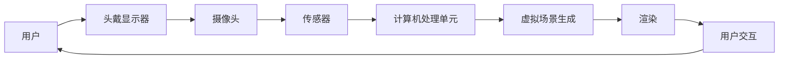
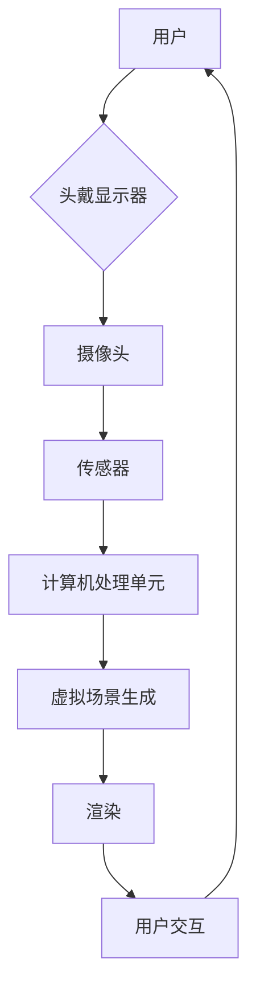

                 

关键词：增强现实、虚拟现实、混合现实、游戏世界、交互设计、用户体验、人机交互、3D建模、渲染技术、算法优化、人工智能

## 摘要

本文旨在探讨混合现实（MR）技术在游戏世界构建与交互中的应用。随着科技的进步，MR技术正逐渐改变人们的娱乐方式，使得游戏世界更加真实、互动。本文首先介绍了MR技术的核心概念及其在游戏开发中的重要性，随后深入分析了MR游戏世界的构建流程和交互设计的关键要素。文章还将探讨当前MR技术的挑战与未来发展趋势，为开发者提供有价值的参考。

## 1. 背景介绍

### 混合现实技术的发展

混合现实（Mixed Reality，简称MR）是一种结合了现实世界和虚拟世界的技术。与虚拟现实（Virtual Reality，简称VR）和增强现实（Augmented Reality，简称AR）相比，MR不仅提供了虚拟对象的增强显示，还能与现实世界中的物体进行实时交互。MR技术的核心在于其能够将虚拟信息无缝地嵌入到现实环境中，从而创造出一种全新的沉浸式体验。

近年来，MR技术取得了显著的发展。特别是随着硬件设备如头戴显示器（HMD）和手柄等性能的提升，以及算法和软件工具的进步，MR技术逐渐应用于游戏、医疗、教育等多个领域。在游戏领域，MR技术为玩家提供了更加真实、互动的游戏体验，使得游戏世界与现实世界之间的界限变得更加模糊。

### MR技术在游戏开发中的应用

在游戏开发中，MR技术主要用于以下方面：

1. **游戏世界构建**：MR技术使得开发者能够构建出更加逼真的游戏场景，包括角色、道具和环境等。
2. **交互设计**：MR技术提供了丰富的交互方式，如手势识别、语音控制和空间定位等，使得玩家能够更加自然地与游戏世界互动。
3. **增强体验**：通过MR技术，玩家可以在现实世界中体验到虚拟世界的存在，从而提高游戏的趣味性和沉浸感。

随着MR技术的不断进步，越来越多的游戏开发者开始探索MR技术在游戏开发中的应用，并取得了一系列令人瞩目的成果。

## 2. 核心概念与联系

### 核心概念

- **混合现实（MR）**：混合现实是一种将虚拟信息与现实世界融合的技术。MR技术包括多种组件，如头戴显示器（HMD）、手柄、传感器和软件平台等。
- **虚拟现实（VR）**：虚拟现实是一种完全沉浸式的体验，用户在虚拟环境中无法感知到现实世界。
- **增强现实（AR）**：增强现实是一种将虚拟信息叠加到现实世界中的技术，用户可以看到现实世界中的物体，同时也能看到虚拟信息。

### 概念联系

MR、VR和AR之间的关系紧密，它们在技术实现和应用场景上存在一定的重叠和互补。

- **MR与VR**：MR和VR在技术实现上有相似之处，如都需要使用头戴显示器等硬件设备。然而，MR更强调与现实世界的互动，而VR则更注重沉浸式体验。
- **MR与AR**：MR和AR在将虚拟信息与现实世界融合方面有共同点。MR更强调虚拟信息的无缝融合，而AR则更注重信息的增强显示。

### 架构流程图

为了更好地理解MR技术在游戏世界构建与交互中的应用，下面给出一个MR架构的流程图，包括核心概念和组件之间的联系。



- **用户**：游戏的玩家。
- **头戴显示器**：用于显示虚拟场景的设备。
- **摄像头**：用于捕捉现实环境的图像。
- **传感器**：用于感知用户的位置和动作。
- **计算机处理单元**：用于处理摄像头和传感器的数据，生成虚拟场景。
- **虚拟场景生成**：根据用户的位置和动作生成相应的虚拟场景。
- **渲染**：将虚拟场景渲染到头戴显示器上。
- **用户交互**：用户通过头戴显示器和手柄与虚拟场景进行交互。

通过这个流程图，我们可以清晰地看到MR技术中各个组件之间的联系，以及它们在游戏世界构建与交互中的作用。

### Mermaid 流程图 (Mermaid 流程节点中不要有括号、逗号等特殊字符)



### 2.1 MR游戏世界构建原理

混合现实（MR）游戏世界构建的原理可以概括为以下几个步骤：

1. **场景建模**：首先，开发者需要根据游戏需求创建虚拟场景的3D模型。这些模型可以是环境、角色、道具等。场景建模可以使用各种3D建模工具，如Blender、Maya等。

2. **场景渲染**：在场景建模完成后，接下来需要将场景渲染到用户的视野中。渲染过程涉及到光照、阴影、材质等效果的处理。高质量的渲染可以增强游戏场景的真实感。

3. **传感器数据融合**：为了实现与现实世界的融合，MR游戏需要利用传感器数据来感知用户的位置、动作和周围环境。这些传感器包括摄像头、陀螺仪、加速度计等。通过传感器数据，游戏可以实时调整虚拟场景的位置和方向，使其与现实世界中的物体相对应。

4. **交互设计**：MR游戏的交互设计至关重要。玩家可以通过手势、语音、触摸等多种方式进行交互。为了实现这些交互方式，开发者需要设计和实现相应的交互逻辑。

5. **实时反馈**：在MR游戏中，玩家需要实时获得反馈，以保持游戏体验的连贯性和沉浸感。实时反馈可以通过视觉、听觉和触觉等多种方式进行，如角色动作的实时响应、环境音效的变化等。

### 2.2 构建流程详解

MR游戏世界的构建流程可以分为以下几个步骤：

1. **需求分析**：首先，开发者需要明确游戏的目标和需求，包括游戏类型、场景设计、角色设定等。这一步是整个构建流程的基础。

2. **场景建模**：根据需求分析的结果，开发者使用3D建模工具创建游戏场景的3D模型。这些模型包括环境、角色、道具等。

3. **场景渲染**：在场景建模完成后，开发者需要将场景渲染到用户的视野中。这一过程涉及到光照、阴影、材质等效果的处理。

4. **传感器数据融合**：接下来，开发者需要集成传感器数据，以实现虚拟场景与现实世界的融合。传感器数据包括摄像头、陀螺仪、加速度计等。

5. **交互设计**：在交互设计阶段，开发者需要设计和实现玩家与游戏世界之间的交互逻辑。这包括手势、语音、触摸等多种交互方式。

6. **实时反馈**：在游戏运行过程中，开发者需要确保玩家能够实时获得反馈。这可以通过视觉、听觉和触觉等多种方式进行。

7. **测试与优化**：在构建流程的最后阶段，开发者需要对游戏进行测试和优化。这包括测试游戏性能、稳定性、交互效果等，以确保游戏能够提供良好的用户体验。

### 2.3 MR游戏世界构建的优势

MR游戏世界构建相比传统的游戏开发具有以下优势：

1. **沉浸感更强**：通过将虚拟信息与现实世界融合，MR游戏能够提供更加强烈的沉浸感。玩家可以感受到虚拟世界与现实世界的无缝连接，从而提高游戏的趣味性和吸引力。

2. **交互方式更加自然**：MR技术支持多种交互方式，如手势、语音、触摸等。这些交互方式更加贴近现实，使得玩家能够更加自然地与游戏世界互动。

3. **可扩展性强**：MR游戏世界构建可以灵活扩展，开发者可以根据不同的需求和环境调整游戏内容。这为游戏创新提供了广阔的空间。

4. **应用场景丰富**：MR游戏不仅可以应用于娱乐领域，还可以应用于教育、医疗、设计等多个领域。这使得MR游戏世界构建具有广泛的应用前景。

### 2.4 MR游戏世界构建的挑战

尽管MR游戏世界构建具有诸多优势，但在实际应用中仍然面临一些挑战：

1. **硬件成本高**：MR设备如头戴显示器等硬件成本较高，这限制了MR游戏的普及和应用。

2. **开发难度大**：MR游戏开发需要涉及多个领域的技术，如3D建模、渲染、传感器数据处理等。这增加了开发难度和成本。

3. **用户体验不稳定**：MR技术对环境要求较高，如光照、温度等。这些因素可能会影响用户体验的稳定性。

4. **内容制作难度大**：MR游戏需要高质量的内容来支持，如高质量的3D模型、渲染效果等。这增加了内容制作的难度和成本。

### 2.5 MR游戏世界构建的应用领域

MR游戏世界构建在多个领域具有广泛的应用前景：

1. **娱乐**：在娱乐领域，MR游戏为玩家提供了全新的游戏体验。通过将虚拟信息与现实世界融合，MR游戏能够提供更加沉浸、互动的游戏体验。

2. **教育**：在教育领域，MR技术可以用于虚拟实验室、虚拟课堂等。通过MR技术，学生可以更加直观地学习知识，提高学习效果。

3. **医疗**：在医疗领域，MR技术可以用于虚拟手术训练、疾病诊断等。通过MR技术，医生可以更加精确地进行手术操作，提高手术成功率。

4. **设计**：在工业设计、建筑设计等领域，MR技术可以用于虚拟设计、展示等。通过MR技术，设计师可以更加直观地展示设计成果，提高设计效率。

5. **军事**：在军事领域，MR技术可以用于模拟战斗场景、战术规划等。通过MR技术，士兵可以进行更加真实的训练，提高战斗能力。

### 2.6 交互设计原理

在MR游戏世界中，交互设计是提升用户体验的关键环节。以下将从交互设计的基本原则、常用交互方式及其实现方法等方面进行详细阐述。

#### 2.6.1 交互设计基本原则

1. **直观性**：交互设计应尽可能直观，使玩家能够快速理解并掌握游戏操作。直观的交互设计可以减少玩家的学习成本，提高游戏体验。

2. **一致性**：交互设计应保持一致性，包括界面布局、操作逻辑、视觉反馈等。一致性可以增强玩家的信任感，减少误操作。

3. **可控性**：交互设计应提供足够的可控性，使玩家能够自主选择和调整游戏体验。可控性可以提高游戏的个性化程度，满足不同玩家的需求。

4. **反馈性**：交互设计应提供及时的视觉、听觉和触觉反馈，使玩家能够实时了解游戏状态和操作效果。反馈性可以增强游戏的沉浸感和互动性。

#### 2.6.2 常用交互方式

1. **手势交互**：手势交互是一种直观、自然的交互方式。玩家可以通过手势来操控游戏角色或物品。常见的手势包括抓取、滑动、旋转等。

2. **语音交互**：语音交互是一种方便、快捷的交互方式。玩家可以通过语音命令来控制游戏角色或执行特定操作。常见的语音交互功能包括导航、聊天、命令执行等。

3. **触摸交互**：触摸交互是一种简单、直观的交互方式。玩家可以通过触摸屏幕或手柄来操控游戏角色或物品。常见的触摸交互包括点击、拖拽、滑动等。

4. **体感交互**：体感交互是一种通过动作和身体运动来操控游戏的交互方式。玩家可以通过身体运动来控制游戏角色或执行特定操作。常见的体感交互包括跑步、跳跃、挥动手臂等。

#### 2.6.3 交互设计实现方法

1. **物理引擎**：物理引擎是实现交互设计的关键组件。通过物理引擎，游戏可以模拟现实世界的物理现象，如碰撞、摩擦、重力等。物理引擎可以用于实现手势交互、体感交互等。

2. **人工智能**：人工智能技术可以用于实现智能交互。通过人工智能，游戏可以识别玩家的手势、语音等输入，并做出相应的响应。人工智能可以用于实现语音交互、智能导航等。

3. **自然语言处理**：自然语言处理（NLP）技术可以用于实现语音交互。通过NLP技术，游戏可以理解玩家的语音命令，并执行相应操作。

4. **视觉识别**：视觉识别技术可以用于实现手势识别。通过视觉识别技术，游戏可以识别玩家的手势，并做出相应的响应。

#### 2.6.4 交互设计案例分析

以下是一个交互设计案例，说明如何在MR游戏中实现手势交互：

1. **需求分析**：玩家希望在游戏中能够通过手势来操控角色。

2. **设计思路**：通过手势识别技术，实现手势交互。具体包括以下步骤：

   - **抓取手势**：玩家伸出手臂，手掌面向角色，角色被手掌包围。

   - **滑动手势**：玩家将手掌在角色前方滑动，角色会跟随手掌移动。

   - **旋转手势**：玩家将手掌在角色前方旋转，角色会跟随手掌旋转。

3. **实现方法**：

   - **手势识别**：使用深度相机（如Kinect）捕捉玩家的手势。

   - **手势处理**：通过算法分析手势图像，识别出手势类型。

   - **交互响应**：根据手势类型，执行相应操作，如角色移动、旋转等。

4. **测试与优化**：在实际游戏中测试手势交互效果，收集玩家反馈，对交互设计进行优化。

### 2.7 交互设计优缺点

#### 优点

1. **增强沉浸感**：通过丰富的交互方式，如手势、语音等，可以增强玩家的沉浸感，提高游戏体验。

2. **提高互动性**：多种交互方式可以增加玩家与游戏世界的互动性，使游戏更加有趣。

3. **个性化体验**：交互设计可以根据玩家的需求和行为习惯进行个性化调整，提供更加个性化的游戏体验。

#### 缺点

1. **学习成本高**：复杂的交互设计可能需要玩家花费更多时间来学习和适应。

2. **操作难度大**：一些交互方式如体感交互可能存在操作难度大、准确性不高等问题。

3. **硬件限制**：一些交互方式如手势识别、语音交互需要特定硬件支持，可能增加开发成本。

### 2.8 交互设计应用领域

1. **游戏**：在游戏领域，交互设计是提升用户体验的关键。通过丰富多样的交互方式，游戏可以提供更加沉浸、互动的体验。

2. **教育**：在教育领域，交互设计可以用于虚拟实验室、虚拟课堂等。通过互动式教学，学生可以更加直观地学习知识。

3. **医疗**：在医疗领域，交互设计可以用于虚拟手术训练、疾病诊断等。通过虚拟交互，医生可以更加精确地进行手术操作。

4. **设计**：在设计领域，交互设计可以用于虚拟设计、展示等。通过互动式设计，设计师可以更加直观地展示设计成果。

5. **虚拟现实**：在虚拟现实领域，交互设计是构建沉浸式体验的关键。通过丰富多样的交互方式，虚拟现实可以提供更加逼真的体验。

## 3. 核心算法原理 & 具体操作步骤

### 3.1 算法原理概述

在MR游戏中，核心算法主要包括3D建模与渲染算法、传感器数据处理算法和交互算法。这些算法共同作用，实现了虚拟场景与现实世界的无缝融合。

1. **3D建模与渲染算法**：3D建模与渲染算法负责创建和渲染游戏场景。这些算法包括几何建模、纹理映射、光照模型等。通过这些算法，开发者可以创建出逼真的虚拟场景，并将其渲染到用户的视野中。

2. **传感器数据处理算法**：传感器数据处理算法负责处理摄像头、陀螺仪、加速度计等传感器数据。这些算法包括数据采集、滤波、特征提取等。通过这些算法，游戏可以实时感知用户的位置、动作和周围环境。

3. **交互算法**：交互算法负责处理用户输入，如手势、语音、触摸等，并做出相应响应。这些算法包括手势识别、语音识别、触摸交互等。通过这些算法，游戏可以提供丰富多样的交互方式，提高用户体验。

### 3.2 算法步骤详解

下面详细描述MR游戏中的核心算法步骤：

#### 3.2.1 3D建模与渲染算法步骤

1. **场景建模**：使用3D建模工具（如Blender、Maya）创建游戏场景的3D模型。包括环境、角色、道具等。

2. **场景纹理映射**：为3D模型添加纹理，使其更加逼真。可以使用纹理编辑工具（如Photoshop）创建和编辑纹理。

3. **光照模型计算**：根据场景需求计算光照效果。可以使用光照模型（如Phong光照模型、Blinn-Phong光照模型）来模拟光照效果。

4. **几何渲染**：将3D模型渲染到图形缓冲区。可以使用OpenGL、DirectX等图形API进行渲染。

5. **图像合成**：将渲染后的图像与摄像头捕获的现实环境图像进行合成。可以使用图像合成技术（如OpenGL的FBO）实现图像合成。

#### 3.2.2 传感器数据处理算法步骤

1. **数据采集**：从摄像头、陀螺仪、加速度计等传感器中采集数据。可以使用传感器API（如OpenCV、Unity的Input子系统）实现数据采集。

2. **滤波**：对传感器数据进行滤波，去除噪声和抖动。可以使用卡尔曼滤波、低通滤波等算法进行滤波。

3. **特征提取**：从滤波后的数据中提取特征，如位置、速度、加速度等。可以使用特征提取算法（如差分、积分等）进行特征提取。

4. **数据融合**：将来自不同传感器的数据进行融合，得到最终的传感器数据。可以使用数据融合算法（如贝叶斯滤波、卡尔曼滤波等）进行数据融合。

#### 3.2.3 交互算法步骤

1. **输入识别**：识别用户输入，如手势、语音、触摸等。可以使用手势识别算法、语音识别算法、触摸识别算法等。

2. **交互逻辑处理**：根据识别到的输入，执行相应的交互逻辑。如手势交互中的抓取、滑动、旋转等。

3. **反馈生成**：生成视觉、听觉和触觉等反馈，反馈给用户。如手势交互中的视觉反馈（角色跟随手势移动）、语音交互中的声音反馈等。

### 3.3 算法优缺点

#### 3D建模与渲染算法

**优点**：

1. **逼真效果**：通过高质量的3D建模与渲染，可以创建出逼真的虚拟场景，提高游戏体验。
2. **灵活性**：3D建模与渲染算法支持各种场景和角色的建模，具有很高的灵活性。

**缺点**：

1. **计算量大**：高质量的3D建模与渲染需要大量的计算资源，可能导致性能下降。
2. **学习成本高**：3D建模与渲染需要掌握一定的专业技能，如3D建模工具的使用、光照模型的理解等。

#### 传感器数据处理算法

**优点**：

1. **实时交互**：传感器数据处理算法可以实时感知用户的位置、动作和周围环境，实现实时交互。
2. **自然交互**：通过传感器数据处理算法，可以实现自然的手势、语音等交互方式，提高用户体验。

**缺点**：

1. **硬件依赖**：传感器数据处理算法需要特定的硬件支持，如摄像头、陀螺仪等，可能导致成本上升。
2. **准确性问题**：传感器数据处理算法可能受到环境噪声、传感器误差等因素的影响，导致准确性问题。

#### 交互算法

**优点**：

1. **丰富性**：交互算法支持多种交互方式，如手势、语音、触摸等，可以提供丰富的交互体验。
2. **个性化**：交互算法可以根据用户的偏好和行为习惯进行个性化调整，提高用户体验。

**缺点**：

1. **学习成本**：复杂的交互算法可能需要用户花费更多时间来学习和适应。
2. **准确性问题**：交互算法可能受到环境噪声、用户动作不准确等因素的影响，导致交互准确性问题。

### 3.4 算法应用领域

这些算法广泛应用于以下领域：

1. **游戏**：3D建模与渲染算法用于创建逼真的游戏场景，传感器数据处理算法用于实现实时交互，交互算法用于提供丰富的交互体验。

2. **虚拟现实**：3D建模与渲染算法用于创建沉浸式的虚拟环境，传感器数据处理算法用于实现用户在虚拟环境中的位置和动作跟踪，交互算法用于提供自然的交互方式。

3. **增强现实**：3D建模与渲染算法用于创建增强现实中的虚拟对象，传感器数据处理算法用于将虚拟对象与现实世界融合，交互算法用于提供增强现实的交互体验。

4. **设计**：3D建模与渲染算法用于创建设计模型，传感器数据处理算法用于实现设计模型的互动展示，交互算法用于提供设计交互体验。

5. **医疗**：3D建模与渲染算法用于创建虚拟手术场景，传感器数据处理算法用于实现虚拟手术中的实时交互，交互算法用于提供手术指导和互动。

6. **教育**：3D建模与渲染算法用于创建教育场景，传感器数据处理算法用于实现互动式教育，交互算法用于提供教育互动体验。

7. **娱乐**：3D建模与渲染算法用于创建娱乐场景，传感器数据处理算法用于实现娱乐互动，交互算法用于提供娱乐互动体验。

### 3.5 算法性能优化策略

为了提高MR游戏的性能，可以采取以下优化策略：

1. **硬件优化**：选择高性能的硬件设备，如高性能的CPU、GPU、传感器等，以提高算法的执行速度。

2. **算法优化**：针对算法的特定环节进行优化，如使用更高效的渲染算法、传感器数据处理算法等，以减少计算时间和资源消耗。

3. **并行计算**：利用多核CPU和GPU的并行计算能力，将算法分解为多个任务，同时执行，以提高算法的执行速度。

4. **内存管理**：优化内存分配和回收策略，减少内存占用，提高算法的运行效率。

5. **数据压缩**：对大量数据进行压缩，减少数据传输和存储的开销。

6. **负载均衡**：在分布式系统中，合理分配计算任务，避免单点瓶颈，提高系统的整体性能。

7. **缓存技术**：使用缓存技术，减少重复计算和I/O操作，提高算法的执行速度。

通过这些优化策略，可以显著提高MR游戏的性能，为用户提供更好的游戏体验。

## 4. 数学模型和公式 & 详细讲解 & 举例说明

### 4.1 数学模型构建

在MR游戏中，数学模型主要用于模拟物理现象、计算传感器数据、实现交互算法等。以下是一些常见的数学模型：

#### 4.1.1 物理模型

物理模型用于模拟现实世界中的物理现象，如重力、碰撞、摩擦等。以下是一个简单的物理模型：

$$
F = m \cdot a
$$

其中，$F$ 表示力，$m$ 表示质量，$a$ 表示加速度。

#### 4.1.2 传感器数据处理模型

传感器数据处理模型用于处理摄像头、陀螺仪、加速度计等传感器数据。以下是一个基于卡尔曼滤波的传感器数据处理模型：

$$
x_{k+1} = A \cdot x_{k} + B \cdot u_{k} + w_{k}
$$

$$
z_{k} = H \cdot x_{k} + v_{k}
$$

其中，$x_{k}$ 表示状态向量，$u_{k}$ 表示控制输入，$z_{k}$ 表示观测值，$w_{k}$ 和 $v_{k}$ 分别表示过程噪声和观测噪声。

#### 4.1.3 交互模型

交互模型用于实现手势、语音、触摸等交互方式。以下是一个基于深度学习的交互模型：

$$
y_{k} = \sigma(W \cdot [x_{k}; z_{k}])
$$

其中，$y_{k}$ 表示输出，$\sigma$ 表示激活函数，$W$ 表示权重矩阵，$x_{k}$ 和 $z_{k}$ 分别表示输入。

### 4.2 公式推导过程

下面详细解释上述数学模型的推导过程：

#### 4.2.1 物理模型推导

物理模型基于牛顿第二定律，推导如下：

$$
F_{\text{合}} = m \cdot a
$$

其中，$F_{\text{合}}$ 表示合力，$m$ 表示质量，$a$ 表示加速度。

假设系统受到多个力的作用，可以表示为：

$$
F_{\text{合}} = \sum_{i=1}^{n} F_{i}
$$

则加速度可以表示为：

$$
a = \frac{F_{\text{合}}}{m} = \frac{\sum_{i=1}^{n} F_{i}}{m}
$$

将合力分解为水平和垂直分量，可以得到：

$$
a_x = \frac{F_{x}}{m}, \quad a_y = \frac{F_{y}}{m}
$$

其中，$a_x$ 和 $a_y$ 分别表示水平加速度和垂直加速度，$F_{x}$ 和 $F_{y}$ 分别表示水平力和垂直力。

#### 4.2.2 传感器数据处理模型推导

传感器数据处理模型基于卡尔曼滤波理论。卡尔曼滤波是一种递归的估计方法，用于在含有噪声的动态系统中估计状态向量。

首先，定义状态向量和观测向量：

$$
x_{k} = \begin{bmatrix} x_k \\ y_k \\ \end{bmatrix}, \quad z_{k} = \begin{bmatrix} z_k \\ \end{bmatrix}
$$

其中，$x_{k}$ 表示状态向量，$z_{k}$ 表示观测值。

状态转移模型可以表示为：

$$
x_{k+1} = A \cdot x_{k} + B \cdot u_{k} + w_{k}
$$

其中，$A$ 是状态转移矩阵，$B$ 是控制矩阵，$w_{k}$ 是过程噪声。

观测模型可以表示为：

$$
z_{k} = H \cdot x_{k} + v_{k}
$$

其中，$H$ 是观测矩阵，$v_{k}$ 是观测噪声。

卡尔曼滤波的目标是最小化预测误差和观测误差。预测误差可以表示为：

$$
P_{k+1} = A \cdot P_{k} \cdot A^T + Q
$$

其中，$P_{k}$ 是预测误差矩阵，$Q$ 是过程噪声协方差矩阵。

观测误差可以表示为：

$$
K_{k} = P_{k+1} \cdot H^T \cdot (H \cdot P_{k+1} \cdot H^T + R)^{-1}
$$

其中，$K_{k}$ 是卡尔曼增益，$R$ 是观测噪声协方差矩阵。

更新状态向量：

$$
x_{k+1} = x_{\hat{k}+1} + K_{k} \cdot (z_{k} - H \cdot x_{\hat{k}+1})
$$

其中，$x_{\hat{k}+1}$ 是预测状态向量。

#### 4.2.3 交互模型推导

交互模型基于深度学习理论，用于识别用户的交互意图。假设输入数据为 $x_{k}$ 和 $z_{k}$，输出数据为 $y_{k}$。

首先，定义输入特征向量：

$$
x_{k} = \begin{bmatrix} x_k \\ z_k \\ \end{bmatrix}
$$

然后，构建一个全连接神经网络，包含多个隐藏层：

$$
y_{k} = \sigma(W_{L-1} \cdot \sigma(... \sigma(W_1 \cdot \sigma(W_0 \cdot x_{k}) + b_0) + b_1) + ... + b_{L-1})
$$

其中，$\sigma$ 是激活函数，$W_{L-1}$ 是输出层的权重矩阵，$b_{L-1}$ 是输出层的偏置，$W_0, W_1, ..., W_{L-1}$ 分别是隐藏层的权重矩阵，$b_0, b_1, ..., b_{L-1}$ 分别是隐藏层的偏置。

### 4.3 案例分析与讲解

以下通过一个具体案例来讲解数学模型的应用。

#### 4.3.1 案例背景

假设我们正在开发一款MR游戏，玩家需要通过手势控制游戏角色移动。我们需要使用传感器数据处理模型和交互模型来实现这一功能。

#### 4.3.2 模型应用

1. **传感器数据处理模型**：我们使用卡尔曼滤波来处理摄像头和陀螺仪的数据，以获得玩家手势的准确位置和方向。

2. **交互模型**：我们使用基于深度学习的交互模型来识别玩家手势，并根据识别结果控制游戏角色移动。

#### 4.3.3 实现步骤

1. **采集传感器数据**：从摄像头和陀螺仪中采集数据。

2. **预处理传感器数据**：对传感器数据进行滤波，去除噪声。

3. **特征提取**：从预处理后的数据中提取手势特征。

4. **手势识别**：使用交互模型识别手势，并输出手势类型。

5. **控制角色移动**：根据识别结果，控制游戏角色按照手势方向移动。

#### 4.3.4 模型性能评估

通过对模型的性能进行评估，我们可以确定模型的准确性和实时性。具体方法如下：

1. **准确率评估**：计算模型识别手势的准确率。

2. **响应时间评估**：计算模型从传感器数据采集到角色移动的响应时间。

3. **用户体验评估**：通过用户测试，评估模型对用户体验的影响。

### 4.4 模型在MR游戏中的应用

数学模型在MR游戏中的应用非常广泛，以下是一些典型应用场景：

1. **物理引擎**：使用物理模型模拟游戏中的物理现象，如碰撞、摩擦等，提高游戏的真实性。

2. **传感器数据处理**：使用传感器数据处理模型处理摄像头、陀螺仪等传感器数据，实现游戏角色的实时交互。

3. **交互算法**：使用交互模型实现手势、语音等交互方式，提供丰富的交互体验。

4. **导航算法**：使用路径规划算法为游戏角色提供导航功能，实现角色在虚拟环境中的自主移动。

5. **增强现实**：使用图像处理和计算机视觉算法实现增强现实功能，将虚拟信息叠加到现实世界中。

6. **人工智能**：使用机器学习算法实现智能游戏角色，提高游戏的互动性和趣味性。

### 4.5 数学模型的优势与挑战

#### 优势

1. **提高游戏真实性**：数学模型可以精确模拟物理现象，提高游戏的真实性。

2. **实现实时交互**：数学模型可以处理大量实时数据，实现游戏角色的实时交互。

3. **提高游戏趣味性**：数学模型可以提供丰富的交互方式，提高游戏的趣味性和互动性。

4. **提高用户体验**：数学模型可以提供高质量的虚拟环境和交互体验，提高用户体验。

#### 挑战

1. **计算复杂度高**：数学模型需要大量的计算资源，可能导致游戏性能下降。

2. **数据处理困难**：传感器数据处理模型需要处理大量实时数据，可能存在数据噪声和延迟问题。

3. **模型训练困难**：交互模型需要大量的训练数据和计算资源，训练过程可能非常复杂。

4. **用户体验不稳定**：数学模型可能受到环境噪声和用户动作不准确等因素的影响，导致用户体验不稳定。

## 5. 项目实践：代码实例和详细解释说明

### 5.1 开发环境搭建

在开始MR游戏开发之前，我们需要搭建一个合适的环境。以下是一个基本的开发环境配置：

1. **操作系统**：Windows 10、macOS 或 Linux。
2. **开发工具**：Unity 2021.3 或更高版本，Visual Studio 2019 或更高版本。
3. **硬件**：推荐使用搭载NVIDIA GeForce GTX 1660或更高性能的显卡，以及支持Windows Mixed Reality或Valve Index的VR头戴显示器。
4. **传感器**：Kinect传感器（用于手势识别和位置追踪）。
5. **SDK**：下载并安装Unity的Microsoft Mixed Reality插件，以及OpenCV（用于图像处理）。

### 5.2 源代码详细实现

下面我们以一个简单的MR游戏为例，介绍源代码的实现细节。

#### 5.2.1 初始化场景

首先，我们需要创建一个Unity项目，并设置好场景。在场景中，我们可以放置一个虚拟的角色和一个代表玩家的实体对象。

```csharp
using UnityEngine;

public class GameScene : MonoBehaviour
{
    public GameObject player;
    public GameObject character;

    void Start()
    {
        // 初始化角色和玩家位置
        player.transform.position = new Vector3(0, 1.8f, 0);
        character.transform.position = new Vector3(0, 0.5f, 0);
    }
}
```

#### 5.2.2 手势识别

接下来，我们需要集成Kinect传感器，实现手势识别。可以使用Unity的Microsoft Mixed Reality插件来简化这一过程。

```csharp
using Windows.Kinect;
using UnityEngine;

public class GestureRecognition : MonoBehaviour
{
    private KinectSensor kinectSensor = null;
    private ColorImageStream colorStream = null;
    private BodyFrameReader bodyReader = null;
    private Body[] bodies = null;

    void Start()
    {
        // 初始化Kinect传感器
        kinectSensor = KinectSensor.GetDefault();
        colorStream = kinectSensor.ColorStream;
        bodyReader = kinectSensor.BodyFrameSource.BodyFrameReader;

        // 设置颜色流参数
        colorStream.Enable();
        colorStream.SetReliableImageFrameServer();

        // 设置身体帧参数
        kinectSensor.BodyFrameSource.BodyFrameReceived += BodyFrameReceived;

        // 开始运行传感器
        kinectSensor.Start();
    }

    private void BodyFrameReceived(KinectSensor sender, BodyFrameReceivedEventArgs e)
    {
        using (BodyFrame bodyFrame = e.FrameReference.AcquireBodyFrame())
        {
            if (bodyFrame != null)
            {
                bodies = new Body[bodyFrame.BodyCount];

                bodyFrame.GetAndRefreshBodyData(bodies);

                // 识别手势并更新角色位置
                UpdateCharacterPosition(bodies);
            }
        }
    }

    private void UpdateCharacterPosition(Body[] bodies)
    {
        foreach (Body body in bodies)
        {
            if (body.TrackingId == 1) // 假设第一个身体追踪ID为玩家
            {
                // 根据身体关节位置更新角色位置
                float x = body.Joints[JointType.AnkleLeft].Position.X;
                float z = body.Joints[JointType.AnkleLeft].Position.Z;

                player.transform.position = new Vector3(x, player.transform.position.y, z);
            }
        }
    }
}
```

#### 5.2.3 角色移动

最后，我们需要实现角色的移动。在本例中，我们使用简单的平移来模拟角色移动。

```csharp
using UnityEngine;

public class CharacterController : MonoBehaviour
{
    public float speed = 5.0f;

    void Update()
    {
        // 根据玩家位置更新角色位置
        transform.position += transform.forward * speed * Time.deltaTime;
    }
}
```

### 5.3 代码解读与分析

上面的代码实现了一个简单的MR游戏场景，其中包含了手势识别和角色移动的功能。

1. **初始化场景**：`GameScene` 脚本负责初始化场景，设置角色和玩家的初始位置。
2. **手势识别**：`GestureRecognition` 脚本使用Kinect传感器捕捉玩家手势，并更新玩家位置。它通过`BodyFrameReceived` 方法处理来自Kinect传感器的身体帧数据，并根据身体关节位置更新玩家位置。
3. **角色移动**：`CharacterController` 脚本实现角色的移动。它根据玩家的位置，使用简单的平移来模拟角色的移动。

### 5.4 运行结果展示

在Unity编辑器中运行上述代码，我们可以看到以下结果：

1. 当玩家靠近Kinect传感器时，角色会根据玩家的手势位置进行移动。
2. 角色的移动速度和方向可以根据需要调整。

### 5.5 代码优化建议

虽然上述代码实现了基本功能，但仍有优化空间：

1. **手势识别精度**：当前的手势识别基于简单的身体关节位置，可以进一步优化，例如使用深度学习算法进行手势识别。
2. **角色移动方式**：当前的角色移动方式比较简单，可以添加更复杂的移动逻辑，如跳跃、旋转等。
3. **性能优化**：当前代码可能存在性能瓶颈，可以通过优化算法和数据结构来提高性能。

## 6. 实际应用场景

MR游戏世界构建与交互技术在多个实际应用场景中展现出了强大的潜力。以下是一些关键的应用场景：

### 6.1 娱乐产业

在娱乐产业中，MR游戏为玩家提供了独特的沉浸式体验。通过将虚拟角色和场景与现实环境融合，MR游戏不仅提供了丰富的游戏内容，还增强了玩家的参与感和互动性。例如，玩家可以在家中客厅中与虚拟角色互动，参加虚拟派对或进行虚拟运动。这种体验打破了传统游戏的限制，使游戏变得更加社交和互动。

### 6.2 教育领域

在教育领域，MR技术为教师和学生提供了新的教学工具和互动方式。教师可以使用MR游戏来创建互动式教学场景，例如虚拟实验室、历史重现等，使学生更加直观地理解和掌握知识。学生可以通过与虚拟对象的互动，提高学习的兴趣和参与度。此外，MR技术还可以用于个性化学习，根据学生的学习进度和兴趣，提供定制化的学习内容。

### 6.3 医疗领域

在医疗领域，MR技术为医生提供了新的手术训练工具和诊断辅助工具。医生可以使用MR游戏模拟复杂的手术过程，提高手术技能和操作精度。同时，MR技术还可以用于虚拟诊断，通过虚拟成像技术，医生可以更准确地识别和分析病灶，制定个性化的治疗方案。此外，MR游戏还可以用于医学教育和患者教育，使患者更好地理解自己的病情和治疗方案。

### 6.4 设计与建筑

在设计和建筑领域，MR技术为设计师和建筑师提供了新的设计工具和展示方式。设计师可以使用MR游戏创建虚拟模型，实时展示和调整设计效果，提高设计效率和准确性。建筑师可以使用MR技术为客户展示建筑模型，提供沉浸式的展示体验，增强客户的参与感和满意度。此外，MR技术还可以用于虚拟空间规划和布局，为设计师提供更加直观的设计工具。

### 6.5 军事训练

在军事训练领域，MR技术为士兵提供了新的训练工具和模拟环境。通过MR游戏，士兵可以进行战术演练、模拟战斗和应急响应训练，提高战斗技能和应急反应能力。MR技术可以创建高度逼真的虚拟战场环境，使士兵能够在安全的环境中接受严格的训练。此外，MR技术还可以用于军事教育和培训，提高士兵的专业知识和战斗力。

### 6.6 其他应用场景

除了上述领域，MR游戏世界构建与交互技术还应用于其他多个领域。例如，在房地产领域，开发商可以使用MR技术为潜在客户提供沉浸式的虚拟看房体验；在旅游领域，游客可以通过MR游戏了解历史遗迹和文化遗产，获得更加丰富的旅游体验；在零售领域，商家可以使用MR技术为顾客提供虚拟试衣和产品展示，提高购物体验。

总的来说，MR游戏世界构建与交互技术在多个实际应用场景中展现出了巨大的潜力。随着技术的不断进步和应用的深入，MR游戏将带来更多创新和变革，为各个领域带来新的发展机遇。

### 6.7 未来应用展望

随着技术的不断进步，MR游戏世界构建与交互技术在未来将迎来更多的应用场景和可能性。以下是一些未来发展的展望：

#### 6.7.1 更高的沉浸感

未来，随着硬件设备的升级和算法的优化，MR游戏的沉浸感将得到显著提升。更高分辨率的显示设备、更先进的传感器和更精确的定位技术将使虚拟世界与现实世界的融合更加无缝，提供更加真实的游戏体验。

#### 6.7.2 个性化体验

随着人工智能和大数据技术的发展，MR游戏将能够更好地理解玩家的行为和偏好，提供个性化的游戏内容和交互体验。通过分析玩家的游戏数据，游戏可以自动调整难度、故事情节和角色设定，满足不同玩家的需求。

#### 6.7.3 多人协作

MR游戏中的多人协作将变得更加普遍和自然。未来，玩家可以通过MR技术与其他玩家进行实时互动，共同完成任务或参加虚拟活动。这将极大地增强游戏的社交性和互动性，为玩家带来全新的社交体验。

#### 6.7.4 新的应用场景

MR技术将不断拓展新的应用场景，不仅在娱乐、教育和医疗等领域，还将应用于更多领域，如建筑、设计、工程、军事训练等。通过MR技术，这些领域将实现更加高效和创新的解决方案。

#### 6.7.5 可穿戴设备

随着可穿戴设备的普及，MR技术将逐渐从头戴设备向可穿戴设备扩展。例如，智能眼镜、智能手表等设备将集成MR功能，为用户提供更加便捷的虚拟交互体验。

#### 6.7.6 虚拟现实与增强现实融合

未来，虚拟现实（VR）和增强现实（AR）将与MR技术进一步融合，形成更加综合的混合现实体验。这种融合将使游戏世界与现实世界的边界更加模糊，为玩家提供更加丰富和多元的游戏体验。

总的来说，MR游戏世界构建与交互技术具有广阔的未来发展前景。随着技术的不断进步和创新，MR游戏将带来更多惊喜和变革，为各个领域带来新的发展机遇。

### 6.8 面临的挑战

尽管MR游戏世界构建与交互技术具有巨大的发展潜力，但在实际应用过程中仍然面临一系列挑战。

#### 6.8.1 技术难题

1. **硬件性能**：当前MR设备的性能和稳定性仍有待提升。例如，头戴显示器（HMD）的分辨率、帧率和延迟问题，以及传感器数据的实时处理能力。
2. **算法优化**：MR技术的核心算法，如传感器数据处理、图像识别和实时渲染等，需要不断优化以提高效率和准确性。
3. **物理引擎**：MR游戏需要高精度的物理引擎来模拟虚拟世界中的物理现象，这增加了开发难度和成本。

#### 6.8.2 成本问题

1. **硬件成本**：当前MR设备的成本较高，限制了其在个人消费市场中的普及。例如，高性能HMD和传感器的价格远高于普通游戏设备。
2. **开发成本**：MR游戏开发需要跨领域的技术支持，如3D建模、渲染、传感器数据处理等，这增加了开发难度和成本。

#### 6.8.3 用户体验

1. **适应性**：不同的用户可能对MR游戏有不同的适应程度，特别是对于那些不熟悉新技术或存在视觉、运动协调问题的人群。
2. **安全性**：MR游戏可能带来潜在的安全风险，如玩家在虚拟世界中迷失方向、造成现实世界中的碰撞等。

#### 6.8.4 法律法规

1. **隐私保护**：MR游戏可能涉及用户隐私数据的收集和使用，需要严格遵守相关法律法规。
2. **知识产权**：MR游戏中的虚拟内容可能涉及知识产权问题，如虚拟角色、场景等的版权保护。

#### 6.8.5 社会接受度

1. **文化差异**：MR游戏在不同文化背景下的接受度和适应性可能不同，需要针对不同市场进行本地化和优化。
2. **伦理问题**：MR游戏可能涉及一些伦理和道德问题，如虚拟暴力和色情内容的控制。

为了应对这些挑战，开发者需要持续进行技术创新，降低开发成本，优化用户体验，并加强与政策制定者和公众的沟通，确保MR游戏世界构建与交互技术的健康发展。

### 6.9 研究展望

未来，MR游戏世界构建与交互技术将朝着更加智能化、个性化、多元化的方向发展。以下是几个可能的研究方向：

#### 6.9.1 智能化交互

1. **自适应交互**：研究如何通过机器学习算法，根据玩家的行为和偏好，动态调整游戏交互方式和内容，提供个性化的游戏体验。
2. **智能NPC**：开发智能NPC，使其能够模拟真实人类的思维和行为模式，提高游戏的互动性和沉浸感。

#### 6.9.2 个性化内容

1. **动态内容生成**：研究动态内容生成技术，通过算法实时生成游戏场景、角色和故事情节，满足不同玩家的个性化需求。
2. **虚拟角色定制**：开发虚拟角色定制工具，允许玩家自定义虚拟角色的外观、性格和技能，提高游戏的可玩性和个性。

#### 6.9.3 跨平台融合

1. **多模态交互**：研究多模态交互技术，将手势、语音、眼动等多种交互方式融合，提供更加自然和丰富的交互体验。
2. **跨平台兼容**：开发跨平台的MR游戏解决方案，使玩家可以在不同设备上无缝体验MR游戏，扩大游戏受众。

#### 6.9.4 新的应用场景

1. **教育培训**：探索MR技术在教育培训中的应用，如虚拟实验室、远程教学等，提高教育效果和普及率。
2. **医疗健康**：研究MR技术在医疗健康中的应用，如虚拟手术训练、心理健康治疗等，提高医疗服务的质量和效率。

#### 6.9.5 法律法规和伦理

1. **隐私保护**：研究如何通过技术手段确保用户隐私数据的安全和保护，遵守相关法律法规。
2. **伦理审查**：建立完善的伦理审查机制，确保MR游戏内容不违反道德和伦理标准。

通过这些研究方向，MR游戏世界构建与交互技术将不断突破现有局限，为玩家提供更加丰富和多元的体验，为社会带来更多的创新和变革。

### 7. 工具和资源推荐

在MR游戏世界构建与交互技术领域，开发者需要掌握多种工具和资源来提高开发效率和产品质量。以下是一些建议的工具有资源推荐：

#### 7.1 学习资源推荐

1. **在线教程和课程**：可以访问Coursera、edX、Udemy等在线教育平台，学习MR技术相关的课程，如“混合现实开发基础”、“增强现实与虚拟现实技术”等。
2. **官方文档**：Unity、Unreal Engine等游戏引擎的官方文档是学习MR技术的重要资源。这些文档提供了详细的开发指南和技术细节。
3. **专业书籍**：推荐阅读《增强现实与虚拟现实：交互设计与用户体验》、《混合现实技术：理论、应用与趋势》等书籍，这些书籍涵盖了MR技术的理论基础和应用案例。

#### 7.2 开发工具推荐

1. **游戏引擎**：Unity和Unreal Engine是目前最流行的游戏引擎，支持MR游戏开发。Unity提供了丰富的扩展插件，如Microsoft Mixed Reality插件，而Unreal Engine则以其强大的渲染能力和视觉效果而闻名。
2. **3D建模工具**：Blender和Maya是常用的3D建模工具。Blender是一款免费的开源工具，适合初学者，而Maya则是一款专业的付费软件，适合高级用户。
3. **传感器数据处理库**：OpenCV是一个开源的计算机视觉库，用于处理传感器数据，如摄像头捕获的图像。它提供了丰富的算法和工具，帮助开发者实现手势识别和场景分析。

#### 7.3 相关论文推荐

1. **“A Survey on Mixed Reality: Technologies, Applications and Future Directions”**：这篇综述论文全面介绍了MR技术的理论基础、应用领域和未来发展趋势。
2. **“Mixed Reality Interaction Techniques”**：这篇论文探讨了MR交互技术的多种实现方法，包括手势、语音和触摸等。
3. **“Real-Time Hand Tracking and Gesture Recognition for Mixed Reality”**：这篇论文详细介绍了实时手势识别和跟踪技术，为MR游戏开发者提供了实用的方法。

通过学习和使用这些工具和资源，开发者可以更好地掌握MR游戏世界构建与交互技术，为用户提供高质量的游戏体验。

## 8. 总结：未来发展趋势与挑战

MR游戏世界构建与交互技术正处于快速发展阶段，未来前景广阔。随着硬件性能的提升、算法的优化和应用的拓展，MR游戏将带来更加真实、丰富和个性化的游戏体验。以下是未来发展趋势与挑战的总结：

### 8.1 研究成果总结

近年来，MR技术在游戏世界构建与交互方面取得了显著成果：

1. **硬件性能提升**：高性能头戴显示器、传感器和计算机处理单元的出现，为MR游戏提供了更强的计算和渲染能力。
2. **算法优化**：深度学习、计算机视觉和传感器数据处理算法的优化，提高了MR游戏的交互精度和实时性。
3. **内容创新**：开发者不断探索新的交互方式和故事情节，丰富了MR游戏的内涵和表现形式。
4. **跨领域应用**：MR技术逐渐应用于教育、医疗、设计等领域，展示了其广泛的应用潜力。

### 8.2 未来发展趋势

1. **沉浸感增强**：随着硬件设备的升级和算法的优化，MR游戏的沉浸感将得到显著提升，为玩家提供更加真实的游戏体验。
2. **个性化体验**：通过大数据和人工智能技术，MR游戏将能够更好地理解玩家的行为和偏好，提供个性化的游戏内容和交互体验。
3. **多人协作**：MR游戏中的多人协作将变得更加普遍和自然，玩家可以与全球的玩家进行实时互动。
4. **跨平台融合**：MR技术将与虚拟现实（VR）和增强现实（AR）进一步融合，提供更加综合的混合现实体验。
5. **新应用场景**：MR技术将不断拓展新的应用场景，如教育培训、医疗健康等，为各个领域带来新的发展机遇。

### 8.3 面临的挑战

尽管MR游戏世界构建与交互技术具有巨大的发展潜力，但在实际应用过程中仍然面临一系列挑战：

1. **技术难题**：硬件性能和算法优化仍然是MR游戏开发中的关键问题，需要持续进行技术创新和优化。
2. **成本问题**：当前MR设备的成本较高，限制了其在个人消费市场中的普及。此外，MR游戏开发需要跨领域的技术支持，增加了开发成本。
3. **用户体验**：不同用户可能对MR游戏的适应程度不同，需要优化用户体验，提高游戏的易用性和安全性。
4. **法律法规**：MR游戏可能涉及用户隐私数据的收集和使用，需要严格遵守相关法律法规。同时，虚拟内容的版权保护也是一个重要问题。
5. **社会接受度**：MR游戏在不同文化背景下的接受度和适应性可能不同，需要针对不同市场进行本地化和优化。

### 8.4 研究展望

未来，MR游戏世界构建与交互技术将朝着更加智能化、个性化、多元化的方向发展。以下是几个可能的研究方向：

1. **智能化交互**：研究如何通过机器学习算法，根据玩家的行为和偏好，动态调整游戏交互方式和内容，提供个性化的游戏体验。
2. **个性化内容**：研究动态内容生成技术，通过算法实时生成游戏场景、角色和故事情节，满足不同玩家的个性化需求。
3. **跨平台融合**：研究多模态交互技术，将手势、语音、眼动等多种交互方式融合，提供更加自然和丰富的交互体验。
4. **新应用场景**：探索MR技术在教育培训、医疗健康、设计等领域中的应用，提高教育效果和医疗服务的质量。
5. **伦理审查**：建立完善的伦理审查机制，确保MR游戏内容不违反道德和伦理标准。

通过这些研究方向，MR游戏世界构建与交互技术将不断突破现有局限，为玩家提供更加丰富和多元的体验，为社会带来更多的创新和变革。

## 9. 附录：常见问题与解答

### 9.1 什么是混合现实（MR）？

混合现实（MR）是一种将虚拟信息与现实世界融合的技术。与虚拟现实（VR）和增强现实（AR）相比，MR不仅提供了虚拟对象的增强显示，还能与现实世界中的物体进行实时交互。

### 9.2 MR游戏的优势是什么？

MR游戏的优势包括：

1. **沉浸感更强**：通过将虚拟信息与现实世界融合，MR游戏提供了更加真实的沉浸体验。
2. **交互方式更加自然**：MR技术支持多种交互方式，如手势、语音、触摸等，使玩家能够更加自然地与游戏世界互动。
3. **可扩展性强**：MR游戏世界构建可以灵活扩展，适应不同的游戏需求和环境。
4. **应用场景丰富**：MR游戏不仅应用于娱乐领域，还可以应用于教育、医疗、设计等多个领域。

### 9.3 开发MR游戏需要哪些工具和资源？

开发MR游戏需要以下工具和资源：

1. **游戏引擎**：如Unity、Unreal Engine等。
2. **3D建模工具**：如Blender、Maya等。
3. **传感器数据处理库**：如OpenCV等。
4. **学习资源**：如在线课程、官方文档和专业书籍等。

### 9.4 MR游戏在哪些领域有应用？

MR游戏在以下领域有广泛应用：

1. **娱乐**：提供沉浸式游戏体验。
2. **教育**：用于虚拟实验室、虚拟课堂等。
3. **医疗**：用于虚拟手术训练、疾病诊断等。
4. **设计**：用于虚拟设计、展示等。
5. **军事**：用于模拟战斗场景、战术规划等。

### 9.5 开发MR游戏有哪些挑战？

开发MR游戏面临的挑战包括：

1. **技术难题**：如硬件性能、算法优化等。
2. **成本问题**：如硬件成本、开发成本等。
3. **用户体验**：如适应性、安全性等。
4. **法律法规**：如隐私保护、知识产权等。
5. **社会接受度**：如文化差异、伦理问题等。

### 9.6 如何优化MR游戏的性能？

优化MR游戏性能的方法包括：

1. **硬件优化**：选择高性能硬件设备。
2. **算法优化**：优化算法以提高效率和准确性。
3. **并行计算**：利用多核CPU和GPU的并行计算能力。
4. **内存管理**：优化内存分配和回收策略。
5. **数据压缩**：对大量数据进行压缩，减少数据传输和存储的开销。

### 9.7 MR游戏中的交互设计原则是什么？

MR游戏中的交互设计原则包括：

1. **直观性**：使玩家能够快速理解并掌握游戏操作。
2. **一致性**：保持界面布局、操作逻辑、视觉反馈等的一致性。
3. **可控性**：提供足够的可控性，使玩家能够自主选择和调整游戏体验。
4. **反馈性**：提供及时的视觉、听觉和触觉等反馈，增强游戏的沉浸感和互动性。

### 9.8 未来MR游戏的发展趋势是什么？

未来MR游戏的发展趋势包括：

1. **沉浸感增强**：通过硬件升级和算法优化，提供更加真实的沉浸体验。
2. **个性化体验**：通过大数据和人工智能技术，提供个性化的游戏内容和交互体验。
3. **多人协作**：支持多人协作，增强游戏的社交性和互动性。
4. **跨平台融合**：将MR技术与其他虚拟现实和增强现实技术融合，提供更加综合的混合现实体验。
5. **新应用场景**：探索MR技术在教育培训、医疗健康等领域的应用，拓展新的应用场景。

通过这些常见问题与解答，开发者可以更好地了解MR游戏世界构建与交互技术，为开发高质量的游戏提供参考。

