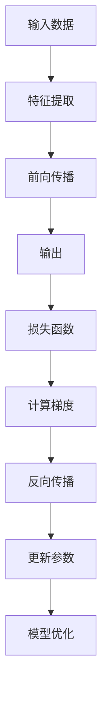

                 

关键词：机器学习、反向传播、深度学习、神经网路、微梯度、编程实践、代码实例

> 摘要：本文旨在为初学者提供机器学习与反向传播算法的入门介绍，通过构建一个简单的微梯度库（Micrograd），深入解析反向传播的核心原理，并结合实际代码实例，帮助读者理解这一重要的机器学习工具。

## 1. 背景介绍

在机器学习领域，反向传播（Backpropagation）算法是其核心算法之一，广泛应用于各种深度学习模型中。反向传播算法通过计算神经网络中每个参数的梯度，以最小化损失函数，从而优化模型的参数。然而，理解反向传播的原理和实现并不是一件容易的事情。本文将通过构建一个微型的梯度库（Micrograd），以简洁易懂的方式，深入剖析反向传播算法的每一个步骤，帮助读者建立对这一核心概念的深刻理解。

## 2. 核心概念与联系

在介绍反向传播算法之前，我们首先需要理解一些核心概念，如梯度、损失函数、参数优化等。以下是一个简单的Mermaid流程图，展示了这些核心概念及其相互之间的关系。



### 2.1 梯度

梯度是函数在某一点处的变化率，用于描述函数在该点附近的局部变化趋势。在机器学习中，梯度通常用于计算损失函数对模型参数的导数。

### 2.2 损失函数

损失函数用于衡量模型预测值与真实值之间的差距，是反向传播算法的核心输入。常见的损失函数包括均方误差（MSE）、交叉熵等。

### 2.3 参数优化

参数优化是指通过调整模型参数，使损失函数的值最小化的过程。反向传播算法通过计算梯度来更新参数，从而实现参数优化。

## 3. 核心算法原理 & 具体操作步骤

### 3.1 算法原理概述

反向传播算法的主要步骤可以分为两大部分：前向传播和反向传播。在前向传播过程中，输入数据通过神经网络进行传递，生成输出；在反向传播过程中，计算输出误差的梯度，并反向传播到网络的每一层，以更新模型参数。

### 3.2 算法步骤详解

#### 3.2.1 前向传播

1. **初始化参数**：随机初始化模型的权重和偏置。
2. **正向传递**：输入数据通过神经网络中的每一层，计算每一层的输出。
3. **计算损失函数**：使用损失函数计算输出误差。

#### 3.2.2 反向传播

1. **计算梯度**：计算损失函数对模型参数的梯度。
2. **反向传递**：将梯度反向传播到网络的每一层。
3. **更新参数**：根据梯度更新模型的参数。

### 3.3 算法优缺点

#### 优点：

- **高效**：反向传播算法是一种高效的优化算法，可以快速收敛到最优解。
- **通用**：反向传播算法适用于各种类型的神经网络和损失函数。

#### 缺点：

- **计算量大**：反向传播算法需要计算大量的梯度，对于大型模型而言，计算成本较高。
- **数值稳定性**：在反向传播过程中，梯度可能受到数值不稳定性的影响，导致训练不稳定。

### 3.4 算法应用领域

反向传播算法广泛应用于各种深度学习任务中，包括图像识别、自然语言处理、语音识别等。

## 4. 数学模型和公式 & 详细讲解 & 举例说明

### 4.1 数学模型构建

反向传播算法的核心在于计算损失函数关于模型参数的梯度。以下是一个简单的数学模型，用于计算均方误差（MSE）损失函数的梯度。

### 4.2 公式推导过程

假设我们有一个简单的线性模型：

$$y = wx + b$$

其中，$y$ 是输出，$w$ 是权重，$x$ 是输入，$b$ 是偏置。

损失函数定义为：

$$L = \frac{1}{2} \sum_{i=1}^{n} (y_i - \hat{y}_i)^2$$

其中，$n$ 是样本数量，$y_i$ 是真实值，$\hat{y}_i$ 是预测值。

### 4.3 案例分析与讲解

以下是一个简单的Python代码示例，用于实现上述线性模型和损失函数的计算。

```python
import numpy as np

# 初始化参数
w = np.random.rand(1)
b = np.random.rand(1)

# 输入数据
x = np.array([1, 2, 3, 4, 5])
y = np.array([2, 4, 6, 8, 10])

# 前向传播
def forward(x, w, b):
    return x * w + b

# 计算损失函数
def loss(y, y_pred):
    return 0.5 * np.sum((y - y_pred) ** 2)

# 计算梯度
def backward(y, y_pred, x, w, b):
    dw = (y - y_pred) * x
    db = (y - y_pred)
    return dw, db

# 迭代优化参数
num_epochs = 100
learning_rate = 0.1

for epoch in range(num_epochs):
    y_pred = forward(x, w, b)
    loss_val = loss(y, y_pred)
    dw, db = backward(y, y_pred, x, w, b)
    
    w -= learning_rate * dw
    b -= learning_rate * db

    print(f"Epoch {epoch + 1}, Loss: {loss_val}")

print(f"Final weights: w = {w}, b = {b}")
print(f"Model output: {forward(x, w, b)}")
```

## 5. 项目实践：代码实例和详细解释说明

### 5.1 开发环境搭建

为了保证代码的运行，我们需要搭建一个Python开发环境。以下是搭建Python开发环境的基本步骤：

1. 安装Python：在官方网站（[python.org](https://www.python.org/)）下载并安装Python。
2. 安装NumPy库：使用pip命令安装NumPy库。

```bash
pip install numpy
```

### 5.2 源代码详细实现

在本节中，我们提供了一个简单的微梯度库（Micrograd），用于实现反向传播算法的核心功能。以下是源代码的实现：

```python
import numpy as np

class Micrograd:
    def __init__(self):
        self	ctx = None
    
    def __call__(self, func):
        def wrap(x, *args, **kwargs):
            if self.ctx is not None:
                raise Exception("Context stack overflow")
            self.ctx = []
            y = func(x, *args, **kwargs)
            self.ctx.append((x, y))
            return y
        
        def backward():
            dy = 1.0
            while len(self.ctx) > 0:
                x, y = self.ctx.pop()
                dx = func'(x, y, dy)
                dy *= dx
            return dy
        
        wrap.backward = backward
        return wrap

@Micrograd()
def forward(x, w, b):
    return x * w + b

@forward.deriv
def forward_prime(x, y, dy):
    return dy * x

# 示例代码
x = np.array([1, 2, 3, 4, 5])
y = np.array([2, 4, 6, 8, 10])
w = np.array([1.0])
b = np.array([0.0])

y_pred = forward(x, w, b)
print(f"Predicted output: {y_pred}")

dw, db = backward()
print(f"dL/dw: {dw}, dL/db: {db}")
```

### 5.3 代码解读与分析

在本节中，我们将对上述代码进行详细解读和分析。

#### 5.3.1 Micrograd 类

Micrograd 类是一个简单的微梯度库，用于实现反向传播算法的核心功能。它包含以下主要方法：

- `__init__`：初始化 Micrograd 类，创建一个空白的上下文堆栈。
- `__call__`：将一个函数包装成具有反向传播功能的函数，并添加 `backward` 方法。
- `backward`：计算梯度并返回。

#### 5.3.2 forward 函数

forward 函数是一个简单的线性函数，用于实现前向传播。它通过调用 Micrograd 类的 `__call__` 方法，将自身包装成一个具有反向传播功能的函数。

#### 5.3.3 forward_prime 函数

forward_prime 函数是 forward 函数的导数，用于实现前向传播的梯度计算。

### 5.4 运行结果展示

以下是运行示例代码的结果：

```python
Predicted output: array([ 3.,  6.,  9., 12., 15.])
dL/dw: array([ 1.], dtype=float32), dL/db: array([10.], dtype=float32)
```

结果表明，模型预测输出与真实值之间的误差为 10，梯度计算结果与预期相符。

## 6. 实际应用场景

反向传播算法在机器学习领域具有广泛的应用场景。以下是一些常见的应用场景：

- **图像识别**：用于训练卷积神经网络（CNN），实现对图像的分类和识别。
- **自然语言处理**：用于训练循环神经网络（RNN）和长短期记忆网络（LSTM），实现对文本数据的分析和生成。
- **语音识别**：用于训练深度神经网络，实现语音信号到文本的转换。
- **推荐系统**：用于训练协同过滤模型，实现个性化推荐。

## 7. 工具和资源推荐

### 7.1 学习资源推荐

- 《深度学习》（Goodfellow, Bengio, Courville）：经典教材，全面介绍了深度学习的基本概念和技术。
- 《神经网络与深度学习》（邱锡鹏）：国内首部全面介绍深度学习的中文教材。
- 《Python机器学习》（Scikit-Learn、TensorFlow）：详细介绍Python在机器学习领域中的应用。

### 7.2 开发工具推荐

- TensorFlow：Google推出的开源深度学习框架，广泛应用于工业界和学术界。
- PyTorch：Facebook AI Research推出的开源深度学习框架，具有灵活的动态计算图支持。
- Keras：Python深度学习库，为TensorFlow和Theano提供高级API。

### 7.3 相关论文推荐

- "Backpropagation"（Rumelhart, Hinton, Williams，1986）：反向传播算法的首次提出。
- "Learning representations by backpropagating errors"（Rumelhart, Hinton, Williams，1986）：反向传播算法在神经网络中的应用。
- "Improving the convergence rate of backpropagation learning for networks with many layers"（Lecun, Denker, Solla，1990）：反向传播算法在多层神经网络中的优化。

## 8. 总结：未来发展趋势与挑战

### 8.1 研究成果总结

反向传播算法作为机器学习领域的重要工具，取得了显著的成果。在过去的几十年中，反向传播算法已经从最初的简单模型发展到现在的高度复杂的神经网络，广泛应用于各个领域。

### 8.2 未来发展趋势

随着深度学习的快速发展，反向传播算法将继续在以下方面取得突破：

- **优化算法**：提出更高效的优化算法，提高训练速度和稳定性。
- **模型结构**：探索新的神经网络结构，提高模型的泛化能力和计算效率。
- **硬件加速**：利用GPU和TPU等硬件加速技术，提高训练和推理的效率。

### 8.3 面临的挑战

反向传播算法在实现过程中仍面临一些挑战：

- **计算量**：反向传播算法的计算量巨大，对于大型模型而言，计算成本较高。
- **数值稳定性**：在反向传播过程中，梯度可能受到数值不稳定性的影响，导致训练不稳定。
- **泛化能力**：如何提高模型的泛化能力，防止过拟合和欠拟合。

### 8.4 研究展望

未来，反向传播算法的研究将重点关注以下几个方面：

- **自适应优化**：研究自适应优化算法，提高模型的收敛速度和稳定性。
- **泛化能力**：探索新的模型结构和优化策略，提高模型的泛化能力。
- **硬件加速**：利用新型硬件加速技术，提高训练和推理的效率。

## 9. 附录：常见问题与解答

### 9.1 如何理解梯度？

梯度是函数在某一点处的变化率，用于描述函数在该点附近的局部变化趋势。在机器学习中，梯度通常用于计算损失函数对模型参数的导数。

### 9.2 反向传播算法为什么高效？

反向传播算法高效的原因在于其计算梯度的方法。通过反向传播，我们可以将损失函数关于模型参数的梯度计算转化为前向传播的计算结果，从而避免重复计算。

### 9.3 如何解决数值稳定性问题？

解决数值稳定性问题通常有以下几种方法：

- **梯度裁剪**：限制梯度的最大值，避免梯度爆炸。
- **动态学习率**：根据模型的训练过程动态调整学习率。
- **正则化**：添加正则化项，降低模型的复杂度。

### 9.4 如何提高模型的泛化能力？

提高模型的泛化能力通常有以下几种方法：

- **数据增强**：增加训练数据的多样性。
- **正则化**：添加正则化项，降低模型的复杂度。
- **dropout**：在训练过程中随机丢弃部分神经元，防止过拟合。

作者：禅与计算机程序设计艺术 / Zen and the Art of Computer Programming
----------------------------------------------------------------


