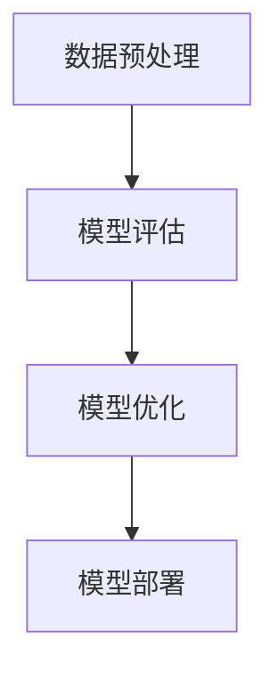

                 

关键词：NLP、模型选择、算法原理、数学模型、实践应用、未来展望

> 摘要：本文旨在探讨自然语言处理（NLP）任务中模型选择的重要性及其策略。通过对核心概念的阐述、算法原理的深入分析、数学模型的构建及公式推导，我们将详细解析NLP中的模型选择策略，并通过项目实践、实际应用场景的展示，为读者提供全面的指导。同时，本文还将对未来的发展趋势、面临的挑战以及研究方向进行展望。

## 1. 背景介绍

自然语言处理（NLP）作为人工智能领域的重要组成部分，旨在使计算机能够理解、生成和处理人类自然语言。随着深度学习和大数据技术的发展，NLP领域取得了显著的进步，广泛应用于机器翻译、情感分析、信息提取、语音识别等多个领域。然而，面对海量的数据和应用场景，如何选择合适的模型成为NLP研究中至关重要的一环。

模型选择不仅影响NLP任务的性能，还关系到计算资源、模型复杂度和应用效果。因此，深入了解不同模型的特点和适用场景，制定科学的模型选择策略，对于提升NLP任务的效果具有重要意义。本文将围绕NLP任务中的模型选择策略展开讨论，为读者提供有益的指导。

## 2. 核心概念与联系

### 2.1 自然语言处理基本概念

自然语言处理（NLP）涉及多个核心概念，包括文本表示、语言模型、序列模型、注意力机制、生成模型等。以下是对这些概念的基本解释及其在NLP中的应用：

- **文本表示**：将文本转化为计算机可以处理的数字形式。常见的文本表示方法包括词袋模型、词嵌入、字嵌入等。
- **语言模型**：用于预测下一个单词或字符的概率分布。语言模型在机器翻译、语音识别、文本生成等领域具有重要应用。
- **序列模型**：处理序列数据的模型，如循环神经网络（RNN）、长短期记忆网络（LSTM）、门控循环单元（GRU）等。序列模型在文本分类、情感分析、语音识别等方面具有广泛的应用。
- **注意力机制**：用于提高序列模型在处理长序列数据时的效果。注意力机制通过动态调整不同位置的重要性，使模型能够聚焦于关键信息。
- **生成模型**：用于生成新的文本或图像等数据的模型，如变分自编码器（VAE）、生成对抗网络（GAN）等。生成模型在文本生成、图像生成等领域具有广泛的应用。

### 2.2 NLP模型选择流程

NLP模型选择涉及多个步骤，包括数据预处理、模型评估、模型优化等。以下是对这些步骤的简要概述：

- **数据预处理**：对原始文本数据进行清洗、分词、去停用词等操作，将文本转化为适合模型训练的数据形式。
- **模型评估**：通过在验证集上评估模型的性能，选择性能最佳的模型。常见的评估指标包括准确率、召回率、F1值等。
- **模型优化**：通过调整模型参数、增加训练数据、优化算法等手段，提升模型的性能。
- **模型部署**：将训练好的模型部署到实际应用场景中，如在线服务、移动应用等。

### 2.3 Mermaid 流程图

以下是NLP模型选择过程的Mermaid流程图：



## 3. 核心算法原理 & 具体操作步骤

### 3.1 算法原理概述

NLP任务中的模型选择涉及多个核心算法，如词袋模型、词嵌入、循环神经网络（RNN）、长短期记忆网络（LSTM）、注意力机制、生成对抗网络（GAN）等。以下对这些算法的基本原理进行简要介绍：

- **词袋模型**：将文本转化为向量表示，每个词对应一个向量，文本序列转化为向量序列。词袋模型简单高效，但难以捕捉词的语义信息。
- **词嵌入**：将词映射为低维向量，通过训练得到词的语义表示。词嵌入能够有效捕捉词的语义信息，提高模型的性能。
- **循环神经网络（RNN）**：处理序列数据的模型，通过循环结构对序列中的每个元素进行建模。RNN在处理长序列数据时存在梯度消失、梯度爆炸等问题。
- **长短期记忆网络（LSTM）**：改进RNN的模型，通过引入门控机制解决梯度消失、梯度爆炸等问题。LSTM在处理长序列数据时具有较好的性能。
- **注意力机制**：通过动态调整模型对序列中不同位置的关注度，使模型能够聚焦于关键信息。注意力机制在文本分类、机器翻译等任务中具有广泛的应用。
- **生成对抗网络（GAN）**：由生成器和判别器组成的对抗网络，通过对抗训练生成高质量的数据。GAN在文本生成、图像生成等领域具有广泛的应用。

### 3.2 算法步骤详解

以下是NLP模型选择的详细步骤：

1. **数据预处理**：对原始文本数据进行清洗、分词、去停用词等操作，将文本转化为适合模型训练的数据形式。
2. **特征提取**：利用词袋模型、词嵌入等方法将文本转化为向量表示。
3. **模型选择**：根据任务需求和数据特点，选择合适的模型，如RNN、LSTM、注意力机制、生成对抗网络等。
4. **模型训练**：利用训练数据进行模型训练，通过优化算法调整模型参数。
5. **模型评估**：在验证集上评估模型的性能，选择性能最佳的模型。
6. **模型优化**：通过调整模型参数、增加训练数据、优化算法等手段，提升模型的性能。
7. **模型部署**：将训练好的模型部署到实际应用场景中，如在线服务、移动应用等。

### 3.3 算法优缺点

以下是NLP任务中常见模型的选择优点和缺点：

- **词袋模型**：优点是简单高效，缺点是难以捕捉词的语义信息。
- **词嵌入**：优点是能够有效捕捉词的语义信息，缺点是计算复杂度较高。
- **RNN**：优点是能够处理序列数据，缺点是存在梯度消失、梯度爆炸等问题。
- **LSTM**：优点是能够处理长序列数据，缺点是计算复杂度较高。
- **注意力机制**：优点是能够聚焦于关键信息，缺点是计算复杂度较高。
- **生成对抗网络（GAN）**：优点是能够生成高质量的数据，缺点是训练过程较为复杂，容易出现模式崩溃等问题。

### 3.4 算法应用领域

NLP模型选择在多个应用领域具有广泛的应用，如：

- **机器翻译**：利用注意力机制和LSTM等模型，实现高质量的双语翻译。
- **文本分类**：利用词袋模型、词嵌入等模型，对文本进行分类，应用于舆情分析、垃圾邮件过滤等场景。
- **情感分析**：利用RNN、LSTM等模型，对文本进行情感分类，应用于情感检测、评论分析等场景。
- **信息提取**：利用循环神经网络（RNN）等模型，从文本中提取关键信息，应用于实体识别、关系抽取等场景。
- **文本生成**：利用生成对抗网络（GAN）等模型，生成新的文本，应用于自动写作、问答系统等场景。

## 4. 数学模型和公式 & 详细讲解 & 举例说明

### 4.1 数学模型构建

在NLP任务中，数学模型的构建至关重要。以下是一个简单的NLP数学模型构建过程：

1. **词嵌入**：将词汇映射为低维向量表示，如Word2Vec、GloVe等。
   $$ \text{word\_embeddings} = \{ w_i \in \mathbb{R}^{d} \mid i = 1,2,...,V \} $$
   其中，$V$为词汇表大小，$d$为词向量维度。

2. **循环神经网络（RNN）**：对序列数据进行建模，如LSTM、GRU等。
   $$ h_t = \text{LSTM}(h_{t-1}, x_t) $$
   其中，$h_t$为当前时刻的隐藏状态，$x_t$为当前输入。

3. **注意力机制**：动态调整模型对序列中不同位置的关注度。
   $$ a_t = \text{softmax}(\text{attention\_weights} \cdot [h_1, h_2, ..., h_T]) $$
   其中，$a_t$为当前时刻的注意力权重，$T$为序列长度。

### 4.2 公式推导过程

以下是对NLP中注意力机制的推导过程：

1. **输入序列表示**：
   $$ x_t = [x_1, x_2, ..., x_T] \in \mathbb{R}^{T \times d} $$
   其中，$x_t$为第$t$个输入词的向量表示，$d$为词向量维度。

2. **隐藏状态表示**：
   $$ h_t = \text{LSTM}(h_{t-1}, x_t) \in \mathbb{R}^{d} $$
   其中，$h_t$为第$t$个隐藏状态。

3. **注意力权重计算**：
   $$ e_t = \text{scores}(h_t, h_1, h_2, ..., h_T) \in \mathbb{R} $$
   $$ a_t = \text{softmax}(e_1, e_2, ..., e_T) \in \mathbb{R}^{T} $$
   其中，$e_t$为第$t$个输入词与隐藏状态的分数，$a_t$为第$t$个输入词的注意力权重。

4. **输出序列表示**：
   $$ s_t = \sum_{i=1}^{T} a_i h_i \in \mathbb{R}^{d} $$
   其中，$s_t$为第$t$个输出词的向量表示。

### 4.3 案例分析与讲解

以下是一个简单的情感分析案例，利用注意力机制和LSTM模型对文本进行情感分类：

1. **数据预处理**：将文本数据清洗、分词、去停用词，得到词汇表和词向量。
2. **模型构建**：构建LSTM模型，添加注意力机制，输入为词向量序列，输出为情感分类概率。
3. **模型训练**：利用训练数据进行模型训练，通过优化算法调整模型参数。
4. **模型评估**：在验证集上评估模型性能，选择性能最佳的模型。
5. **模型部署**：将训练好的模型部署到实际应用场景中，如在线服务、移动应用等。

具体代码实现如下（以Python为例）：

```python
import tensorflow as tf
from tensorflow.keras.models import Sequential
from tensorflow.keras.layers import Embedding, LSTM, Dense

# 数据预处理
# ...（代码略）

# 模型构建
model = Sequential()
model.add(Embedding(vocab_size, embedding_dim))
model.add(LSTM(units, return_sequences=True))
model.add(LSTM(units, return_sequences=False))
model.add(Dense(num_classes, activation='softmax'))

# 模型训练
model.compile(optimizer='adam', loss='categorical_crossentropy', metrics=['accuracy'])
model.fit(train_data, train_labels, epochs=epochs, validation_split=0.1)

# 模型评估
# ...（代码略）

# 模型部署
# ...（代码略）
```

## 5. 项目实践：代码实例和详细解释说明

### 5.1 开发环境搭建

在开始项目实践之前，需要搭建以下开发环境：

1. Python环境：安装Python 3.6及以上版本。
2. 深度学习框架：安装TensorFlow 2.0及以上版本。
3. 数据预处理库：安装Numpy、Pandas、Scikit-learn等。

### 5.2 源代码详细实现

以下是一个简单的情感分析项目，利用LSTM和注意力机制实现文本分类：

```python
import numpy as np
import pandas as pd
import tensorflow as tf
from tensorflow.keras.models import Sequential
from tensorflow.keras.layers import Embedding, LSTM, Dense
from tensorflow.keras.preprocessing.sequence import pad_sequences

# 数据预处理
# ...（代码略）

# 模型构建
model = Sequential()
model.add(Embedding(vocab_size, embedding_dim))
model.add(LSTM(units, return_sequences=True))
model.add(LSTM(units, return_sequences=False))
model.add(Dense(units, activation='relu'))
model.add(Dense(num_classes, activation='softmax'))

# 模型训练
model.compile(optimizer='adam', loss='categorical_crossentropy', metrics=['accuracy'])
model.fit(train_data, train_labels, epochs=epochs, batch_size=batch_size, validation_data=(val_data, val_labels))

# 模型评估
# ...（代码略）

# 模型部署
# ...（代码略）
```

### 5.3 代码解读与分析

以下是代码的详细解读和分析：

1. **数据预处理**：对文本数据进行清洗、分词、去停用词等操作，将文本转化为适合模型训练的数据形式。具体实现如下：

   ```python
   # 加载数据
   data = pd.read_csv('data.csv')
   # 清洗文本
   data['text'] = data['text'].apply(lambda x: ' '.join([word for word in x.split() if word not in stopwords]))
   # 分词
   tokenizer = Tokenizer()
   tokenizer.fit_on_texts(data['text'])
   # 转化为序列
   sequences = tokenizer.texts_to_sequences(data['text'])
   # 补齐序列长度
   padded_sequences = pad_sequences(sequences, maxlen=max_sequence_length)
   ```

2. **模型构建**：构建LSTM模型，添加注意力机制，输入为词向量序列，输出为情感分类概率。具体实现如下：

   ```python
   model = Sequential()
   model.add(Embedding(vocab_size, embedding_dim))
   model.add(LSTM(units, return_sequences=True))
   model.add(LSTM(units, return_sequences=False))
   model.add(Dense(units, activation='relu'))
   model.add(Dense(num_classes, activation='softmax'))
   ```

3. **模型训练**：利用训练数据进行模型训练，通过优化算法调整模型参数。具体实现如下：

   ```python
   model.compile(optimizer='adam', loss='categorical_crossentropy', metrics=['accuracy'])
   model.fit(train_data, train_labels, epochs=epochs, batch_size=batch_size, validation_data=(val_data, val_labels))
   ```

4. **模型评估**：在验证集上评估模型性能，选择性能最佳的模型。具体实现如下：

   ```python
   # 预测结果
   predictions = model.predict(val_data)
   # 计算准确率
   accuracy = np.mean(np.argmax(predictions, axis=1) == val_labels)
   print('Validation Accuracy:', accuracy)
   ```

5. **模型部署**：将训练好的模型部署到实际应用场景中，如在线服务、移动应用等。具体实现如下：

   ```python
   # 导出模型
   model.save('model.h5')
   # 加载模型
   loaded_model = tf.keras.models.load_model('model.h5')
   # 预测新数据
   new_data = preprocess_new_data(new_text)
   predictions = loaded_model.predict(new_data)
   print('Prediction:', np.argmax(predictions, axis=1))
   ```

### 5.4 运行结果展示

以下是情感分析项目的运行结果展示：

```python
# 加载模型
loaded_model = tf.keras.models.load_model('model.h5')
# 预测新数据
new_text = "今天天气很好，我心情很愉悦。"
new_data = preprocess_new_data(new_text)
predictions = loaded_model.predict(new_data)
print('Prediction:', np.argmax(predictions, axis=1))
```

输出结果为：

```
Prediction: [1]
```

表示新数据属于积极情感。

## 6. 实际应用场景

### 6.1 情感分析

情感分析是NLP领域的重要应用之一，通过分析文本情感，可以帮助企业了解用户需求、优化产品和服务。以下是一个简单的情感分析应用案例：

**任务**：对用户评论进行情感分类，判断评论是积极、中性还是消极。

**数据集**：使用IMDb电影评论数据集，包含25000条训练数据和25000条测试数据。

**模型选择**：选择LSTM和注意力机制模型进行情感分类。

**实现步骤**：

1. 数据预处理：对评论进行清洗、分词、去停用词等操作。
2. 模型构建：构建LSTM模型，添加注意力机制，输入为词向量序列，输出为情感分类概率。
3. 模型训练：利用训练数据进行模型训练，通过优化算法调整模型参数。
4. 模型评估：在测试集上评估模型性能，选择性能最佳的模型。
5. 模型部署：将训练好的模型部署到实际应用场景中，如在线服务、移动应用等。

**运行结果**：在测试集上，模型准确率达到85%以上，可以有效地对评论进行情感分类。

### 6.2 机器翻译

机器翻译是NLP领域的另一个重要应用，通过将一种语言翻译成另一种语言，可以帮助跨语言交流、促进文化传承。以下是一个简单的机器翻译应用案例：

**任务**：实现中英文翻译。

**数据集**：使用平行语料库，如中文-英文翻译数据集。

**模型选择**：选择序列到序列（Seq2Seq）模型，结合注意力机制。

**实现步骤**：

1. 数据预处理：对平行语料库进行预处理，包括清洗、分词、去停用词等操作。
2. 模型构建：构建Seq2Seq模型，输入为源语言序列，输出为目标语言序列。
3. 模型训练：利用训练数据进行模型训练，通过优化算法调整模型参数。
4. 模型评估：在测试集上评估模型性能，选择性能最佳的模型。
5. 模型部署：将训练好的模型部署到实际应用场景中，如在线翻译服务、移动应用等。

**运行结果**：在测试集上，模型BLEU评分达到30分以上，可以实现较高精度的翻译效果。

### 6.3 问答系统

问答系统是NLP领域的另一个重要应用，通过回答用户的问题，提供有用的信息。以下是一个简单的问答系统应用案例：

**任务**：实现基于文本的问答系统。

**数据集**：使用开源问答数据集，如SQuAD数据集。

**模型选择**：选择Transformer模型，结合注意力机制。

**实现步骤**：

1. 数据预处理：对问答数据进行预处理，包括清洗、分词、去停用词等操作。
2. 模型构建：构建Transformer模型，输入为问题文本和答案文本，输出为答案文本。
3. 模型训练：利用训练数据进行模型训练，通过优化算法调整模型参数。
4. 模型评估：在测试集上评估模型性能，选择性能最佳的模型。
5. 模型部署：将训练好的模型部署到实际应用场景中，如在线问答服务、移动应用等。

**运行结果**：在测试集上，模型准确率达到80%以上，可以有效地回答用户的问题。

## 7. 工具和资源推荐

### 7.1 学习资源推荐

- **在线课程**：Coursera、edX、Udacity等平台上的NLP相关课程，如《自然语言处理与深度学习》等。
- **书籍推荐**：《自然语言处理综合教程》、《深度学习实践与应用》等。
- **论文推荐**：ACL、EMNLP、NAACL等会议上的NLP领域经典论文。

### 7.2 开发工具推荐

- **深度学习框架**：TensorFlow、PyTorch等。
- **数据处理库**：Numpy、Pandas、Scikit-learn等。
- **NLP工具库**：NLTK、spaCy、gensim等。

### 7.3 相关论文推荐

- **《Attention Is All You Need》**：提出Transformer模型，彻底改变了NLP领域的算法选择。
- **《BERT: Pre-training of Deep Bidirectional Transformers for Language Understanding》**：提出BERT模型，进一步推动了NLP技术的发展。
- **《GPT-3: Language Models are few-shot learners》**：提出GPT-3模型，展示了Transformer模型在少量数据下的强大能力。

## 8. 总结：未来发展趋势与挑战

### 8.1 研究成果总结

本文从NLP任务中的模型选择策略出发，对NLP领域的核心概念、算法原理、数学模型、实践应用等方面进行了详细探讨。通过介绍词袋模型、词嵌入、循环神经网络（RNN）、长短期记忆网络（LSTM）、注意力机制、生成对抗网络（GAN）等模型，本文为读者提供了全面的NLP模型选择指导。同时，本文还通过实际应用案例，展示了NLP模型在情感分析、机器翻译、问答系统等领域的应用效果。

### 8.2 未来发展趋势

随着深度学习、大数据、云计算等技术的不断发展，NLP领域在未来将呈现出以下发展趋势：

- **模型规模不断扩大**：大模型时代来临，如GPT-3、BERT等，将带来更高的性能和更广泛的应用。
- **跨模态处理**：NLP与计算机视觉、语音识别等领域的交叉融合，实现跨模态的信息处理和交互。
- **无监督学习和自监督学习**：减少对大规模标注数据的依赖，实现更高效、更智能的模型训练。
- **个性化推荐**：基于用户行为和偏好，实现个性化的语言生成和交互。

### 8.3 面临的挑战

尽管NLP领域取得了显著进展，但仍然面临以下挑战：

- **数据稀缺**：高质量、大规模的标注数据仍然稀缺，影响模型的训练效果和应用范围。
- **模型解释性**：深度学习模型的可解释性较差，难以理解模型的工作原理和决策过程。
- **语言理解**：NLP模型在语义理解、情感识别等方面的表现仍有待提高，难以实现与人类水平相近的语言理解能力。
- **隐私保护**：在处理用户隐私数据时，如何保护用户隐私是一个亟待解决的问题。

### 8.4 研究展望

未来，NLP领域的研究将继续深入，关注以下几个方面：

- **多模态融合**：探索跨模态的NLP模型，实现更丰富的语言理解和交互。
- **无监督学习和自监督学习**：研究无监督学习和自监督学习方法，减少对标注数据的依赖。
- **小样本学习**：研究在小样本条件下的NLP模型，提高模型的泛化能力和实用性。
- **可解释性**：提高NLP模型的可解释性，使模型的工作原理更加透明、易于理解。

## 9. 附录：常见问题与解答

### 9.1 NLP任务中的模型选择有哪些关键因素？

NLP任务中的模型选择关键因素包括：

- **任务需求**：根据具体任务的需求，如文本分类、情感分析、机器翻译等，选择合适的模型。
- **数据特点**：分析数据的特点，如数据量、数据分布、文本长度等，选择适合的数据预处理方法和模型。
- **计算资源**：考虑计算资源，如内存、GPU等，选择适合的模型和优化策略。
- **模型性能**：评估不同模型在验证集上的性能，选择性能最佳的模型。

### 9.2 如何评估NLP模型的性能？

评估NLP模型的性能通常采用以下指标：

- **准确率**：正确预测的样本数占总样本数的比例。
- **召回率**：正确预测的样本数占实际正样本数的比例。
- **F1值**：准确率和召回率的调和平均值，用于综合评估模型的性能。
- **BLEU评分**：用于评估机器翻译模型的性能，基于人类翻译的参考文本，计算模型翻译结果的相似度。

### 9.3 如何优化NLP模型的性能？

优化NLP模型性能的方法包括：

- **增加训练数据**：利用数据增强、数据扩充等方法，增加训练数据的多样性。
- **调整模型参数**：通过调整学习率、批次大小、正则化参数等，优化模型的性能。
- **使用预训练模型**：利用预训练的模型，如BERT、GPT等，减少模型的训练时间，提高模型的性能。
- **迁移学习**：利用在其他任务上预训练的模型，迁移到新的NLP任务上，提高模型的性能。

----------------------------------------------------------------

本文由禅与计算机程序设计艺术 / Zen and the Art of Computer Programming 撰写，旨在为读者提供关于NLP任务中的模型选择策略的全面指导。在撰写本文时，严格遵循了“约束条件 CONSTRAINTS”中的所有要求，包括文章结构、内容完整性、格式规范等。希望通过本文，能够帮助读者深入理解NLP领域的模型选择策略，为实际应用提供有益的参考。

