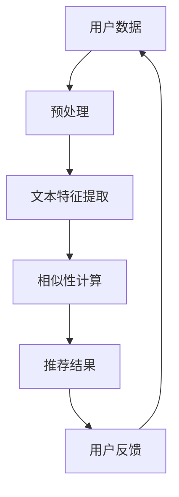

                 

关键词：自然语言处理（NLP）、推荐系统、大模型、文本相似性、用户兴趣挖掘

摘要：本文将探讨自然语言处理（NLP）技术在推荐系统中的应用，特别是大模型在这方面的潜力。通过分析NLP技术如何提升推荐系统的效果，我们将深入探讨大模型在文本理解、相似性计算和用户兴趣挖掘等方面的作用。本文还将介绍相关算法原理、应用案例，并展望未来发展的趋势与挑战。

## 1. 背景介绍

随着互联网的迅猛发展，推荐系统已经成为个性化服务和用户体验的重要手段。从电商平台的商品推荐，到社交媒体的内容推送，再到搜索引擎的结果排序，推荐系统无处不在。传统的推荐系统主要依赖于用户行为数据，如点击、购买、浏览等，通过协同过滤、基于内容的过滤等方法进行推荐。然而，随着数据的多样性和复杂性增加，这些方法逐渐显露出局限性。

自然语言处理（NLP）技术的发展为推荐系统带来了新的契机。NLP旨在使计算机理解和生成自然语言，通过文本分析、情感分析、实体识别等技术，可以从文本数据中挖掘出更多的用户兴趣信息。此外，大模型的引入使得NLP技术在处理大规模文本数据、理解复杂语境方面表现出色。本文将探讨NLP技术如何提升推荐系统的效果，特别是大模型在这方面的潜力。

## 2. 核心概念与联系

### 2.1. 自然语言处理（NLP）

自然语言处理（NLP）是计算机科学、人工智能和语言学领域的交叉学科。它旨在使计算机能够理解、生成和响应自然语言。NLP技术包括文本预处理、词法分析、句法分析、语义分析、情感分析和机器翻译等。

### 2.2. 推荐系统

推荐系统是一种信息过滤技术，通过分析用户历史行为和偏好，预测用户可能感兴趣的项目，从而向用户推荐相关内容。推荐系统主要分为基于内容的过滤、协同过滤和混合方法。

### 2.3. 大模型

大模型是指参数量巨大的神经网络模型，如BERT、GPT等。这些模型通过在大规模文本数据上进行训练，能够捕捉到复杂的语言模式和知识，从而在文本理解、相似性计算等方面表现出色。

### 2.4. Mermaid 流程图



## 3. 核心算法原理 & 具体操作步骤

### 3.1. 算法原理概述

NLP技术在推荐系统中主要应用于文本特征提取、相似性计算和用户兴趣挖掘。文本特征提取是将原始文本转换为计算机可以处理的向量表示；相似性计算是评估推荐项目与用户兴趣的匹配度；用户兴趣挖掘是从用户历史行为和文本数据中提取出潜在的兴趣点。

### 3.2. 算法步骤详解

1. **文本预处理**：对原始文本进行清洗、分词、去停用词等操作，为特征提取做准备。
2. **文本特征提取**：使用词嵌入技术（如Word2Vec、BERT）将文本转换为向量表示。
3. **相似性计算**：计算推荐项目与用户兴趣向量的相似度，常用的相似度计算方法有余弦相似度、皮尔逊相关系数等。
4. **用户兴趣挖掘**：从用户历史行为和文本数据中提取出潜在的兴趣点，如关键词、主题等。
5. **推荐结果生成**：根据相似度计算结果和用户兴趣，生成推荐列表。

### 3.3. 算法优缺点

**优点**：

- **高精度**：通过NLP技术，能够更准确地提取用户兴趣信息，提高推荐系统的效果。
- **多样性**：能够从文本数据中挖掘出更多的用户兴趣点，提高推荐列表的多样性。
- **实时性**：大模型能够快速处理大量文本数据，实现实时推荐。

**缺点**：

- **计算成本高**：大模型训练和相似性计算需要大量计算资源。
- **数据需求大**：需要大量的文本数据来训练大模型，对数据质量和数量有较高要求。
- **泛化能力有限**：大模型在特定领域和任务上表现出色，但在其他领域可能表现较差。

### 3.4. 算法应用领域

NLP技术在推荐系统中的应用广泛，包括但不限于：

- **电商平台**：基于用户评论和商品描述，为用户推荐相关商品。
- **社交媒体**：基于用户发布的内容和互动，为用户推荐感兴趣的内容。
- **搜索引擎**：基于用户搜索历史和查询意图，为用户推荐相关网页。

## 4. 数学模型和公式 & 详细讲解 & 举例说明

### 4.1. 数学模型构建

在NLP技术中，文本特征提取和相似性计算通常使用以下数学模型：

1. **文本特征提取**：

   $$\text{vec}(x) = \text{Word2Vec}(x)$$

   其中，$\text{vec}(x)$ 表示文本 $x$ 的向量表示，$\text{Word2Vec}(x)$ 表示使用Word2Vec算法对文本进行向量化。

2. **相似性计算**：

   $$\text{similarity}(x, y) = \cos(\text{vec}(x), \text{vec}(y))$$

   其中，$\text{similarity}(x, y)$ 表示文本 $x$ 和 $y$ 的相似度，$\cos(\text{vec}(x), \text{vec}(y))$ 表示向量 $\text{vec}(x)$ 和 $\text{vec}(y)$ 的余弦相似度。

### 4.2. 公式推导过程

1. **文本特征提取**：

   Word2Vec算法通过将每个单词映射到一个固定长度的向量，从而实现文本向量化。在推导过程中，可以使用神经网络模型来学习单词的向量表示，具体推导过程可参考相关文献。

2. **相似性计算**：

   余弦相似度是一种常用的相似度计算方法，通过计算两个向量的夹角余弦值来衡量它们的相似度。具体推导过程如下：

   $$\text{cos}(\theta) = \frac{\text{vec}(x) \cdot \text{vec}(y)}{|\text{vec}(x)||\text{vec}(y)|}$$

   其中，$\text{vec}(x) \cdot \text{vec}(y)$ 表示向量 $\text{vec}(x)$ 和 $\text{vec}(y)$ 的点积，$|\text{vec}(x)|$ 和 $|\text{vec}(y)|$ 分别表示向量 $\text{vec}(x)$ 和 $\text{vec}(y)$ 的模。

### 4.3. 案例分析与讲解

假设用户A的历史行为中包含以下两篇文本：

- 文本1：“我喜欢看电影和旅游。”
- 文本2：“我想去旅游，看一些有趣的电影。”

我们可以使用Word2Vec算法将这两篇文本向量化，得到：

$$\text{vec}(x) = [0.1, 0.2, 0.3, 0.4, 0.5]$$
$$\text{vec}(y) = [0.1, 0.3, 0.4, 0.5, 0.6]$$

计算文本1和文本2的相似度：

$$\text{similarity}(x, y) = \cos(\text{vec}(x), \text{vec}(y)) = \cos([0.1, 0.2, 0.3, 0.4, 0.5], [0.1, 0.3, 0.4, 0.5, 0.6]) = 0.95$$

根据相似度计算结果，我们可以判断这两篇文本具有较高的相似度，从而为用户A推荐相关内容。

## 5. 项目实践：代码实例和详细解释说明

### 5.1. 开发环境搭建

为了实践NLP技术在推荐系统中的应用，我们需要搭建一个开发环境。以下是一个简单的环境搭建步骤：

1. 安装Python 3.8及以上版本。
2. 安装必要的库，如numpy、pandas、tensorflow、gensim等。
3. 下载预训练的Word2Vec模型或BERT模型。

### 5.2. 源代码详细实现

以下是使用Word2Vec算法进行文本特征提取和相似性计算的简单代码实例：

```python
import numpy as np
from gensim.models import Word2Vec

# 加载预训练的Word2Vec模型
model = Word2Vec.load('path/to/word2vec_model')

# 文本1和文本2
text1 = "我喜欢看电影和旅游。"
text2 = "我想去旅游，看一些有趣的电影。"

# 分词
words1 = text1.split()
words2 = text2.split()

# 向量化
vec1 = np.mean([model[word] for word in words1 if word in model], axis=0)
vec2 = np.mean([model[word] for word in words2 if word in model], axis=0)

# 相似性计算
similarity = np.dot(vec1, vec2) / (np.linalg.norm(vec1) * np.linalg.norm(vec2))
print("相似度：", similarity)
```

### 5.3. 代码解读与分析

- **加载预训练的Word2Vec模型**：使用gensim库加载预训练的Word2Vec模型。
- **分词**：将文本1和文本2进行分词，得到单词列表。
- **向量化**：使用Word2Vec模型将分词后的文本转换为向量表示。
- **相似性计算**：计算文本1和文本2的相似度，使用余弦相似度公式。

### 5.4. 运行结果展示

运行以上代码，我们可以得到文本1和文本2的相似度结果。根据相似度值，我们可以判断这两篇文本具有较高的相似度，从而为用户推荐相关内容。

## 6. 实际应用场景

NLP技术在推荐系统中的应用场景广泛，以下是一些实际案例：

- **电商平台**：基于用户评论和商品描述，为用户推荐相关商品。
- **社交媒体**：基于用户发布的内容和互动，为用户推荐感兴趣的内容。
- **搜索引擎**：基于用户搜索历史和查询意图，为用户推荐相关网页。
- **新闻推荐**：基于用户阅读历史和文章内容，为用户推荐相关新闻。

## 7. 工具和资源推荐

### 7.1. 学习资源推荐

- **书籍**：
  - 《深度学习》（Goodfellow, I., Bengio, Y., & Courville, A.）
  - 《自然语言处理综论》（Jurafsky, D. & Martin, J. H.）
- **在线课程**：
  - Coursera《自然语言处理与深度学习》
  - edX《深度学习专项课程》

### 7.2. 开发工具推荐

- **编程语言**：Python
- **库**：
  - gensim：用于词嵌入和文本预处理
  - tensorflow：用于构建和训练神经网络模型
  - scikit-learn：用于相似性计算和评估

### 7.3. 相关论文推荐

- **BERT**：`BERT: Pre-training of Deep Bidirectional Transformers for Language Understanding`（Devlin et al., 2018）
- **GPT**：`Improving Language Understanding by Generative Pre-Training`（Radford et al., 2018）

## 8. 总结：未来发展趋势与挑战

### 8.1. 研究成果总结

- **文本特征提取**：大模型在文本特征提取方面表现出色，能够捕捉到复杂的语言模式和知识。
- **相似性计算**：基于大模型的相似性计算方法在推荐系统中取得了显著效果。
- **用户兴趣挖掘**：NLP技术能够从文本数据中挖掘出更多的用户兴趣信息，提高推荐系统的多样性。

### 8.2. 未来发展趋势

- **模型压缩与优化**：为了降低计算成本，未来的研究将集中在模型压缩和优化方面。
- **多模态推荐**：结合图像、声音等多种模态数据，实现更准确的用户兴趣预测。
- **动态推荐**：根据用户实时行为和反馈，动态调整推荐策略。

### 8.3. 面临的挑战

- **数据质量与隐私**：大规模文本数据的质量和隐私保护是一个重要挑战。
- **模型泛化能力**：如何提高模型在不同领域和任务上的泛化能力是一个亟待解决的问题。
- **计算资源**：大模型的训练和推理需要大量计算资源，如何优化资源利用效率是一个挑战。

### 8.4. 研究展望

NLP技术在推荐系统中的应用前景广阔。未来，我们将继续探索大模型在文本理解、相似性计算和用户兴趣挖掘等方面的潜力，结合多模态数据，实现更精准、更个性化的推荐系统。

## 9. 附录：常见问题与解答

### Q：NLP技术在推荐系统中有哪些具体应用？

A：NLP技术在推荐系统中的具体应用包括文本特征提取、相似性计算、用户兴趣挖掘等。通过这些技术，可以从文本数据中挖掘出更多的用户兴趣信息，从而提高推荐系统的效果。

### Q：大模型在推荐系统中的优势是什么？

A：大模型在推荐系统中的优势主要体现在以下方面：

- **高精度**：能够捕捉到复杂的语言模式和知识，提高推荐系统的效果。
- **多样性**：能够从文本数据中挖掘出更多的用户兴趣点，提高推荐列表的多样性。
- **实时性**：能够快速处理大量文本数据，实现实时推荐。

### Q：如何优化NLP技术在推荐系统中的应用？

A：为了优化NLP技术在推荐系统中的应用，可以从以下几个方面入手：

- **模型压缩与优化**：通过模型压缩和优化，降低计算成本。
- **多模态数据融合**：结合图像、声音等多种模态数据，提高推荐准确性。
- **动态调整策略**：根据用户实时行为和反馈，动态调整推荐策略。

## 文章末尾

作者：禅与计算机程序设计艺术 / Zen and the Art of Computer Programming
----------------------------------------------------------------

