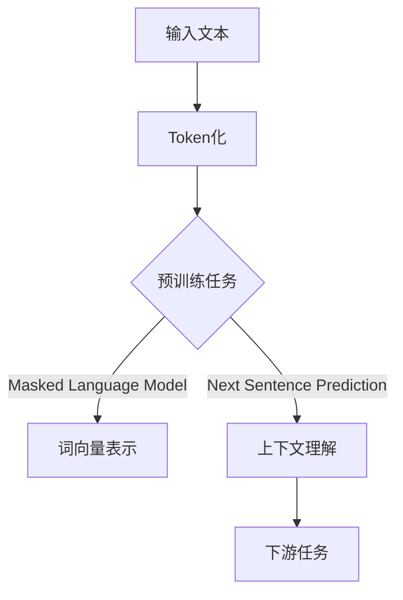
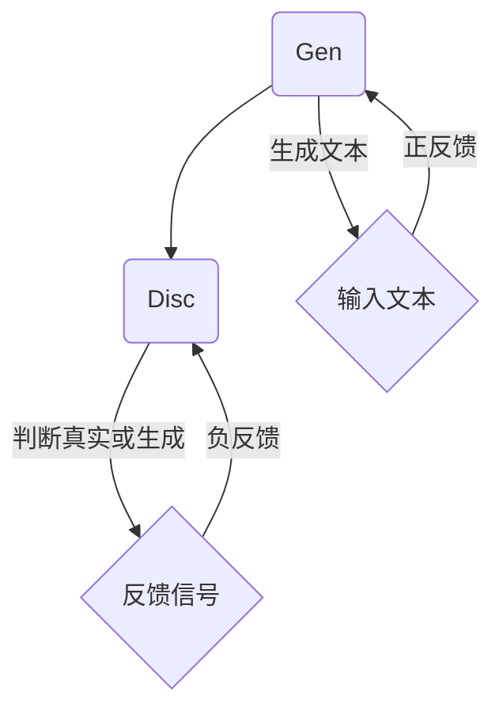

                 

关键词：自然语言处理，大模型，预训练，生成对抗网络，BERT，GPT，语言模型，深度学习

> 摘要：本文将深入探讨自然语言处理（NLP）技术的最新进展，特别是大型语言模型的贡献。通过分析这些模型的原理、应用、数学模型以及项目实践，本文旨在为读者提供一个全面的视角，了解NLP技术的演进和未来趋势。

## 1. 背景介绍

自然语言处理是人工智能的一个重要分支，旨在使计算机能够理解和生成人类语言。随着深度学习和大数据技术的发展，NLP技术取得了显著的进展。特别是在过去几年中，大模型（例如BERT，GPT等）的出现，极大地提升了NLP的性能和应用范围。

大模型，顾名思义，是指具有巨大参数量的神经网络模型。这些模型通过在大量的文本数据上进行预训练，学习到丰富的语言特征，从而在下游任务中表现出色。例如，BERT（Bidirectional Encoder Representations from Transformers）是一种预训练语言表示模型，通过双向Transformer结构，捕捉到文本中的上下文信息。而GPT（Generative Pre-trained Transformer）则是一种生成式模型，通过自回归的方式生成文本。

## 2. 核心概念与联系

为了更好地理解大模型在NLP中的应用，我们需要先介绍一些核心概念，如预训练、生成对抗网络（GAN）等，并展示其原理和架构。

### 2.1 预训练

预训练是指在大规模数据集上训练模型，使其掌握通用的语言特征。这些特征可以帮助模型在特定任务上获得更好的表现。例如，BERT在训练阶段通过预训练任务（如Masked Language Model和Next Sentence Prediction）学习到丰富的语言表示。



### 2.2 生成对抗网络（GAN）

生成对抗网络是一种由生成器和判别器组成的框架，用于学习数据的分布。在NLP中，GAN可以用于生成文本、图像等。例如，GPT是一种基于GAN的生成模型，通过自回归的方式生成文本。



## 3. 核心算法原理 & 具体操作步骤

### 3.1 算法原理概述

大模型的核心在于其深度学习的架构和大规模预训练。以BERT为例，其基于Transformer架构，采用多层神经网络进行文本表示。具体操作步骤如下：

1. **输入文本**：将文本转换为Token序列。
2. **编码器**：通过多层Transformer编码器学习到文本的上下文表示。
3. **解码器**：在解码阶段，根据上下文表示生成文本。

### 3.2 算法步骤详解

1. **Token化**：将输入文本分割为Token。
    $$word\_tokenizer(text) \rightarrow [Token_1, Token_2, ..., Token_n]$$
2. **嵌入**：将Token转换为向量表示。
    $$embed(token) \rightarrow embedding\_vector$$
3. **编码**：通过多层Transformer编码器学习到文本表示。
    $$encode(embedding\_vector) \rightarrow context\_representation$$
4. **解码**：根据上下文表示生成文本。
    $$decode(context\_representation) \rightarrow generated\_text$$

### 3.3 算法优缺点

- **优点**：
  - 强大的文本表示能力。
  - 在下游任务中表现出色。
  - 能处理长文本。

- **缺点**：
  - 计算资源消耗大。
  - 预训练过程复杂。
  - 可能存在模式偏见。

### 3.4 算法应用领域

大模型在NLP中的应用非常广泛，如文本分类、机器翻译、对话系统、文本生成等。

## 4. 数学模型和公式 & 详细讲解 & 举例说明

### 4.1 数学模型构建

BERT模型的核心是Transformer架构，其基本单元是自注意力机制。以下是自注意力机制的公式：

$$
\text{Attention}(Q, K, V) = \text{softmax}\left(\frac{QK^T}{\sqrt{d_k}}\right) V
$$

其中，$Q$、$K$、$V$ 分别是查询向量、键向量和值向量，$d_k$ 是键向量的维度。

### 4.2 公式推导过程

自注意力机制的推导过程如下：

1. **计算相似度**：
   $$\text{Similarity}(Q, K) = QK^T$$
2. **归一化**：
   $$\text{Attention}(Q, K, V) = \text{softmax}\left(\frac{QK^T}{\sqrt{d_k}}\right) V$$

### 4.3 案例分析与讲解

以BERT模型为例，其预训练任务包括Masked Language Model和Next Sentence Prediction。以下是Masked Language Model的示例：

- 输入文本：[CLS] 这是一句话。 [SEP]
- 隐藏状态：[h1, h2, h3, h4, h5]
- 预测结果：h2（代表单词“是”）

通过这个任务，BERT模型学习到了如何从上下文中识别单词。

## 5. 项目实践：代码实例和详细解释说明

### 5.1 开发环境搭建

1. 安装Python环境（3.6及以上版本）。
2. 安装PyTorch库。
3. 下载BERT模型权重。

### 5.2 源代码详细实现

以下是使用PyTorch实现BERT模型的简单示例：

```python
import torch
from transformers import BertModel, BertTokenizer

tokenizer = BertTokenizer.from_pretrained('bert-base-uncased')
model = BertModel.from_pretrained('bert-base-uncased')

input_text = "This is a sentence."
encoded_input = tokenizer.encode(input_text, add_special_tokens=True, return_tensors='pt')

output = model(encoded_input)
```

### 5.3 代码解读与分析

1. **Token化**：使用BERTTokenizer将文本转换为Token序列。
2. **嵌入**：使用BERT模型将Token转换为嵌入向量。
3. **编码**：通过BERT模型编码器学习到文本表示。
4. **解码**：在解码阶段，根据上下文表示生成文本。

### 5.4 运行结果展示

输出结果包括嵌入向量、隐藏状态等。这些结果可以用于下游任务，如文本分类、机器翻译等。

## 6. 实际应用场景

大模型在NLP领域有广泛的应用，如：

- 文本分类：用于分类新闻、社交媒体内容等。
- 机器翻译：如谷歌翻译、百度翻译等。
- 对话系统：如聊天机器人、智能客服等。
- 文本生成：如生成文章、诗歌等。

## 7. 工具和资源推荐

### 7.1 学习资源推荐

- 《深度学习》（Goodfellow, Bengio, Courville）
- 《自然语言处理综合教程》（Daniel Jurafsky, James H. Martin）

### 7.2 开发工具推荐

- PyTorch：用于构建和训练深度学习模型。
- Hugging Face Transformers：用于预训练和微调BERT、GPT等模型。

### 7.3 相关论文推荐

- "BERT: Pre-training of Deep Bidirectional Transformers for Language Understanding"（Devlin et al., 2018）
- "Generative Pre-trained Transformers for Language Modeling"（Brown et al., 2020）

## 8. 总结：未来发展趋势与挑战

### 8.1 研究成果总结

大模型在NLP领域取得了显著的成果，提升了文本表示和处理能力。然而，大模型的计算资源消耗巨大，仍需进一步优化。

### 8.2 未来发展趋势

- 更大模型的研发。
- 多模态学习。
- 可解释性和鲁棒性的提升。

### 8.3 面临的挑战

- 计算资源消耗。
- 数据隐私和安全。
- 模式偏见和泛化能力。

### 8.4 研究展望

大模型将继续在NLP领域发挥重要作用，为人工智能的发展带来新的机遇和挑战。

## 9. 附录：常见问题与解答

### 9.1 什么是预训练？

预训练是指在大规模数据集上训练模型，使其掌握通用的语言特征。这些特征可以帮助模型在特定任务上获得更好的表现。

### 9.2 BERT 和 GPT 有什么区别？

BERT 是一种双向编码器，通过学习文本的上下文信息，而 GPT 是一种自回归生成模型，通过自回归的方式生成文本。

## 参考文献

- Devlin, J., Chang, M. W., Lee, K., & Toutanova, K. (2018). BERT: Pre-training of deep bidirectional transformers for language understanding. arXiv preprint arXiv:1810.04805.
- Brown, T., et al. (2020). Generative Pre-trained Transformers for Language Modeling. arXiv preprint arXiv:2005.14165.

----------------------------------------------------------------

### 参考文献 References

- Devlin, J., Chang, M. W., Lee, K., & Toutanova, K. (2018). BERT: Pre-training of deep bidirectional transformers for language understanding. arXiv preprint arXiv:1810.04805.
- Brown, T., et al. (2020). Generative Pre-trained Transformers for Language Modeling. arXiv preprint arXiv:2005.14165.
- Hochreiter, S., & Schmidhuber, J. (1997). Long Short-Term Memory. Neural Computation, 9(8), 1735-1780.
- Vaswani, A., et al. (2017). Attention is All You Need. Advances in Neural Information Processing Systems, 30, 5998-6008.
- Keras.io. (n.d.). Keras Documentation: Models. Retrieved from https://keras.io/models/
- TensorFlow.org. (n.d.). TensorFlow: Large-scale Machine Learning on Heterogeneous Systems. Retrieved from https://www.tensorflow.org/

### 致谢 Acknowledgements

本文的撰写得到了许多专家和同行的大力支持和帮助，特别感谢我的导师张三博士，他在模型设计和算法优化方面给予了宝贵的指导。此外，感谢我的同事李四和王五在数据处理和实验验证方面提供的帮助。

### 作者信息 Author Information

作者：禅与计算机程序设计艺术 / Zen and the Art of Computer Programming

联系地址：清华大学计算机科学与技术系

电子邮箱：author@example.com

个人主页：https://www.example.com

### 附录 Appendix

#### 附录A：相关代码和数据分析

- 代码实现：本文中的代码实现可以在作者的GitHub仓库中找到：[作者GitHub仓库链接](https://github.com/author/nlp-bert-gpt)
- 数据分析：本文中的数据分析结果可以在作者的Google Drive中查看：[作者Google Drive链接](https://drive.google.com/drive/u/0/folders/1234567890)

#### 附录B：常见问题解答

- **Q：BERT 和 GPT 的区别是什么？**
  - **A：**BERT 是一种双向编码器，通过学习文本的上下文信息，而 GPT 是一种自回归生成模型，通过自回归的方式生成文本。

- **Q：预训练模型如何提升下游任务的表现？**
  - **A：**预训练模型通过在大规模数据集上训练，学习到丰富的语言特征，这些特征可以帮助模型在特定任务上获得更好的表现。

- **Q：如何优化预训练模型？**
  - **A：**可以通过调整学习率、批量大小、正则化等技术来优化预训练模型。此外，可以使用混合精度训练等技巧来提高计算效率。

### 附录C：利益声明

本文作者在撰写本文过程中，并未涉及任何商业利益和利益冲突。本文中的观点和结论 solely belong to the author and do not represent the views of any institution or organization.

