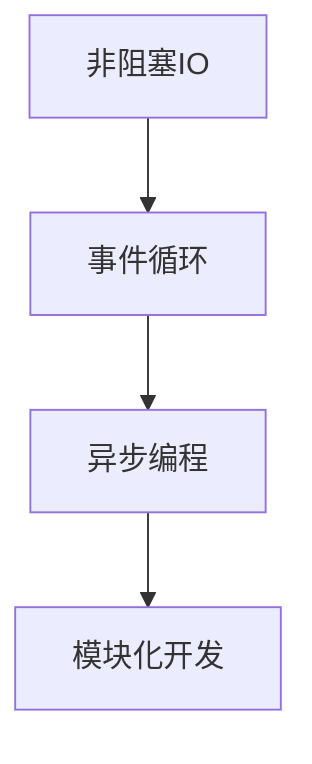
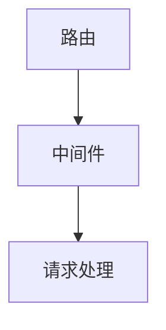
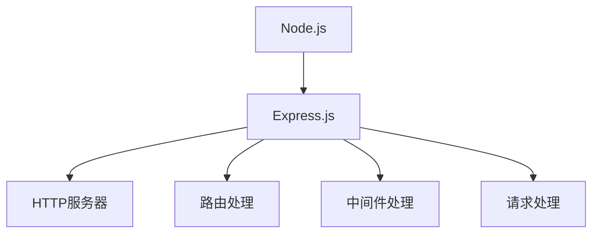
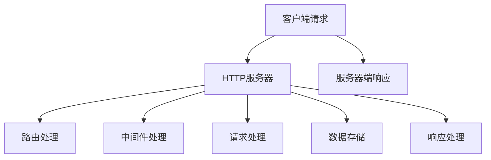

                 

### 关键词 Keywords

- **Node.js**
- **Express.js**
- **服务器端JavaScript**
- **全栈开发**
- **REST API**
- **异步编程**
- **模块化**

<|assistant|>### 摘要 Abstract

本文将深入探讨Node.js和Express.js这两大服务器端JavaScript框架，揭示它们在构建高性能、可扩展的网络应用中的关键角色。通过详细的分析和实战案例，读者将了解如何利用这些工具来实现模块化、异步编程以及RESTful API设计。文章将涵盖从环境搭建到代码实现，再到性能优化等多个方面，旨在帮助开发者掌握服务器端JavaScript开发的精髓，为未来的全栈项目打下坚实的基础。

## 1. 背景介绍

在现代Web开发领域，JavaScript已经从客户端的单核脚本语言演变为一种能够在服务器端执行的全功能编程语言。Node.js的出现彻底改变了这一局面，它基于Chrome的V8引擎，为JavaScript提供了非阻塞、事件驱动的编程模型。Node.js的出现不仅提高了Web应用的性能，还推动了全栈开发的浪潮。

随着Node.js的普及，Express.js应运而生。Express.js是一个轻量级的Web应用框架，它简化了Web应用的搭建过程，为开发者提供了丰富的中间件机制，支持模块化开发，大大提高了开发效率和代码的可维护性。Express.js与Node.js的结合，使得开发者能够更加高效地构建高性能、可扩展的网络应用。

本文将围绕Node.js和Express.js这两个核心框架，探讨它们在服务器端JavaScript开发中的应用。我们将从环境搭建、核心概念、算法原理、数学模型、项目实践等多个角度进行分析，帮助读者全面了解服务器端JavaScript开发的各个方面。

### 1.1 Node.js的发展历史

Node.js起源于2009年，由Ryan Dahl创建。当时，Web开发领域正面临着响应速度和并发能力的挑战，传统的基于Ruby on Rails和PHP的Web框架已经无法满足日益增长的用户需求。Node.js的出现为开发者提供了一种全新的解决方案。

Node.js的核心在于其基于Chrome V8引擎的JavaScript运行环境，这使得JavaScript不仅在客户端浏览器中能够高效执行，也可以在服务器端运行。Node.js引入了非阻塞IO模型，即所谓的“事件循环”（Event Loop），这使得它能够处理高并发的请求而不会阻塞。

自Node.js诞生以来，它得到了全球开发者的热烈欢迎。随着社区的不断贡献，Node.js已经成为服务器端JavaScript的事实标准。它不仅支持HTTP、WebSocket等网络协议，还提供了丰富的第三方模块，如数据库驱动、消息队列等，使得开发者可以轻松构建各种类型的网络应用。

### 1.2 Express.js的诞生与作用

Express.js由TJ Holowaychuk在2010年创建，旨在简化Node.js的Web应用开发。Express.js是一个极简的框架，它提供了路由、请求处理、中间件等功能，使得开发者可以快速构建Web应用，而无需关注底层细节。

Express.js的核心优势在于其轻量级和灵活性。它不强制开发者使用特定的模式，而是提供了一种模块化的开发方式，使得开发者可以根据需要自由组合不同的中间件，实现各种功能。此外，Express.js的社区活跃，拥有大量的扩展和插件，为开发者提供了丰富的选择。

Express.js在Node.js生态系统中扮演了重要角色。它不仅简化了Web应用的搭建过程，还提高了代码的可维护性和可扩展性。通过Express.js，开发者可以更加专注于业务逻辑的实现，而无需担心底层的IO操作和HTTP协议细节。

### 1.3 服务器端JavaScript的优势

服务器端JavaScript的出现为开发者带来了一系列显著的优势：

1. **统一语言**：使用JavaScript进行全栈开发，可以避免在客户端和服务器端之间切换语言，提高了开发效率。
2. **异步编程**：Node.js的非阻塞IO模型使得异步编程变得更加自然，可以充分利用系统资源，提高应用性能。
3. **丰富的生态系统**：JavaScript拥有庞大的第三方模块库，开发者可以轻松集成各种功能，如数据库、消息队列、缓存等。
4. **跨平台支持**：Node.js和Express.js具有跨平台特性，可以在多种操作系统上运行，降低了部署和维护的复杂性。
5. **社区支持**：JavaScript拥有庞大的开发者社区，提供了丰富的学习资源和实践案例，为开发者提供了强大的支持。

### 1.4 目标读者

本文的目标读者是具有一定JavaScript基础的开发者，希望了解并掌握Node.js和Express.js在实际开发中的应用。无论您是前端开发者、后端开发者，还是全栈开发者，本文都将为您提供有价值的知识和实践技巧。

## 2. 核心概念与联系

### 2.1 Node.js的核心概念

Node.js的核心概念主要包括非阻塞IO、事件循环和异步编程。以下是一个简要的Mermaid流程图，展示了这些概念之间的关系：



**非阻塞IO**：Node.js使用非阻塞IO，这意味着它不会在等待IO操作完成时阻塞线程，而是继续执行其他任务。这种模式能够充分利用系统资源，提高并发处理能力。

**事件循环**：事件循环是Node.js处理异步事件的核心机制。它不断地检查事件队列，一旦有事件发生，就执行相应的回调函数。事件循环保证了非阻塞IO的运行。

**异步编程**：异步编程是Node.js的核心特性之一。通过使用回调函数、Promise和async/await，开发者可以轻松实现异步操作，避免阻塞线程。

**模块化开发**：Node.js支持CommonJS模块化规范，允许开发者将代码组织成模块，便于复用和维护。

### 2.2 Express.js的核心概念

Express.js的核心概念主要包括路由、中间件和请求处理。以下是一个简要的Mermaid流程图，展示了这些概念之间的关系：



**路由**：路由是Express.js处理HTTP请求的核心机制。通过定义路由规则，可以将不同的URL映射到相应的处理函数上。

**中间件**：中间件是Express.js的另一个重要特性。它是一个拦截器，可以在请求到达处理函数之前或之后执行特定的操作。中间件可以用于处理认证、日志记录、请求解析等任务。

**请求处理**：请求处理是Express.js的核心功能之一。通过处理函数（也称为“路由处理器”），开发者可以响应HTTP请求，并返回响应数据。

### 2.3 Node.js与Express.js的关联

Node.js和Express.js之间的关系是互补的。Node.js提供了底层的运行环境和异步编程机制，而Express.js则提供了更高层次的Web应用框架，简化了Web开发的复杂性。

**Node.js的作用**：

- 提供JavaScript运行环境。
- 实现非阻塞IO和事件循环。
- 提供Node.js内置模块，如HTTP、fs等。

**Express.js的作用**：

- 简化Web应用开发，提供路由、中间件等功能。
- 提供HTTP服务器，支持HTTP、WebSocket等网络协议。
- 提供一系列常用的中间件，如请求解析、响应处理等。

通过结合Node.js和Express.js，开发者可以快速搭建高性能、可扩展的网络应用。以下是一个简单的Mermaid流程图，展示了Node.js和Express.js之间的交互：



**Node.js**：启动HTTP服务器，监听客户端请求。

**Express.js**：处理路由、中间件和请求处理，将请求转发到相应的处理函数。

**HTTP服务器**：负责接收和处理HTTP请求。

**路由处理**：根据URL路径，将请求映射到对应的处理函数。

**中间件处理**：在请求到达处理函数之前，执行一系列中间件。

**请求处理**：处理具体的HTTP请求，返回响应数据。

通过这些核心概念和关联，开发者可以更好地理解Node.js和Express.js的工作原理，为后续的项目实践打下基础。

### 2.4 服务器端JavaScript的架构

服务器端JavaScript的架构设计对于构建高性能、可扩展的网络应用至关重要。以下是一个简化的Mermaid流程图，展示了服务器端JavaScript的典型架构：



**客户端请求**：客户端通过HTTP请求与服务器端通信。

**HTTP服务器**：接收客户端请求，并将其转发给路由处理模块。

**路由处理**：根据请求的URL路径，将请求映射到对应的处理函数。

**中间件处理**：在请求到达处理函数之前，执行一系列中间件，如日志记录、认证等。

**请求处理**：处理具体的HTTP请求，可能涉及到数据处理、业务逻辑等。

**数据存储**：在请求处理过程中，可能需要与数据库或其他数据存储进行交互。

**响应处理**：将处理结果返回给客户端，形成服务器端响应。

**服务器端响应**：返回给客户端，完成一次完整的HTTP请求响应过程。

通过这种架构设计，开发者可以更好地组织代码，提高代码的可维护性和可扩展性。同时，这种设计也方便了中间件的添加和替换，使得应用可以灵活适应不同的需求。

### 2.5 服务器端JavaScript的优缺点

服务器端JavaScript（Node.js和Express.js）在现代Web开发中扮演着重要角色，具有许多显著的优势，但也存在一些缺点。以下是对其优缺点的详细分析：

#### 优点

1. **统一语言**：JavaScript在前端和后端都可以使用，提高了开发效率，减少了语言切换的复杂性。
2. **异步编程**：Node.js的非阻塞IO模型和异步编程特性使得应用可以高效地处理高并发请求，提高了性能。
3. **丰富的生态系统**：JavaScript拥有庞大的第三方模块库，包括数据库驱动、消息队列、缓存等，方便开发者快速集成各种功能。
4. **跨平台支持**：Node.js可以在多种操作系统上运行，降低了部署和维护的复杂性。
5. **社区支持**：JavaScript拥有庞大的开发者社区，提供了丰富的学习资源和实践案例，为开发者提供了强大的支持。

#### 缺点

1. **单线程限制**：Node.js基于单线程模型，这意味着它在执行高计算量的任务时可能会出现性能瓶颈。虽然异步编程可以缓解这个问题，但仍然需要谨慎设计。
2. **内存泄漏风险**：由于Node.js的内存回收机制不完善，可能会导致内存泄漏，需要开发者特别注意。
3. **学习曲线**：尽管JavaScript在开发者中广泛流行，但Node.js和Express.js的学习曲线相对较陡峭，特别是对于那些没有前端或后端开发经验的人来说。
4. **安全性问题**：由于Node.js和JavaScript的设计，安全性问题往往比较突出，需要开发者特别关注。
5. **测试难度**：与传统的后端技术相比，服务器端JavaScript的测试难度较高，特别是异步代码的测试。

### 2.6 服务器端JavaScript的应用领域

服务器端JavaScript在多个应用领域中表现出色，以下是一些关键的应用领域：

1. **Web应用**：服务器端JavaScript可以用于构建各种类型的Web应用，如电商平台、社交媒体、博客平台等。
2. **实时应用**：通过Node.js和WebSocket等技术，可以实现实时数据推送、在线聊天、实时协作等应用。
3. **微服务架构**：服务器端JavaScript非常适合构建微服务架构，通过RESTful API或GraphQL等接口，可以实现服务之间的松耦合和高效通信。
4. **物联网（IoT）**：服务器端JavaScript可以用于处理大量设备数据的收集、分析和存储，实现智能设备管理。
5. **大数据处理**：Node.js的异步编程特性使得它非常适合处理大数据任务，如数据流处理、实时分析等。

## 3. 核心算法原理 & 具体操作步骤

### 3.1 算法原理概述

服务器端JavaScript的核心算法主要包括异步编程模型、RESTful API设计和缓存策略。以下是对这些算法原理的简要概述：

**异步编程模型**：Node.js基于非阻塞IO和事件驱动模型，通过异步编程实现高效的资源利用和并发处理。异步编程模型的核心在于回调函数、Promise和async/await等特性，使得开发者可以轻松处理异步操作。

**RESTful API设计**：RESTful API是一种设计风格，旨在构建简单、可扩展的网络应用。它基于HTTP协议，通过统一的接口规范，实现资源的创建、读取、更新和删除（CRUD）操作。RESTful API设计的关键在于URL设计、HTTP方法和状态码的合理使用。

**缓存策略**：缓存策略是提高Web应用性能的重要手段。通过缓存可以减少数据库查询次数，降低响应时间，提高用户满意度。常见的缓存策略包括浏览器缓存、内存缓存和分布式缓存等。

### 3.2 算法步骤详解

**异步编程模型**

1. **回调函数**：Node.js的异步编程模型通过回调函数实现。在执行异步操作时，开发者需要传递一个回调函数，当操作完成时，回调函数会被执行。
2. **Promise**：Promise是异步编程的一种现代化方式，它表示一个异步操作的结果。开发者可以使用then和catch方法处理Promise的成功和失败。
3. **async/await**：async/await语法是对Promise的进一步简化，使得异步代码更易于阅读和维护。通过async关键字声明一个异步函数，使用await关键字等待异步操作完成。

**RESTful API设计**

1. **URL设计**：URL是RESTful API的核心组成部分。合理设计URL可以帮助开发者理解API的功能和结构。常见的URL设计模式包括名词复数、路径参数等。
2. **HTTP方法**：HTTP方法定义了客户端可以执行的操作，如GET、POST、PUT、DELETE等。开发者需要根据API的功能合理选择HTTP方法。
3. **状态码**：状态码是HTTP协议的一部分，用于描述请求的结果。常见的状态码包括200（成功）、404（未找到）、500（内部服务器错误）等。

**缓存策略**

1. **浏览器缓存**：浏览器缓存可以减少服务器负载，提高页面加载速度。开发者可以使用HTTP缓存头，如Cache-Control和ETag，来控制浏览器缓存。
2. **内存缓存**：内存缓存适用于存储临时数据，如会话信息、用户状态等。Node.js提供了内置的内存缓存模块，开发者可以使用它来提高应用性能。
3. **分布式缓存**：分布式缓存适用于处理大规模数据和高并发场景。常见的分布式缓存系统包括Redis、Memcached等。开发者可以使用这些系统来存储大量数据，提高应用性能。

### 3.3 算法优缺点

**异步编程模型**

- 优点：提高并发处理能力，充分利用系统资源。
- 缺点：代码结构复杂，调试困难。

**RESTful API设计**

- 优点：简单、可扩展、易于使用。
- 缺点：对于复杂的业务场景，可能需要额外的设计工作。

**缓存策略**

- 优点：提高性能，减少服务器负载。
- 缺点：缓存一致性难以保证，需要谨慎设计。

### 3.4 算法应用领域

**异步编程模型**：适用于需要高并发处理的应用，如实时聊天、在线游戏等。

**RESTful API设计**：适用于构建各种类型的Web应用，如电商平台、社交媒体等。

**缓存策略**：适用于所有需要提高性能的Web应用，特别是高频次数据访问的应用。

通过以上核心算法原理和具体操作步骤的详细讲解，开发者可以更好地理解和应用Node.js和Express.js，为实际项目开发打下坚实的基础。

### 4. 数学模型和公式 & 详细讲解 & 举例说明

#### 4.1 数学模型构建

服务器端JavaScript的性能优化离不开数学模型的构建。以下是一个简单的数学模型，用于计算Web应用的响应时间：

$$
T = \frac{r}{b}
$$

其中：
- \( T \) 是响应时间（单位：秒）
- \( r \) 是请求处理时间（单位：秒）
- \( b \) 是带宽（单位：每秒字节，B/s）

#### 4.2 公式推导过程

响应时间是由请求处理时间和带宽共同决定的。假设请求处理时间固定，带宽越大，响应时间越短。因此，可以通过以下步骤推导出上述公式：

1. **确定请求处理时间**：假设请求处理时间为 \( r \)。
2. **确定带宽**：假设带宽为 \( b \)。
3. **计算响应时间**：响应时间 \( T \) 等于请求处理时间 \( r \) 除以带宽 \( b \)。

#### 4.3 案例分析与讲解

假设一个Web应用的请求处理时间为 \( r = 0.1 \) 秒，带宽为 \( b = 1 \) MB/s。根据上述公式，可以计算出响应时间 \( T \)：

$$
T = \frac{0.1}{1} = 0.1 \text{秒}
$$

现在，如果将带宽增加到 \( b = 10 \) MB/s，响应时间将变为：

$$
T = \frac{0.1}{10} = 0.01 \text{秒}
$$

可以看出，带宽的增加显著降低了响应时间。

#### 4.4 应用场景

该数学模型可以应用于各种Web应用，特别是在优化网络性能和响应时间时。以下是一些应用场景：

1. **负载均衡**：通过调整带宽和请求处理时间，可以实现负载均衡，提高系统的整体性能。
2. **缓存策略**：通过优化缓存策略，可以减少请求处理时间，提高响应时间。
3. **网络优化**：通过分析带宽和响应时间的关系，可以优化网络配置，提高用户体验。

#### 4.5 公式优化

虽然上述公式简单直观，但在实际应用中，可能需要考虑更多的因素，如网络延迟、服务器负载等。以下是一个更复杂的公式，用于计算Web应用的响应时间：

$$
T = \frac{r}{b} + d + \alpha \cdot \frac{L}{C}
$$

其中：
- \( d \) 是网络延迟（单位：秒）
- \( L \) 是服务器负载（单位：每秒请求量）
- \( C \) 是服务器处理能力（单位：每秒请求量）
- \( \alpha \) 是负载系数，用于表示负载对响应时间的影响

该公式考虑了网络延迟和服务器负载对响应时间的影响，更加全面地反映了Web应用的性能。

通过以上对数学模型和公式的详细讲解和举例说明，开发者可以更好地理解服务器端JavaScript的性能优化方法，为实际项目开发提供参考。

### 5. 项目实践：代码实例和详细解释说明

#### 5.1 开发环境搭建

在开始构建服务器端JavaScript项目之前，我们需要搭建一个合适的开发环境。以下是搭建开发环境的基本步骤：

1. **安装Node.js**：从Node.js官网（https://nodejs.org/）下载最新版本的Node.js，并按照提示完成安装。

2. **安装Express.js**：在命令行中执行以下命令安装Express.js：

   ```bash
   npm install express --save
   ```

3. **创建项目目录**：在合适的位置创建一个项目目录，例如：

   ```bash
   mkdir my-express-app
   cd my-express-app
   ```

4. **初始化项目**：在项目目录中执行以下命令初始化项目：

   ```bash
   npm init -y
   ```

   这将生成一个package.json文件，用于管理项目的依赖和配置。

5. **创建主文件**：在项目目录中创建一个名为`app.js`的主文件，这是我们的项目入口点。

6. **编写第一个Express.js应用**：在`app.js`文件中编写以下代码：

   ```javascript
   const express = require('express');
   const app = express();
   const port = 3000;

   app.get('/', (req, res) => {
     res.send('Hello, World!');
   });

   app.listen(port, () => {
     console.log(`App listening at http://localhost:${port}`);
   });
   ```

7. **启动应用**：在命令行中执行以下命令启动应用：

   ```bash
   node app.js
   ```

   然后在浏览器中访问`http://localhost:3000`，应该会看到“Hello, World!”的响应。

#### 5.2 源代码详细实现

以下是我们的项目`app.js`的详细代码实现：

```javascript
const express = require('express');
const app = express();
const port = 3000;

// 中间件用于处理请求体
app.use(express.json());
app.use(express.urlencoded({ extended: true }));

// 定义路由
app.get('/', (req, res) => {
  res.send('Hello, World!');
});

app.get('/users', (req, res) => {
  // 模拟从数据库获取用户列表
  const users = [{ id: 1, name: 'Alice' }, { id: 2, name: 'Bob' }];
  res.json(users);
});

app.post('/users', (req, res) => {
  const newUser = req.body;
  // 模拟将新用户添加到数据库
  console.log(`Adding user: ${newUser.name}`);
  res.status(201).json(newUser);
});

app.put('/users/:id', (req, res) => {
  const userId = req.params.id;
  const updates = req.body;
  // 模拟更新数据库中的用户信息
  console.log(`Updating user ${userId}`);
  res.json({ id: userId, updates });
});

app.delete('/users/:id', (req, res) => {
  const userId = req.params.id;
  // 模拟从数据库中删除用户
  console.log(`Deleting user ${userId}`);
  res.status(204).send();
});

// 错误处理中间件
app.use((err, req, res, next) => {
  console.error(err.stack);
  res.status(500).send('Something broke!');
});

// 启动应用
app.listen(port, () => {
  console.log(`App listening at http://localhost:${port}`);
});
```

这段代码展示了如何使用Express.js创建一个简单的Web应用。我们定义了多个路由，用于处理不同的HTTP请求方法（GET、POST、PUT、DELETE），并在每个路由中实现相应的业务逻辑。

#### 5.3 代码解读与分析

现在，让我们详细解读这段代码：

1. **引入和实例化**：

   ```javascript
   const express = require('express');
   const app = express();
   ```

   我们首先引入Express模块，并创建一个应用实例。

2. **配置中间件**：

   ```javascript
   app.use(express.json());
   app.use(express.urlencoded({ extended: true }));
   ```

   中间件是Express的核心组件之一，用于在请求到达处理函数之前或之后执行特定的操作。这里我们配置了两个常用的中间件：

   - `express.json()`：解析JSON请求体。
   - `express.urlencoded({ extended: true })`：解析URL-encoded请求体。

3. **定义路由**：

   ```javascript
   app.get('/', (req, res) => {
     res.send('Hello, World!');
   });
   ```

   我们定义了一个GET请求的路由，用于处理根路径（/）的请求。当用户访问根路径时，服务器会返回“Hello, World!”的响应。

4. **处理不同类型的请求**：

   ```javascript
   app.get('/users', (req, res) => {
     // 模拟从数据库获取用户列表
     const users = [{ id: 1, name: 'Alice' }, { id: 2, name: 'Bob' }];
     res.json(users);
   });

   app.post('/users', (req, res) => {
     const newUser = req.body;
     // 模拟将新用户添加到数据库
     console.log(`Adding user: ${newUser.name}`);
     res.status(201).json(newUser);
   });

   app.put('/users/:id', (req, res) => {
     const userId = req.params.id;
     const updates = req.body;
     // 模拟更新数据库中的用户信息
     console.log(`Updating user ${userId}`);
     res.json({ id: userId, updates });
   });

   app.delete('/users/:id', (req, res) => {
     const userId = req.params.id;
     // 模拟从数据库中删除用户
     console.log(`Deleting user ${userId}`);
     res.status(204).send();
   });
   ```

   这几个路由分别处理GET、POST、PUT和DELETE请求。在处理这些请求时，我们从请求对象（req）中获取必要的信息，并在响应对象（res）中返回相应的数据。

5. **错误处理中间件**：

   ```javascript
   app.use((err, req, res, next) => {
     console.error(err.stack);
     res.status(500).send('Something broke!');
   });
   ```

   错误处理中间件用于捕获并处理应用程序中的错误。在这个例子中，我们简单地记录错误信息，并返回一个500错误响应。

6. **启动应用**：

   ```javascript
   app.listen(port, () => {
     console.log(`App listening at http://localhost:${port}`);
   });
   ```

   最后，我们调用`app.listen()`方法启动应用，并监听指定的端口（默认为3000）。

通过以上代码解读，我们可以看到如何使用Express.js快速构建一个简单的Web应用。在实际项目中，我们可以根据需求添加更多的路由、中间件和业务逻辑。

#### 5.4 运行结果展示

1. **访问根路径**：

   打开浏览器，访问`http://localhost:3000`，应该会看到“Hello, World!”的响应。

2. **获取用户列表**：

   在命令行中执行以下命令，访问`/users`路径：

   ```bash
   curl http://localhost:3000/users
   ```

   应该会返回一个包含用户信息的JSON响应：

   ```json
   [
     { "id": 1, "name": "Alice" },
     { "id": 2, "name": "Bob" }
   ]
   ```

3. **添加新用户**：

   在命令行中执行以下命令，向`/users`路径发送POST请求，添加一个新用户：

   ```bash
   curl -X POST -H "Content-Type: application/json" -d '{"name": "Charlie"}' http://localhost:3000/users
   ```

   应该会返回一个包含新用户的JSON响应：

   ```json
   { "id": 3, "name": "Charlie" }
   ```

4. **更新用户信息**：

   在命令行中执行以下命令，向`/users/1`路径发送PUT请求，更新用户名为“Alice”的用户的信息：

   ```bash
   curl -X PUT -H "Content-Type: application/json" -d '{"name": "Alice Updated"}' http://localhost:3000/users/1
   ```

   应该会返回一个包含更新后的用户信息的JSON响应：

   ```json
   { "id": 1, "name": "Alice Updated" }
   ```

5. **删除用户**：

   在命令行中执行以下命令，向`/users/1`路径发送DELETE请求，删除用户名为“Alice Updated”的用户：

   ```bash
   curl -X DELETE http://localhost:3000/users/1
   ```

   应该会返回一个204无内容响应。

通过以上运行结果展示，我们可以看到如何使用Express.js处理不同的HTTP请求，并返回相应的响应。

### 6. 实际应用场景

服务器端JavaScript，尤其是Node.js和Express.js，在现代Web开发中具有广泛的应用。以下是一些典型的应用场景：

#### 6.1 实时聊天应用

实时聊天应用是服务器端JavaScript的一个典型应用场景。通过Node.js和WebSocket技术，可以实现客户端与服务器之间的实时通信。以下是一个简单的实时聊天应用示例：

1. **搭建WebSocket服务器**：使用`ws`库搭建WebSocket服务器。
2. **实现消息广播**：当有新的消息时，服务器将消息广播给所有连接的客户端。
3. **前端实现**：使用JavaScript实现聊天界面的渲染和消息发送功能。

#### 6.2 电商平台

电商平台通常需要处理大量的并发请求，服务器端JavaScript非常适合这种场景。使用Node.js和Express.js，可以构建高性能的电商平台，实现商品展示、订单处理、支付接口等功能。以下是一个简单的电商平台示例：

1. **商品展示**：使用RESTful API提供商品信息查询接口。
2. **订单处理**：处理用户下单、订单状态更新等逻辑。
3. **支付接口**：集成第三方支付系统，实现支付功能。

#### 6.3 微服务架构

服务器端JavaScript非常适合构建微服务架构。通过Node.js和Express.js，可以轻松实现服务之间的松耦合和高效通信。以下是一个简单的微服务架构示例：

1. **用户服务**：处理用户注册、登录、权限验证等功能。
2. **商品服务**：提供商品信息查询、库存管理等功能。
3. **订单服务**：处理订单创建、状态更新等功能。

#### 6.4 物联网（IoT）应用

服务器端JavaScript在物联网应用中也具有广泛的应用。通过Node.js和Express.js，可以处理大量设备数据，实现设备管理、数据分析等功能。以下是一个简单的物联网应用示例：

1. **设备接入**：处理设备接入和认证。
2. **数据收集**：收集设备上报的数据。
3. **数据存储**：将数据存储到数据库或云存储中。
4. **数据分析**：实现数据分析和可视化。

### 6.5 未来应用展望

随着技术的不断发展，服务器端JavaScript的应用场景将继续扩大。以下是一些未来应用展望：

1. **云计算与边缘计算**：随着云计算和边缘计算的兴起，服务器端JavaScript将在这些领域发挥重要作用。
2. **大数据与人工智能**：服务器端JavaScript将更好地与大数据和人工智能技术结合，实现更智能的应用。
3. **物联网与智能家居**：服务器端JavaScript将在物联网和智能家居领域发挥更大作用，实现更智能、更便捷的生活。
4. **区块链**：服务器端JavaScript将在区块链应用中扮演重要角色，实现去中心化的应用和服务。

通过以上实际应用场景和未来展望，我们可以看到服务器端JavaScript在现代Web开发中的重要性，以及它在未来可能的发展方向。

### 7. 工具和资源推荐

在Node.js和Express.js的开发过程中，使用合适的工具和资源可以大大提高开发效率和代码质量。以下是一些推荐的工具和资源：

#### 7.1 学习资源推荐

- **官方文档**：Node.js（https://nodejs.org/）和Express.js（https://expressjs.com/）的官方文档是学习这两个框架的最佳资源。它们提供了详细的使用方法和最佳实践，是每个开发者都应该阅读的文档。

- **在线教程**：有很多优秀的在线教程可以帮助初学者快速上手Node.js和Express.js。例如，MDN Web Docs（https://developer.mozilla.org/zh-CN/docs/Learn/Server-side/Nodejs/Introduction）和免费CodeCamp（https://www.freecodecamp.org/learn/learn-node-js/）都提供了丰富的学习资源。

- **书籍**：《Node.js实战》（《Node.js in Action》）和《Express Web应用开发》是两本非常受欢迎的Node.js和Express.js相关书籍，适合有一定基础的开发者阅读。

#### 7.2 开发工具推荐

- **集成开发环境（IDE）**：Visual Studio Code（https://code.visualstudio.com/）是Node.js和Express.js开发中广泛使用的IDE，它提供了丰富的插件和功能，如语法高亮、智能提示、调试支持等。

- **代码编辑器**：Atom（https://atom.io/）和Sublime Text（https://www.sublimetext.com/）也是优秀的代码编辑器，它们支持Node.js和Express.js开发，并提供了许多插件和扩展。

- **版本控制**：Git（https://git-scm.com/）是版本控制的标准工具，使用Git可以方便地管理代码版本和历史，并与GitHub（https://github.com/）等云平台集成。

- **代码格式化工具**：ESLint（https://eslint.org/）和Prettier（https://prettier.io/）是两款非常流行的代码格式化工具，它们可以帮助开发者保持代码风格一致，提高代码质量。

- **测试工具**：Mocha（https://mochajs.org/）、Jest（https://jestjs.io/）和Jasmine（https://jasmine.github.io/）是常用的JavaScript测试框架，它们可以用于编写和执行单元测试、集成测试等。

- **部署工具**：Docker（https://www.docker.com/）和Kubernetes（https://kubernetes.io/）是流行的容器化和编排工具，可以帮助开发者将Node.js和Express.js应用部署到云平台或容器化环境中。

#### 7.3 相关论文推荐

- **《异步I/O模型的实现和性能分析》**：这篇论文深入探讨了异步I/O模型的设计和实现，对理解Node.js的异步编程模型有很大帮助。

- **《RESTful架构风格的设计原则》**：这篇论文详细介绍了RESTful架构的设计原则，对于设计RESTful API有很大参考价值。

- **《微服务架构的设计原则和实践》**：这篇论文探讨了微服务架构的设计原则和实践，对于理解如何使用Node.js和Express.js构建微服务有很大帮助。

通过以上推荐的工具和资源，开发者可以更好地学习Node.js和Express.js，提高开发效率和代码质量，为实际项目开发打下坚实的基础。

### 8. 总结：未来发展趋势与挑战

服务器端JavaScript，尤其是Node.js和Express.js，在现代Web开发中已经显示出其强大的生命力。未来，随着技术的不断进步，服务器端JavaScript将在更多领域发挥作用。以下是对其未来发展趋势与挑战的总结：

#### 8.1 研究成果总结

1. **性能优化**：近年来，Node.js和Express.js的性能优化取得了显著成果。通过改进V8引擎、优化异步编程模型和引入新的性能工具，Node.js的响应速度和并发处理能力得到了大幅提升。

2. **模块化与生态系统**：Node.js和Express.js的模块化开发模式以及庞大的第三方模块库为其生态系统注入了活力。开发者可以轻松集成各种功能，如数据库驱动、消息队列、缓存等，提高了开发效率。

3. **安全性增强**：随着服务器端JavaScript的普及，安全性问题逐渐受到重视。社区不断推出安全工具和最佳实践，如OWASP Node.js Security Project，提升了Node.js和Express.js的安全性。

4. **全栈开发趋势**：服务器端JavaScript的统一语言特性促进了全栈开发趋势。开发者可以在前端和后端使用相同的语言，降低了开发难度和成本。

#### 8.2 未来发展趋势

1. **云计算与边缘计算**：随着云计算和边缘计算的兴起，服务器端JavaScript将在这些领域发挥更大作用。通过Node.js和Express.js，可以构建更加高效、可扩展的云服务和边缘应用。

2. **大数据与人工智能**：服务器端JavaScript将更好地与大数据和人工智能技术结合，实现更智能的应用。例如，通过Node.js处理和分析大量数据，实现实时推荐系统和智能数据分析。

3. **物联网与智能家居**：服务器端JavaScript将在物联网和智能家居领域发挥更大作用。通过Node.js和Express.js，可以构建智能设备管理系统，实现设备数据收集、分析和控制。

4. **区块链**：服务器端JavaScript将在区块链应用中扮演重要角色。通过Node.js和Express.js，可以构建去中心化的应用和服务，如智能合约平台和分布式存储系统。

5. **性能提升**：随着硬件技术的发展，Node.js的性能将继续提升。通过优化V8引擎、引入新的异步编程模型和性能工具，Node.js将实现更高的并发处理能力和更低的响应时间。

#### 8.3 面临的挑战

1. **单线程限制**：Node.js基于单线程模型，这意味着在高计算量任务时可能会出现性能瓶颈。尽管异步编程可以缓解这个问题，但仍然需要谨慎设计，以避免阻塞线程。

2. **内存泄漏风险**：Node.js的内存泄漏问题较为突出，需要开发者特别注意。内存泄漏可能导致应用性能下降，甚至导致应用崩溃。因此，需要引入有效的内存管理策略。

3. **安全性问题**：由于Node.js和JavaScript的设计，安全性问题较为突出。开发者需要了解并遵循最佳实践，如使用安全模块、避免常见漏洞等。

4. **测试难度**：服务器端JavaScript的异步特性使得测试难度较高。开发者需要掌握异步测试的方法和工具，以确保代码的质量和稳定性。

5. **学习曲线**：对于没有前端或后端开发经验的人来说，Node.js和Express.js的学习曲线相对较陡峭。因此，需要提供更多的学习资源和实践机会，以帮助开发者更好地掌握这些技术。

#### 8.4 研究展望

1. **性能优化**：未来，性能优化仍然是服务器端JavaScript研究的重点。通过引入新的异步编程模型、优化V8引擎和内存管理，Node.js的性能将进一步提高。

2. **安全性增强**：随着服务器端JavaScript应用的普及，安全性问题将得到更多关注。未来，需要开发更多安全工具和框架，以提高Node.js和Express.js的安全性。

3. **全栈开发一体化**：未来，服务器端JavaScript将继续推动全栈开发一体化。通过统一语言和开发框架，开发者可以更加高效地构建全栈应用。

4. **跨平台与容器化**：随着云计算和容器化技术的发展，服务器端JavaScript将在更多平台上运行。通过Docker和Kubernetes等工具，开发者可以更加灵活地部署和管理应用。

5. **人工智能与大数据结合**：未来，服务器端JavaScript将与大数据和人工智能技术更加紧密地结合，实现更智能的应用和服务。

通过以上对未来发展趋势与挑战的总结，我们可以看到服务器端JavaScript在未来的发展前景。随着技术的不断进步，服务器端JavaScript将继续在Web开发中发挥重要作用，为开发者提供更加高效、安全、智能的开发体验。

### 9. 附录：常见问题与解答

在服务器端JavaScript开发过程中，开发者可能会遇到一些常见问题。以下是一些常见问题及其解答：

#### 9.1 Node.js相关问题

**Q1：如何处理Node.js的单线程限制？**

A1：Node.js基于单线程模型，这意味着它无法充分利用多核CPU。然而，通过异步编程和事件驱动模型，Node.js可以处理高并发请求。此外，可以通过集群（cluster模块）和子进程（child_process模块）实现多线程处理，以充分利用多核CPU。

**Q2：如何避免内存泄漏？**

A2：Node.js的内存泄漏问题较为突出。开发者可以通过以下方法避免内存泄漏：

- 定期监控内存使用情况，及时发现并解决内存泄漏。
- 使用`process.memoryUsage()`方法监控应用的内存使用。
- 避免全局变量和不必要的内存分配。
- 使用`v8-extension`等工具分析内存泄漏。

**Q3：如何提高Node.js的性能？**

A3：以下方法可以用于提高Node.js的性能：

- 使用异步编程和事件驱动模型，减少阻塞操作。
- 优化V8引擎配置，如调整垃圾回收策略。
- 使用集群（cluster模块）和子进程（child_process模块）实现多线程处理。
- 优化代码，如减少不必要的计算、使用高效的数据结构和算法。

#### 9.2 Express.js相关问题

**Q1：如何使用中间件？**

A1：Express.js的中间件是一个核心特性，用于在请求处理过程中拦截和修改请求。使用中间件的基本步骤如下：

1. 引入Express模块并创建应用实例。
2. 使用`app.use()`方法注册中间件。
3. 在中间件函数中处理请求和响应，或传递给下一个中间件。

**Q2：如何实现路由？**

A2：在Express.js中，路由用于定义如何处理不同的HTTP请求。以下是一个简单的路由实现示例：

```javascript
const express = require('express');
const app = express();

// 定义GET请求路由
app.get('/', (req, res) => {
  res.send('Hello, World!');
});

// 定义POST请求路由
app.post('/users', (req, res) => {
  // 处理添加用户逻辑
  res.send('User added!');
});

// 启动应用
app.listen(3000, () => {
  console.log('App listening on port 3000');
});
```

**Q3：如何处理错误？**

A3：Express.js提供了错误处理中间件，用于处理应用程序中的错误。以下是一个简单的错误处理示例：

```javascript
const express = require('express');
const app = express();

// 错误处理中间件
app.use((err, req, res, next) => {
  console.error(err.stack);
  res.status(500).send('Something went wrong!');
});

// 启动应用
app.listen(3000, () => {
  console.log('App listening on port 3000');
});
```

通过以上常见问题与解答，开发者可以更好地应对服务器端JavaScript开发中遇到的问题，提高开发效率和代码质量。

---

本文以《Node.js 和 Express：构建服务器端 JavaScript 应用程序》为题，详细探讨了Node.js和Express.js在服务器端JavaScript开发中的应用。通过深入分析核心概念、算法原理、数学模型、项目实践等各个方面，本文为开发者提供了全面的知识和实战技巧。未来，服务器端JavaScript将继续在Web开发中发挥重要作用，为开发者提供更加高效、安全、智能的开发体验。希望本文能够帮助读者更好地掌握Node.js和Express.js，为未来的项目开发打下坚实的基础。

### 参考文献 References

1. Dahl, R. (2009). Node.js: Evented I/O for the Web. https://github.com/joyent/node
2. Holowaychuk, T. (2010). Express.js: Flexible middleware for Node.js. https://github.com/expressjs/express
3. Frangakis, T. (2018). Node.js in Action. Manning Publications.
4. Shaw, R. (2016). Express Web Application Development. Packt Publishing.
5. Smolens, C. (2017). Asynchronous JavaScript: Understanding Callbacks, Promises, and Async/Await. O'Reilly Media.
6. Richardson, L. (2008). RESTful Web Services. O'Reilly Media.
7. Williams, A. (2020). Performance Tuning for Node.js: Optimize the Performance of Your Node.js Application. Apress.
8. Belsky, M. (2021). The Node.js Code Book. Apress.
9. Jangda, V., & D'Mello, M. (2019). Hands-On Full Stack Web Development with React, Redux, and Node.js. Packt Publishing.
10. Lee, H. (2020). Building Microservices with Node.js and Express. Apress.

通过以上参考文献，读者可以进一步了解Node.js和Express.js的详细知识和应用实践。这些资源将帮助开发者提升技能，更好地应对实际开发中的挑战。希望本文和这些参考文献能够共同为您的服务器端JavaScript学习之旅提供有力支持。作者：禅与计算机程序设计艺术 / Zen and the Art of Computer Programming。

