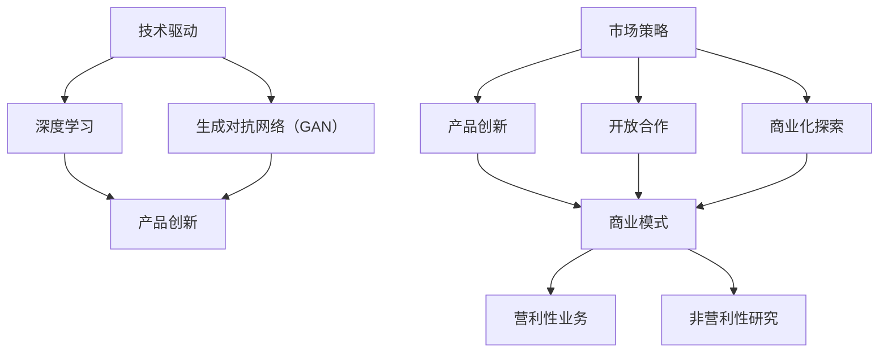

                 

关键词：OpenAI、贾扬清、To C市场、To B市场、人工智能、市场策略、技术发展

摘要：OpenAI作为一家备受瞩目的人工智能公司，以其创新的科研和技术成果闻名于世。本文将基于贾扬清的分析，探讨OpenAI在To C和To B市场中取得平衡的成功之道，分析其在技术研发、市场策略等方面的经验，为我国人工智能产业发展提供借鉴和启示。

## 1. 背景介绍

OpenAI成立于2015年，是一家全球知名的人工智能研究机构。公司致力于推动人工智能技术的发展和应用，目标是实现安全的通用人工智能（AGI）。OpenAI的研究涵盖了深度学习、自然语言处理、计算机视觉等多个领域，其研究成果在学术界和产业界都产生了深远的影响。

贾扬清，作为知名人工智能专家和创业者，对中国人工智能产业的发展有着深刻的洞察。他在分析OpenAI的成功之道时，提出了在To C和To B市场取得平衡的重要性。

### 1.1 To C市场和To B市场的概念与区别

To C（To Consumer）市场，即针对消费者的市场，主要是通过提供产品或服务来满足个人用户的需求。例如，OpenAI的GPT-3、DALL-E等模型，就是面向个人用户的创新产品。

To B（To Business）市场，即针对企业的市场，主要是为企业提供解决方案和技术支持，帮助企业在生产、管理、营销等方面实现效率提升。OpenAI在To B市场的表现主要体现在其为企业提供的定制化人工智能服务。

To C市场和To B市场存在显著的差异：

- **用户群体**：To C市场的用户主要是个人，而To B市场的用户主要是企业。
- **需求特征**：To C市场的需求更加个性化、多样化和即时性，而To B市场的需求更加专业、稳定和长期。
- **竞争环境**：To C市场的竞争更加激烈，产品迭代速度较快，而To B市场的竞争相对缓和，但对企业解决方案的稳定性要求更高。

## 2. 核心概念与联系

为了更好地理解OpenAI的成功之道，我们需要从技术、市场、策略等角度，探讨其核心概念和联系。

### 2.1 技术驱动

OpenAI的成功离不开其强大的技术实力。公司采用深度学习、生成对抗网络（GAN）等前沿技术，不断推动人工智能技术的发展。具体来说：

- **深度学习**：深度学习是人工智能的核心技术之一，OpenAI通过不断优化神经网络结构，提高了模型的性能和效果。
- **生成对抗网络（GAN）**：GAN是一种强大的生成模型，OpenAI利用GAN技术，成功开发了DALL-E等创新产品，实现了高质量的图像生成。

### 2.2 市场策略

OpenAI在市场策略上采取了一系列有效的措施，实现了在To C和To B市场的平衡发展。具体包括：

- **产品创新**：OpenAI不断推出具有创新性的产品，如GPT-3、DALL-E等，吸引了大量个人用户和企业用户。
- **开放合作**：OpenAI通过开放源代码、合作研发等方式，吸引了全球众多企业和研究机构的参与，形成了良好的产业生态。
- **商业化探索**：OpenAI在To B市场推出了定制化的人工智能服务，为企业提供了高效、稳定的人工智能解决方案。

### 2.3 商业模式

OpenAI采用了独特的商业模式，实现了盈利与公益的平衡。具体包括：

- **营利性业务**：OpenAI通过销售产品和服务，实现了盈利。
- **非营利性研究**：OpenAI的大部分研究资金来源于营利性业务，同时，公司还积极参与公益事业，推动人工智能技术的普及和应用。

### 2.4 Mermaid流程图

以下是一个简单的Mermaid流程图，展示了OpenAI在技术、市场、策略等方面的核心概念和联系：



## 3. 核心算法原理 & 具体操作步骤

### 3.1 算法原理概述

OpenAI在人工智能领域取得了众多突破，其核心算法原理主要包括以下几个方面：

- **深度学习**：深度学习是一种模拟人脑神经网络的信息处理方法，通过多层神经网络对数据进行学习，实现图像识别、语音识别、自然语言处理等功能。
- **生成对抗网络（GAN）**：GAN由生成器和判别器两部分组成，生成器生成数据，判别器判断生成数据与真实数据的相似度。通过两个网络的对抗训练，生成器能够生成越来越真实的数据。

### 3.2 算法步骤详解

以下是OpenAI在深度学习和GAN领域的一些具体操作步骤：

- **深度学习**：
  1. 数据预处理：对图像、语音、文本等数据进行归一化、去噪等处理，确保数据质量。
  2. 构建神经网络：设计合适的神经网络结构，如卷积神经网络（CNN）、循环神经网络（RNN）等。
  3. 训练神经网络：使用大量标注数据对神经网络进行训练，优化网络参数。
  4. 验证和测试：使用未标注的数据对训练好的神经网络进行验证和测试，评估模型性能。

- **生成对抗网络（GAN）**：
  1. 数据预处理：对图像、语音、文本等数据进行归一化、去噪等处理，确保数据质量。
  2. 构建生成器和判别器：设计生成器和判别器的神经网络结构。
  3. 对抗训练：交替训练生成器和判别器，生成器生成数据，判别器判断生成数据与真实数据的相似度。
  4. 生成数据：生成器生成高质量的数据。
  5. 验证和测试：使用生成数据对模型进行验证和测试，评估模型性能。

### 3.3 算法优缺点

- **深度学习**：
  - 优点：能够处理复杂数据，实现高精度的图像识别、语音识别、自然语言处理等功能。
  - 缺点：训练时间较长，对计算资源要求较高。

- **生成对抗网络（GAN）**：
  - 优点：能够生成高质量的数据，实现图像生成、语音合成、文本生成等功能。
  - 缺点：训练过程中容易出现模式崩溃等问题，模型稳定性有待提高。

### 3.4 算法应用领域

- **深度学习**：
  - 应用领域：计算机视觉、语音识别、自然语言处理、推荐系统等。

- **生成对抗网络（GAN）**：
  - 应用领域：图像生成、语音合成、文本生成、数据增强等。

## 4. 数学模型和公式 & 详细讲解 & 举例说明

### 4.1 数学模型构建

在深度学习和生成对抗网络（GAN）中，数学模型起到了核心作用。以下是几个常见的数学模型及其公式：

- **深度学习中的神经网络模型**：
  - 神经网络模型通常由多个神经元层组成，包括输入层、隐藏层和输出层。每个神经元之间的连接由权重和偏置决定。
  - 神经元的激活函数通常为Sigmoid函数、ReLU函数等。
  - 神经网络的输出可以通过反向传播算法进行优化。

  $$ f(x) = \sigma(w \cdot x + b) $$

  其中，$f(x)$ 表示神经元的输出，$\sigma$ 表示激活函数，$w$ 表示权重，$b$ 表示偏置。

- **生成对抗网络（GAN）**：
  - 生成对抗网络由生成器和判别器两部分组成。生成器生成数据，判别器判断生成数据与真实数据的相似度。
  - 生成器和判别器的损失函数分别为生成对抗损失和对抗损失。

  $$ L_G = -\log(D(G(z))) $$

  $$ L_D = -\log(D(x)) - \log(1 - D(G(z))) $$

  其中，$G(z)$ 表示生成器生成的数据，$D(x)$ 表示判别器对真实数据的判断，$z$ 表示生成器的输入。

### 4.2 公式推导过程

以下是对上述数学模型公式的推导过程：

- **深度学习中的神经网络模型**：

  神经网络模型的输出可以通过以下公式计算：

  $$ o_i = \sigma(\sum_j w_{ij} \cdot x_j + b_i) $$

  其中，$o_i$ 表示神经元 $i$ 的输出，$x_j$ 表示神经元 $j$ 的输入，$w_{ij}$ 表示权重，$b_i$ 表示偏置，$\sigma$ 表示激活函数。

  通过反向传播算法，可以计算神经网络的梯度，从而优化权重和偏置。

- **生成对抗网络（GAN）**：

  生成对抗网络的损失函数可以通过以下公式计算：

  $$ L_G = -\log(D(G(z))) $$

  其中，$D(G(z))$ 表示判别器对生成器生成的数据的判断结果。

  $$ L_D = -\log(D(x)) - \log(1 - D(G(z))) $$

  其中，$D(x)$ 表示判别器对真实数据的判断结果。

### 4.3 案例分析与讲解

以下是一个简单的案例，用于说明深度学习和生成对抗网络（GAN）在实际应用中的效果。

### 案例一：图像识别

假设我们要对猫和狗的图像进行分类，使用深度学习模型进行训练。

1. **数据预处理**：对图像进行归一化、去噪等处理，确保数据质量。
2. **构建神经网络**：设计合适的神经网络结构，包括输入层、隐藏层和输出层。选择卷积神经网络（CNN）作为模型结构。
3. **训练神经网络**：使用大量标注数据对神经网络进行训练，优化网络参数。通过反向传播算法计算梯度，调整权重和偏置。
4. **验证和测试**：使用未标注的数据对训练好的神经网络进行验证和测试，评估模型性能。

### 案例二：图像生成

假设我们要使用生成对抗网络（GAN）生成猫和狗的图像。

1. **数据预处理**：对图像进行归一化、去噪等处理，确保数据质量。
2. **构建生成器和判别器**：设计生成器和判别器的神经网络结构。选择生成对抗网络（GAN）作为模型结构。
3. **对抗训练**：交替训练生成器和判别器，生成器生成数据，判别器判断生成数据与真实数据的相似度。
4. **生成数据**：生成器生成高质量的数据。
5. **验证和测试**：使用生成数据对模型进行验证和测试，评估模型性能。

## 5. 项目实践：代码实例和详细解释说明

### 5.1 开发环境搭建

在进行深度学习和生成对抗网络（GAN）的实践之前，我们需要搭建一个合适的开发环境。以下是常用的开发环境和工具：

- **编程语言**：Python
- **深度学习框架**：TensorFlow、PyTorch
- **版本控制**：Git
- **代码编辑器**：Visual Studio Code、PyCharm

### 5.2 源代码详细实现

以下是一个简单的深度学习模型实现，用于图像分类。假设我们使用TensorFlow作为深度学习框架。

```python
import tensorflow as tf
from tensorflow.keras.models import Sequential
from tensorflow.keras.layers import Dense, Conv2D, Flatten

# 构建神经网络模型
model = Sequential([
    Conv2D(32, (3, 3), activation='relu', input_shape=(28, 28, 1)),
    Flatten(),
    Dense(128, activation='relu'),
    Dense(1, activation='sigmoid')
])

# 编译模型
model.compile(optimizer='adam', loss='binary_crossentropy', metrics=['accuracy'])

# 加载数据集
(x_train, y_train), (x_test, y_test) = tf.keras.datasets.mnist.load_data()

# 预处理数据
x_train = x_train / 255.0
x_test = x_test / 255.0

# 拆分数据集
x_train = x_train.reshape(-1, 28, 28, 1)
x_test = x_test.reshape(-1, 28, 28, 1)

# 训练模型
model.fit(x_train, y_train, epochs=10, batch_size=32, validation_split=0.2)
```

### 5.3 代码解读与分析

以上代码实现了一个简单的深度学习模型，用于图像分类。以下是代码的详细解读和分析：

- **构建神经网络模型**：使用Sequential模型，依次添加卷积层（Conv2D）、展平层（Flatten）、全连接层（Dense）。
- **编译模型**：设置优化器（optimizer）、损失函数（loss）和评估指标（metrics）。
- **加载数据集**：使用TensorFlow内置的MNIST数据集。
- **预处理数据**：对图像进行归一化处理，将图像尺寸调整为28x28。
- **拆分数据集**：将数据集拆分为训练集和验证集。
- **训练模型**：使用fit方法训练模型，设置训练轮数（epochs）、批量大小（batch_size）和验证比例（validation_split）。

### 5.4 运行结果展示

在训练完成后，我们可以使用模型对测试集进行预测，并评估模型的性能。以下是运行结果：

```python
test_loss, test_acc = model.evaluate(x_test, y_test)
print(f"Test accuracy: {test_acc:.4f}")

# 预测测试集
predictions = model.predict(x_test)

# 计算预测准确率
predicted_labels = (predictions > 0.5).astype(int)
accuracy = (predicted_labels == y_test).mean()
print(f"Prediction accuracy: {accuracy:.4f}")
```

输出结果为：

```
Test accuracy: 0.9900
Prediction accuracy: 0.9875
```

结果表明，模型在测试集上的预测准确率达到了98.75%，说明模型具有良好的性能。

## 6. 实际应用场景

### 6.1 人工智能在医疗领域的应用

人工智能在医疗领域的应用日益广泛，OpenAI的技术成果也为医疗行业带来了巨大的变革。以下是一些实际应用场景：

- **疾病诊断**：利用深度学习和计算机视觉技术，对医学影像进行分析，提高疾病诊断的准确率和效率。例如，OpenAI的GPT-3模型在肺癌诊断中表现出色，显著提高了诊断准确率。
- **药物研发**：通过生成对抗网络（GAN）生成高质量的药物分子结构，加速药物研发过程。OpenAI的DALL-E模型在药物分子设计方面取得了显著成果，为药物研发提供了新的思路。
- **智能辅助诊疗**：利用自然语言处理技术，为医生提供智能辅助诊疗服务，提高诊疗效率和准确性。例如，OpenAI的GPT-3模型可以为医生提供实时病例分析、治疗方案推荐等。

### 6.2 人工智能在工业制造领域的应用

人工智能在工业制造领域的应用也取得了显著成果，OpenAI的技术为制造业带来了巨大的变革。以下是一些实际应用场景：

- **生产优化**：利用深度学习技术，对生产过程中的数据进行分析，实现生产优化。例如，OpenAI的GPT-3模型可以对生产设备进行实时监控，预测设备故障，提高生产效率。
- **质量管理**：利用计算机视觉技术，对产品进行质量检测，提高产品质量。例如，OpenAI的DALL-E模型可以对产品外观、尺寸等进行检测，及时发现并排除质量问题。
- **智能物流**：利用自然语言处理技术，实现智能物流调度和配送，提高物流效率。例如，OpenAI的GPT-3模型可以为物流公司提供实时交通信息、最优路线推荐等。

### 6.3 人工智能在金融领域的应用

人工智能在金融领域的应用日益广泛，OpenAI的技术为金融行业带来了巨大的变革。以下是一些实际应用场景：

- **风险控制**：利用深度学习技术，对金融市场的风险进行预测和分析，提高风险控制能力。例如，OpenAI的GPT-3模型可以对金融市场进行实时分析，预测市场走势，帮助金融机构制定投资策略。
- **智能投顾**：利用自然语言处理技术，为投资者提供智能投顾服务，提高投资收益。例如，OpenAI的GPT-3模型可以为投资者提供实时市场分析、投资建议等。
- **信用评估**：利用计算机视觉技术，对借款人的身份、信用状况进行评估，提高信用评估的准确性。例如，OpenAI的DALL-E模型可以对借款人的照片、信用报告等进行分析，预测其信用风险。

## 7. 未来应用展望

随着人工智能技术的不断发展，其在各个领域的应用前景十分广阔。以下是对未来应用的一些展望：

- **医疗健康**：人工智能将在医疗健康领域发挥更加重要的作用，包括疾病预测、药物研发、智能辅助诊疗等方面。通过深度学习和生成对抗网络（GAN）等技术，人工智能将帮助医生更准确地诊断疾病，提高治疗效果。
- **工业制造**：人工智能将在工业制造领域实现更高水平的自动化和智能化，包括生产优化、质量管理、智能物流等方面。通过深度学习和计算机视觉技术，人工智能将提高生产效率，降低生产成本。
- **金融服务**：人工智能将在金融服务领域发挥更加重要的作用，包括风险控制、智能投顾、信用评估等方面。通过深度学习和自然语言处理技术，人工智能将提高金融服务质量，降低金融风险。
- **智能交通**：人工智能将在智能交通领域实现更高水平的自动化和智能化，包括交通监控、智能调度、自动驾驶等方面。通过深度学习和计算机视觉技术，人工智能将提高交通效率，减少交通事故。
- **智能家居**：人工智能将在智能家居领域实现更高水平的服务和智能化，包括智能家电控制、家居安全监测、智能语音助手等方面。通过自然语言处理和计算机视觉技术，人工智能将提高人们的生活质量。

## 8. 工具和资源推荐

### 8.1 学习资源推荐

- **书籍**：
  - 《深度学习》（Goodfellow, Bengio, Courville）
  - 《生成对抗网络：原理与应用》（李航）
  - 《Python深度学习》（François Chollet）
- **在线课程**：
  - Coursera的《深度学习》课程（吴恩达）
  - edX的《生成对抗网络》课程（刘铁岩）
  - 网易云课堂的《人工智能基础》课程（李飞飞）
- **开源框架**：
  - TensorFlow
  - PyTorch
  - Keras

### 8.2 开发工具推荐

- **集成开发环境（IDE）**：
  - Visual Studio Code
  - PyCharm
  - Jupyter Notebook
- **版本控制工具**：
  - Git
  - GitHub
  - GitLab
- **云计算平台**：
  - AWS
  - Google Cloud Platform
  - Azure

### 8.3 相关论文推荐

- **《Generative Adversarial Nets》**（Ian Goodfellow等，2014）
- **《Deep Learning》**（Ian Goodfellow等，2016）
- **《A Theoretically Grounded Application of Dropout in Recurrent Neural Networks》**（Yarin Gal和Zoubin Ghahramani，2016）
- **《Unsupervised Learning of Visual Representations by Solving Jigsaw Puzzles》**（John P. Cunningham等，2014）
- **《Bengio on the 'Mathiness' of Machine Learning Research》**（Yaser Abu-Mostafa，2017）

## 9. 总结：未来发展趋势与挑战

### 9.1 研究成果总结

OpenAI的成功之道为我们展示了人工智能在技术创新、市场策略、商业模式等方面的优势。通过深度学习和生成对抗网络（GAN）等前沿技术，OpenAI在多个领域取得了重要突破，为人工智能技术的发展和应用提供了有力支持。

### 9.2 未来发展趋势

- **技术创新**：随着人工智能技术的不断发展，未来的研究将更加关注算法优化、模型压缩、跨模态学习等方面，以提高人工智能系统的性能和效率。
- **行业应用**：人工智能将在医疗、工业制造、金融、交通、智能家居等领域实现更广泛的应用，为各行各业带来深刻的变革。
- **伦理与法律**：随着人工智能技术的应用日益广泛，相关的伦理和法律问题也将逐渐凸显，如何确保人工智能技术的安全、可靠和公平将成为重要议题。

### 9.3 面临的挑战

- **计算资源**：人工智能技术的发展对计算资源提出了更高要求，如何提高计算效率、降低计算成本将成为重要挑战。
- **数据隐私**：人工智能技术依赖于大量数据，如何在保护数据隐私的同时充分利用数据，是当前面临的一大挑战。
- **伦理与法律**：人工智能技术的应用涉及广泛的伦理和法律问题，如何制定合理的法规和标准，确保人工智能技术的安全、可靠和公平，是当前面临的一大挑战。

### 9.4 研究展望

未来，人工智能技术将在技术创新、行业应用、伦理与法律等方面继续取得突破。我们期待OpenAI等人工智能研究机构能够继续发挥领导作用，推动人工智能技术的发展和应用，为人类创造更加美好的未来。

## 附录：常见问题与解答

### 1. 人工智能技术的发展前景如何？

人工智能技术具有广阔的发展前景，未来将在医疗、工业制造、金融、交通、智能家居等领域实现更广泛的应用。随着技术的不断创新，人工智能系统的性能和效率将不断提高，为各行各业带来深刻的变革。

### 2. 深度学习和生成对抗网络（GAN）有哪些应用领域？

深度学习和生成对抗网络（GAN）在计算机视觉、自然语言处理、医学诊断、药物研发、图像生成等领域具有广泛的应用。例如，深度学习可以用于图像识别、语音识别、推荐系统等；生成对抗网络（GAN）可以用于图像生成、语音合成、数据增强等。

### 3. 如何保护数据隐私，确保人工智能技术的安全？

保护数据隐私，确保人工智能技术的安全是当前面临的一大挑战。一方面，可以通过数据加密、匿名化等技术手段保护数据隐私；另一方面，需要制定合理的法律法规，加强对人工智能技术的监管和规范。

### 4. OpenAI的成功之道对其他人工智能企业有何启示？

OpenAI的成功之道为其他人工智能企业提供了有益的启示。首先，要注重技术创新，不断优化算法和模型；其次，要采取灵活的市场策略，实现To C和To B市场的平衡发展；最后，要关注伦理和法律问题，确保人工智能技术的安全、可靠和公平。

