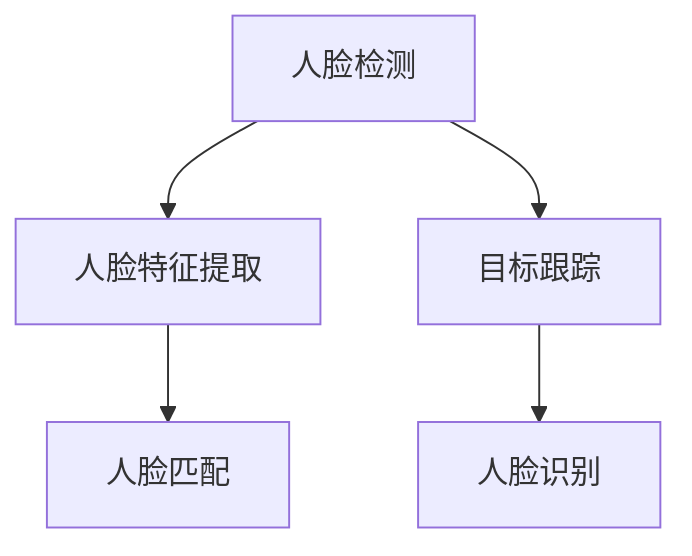

                 

关键词：人脸识别，OpenCV，图像处理，目标跟踪，计算机视觉

摘要：本文将深入探讨OpenCV（Open Source Computer Vision Library）在人脸识别与跟踪方面的应用。我们将从背景介绍、核心概念与联系、核心算法原理与操作步骤、数学模型与公式、项目实践、实际应用场景、工具和资源推荐、总结以及未来发展趋势与挑战等多个方面，详细解析这一技术领域的核心内容，帮助读者更好地理解和应用人脸识别与跟踪技术。

## 1. 背景介绍

人脸识别与跟踪是计算机视觉领域的重要研究方向，其应用涵盖了安防监控、身份验证、人机交互等多个领域。随着深度学习算法的不断发展，人脸识别技术取得了显著的进展。OpenCV作为一款广泛使用的开源计算机视觉库，提供了丰富的图像处理和计算机视觉功能，成为实现人脸识别与跟踪任务的重要工具。

### 1.1 人脸识别

人脸识别是指通过计算机算法识别和验证人脸身份的技术。其主要步骤包括人脸检测、人脸特征提取和人脸匹配。人脸检测是定位图像中的人脸区域，人脸特征提取是从人脸图像中提取出具有区分性的特征，人脸匹配则是比较提取出的特征与数据库中已知的人脸特征，以判断是否为同一人。

### 1.2 目标跟踪

目标跟踪是指在连续的图像序列中跟踪某个特定目标的技术。其主要步骤包括目标检测、目标跟踪和人脸识别。目标检测是识别图像中的目标，目标跟踪是在不同帧之间跟踪目标的位置，人脸识别则是确认目标是否为人脸。

### 1.3 OpenCV

OpenCV是一个开源的计算机视觉库，由Intel开发并维护。它提供了丰富的图像处理和计算机视觉功能，包括人脸检测、人脸识别、目标跟踪等。OpenCV支持多种编程语言，如C++、Python等，方便开发者进行开发和实验。

## 2. 核心概念与联系

### 2.1 人脸识别与跟踪的核心概念

- **人脸检测**：使用深度学习算法检测图像中的人脸区域。
- **人脸特征提取**：使用特征提取算法从人脸图像中提取出具有区分性的特征。
- **人脸匹配**：使用距离度量算法比较人脸特征，判断是否为同一人。
- **目标跟踪**：在连续的图像序列中跟踪特定目标的位置。

### 2.2 人脸识别与跟踪的架构



## 3. 核心算法原理 & 具体操作步骤

### 3.1 算法原理概述

- **人脸检测**：使用深度学习算法，如卷积神经网络（CNN）进行图像分类，识别图像中的人脸区域。
- **人脸特征提取**：使用特征提取算法，如LBP（局部二值模式）或HOG（方向梯度直方图），从人脸图像中提取出具有区分性的特征。
- **人脸匹配**：使用距离度量算法，如欧氏距离或余弦相似度，比较人脸特征，判断是否为同一人。
- **目标跟踪**：使用光流法、卡尔曼滤波或粒子滤波等算法，在连续的图像序列中跟踪目标的位置。

### 3.2 算法步骤详解

#### 3.2.1 人脸检测

1. **图像预处理**：对输入图像进行灰度化、缩放、旋转等操作，使其符合深度学习模型的输入要求。
2. **人脸区域检测**：使用深度学习算法对预处理后的图像进行分类，识别出人脸区域。

#### 3.2.2 人脸特征提取

1. **特征点检测**：使用特征点检测算法，如SIFT（尺度不变特征变换）或SURF（加速稳健特征），检测人脸图像中的关键点。
2. **特征点描述**：使用特征点描述算法，如LBP或HOG，对人脸图像中的关键点进行描述。

#### 3.2.3 人脸匹配

1. **特征点匹配**：使用最近邻搜索算法，将新提取的人脸特征与数据库中已知的人脸特征进行匹配。
2. **距离度量**：使用欧氏距离或余弦相似度计算特征点之间的距离，判断是否为同一人。

#### 3.2.4 目标跟踪

1. **目标检测**：使用目标检测算法，如YOLO（You Only Look Once）或SSD（Single Shot MultiBox Detector），检测连续图像中的目标。
2. **目标跟踪**：使用光流法、卡尔曼滤波或粒子滤波等算法，在连续的图像序列中跟踪目标的位置。

### 3.3 算法优缺点

- **人脸检测**：深度学习算法具有高准确性和鲁棒性，但计算复杂度高，对硬件要求较高。
- **人脸特征提取**：特征提取算法能有效提取人脸图像中的关键特征，但可能会受到光照、姿态等因素的影响。
- **人脸匹配**：距离度量算法能有效判断人脸是否为同一人，但可能存在误判。
- **目标跟踪**：目标跟踪算法能有效跟踪目标在连续图像中的位置，但可能受到遮挡、运动模糊等因素的影响。

### 3.4 算法应用领域

- **安防监控**：通过人脸识别技术实现实时监控，提高监控效果。
- **身份验证**：使用人脸识别技术进行身份验证，提高系统安全性。
- **人机交互**：通过人脸识别技术实现自然的人机交互，提高用户体验。

## 4. 数学模型和公式 & 详细讲解 & 举例说明

### 4.1 数学模型构建

- **人脸检测**：使用卷积神经网络（CNN）进行图像分类，其数学模型为：
  $$ y = \text{softmax}(W \cdot x + b) $$
  其中，$x$为输入图像，$W$为权重矩阵，$b$为偏置项，$y$为分类结果。

- **人脸特征提取**：使用特征提取算法，如LBP，其数学模型为：
  $$ f(x, y) = \sum_{i=-1}^{1} \sum_{j=-1}^{1} \text{sign}(i \cdot x + j \cdot y) \cdot 2^{-i-j} $$
  其中，$(x, y)$为像素点的坐标，$f(x, y)$为LBP值。

- **人脸匹配**：使用欧氏距离进行特征点匹配，其数学模型为：
  $$ d(x, y) = \sqrt{\sum_{i=1}^{n} (x_i - y_i)^2} $$
  其中，$x$和$y$为两个特征向量，$n$为特征向量维度，$d(x, y)$为欧氏距离。

- **目标跟踪**：使用卡尔曼滤波进行目标跟踪，其数学模型为：
  $$ x_{k+1} = A \cdot x_k + B \cdot u_k + w_k $$
  $$ y_k = H \cdot x_k + v_k $$
  其中，$x_k$为状态向量，$y_k$为观测向量，$A$、$B$、$H$分别为状态转移矩阵、控制矩阵和观测矩阵，$u_k$、$w_k$、$v_k$分别为控制向量、过程噪声和观测噪声。

### 4.2 公式推导过程

- **人脸检测**：卷积神经网络的推导过程涉及到前向传播和反向传播算法，具体推导过程可以参考相关深度学习教材。
- **人脸特征提取**：LBP算法的推导过程涉及到像素点的坐标变换和二值化处理，具体推导过程可以参考相关图像处理教材。
- **人脸匹配**：欧氏距离的推导过程涉及到向量的内积运算，具体推导过程可以参考相关线性代数教材。
- **目标跟踪**：卡尔曼滤波的推导过程涉及到线性系统的状态空间模型和最小方差估计，具体推导过程可以参考相关控制理论教材。

### 4.3 案例分析与讲解

假设我们有一个包含100张人脸图像的数据库，我们需要使用OpenCV实现人脸识别任务。具体步骤如下：

1. **人脸检测**：使用深度学习算法对图像进行分类，识别出人脸区域。
2. **人脸特征提取**：使用LBP算法对人脸图像进行特征提取。
3. **人脸匹配**：使用欧氏距离计算新提取的人脸特征与数据库中已知的人脸特征的距离，判断是否为同一人。
4. **目标跟踪**：在连续的图像序列中，使用卡尔曼滤波跟踪目标的位置。

## 5. 项目实践：代码实例和详细解释说明

### 5.1 开发环境搭建

1. **安装OpenCV**：在Windows、Linux或MacOS上安装OpenCV，可以使用pip命令进行安装：
   ```bash
   pip install opencv-python
   ```

2. **编写代码**：创建一个Python文件，编写实现人脸识别与跟踪的代码。

### 5.2 源代码详细实现

以下是一个简单的Python代码示例，实现人脸识别与跟踪任务：

```python
import cv2
import numpy as np

# 读取人脸识别模型
face_cascade = cv2.CascadeClassifier('haarcascade_frontalface_default.xml')
model = cv2.face.LBPHFaceRecognizer_create()
model.read('face_model.yml')

# 读取摄像头视频流
cap = cv2.VideoCapture(0)

while True:
    # 读取一帧图像
    ret, frame = cap.read()
    if not ret:
        break

    # 人脸检测
    gray = cv2.cvtColor(frame, cv2.COLOR_BGR2GRAY)
    faces = face_cascade.detectMultiScale(gray, 1.3, 5)

    # 人脸特征提取和匹配
    for (x, y, w, h) in faces:
        roi_gray = gray[y:y+h, x:x+w]
        roi_color = frame[y:y+h, x:x+w]
        label, confidence = model.predict(roi_gray)
        print(f'confidence: {confidence}')

        # 目标跟踪
        if confidence < 50:
            cv2.rectangle(frame, (x, y), (x+w, y+h), (0, 255, 0), 2)
            cv2.putText(frame, f'Person {label}', (x, y-10), cv2.FONT_HERSHEY_SIMPLEX, 1, (255, 0, 0), 2)

    # 显示图像
    cv2.imshow('frame', frame)

    if cv2.waitKey(20) & 0xFF == ord('q'):
        break

# 释放摄像头资源
cap.release()
cv2.destroyAllWindows()
```

### 5.3 代码解读与分析

- **人脸检测**：使用OpenCV的`CascadeClassifier`类进行人脸检测，其底层使用了Haar特征分类器。
- **人脸特征提取和匹配**：使用OpenCV的`LBPHFaceRecognizer`类进行人脸特征提取和匹配，其底层使用了局部二值模式（LBP）算法。
- **目标跟踪**：通过人脸检测和特征匹配的结果，使用OpenCV的`rectangle`和`putText`函数绘制人脸区域和标签。

## 6. 实际应用场景

### 6.1 安防监控

人脸识别与跟踪技术可以应用于安防监控领域，实现实时人脸检测和身份验证，提高监控效果和安全性。

### 6.2 身份验证

人脸识别与跟踪技术可以用于身份验证，如门禁系统、手机解锁等，提高系统的安全性和便捷性。

### 6.3 人机交互

人脸识别与跟踪技术可以用于人机交互，如智能机器人、虚拟现实等，提高用户体验和交互效果。

## 7. 工具和资源推荐

### 7.1 学习资源推荐

- **《OpenCV 4.x Cookbook》**：一本全面的OpenCV实战指南，涵盖图像处理、计算机视觉等多个方面。
- **《深度学习》**：一本经典的深度学习教材，详细介绍了深度学习的基础知识和应用场景。

### 7.2 开发工具推荐

- **Visual Studio Code**：一款强大的代码编辑器，支持多种编程语言和插件，适合进行OpenCV开发。
- **Jupyter Notebook**：一款流行的交互式计算环境，适合进行Python编程和数据可视化。

### 7.3 相关论文推荐

- **“Face Recognition Based on Convolutional Neural Networks”**：一篇关于使用卷积神经网络进行人脸识别的论文。
- **“A Comprehensive Survey on Face Detection”**：一篇关于人脸检测技术的全面综述。

## 8. 总结：未来发展趋势与挑战

### 8.1 研究成果总结

人脸识别与跟踪技术在过去几年取得了显著的进展，特别是在深度学习算法的应用方面。随着硬件性能的提升和算法的优化，人脸识别与跟踪技术的准确性和鲁棒性不断提高，应用领域也不断拓展。

### 8.2 未来发展趋势

- **硬件加速**：随着GPU、FPGA等硬件的普及，人脸识别与跟踪技术将逐步实现硬件加速，提高计算效率。
- **多模态融合**：结合多种传感器数据（如摄像头、红外传感器等），实现更准确的人脸识别与跟踪。
- **实时性优化**：优化算法和系统架构，提高人脸识别与跟踪的实时性，满足实时应用需求。

### 8.3 面临的挑战

- **隐私保护**：人脸识别与跟踪技术的应用涉及个人隐私，如何保护用户隐私是一个重要挑战。
- **光照和姿态变化**：人脸识别与跟踪技术在光照和姿态变化较大的场景下性能不稳定，需要进一步优化算法。

### 8.4 研究展望

- **跨域识别**：研究跨域人脸识别与跟踪技术，提高在不同环境、光照和姿态下的识别性能。
- **伦理与法律**：探讨人脸识别与跟踪技术在伦理和法律层面的影响，确保技术应用的安全性和合理性。

## 9. 附录：常见问题与解答

### 9.1 人脸识别的准确率如何提高？

- **数据增强**：增加更多的训练数据，提高模型的泛化能力。
- **特征融合**：结合多种特征提取算法，提高特征表示的丰富性。
- **模型优化**：使用更先进的深度学习模型和优化算法，提高模型性能。

### 9.2 人脸识别与跟踪在实时应用中如何优化？

- **硬件加速**：使用GPU、FPGA等硬件加速技术，提高计算效率。
- **模型压缩**：使用模型压缩技术，减小模型体积，提高运行速度。
- **多线程处理**：使用多线程或并行处理技术，提高处理速度。

---

作者：禅与计算机程序设计艺术 / Zen and the Art of Computer Programming
----------------------------------------------------------------

