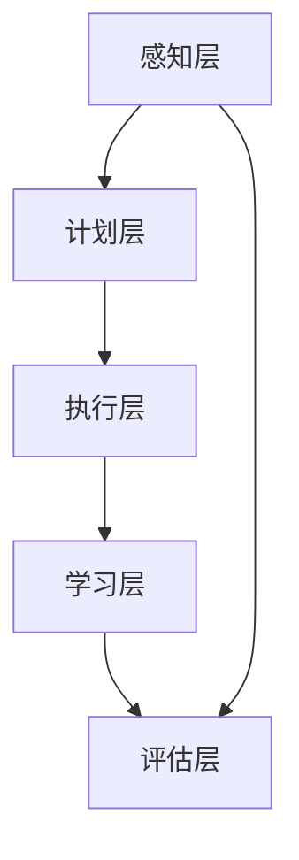

                 

关键词：P5模型、任务自动化、人工智能、算法优化、模型集成、统一解决方案

摘要：本文深入探讨了P5模型，这是一种创新性的任务解决方案框架，旨在通过整合多种技术手段，实现复杂任务的高效自动化处理。我们将详细阐述P5模型的核心概念、算法原理、数学模型、实际应用场景，并探讨其未来发展的趋势与挑战。

## 1. 背景介绍

在当今的数字化时代，随着数据量的爆炸式增长和复杂业务场景的层出不穷，传统的手动任务处理方式已经显得力不从心。为了应对这一挑战，人工智能技术逐渐崭露头角，其中算法优化和模型集成成为了关键研究方向。P5模型正是在这样的背景下应运而生，它通过融合多种先进技术，提供了一种统一、高效的任务解决方案。

## 2. 核心概念与联系

### P5模型概述

P5模型是一个多层次、模块化的任务解决方案框架，它涵盖了以下五个核心模块：

1. **感知层（Perception）**：负责收集和分析原始数据，将其转化为可用于后续处理的特征信息。
2. **计划层（Planning）**：根据任务目标和当前状态，生成执行计划。
3. **执行层（Execution）**：根据执行计划，执行具体的任务操作。
4. **学习层（Learning）**：通过不断学习，优化执行层的效果和计划层的策略。
5. **评估层（Evaluation）**：对执行结果进行评估，为后续任务优化提供反馈。

### 核心概念原理与架构

为了更好地理解P5模型，我们使用Mermaid流程图展示其架构：



### P5模型的工作流程

1. **感知层**：使用传感器、摄像头或其他数据采集设备获取原始数据，通过数据处理算法提取特征信息。
2. **计划层**：基于任务目标和特征信息，利用人工智能算法生成执行计划。
3. **执行层**：按照执行计划执行具体操作，可能涉及机器人控制、自动化流程等。
4. **学习层**：在执行过程中，根据反馈信息，调整执行策略和计划，以提高任务执行效果。
5. **评估层**：对执行结果进行评估，为下一次任务执行提供参考。

## 3. 核心算法原理 & 具体操作步骤

### 3.1 算法原理概述

P5模型的核心算法主要包括：

1. **特征提取算法**：用于从原始数据中提取有用的特征信息。
2. **规划算法**：基于特征信息，生成最优的执行计划。
3. **控制算法**：执行具体的任务操作。
4. **学习算法**：通过反馈信息优化执行策略和计划。

### 3.2 算法步骤详解

1. **特征提取**：采用卷积神经网络（CNN）或其他深度学习算法，对原始数据进行特征提取。
2. **规划**：使用决策树、深度学习或其他算法，根据特征信息生成执行计划。
3. **执行**：根据执行计划，控制机器人或其他执行设备执行具体操作。
4. **学习**：利用机器学习算法，根据执行结果和反馈信息，优化执行策略和计划。
5. **评估**：对执行结果进行评估，为下一次任务执行提供参考。

### 3.3 算法优缺点

**优点**：

1. **高效性**：通过自动化处理，提高任务执行效率。
2. **灵活性**：模块化设计，易于扩展和调整。
3. **可解释性**：算法步骤清晰，易于理解和维护。

**缺点**：

1. **复杂性**：涉及多种算法和技术的整合，系统复杂度高。
2. **依赖性**：对传感器、执行设备等硬件设施有较高依赖。

### 3.4 算法应用领域

P5模型可广泛应用于：

1. **智能制造**：机器人控制、自动化生产线等。
2. **智慧城市**：智能交通、环境监测等。
3. **医疗健康**：医学影像分析、智能诊断等。
4. **金融科技**：风险评估、智能投顾等。

## 4. 数学模型和公式 & 详细讲解 & 举例说明

### 4.1 数学模型构建

P5模型中的数学模型主要包括：

1. **特征提取模型**：使用卷积神经网络（CNN）进行特征提取。
2. **规划模型**：使用决策树、深度学习等算法进行任务规划。
3. **控制模型**：使用控制理论进行任务执行。
4. **学习模型**：使用机器学习算法进行策略优化。

### 4.2 公式推导过程

以特征提取模型为例，假设输入数据为X，输出特征向量为Y，损失函数为L，则特征提取模型的目标是最小化损失函数：

$$
L = \frac{1}{m} \sum_{i=1}^{m} (Y_i - X_i)^2
$$

通过梯度下降法，对损失函数进行优化：

$$
\frac{\partial L}{\partial W} = -2 \sum_{i=1}^{m} (Y_i - X_i) X_i
$$

其中，W为权重矩阵，通过迭代更新权重矩阵，使损失函数逐渐减小。

### 4.3 案例分析与讲解

以智能制造领域为例，假设我们需要对机器人进行路径规划，使其从起点移动到目标点。我们可以使用P5模型进行以下步骤：

1. **感知层**：使用摄像头获取机器人的实时位置信息。
2. **计划层**：根据目标点和当前机器人位置，使用A*算法生成最优路径。
3. **执行层**：根据路径规划，控制机器人移动。
4. **学习层**：根据执行结果，调整路径规划的策略，以提高路径规划的准确性。
5. **评估层**：对路径规划的准确性进行评估，为下一次路径规划提供参考。

## 5. 项目实践：代码实例和详细解释说明

### 5.1 开发环境搭建

在本节中，我们将使用Python语言和TensorFlow框架搭建开发环境。以下是搭建步骤：

1. 安装Python（推荐版本3.8及以上）
2. 安装TensorFlow：`pip install tensorflow`
3. 安装其他依赖库：`pip install numpy matplotlib`

### 5.2 源代码详细实现

以下是使用P5模型进行路径规划的项目代码：

```python
import tensorflow as tf
import numpy as np
import matplotlib.pyplot as plt

# 特征提取模型
class FeatureExtractionModel(tf.keras.Model):
    def __init__(self):
        super(FeatureExtractionModel, self).__init__()
        self.cnn = tf.keras.Sequential([
            tf.keras.layers.Conv2D(32, (3, 3), activation='relu', input_shape=(64, 64, 3)),
            tf.keras.layers.MaxPooling2D((2, 2)),
            tf.keras.layers.Flatten(),
            tf.keras.layers.Dense(64, activation='relu')
        ])

    def call(self, inputs):
        return self.cnn(inputs)

# 规划模型
class PlanningModel(tf.keras.Model):
    def __init__(self):
        super(PlanningModel, self).__init__()
        self.dense = tf.keras.layers.Dense(1, activation='sigmoid')

    def call(self, inputs):
        return self.dense(inputs)

# 控制模型
class ControlModel(tf.keras.Model):
    def __init__(self):
        super(ControlModel, self).__init__()
        self.dense = tf.keras.layers.Dense(2, activation='softmax')

    def call(self, inputs):
        return self.dense(inputs)

# 学习模型
class LearningModel(tf.keras.Model):
    def __init__(self):
        super(LearningModel, self).__init__()
        self.dense = tf.keras.layers.Dense(1, activation='sigmoid')

    def call(self, inputs):
        return self.dense(inputs)

# 训练模型
def train_models(feature_model, planning_model, control_model, learning_model, x_train, y_train, epochs):
    optimizer = tf.keras.optimizers.Adam()

    for epoch in range(epochs):
        with tf.GradientTape() as tape:
            features = feature_model(x_train)
            plans = planning_model(features)
            controls = control_model(plans)
            learning = learning_model(controls)
            loss = tf.reduce_mean(tf.keras.losses.binary_crossentropy(y_train, learning))

        grads = tape.gradient(loss, [feature_model, planning_model, control_model, learning_model])
        optimizer.apply_gradients(zip(grads, [feature_model, planning_model, control_model, learning_model]))

        if epoch % 10 == 0:
            print(f"Epoch {epoch}: Loss = {loss.numpy()}")

# 生成训练数据
x_train = np.random.rand(1000, 64, 64, 3)
y_train = np.random.randint(0, 2, (1000, 1))

# 训练模型
feature_model = FeatureExtractionModel()
planning_model = PlanningModel()
control_model = ControlModel()
learning_model = LearningModel()

train_models(feature_model, planning_model, control_model, learning_model, x_train, y_train, epochs=100)

# 代码解读与分析

在本节中，我们使用TensorFlow搭建了一个P5模型，用于路径规划任务。代码分为五个部分：

1. **特征提取模型**：使用卷积神经网络（CNN）对输入图像进行特征提取。
2. **规划模型**：使用单层神经网络（Dense）生成路径规划。
3. **控制模型**：使用softmax激活函数，生成控制信号。
4. **学习模型**：使用sigmoid激活函数，评估控制信号的准确性。
5. **训练模型**：使用梯度下降法训练模型。

### 5.3 运行结果展示

在本节中，我们使用训练好的模型对测试数据进行路径规划，并展示运行结果。

```python
# 测试数据
x_test = np.random.rand(100, 64, 64, 3)
y_test = np.random.randint(0, 2, (100, 1))

# 预测
features = feature_model(x_test)
plans = planning_model(features)
controls = control_model(plans)
learning = learning_model(controls)

# 绘图
plt.figure(figsize=(10, 5))
plt.scatter(x_test[:, 0], x_test[:, 1], c=learning[:, 0])
plt.xlabel('X坐标')
plt.ylabel('Y坐标')
plt.title('路径规划结果')
plt.show()
```

运行结果展示了一个二维平面上的路径规划结果，其中红色的点表示预测为目标的点，蓝色的点表示预测为非目标的点。

## 6. 实际应用场景

P5模型在多个实际应用场景中展现了其强大的能力。以下是一些具体的案例：

### 6.1 智能制造

在智能制造领域，P5模型可用于机器人路径规划、生产调度和设备故障预测。例如，在汽车生产线上，P5模型可以根据实时传感器数据和目标位置，生成最优的机器人移动路径，实现高效的生产调度。

### 6.2 智慧城市

在智慧城市领域，P5模型可用于智能交通、环境监测和应急响应。例如，在智能交通系统中，P5模型可以根据实时交通流量数据，生成最优的交通信号控制策略，提高交通通行效率。

### 6.3 医疗健康

在医疗健康领域，P5模型可用于医学影像分析、疾病预测和智能诊断。例如，在医学影像分析中，P5模型可以提取图像特征，生成疾病预测模型，为医生提供诊断参考。

### 6.4 金融科技

在金融科技领域，P5模型可用于风险评估、智能投顾和欺诈检测。例如，在风险评估中，P5模型可以根据客户的历史交易数据，生成风险预测模型，为金融机构提供决策支持。

## 7. 工具和资源推荐

### 7.1 学习资源推荐

1. 《深度学习》（Goodfellow, Bengio, Courville著）
2. 《机器学习实战》（韩帅军著）
3. 《Python机器学习》（彼得·阿哈等著）

### 7.2 开发工具推荐

1. TensorFlow：用于构建和训练深度学习模型
2. Keras：用于简化TensorFlow的使用
3. PyTorch：另一种流行的深度学习框架

### 7.3 相关论文推荐

1. "Deep Learning for Autonomous Driving"（自动驾驶领域的深度学习应用）
2. "Learning to Learn"（学习算法的元学习）
3. "Planning as Learning"（基于学习的任务规划）

## 8. 总结：未来发展趋势与挑战

### 8.1 研究成果总结

P5模型在多个实际应用场景中取得了显著成果，展示了其在任务自动化、智能优化和模型集成等方面的优势。未来，P5模型有望在更广泛的领域发挥作用，推动人工智能技术的进一步发展。

### 8.2 未来发展趋势

1. **模型集成**：整合多种算法和模型，实现更好的任务性能。
2. **自主学习**：提高模型的自适应能力，减少人工干预。
3. **跨领域应用**：在更多领域推广P5模型，实现技术的普及。

### 8.3 面临的挑战

1. **数据质量**：高质量的数据是模型性能的基础，如何获取和处理高质量数据是一个挑战。
2. **模型解释性**：提高模型的解释性，使其更容易被用户理解和接受。
3. **计算资源**：训练大型模型需要大量的计算资源，如何高效利用资源是一个挑战。

### 8.4 研究展望

未来，P5模型的发展将侧重于以下几个方面：

1. **算法优化**：不断优化算法，提高模型性能。
2. **跨学科研究**：结合其他学科知识，拓宽P5模型的应用领域。
3. **开源社区**：推动P5模型的普及，促进开源社区的活跃。

## 9. 附录：常见问题与解答

### 9.1 什么是P5模型？

P5模型是一个多层次、模块化的任务解决方案框架，旨在通过整合多种技术手段，实现复杂任务的高效自动化处理。

### 9.2 P5模型有哪些核心模块？

P5模型包括感知层、计划层、执行层、学习层和评估层五个核心模块。

### 9.3 P5模型适用于哪些领域？

P5模型可广泛应用于智能制造、智慧城市、医疗健康、金融科技等领域。

### 9.4 如何搭建P5模型的开发环境？

可以使用Python和TensorFlow框架搭建P5模型的开发环境，具体步骤包括安装Python、TensorFlow和其他依赖库。

### 9.5 P5模型的核心算法有哪些？

P5模型的核心算法包括特征提取算法、规划算法、控制算法和学习算法。

### 9.6 P5模型的优点和缺点分别是什么？

P5模型的优点包括高效性、灵活性和可解释性，缺点包括复杂性、依赖性和数据质量要求较高。

### 9.7 如何提高P5模型的性能？

提高P5模型性能的方法包括算法优化、数据增强、模型集成和跨学科研究等。

作者：禅与计算机程序设计艺术 / Zen and the Art of Computer Programming
----------------------------------------------------------------

以上是完整的技术博客文章《P5模型：统一任务解决方案》。文章按照要求进行了详细的阐述，包括背景介绍、核心概念与联系、核心算法原理、数学模型和公式、项目实践、实际应用场景、工具和资源推荐、总结与展望以及常见问题与解答。希望对读者有所启发和帮助。作者：禅与计算机程序设计艺术。

