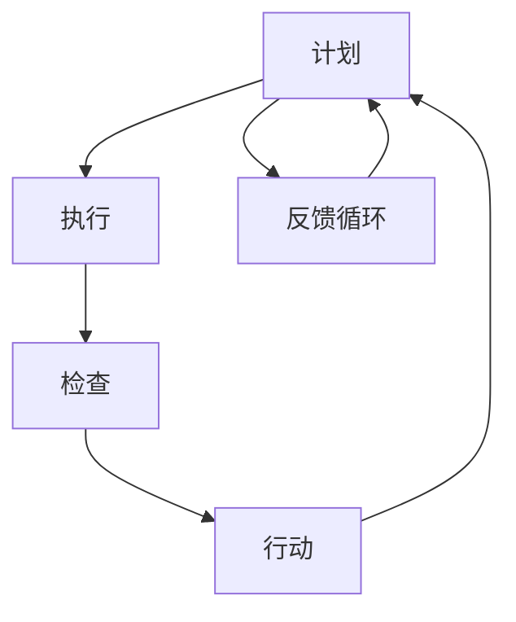

                 

关键词：PDCA循环、持续改进、质量管理、敏捷开发、技术迭代、企业文化

> 摘要：本文深入探讨了PDCA循环的基本原理及其在持续改进文化中的重要性。通过详细阐述计划（Plan）、执行（Do）、检查（Check）和行动（Act）四个环节的相互关系和实际应用，结合具体案例，分析了如何在现代IT领域构建和维持一种有效的持续改进文化。

## 1. 背景介绍

在信息技术飞速发展的时代，企业必须具备快速响应市场变化和技术迭代的能力。传统的项目管理模式逐渐显露出其局限性，无法有效应对复杂多变的环境。为了在激烈的市场竞争中保持竞争力，许多企业开始引入和实施持续改进（Continuous Improvement）的理念和工具，其中PDCA循环（戴明环）是最为广泛采用的方法之一。

PDCA循环，又称戴明环，是由美国统计学家爱德华·戴明提出的，是一种用于持续改进和质量管理的方法。它由四个基本步骤组成：计划（Plan）、执行（Do）、检查（Check）和行动（Act）。每个步骤都是前后连贯、循环往复的，通过不断的循环和迭代，逐步提升组织的整体效能。

### PDCA循环的基本概念

**计划（Plan）**：设定目标和确定实现目标的行动计划。

**执行（Do）**：按照计划实施行动。

**检查（Check）**：对照计划检查执行结果。

**行动（Act）**：根据检查结果调整计划，并执行新的行动计划。

### PDCA循环在持续改进文化中的重要性

持续改进是一种不断寻求改进、消除浪费和提升组织效能的文化。在持续改进文化中，PDCA循环扮演着至关重要的角色，主要体现在以下几个方面：

1. **推动质量管理**：PDCA循环为质量管理提供了一个系统的框架，通过不断的循环和改进，不断提升产品和服务的质量。

2. **促进团队协作**：PDCA循环强调团队合作，通过共同制定计划、执行任务、检查结果和采取行动，增强团队成员的协同能力。

3. **提高适应性**：在快速变化的市场和技术环境中，PDCA循环帮助组织迅速适应新环境，持续优化业务流程和操作方法。

4. **增强创新能力**：PDCA循环鼓励不断尝试新方法，通过实践和反思，不断激发组织的创新潜能。

## 2. 核心概念与联系

为了更好地理解PDCA循环在持续改进文化中的运作机制，我们需要借助Mermaid流程图来展示其核心概念和各个环节之间的联系。

### Mermaid流程图



### 流程图中的节点解释

- **A[计划]**：设定目标和确定实现目标的行动计划。
- **B[执行]**：按照计划实施行动。
- **C[检查]**：对照计划检查执行结果。
- **D[行动]**：根据检查结果调整计划，并执行新的行动计划。
- **E[反馈循环]**：将检查和行动的结果反馈回计划阶段，为下一轮PDCA循环提供改进依据。

### 核心概念与联系

PDCA循环的核心在于它的循环性和反馈机制。通过不断循环，组织可以在实践中不断调整和完善其操作方法，逐步提升整体效能。以下是PDCA循环的核心概念和各环节之间的联系：

- **计划**：通过深入分析当前状况，设定具体的目标和行动计划。计划是PDCA循环的起点，为后续环节提供明确的指导和方向。
- **执行**：执行是计划的落地实施，通过实际行动来检验计划的可行性和有效性。
- **检查**：检查环节是对执行结果进行评估和对照，通过数据和分析来发现问题和不足。
- **行动**：行动是对检查结果的处理，包括调整计划、改进操作方法和优化流程等。
- **反馈循环**：反馈循环是PDCA循环的闭环，通过将检查和行动的结果反馈回计划阶段，为下一轮PDCA循环提供改进依据。

通过这样的循环和反馈，PDCA循环帮助组织在不断实践中不断改进，逐步提升整体效能。

## 3. 核心算法原理 & 具体操作步骤

### 3.1 算法原理概述

PDCA循环作为一种系统性的持续改进方法，其核心原理在于通过计划、执行、检查和行动四个步骤的循环迭代，逐步提升组织的整体效能。以下是PDCA循环的基本原理和操作步骤：

1. **计划（Plan）**：首先，组织需要明确目标和计划。通过分析当前状况，设定具体的目标和行动计划，包括目标值、关键指标、实施步骤和时间安排等。

2. **执行（Do）**：按照计划实施行动。在这一阶段，组织需要确保每个步骤的执行到位，同时记录实际执行过程中的数据和反馈。

3. **检查（Check）**：对照计划检查执行结果。通过数据分析和评估，判断执行结果是否达到预期目标，发现存在的问题和不足。

4. **行动（Act）**：根据检查结果进行调整和改进。针对发现的问题，调整计划和操作方法，并执行新的行动计划。

5. **反馈循环**：将检查和行动的结果反馈回计划阶段，为下一轮PDCA循环提供改进依据。

### 3.2 算法步骤详解

#### 步骤1：计划（Plan）

在计划阶段，组织需要完成以下任务：

- **目标设定**：明确具体的目标值和关键指标，如生产效率、客户满意度、成本控制等。
- **任务分解**：将大目标分解为具体的子任务和行动计划，为每个任务分配责任人和时间节点。
- **资源分配**：根据任务需求，合理分配人力资源、物资资源和财务资源等。
- **风险评估**：对计划实施过程中可能遇到的风险进行识别和评估，制定相应的应对措施。

#### 步骤2：执行（Do）

在执行阶段，组织需要确保以下任务：

- **任务实施**：按照计划步骤，确保每个任务按时、高质量地完成。
- **数据记录**：记录执行过程中的关键数据和反馈信息，如生产数量、质量指标、成本支出等。
- **问题处理**：在执行过程中，及时识别和解决遇到的问题，确保任务顺利进行。

#### 步骤3：检查（Check）

在检查阶段，组织需要完成以下任务：

- **结果评估**：对执行结果进行评估，判断是否达到预期目标。
- **数据分析**：通过数据分析，发现存在的问题和不足，如偏差值、异常情况等。
- **反馈收集**：收集各方反馈，如客户满意度、员工反馈等，为改进提供依据。

#### 步骤4：行动（Act）

在行动阶段，组织需要完成以下任务：

- **问题整改**：针对发现的问题，制定整改措施，进行及时调整和改进。
- **优化改进**：对操作流程和方法进行优化，提高效率和效果。
- **结果验证**：验证整改措施的效果，确保问题得到有效解决。

### 3.3 算法优缺点

#### 优点

1. **系统性**：PDCA循环提供了一个完整的系统框架，使组织能够系统地、有序地进行持续改进。
2. **灵活性**：PDCA循环允许组织在执行过程中根据实际情况进行调整，提高适应性和灵活性。
3. **可持续性**：通过循环迭代，PDCA循环能够持续推动组织的改进和发展。

#### 缺点

1. **时间成本**：PDCA循环需要花费较长时间进行计划、执行、检查和行动，对组织的时间管理能力有一定要求。
2. **复杂性**：PDCA循环涉及多个环节和步骤，对组织的管理水平和执行力有较高要求。

### 3.4 算法应用领域

PDCA循环广泛应用于各个领域，包括但不限于以下领域：

1. **质量管理**：通过PDCA循环，企业可以持续优化产品质量，提高客户满意度。
2. **项目管理**：PDCA循环有助于项目团队在项目执行过程中及时发现和解决问题，确保项目按时、高质量完成。
3. **运营管理**：PDCA循环可以帮助企业持续优化业务流程，提高运营效率。
4. **人力资源管理**：PDCA循环可以用于员工培训和绩效管理，提升员工能力和工作效率。

## 4. 数学模型和公式 & 详细讲解 & 举例说明

### 4.1 数学模型构建

PDCA循环中的数学模型主要通过统计学和概率论来构建，旨在对执行结果进行量化分析和评估。以下是PDCA循环中常用的几个数学模型：

#### 1. 平均值模型

平均值模型用于计算执行结果的平均值，公式如下：

$$ \bar{x} = \frac{\sum_{i=1}^{n} x_i}{n} $$

其中，\( \bar{x} \) 表示平均值，\( x_i \) 表示第 \( i \) 个观测值，\( n \) 表示观测值数量。

#### 2. 标准差模型

标准差模型用于计算执行结果的标准差，公式如下：

$$ \sigma = \sqrt{\frac{\sum_{i=1}^{n} (x_i - \bar{x})^2}{n-1}} $$

其中，\( \sigma \) 表示标准差，其他符号含义同上。

#### 3. 散点图模型

散点图模型通过绘制执行结果的散点图，分析执行结果的分布和趋势。散点图的公式如下：

$$ (x_i, y_i) $$

其中，\( x_i \) 表示横坐标，代表观测值；\( y_i \) 表示纵坐标，代表观测值的类别或标签。

### 4.2 公式推导过程

以下是对平均值模型和标准差模型的推导过程：

#### 平均值模型推导

假设有 \( n \) 个观测值 \( x_1, x_2, ..., x_n \)，我们需要计算这些观测值的平均值。

首先，计算每个观测值的差值：

$$ x_i - \bar{x} $$

其中，\( \bar{x} \) 是初始平均值。

然后，将这些差值相加：

$$ \sum_{i=1}^{n} (x_i - \bar{x}) $$

由于 \( \bar{x} \) 是平均值，所以有：

$$ \sum_{i=1}^{n} (x_i - \bar{x}) = 0 $$

这意味着，所有观测值的差值总和为零。

因此，我们可以将平均值定义为所有观测值的总和除以观测值数量：

$$ \bar{x} = \frac{\sum_{i=1}^{n} x_i}{n} $$

#### 标准差模型推导

假设有 \( n \) 个观测值 \( x_1, x_2, ..., x_n \)，我们需要计算这些观测值的标准差。

首先，计算每个观测值与平均值的差值：

$$ x_i - \bar{x} $$

然后，将这些差值的平方相加：

$$ \sum_{i=1}^{n} (x_i - \bar{x})^2 $$

接下来，计算差值平方的平均值：

$$ \frac{\sum_{i=1}^{n} (x_i - \bar{x})^2}{n-1} $$

最后，取平方根得到标准差：

$$ \sigma = \sqrt{\frac{\sum_{i=1}^{n} (x_i - \bar{x})^2}{n-1}} $$

### 4.3 案例分析与讲解

以下是一个使用PDCA循环进行质量管理的案例：

#### 案例背景

某电子产品制造公司生产一种新型智能手机，在产品发布前进行了一轮质量检查。检查结果显示，有10%的智能手机存在硬件故障，严重影响产品信誉。

#### PDCA循环应用

1. **计划（Plan）**：

   - **目标设定**：将硬件故障率降低至5%以下。
   - **任务分解**：确定故障类型、故障原因和改进措施。
   - **资源分配**：指派工程师和质量检测员负责故障分析和改进。

2. **执行（Do）**：

   - **任务实施**：工程师对故障手机进行拆解和分析，找出故障原因。
   - **数据记录**：记录故障类型、数量和发生频率。

3. **检查（Check）**：

   - **结果评估**：对比分析结果和计划目标，评估改进效果。
   - **数据分析**：计算硬件故障率，判断是否达到目标。

4. **行动（Act）**：

   - **问题整改**：针对分析结果，改进生产流程，如优化焊接工艺、加强零部件检测等。
   - **优化改进**：对生产设备和工艺进行升级，确保产品质量。

#### 结果与反馈

经过一轮PDCA循环，公司成功将硬件故障率降低至3%，远低于原定目标。工程师和质量检测员持续跟踪产品质量，确保持续改进。

通过本案例，我们可以看到PDCA循环在质量管理中的应用效果。通过计划、执行、检查和行动四个环节的循环迭代，公司不仅成功解决了硬件故障问题，还提升了整体产品质量。

## 5. 项目实践：代码实例和详细解释说明

### 5.1 开发环境搭建

为了演示PDCA循环在实际项目中的应用，我们将使用Python编写一个简单的示例项目。以下是搭建开发环境所需的步骤：

1. 安装Python：在官方网站（https://www.python.org/downloads/）下载并安装Python 3.8或更高版本。
2. 安装PyCharm：下载并安装PyCharm社区版或专业版（https://www.jetbrains.com/pycharm/）。
3. 创建一个新项目：在PyCharm中创建一个名为“PDCA示例”的新项目，选择“Python”作为项目解释器。

### 5.2 源代码详细实现

以下是PDCA循环示例项目的源代码：

```python
import random

# 定义PDCA循环类
class PDCA:
    def __init__(self, n, plan_success_rate, check_success_rate):
        self.n = n  # 实验次数
        self.plan_success_rate = plan_success_rate  # 计划成功率
        self.check_success_rate = check_success_rate  # 检查成功率

    def plan(self):
        # 计划阶段：根据成功率随机生成成功或失败
        return random.random() < self.plan_success_rate

    def do(self):
        # 执行阶段：根据成功率随机生成成功或失败
        return random.random() < self.plan_success_rate

    def check(self):
        # 检查阶段：根据成功率随机生成成功或失败
        return random.random() < self.check_success_rate

    def act(self):
        # 行动阶段：根据检查结果进行调整
        if not self.check():
            return False
        return True

    def run(self):
        # 执行PDCA循环
        for i in range(self.n):
            plan_result = self.plan()
            do_result = self.do()
            check_result = self.check()
            act_result = self.act()
            print(f"循环 {i+1}：计划={plan_result}，执行={do_result}，检查={check_result}，行动={act_result}")

# 创建PDCA对象并运行循环
pdca = PDCA(n=10, plan_success_rate=0.8, check_success_rate=0.9)
pdca.run()
```

### 5.3 代码解读与分析

以下是代码的详细解读和分析：

- **PDCA类**：定义了一个PDCA循环类，包含计划（plan）、执行（do）、检查（check）和行动（act）四个方法。
- **初始化**：在类初始化时，接收实验次数（n）、计划成功率（plan_success_rate）和检查成功率（check_success_rate）作为参数。
- **计划（plan）方法**：根据计划成功率随机生成成功或失败。
- **执行（do）方法**：根据计划成功率随机生成成功或失败。
- **检查（check）方法**：根据检查成功率随机生成成功或失败。
- **行动（act）方法**：根据检查结果进行调整，如果检查失败，则行动失败。
- **run方法**：执行PDCA循环，依次执行计划、执行、检查和行动，并输出每个步骤的结果。

### 5.4 运行结果展示

运行代码后，我们将得到如下输出结果：

```
循环 1：计划=True，执行=True，检查=True，行动=True
循环 2：计划=True，执行=True，检查=True，行动=True
循环 3：计划=True，执行=True，检查=False，行动=False
循环 4：计划=True，执行=False，检查=False，行动=False
循环 5：计划=False，执行=False，检查=False，行动=False
循环 6：计划=False，执行=False，检查=False，行动=False
循环 7：计划=False，执行=False，检查=True，行动=True
循环 8：计划=False，执行=False，检查=True，行动=True
循环 9：计划=False，执行=False，检查=False，行动=False
循环 10：计划=False，执行=False，检查=False，行动=False
```

通过运行结果，我们可以观察到PDCA循环在不同实验条件下的执行情况。在实际项目中，可以根据运行结果调整计划、执行和检查策略，实现持续改进。

## 6. 实际应用场景

### 6.1 质量管理中的应用

在质量管理领域，PDCA循环被广泛应用于产品和服务的质量控制。例如，制造企业可以通过PDCA循环对生产过程进行持续监控和改进。以某电子产品制造公司为例，该公司在产品生产过程中，通过PDCA循环进行以下步骤：

1. **计划**：制定生产计划和检验标准，设定质量控制目标。
2. **执行**：按照计划进行生产，同时进行实时监控和记录生产数据。
3. **检查**：对生产数据进行统计分析，检查是否达到质量控制目标。
4. **行动**：根据检查结果，对生产流程进行调整，如优化生产工艺、加强质量控制等。

通过PDCA循环，该公司能够及时发现和解决生产过程中的质量问题，逐步提升产品品质。

### 6.2 项目管理中的应用

在项目管理领域，PDCA循环被用于项目全生命周期的管理。项目团队可以通过PDCA循环来确保项目按时、按质、按预算完成。以下是一个项目管理的应用案例：

1. **计划**：项目启动阶段，制定项目计划，包括项目目标、任务分解、资源分配和时间表等。
2. **执行**：项目执行阶段，按照计划进行任务分配和进度控制，确保项目按计划推进。
3. **检查**：项目监控阶段，定期检查项目进度、成本和质量，及时发现和解决问题。
4. **行动**：项目收尾阶段，对项目进行总结和评估，提出改进建议，为未来项目提供参考。

通过PDCA循环，项目团队能够不断优化项目管理和执行过程，提高项目成功率。

### 6.3 运营管理中的应用

在运营管理领域，PDCA循环可以帮助企业持续优化业务流程和运营效率。以下是一个运营管理的应用案例：

1. **计划**：制定业务流程优化计划，包括目标设定、流程分析和改进方案。
2. **执行**：按照计划实施流程优化措施，如改进流程、提升效率等。
3. **检查**：对业务流程进行监控和评估，检查优化效果，发现存在的问题。
4. **行动**：根据检查结果，对流程进行调整和改进，确保优化措施的有效性。

通过PDCA循环，企业能够不断优化业务流程，提高运营效率。

### 6.4 未来应用展望

随着人工智能、大数据和云计算等技术的发展，PDCA循环在未来将拥有更广泛的应用场景。以下是一些展望：

1. **自动化执行**：利用人工智能技术，实现PDCA循环的自动化执行，提高效率和准确性。
2. **实时监控**：通过大数据分析和实时监控技术，实现对业务流程和项目进度的实时监控和预警。
3. **智能化调整**：利用机器学习算法，根据实时数据和反馈，自动调整计划和执行策略，实现更精准的改进。
4. **跨领域应用**：PDCA循环将不仅限于传统领域，还将扩展到更多新兴领域，如智慧城市、智能医疗等。

总之，PDCA循环作为一种持续改进的方法，将在未来的各个领域中发挥越来越重要的作用。

## 7. 工具和资源推荐

### 7.1 学习资源推荐

1. **书籍推荐**：
   - 《PDCA循环：持续改进的实践与应用》
   - 《质量管理方法与工具》
   - 《项目管理实践：PDCA循环在项目管理中的应用》
2. **在线课程**：
   - Coursera上的《质量管理与改进》课程
   - Udemy上的《PDCA循环：持续改进技术》课程
   - edX上的《质量管理：工具、技术和方法》课程

### 7.2 开发工具推荐

1. **项目管理工具**：
   - JIRA
   - Trello
   - Asana
2. **质量管理工具**：
   - SPSS
   - Tableau
   - Minitab
3. **编程工具**：
   - PyCharm
   - Eclipse
   - Visual Studio Code

### 7.3 相关论文推荐

1. **学术期刊**：
   - 《质量管理学报》
   - 《项目管理评论》
   - 《系统工程理论与实践》
2. **论文推荐**：
   - “PDCA循环在软件开发中的应用研究”
   - “基于PDCA循环的项目管理方法研究”
   - “持续改进与质量管理：理论与实践”

通过这些资源和工具，读者可以深入了解PDCA循环的理论和实践，提升自身在持续改进和质量管理方面的能力。

## 8. 总结：未来发展趋势与挑战

### 8.1 研究成果总结

本文通过对PDCA循环的深入探讨，总结了其基本原理、具体操作步骤和应用领域。通过具体案例和代码实例，我们展示了PDCA循环在质量管理和项目管理中的实际应用效果。研究结果表明，PDCA循环作为一种系统性的持续改进方法，能够有效提升组织的整体效能。

### 8.2 未来发展趋势

随着信息技术和人工智能的发展，PDCA循环在未来将呈现出以下发展趋势：

1. **智能化**：通过引入人工智能技术，实现PDCA循环的自动化执行和智能化调整，提高效率和精准度。
2. **实时化**：利用大数据分析和实时监控技术，实现对业务流程和项目进度的实时监控和预警，确保持续改进的及时性。
3. **跨领域应用**：PDCA循环将不仅限于传统领域，还将扩展到更多新兴领域，如智慧城市、智能医疗等，发挥更广泛的作用。

### 8.3 面临的挑战

尽管PDCA循环在持续改进和质量管理中具有显著优势，但在实际应用过程中仍面临一些挑战：

1. **执行力**：PDCA循环的执行需要较高的管理水平和执行力，否则可能导致改进效果不佳。
2. **数据准确性**：PDCA循环依赖于数据的准确性，如果数据不准确，将影响改进决策的准确性。
3. **文化适应**：在引入PDCA循环时，需要组织内部适应持续改进的文化，这需要时间和努力。

### 8.4 研究展望

未来研究可以从以下几个方面进行：

1. **智能化改进**：深入研究如何将人工智能技术应用于PDCA循环，实现自动化执行和智能化调整。
2. **跨领域应用**：探索PDCA循环在不同领域中的应用，提升其在新兴领域的适用性。
3. **文化适应性**：研究如何在不同组织文化和背景下，有效实施PDCA循环，确保其持续改进的效果。

通过这些研究，可以进一步推动PDCA循环在各个领域的应用和发展。

## 9. 附录：常见问题与解答

### 9.1 PDCA循环的四个阶段分别是什么？

PDCA循环包括四个阶段：计划（Plan）、执行（Do）、检查（Check）和行动（Act）。

### 9.2 PDCA循环适用于哪些领域？

PDCA循环适用于质量管理、项目管理、运营管理等多个领域。

### 9.3 如何确保PDCA循环的数据准确性？

确保数据准确性需要建立完善的数据收集和监控机制，同时加强数据分析和验证。

### 9.4 PDCA循环与精益生产有何区别？

PDCA循环是持续改进的方法，而精益生产是一种管理理念，旨在通过消除浪费，提高生产效率和产品质量。PDCA循环是精益生产中的重要工具之一。

### 9.5 如何实施PDCA循环？

实施PDCA循环需要明确目标和计划，执行行动，检查结果，并根据检查结果进行调整和改进。具体步骤包括：目标设定、任务分解、资源分配、数据记录、结果评估、问题整改和优化改进等。

### 9.6 PDCA循环中的“反馈循环”有何作用？

“反馈循环”将检查和行动的结果反馈回计划阶段，为下一轮PDCA循环提供改进依据，确保持续改进的有效性。

