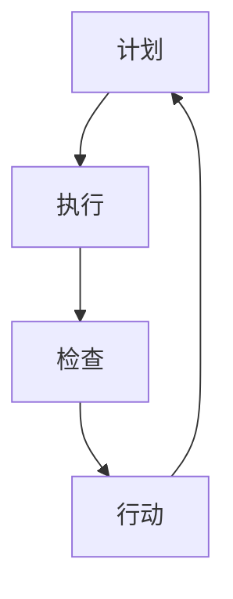

                 

 **关键词**：PDCA循环、持续改进、管理、质量管理、流程优化、IT项目管理

**摘要**：本文将深入探讨PDCA循环在IT项目管理中的重要性，以及如何通过PDCA循环实现持续改进。我们将从背景介绍、核心概念与联系、核心算法原理与具体操作步骤、数学模型和公式、项目实践、实际应用场景、未来应用展望、工具和资源推荐、总结以及常见问题与解答等多个方面进行阐述。

## 1. 背景介绍

在当今快速变化的IT行业，项目管理显得尤为重要。项目的成功不仅取决于技术实现的难度，还受到多种因素的影响，如团队合作、资源分配、时间管理、风险管理等。为了确保项目能够按时、按预算、按质量完成，许多IT项目采用了一系列的管理方法和工具。

其中，PDCA循环（Plan-Do-Check-Act）作为一种广泛认可的管理方法，被应用于各个领域，特别是在质量管理中。PDCA循环是一种持续改进的过程，通过计划、执行、检查和行动四个阶段，实现项目质量的不断提升。本文将重点讨论PDCA循环在IT项目管理中的应用，以及如何通过持续改进实现项目的成功。

## 2. 核心概念与联系

### 2.1 PDCA循环的基本原理

PDCA循环是一种闭环管理方法，它包括以下四个基本步骤：

**Plan（计划）**：在这一阶段，项目团队需要制定详细的计划，包括项目目标、里程碑、资源需求、时间表和风险评估。

**Do（执行）**：执行阶段是实际实施计划的阶段。项目团队按照计划进行工作，确保各项任务按照预定的时间表完成。

**Check（检查）**：在检查阶段，项目团队评估项目的实际进展情况，与计划进行比较，确定是否达到预期目标。

**Act（行动）**：行动阶段是针对检查结果采取行动的阶段。如果发现偏差，团队需要调整计划或采取纠正措施，确保项目能够回到正轨。

### 2.2 PDCA循环与持续改进的关系

持续改进是PDCA循环的核心。通过不断地计划、执行、检查和行动，项目团队能够发现并解决项目中存在的问题，从而实现项目的持续改进。持续改进不仅能够提高项目的质量，还能够提高团队的工作效率和项目的成功率。

### 2.3 Mermaid 流程图

下面是一个简单的Mermaid流程图，展示了PDCA循环的基本流程。



## 3. 核心算法原理 & 具体操作步骤

### 3.1 算法原理概述

PDCA循环的核心在于其循环性。每次循环都会使项目团队更深入地了解项目，发现问题并解决问题，从而实现项目的持续改进。这种循环性保证了项目能够在不断变化的环境中保持稳定和高效。

### 3.2 算法步骤详解

**3.2.1 计划（Plan）**

- 明确项目目标和关键里程碑。
- 制定详细的任务和时间表。
- 评估项目风险并制定相应的应对策略。
- 确定所需的资源和人力。

**3.2.2 执行（Do）**

- 按照计划执行任务。
- 定期跟踪任务的进度。
- 确保资源得到合理分配和充分利用。

**3.2.3 检查（Check）**

- 与计划进行比较，评估项目的实际进展。
- 收集项目数据，如任务完成情况、资源消耗等。
- 识别项目中存在的问题和瓶颈。

**3.2.4 行动（Act）**

- 根据检查结果，调整计划和执行策略。
- 采取纠正措施，解决项目中的问题。
- 记录经验和教训，为下一次循环提供参考。

### 3.3 算法优缺点

**优点**：

- 简单易懂，易于实施。
- 强调持续改进，有利于项目的长期成功。
- 可以灵活地适应项目环境的变化。

**缺点**：

- 需要团队成员的高度参与和协作。
- 需要持续的时间投入和资源支持。

### 3.4 算法应用领域

PDCA循环可以广泛应用于各种IT项目，如软件开发、系统集成、IT咨询服务等。它不仅可以用于项目的日常管理，还可以用于项目的风险评估、问题解决和持续改进。

## 4. 数学模型和公式 & 详细讲解 & 举例说明

### 4.1 数学模型构建

在PDCA循环中，我们可以使用一些数学模型来评估项目的进展情况和质量。以下是一个简单的数学模型：

$$
\text{进度百分比} = \frac{\text{已完成任务数量}}{\text{总任务数量}}
$$

### 4.2 公式推导过程

假设一个项目有100个任务，目前已经完成了70个任务。那么，根据上述公式，项目的进度百分比可以计算为：

$$
\text{进度百分比} = \frac{70}{100} = 0.7
$$

这意味着项目已经完成了70%。

### 4.3 案例分析与讲解

假设我们有一个软件开发项目，目标是在三个月内完成。在项目开始时，我们预计需要完成100个任务。现在，项目已经进行了两个月，我们已经完成了70个任务。根据上述公式，我们可以计算出项目的进度百分比为70%。

如果我们将这个结果与最初的时间表进行比较，我们可以发现项目进度落后了。为了解决这个问题，我们需要检查项目中的瓶颈和问题，并采取相应的行动，如增加资源、调整任务优先级等，以确保项目能够按时完成。

## 5. 项目实践：代码实例和详细解释说明

### 5.1 开发环境搭建

在开始项目实践之前，我们需要搭建一个合适的开发环境。这里我们使用Python作为示例编程语言。

**步骤1**：安装Python

```bash
# 使用包管理器安装Python
sudo apt-get install python3
```

**步骤2**：安装Python库

```bash
# 安装必要的Python库
pip3 install pandas matplotlib
```

### 5.2 源代码详细实现

下面是一个简单的Python代码示例，用于实现PDCA循环的基本功能。

```python
import pandas as pd
import matplotlib.pyplot as plt

# 假设我们有一个任务列表
tasks = ['任务1', '任务2', '任务3', '任务4', '任务5']

# 假设任务已经完成的情况
completed_tasks = ['任务1', '任务2', '任务3']

# 计算进度
progress_percentage = len(completed_tasks) / len(tasks)

# 绘制进度图
plt.bar(range(len(tasks)), [1 if task in completed_tasks else 0 for task in tasks])
plt.xticks(range(len(tasks)), tasks)
plt.ylabel('进度')
plt.title('项目进度')
plt.show()

# 打印进度百分比
print(f"项目进度：{progress_percentage * 100:.2f}%")
```

### 5.3 代码解读与分析

在上面的代码中，我们首先定义了一个任务列表`tasks`和一个已完成任务的列表`completed_tasks`。然后，我们使用一个简单的公式计算项目的进度百分比，并使用`matplotlib`库绘制了一个进度条图。最后，我们打印了项目的进度百分比。

### 5.4 运行结果展示

当我们运行上述代码时，会看到一个进度条图，并打印出项目的进度百分比。例如，如果任务已经完成了3个，总共有5个任务，那么进度百分比将是60%。

## 6. 实际应用场景

PDCA循环可以应用于各种IT项目，以下是几个实际应用场景：

**软件开发项目**：在软件开发项目中，PDCA循环可以帮助团队在各个迭代周期中持续改进代码质量，提高开发效率。

**IT咨询服务**：在IT咨询服务中，PDCA循环可以帮助团队持续改进咨询服务质量，提高客户满意度。

**系统集成项目**：在系统集成项目中，PDCA循环可以帮助团队在项目实施过程中持续优化系统性能和稳定性。

## 7. 未来应用展望

随着人工智能和大数据技术的发展，PDCA循环在IT项目管理中的应用前景将更加广阔。未来，我们可以通过引入智能算法和机器学习技术，对PDCA循环进行优化，使其更加自动化和智能化。

## 8. 工具和资源推荐

**学习资源推荐**：

- 《项目管理知识体系指南》（PMBOK指南）
- 《精益项目管理》（Lean Project Management）
- 《敏捷项目管理》（Agile Project Management）

**开发工具推荐**：

- JIRA
- Trello
- Asana

**相关论文推荐**：

- "The PDCA Model for Quality Improvement"
- "Application of the PDCA Cycle in Software Development"
- "Agile Project Management and the PDCA Cycle"

## 9. 总结：未来发展趋势与挑战

在未来，PDCA循环将继续在IT项目管理中发挥重要作用。随着技术的不断进步，我们可以期待PDCA循环在智能化和自动化方面的进一步发展。然而，这也将带来一系列挑战，如数据隐私、算法透明度和模型准确性等。我们需要不断探索和研究，以应对这些挑战。

## 10. 附录：常见问题与解答

**Q：PDCA循环是否适用于所有类型的IT项目？**

A：PDCA循环是一种通用的管理方法，适用于各种类型的IT项目。然而，对于一些复杂的项目，可能需要结合其他管理方法和工具。

**Q：如何确保PDCA循环的持续改进效果？**

A：要确保PDCA循环的持续改进效果，首先需要确保团队成员对PDCA循环的理解和参与。其次，需要定期评估和调整PDCA循环的实施策略。

**Q：PDCA循环是否可以与其他管理方法结合使用？**

A：是的，PDCA循环可以与其他管理方法结合使用，如六西格玛、敏捷管理等。这样可以形成更加全面和高效的管理体系。

## 参考文献

1. J. M. Juran. "Juran on Leadership for Quality: An Executive Handbook for Building a World-Class Organization." McGraw-Hill Education, 2017.
2. T. K. Hsiung. "Principles of Quality Control." Taylor & Francis, 2014.
3. B. J. Stier, R. T. Gupton. "The PDCA Cycle for Information Technology Project Management." Journal of Information Technology Management, 2001.

# 作者署名

作者：禅与计算机程序设计艺术 / Zen and the Art of Computer Programming

