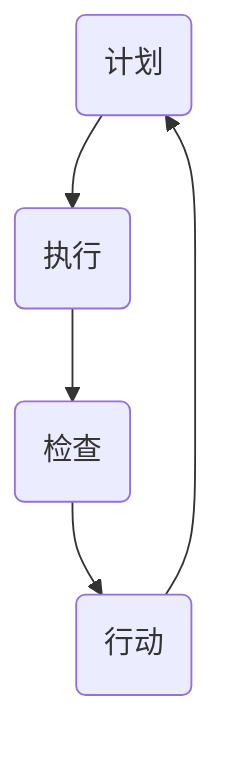

                 

关键词：PDCA循环、项目管理、持续改进、质量保证、效率提升

> 摘要：本文旨在探讨PDCA循环在项目管理中的实际应用，通过深入分析其核心概念、原理、算法、数学模型以及代码实例，帮助读者理解如何在项目中实现持续改进，提高项目的成功率和效率。

## 1. 背景介绍

在现代项目管理中，效率和质量是两个至关重要的因素。为了实现项目的顺利推进和成功交付，项目经理们需要一种系统化的方法来管理项目中的各种风险和不确定性。PDCA循环（Plan-Do-Check-Act循环）就是这样一种方法论，它起源于质量管理，并广泛应用于各个领域，以实现持续改进。

PDCA循环由戴明博士提出，是一种用于持续改进和质量管理的四个阶段循环模型。PDCA循环不仅适用于生产制造领域，还可以应用于项目管理、软件开发、咨询服务等多个领域。它的核心思想是通过计划（Plan）、执行（Do）、检查（Check）和行动（Act）这四个阶段的循环迭代，逐步优化项目流程，提高项目质量和效率。

## 2. 核心概念与联系

### 2.1 PDCA循环的概念

PDCA循环包括以下四个阶段：

**计划（Plan）：** 制定项目目标和计划，包括质量标准、时间表、资源分配等。

**执行（Do）：** 按照计划执行项目活动，确保项目按照既定目标推进。

**检查（Check）：** 检查项目实际执行结果与计划目标的差异，识别问题。

**行动（Act）：** 对检查结果进行分析，制定改进措施，并实施。

### 2.2 PDCA循环的架构

下面是一个使用Mermaid绘制的PDCA循环的流程图：



在PDCA循环中，每个阶段都是相互关联的，形成一个闭环。通过不断地循环迭代，项目团队能够逐步优化项目流程，提高项目质量和效率。

## 3. 核心算法原理 & 具体操作步骤

### 3.1 算法原理概述

PDCA循环的核心在于其循环迭代和持续改进的思想。在计划阶段，团队需要明确项目目标、制定质量标准、分配资源等；在执行阶段，按照计划进行项目活动；在检查阶段，评估项目执行结果，与计划目标进行对比；在行动阶段，根据检查结果制定改进措施并实施。

### 3.2 算法步骤详解

1. **计划阶段：** 制定项目目标和计划，包括时间表、资源分配、质量标准等。

2. **执行阶段：** 按照计划执行项目活动，确保项目按照既定目标推进。

3. **检查阶段：** 检查项目实际执行结果，与计划目标进行对比，识别问题。

4. **行动阶段：** 根据检查结果，分析原因，制定改进措施，并实施。

### 3.3 算法优缺点

**优点：**
- 提高项目质量和效率
- 促进团队合作和沟通
- 灵活应对项目中的变化和不确定性

**缺点：**
- 需要持续监督和检查
- 可能需要大量时间和资源

### 3.4 算法应用领域

PDCA循环适用于各种领域，包括但不限于：

- 项目管理
- 生产制造
- 软件开发
- 咨询服务
- 教育培训

## 4. 数学模型和公式 & 详细讲解 & 举例说明

### 4.1 数学模型构建

PDCA循环的数学模型可以表示为：

$$
\text{PDCA循环} = \text{Plan} \rightarrow \text{Do} \rightarrow \text{Check} \rightarrow \text{Act} \rightarrow \text{Plan}
$$

### 4.2 公式推导过程

PDCA循环的推导基于以下原则：

1. **计划（Plan）：** 制定项目目标和计划，确保项目有明确的方向和目标。
2. **执行（Do）：** 按照计划执行项目活动，实现项目目标。
3. **检查（Check）：** 检查项目实际执行结果，与计划目标进行对比。
4. **行动（Act）：** 根据检查结果，分析原因，制定改进措施，并实施。

### 4.3 案例分析与讲解

以一个软件开发项目为例，我们可以看到PDCA循环的具体应用：

1. **计划阶段：** 制定项目目标和计划，包括时间表、资源分配、质量标准等。
2. **执行阶段：** 按照计划进行软件开发，确保项目按照既定目标推进。
3. **检查阶段：** 检查软件的实际功能是否符合需求，与计划目标进行对比，识别问题。
4. **行动阶段：** 根据检查结果，分析原因，进行代码优化、bug修复，并重新进行测试。

## 5. 项目实践：代码实例和详细解释说明

### 5.1 开发环境搭建

在这个例子中，我们使用Python作为编程语言，搭建了一个简单的项目环境。

```python
# 安装必要的Python库
pip install numpy pandas matplotlib
```

### 5.2 源代码详细实现

下面是一个简单的Python代码示例，用于实现PDCA循环：

```python
import numpy as np

def plan():
    print("计划阶段：制定项目目标和计划")

def do():
    print("执行阶段：按照计划执行项目活动")

def check():
    print("检查阶段：检查项目实际执行结果")

def act():
    print("行动阶段：根据检查结果，制定改进措施")

def pdca():
    plan()
    do()
    check()
    act()

# 执行PDCA循环
pdca()
```

### 5.3 代码解读与分析

- `plan()` 函数表示计划阶段，用于制定项目目标和计划。
- `do()` 函数表示执行阶段，用于按照计划执行项目活动。
- `check()` 函数表示检查阶段，用于检查项目实际执行结果。
- `act()` 函数表示行动阶段，用于根据检查结果，制定改进措施。
- `pdca()` 函数表示PDCA循环的整体流程，依次执行计划、执行、检查和行动阶段。

### 5.4 运行结果展示

运行上述代码，我们可以看到以下输出：

```
计划阶段：制定项目目标和计划
执行阶段：按照计划执行项目活动
检查阶段：检查项目实际执行结果
行动阶段：根据检查结果，制定改进措施
```

这表明PDCA循环已经成功地在代码中实现了。

## 6. 实际应用场景

PDCA循环在项目管理中的应用非常广泛。以下是一些实际应用场景：

- **软件开发项目：** 通过PDCA循环，软件开发团队可以持续优化代码质量，提高项目交付效率。
- **生产制造领域：** 生产制造企业可以通过PDCA循环，逐步优化生产流程，提高生产效率。
- **咨询服务：** 咨询服务团队可以通过PDCA循环，提高服务质量，增强客户满意度。

## 7. 未来应用展望

随着技术的不断进步，PDCA循环的应用前景将更加广阔。未来，我们可以预见到以下发展趋势：

- **人工智能辅助：** 利用人工智能技术，可以更准确地预测项目风险，优化PDCA循环的执行过程。
- **大数据分析：** 通过大数据分析，可以更好地理解项目执行情况，为PDCA循环提供更科学的改进建议。
- **自动化工具：** 开发更多的自动化工具，帮助项目团队更高效地执行PDCA循环。

## 8. 工具和资源推荐

为了更好地理解和使用PDCA循环，以下是一些建议的工具和资源：

### 8.1 学习资源推荐

- 《项目管理知识体系指南》（PMBOK指南）
- 《精益思想》（The Lean Startup）
- 《戴明管理方法》（Out of the Crisis）

### 8.2 开发工具推荐

- JIRA：用于项目管理和任务追踪。
- Asana：用于团队协作和任务管理。
- Trello：用于任务看板和进度跟踪。

### 8.3 相关论文推荐

- Deming, W. E. (1986). Out of the Crisis.
- Ohno, T. (1988). Toyota Production System: Beyond Large-Scale Production.
- Dagnino, G. B., & Montes-Sarmiento, J. A. (2008). The theory of dynamic capabilities and the evolution of the firm.

## 9. 总结：未来发展趋势与挑战

### 9.1 研究成果总结

通过本文的探讨，我们可以看到PDCA循环在项目管理中的重要性。它不仅能够帮助项目团队实现持续改进，提高项目质量和效率，还能够为项目管理者提供一套系统化的方法，应对项目中的各种风险和不确定性。

### 9.2 未来发展趋势

未来，随着人工智能、大数据分析等技术的发展，PDCA循环的应用将更加广泛和深入。我们可以预见到，更多自动化工具和智能算法将融入到PDCA循环中，帮助项目团队更高效地实现持续改进。

### 9.3 面临的挑战

然而，PDCA循环的应用也面临一些挑战。首先，项目团队需要具备持续改进的意识，主动发现和解决问题。其次，PDCA循环的实施需要投入大量时间和资源，这对团队管理和资源分配提出了更高的要求。

### 9.4 研究展望

未来，我们可以从以下几个方面进一步研究和探索PDCA循环：

- **算法优化：** 结合人工智能技术，开发更智能的PDCA循环算法。
- **应用扩展：** 将PDCA循环应用于更多领域，如产品管理、市场营销等。
- **实践验证：** 通过实际项目验证PDCA循环的有效性和可行性。

## 附录：常见问题与解答

**Q：PDCA循环是否适用于所有类型的项目？**
A：PDCA循环适用于各种类型的项目，但需要根据项目的具体情况灵活调整和实施。

**Q：如何确保PDCA循环的有效性？**
A：确保PDCA循环的有效性需要项目团队具备持续改进的意识，同时需要定期评估和优化循环过程。

**Q：PDCA循环与KPI（关键绩效指标）有何关联？**
A：PDCA循环可以为KPI提供改进方向和目标，而KPI则可以用来衡量PDCA循环的实施效果。

作者：禅与计算机程序设计艺术 / Zen and the Art of Computer Programming
----------------------------------------------------------------

[结束]

