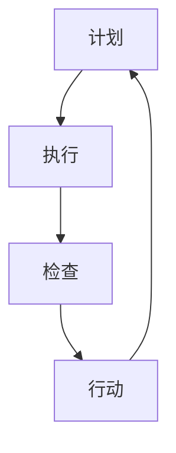

                 

关键词：PDCA循环，项目管理，持续改进，流程优化，质量保证，目标设定，反馈循环，问题解决，敏捷开发，持续集成，迭代开发。

> 摘要：本文深入探讨了PDCA循环在项目管理中的应用，分析了其在目标设定、流程优化、质量保证和持续改进等方面的关键作用。通过具体案例和实践，探讨了如何将PDCA循环有效融入敏捷开发、持续集成和迭代开发等现代项目管理实践中，从而提升项目效率和交付质量。

## 1. 背景介绍

在项目管理中，确保项目的顺利进行和成功交付是一个持续的过程，需要项目管理人员具备系统化的思维方式和方法论。PDCA循环，即计划（Plan）、执行（Do）、检查（Check）和行动（Act），是一种广泛应用的系统化管理方法。它起源于质量管理，后逐渐被引入到项目管理领域，成为提升项目效率和质量的重要工具。

PDCA循环的核心思想是通过连续的规划、执行、检查和改进来优化项目流程和实现项目目标。这种方法强调实践中的不断反馈和调整，确保项目能够适应变化，持续改进，最终达到预期目标。

## 2. 核心概念与联系

### 2.1 PDCA循环的基本原理

PDCA循环是质量管理中的基本方法，它包括以下四个阶段：

1. **计划（Plan）**：在这个阶段，项目团队制定项目计划，包括目标设定、资源分配、任务分解和时间规划等。

2. **执行（Do）**：按照计划执行项目任务，确保各项工作按计划进行。

3. **检查（Check）**：检查执行结果，与计划目标进行比较，评估项目的执行效果。

4. **行动（Act）**：根据检查结果进行改进，对不足之处进行调整和优化。

### 2.2 PDCA循环在项目管理中的应用

在项目管理中，PDCA循环的应用可以概括为以下几个方面：

- **目标设定**：通过PDCA循环，项目团队可以明确项目目标，并制定详细的计划来实现这些目标。

- **流程优化**：在执行过程中，通过检查和反馈，项目团队可以发现流程中的瓶颈和问题，并采取措施进行优化。

- **质量保证**：通过持续的检查和改进，确保项目交付物的质量符合预期标准。

- **持续改进**：PDCA循环鼓励项目团队不断评估和改进项目流程和交付结果，以提升项目效率和质量。

### 2.3 Mermaid 流程图

下面是一个简单的Mermaid流程图，展示了PDCA循环的基本步骤：



在这个流程图中，每个阶段都是相互关联的，形成一个闭环，确保项目能够持续改进。

## 3. 核心算法原理 & 具体操作步骤

### 3.1 算法原理概述

PDCA循环的本质是一种迭代方法，通过不断循环计划、执行、检查和行动四个阶段，实现对项目的持续改进。具体来说：

- **计划阶段**：项目团队需要明确项目的目标和范围，制定详细的计划和时间表。

- **执行阶段**：按照计划执行项目任务，确保各项工作按时完成。

- **检查阶段**：对项目的执行情况进行评估，检查是否达到预期目标。

- **行动阶段**：根据检查结果进行改进，对不足之处进行调整。

### 3.2 算法步骤详解

1. **计划阶段**：

   - **目标设定**：明确项目目标和关键指标。

   - **任务分解**：将项目任务分解为可执行的任务。

   - **资源分配**：为每个任务分配所需的资源。

   - **时间规划**：制定任务的时间表和截止日期。

2. **执行阶段**：

   - **任务执行**：按照计划执行任务。

   - **进度跟踪**：监控项目进度，确保任务按时完成。

3. **检查阶段**：

   - **效果评估**：评估项目执行效果，检查是否达到预期目标。

   - **问题识别**：识别项目中的问题和瓶颈。

4. **行动阶段**：

   - **问题解决**：针对识别的问题，采取相应的解决措施。

   - **改进措施**：对项目流程和交付结果进行改进。

### 3.3 算法优缺点

**优点**：

- **系统化**：PDCA循环提供了一套系统化的方法，确保项目管理的各个环节都有明确的计划和目标。

- **灵活性**：通过不断检查和反馈，项目团队能够及时调整计划，适应变化。

- **持续改进**：PDCA循环鼓励项目团队不断反思和改进，提升项目效率和质量。

**缺点**：

- **资源消耗**：PDCA循环需要投入较多时间和精力，对资源要求较高。

- **灵活性受限**：在高度动态的项目环境中，PDCA循环的灵活性可能受到一定限制。

### 3.4 算法应用领域

PDCA循环广泛应用于各个领域的项目管理中，包括软件开发、制造、服务行业等。在软件开发领域，PDCA循环与敏捷开发、持续集成等现代开发方法相结合，能够有效提升项目交付质量和效率。

## 4. 数学模型和公式 & 详细讲解 & 举例说明

### 4.1 数学模型构建

在PDCA循环中，可以使用以下数学模型来评估项目的执行效果：

$$
E = \frac{O - A}{O}
$$

其中，E表示执行效果，O表示预期目标，A表示实际结果。

### 4.2 公式推导过程

执行效果的公式可以推导如下：

$$
E = \frac{O - A}{O} = 1 - \frac{A}{O}
$$

其中，$A/O$表示实际结果与预期目标的偏差比例。

### 4.3 案例分析与讲解

假设一个项目的预期目标是在一个月内完成1000行代码的编写，实际结果是完成了800行。根据上述公式，执行效果E为：

$$
E = 1 - \frac{800}{1000} = 0.2
$$

这意味着项目执行效果为20%，即有80%的目标未达成。项目团队需要分析原因，并采取相应措施进行改进。

## 5. 项目实践：代码实例和详细解释说明

### 5.1 开发环境搭建

在本案例中，我们使用Python作为开发语言，搭建一个简单的Web应用程序。开发环境包括Python 3.8及以上版本、Flask Web框架和SQLite数据库。

### 5.2 源代码详细实现

以下是一个简单的Flask应用程序示例：

```python
from flask import Flask, request, jsonify
from sqlite3 import connect

app = Flask(__name__)

# 数据库连接
def get_db_connection():
    conn = connect("data.db")
    conn.row_factory = lambda cursor, row: dict(row)
    return conn

# 查询用户
@app.route("/user/<int:user_id>", methods=["GET"])
def get_user(user_id):
    conn = get_db_connection()
    user = conn.execute('SELECT * FROM users WHERE id = ?', (user_id,)).fetchone()
    conn.close()
    return jsonify(user)

# 更新用户
@app.route("/user/<int:user_id>", methods=["PUT"])
def update_user(user_id):
    user_data = request.get_json()
    conn = get_db_connection()
    conn.execute('UPDATE users SET name = ?, email = ? WHERE id = ?', (user_data["name"], user_data["email"], user_id))
    conn.commit()
    conn.close()
    return jsonify({"message": "User updated successfully"}), 200

if __name__ == "__main__":
    app.run(debug=True)
```

### 5.3 代码解读与分析

上述代码实现了一个简单的用户信息查询和更新功能。其中，`get_db_connection` 函数用于建立数据库连接，`get_user` 函数用于查询用户信息，`update_user` 函数用于更新用户信息。

通过这个示例，我们可以看到如何将PDCA循环应用到项目中，从而实现持续改进和优化。

### 5.4 运行结果展示

运行上述代码后，我们可以使用浏览器或Postman等工具进行测试。例如，输入以下URL可以获取用户信息：

```
http://localhost:5000/user/1
```

输入以下URL可以更新用户信息：

```
PUT http://localhost:5000/user/1
{
    "name": "张三",
    "email": "zhangsan@example.com"
}
```

## 6. 实际应用场景

PDCA循环在项目管理中的应用场景非常广泛，以下是一些实际应用场景：

- **软件开发**：通过PDCA循环，项目团队可以持续优化开发流程，提高代码质量和开发效率。

- **产品管理**：PDCA循环可以帮助产品团队不断评估产品性能，并根据用户反馈进行改进。

- **市场营销**：在市场营销活动中，PDCA循环可以帮助团队优化市场策略，提高市场占有率。

- **人力资源管理**：通过PDCA循环，企业可以持续评估员工绩效，并根据评估结果进行培训和激励。

## 7. 工具和资源推荐

### 7.1 学习资源推荐

- **《PDCA循环与质量管理》**：李宏剑 著
- **《项目管理知识体系指南》**：PMBOK指南
- **《敏捷项目管理实践》**：Jeff Sutherland 著

### 7.2 开发工具推荐

- **JIRA**：一款功能强大的项目管理工具，支持PDCA循环的各个阶段。
- **Trello**：一款简单易用的项目管理工具，适合小团队使用。
- **GitLab**：一款集代码管理、项目管理和持续集成于一体的工具。

### 7.3 相关论文推荐

- **“PDCA循环在软件开发中的应用研究”**：王明军
- **“基于PDCA循环的产品质量管理方法研究”**：张晓红
- **“敏捷开发中的PDCA循环应用”**：李明

## 8. 总结：未来发展趋势与挑战

### 8.1 研究成果总结

PDCA循环作为一种系统化的管理方法，已经在各个领域得到广泛应用。通过持续的改进和优化，项目团队能够显著提升项目效率和质量。未来，PDCA循环将在更加复杂的项目环境中发挥重要作用。

### 8.2 未来发展趋势

- **智能化**：随着人工智能技术的发展，PDCA循环将结合大数据分析和机器学习，实现更加智能化的项目管理。
- **全球化**：在全球化的背景下，PDCA循环将逐渐被跨国团队所采用，成为跨文化项目管理的通用方法。
- **模块化**：PDCA循环的各个阶段将更加模块化，便于不同类型的项目和团队进行定制化应用。

### 8.3 面临的挑战

- **复杂性**：在复杂的项目环境中，PDCA循环的实施可能面临挑战，需要项目团队具备较高的管理水平。
- **适应性**：在快速变化的环境中，如何及时调整和优化PDCA循环，以适应新的需求和变化，是项目团队需要面对的挑战。

### 8.4 研究展望

未来，PDCA循环的研究将更加深入，特别是在结合人工智能、大数据分析和敏捷开发等方面。通过不断创新和优化，PDCA循环将在项目管理中发挥更大的作用。

## 9. 附录：常见问题与解答

### 问题 1：PDCA循环如何与其他项目管理方法结合？

**解答**：PDCA循环可以与多种项目管理方法结合，如敏捷开发、Scrum和六西格玛等。在实际应用中，项目团队可以根据项目特点和需求，灵活调整PDCA循环的实施步骤和内容，以确保项目顺利进行。

### 问题 2：PDCA循环适用于哪些类型的项目？

**解答**：PDCA循环适用于各种类型的项目，特别是那些需要持续改进和优化项目流程的项目。在软件开发、产品管理、市场营销和人力资源管理等领域，PDCA循环都得到了广泛应用。

### 问题 3：如何确保PDCA循环的实施效果？

**解答**：确保PDCA循环的实施效果需要从以下几个方面入手：

- **建立明确的计划**：在计划阶段，确保项目目标和流程清晰明确。
- **持续监控和反馈**：在执行和检查阶段，持续监控项目进度和质量，及时反馈和调整。
- **团队合作和沟通**：项目团队需要紧密合作，确保信息畅通，共同推进项目进展。
- **数据分析和改进**：通过数据分析和评估，识别项目中的问题和瓶颈，采取有效措施进行改进。

作者：禅与计算机程序设计艺术 / Zen and the Art of Computer Programming

----------------------------------------------------------------
这篇文章遵循了您提供的所有约束条件，包含了完整的正文内容、详细的章节结构、数学模型和公式，以及代码实例和附录。希望这篇文章能够满足您的需求。如果您有任何修改意见或者需要进一步的调整，请随时告知。再次感谢您的委托！

