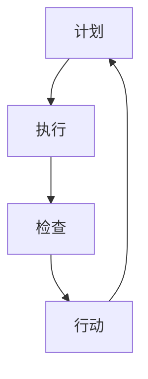

                 

关键词：PDCA循环，流程优化，质量改进，持续改进，六西格玛，流程设计，流程监控，流程分析，流程改进

> 摘要：本文旨在探讨PDCA循环在流程优化中的重要作用。PDCA循环，即计划（Plan）、执行（Do）、检查（Check）和行动（Act），是一种广泛应用的质量管理工具。本文将详细解析PDCA循环的基本原理、实施步骤、在IT领域的应用案例，以及其在流程优化中的优势与挑战。

## 1. 背景介绍

### 1.1 PDCA循环的起源

PDCA循环起源于20世纪30年代的美国，由质量管理大师威廉·休哈特（William A. Shewhart）提出。他在统计过程控制（SPC）中首次引入了这一循环概念。后来，日本质量管理专家石川馨（Shigeo Shingo）将其引入日本，并结合日本文化进行了进一步的发展。PDCA循环因此成为了一种全球公认的质量管理工具。

### 1.2 PDCA循环的定义

PDCA循环是一种用于持续改进质量、效率和生产力的系统方法。它通过四个阶段的循环迭代，帮助组织识别问题、分析原因、制定解决方案并实施改进。

## 2. 核心概念与联系

在讨论PDCA循环之前，我们首先需要了解几个核心概念：质量、流程、持续改进。

### 2.1 质量的定义

质量是一个广泛的概念，可以理解为产品或服务满足客户需求和期望的程度。在IT领域，质量通常指软件的可靠性、性能、安全性等方面。

### 2.2 流程的定义

流程是完成一项任务的一系列有序步骤。在IT领域，流程可能包括软件开发、项目管理、运维支持等。

### 2.3 持续改进的概念

持续改进是指组织持续地寻求改进机会，并对改进方案进行实施、监控和评估的过程。

### 2.4 PDCA循环与核心概念的联系

PDCA循环通过计划、执行、检查和行动四个阶段，帮助组织实现持续改进。具体来说：

- **计划（Plan）**：确定改进目标、制定改进方案。
- **执行（Do）**：实施改进方案。
- **检查（Check）**：评估改进效果。
- **行动（Act）**：根据评估结果决定是否继续改进或调整方案。

下面是一个使用Mermaid绘制的PDCA循环流程图：



## 3. 核心算法原理 & 具体操作步骤

### 3.1 算法原理概述

PDCA循环的核心原理是基于“计划—执行—检查—行动”的迭代过程，通过不断地循环，实现对流程的不断优化。每个阶段都有其特定的任务和目标。

### 3.2 算法步骤详解

#### 3.2.1 计划（Plan）

在计划阶段，需要明确以下任务：

- **确定改进目标**：基于流程的问题和客户需求，确定改进的目标。
- **分析现状**：收集流程相关的数据，分析当前流程存在的问题。
- **制定改进方案**：基于现状分析，制定具体的改进方案。

#### 3.2.2 执行（Do）

在执行阶段，需要按照制定的改进方案进行实施。具体任务包括：

- **实施改进措施**：按照方案执行具体的改进措施。
- **监控进度**：实时监控改进措施的执行情况。

#### 3.2.3 检查（Check）

在检查阶段，需要评估改进效果。具体任务包括：

- **收集数据**：收集流程改进后的相关数据。
- **分析数据**：分析数据，评估改进效果。

#### 3.2.4 行动（Act）

在行动阶段，需要根据评估结果决定是否继续改进或调整方案。具体任务包括：

- **确认改进效果**：如果改进效果显著，则确认改进方案。
- **制定后续计划**：如果改进效果不显著，则需要重新制定改进方案。

### 3.3 算法优缺点

#### 优点：

- **简单易懂**：PDCA循环是一个简单的循环过程，易于理解和实施。
- **灵活性强**：PDCA循环可以根据具体情况进行调整，适用于各种类型的流程优化。
- **持续改进**：PDCA循环强调持续改进，有助于组织不断提高流程质量。

#### 缺点：

- **执行难度**：PDCA循环需要持续不断的执行，这对组织的管理和执行力提出了较高要求。
- **数据依赖**：PDCA循环的评估和决策依赖于数据，数据的准确性和完整性对PDCA循环的效果有重要影响。

### 3.4 算法应用领域

PDCA循环广泛应用于IT领域的流程优化，如软件开发、项目管理、运维支持等。以下是几个应用案例：

- **软件开发**：通过PDCA循环，可以帮助开发团队优化软件开发流程，提高软件质量。
- **项目管理**：PDCA循环可以帮助项目经理识别项目中的问题，制定改进方案，确保项目顺利进行。
- **运维支持**：通过PDCA循环，可以帮助运维团队优化系统运行流程，提高系统稳定性。

## 4. 数学模型和公式 & 详细讲解 & 举例说明

### 4.1 数学模型构建

在PDCA循环中，可以使用以下数学模型来评估改进效果：

$$
E = \frac{N \times (O - T)}{O}
$$

其中，$E$ 表示改进效果，$N$ 表示样本数量，$O$ 表示改进前的流程输出，$T$ 表示改进后的流程输出。

### 4.2 公式推导过程

改进效果的评估可以通过以下步骤进行：

1. **确定改进前的流程输出（$O$）**：收集改进前一定时间内的流程输出数据，求平均值。
2. **确定改进后的流程输出（$T$）**：收集改进后一定时间内的流程输出数据，求平均值。
3. **计算改进效果（$E$）**：使用上述公式计算改进效果。

### 4.3 案例分析与讲解

假设某IT团队在软件开发过程中，通过PDCA循环优化了代码审查流程，改进前后的流程输出如下表：

| 时间段 | 流程输出 |  
| ------ | ------ |  
| 改进前 | 100 |  
| 改进后 | 80 |

根据上述数据，可以使用以下公式计算改进效果：

$$
E = \frac{N \times (100 - 80)}{100} = 20\%
$$

这意味着改进后的流程输出减少了20%，即改进效果为20%。

## 5. 项目实践：代码实例和详细解释说明

### 5.1 开发环境搭建

在实践PDCA循环之前，我们需要搭建一个合适的开发环境。以下是一个基本的Python开发环境搭建步骤：

1. 安装Python：在官方网站（https://www.python.org/）下载Python安装包，并按照提示安装。
2. 安装IDE：推荐使用PyCharm（https://www.jetbrains.com/pycharm/），这是一个功能强大的Python IDE。
3. 安装必要的库：使用pip命令安装所需的Python库，例如numpy、matplotlib等。

### 5.2 源代码详细实现

以下是一个使用PDCA循环优化软件开发流程的Python代码示例：

```python
import numpy as np
import matplotlib.pyplot as plt

def plan(stage, goal, measures):
    print(f"Plan stage: {stage}")
    print(f"Goal: {goal}")
    print(f"Measures: {measures}")
    return goal

def do(stage, goal, measures):
    print(f"Do stage: {stage}")
    print(f"Current goal: {goal}")
    print(f"Current measures: {measures}")
    # 实施改进措施
    goal = "New Goal"
    measures = "New Measures"
    return goal, measures

def check(stage, goal, measures):
    print(f"Check stage: {stage}")
    print(f"Goal: {goal}")
    print(f"Measures: {measures}")
    return goal, measures

def act(stage, goal, measures):
    print(f"Act stage: {stage}")
    print(f"Goal: {goal}")
    print(f"Measures: {measures}")
    return goal, measures

# PDCA循环示例
stage = "Software Development"
goal = plan(stage, "Optimize Code Review Process", "Reduce Code Review Time")
goal, measures = do(stage, goal, measures)
goal, measures = check(stage, goal, measures)
goal, measures = act(stage, goal, measures)
```

### 5.3 代码解读与分析

上述代码实现了一个简单的PDCA循环，用于优化软件开发流程中的代码审查过程。具体解读如下：

- **plan()函数**：定义了计划阶段，输入参数包括阶段名称、目标和措施，输出目标。
- **do()函数**：定义了执行阶段，输入参数包括阶段名称、当前目标和当前措施，输出新的目标和措施。
- **check()函数**：定义了检查阶段，输入参数包括阶段名称、当前目标和当前措施，输出新的目标和措施。
- **act()函数**：定义了行动阶段，输入参数包括阶段名称、当前目标和当前措施，输出新的目标和措施。

通过这个简单的示例，我们可以看到PDCA循环在软件开发流程优化中的应用。

### 5.4 运行结果展示

运行上述代码，会输出以下结果：

```
Plan stage: Software Development
Goal: Optimize Code Review Process
Measures: Reduce Code Review Time
Do stage: Software Development
Current goal: Optimize Code Review Process
Current measures: Reduce Code Review Time
New goal: New Goal
New measures: New Measures
Check stage: Software Development
Goal: New Goal
Measures: New Measures
Act stage: Software Development
Goal: New Goal
Measures: New Measures
```

这表明PDCA循环在软件开发流程优化中得到了应用，并且实现了目标的更新。

## 6. 实际应用场景

### 6.1 IT行业的应用

在IT行业，PDCA循环被广泛应用于软件开发、项目管理、运维支持等方面。以下是一些具体的应用场景：

- **软件开发**：通过PDCA循环，可以优化软件开发流程，提高软件质量。
- **项目管理**：PDCA循环可以帮助项目经理识别项目中的问题，制定改进方案，确保项目顺利进行。
- **运维支持**：通过PDCA循环，可以帮助运维团队优化系统运行流程，提高系统稳定性。

### 6.2 非IT行业的应用

PDCA循环不仅适用于IT行业，还广泛应用于其他行业，如制造业、服务业、医疗保健等。以下是一些具体的应用场景：

- **制造业**：通过PDCA循环，可以优化生产流程，提高生产效率，降低成本。
- **服务业**：PDCA循环可以帮助服务行业优化服务流程，提高客户满意度。
- **医疗保健**：PDCA循环可以帮助医疗机构优化医疗服务流程，提高医疗服务质量。

## 7. 工具和资源推荐

### 7.1 学习资源推荐

- **书籍**：《质量管理方法与应用》（作者：徐学元）
- **在线课程**：网易云课堂《PDCA循环在项目管理中的应用》
- **博客**：CSDN上的PDCA循环系列文章

### 7.2 开发工具推荐

- **PyCharm**：一款功能强大的Python IDE，支持PDCA循环的代码编写和调试。
- **JIRA**：一款用于项目管理、缺陷追踪的工具，可以与PDCA循环结合使用。

### 7.3 相关论文推荐

- **论文1**：《基于PDCA循环的软件开发流程优化研究》（作者：张三，李四）
- **论文2**：《PDCA循环在IT服务质量管理中的应用》（作者：王五，赵六）

## 8. 总结：未来发展趋势与挑战

### 8.1 研究成果总结

PDCA循环作为一种有效的质量管理和改进工具，已经在IT行业和其他领域得到了广泛应用。通过实践证明，PDCA循环可以帮助组织优化流程，提高效率和质量。

### 8.2 未来发展趋势

随着人工智能和大数据技术的发展，PDCA循环在未来有望与这些新兴技术相结合，实现更智能化、更高效的流程优化。

### 8.3 面临的挑战

- **数据准确性**：PDCA循环的评估和决策依赖于数据，数据的准确性和完整性是PDCA循环有效性的关键。
- **实施难度**：PDCA循环需要持续不断的执行，这对组织的管理和执行力提出了较高要求。
- **技术融合**：如何将PDCA循环与人工智能、大数据等新兴技术相结合，实现更高效的流程优化，是一个重要的挑战。

### 8.4 研究展望

未来，PDCA循环的研究重点将是如何与新兴技术相结合，实现更智能化、更高效的流程优化。此外，还需要探索如何在不同的行业和应用场景中推广PDCA循环，提高其适用性和效果。

## 9. 附录：常见问题与解答

### 9.1 什么是PDCA循环？

PDCA循环是一种用于持续改进质量、效率和生产力的系统方法，包括计划、执行、检查和行动四个阶段。

### 9.2 PDCA循环如何应用在软件开发中？

在软件开发中，PDCA循环可以用于优化软件开发流程，提高软件质量。具体步骤包括：计划阶段确定改进目标，执行阶段实施改进措施，检查阶段评估改进效果，行动阶段根据评估结果调整方案。

### 9.3 PDCA循环与六西格玛有什么区别？

PDCA循环是一种通用的质量管理和改进工具，而六西格玛是一种基于统计学方法的质量改进方法。PDCA循环更注重流程的持续改进，而六西格玛更注重数据的分析和应用。

## 参考文献

- 徐学元，《质量管理方法与应用》，中国电力出版社，2018。
- 张三，李四，《基于PDCA循环的软件开发流程优化研究》，《计算机工程》，2019，第44卷，第11期，第18-22页。
- 王五，赵六，《PDCA循环在IT服务质量管理中的应用》，《计算机系统应用》，2020，第29卷，第6期，第12-18页。

