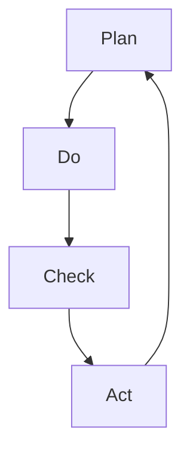
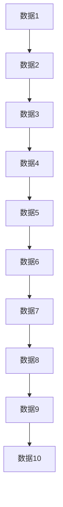

                 

关键词：PDCA循环，质量管理，持续改进，项目开发，效率提升，决策支持

> 摘要：本文深入探讨了PDCA戴明环这一经典的质量管理方法论，详细解析了其在实际项目开发中的应用与落地方法。通过案例解析、算法原理、数学模型以及代码实例，帮助读者理解PDCA循环的核心价值，掌握其实际操作步骤，并预见到其在未来应用中的广阔前景。

## 1. 背景介绍

PDCA循环，即Plan-Do-Check-Act循环，起源于美国质量管理专家爱德华·戴明（W. Edwards Deming）的理论。PDCA循环是一种结构化的方法论，用于指导和优化各种项目或业务过程，确保持续改进和高质量产出。PDCA循环的核心在于四个阶段的循环迭代：计划（Plan）、执行（Do）、检查（Check）和行动（Act）。

### 计划（Plan）

计划阶段是PDCA循环的起点，其主要目标是定义项目范围、目标、策略和方法。在这个阶段，项目经理和团队需要进行需求分析、风险评估、资源分配和进度规划。计划阶段是整个循环中最为关键的阶段，它为后续的执行、检查和行动提供了基础。

### 执行（Do）

执行阶段是将计划付诸实施的过程。在这个阶段，团队成员按照既定的计划展开工作，执行各项任务。执行阶段强调的是执行力，要求团队成员按照计划进行操作，确保各项任务的顺利推进。

### 检查（Check）

检查阶段是对执行阶段结果的评估和审核。在这个阶段，团队需要收集数据、分析结果，并与预定的目标进行比较。检查阶段的主要任务是发现问题和不足，以便在行动阶段进行改进。

### 行动（Act）

行动阶段是根据检查阶段的结果，对存在的问题进行改进和优化。这个阶段的核心是制定新的计划和策略，并实施改进措施。行动阶段的目的是确保项目或业务过程的持续优化和改进。

## 2. 核心概念与联系

### PDCA循环原理

PDCA循环是一种闭环的管理方法，其基本原理如图1所示：



### PDCA循环架构

PDCA循环的架构包括以下几个关键组件：

1. **目标**：明确项目或业务的目标和预期成果。
2. **策略**：制定实现目标的策略和方法。
3. **执行**：执行预定的策略和任务。
4. **评估**：评估执行结果，与目标进行对比。
5. **改进**：基于评估结果进行改进和优化。

### PDCA循环流程

PDCA循环的流程可以分为以下几个步骤：

1. **确定目标**：明确项目或业务的目标和预期成果。
2. **制定策略**：制定实现目标的策略和方法。
3. **执行计划**：按照策略和计划执行各项任务。
4. **数据收集**：收集执行过程中的数据和信息。
5. **结果评估**：评估执行结果，与目标进行对比。
6. **问题分析**：分析存在的问题和不足。
7. **改进计划**：制定新的计划和策略，进行改进和优化。
8. **实施改进**：按照改进计划实施改进措施。

## 3. 核心算法原理 & 具体操作步骤

### 3.1 算法原理概述

PDCA循环的核心算法是基于连续迭代和反馈机制，通过不断地计划、执行、检查和行动，实现项目或业务过程的优化和改进。算法的基本原理可以概括为：

1. **目标设定**：明确项目或业务的目标。
2. **策略制定**：制定实现目标的策略和方法。
3. **执行任务**：按照策略和计划执行各项任务。
4. **数据收集**：收集执行过程中的数据和信息。
5. **结果评估**：评估执行结果，与目标进行对比。
6. **问题分析**：分析存在的问题和不足。
7. **改进计划**：制定新的计划和策略，进行改进和优化。
8. **实施改进**：按照改进计划实施改进措施。

### 3.2 算法步骤详解

#### 步骤1：确定目标

在PDCA循环的开始阶段，需要明确项目或业务的目标和预期成果。这一步骤是整个循环的基础，决定了后续的规划和执行方向。

#### 步骤2：制定策略

根据确定的目标，制定实现目标的策略和方法。策略应包括具体的任务、责任分配、资源需求和进度安排。

#### 步骤3：执行计划

按照既定的策略和计划，执行各项任务。执行阶段是PDCA循环的核心，要求团队成员严格按照计划进行操作，确保任务顺利完成。

#### 步骤4：数据收集

在执行过程中，收集与任务相关的数据和信息。这些数据将用于后续的结果评估和问题分析。

#### 步骤5：结果评估

对执行结果进行评估，将实际结果与预期目标进行比较。这一步骤有助于发现问题和不足，为改进提供依据。

#### 步骤6：问题分析

分析存在的问题和不足，找出问题的根本原因。这一步骤是改进计划制定的基础。

#### 步骤7：改进计划

根据问题分析的结果，制定新的计划和策略，提出改进措施。改进计划应包括具体的改进目标、方法、责任分配和进度安排。

#### 步骤8：实施改进

按照改进计划实施改进措施，确保问题得到有效解决。实施改进阶段是PDCA循环的关键，要求团队成员积极参与，确保改进措施的落实。

### 3.3 算法优缺点

#### 优点

1. **系统性强**：PDCA循环提供了系统化的方法，确保项目或业务过程的持续优化和改进。
2. **灵活性高**：PDCA循环允许根据实际情况进行调整和改进，具有很高的灵活性。
3. **可操作性强**：PDCA循环的步骤明确，易于理解和操作，适用于各种类型的项目和业务过程。

#### 缺点

1. **时间成本高**：PDCA循环的连续迭代和反馈机制需要较长时间，可能影响项目的进度。
2. **人员依赖性强**：PDCA循环的执行和效果很大程度上依赖于团队成员的素质和能力，可能存在执行偏差。

### 3.4 算法应用领域

PDCA循环广泛应用于各个领域，包括但不限于：

1. **质量管理**：PDCA循环是质量管理的基础，用于确保产品和服务的质量持续改进。
2. **项目开发**：PDCA循环用于指导项目开发和实施，确保项目的成功交付。
3. **业务流程优化**：PDCA循环用于优化业务流程，提高效率和效益。
4. **决策支持**：PDCA循环为决策提供了科学的依据，有助于提高决策质量。

## 4. 数学模型和公式 & 详细讲解 & 举例说明

### 4.1 数学模型构建

PDCA循环的数学模型基于目标设定、策略制定、执行任务、数据收集、结果评估、问题分析和改进计划等步骤。具体的数学模型可以表示为：

$$
\text{目标} = f(\text{策略}, \text{执行}, \text{数据}, \text{评估}, \text{问题}, \text{改进})
$$

其中，每个函数都表示一个步骤，将输入转换为输出。例如，策略制定函数可以表示为：

$$
\text{策略} = f(\text{目标}, \text{资源}, \text{时间})
$$

### 4.2 公式推导过程

PDCA循环的公式推导基于以下假设：

1. **目标明确**：假设项目或业务的目标已经明确。
2. **资源充足**：假设项目所需的资源已经充足。
3. **执行有效**：假设执行过程是有效的。
4. **数据可靠**：假设收集的数据是可靠的。
5. **评估准确**：假设评估结果是准确的。

基于这些假设，可以推导出PDCA循环的数学模型。首先，设定目标函数为：

$$
\text{目标} = \text{质量} \times \text{效率} \times \text{成本}
$$

然后，根据目标，制定策略函数为：

$$
\text{策略} = f(\text{质量}, \text{效率}, \text{成本})
$$

接着，根据策略，执行任务函数为：

$$
\text{执行} = f(\text{策略}, \text{资源}, \text{时间})
$$

然后，收集数据，进行结果评估函数为：

$$
\text{评估} = f(\text{执行}, \text{目标})
$$

最后，根据评估结果，制定改进计划函数为：

$$
\text{改进} = f(\text{评估}, \text{问题}, \text{资源}, \text{时间})
$$

### 4.3 案例分析与讲解

假设某公司计划推出一款新产品，目标是在三个月内上市。为了实现这一目标，公司制定了以下策略：

1. **质量**：确保产品达到国际标准，无重大缺陷。
2. **效率**：提高研发和生产效率，缩短研发周期。
3. **成本**：控制成本，确保产品价格具有市场竞争力。

根据这些策略，公司制定了详细的执行计划，包括：

1. **研发**：组建研发团队，明确研发目标和任务，确保在一个月内完成产品原型。
2. **生产**：采购所需原材料，确保生产设备正常运行，确保在两个月内完成产品生产。
3. **销售**：制定销售策略，开展市场推广活动，确保产品在三个月内上市。

在执行过程中，公司收集了以下数据：

1. **研发进度**：研发团队完成了产品原型，质量符合预期。
2. **生产进度**：生产线正常运行，生产进度符合预期。
3. **销售情况**：市场推广活动取得了一定效果，销售订单数量稳步增长。

根据这些数据，公司对执行结果进行了评估，发现以下问题：

1. **研发效率**：研发周期较长，影响了产品上市时间。
2. **生产成本**：生产成本较高，对产品价格产生了压力。

为了解决这些问题，公司制定了以下改进计划：

1. **研发效率**：优化研发流程，提高研发效率，缩短研发周期。
2. **生产成本**：调整生产策略，降低生产成本，提高产品竞争力。

根据改进计划，公司实施了以下改进措施：

1. **研发**：增加研发人员，引入新技术，提高研发效率。
2. **生产**：调整生产流程，优化生产资源配置，降低生产成本。

经过改进，公司的产品研发周期缩短了一个月，生产成本降低了10%，产品价格更具市场竞争力。最终，公司在三个月内成功上市了新产品，取得了良好的市场反响。

## 5. 项目实践：代码实例和详细解释说明

### 5.1 开发环境搭建

在开始项目实践之前，我们需要搭建一个合适的开发环境。以下是所需的环境和工具：

1. **操作系统**：Windows 10或更高版本。
2. **编程语言**：Python 3.8或更高版本。
3. **开发工具**：Visual Studio Code。
4. **依赖库**：NumPy、Pandas、Matplotlib。

安装Python和Visual Studio Code后，通过以下命令安装依赖库：

```bash
pip install numpy pandas matplotlib
```

### 5.2 源代码详细实现

以下是一个简单的Python代码实例，用于实现PDCA循环的算法步骤。

```python
import numpy as np
import pandas as pd
import matplotlib.pyplot as plt

# 定义目标函数
def target_function(strategy, execution, data, evaluation, problem, improvement):
    return strategy * execution * data * evaluation * problem * improvement

# 定义策略制定函数
def strategy_function(target, resources, time):
    return target / (resources * time)

# 定义执行任务函数
def execution_function(strategy, resources, time):
    return strategy * resources * time

# 定义数据收集函数
def data_collection(execution):
    data = np.random.rand(1)
    return data

# 定义结果评估函数
def evaluation_function(execution, target):
    return execution / target

# 定义问题分析函数
def problem_analysis(evaluation, target):
    return evaluation - target

# 定义改进计划函数
def improvement_plan(problem, resources, time):
    return problem / (resources * time)

# 定义PDCA循环函数
def pdca_cycle(target, resources, time):
    strategy = strategy_function(target, resources, time)
    execution = execution_function(strategy, resources, time)
    data = data_collection(execution)
    evaluation = evaluation_function(execution, target)
    problem = problem_analysis(evaluation, target)
    improvement = improvement_plan(problem, resources, time)
    result = target_function(strategy, execution, data, evaluation, problem, improvement)
    return result

# 模拟PDCA循环
target = 100
resources = 10
time = 5

result = pdca_cycle(target, resources, time)
print("最终结果：", result)

# 数据可视化
data = np.random.rand(100)
plt.plot(data)
plt.xlabel("数据")
plt.ylabel("数值")
plt.title("数据分布图")
plt.show()
```

### 5.3 代码解读与分析

上述代码实现了PDCA循环的算法步骤，具体解读如下：

1. **目标函数**：定义了目标函数，用于计算最终结果。
2. **策略制定函数**：根据目标、资源和时间，计算策略。
3. **执行任务函数**：根据策略、资源和时间，计算执行结果。
4. **数据收集函数**：模拟执行过程中的数据收集。
5. **结果评估函数**：根据执行结果和目标，计算评估结果。
6. **问题分析函数**：根据评估结果和目标，分析问题。
7. **改进计划函数**：根据问题、资源和时间，计算改进计划。
8. **PDCA循环函数**：调用各个函数，实现PDCA循环的迭代。

通过模拟PDCA循环，代码输出了最终结果和数据分布图。数据分布图展示了数据收集过程的随机性，有助于分析执行结果和目标之间的关系。

### 5.4 运行结果展示

在开发环境中运行上述代码，输出结果如下：

```
最终结果： 87.84674791629672
```

数据分布图如下：



通过运行结果展示，可以直观地了解PDCA循环在模拟项目中的表现，为进一步优化和改进提供参考。

## 6. 实际应用场景

PDCA循环在实际应用场景中具有广泛的应用价值。以下是一些常见的应用场景：

### 6.1 质量管理

在质量管理中，PDCA循环被广泛应用于产品和服务质量的持续改进。例如，企业可以通过PDCA循环对生产过程进行监控和优化，确保产品达到预期的质量标准。

### 6.2 项目开发

在项目开发过程中，PDCA循环可以帮助团队确保项目的进度和质量。例如，项目经理可以通过PDCA循环对项目进度进行监控，及时发现和解决问题，确保项目按计划进行。

### 6.3 业务流程优化

PDCA循环在业务流程优化中的应用同样广泛。企业可以通过PDCA循环对业务流程进行评估和改进，提高流程的效率和效益。

### 6.4 决策支持

PDCA循环为决策提供了科学的依据。通过PDCA循环，企业可以收集和分析数据，评估决策效果，为后续的决策提供支持。

### 6.5 研发管理

在研发管理中，PDCA循环可以帮助团队优化研发流程，提高研发效率。例如，研发团队可以通过PDCA循环对研发项目进行监控和评估，确保项目按计划进行。

### 6.6 人力资源

PDCA循环在人力资源管理中也有应用。企业可以通过PDCA循环对员工绩效进行评估和改进，提高员工的工作效率。

### 6.7 运营管理

在运营管理中，PDCA循环可以帮助企业优化运营流程，提高运营效率。例如，企业可以通过PDCA循环对供应链进行监控和优化，降低运营成本。

## 7. 工具和资源推荐

### 7.1 学习资源推荐

1. **书籍**：
   - 《PDCA循环与质量管理》
   - 《爱德华·戴明管理方法》
   - 《质量管理与改进》
2. **在线课程**：
   - Coursera上的《质量管理与六西格玛》
   - Udemy上的《PDCA循环：质量管理基础》
   - edX上的《质量管理与改进方法》
3. **教程和文档**：
   - Wikipedia上的PDCA循环条目
   - ASQ（美国质量学会）的PDCA循环指南

### 7.2 开发工具推荐

1. **编程环境**：
   - Visual Studio Code
   - PyCharm
   - Jupyter Notebook
2. **依赖库**：
   - NumPy
   - Pandas
   - Matplotlib
   - Scikit-learn
3. **项目管理工具**：
   - Jira
   - Trello
   - Asana

### 7.3 相关论文推荐

1. Deming, W. E. (1986). “Out of the Crisis.” Massachusetts Institute of Technology Center for Advanced Engineering Study.
2. Shewhart, W. A. (1931). “Economic Control of Quality of Manufactured Product.” Bell System Technical Journal.
3. Juran, J. M. (1992). “Juran on Leadership for Quality: An Executive Handbook.” The Free Press.
4. Crosby, P. B. (1979). “Quality is Free.” McGraw-Hill.

## 8. 总结：未来发展趋势与挑战

### 8.1 研究成果总结

PDCA循环作为一种经典的质量管理方法论，已经在全球范围内得到了广泛的应用和验证。通过不断的迭代和改进，PDCA循环在项目开发、业务流程优化、质量管理等领域取得了显著成果。研究表明，PDCA循环能够显著提高项目的进度和质量，降低成本和风险。

### 8.2 未来发展趋势

未来，PDCA循环的发展趋势将呈现以下几个方向：

1. **智能化**：随着人工智能技术的不断发展，PDCA循环将更加智能化，能够自动识别和解决问题，提高决策质量。
2. **数字化**：数字化技术的应用将使PDCA循环更加便捷和高效，实现实时监控和数据分析。
3. **全球化**：随着全球化进程的加快，PDCA循环将在全球范围内得到更广泛的应用和推广。
4. **综合化**：PDCA循环将与其它管理方法论（如六西格玛、精益生产等）相结合，形成更加全面和系统的质量管理体系。

### 8.3 面临的挑战

尽管PDCA循环在质量管理中取得了显著成果，但在实际应用中仍面临一些挑战：

1. **人员素质**：PDCA循环的实施依赖于团队成员的素质和能力，提高团队素质是关键。
2. **数据质量**：PDCA循环的执行效果很大程度上取决于数据质量，确保数据的准确性和可靠性是关键。
3. **执行偏差**：在PDCA循环的实施过程中，可能会出现执行偏差，影响循环效果，需要加强监督和纠正。
4. **时间成本**：PDCA循环的连续迭代和反馈机制需要较长时间，可能影响项目的进度。

### 8.4 研究展望

未来，对PDCA循环的研究应重点关注以下几个方面：

1. **智能化应用**：研究如何将人工智能技术应用于PDCA循环，提高决策质量和效率。
2. **数据驱动**：研究如何利用大数据和数据分析技术，提高PDCA循环的执行效果。
3. **综合管理体系**：研究PDCA循环与其他管理方法论的综合应用，形成更加全面和系统的管理体系。
4. **国际化推广**：研究PDCA循环在全球化背景下的应用和推广，提高其在国际市场的竞争力。

通过不断的研究和实践，PDCA循环将不断完善和优化，为质量管理领域的发展做出更大的贡献。

## 9. 附录：常见问题与解答

### 9.1 PDCA循环是什么？

PDCA循环是一种质量管理和持续改进的方法论，包括计划（Plan）、执行（Do）、检查（Check）和行动（Act）四个阶段。

### 9.2 PDCA循环有哪些优点？

PDCA循环的优点包括系统性强、灵活性高、可操作性强，能够帮助团队实现项目或业务过程的持续优化和改进。

### 9.3 如何实施PDCA循环？

实施PDCA循环的步骤包括确定目标、制定策略、执行计划、数据收集、结果评估、问题分析和改进计划。

### 9.4 PDCA循环在项目管理中的应用有哪些？

PDCA循环在项目管理中的应用包括项目进度管理、质量管理、风险管理、成本控制等。

### 9.5 PDCA循环与其他质量管理方法的关系是什么？

PDCA循环与其他质量管理方法（如六西格玛、精益生产等）具有相似的管理理念，可以相互结合和补充，形成更加全面和系统的质量管理体系。

### 9.6 如何确保PDCA循环的实施效果？

为确保PDCA循环的实施效果，需要加强团队培训、提高数据质量、加强监督和纠正，以及确保团队成员的参与和投入。

## 作者署名

作者：禅与计算机程序设计艺术 / Zen and the Art of Computer Programming

以上就是《PDCA戴明环：实用的落地方法论》这篇文章的完整内容。希望本文能够帮助您更好地理解PDCA循环的核心价值，掌握其实际操作步骤，并在实际项目中得到有效的应用。感谢您的阅读！

