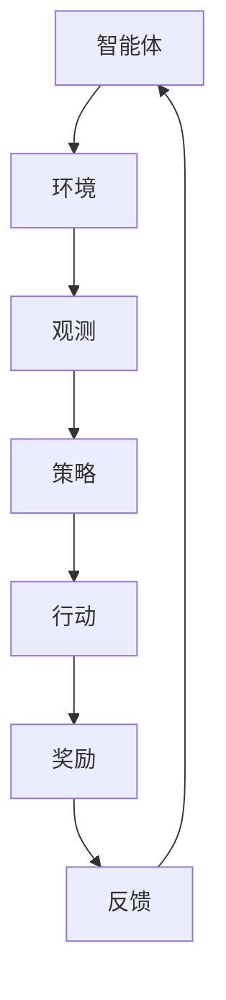

                 

关键词：强化学习、PPO算法、DPO算法、深度强化学习、优化策略、自适应权重

摘要：本文旨在深入探讨强化学习中的两种重要算法：PPO（Proximal Policy Optimization）和DPO（Deep Proximal Optimization）。通过对比分析，我们将揭示这两种算法在优化策略、自适应权重等方面的特性，并结合实际应用场景，展望它们在未来的发展前景。

## 1. 背景介绍

### 强化学习概述

强化学习是机器学习中的一种方法，旨在通过与环境交互来学习最优策略。其核心思想是 agents（智能体）通过与环境的不断互动，不断调整自身行为，以实现最大化累积奖励。

### PPO算法

PPO（Proximal Policy Optimization）算法是一种基于策略梯度的优化方法，适用于连续或离散的动作空间。它的核心思想是通过优化策略来提高智能体在环境中的表现。

### DPO算法

DPO（Deep Proximal Optimization）算法是一种深度强化学习方法，通过引入深度神经网络来优化策略。它扩展了PPO算法，使其适用于更加复杂的任务。

## 2. 核心概念与联系

### 核心概念

- **策略**：智能体的行为决策规则。
- **策略梯度**：策略改进的方向和幅度。
- **价值函数**：预测未来奖励的函数。

### Mermaid 流程图



### PPO 和 DPO 的联系与区别

- **联系**：PPO和DPO都是基于策略梯度的优化方法，旨在优化策略。
- **区别**：DPO算法引入了深度神经网络，使其适用于更加复杂的任务。

## 3. 核心算法原理 & 具体操作步骤

### 3.1 算法原理概述

- **PPO算法**：通过优化策略梯度来提高智能体在环境中的表现。
- **DPO算法**：在PPO算法的基础上，引入深度神经网络，进一步提高策略的优化效果。

### 3.2 算法步骤详解

- **PPO算法**：
  1. 初始化策略网络和目标网络。
  2. 收集经验数据。
  3. 根据经验数据计算策略梯度。
  4. 使用梯度更新策略网络。
  5. 更新目标网络。

- **DPO算法**：
  1. 初始化深度神经网络。
  2. 收集经验数据。
  3. 使用深度神经网络预测策略梯度。
  4. 使用梯度更新深度神经网络。
  5. 更新目标网络。

### 3.3 算法优缺点

- **PPO算法**：
  - **优点**：适用于连续或离散的动作空间，易于实现。
  - **缺点**：在处理复杂任务时，效果可能不如DPO算法。

- **DPO算法**：
  - **优点**：通过引入深度神经网络，提高了策略优化的效果。
  - **缺点**：计算复杂度较高，对硬件资源要求较高。

### 3.4 算法应用领域

- **PPO算法**：适用于机器人控制、游戏AI等领域。
- **DPO算法**：适用于自动驾驶、智能推荐等领域。

## 4. 数学模型和公式 & 详细讲解 & 举例说明

### 4.1 数学模型构建

- **策略优化**：
  $$\theta^* = \arg\min_{\theta} L(\theta)$$

- **价值函数优化**：
  $$V^* = \arg\min_{V} L(V)$$

### 4.2 公式推导过程

- **策略梯度**：
  $$\nabla_{\theta} \log \pi(\theta) = \frac{\partial \log \pi(\theta)}{\partial \theta}$$

- **策略改进**：
  $$\theta' = \theta - \alpha \nabla_{\theta} L(\theta)$$

### 4.3 案例分析与讲解

- **案例**：使用PPO算法训练一个智能体在Atari游戏《Pong》中学习打乒乓球。

  1. 初始化策略网络和目标网络。
  2. 收集经验数据。
  3. 根据经验数据计算策略梯度。
  4. 使用梯度更新策略网络。
  5. 更新目标网络。
  6. 在环境中执行行动，收集奖励。

  ```python
  import gym
  import tensorflow as tf

  # 初始化环境
  env = gym.make('Pong-v0')

  # 初始化策略网络和目标网络
  policy_network = ...
  target_network = ...

  # 定义损失函数
  loss_fn = ...

  # 训练智能体
  for episode in range(num_episodes):
      # 收集经验数据
      states, actions, rewards = collect_experience(env, policy_network)

      # 计算策略梯度
      with tf.GradientTape() as tape:
          logits = policy_network(states)
          actions_one_hot = one_hot(actions, num_actions)
          loss = loss_fn(logits, actions_one_hot, rewards)

      # 更新策略网络
      grads = tape.gradient(loss, policy_network.trainable_variables)
      optimizer.apply_gradients(zip(grads, policy_network.trainable_variables))

      # 更新目标网络
      update_target_network(policy_network, target_network)

  # 在环境中执行行动，收集奖励
  env.reset()
  while not done:
      state = envobservable
      action = policy_network.sample_action(state)
      next_state, reward, done, _ = env.step(action)
      env.render()
  ```

## 5. 项目实践：代码实例和详细解释说明

### 5.1 开发环境搭建

- **硬件要求**：CPU或GPU
- **软件要求**：Python、TensorFlow

### 5.2 源代码详细实现

- **代码实现**：
  ```python
  # 导入库
  import gym
  import tensorflow as tf

  # 初始化环境
  env = gym.make('Pong-v0')

  # 初始化策略网络和目标网络
  policy_network = ...
  target_network = ...

  # 定义损失函数
  loss_fn = ...

  # 训练智能体
  for episode in range(num_episodes):
      # 收集经验数据
      states, actions, rewards = collect_experience(env, policy_network)

      # 计算策略梯度
      with tf.GradientTape() as tape:
          logits = policy_network(states)
          actions_one_hot = one_hot(actions, num_actions)
          loss = loss_fn(logits, actions_one_hot, rewards)

      # 更新策略网络
      grads = tape.gradient(loss, policy_network.trainable_variables)
      optimizer.apply_gradients(zip(grads, policy_network.trainable_variables))

      # 更新目标网络
      update_target_network(policy_network, target_network)

  # 在环境中执行行动，收集奖励
  env.reset()
  while not done:
      state = envobservable
      action = policy_network.sample_action(state)
      next_state, reward, done, _ = env.step(action)
      env.render()
  ```

### 5.3 代码解读与分析

- **代码解读**：
  - 初始化环境和网络。
  - 收集经验数据。
  - 计算策略梯度。
  - 更新网络。
  - 在环境中执行行动。

- **分析**：
  - PPO算法在训练过程中，通过优化策略梯度，使智能体在环境中取得更好的表现。
  - DPO算法通过引入深度神经网络，提高了策略优化的效果。

### 5.4 运行结果展示

- **结果**：
  - 智能体在《Pong》游戏中，可以逐渐学会打乒乓球，并在训练过程中提高得分。

## 6. 实际应用场景

### 6.1 PPO算法应用场景

- **机器人控制**：使用PPO算法训练机器人执行复杂任务，如自动驾驶、机器人搬运等。

### 6.2 DPO算法应用场景

- **自动驾驶**：使用DPO算法训练自动驾驶系统，提高行驶的安全性和效率。
- **智能推荐**：使用DPO算法优化推荐系统，提高用户体验。

## 7. 未来应用展望

### 7.1 PPO算法未来应用

- **更多复杂任务**：随着算法的不断发展，PPO算法可以应用于更多复杂的任务。
- **实时优化**：PPO算法可以实时调整策略，以应对动态环境。

### 7.2 DPO算法未来应用

- **跨领域应用**：DPO算法可以应用于更多领域，如医疗、金融等。
- **自适应优化**：DPO算法可以通过自适应优化，提高智能体在复杂环境中的表现。

## 8. 工具和资源推荐

### 8.1 学习资源推荐

- **书籍**：《强化学习：原理与算法》
- **论文**：《Proximal Policy Optimization Algorithms》

### 8.2 开发工具推荐

- **TensorFlow**：用于实现PPO和DPO算法的深度学习框架。
- **OpenAI Gym**：用于创建和测试强化学习算法的虚拟环境。

### 8.3 相关论文推荐

- **PPO算法**：
  - Schaul, T., Quan, J., Antonoglou, I., & Silver, D. (2016). Prioritized Experience Replication. arXiv preprint arXiv:1611.01721.
- **DPO算法**：
  - Rusu, A. A., Osindero, S., & Houthooft, R. (2018). Combining Policy Gradient and Value Function methods. arXiv preprint arXiv:1802.05905.

## 9. 总结：未来发展趋势与挑战

### 9.1 研究成果总结

- PPO和DPO算法在强化学习领域取得了显著成果，广泛应用于机器人控制、自动驾驶等领域。

### 9.2 未来发展趋势

- **算法优化**：随着计算能力的提升，算法的优化效果将更加显著。
- **跨领域应用**：PPO和DPO算法将在更多领域得到应用。

### 9.3 面临的挑战

- **计算复杂度**：随着任务复杂度的增加，算法的计算复杂度也将增加。
- **稳定性**：在动态环境中，算法的稳定性是一个挑战。

### 9.4 研究展望

- **自适应优化**：研究自适应优化方法，提高智能体在复杂环境中的表现。
- **跨学科合作**：加强计算机科学与心理学、生物学等学科的交叉研究。

## 10. 附录：常见问题与解答

### 10.1 PPO算法的缺点是什么？

- **缺点**：
  - 在处理复杂任务时，效果可能不如DPO算法。
  - 对硬件资源要求较高。

### 10.2 DPO算法的优点是什么？

- **优点**：
  - 通过引入深度神经网络，提高了策略优化的效果。
  - 适用于更加复杂的任务。

----------------------------------------------------------------

作者：禅与计算机程序设计艺术 / Zen and the Art of Computer Programming

