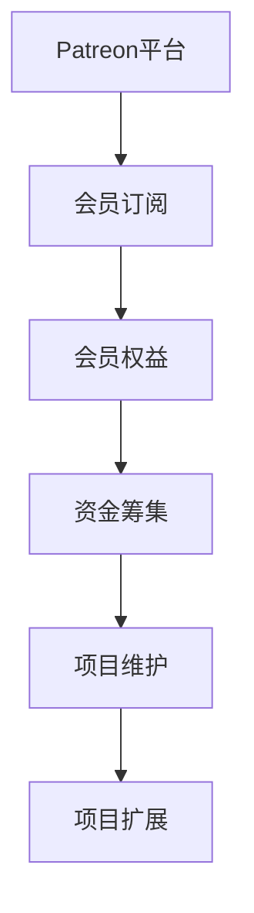

                 

 关键词：Patreon、开源项目、众筹策略、开发者支持、可持续性、用户参与

> 摘要：本文将探讨Patreon平台如何通过其独特的众筹模式为开源项目提供资金支持，以及开源开发者如何利用Patreon平台实现项目的可持续发展和用户参与。

## 1. 背景介绍

Patreon是一个基于会员制的众筹平台，主要面向内容创作者、艺术家、音乐家、游戏开发者以及各种专业人士。它允许创作者通过定期获得会员的订阅费来维持自己的创作生涯，从而摆脱依赖一次性销售收入的风险。Patreon的运作模式不同于传统的众筹平台，后者通常依赖于一次性的大额捐款来支持项目，而Patreon则依赖于小额但持续的订阅支持。

开源项目通常由一群志愿者开发，他们希望通过自己的努力为社区贡献高质量、自由和可修改的软件。然而，开源项目的开发往往需要资金支持，包括购买硬件、支付服务器费用、参加开发者会议的旅费等。Patreon平台的众筹策略为开源项目提供了一种新的资金筹集方式，使得开发者能够获得稳定的收入，从而更好地维护和扩展项目。

## 2. 核心概念与联系

### 2.1 Patreon平台的核心概念

Patreon的核心概念是会员制。会员可以选择按月或按作品付费的方式支持他们喜爱的创作者。创作者在Patreon上设置不同的订阅层次，每个层次对应不同的会员权益，如独家内容、自定义徽章、优先反馈等。

### 2.2 开源项目的众筹策略

开源项目的众筹策略通常基于以下概念：

- **目标明确的资金需求**：开发者需要明确项目所需的资金，以及资金将用于哪些方面。
- **灵活的订阅层次**：开发者可以在Patreon上设置多个订阅层次，以吸引不同层次的资助者。
- **会员权益**：开发者需要为会员提供不同的权益，以增加他们的参与感和忠诚度。

### 2.3 Mermaid流程图



## 3. 核心算法原理 & 具体操作步骤

### 3.1 算法原理概述

Patreon平台的众筹算法主要基于以下几个原理：

- **会员订阅管理**：Patreon通过会员订阅管理算法来跟踪和管理会员的订阅情况。
- **资金分配策略**：Patreon使用资金分配策略来决定如何将会员的订阅费分配给不同的创作者。
- **反馈循环**：Patreon通过用户反馈来优化其平台和资金分配策略。

### 3.2 算法步骤详解

#### 3.2.1 会员订阅管理

1. 会员注册：用户在Patreon上注册并选择订阅层次。
2. 订阅验证：Patreon验证会员的支付信息并激活订阅。
3. 订阅跟踪：Patreon持续跟踪会员的订阅状态，包括订阅的变更和取消。

#### 3.2.2 资金分配策略

1. 资金汇集：每月底，Patreon将所有会员的订阅费汇集到一个资金池中。
2. 分配计算：Patreon使用分配算法来计算每个创作者应得的资金。
3. 资金发放：Patreon将资金发放给创作者。

#### 3.2.3 反馈循环

1. 用户反馈：会员和创作者可以在Patreon上提供反馈。
2. 数据分析：Patreon分析用户反馈，以优化平台和服务。
3. 调整策略：根据数据分析结果，Patreon调整其资金分配策略。

### 3.3 算法优缺点

#### 优点：

- **可持续性**：通过持续的资金支持，开源项目可以长期维持。
- **灵活性**：创作者可以根据自己的需求设置不同的订阅层次。
- **用户参与**：会员通过订阅获得独家内容和其他权益，增加了项目的社区感。

#### 缺点：

- **依赖性**：开源项目过度依赖Patreon平台，可能导致风险集中。
- **资金分配不均**：如果分配算法不合理，可能导致某些创作者获得过多或过少的资金。

### 3.4 算法应用领域

Patreon的众筹策略适用于各种开源项目，包括：

- **软件开发**：如开源编程语言、开发工具和框架。
- **内容创作**：如开源电子书、学术论文和艺术作品。
- **科研项目**：如开源科学实验和数据分析。

## 4. 数学模型和公式 & 详细讲解 & 举例说明

### 4.1 数学模型构建

Patreon平台的数学模型可以表示为以下公式：

$$
收益（R）= 订阅费（S）× 订阅人数（N）× 订阅周期（T）
$$

其中：

- **收益（R）**：创作者在一定周期内从Patreon获得的收入。
- **订阅费（S）**：会员为支持创作者而支付的费用。
- **订阅人数（N）**：支持创作者的会员总数。
- **订阅周期（T）**：会员订阅的有效期，通常为一个月。

### 4.2 公式推导过程

Patreon的收益可以通过以下步骤推导：

1. **订阅费计算**：会员每月支付固定金额的订阅费。
2. **订阅人数计算**：每月底，Patreon统计活跃会员人数。
3. **订阅周期计算**：订阅周期为一个月。

根据上述步骤，收益公式可以表示为：

$$
R = S \times N \times T
$$

### 4.3 案例分析与讲解

假设一个开源项目的订阅费为$10美元，每月有100名会员订阅，订阅周期为一个月。根据收益公式，我们可以计算出该项目的月收益：

$$
R = 10 \times 100 \times 1 = 1000 美元
$$

这意味着该项目每月可以从Patreon获得1000美元的收入。

### 4.4 案例分析与讲解

#### 案例一：订阅费调整

假设该项目的订阅费从$10美元调整到$15美元，其他条件不变。我们可以重新计算月收益：

$$
R = 15 \times 100 \times 1 = 1500 美元
$$

这意味着订阅费的增加直接导致收益的增加。

#### 案例二：订阅人数增加

假设订阅人数从100增加到200，订阅费和订阅周期不变。我们可以重新计算月收益：

$$
R = 10 \times 200 \times 1 = 2000 美元
$$

这意味着订阅人数的增加也直接导致收益的增加。

## 5. 项目实践：代码实例和详细解释说明

### 5.1 开发环境搭建

为了演示如何在Patreon平台上创建和配置一个开源项目，我们需要以下开发环境：

- **计算机**：一台具有网络连接能力的计算机。
- **Patreon账户**：一个Patreon账户，用于创建和管理工作室。
- **GitHub账户**：一个GitHub账户，用于托管项目代码。

### 5.2 源代码详细实现

在这个示例中，我们将创建一个简单的Python项目，该项目的目标是为用户提供一个计算器。以下是项目的基本代码结构：

```python
class Calculator:
    def __init__(self):
        self.result = 0

    def add(self, value):
        self.result += value
        return self.result

    def subtract(self, value):
        self.result -= value
        return self.result

    def multiply(self, value):
        self.result *= value
        return self.result

    def divide(self, value):
        self.result /= value
        return self.result
```

### 5.3 代码解读与分析

在这个项目中，我们定义了一个名为`Calculator`的类。该类包含以下方法：

- `__init__`：构造函数，用于初始化计算器的状态。
- `add`：添加一个值到计算器的结果。
- `subtract`：从计算器的结果中减去一个值。
- `multiply`：将计算器的结果乘以一个值。
- `divide`：将计算器的结果除以一个值。

### 5.4 运行结果展示

以下是一个简单的示例，展示了如何使用这个计算器：

```python
calculator = Calculator()
print(calculator.add(10))  # 输出：10
print(calculator.subtract(5))  # 输出：5
print(calculator.multiply(2))  # 输出：10
print(calculator.divide(2))  # 输出：5.0
```

## 6. 实际应用场景

### 6.1 软件开发

开源软件项目，如编程语言、开发工具和框架，可以通过Patreon平台获得稳定的资金支持。例如，Python编程语言的开发团队可以通过Patreon平台获得会员的订阅费，从而支付服务器费用、参加开发者会议的旅费等。

### 6.2 内容创作

开源电子书、学术论文和艺术作品可以通过Patreon平台获得资金支持。创作者可以设置不同的订阅层次，以提供独家内容、优先反馈等权益，从而吸引会员订阅。

### 6.3 科研项目

开源科研项目，如科学实验和数据分析，可以通过Patreon平台获得资金支持。例如，一个研究气候变化的开源项目可以通过Patreon平台获得会员的订阅费，用于购买设备、支付研究人员工资等。

## 7. 工具和资源推荐

### 7.1 学习资源推荐

- **Patreon官方文档**：了解Patreon平台的详细信息，包括会员订阅管理、资金分配策略等。
- **GitHub官方文档**：了解如何使用GitHub托管和分享开源项目代码。

### 7.2 开发工具推荐

- **PyCharm**：一款强大的Python集成开发环境，适合编写和调试Python代码。
- **GitKraken**：一款图形化的Git版本控制工具，便于管理和协作开源项目。

### 7.3 相关论文推荐

- **"Patreon and the Future of Content Creation"**：探讨Patreon平台对内容创作的影响。
- **"Open Source Sustainability through Crowdfunding"**：讨论开源项目通过众筹实现可持续发展的策略。

## 8. 总结：未来发展趋势与挑战

### 8.1 研究成果总结

Patreon平台的众筹策略为开源项目提供了新的资金筹集方式，有助于实现项目的可持续发展和用户参与。通过会员制和灵活的订阅层次，Patreon平台能够为各种类型的开源项目提供支持。

### 8.2 未来发展趋势

随着开源项目的不断增加和用户需求的提升，Patreon平台有望在未来进一步发展。例如，Patreon可以探索与其他众筹平台的合作，以扩大其影响力。

### 8.3 面临的挑战

Patreon平台在发展过程中也面临一些挑战，如如何确保资金分配的公平性、如何处理会员的反馈等。此外，开源项目过度依赖Patreon平台可能导致风险集中。

### 8.4 研究展望

未来研究可以探讨如何优化Patreon平台的资金分配算法，提高项目的资金利用效率。此外，还可以研究如何通过Patreon平台促进开源项目的用户参与，以实现更广泛的社区合作。

## 9. 附录：常见问题与解答

### Q：Patreon平台的会员订阅费用是如何计算的？

A：Patreon平台的会员订阅费用是每月固定的，会员可以选择按月或按作品付费。订阅费用取决于会员选择的订阅层次。

### Q：开源项目如何确保会员的订阅费得到合理利用？

A：开源项目开发者需要在Patreon平台上明确资金用途，并在每个月底发布资金使用报告。此外，Patreon平台也会对项目的资金使用情况进行审核。

### Q：Patreon平台如何处理会员的反馈？

A：Patreon平台鼓励会员在平台上提供反馈。开发者需要定期查看反馈，并根据反馈调整项目和服务。Patreon平台也提供工具帮助开发者分析会员反馈。

### Q：Patreon平台是否支持多种货币？

A：是的，Patreon平台支持多种货币，包括美元、欧元、英镑等。开发者可以根据自己的需求选择适合的货币。

### Q：Patreon平台对会员的订阅费用有何优惠政策？

A：Patreon平台对会员的订阅费用有一些优惠政策，如会员折扣、节日促销等。开发者可以通过Patreon平台的活动页面了解最新的优惠政策。

---

本文由禅与计算机程序设计艺术撰写，旨在探讨Patreon平台如何为开源项目提供资金支持，以及开源开发者如何利用Patreon平台实现项目的可持续发展和用户参与。通过本文的介绍，读者可以了解到Patreon平台的运作模式、核心算法原理、数学模型以及实际应用场景。希望本文能为开源项目开发者提供有益的参考。作者：禅与计算机程序设计艺术 / Zen and the Art of Computer Programming。

