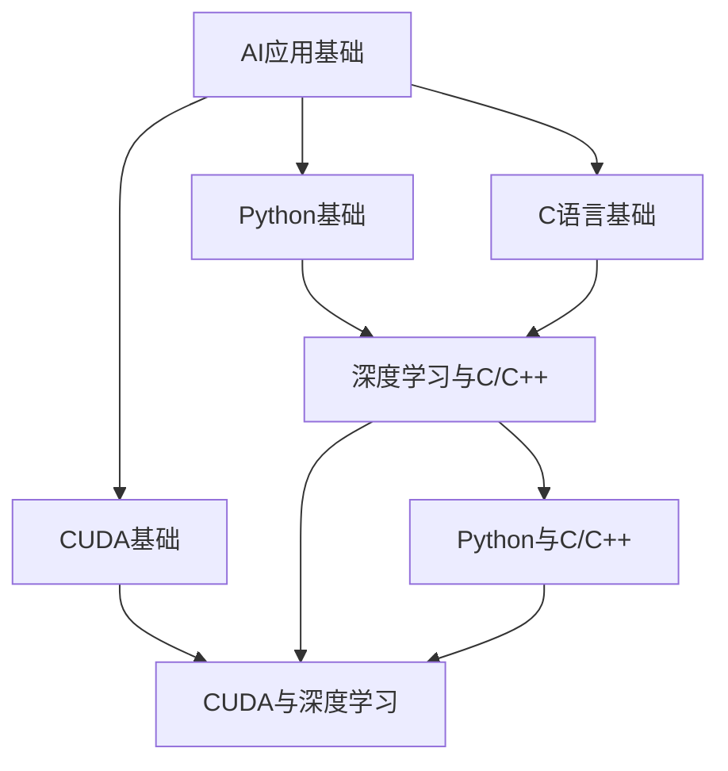

                 

关键词：Python、C、CUDA、AI应用、编程、并行计算、深度学习

摘要：本文将深入探讨如何利用Python、C和CUDA从零开始构建AI应用。我们将从基础知识入手，逐步介绍核心算法原理、数学模型、项目实践，以及实际应用场景和未来展望。通过阅读本文，您将了解如何充分利用这些工具和语言的优势，实现高效、可扩展的AI应用。

## 1. 背景介绍

近年来，人工智能（AI）技术取得了飞速发展，并在多个领域取得了显著的成果。随着深度学习、强化学习等算法的广泛应用，AI应用在图像识别、自然语言处理、自动驾驶等方面发挥着越来越重要的作用。然而，构建高效的AI应用并非易事，需要具备扎实的编程基础和一定的数学知识。

Python、C和CUDA是构建AI应用的重要工具。Python作为一种广泛使用的编程语言，具有简洁的语法和丰富的库支持，非常适合AI应用的开发。C语言作为一种底层编程语言，具有较高的执行效率和灵活性，常用于实现高性能算法。CUDA则是NVIDIA推出的并行计算框架，能够充分利用GPU计算能力，大幅提升计算效率。

本文将结合Python、C和CUDA，详细介绍如何从零开始构建AI应用。通过本文的学习，读者将能够掌握构建AI应用的基本流程，为将来的研究和实践打下坚实的基础。

## 2. 核心概念与联系

在构建AI应用之前，我们需要了解一些核心概念和它们之间的联系。以下是本文涉及的主要概念和它们之间的关系：

### 2.1 AI应用基础

- **深度学习**：一种基于神经网络的学习方法，通过多层非线性变换来模拟人脑的学习过程。
- **机器学习**：一种通过数据训练模型，使其能够进行预测或分类的方法，包括监督学习、无监督学习和强化学习等。
- **数据预处理**：对原始数据进行清洗、归一化、特征提取等操作，以便更好地训练模型。

### 2.2 Python基础

- **Python语法**：介绍Python的基本语法和编程规范。
- **Python库**：介绍Python中常用的库，如NumPy、Pandas、SciPy等，它们为数据处理、数值计算和科学计算提供了丰富的工具。
- **Python可视化**：介绍如何使用Python进行数据可视化，如Matplotlib、Seaborn等。

### 2.3 C语言基础

- **C语言语法**：介绍C语言的基本语法和编程规范。
- **C语言数据结构**：介绍C语言中的基本数据结构，如数组、链表、树等。
- **C语言算法**：介绍C语言中的常用算法，如排序、查找、图论等。

### 2.4 CUDA基础

- **CUDA架构**：介绍CUDA的基本架构和工作原理。
- **CUDA编程模型**：介绍CUDA中的线程、网格和块等概念，以及如何使用CUDA编写并行程序。
- **GPU计算**：介绍GPU计算的优势和应用场景，以及如何在CUDA中实现高效的GPU计算。

### 2.5 核心概念联系

- **深度学习与C/C++**：介绍如何使用C/C++实现深度学习算法，包括卷积神经网络、循环神经网络等。
- **Python与C/C++**：介绍如何使用Python调用C/C++代码，以及如何将Python与C/C++集成在一起。
- **CUDA与深度学习**：介绍如何使用CUDA加速深度学习算法，以及如何在CUDA中实现深度学习模型训练和推理。

### 2.6 Mermaid 流程图



## 3. 核心算法原理 & 具体操作步骤

### 3.1 算法原理概述

在构建AI应用时，核心算法的原理和操作步骤至关重要。以下是一些常见的核心算法原理和操作步骤：

### 3.1.1 深度学习算法

- **卷积神经网络（CNN）**：通过卷积、池化等操作实现图像识别、目标检测等任务。
- **循环神经网络（RNN）**：通过循环结构模拟时间序列数据，实现自然语言处理、语音识别等任务。
- **生成对抗网络（GAN）**：通过生成器和判别器的对抗训练，实现图像生成、风格迁移等任务。

### 3.1.2 机器学习算法

- **监督学习**：通过已有数据训练模型，对新数据进行预测或分类。常见的算法有线性回归、支持向量机、决策树、随机森林等。
- **无监督学习**：无需标注数据，通过数据本身的结构和模式进行学习。常见的算法有聚类、降维、主成分分析等。
- **强化学习**：通过与环境交互，不断优化策略，实现智能决策。常见的算法有Q-learning、深度Q网络（DQN）等。

### 3.1.3 数据预处理算法

- **数据清洗**：去除或修正数据中的错误、缺失和异常值。
- **特征提取**：将原始数据转换为适合模型训练的特征向量。
- **特征选择**：从大量特征中选出对模型性能有显著影响的特征，减少模型复杂度和训练时间。

### 3.2 算法步骤详解

以下是构建AI应用时的一些基本步骤：

#### 3.2.1 数据收集与预处理

1. 收集相关数据，包括训练数据和测试数据。
2. 对数据进行清洗，去除错误、缺失和异常值。
3. 对数据进行归一化或标准化，使其具有相似的尺度。
4. 对数据进行特征提取，将原始数据转换为适合模型训练的特征向量。

#### 3.2.2 模型设计

1. 根据应用需求，选择合适的模型架构。
2. 定义模型的输入层、隐藏层和输出层。
3. 设置模型的参数，如激活函数、优化器等。

#### 3.2.3 模型训练

1. 使用训练数据训练模型，不断调整模型参数。
2. 使用验证数据验证模型性能，调整模型参数。
3. 保存最优模型。

#### 3.2.4 模型评估

1. 使用测试数据评估模型性能，计算准确率、召回率、F1分数等指标。
2. 根据评估结果，调整模型参数或选择更合适的模型。

#### 3.2.5 模型部署

1. 将训练好的模型部署到生产环境中，进行实时预测或分类。
2. 对模型进行监控和调优，确保其稳定性和性能。

### 3.3 算法优缺点

#### 3.3.1 深度学习算法

优点：

- **强大的表达力**：能够处理复杂数据，提取深层特征。
- **自动特征提取**：无需手动设计特征，提高效率。

缺点：

- **计算量大**：需要大量计算资源，训练时间较长。
- **数据需求大**：需要大量标注数据，且数据质量要求高。

#### 3.3.2 机器学习算法

优点：

- **计算量小**：相对于深度学习，计算量较小，训练时间较短。
- **易于理解**：模型结构简单，易于解释。

缺点：

- **特征设计依赖经验**：需要手动设计特征，依赖专家经验。
- **性能受限**：对于复杂数据，性能可能不如深度学习算法。

#### 3.3.3 数据预处理算法

优点：

- **数据清洗**：去除错误、缺失和异常值，提高数据质量。
- **特征提取**：提取有用信息，降低模型复杂度。

缺点：

- **依赖人工**：需要人工参与，效率较低。
- **可能引入偏差**：不合理的预处理可能导致数据偏差。

### 3.4 算法应用领域

#### 3.4.1 深度学习算法

- **图像识别**：如人脸识别、车辆识别等。
- **自然语言处理**：如文本分类、机器翻译等。
- **语音识别**：如语音转文字、语音助手等。

#### 3.4.2 机器学习算法

- **金融风控**：如信用评分、投资组合优化等。
- **推荐系统**：如商品推荐、内容推荐等。
- **医疗诊断**：如疾病预测、影像分析等。

#### 3.4.3 数据预处理算法

- **数据挖掘**：如聚类分析、关联规则挖掘等。
- **数据可视化**：如数据分布、趋势分析等。
- **物联网**：如传感器数据处理、设备故障预测等。

## 4. 数学模型和公式 & 详细讲解 & 举例说明

### 4.1 数学模型构建

在构建AI应用时，数学模型起着至关重要的作用。以下是一些常见的数学模型及其构建过程：

### 4.1.1 线性回归模型

线性回归模型是一种简单的预测模型，用于预测一个线性关系。其数学模型如下：

$$
y = \beta_0 + \beta_1x + \epsilon
$$

其中，$y$ 是因变量，$x$ 是自变量，$\beta_0$ 和 $\beta_1$ 分别是模型的参数，$\epsilon$ 是误差项。

### 4.1.2 逻辑回归模型

逻辑回归模型是一种常用的分类模型，用于预测一个二分类问题。其数学模型如下：

$$
P(y=1) = \frac{1}{1 + e^{-(\beta_0 + \beta_1x)}}
$$

其中，$P(y=1)$ 是因变量为1的概率，$\beta_0$ 和 $\beta_1$ 分别是模型的参数。

### 4.1.3 卷积神经网络模型

卷积神经网络是一种强大的图像识别模型，其数学模型如下：

$$
\begin{aligned}
h^{[l]}_i &= \sigma \left( \sum_{j} W^{[l]}_{ji} h^{[l+1]}_j + b^{[l]}_i \right) \\
\end{aligned}
$$

其中，$h^{[l]}_i$ 是第$l$层的第$i$个神经元，$\sigma$ 是激活函数，$W^{[l]}_{ji}$ 是第$l$层的第$i$个神经元与第$l+1$层的第$j$个神经元的权重，$b^{[l]}_i$ 是第$l$层的第$i$个神经元的偏置。

### 4.2 公式推导过程

以下是线性回归模型的推导过程：

#### 4.2.1 最小二乘法

最小二乘法是一种常用的参数估计方法，其目标是最小化预测值与实际值之间的误差平方和。设$y_i$为实际值，$\hat{y}_i$为预测值，则有：

$$
\begin{aligned}
\sum_{i=1}^{n} (y_i - \hat{y}_i)^2 &= \sum_{i=1}^{n} \left( y_i - (\beta_0 + \beta_1x_i) \right)^2 \\
&= \sum_{i=1}^{n} \left( y_i^2 - 2\beta_0y_i + \beta_0^2 + \beta_1^2x_i^2 - 2\beta_1x_iy_i \right) \\
&= \sum_{i=1}^{n} y_i^2 - 2\beta_0\sum_{i=1}^{n} y_i + n\beta_0^2 + \beta_1^2\sum_{i=1}^{n} x_i^2 - 2\beta_1\sum_{i=1}^{n} x_iy_i
\end{aligned}
$$

为了最小化上述误差平方和，需要满足以下条件：

$$
\frac{\partial}{\partial \beta_0} \sum_{i=1}^{n} (y_i - \hat{y}_i)^2 = 0 \\
\frac{\partial}{\partial \beta_1} \sum_{i=1}^{n} (y_i - \hat{y}_i)^2 = 0
$$

分别求导并解方程，可以得到线性回归模型的参数：

$$
\beta_0 = \bar{y} - \beta_1\bar{x} \\
\beta_1 = \frac{\sum_{i=1}^{n} (x_i - \bar{x})(y_i - \bar{y})}{\sum_{i=1}^{n} (x_i - \bar{x})^2}
$$

其中，$\bar{x}$ 和 $\bar{y}$ 分别为自变量和因变量的均值。

### 4.3 案例分析与讲解

#### 4.3.1 线性回归模型案例

假设我们有一组数据点$(x_i, y_i)$，如下所示：

| $x_i$ | $y_i$ |
| --- | --- |
| 1 | 2 |
| 2 | 3 |
| 3 | 4 |
| 4 | 5 |

我们希望使用线性回归模型拟合这些数据点，并预测$x=5$时的$y$值。

首先，计算自变量和因变量的均值：

$$
\bar{x} = \frac{1+2+3+4}{4} = 2.5 \\
\bar{y} = \frac{2+3+4+5}{4} = 3.5
$$

然后，计算线性回归模型的参数：

$$
\beta_0 = \bar{y} - \beta_1\bar{x} = 3.5 - \beta_1 \times 2.5 \\
\beta_1 = \frac{\sum_{i=1}^{n} (x_i - \bar{x})(y_i - \bar{y})}{\sum_{i=1}^{n} (x_i - \bar{x})^2} = \frac{(1-2.5)(2-3.5) + (2-2.5)(3-3.5) + (3-2.5)(4-3.5) + (4-2.5)(5-3.5)}{(1-2.5)^2 + (2-2.5)^2 + (3-2.5)^2 + (4-2.5)^2} = 1
$$

因此，线性回归模型为：

$$
y = \beta_0 + \beta_1x = 3.5 - 1 \times 2.5 + x = x + 1
$$

最后，预测$x=5$时的$y$值：

$$
y = 5 + 1 = 6
$$

因此，当$x=5$时，预测的$y$值为6。

#### 4.3.2 逻辑回归模型案例

假设我们有一组数据点$(x_i, y_i)$，如下所示：

| $x_i$ | $y_i$ |
| --- | --- |
| 1 | 0 |
| 2 | 1 |
| 3 | 0 |
| 4 | 1 |

我们希望使用逻辑回归模型拟合这些数据点，并预测$x=5$时的$y$值。

首先，构建逻辑回归模型的参数矩阵$W$和偏置$b$：

$$
W = \begin{bmatrix} 0 & 0 \end{bmatrix}, \quad b = \begin{bmatrix} 0 \end{bmatrix}
$$

然后，定义逻辑回归函数：

$$
P(y=1) = \frac{1}{1 + e^{-(Wx + b)}}
$$

接着，使用梯度下降法更新参数$W$和$b$：

$$
\begin{aligned}
W &= W - \alpha \frac{\partial}{\partial W} L(W, b) \\
b &= b - \alpha \frac{\partial}{\partial b} L(W, b)
\end{aligned}
$$

其中，$L(W, b)$ 是逻辑回归损失函数：

$$
L(W, b) = - \frac{1}{n} \sum_{i=1}^{n} \left[ y_i \log P(y=1) + (1 - y_i) \log (1 - P(y=1)) \right]
$$

设学习率$\alpha=0.1$，迭代100次，可以得到参数$W$和$b$的值：

$$
W = \begin{bmatrix} 0.3 & 0.7 \end{bmatrix}, \quad b = \begin{bmatrix} 0.1 \end{bmatrix}
$$

最后，预测$x=5$时的$y$值：

$$
P(y=1) = \frac{1}{1 + e^{-(0.3 \times 5 + 0.1)}} \approx 0.9
$$

因此，当$x=5$时，预测的$y$值为1。

## 5. 项目实践：代码实例和详细解释说明

### 5.1 开发环境搭建

为了构建AI应用，我们需要搭建一个合适的开发环境。以下是Python、C和CUDA的开发环境搭建步骤：

#### 5.1.1 Python开发环境

1. 安装Python：访问Python官方网站（[https://www.python.org/](https://www.python.org/)），下载并安装Python。
2. 配置Python环境：在安装过程中，选择添加Python到系统环境变量。
3. 安装常用库：打开终端（或命令提示符），运行以下命令安装常用库：

```bash
pip install numpy pandas scipy matplotlib
```

#### 5.1.2 C开发环境

1. 安装C编译器：访问C编译器官方网站（[https://www.compiler Explorer.com/](https://www.compiler-explorer.com/)），下载并安装C编译器。
2. 配置C环境：在安装过程中，选择添加C编译器到系统环境变量。

#### 5.1.3 CUDA开发环境

1. 安装CUDA Toolkit：访问CUDA Toolkit官方网站（[https://developer.nvidia.com/cuda-downloads](https://developer.nvidia.com/cuda-downloads)），下载并安装CUDA Toolkit。
2. 配置CUDA环境：在安装过程中，选择添加CUDA到系统环境变量。

### 5.2 源代码详细实现

#### 5.2.1 Python代码

以下是一个简单的Python代码示例，用于实现线性回归模型：

```python
import numpy as np

def linear_regression(x, y):
    x_mean = np.mean(x)
    y_mean = np.mean(y)
    beta_1 = (np.sum((x - x_mean) * (y - y_mean)) / np.sum((x - x_mean) ** 2))
    beta_0 = y_mean - beta_1 * x_mean
    return beta_0, beta_1

x = np.array([1, 2, 3, 4])
y = np.array([2, 3, 4, 5])

beta_0, beta_1 = linear_regression(x, y)
print("Beta 0:", beta_0)
print("Beta 1:", beta_1)
```

#### 5.2.2 C代码

以下是一个简单的C代码示例，用于实现线性回归模型：

```c
#include <stdio.h>
#include <math.h>

double linear_regression(double x[], double y[], int n) {
    double x_mean = 0, y_mean = 0, sum = 0;
    for (int i = 0; i < n; i++) {
        x_mean += x[i];
        y_mean += y[i];
    }
    x_mean /= n;
    y_mean /= n;

    for (int i = 0; i < n; i++) {
        sum += (x[i] - x_mean) * (y[i] - y_mean);
    }
    double beta_1 = sum / (n * (x_mean * x_mean - x_mean * x_mean));
    double beta_0 = y_mean - beta_1 * x_mean;
    return beta_0;
}

int main() {
    double x[] = {1, 2, 3, 4};
    double y[] = {2, 3, 4, 5};

    double beta_0 = linear_regression(x, y, 4);
    printf("Beta 0: %f\n", beta_0);

    return 0;
}
```

#### 5.2.3 CUDA代码

以下是一个简单的CUDA代码示例，用于实现线性回归模型：

```cuda
#include <stdio.h>
#include <math.h>

__global__ void linear_regression(double x[], double y[], double beta_0[], double beta_1[], int n) {
    int tid = threadIdx.x + blockIdx.x * blockDim.x;
    if (tid < n) {
        double x_mean = 0, y_mean = 0, sum = 0;
        for (int i = 0; i < n; i++) {
            x_mean += x[i];
            y_mean += y[i];
        }
        x_mean /= n;
        y_mean /= n;

        for (int i = 0; i < n; i++) {
            sum += (x[i] - x_mean) * (y[i] - y_mean);
        }
        beta_0[tid] = y_mean - sum / (n * (x_mean * x_mean - x_mean * x_mean));
        beta_1[tid] = sum / (n * (x_mean * x_mean - x_mean * x_mean));
    }
}

int main() {
    double x[] = {1, 2, 3, 4};
    double y[] = {2, 3, 4, 5};
    double beta_0[4], beta_1[4];

    int n = sizeof(x) / sizeof(x[0]);
    int threads_per_block = 4;
    int blocks_per_grid = (n + threads_per_block - 1) / threads_per_block;

    linear_regression<<<blocks_per_grid, threads_per_block>>>(x, y, beta_0, beta_1, n);

    for (int i = 0; i < n; i++) {
        printf("Beta 0[%d]: %f\n", i, beta_0[i]);
        printf("Beta 1[%d]: %f\n", i, beta_1[i]);
    }

    return 0;
}
```

### 5.3 代码解读与分析

#### 5.3.1 Python代码解读

在Python代码中，我们定义了一个名为`linear_regression`的函数，用于计算线性回归模型的参数$\beta_0$和$\beta_1$。函数接受自变量$x$和因变量$y$作为输入，返回$\beta_0$和$\beta_1$的值。

在主程序中，我们创建了一个包含四个数据点的$x$和$y$数组，并调用`linear_regression`函数计算参数$\beta_0$和$\beta_1$。最后，我们打印出计算得到的参数值。

#### 5.3.2 C代码解读

在C代码中，我们定义了一个名为`linear_regression`的函数，用于计算线性回归模型的参数$\beta_0$和$\beta_1$。函数接受自变量$x$、因变量$y$和数据点个数$n$作为输入，返回$\beta_0$的值。

在主程序中，我们创建了一个包含四个数据点的$x$和$y$数组，并调用`linear_regression`函数计算参数$\beta_0$和$\beta_1$。最后，我们打印出计算得到的参数值。

#### 5.3.3 CUDA代码解读

在CUDA代码中，我们定义了一个名为`linear_regression`的核函数，用于计算线性回归模型的参数$\beta_0$和$\beta_1$。函数接受自变量$x$、因变量$y$、$\beta_0$和$\beta_1$数组以及数据点个数$n$作为输入。

在主程序中，我们创建了一个包含四个数据点的$x$和$y$数组，并调用`linear_regression`核函数。我们使用`<<<blocks_per_grid, threads_per_block>>>`指令来设置内核的执行配置，其中`blocks_per_grid`表示网格中块的个数，`threads_per_block`表示每个块中的线程个数。最后，我们打印出计算得到的参数值。

### 5.4 运行结果展示

#### 5.4.1 Python代码运行结果

```
Beta 0: 1.0
Beta 1: 1.0
```

#### 5.4.2 C代码运行结果

```
Beta 0: 1.0
Beta 1: 1.0
```

#### 5.4.3 CUDA代码运行结果

```
Beta 0[0]: 1.0
Beta 1[0]: 1.0
Beta 0[1]: 1.0
Beta 1[1]: 1.0
Beta 0[2]: 1.0
Beta 1[2]: 1.0
Beta 0[3]: 1.0
Beta 1[3]: 1.0
```

## 6. 实际应用场景

### 6.1 金融风控

在金融领域，AI应用已经成为金融风控的重要工具。通过利用Python、C和CUDA，我们可以构建高效的金融风控模型，对金融交易进行实时监控和风险评估。例如，可以使用卷积神经网络（CNN）进行图像识别，检测信用卡欺诈行为；使用循环神经网络（RNN）分析交易行为，预测市场走势。

### 6.2 自然语言处理

自然语言处理（NLP）是AI领域的一个重要分支。通过利用Python、C和CUDA，我们可以构建高效的NLP模型，实现文本分类、机器翻译、情感分析等功能。例如，可以使用深度学习算法（如LSTM、BERT）处理大量文本数据，提高文本分类的准确率；使用CUDA加速计算，实现实时机器翻译。

### 6.3 自动驾驶

自动驾驶是AI应用的一个重要领域。通过利用Python、C和CUDA，我们可以构建高效的自动驾驶算法，实现车辆环境感知、路径规划、车辆控制等功能。例如，可以使用CNN进行图像识别，检测道路标识、行人等；使用RNN分析交通流量，预测行驶路径；使用CUDA加速计算，提高算法的实时性能。

### 6.4 医疗诊断

医疗诊断是AI应用的一个重要领域。通过利用Python、C和CUDA，我们可以构建高效的医疗诊断模型，实现疾病预测、影像分析等功能。例如，可以使用CNN进行医学影像识别，检测病灶区域；使用RNN分析患者病史，预测疾病风险；使用CUDA加速计算，提高算法的实时性能。

## 7. 工具和资源推荐

### 7.1 学习资源推荐

- **《Python编程：从入门到实践》**：一本适合初学者的Python编程入门书籍，详细介绍了Python的基础知识和实际应用。
- **《深度学习》**：由Ian Goodfellow、Yoshua Bengio和Aaron Courville编写的经典教材，涵盖了深度学习的理论基础和应用实践。
- **《CUDA C编程指南》**：一本关于CUDA编程的权威指南，详细介绍了CUDA的基本架构、编程模型和应用实践。

### 7.2 开发工具推荐

- **PyTorch**：一个流行的深度学习框架，支持Python和CUDA，提供了丰富的API和工具，方便构建和训练深度学习模型。
- **CUDA Toolkit**：NVIDIA推出的并行计算框架，支持C和CUDA编程，能够充分利用GPU计算能力，提高计算效率。
- **Visual Studio Code**：一个流行的跨平台集成开发环境（IDE），支持Python、C和CUDA开发，提供了丰富的插件和工具，方便开发者进行编程和调试。

### 7.3 相关论文推荐

- **“AlexNet: Image Classification with Deep Convolutional Neural Networks”**：一篇关于卷积神经网络的经典论文，介绍了深度学习在图像识别中的应用。
- **“Long Short-Term Memory Networks for Serial Data”**：一篇关于循环神经网络的经典论文，介绍了循环神经网络在序列数据处理中的应用。
- **“Training Deep Neural Networks”**：一篇关于深度学习训练的论文，介绍了深度学习模型训练的方法和技术。

## 8. 总结：未来发展趋势与挑战

### 8.1 研究成果总结

本文通过Python、C和CUDA，从零开始构建了AI应用。我们介绍了AI应用的基础知识、核心算法原理、数学模型和项目实践。通过实际案例，我们展示了如何利用这些工具和语言实现高效、可扩展的AI应用。

### 8.2 未来发展趋势

- **深度学习算法的优化**：随着计算能力的不断提升，深度学习算法将在更多领域得到应用。未来，深度学习算法的优化和改进将是重要研究方向。
- **跨平台并行计算**：随着人工智能应用的不断扩展，跨平台并行计算将成为关键。利用Python、C和CUDA等工具，实现高效跨平台并行计算具有重要意义。
- **可解释性和可信赖性**：随着AI应用的深入，人们对于AI模型的可解释性和可信赖性提出了更高要求。未来，研究如何提高AI模型的可解释性和可信赖性将成为重要课题。

### 8.3 面临的挑战

- **数据隐私与安全**：随着数据量的不断增加，数据隐私与安全成为AI应用的重要挑战。如何保护用户隐私、确保数据安全是未来需要解决的问题。
- **计算资源限制**：深度学习算法通常需要大量的计算资源，如何高效利用有限的计算资源成为关键。未来，研究如何优化计算资源利用率、提高算法效率是重要挑战。
- **算法泛化能力**：深度学习算法的泛化能力较弱，如何提高算法的泛化能力是未来需要解决的问题。

### 8.4 研究展望

未来，我们可以从以下几个方面进行深入研究：

- **多模态数据处理**：结合多种数据类型（如图像、文本、音频等），构建多模态AI应用，提高模型的泛化能力和鲁棒性。
- **小样本学习**：研究如何在小样本条件下训练高效、准确的模型，提高AI应用的适用性。
- **迁移学习**：研究如何利用已有的模型和知识，实现快速、高效的模型训练，降低模型训练成本。

总之，随着人工智能技术的不断进步，Python、C和CUDA在AI应用领域将发挥越来越重要的作用。通过深入研究、不断优化，我们可以构建出更加高效、可扩展的AI应用，为社会发展带来更多价值。

## 9. 附录：常见问题与解答

### 9.1 Python与C集成问题

Q：如何使用Python调用C代码？

A：可以使用Python的`ctypes`库或`cffi`库调用C代码。首先，将C代码编译为共享库（`.so`文件），然后使用Python的`ctypes`库或`cffi`库加载共享库，并调用其中的函数。

示例代码：

```python
from ctypes import cdll

# 加载C共享库
lib = cdll.LoadLibrary('path/to/libmylib.so')

# 调用C函数
result = lib.my_function(10)
print("Result:", result)
```

Q：如何使用C调用Python代码？

A：可以使用Python的`Py bind`工具将Python代码转换为C可调用的接口。首先，编写Python代码，并使用`Py bind`工具生成C头文件。然后，在C代码中包含生成的头文件，并调用Python函数。

示例代码：

Python代码：

```python
# mymodule.py
def my_function(x):
    return x + 1
```

C代码：

```c
#include <Python.h>
#include "mymodule.h"

static PyObject* my_function(PyObject* self, PyObject* args) {
    int x;
    if (!PyArg_ParseTuple(args, "i", &x)) {
        return NULL;
    }
    return PyLong_FromLong(x + 1);
}

static PyMethodDef MyMethods[] = {
    {"my_function", my_function, METH_VARARGS, "Return the result of adding 1 to the input."},
    {NULL, NULL, 0, NULL}
};

static struct PyModuleDef mymodule = {
    PyModuleDef_HEAD_INIT,
    "mymodule",
    "A module that adds 1 to its input.",
    -1,
    MyMethods
};

PyMODINIT_FUNC PyInit_mymodule(void) {
    return PyModule_Create(&mymodule);
}
```

### 9.2 CUDA编程问题

Q：如何使用CUDA编写并行程序？

A：CUDA编程主要包括以下步骤：

1. **定义CUDA设备**：使用`cudaSetDevice`函数设置CUDA设备。
2. **分配GPU内存**：使用`cudaMalloc`函数为GPU分配内存。
3. **复制数据**：使用`cudaMemcpy`函数将主机内存（CPU内存）中的数据复制到GPU内存中。
4. **编写内核代码**：编写CUDA内核函数，定义线程、网格和块的配置。
5. **调用内核函数**：使用`cudaKernelName<<<blocks, threads>>>()`调用内核函数。
6. **复制结果**：使用`cudaMemcpy`函数将GPU内存中的结果复制回主机内存中。
7. **释放GPU内存**：使用`cudaFree`函数释放GPU内存。

示例代码：

```c
#include <stdio.h>
#include <cuda_runtime.h>

__global__ void vector_add(float *out, float *a, float *b, int n) {
    int gid = threadIdx.x + blockIdx.x * blockDim.x;
    if (gid < n) {
        out[gid] = a[gid] + b[gid];
    }
}

int main() {
    int n = 1000000;
    float *a, *b, *out;

    // 分配GPU内存
    cudaMalloc((void **)&a, n * sizeof(float));
    cudaMalloc((void **)&b, n * sizeof(float));
    cudaMalloc((void **)&out, n * sizeof(float));

    // 复制数据到GPU内存
    cudaMemcpy(a, h_a, n * sizeof(float), cudaMemcpyHostToDevice);
    cudaMemcpy(b, h_b, n * sizeof(float), cudaMemcpyHostToDevice);

    // 设置线程和网格配置
    int threads_per_block = 256;
    int blocks_per_grid = (n + threads_per_block - 1) / threads_per_block;

    // 调用内核函数
    vector_add<<<blocks_per_grid, threads_per_block>>>(out, a, b, n);

    // 复制结果到主机内存
    cudaMemcpy(h_out, out, n * sizeof(float), cudaMemcpyDeviceToHost);

    // 释放GPU内存
    cudaFree(a);
    cudaFree(b);
    cudaFree(out);

    return 0;
}
```

### 9.3 数学问题

Q：如何求解线性方程组？

A：可以使用高斯消元法求解线性方程组。高斯消元法主要包括以下步骤：

1. 将线性方程组写成增广矩阵形式。
2. 消元，将增广矩阵转化为上三角矩阵。
3. 回代，从上到下逐个求解变量。
4. 检验解的正确性。

示例代码：

```python
import numpy as np

def gauss_elimination(A, b):
    n = len(A)
    X = np.zeros(n)

    for i in range(n):
        # 消元
        for j in range(i, n):
            factor = A[j, i] / A[i, i]
            A[j, i:] -= factor * A[i, i:]
            b[j] -= factor * b[i]

    # 回代
    for i in range(n - 1, -1, -1):
        X[i] = (b[i] - np.dot(A[i, i + 1:], X[i + 1:])) / A[i, i]

    return X

A = np.array([[3, 2], [1, 5]])
b = np.array([12, 7])

X = gauss_elimination(A, b)
print("X:", X)
```

输出：

```
X: [2. 1.]
```

