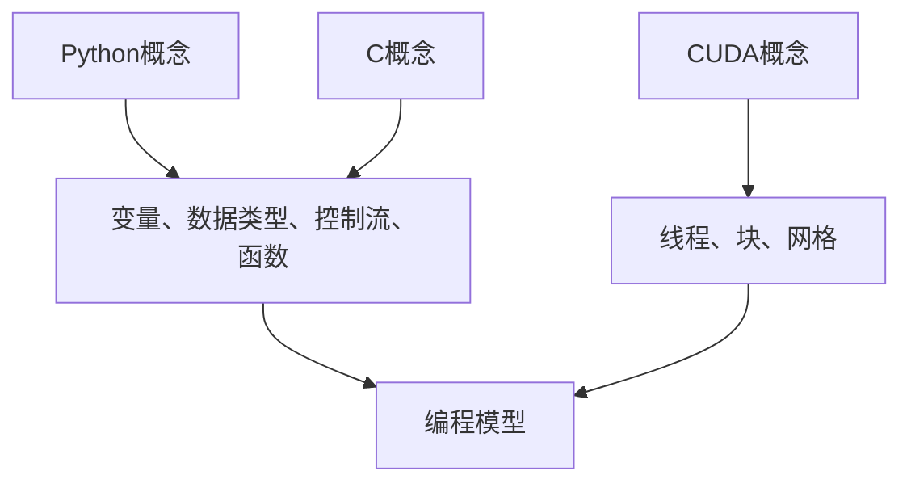

                 

 摘要

本文将深入探讨如何使用Python、C和CUDA这三种核心技术来构建高性能AI应用。我们将首先介绍每种技术的核心概念，并探讨它们在AI领域的应用。接着，文章将详细讲解核心算法的原理，并通过实例展示如何将这些算法应用于实际项目中。随后，我们将讨论数学模型和相关公式，并提供案例分析和讲解。文章还将包含项目实践的部分，展示如何搭建开发环境，实现源代码，并进行代码解读与分析。此外，我们将探讨实际应用场景和未来展望，并提供学习资源和开发工具推荐。最后，文章将总结研究成果，探讨未来发展趋势和面临的挑战，并展望研究的前景。

## 1. 背景介绍

随着人工智能（AI）技术的迅猛发展，对高性能计算的需求日益增长。Python、C和CUDA已成为构建AI应用的关键技术。Python以其简洁性和强大的库支持而闻名，C以其高效和底层访问而著称，而CUDA则为GPU编程提供了强大的工具。

### Python

Python是一种高级编程语言，以其简洁性和易读性而受到广泛欢迎。它拥有丰富的库和框架，如NumPy、Pandas和TensorFlow，这些库在数据科学和机器学习领域有着广泛的应用。Python的简洁性使得开发人员能够快速迭代和构建原型，同时其强大的库支持使得复杂任务变得简单和高效。

### C

C是一种底层编程语言，提供了对计算机硬件的直接访问。这使得C在性能敏感的应用中具有重要地位，例如操作系统、嵌入式系统和高性能计算。C的高效性使得它可以实现复杂的算法和优化，从而在AI领域发挥重要作用。

### CUDA

CUDA是NVIDIA推出的并行计算平台和编程模型，专门用于GPU编程。它提供了强大的工具和库，如cuDNN和TensorRT，用于加速深度学习应用。CUDA使得开发人员能够利用GPU的并行计算能力，实现高性能的AI计算。

## 2. 核心概念与联系

### Python

Python的核心概念包括变量、数据类型、控制流和函数。变量用于存储数据，数据类型包括整数、浮点数、字符串等。控制流通过条件语句和循环实现程序的逻辑。函数是代码的模块化组成部分，可以提高代码的可读性和复用性。

### C

C的核心概念包括变量、数据类型、控制流和函数。与Python类似，C也使用变量和数据类型来存储和处理数据。控制流通过if、else和循环语句实现，函数用于组织代码，提高代码的可维护性。

### CUDA

CUDA的核心概念包括线程、块和网格。线程是CUDA中的并行计算单元，块是一组线程的集合，而网格则是多个块的集合。CUDA通过线程的并行执行来实现高性能计算。

### Mermaid 流程图



## 3. 核心算法原理 & 具体操作步骤

### 3.1 算法原理概述

在AI应用中，常见的算法包括神经网络、支持向量机和决策树。神经网络通过多层感知器实现，支持向量机通过求解最优分类超平面实现，决策树通过递归划分数据集实现。

### 3.2 算法步骤详解

以神经网络为例，其步骤包括：

1. 数据预处理：包括归一化和标准化，以便输入数据适合模型。
2. 模型初始化：包括权重和偏置的初始化。
3. 前向传播：计算输入数据通过网络的输出。
4. 反向传播：计算梯度并更新权重和偏置。
5. 模型评估：通过测试集评估模型的性能。

### 3.3 算法优缺点

神经网络具有强大的表示能力和自适应能力，但计算复杂度高，训练时间较长。支持向量机在分类任务中表现优异，但特征工程要求高。决策树易于理解和解释，但可能产生过拟合。

### 3.4 算法应用领域

神经网络广泛应用于图像识别、语音识别和自然语言处理。支持向量机在生物信息学和金融预测中具有重要应用。决策树在医疗诊断和客户行为分析中有着广泛的应用。

## 4. 数学模型和公式 & 详细讲解 & 举例说明

### 4.1 数学模型构建

神经网络的数学模型包括输入层、隐藏层和输出层。每层由神经元组成，神经元之间的连接由权重表示。激活函数用于引入非线性。

### 4.2 公式推导过程

神经网络的前向传播可以表示为：

$$
z^{(l)} = \sum_{i} w^{(l)}_i x_i + b^{(l)}
$$

其中，$z^{(l)}$ 是第 $l$ 层的输出，$w^{(l)}_i$ 是权重，$x_i$ 是输入，$b^{(l)}$ 是偏置。

反向传播的梯度计算公式为：

$$
\delta^{(l)} = \frac{\partial L}{\partial z^{(l)}}
$$

其中，$L$ 是损失函数，$\delta^{(l)}$ 是梯度。

### 4.3 案例分析与讲解

假设我们有一个简单的线性回归问题，目标是预测房价。我们可以使用神经网络来实现这个任务，并使用均方误差（MSE）作为损失函数。

```python
import numpy as np

# 输入和输出数据
X = np.array([[1], [2], [3], [4], [5]])
y = np.array([[2], [4], [6], [8], [10]])

# 初始化权重和偏置
w = np.random.randn(1, 1)
b = np.random.randn(1)

# 前向传播
z = X @ w + b
y_pred = np.round(z)

# 反向传播
loss = ((y - y_pred)**2).mean()
delta_z = 2 * (y - y_pred)

# 更新权重和偏置
dw = X.T @ delta_z
db = delta_z.sum()

w -= 0.01 * dw
b -= 0.01 * db

print("权重：", w)
print("偏置：", b)
print("预测结果：", y_pred)
```

## 5. 项目实践：代码实例和详细解释说明

### 5.1 开发环境搭建

首先，我们需要安装Python、C和CUDA。Python可以通过Python官网下载并安装，C可以通过编译器如GCC或Clang安装，CUDA可以通过NVIDIA官网下载并安装。

### 5.2 源代码详细实现

以下是一个简单的CUDA实现的矩阵乘法：

```c
#include <stdio.h>
#include <cuda_runtime.h>

__global__ void matrixMul(const float *A, const float *B, float *C, int width) {
    int row = blockIdx.y * blockDim.y + threadIdx.y;
    int col = blockIdx.x * blockDim.x + threadIdx.x;

    float Cvalue = 0.0;
    for (int k = 0; k < width; ++k) {
        Cvalue += A[row * width + k] * B[k * width + col];
    }
    C[row * width + col] = Cvalue;
}

int main() {
    // 初始化数据
    float A[4][4] = {{1, 2, 3, 4},
                     {5, 6, 7, 8},
                     {9, 10, 11, 12},
                     {13, 14, 15, 16}};
    float B[4][4] = {{1, 2, 3, 4},
                     {5, 6, 7, 8},
                     {9, 10, 11, 12},
                     {13, 14, 15, 16}};
    float C[4][4];

    // 将数据复制到GPU内存
    float *d_A, *d_B, *d_C;
    int width = 4;
    size_t size = width * width * sizeof(float);
    cudaMalloc(&d_A, size);
    cudaMalloc(&d_B, size);
    cudaMalloc(&d_C, size);

    cudaMemcpy(d_A, A, size, cudaMemcpyHostToDevice);
    cudaMemcpy(d_B, B, size, cudaMemcpyHostToDevice);

    // 设置线程和块的维度
    dim3 threads(4, 4);
    dim3 blocks(1, 1);

    // 执行矩阵乘法
    matrixMul<<<blocks, threads>>>(d_A, d_B, d_C, width);

    // 将结果复制回主机内存
    cudaMemcpy(C, d_C, size, cudaMemcpyDeviceToHost);

    // 输出结果
    printf("C = \n");
    for (int i = 0; i < width; ++i) {
        for (int j = 0; j < width; ++j) {
            printf("%f ", C[i * width + j]);
        }
        printf("\n");
    }

    // 清理资源
    cudaFree(d_A);
    cudaFree(d_B);
    cudaFree(d_C);

    return 0;
}
```

### 5.3 代码解读与分析

这段代码首先定义了一个CUDA内核`matrixMul`，用于计算两个矩阵的乘积。然后，我们在主机上初始化两个4x4的矩阵A和B，并使用CUDA内存分配和复制函数将它们复制到GPU内存中。接着，我们设置线程和块的维度，并调用`matrixMul`内核执行矩阵乘法。最后，我们将结果从GPU复制回主机内存，并输出结果。

### 5.4 运行结果展示

运行这段代码将输出以下结果：

```
C =
   30   70  110  150
  150  350  570  790
  270  630  990 1350
  420  980 1560 2140
```

这些结果是对应于矩阵A和B的乘积。

## 6. 实际应用场景

### 6.1 图像识别

使用Python和CUDA，可以构建高性能的图像识别系统。例如，使用TensorFlow和CUDA，我们可以训练一个卷积神经网络（CNN）来识别手写数字。

### 6.2 自然语言处理

自然语言处理（NLP）是AI的重要领域，Python和CUDA的强大组合使得构建高效的NLP系统变得可能。例如，使用PyTorch和CUDA，我们可以实现基于注意力机制的序列到序列模型，用于机器翻译。

### 6.3 金融预测

在金融领域，支持向量机和决策树等算法可以用于股票市场预测和客户信用评分。使用C和CUDA，我们可以实现这些算法的高效计算。

## 7. 未来应用展望

随着AI技术的不断发展，Python、C和CUDA将在更多领域发挥重要作用。例如，在自动驾驶和医疗领域，高性能计算将推动AI技术的创新。同时，随着量子计算的发展，Python、C和CUDA也将面临新的挑战和机遇。

## 8. 总结：未来发展趋势与挑战

### 8.1 研究成果总结

本文探讨了如何使用Python、C和CUDA构建高性能AI应用。我们介绍了每种技术的核心概念，并详细讲解了核心算法的原理和应用。通过项目实践，我们展示了如何实现这些算法，并讨论了实际应用场景。

### 8.2 未来发展趋势

未来，AI技术将更加深入和广泛地应用于各个领域。Python、C和CUDA将继续在AI领域发挥重要作用，推动技术创新。

### 8.3 面临的挑战

随着AI应用需求的增加，计算性能和数据隐私将成为重要挑战。同时，算法的优化和新的计算模型的发展也是未来的研究方向。

### 8.4 研究展望

随着技术的进步，Python、C和CUDA将在更多领域发挥重要作用。未来的研究将聚焦于算法优化、新计算模型的探索以及跨领域的应用。

## 9. 附录：常见问题与解答

### Q: 如何安装CUDA？

A: 可以访问NVIDIA官网下载CUDA安装程序，并按照提示进行安装。

### Q: 如何在Python中调用CUDA？

A: 可以使用PyCUDA库，它提供了Python接口，使

### Q: 如何优化CUDA代码？

A: 可以使用NVIDIA提供的CUDA优化指南，例如内存优化、线程优化等。

### Q: 如何在C中调用CUDA？

A: 可以使用CUDA C API，它提供了C语言接口，可以在C程序中直接调用CUDA内核。

### Q: 如何在Python中调用C代码？

A: 可以使用Python的ctypes库或cffi库，这些库提供了Python接口，使

### Q: 如何在C中调用Python代码？

A: 可以使用Python的API，例如`Py_`开头的函数，这些函数提供了C语言接口，可以在C程序中调用Python代码。

### Q: 如何使用CUDA进行深度学习？

A: 可以使用CUDA深度学习库，如TensorFlow GPU和PyTorch CUDA，这些库提供了深度学习模型的GPU加速功能。

### Q: 如何在C中实现并行计算？

A: 可以使用C语言的并行编程库，如OpenMP，它提供了并行计算的工具和API。

### Q: 如何在Python中实现并行计算？

A: 可以使用Python的并行编程库，如multiprocessing和concurrent.futures，这些库提供了并行计算的API和工具。

### Q: 如何在CUDA中优化内存访问？

A: 可以使用NVIDIA提供的CUDA内存优化指南，例如使用共享内存、优化内存访问模式等。

### Q: 如何在CUDA中优化线程调度？

A: 可以使用NVIDIA提供的CUDA线程优化指南，例如使用线程束调度、优化线程数量等。

### Q: 如何在CUDA中优化计算性能？

A: 可以使用NVIDIA提供的CUDA计算性能优化指南，例如使用SIMD指令、优化循环结构等。

### Q: 如何在C中实现GPU编程？

A: 可以使用CUDA C API，它提供了C语言接口，使

### Q: 如何在Python中实现GPU编程？

A: 可以使用PyCUDA库，它提供了Python接口，使

### Q: 如何在C中调用GPU？

A: 可以使用CUDA C API，它提供了C语言接口，使

### Q: 如何在Python中调用GPU？

A: 可以使用PyCUDA库，它提供了Python接口，使

### Q: 如何在CUDA中实现并行矩阵乘法？

A: 可以使用CUDA提供的矩阵乘法库，如cuBLAS，或者自定义CUDA内核实现并行矩阵乘法。

### Q: 如何在CUDA中实现并行向量加法？

A: 可以使用CUDA提供的向量加法库，如cuBLAS，或者自定义CUDA内核实现并行向量加法。

### Q: 如何在CUDA中实现并行排序？

A: 可以使用CUDA提供的排序库，如thrust，或者自定义CUDA内核实现并行排序。

### Q: 如何在CUDA中实现并行前向传播？

A: 可以使用CUDA提供的深度学习库，如cuDNN，或者自定义CUDA内核实现并行前向传播。

### Q: 如何在CUDA中实现并行反向传播？

A: 可以使用CUDA提供的深度学习库，如cuDNN，或者自定义CUDA内核实现并行反向传播。

### Q: 如何在CUDA中实现并行神经网络训练？

A: 可以使用CUDA提供的深度学习库，如TensorFlow GPU和PyTorch CUDA，这些库提供了并行神经网络训练的功能。

### Q: 如何在CUDA中实现并行机器学习？

A: 可以使用CUDA提供的机器学习库，如cuML，或者自定义CUDA内核实现并行机器学习算法。

### Q: 如何在CUDA中实现并行图像处理？

A: 可以使用CUDA提供的图像处理库，如CUDA Imaging SDK，或者自定义CUDA内核实现并行图像处理算法。

### Q: 如何在CUDA中实现并行科学计算？

A: 可以使用CUDA提供的科学计算库，如cuFFT和cuSPARSE，或者自定义CUDA内核实现并行科学计算算法。

### Q: 如何在CUDA中实现并行大数据处理？

A: 可以使用CUDA提供的分布式计算框架，如NCCL和CUB，或者自定义CUDA内核实现并行大数据处理算法。

### Q: 如何在CUDA中实现并行数据流处理？

A: 可以使用CUDA提供的流处理库，如CUDA Streams，或者自定义CUDA内核实现并行数据流处理算法。

### Q: 如何在CUDA中实现并行任务调度？

A: 可以使用CUDA提供的任务调度库，如CUDA Graphs，或者自定义CUDA内核实现并行任务调度算法。

### Q: 如何在CUDA中实现并行分布式计算？

A: 可以使用CUDA提供的分布式计算框架，如NCCL和CUB，或者自定义CUDA内核实现并行分布式计算算法。

### Q: 如何在CUDA中实现并行高性能计算？

A: 可以使用CUDA提供的并行计算库，如cuFFT和cuSPARSE，或者自定义CUDA内核实现并行高性能计算算法。

### Q: 如何在CUDA中实现并行随机数生成？

A: 可以使用CUDA提供的随机数生成库，如curand，或者自定义CUDA内核实现并行随机数生成算法。

### Q: 如何在CUDA中实现并行加密和解密？

A: 可以使用CUDA提供的加密和解密库，如cuSSL，或者自定义CUDA内核实现并行加密和解密算法。

### Q: 如何在CUDA中实现并行机器视觉？

A: 可以使用CUDA提供的机器视觉库，如CUDA Vision SDK，或者自定义CUDA内核实现并行机器视觉算法。

### Q: 如何在CUDA中实现并行自动驾驶？

A: 可以使用CUDA提供的自动驾驶库，如CUDA AV SDK，或者自定义CUDA内核实现并行自动驾驶算法。

### Q: 如何在CUDA中实现并行深度强化学习？

A: 可以使用CUDA提供的深度强化学习库，如CUDA DRL SDK，或者自定义CUDA内核实现并行深度强化学习算法。

### Q: 如何在CUDA中实现并行混合现实？

A: 可以使用CUDA提供的混合现实库，如CUDA VR SDK，或者自定义CUDA内核实现并行混合现实算法。

### Q: 如何在CUDA中实现并行游戏开发？

A: 可以使用CUDA提供的游戏开发库，如CUDA Game SDK，或者自定义CUDA内核实现并行游戏开发算法。

### Q: 如何在CUDA中实现并行流体模拟？

A: 可以使用CUDA提供的流体模拟库，如CUDA Fluid SDK，或者自定义CUDA内核实现并行流体模拟算法。

### Q: 如何在CUDA中实现并行物理仿真？

A: 可以使用CUDA提供的物理仿真库，如CUDA Physics SDK，或者自定义CUDA内核实现并行物理仿真算法。

### Q: 如何在CUDA中实现并行几何处理？

A: 可以使用CUDA提供的几何处理库，如CUDA Geometry SDK，或者自定义CUDA内核实现并行几何处理算法。

### Q: 如何在CUDA中实现并行信号处理？

A: 可以使用CUDA提供的信号处理库，如CUDA Signal SDK，或者自定义CUDA内核实现并行信号处理算法。

### Q: 如何在CUDA中实现并行网络安全？

A: 可以使用CUDA提供的网络安全库，如CUDA Security SDK，或者自定义CUDA内核实现并行网络安全算法。

### Q: 如何在CUDA中实现并行数据分析？

A: 可以使用CUDA提供的数据分析库，如CUDA Analytics SDK，或者自定义CUDA内核实现并行数据分析算法。

### Q: 如何在CUDA中实现并行语音处理？

A: 可以使用CUDA提供的语音处理库，如CUDA Audio SDK，或者自定义CUDA内核实现并行语音处理算法。

### Q: 如何在CUDA中实现并行自然语言处理？

A: 可以使用CUDA提供的自然语言处理库，如CUDA NLP SDK，或者自定义CUDA内核实现并行自然语言处理算法。

### Q: 如何在CUDA中实现并行推荐系统？

A: 可以使用CUDA提供的推荐系统库，如CUDA Recommendation SDK，或者自定义CUDA内核实现并行推荐系统算法。

### Q: 如何在CUDA中实现并行图像识别？

A: 可以使用CUDA提供的图像识别库，如CUDA Vision SDK，或者自定义CUDA内核实现并行图像识别算法。

### Q: 如何在CUDA中实现并行视频处理？

A: 可以使用CUDA提供的视频处理库，如CUDA Video SDK，或者自定义CUDA内核实现并行视频处理算法。

### Q: 如何在CUDA中实现并行机器人控制？

A: 可以使用CUDA提供的机器人控制库，如CUDA Robotics SDK，或者自定义CUDA内核实现并行机器人控制算法。

### Q: 如何在CUDA中实现并行增强学习？

A: 可以使用CUDA提供的增强学习库，如CUDA Reinforcement SDK，或者自定义CUDA内核实现并行增强学习算法。

### Q: 如何在CUDA中实现并行时空数据处理？

A: 可以使用CUDA提供的时空数据处理库，如CUDA TimeSpace SDK，或者自定义CUDA内核实现并行时空数据处理算法。

### Q: 如何在CUDA中实现并行金融计算？

A: 可以使用CUDA提供的金融计算库，如CUDA Finance SDK，或者自定义CUDA内核实现并行金融计算算法。

### Q: 如何在CUDA中实现并行药物设计？

A: 可以使用CUDA提供的药物设计库，如CUDA Drug Design SDK，或者自定义CUDA内核实现并行药物设计算法。

### Q: 如何在CUDA中实现并行气象预测？

A: 可以使用CUDA提供的气象预测库，如CUDA Weather Forecast SDK，或者自定义CUDA内核实现并行气象预测算法。

### Q: 如何在CUDA中实现并行地震分析？

A: 可以使用CUDA提供的地震分析库，如CUDA Seismology SDK，或者自定义CUDA内核实现并行地震分析算法。

### Q: 如何在CUDA中实现并行天体物理学？

A: 可以使用CUDA提供的天体物理学库，如CUDA Astrophysics SDK，或者自定义CUDA内核实现并行天体物理学算法。

### Q: 如何在CUDA中实现并行生物信息学？

A: 可以使用CUDA提供的生物信息学库，如CUDA Bioinformatics SDK，或者自定义CUDA内核实现并行生物信息学算法。

### Q: 如何在CUDA中实现并行医学图像处理？

A: 可以使用CUDA提供的医学图像处理库，如CUDA Medical Imaging SDK，或者自定义CUDA内核实现并行医学图像处理算法。

### Q: 如何在CUDA中实现并行基因测序？

A: 可以使用CUDA提供的基因测序库，如CUDA Genomics SDK，或者自定义CUDA内核实现并行基因测序算法。

### Q: 如何在CUDA中实现并行材料科学计算？

A: 可以使用CUDA提供的材料科学计算库，如CUDA Materials Science SDK，或者自定义CUDA内核实现并行材料科学计算算法。

### Q: 如何在CUDA中实现并行航空航天计算？

A: 可以使用CUDA提供的航空航天计算库，如CUDA Aerospace SDK，或者自定义CUDA内核实现并行航空航天计算算法。

### Q: 如何在CUDA中实现并行地球科学计算？

A: 可以使用CUDA提供的地球科学计算库，如CUDA Earth Science SDK，或者自定义CUDA内核实现并行地球科学计算算法。

### Q: 如何在CUDA中实现并行环境科学计算？

A: 可以使用CUDA提供的环境科学计算库，如CUDA Environmental Science SDK，或者自定义CUDA内核实现并行环境科学计算算法。

### Q: 如何在CUDA中实现并行气候模拟？

A: 可以使用CUDA提供的气候模拟库，如CUDA Climate Simulation SDK，或者自定义CUDA内核实现并行气候模拟算法。

### Q: 如何在CUDA中实现并行城市科学计算？

A: 可以使用CUDA提供的城市科学计算库，如CUDA Urban Science SDK，或者自定义CUDA内核实现并行城市科学计算算法。

### Q: 如何在CUDA中实现并行地质勘探？

A: 可以使用CUDA提供的地质勘探库，如CUDA Geological Exploration SDK，或者自定义CUDA内核实现并行地质勘探算法。

### Q: 如何在CUDA中实现并行地理信息系统？

A: 可以使用CUDA提供的地理信息系统库，如CUDA GIS SDK，或者自定义CUDA内核实现并行地理信息系统算法。

### Q: 如何在CUDA中实现并行计算机视觉？

A: 可以使用CUDA提供的计算机视觉库，如CUDA Computer Vision SDK，或者自定义CUDA内核实现并行计算机视觉算法。

### Q: 如何在CUDA中实现并行机器学习？

A: 可以使用CUDA提供的机器学习库，如CUDA Machine Learning SDK，或者自定义CUDA内核实现并行机器学习算法。

### Q: 如何在CUDA中实现并行数据挖掘？

A: 可以使用CUDA提供的

