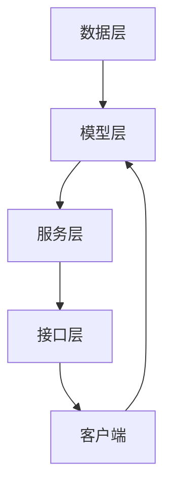

                 

关键词：RESTful API、AI模型服务化、API设计、最佳实践、架构、性能、安全性

> 摘要：本文将探讨如何利用RESTful API设计方法来服务化AI模型，实现高效的、安全的和可扩展的AI服务。通过详细的算法原理、数学模型、项目实践和实际应用场景分析，本文提供了从理论到实践的全面指导，旨在帮助开发者构建优质的AI服务。

## 1. 背景介绍

随着人工智能技术的飞速发展，AI模型已经在各个行业得到了广泛应用。然而，如何有效地部署和提供这些AI模型的服务成为了许多开发者和企业的难题。RESTful API作为一种广泛认可的服务架构风格，为AI模型的服务化提供了良好的基础。本文将围绕RESTful API设计，探讨AI模型服务化的最佳实践。

### 1.1 RESTful API的定义与特点

RESTful API是基于REST（Representational State Transfer）架构风格的网络服务接口。其核心特点包括：

- **资源导向**：API中的所有操作都围绕资源进行，每个资源都有一个唯一的URL。
- **状态转移**：通过HTTP方法（如GET、POST、PUT、DELETE）来表示对资源的操作，实现状态转移。
- **无状态**：服务器不会存储客户端的会话信息，每次请求都是独立的。
- **一致性**：遵循统一的接口规范，方便开发者理解和使用。

### 1.2 AI模型服务化的意义

AI模型服务化是指将AI模型部署为服务，供其他应用程序调用。这样做的好处包括：

- **可重用性**：同一AI模型可以供多个应用程序使用，提高资源利用率。
- **灵活性**：可以根据需求动态调整模型的训练数据和参数。
- **可扩展性**：能够支持高并发请求，满足大规模应用需求。
- **安全性**：通过API接口进行访问控制，保障数据安全。

## 2. 核心概念与联系

### 2.1 RESTful API设计原则

在设计和实现RESTful API时，需要遵循以下原则：

- **资源导向**：所有操作都与资源相关，URL是访问资源的唯一途径。
- **统一接口**：使用统一的HTTP方法（GET、POST、PUT、DELETE）进行操作，遵循统一的响应格式。
- **状态转移**：通过HTTP方法实现状态转移，避免重复提交相同的数据。
- **无状态**：确保每个请求都是独立的，服务器不保存客户端的状态信息。

### 2.2 AI模型服务化架构

AI模型服务化架构通常包括以下几个层次：

- **数据层**：存储训练数据和模型参数。
- **模型层**：包含训练好的AI模型。
- **服务层**：提供RESTful API接口，处理外部请求。
- **接口层**：定义API接口的规范和参数。

### 2.3 Mermaid 流程图

以下是AI模型服务化架构的Mermaid流程图：



## 3. 核心算法原理 & 具体操作步骤

### 3.1 算法原理概述

AI模型服务化的核心算法是模型训练和模型预测。模型训练是指在大量数据上进行训练，调整模型的参数，使其能够准确预测未知数据。模型预测则是使用训练好的模型对新数据进行预测。

### 3.2 算法步骤详解

#### 3.2.1 模型训练

1. 数据预处理：对输入数据进行清洗、归一化等处理。
2. 模型选择：选择适合的模型架构，如神经网络、决策树等。
3. 模型训练：使用训练数据训练模型，调整参数。
4. 模型评估：使用验证集评估模型性能，调整参数。

#### 3.2.2 模型预测

1. 数据预处理：对输入数据进行与训练时相同的预处理。
2. 模型加载：从存储中加载训练好的模型。
3. 预测：使用模型对预处理后的数据进行预测。
4. 响应输出：将预测结果返回给客户端。

### 3.3 算法优缺点

#### 优点：

- **高效性**：通过模型预测，可以快速处理大量数据。
- **灵活性**：可以根据需求动态调整模型和参数。
- **可扩展性**：支持高并发请求，满足大规模应用需求。

#### 缺点：

- **训练成本**：模型训练需要大量计算资源和时间。
- **数据依赖**：模型的性能依赖于训练数据的质量。

### 3.4 算法应用领域

AI模型服务化广泛应用于以下几个领域：

- **金融行业**：风险控制、信用评分、股票预测等。
- **医疗健康**：疾病诊断、健康风险评估、药物推荐等。
- **智能家居**：智能监控、家居控制、设备诊断等。
- **工业制造**：质量检测、设备维护、生产优化等。

## 4. 数学模型和公式 & 详细讲解 & 举例说明

### 4.1 数学模型构建

AI模型通常由以下数学模型构成：

- **损失函数**：衡量模型预测结果与真实值之间的差距，如均方误差（MSE）。
- **优化算法**：用于调整模型参数，使损失函数最小化，如梯度下降。
- **激活函数**：用于非线性变换，如ReLU、Sigmoid等。

### 4.2 公式推导过程

以下是一个简单的神经网络模型：

- **输入层**：$$x_i = \sum_{j=1}^{n} w_{ij} x_j + b_i$$
- **隐藏层**：$$h_i = \sigma(\sum_{j=1}^{n} w_{ij} h_j + b_i)$$
- **输出层**：$$y_i = \sum_{j=1}^{n} w_{ij} y_j + b_i$$

其中，$w_{ij}$是连接权重，$b_i$是偏置，$\sigma$是激活函数。

### 4.3 案例分析与讲解

以下是一个简单的线性回归模型的案例：

#### 模型构建：

- **输入层**：$$x = \sum_{i=1}^{n} w_i x_i + b$$
- **输出层**：$$y = x + b$$

#### 模型训练：

1. 初始化权重$w_i$和偏置$b$。
2. 对于每个训练样本$(x, y)$，计算预测值$y'$。
3. 计算损失函数$MSE = \frac{1}{2} \sum_{i=1}^{n} (y - y')^2$。
4. 更新权重和偏置：$$w_i \leftarrow w_i - \alpha \frac{\partial}{\partial w_i} MSE$$，$$b \leftarrow b - \alpha \frac{\partial}{\partial b} MSE$$

其中，$\alpha$是学习率。

#### 模型预测：

对于新的输入$x$，计算预测值$y' = x + b$。

## 5. 项目实践：代码实例和详细解释说明

### 5.1 开发环境搭建

在本节中，我们将介绍如何搭建一个用于AI模型服务化的开发环境。首先，确保您的系统中安装了以下软件：

- Python（3.6及以上版本）
- Flask（用于创建API服务）
- TensorFlow（用于训练和部署模型）
- Docker（用于容器化服务）

### 5.2 源代码详细实现

以下是一个简单的AI模型服务化项目的源代码实现：

```python
from flask import Flask, request, jsonify
from tensorflow.keras.models import load_model

app = Flask(__name__)

# 加载训练好的模型
model = load_model('model.h5')

@app.route('/predict', methods=['POST'])
def predict():
    data = request.get_json(force=True)
    input_data = [data['feature']]
    prediction = model.predict(input_data)
    return jsonify({'prediction': prediction[0]})

if __name__ == '__main__':
    app.run(debug=True)
```

### 5.3 代码解读与分析

1. **加载模型**：使用`load_model`函数加载已经训练好的Keras模型。
2. **创建API接口**：定义一个名为`/predict`的API接口，处理POST请求。
3. **处理请求**：获取请求中的JSON数据，将其转换为模型的输入。
4. **预测**：使用加载的模型进行预测，并将预测结果返回。

### 5.4 运行结果展示

启动Flask应用后，您可以使用curl或Postman等工具发送POST请求到`http://localhost:5000/predict`，获取模型的预测结果。

## 6. 实际应用场景

### 6.1 金融风控

在金融行业，AI模型服务化可以用于实时风险评估。例如，银行可以使用服务化的AI模型来评估贷款申请者的信用风险，快速做出决策。

### 6.2 智能家居

智能家居设备可以使用AI模型服务化来实现智能控制。例如，智能摄像头可以实时分析视频流，识别家中成员的活动，并据此调整灯光和温度。

### 6.3 医疗诊断

在医疗领域，AI模型服务化可以帮助医生进行疾病诊断。例如，使用AI模型服务化系统，医生可以快速获取患者的病历信息，并得到初步的诊断结果。

## 7. 工具和资源推荐

### 7.1 学习资源推荐

- 《API设计：原则、实践与模式》（API Design: Principles, Patterns, and Pr

