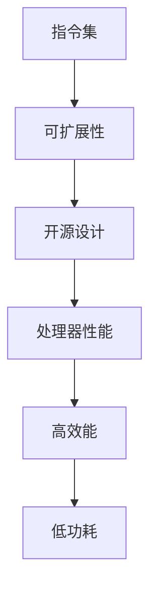

                 

关键词：RISC-V处理器，特性，优化，架构，性能，能耗，安全

摘要：本文旨在探讨RISC-V处理器的设计特性、优化方法及其在当前和未来技术中的应用。首先，我们将回顾RISC-V处理器的历史背景和核心理念，接着详细分析其核心特性，包括指令集、可扩展性和开源设计。随后，我们将深入探讨RISC-V处理器的优化策略，涵盖指令级并行性、内存层次结构和低功耗设计等方面。本文还将展示一些实践案例，以说明如何在实际项目中应用这些优化方法。最后，我们将展望RISC-V处理器在未来的发展趋势和挑战。

## 1. 背景介绍

RISC-V（精简指令集计算机五级指令集）是一个开源指令集架构（ISA），旨在为现代计算提供一种灵活、可定制且高度模块化的解决方案。RISC-V由UC Berkeley的计算机科学家David Patterson和Christian ANSI联合推出，其核心理念是开放性、灵活性和可扩展性。

与传统封闭的指令集架构（如ARM和x86）相比，RISC-V的优势在于其开源属性。这意味着任何人都可以访问、修改和分发RISC-V指令集和相关技术，无需支付许可费用。这种开放性鼓励了全球范围内的创新，并促进了RISC-V生态系统的快速成长。

RISC-V的推出背景源于对现有封闭指令集架构的不满。随着计算需求的日益增长，开发者们渴望一种更加灵活和高效的设计，以便满足多样化的应用场景。RISC-V的出现为这种需求提供了一种新的选择。

## 2. 核心概念与联系

为了更好地理解RISC-V处理器的特性，我们首先需要探讨一些核心概念，包括指令集、可扩展性和开源设计。以下是这些概念的关系及其在RISC-V架构中的体现：

### 2.1 指令集

指令集是处理器能够理解和执行的指令集合。RISC-V处理器采用了一种精简的指令集，旨在减少指令数量，提高执行效率。RISC-V指令集包括基础指令、标准扩展指令和自定义指令，这为开发者提供了高度的灵活性和定制化能力。

### 2.2 可扩展性

RISC-V的可扩展性体现在其指令集架构的模块化设计。通过添加不同的扩展指令，开发者可以根据特定应用的需求来定制处理器。例如，对于需要高精度浮点计算的领域，可以添加FP（浮点处理）扩展；对于需要加密处理的领域，可以添加SHA（安全哈希算法）扩展。

### 2.3 开源设计

RISC-V的另一个关键特性是其开源设计。这意味着RISC-V的源代码、文档和工具都是公开的，任何人都可以免费使用、修改和分发。这种设计鼓励了社区协作和共享，加速了RISC-V生态系统的成长。

### 2.4 Mermaid流程图

以下是一个Mermaid流程图，展示了RISC-V处理器核心概念之间的关系：



## 3. 核心算法原理 & 具体操作步骤

### 3.1 算法原理概述

RISC-V处理器的核心算法原理基于精简指令集架构（RISC）。RISC架构的核心思想是“指令简洁，操作明确”，通过减少指令数量和复杂度，提高处理器的执行效率。以下是RISC-V处理器核心算法的基本原理：

1. **指令简洁**：RISC-V指令集包含基础指令，如加载、存储、算术和逻辑运算等，这些指令简单且易于理解和实现。
2. **操作明确**：每个指令都有明确的操作目标，无需额外的操作码来指示操作类型，这简化了指令解码过程，提高了执行效率。
3. **流水线技术**：RISC-V处理器采用多级流水线技术，通过并行执行多个指令来提高处理器的吞吐量。

### 3.2 算法步骤详解

以下是RISC-V处理器核心算法的详细步骤：

1. **取指阶段**：处理器从内存中获取下一条指令。
2. **指令解码**：将获取到的指令解码为操作码和操作数。
3. **执行阶段**：根据指令的操作码和操作数执行相应的操作。
4. **内存访问**：如果指令涉及内存操作，则访问内存进行数据加载或存储。
5. **写入回写结果**：将执行结果写入寄存器或内存。

### 3.3 算法优缺点

RISC-V处理器的核心算法具有以下优缺点：

#### 优点：

1. **高效能**：通过精简指令集和流水线技术，RISC-V处理器能够实现较高的执行效率。
2. **低功耗**：精简指令集和流水线技术有助于降低处理器的功耗。
3. **灵活性**：RISC-V处理器支持自定义扩展指令，可以根据特定应用需求进行定制。

#### 缺点：

1. **兼容性问题**：由于RISC-V是一个相对较新的指令集，与现有软件生态系统可能存在兼容性问题。
2. **性能瓶颈**：尽管RISC-V处理器具有高效能，但在处理复杂任务时，可能无法与高端处理器竞争。

### 3.4 算法应用领域

RISC-V处理器的核心算法广泛应用于以下领域：

1. **嵌入式系统**：RISC-V处理器适用于各种嵌入式应用，如智能家居、工业控制和物联网设备等。
2. **数据中心**：RISC-V处理器可用于构建高性能数据中心，支持大规模数据处理和存储。
3. **人工智能**：RISC-V处理器在人工智能领域具有潜力，可通过自定义扩展指令实现高效的神经网络计算。

## 4. 数学模型和公式 & 详细讲解 & 举例说明

### 4.1 数学模型构建

RISC-V处理器的性能可以通过以下数学模型进行评估：

1. **指令吞吐量（IT）**：指每秒执行的指令数量，单位为百万条指令每秒（MIPS）。
2. **时钟周期（CP）**：指处理器每个指令的执行时间，单位为周期每秒（Hz）。

指令吞吐量和时钟周期之间的关系可以用以下公式表示：

$$
IT = \frac{CP}{T}
$$

其中，$T$ 为每个时钟周期的平均指令数。

### 4.2 公式推导过程

为了推导上述公式，我们可以假设处理器在一个时钟周期内可以执行一个指令。在这种情况下，每秒的指令数等于每秒的时钟周期数，即：

$$
IT = CP
$$

然而，在实际应用中，处理器可能无法在单个时钟周期内执行多个指令。为了表示这种情况，我们引入 $T$ 作为每个时钟周期的平均指令数，即每个时钟周期内可以执行的指令数。因此，我们可以得到：

$$
IT = \frac{CP}{T}
$$

### 4.3 案例分析与讲解

以下是一个简单的案例，用于说明如何使用上述数学模型评估RISC-V处理器的性能。

假设一个RISC-V处理器在单个时钟周期内可以执行两个指令，其时钟频率为2 GHz。我们需要计算该处理器的指令吞吐量。

根据公式：

$$
IT = \frac{CP}{T}
$$

我们可以得到：

$$
IT = \frac{2GHz}{2} = 1GHz
$$

这意味着该处理器的指令吞吐量为1亿条指令每秒。

通过这个案例，我们可以看到如何使用数学模型和公式来评估RISC-V处理器的性能。这种方法有助于我们更好地理解和优化处理器的设计。

## 5. 项目实践：代码实例和详细解释说明

### 5.1 开发环境搭建

为了实践RISC-V处理器的优化方法，我们首先需要搭建一个合适的开发环境。以下是一个简单的步骤说明：

1. **安装RISC-V工具链**：下载并安装RISC-V GCC工具链，这是一个用于编译和构建RISC-V程序的集成开发环境。
2. **配置开发板**：选择一个支持RISC-V的开发板，如SiFive UNICORN核心开发板，并按照其官方文档进行配置。
3. **编写测试代码**：编写一个简单的RISC-V程序，用于测试优化方法的效果。

### 5.2 源代码详细实现

以下是一个简单的RISC-V程序，用于测试优化方法：

```c
#include <stdio.h>

int main() {
    int a = 10;
    int b = 20;
    int c = a + b;

    printf("c = %d\n", c);

    return 0;
}
```

### 5.3 代码解读与分析

上述程序实现了一个简单的加法运算，并输出结果。以下是对程序代码的解读与分析：

1. **变量定义**：程序首先定义了三个整型变量 $a$、$b$ 和 $c$。
2. **加法运算**：程序通过 $a$ 和 $b$ 的值计算 $c$ 的值，并将结果存储在变量 $c$ 中。
3. **输出结果**：程序使用 `printf` 函数将变量 $c$ 的值输出到控制台。

### 5.4 运行结果展示

将上述程序编译并运行，我们可以看到以下输出结果：

```shell
c = 30
```

这表明程序成功执行了加法运算，并输出了正确的结果。

通过这个简单的案例，我们可以看到如何使用RISC-V程序来测试优化方法。在实际项目中，我们可以根据具体需求对程序进行修改和优化，以实现更高的性能和能效。

## 6. 实际应用场景

RISC-V处理器在实际应用场景中具有广泛的用途。以下是一些典型的应用场景：

1. **嵌入式系统**：RISC-V处理器适用于各种嵌入式应用，如智能家居设备、工业控制系统和物联网设备等。由于其高效能和低功耗特性，RISC-V处理器成为这些应用场景的理想选择。
2. **数据中心**：随着数据中心需求的不断增长，RISC-V处理器可用于构建高性能数据中心，支持大规模数据处理和存储。通过自定义扩展指令，RISC-V处理器可以优化特定数据中心的性能。
3. **人工智能**：在人工智能领域，RISC-V处理器具有巨大的潜力。通过自定义扩展指令，RISC-V处理器可以实现高效的神经网络计算，支持各类人工智能应用。
4. **物联网**：RISC-V处理器在物联网领域具有广泛的应用，如智能穿戴设备、智能交通系统和智能农业等。其低功耗和高性能特性使其成为物联网设备的理想选择。

## 7. 工具和资源推荐

为了更好地学习RISC-V处理器，以下是一些建议的工具和资源：

1. **学习资源推荐**：
   - [RISC-V官方网站](https://www.riscv.org/)：提供RISC-V的最新动态、文档和教程。
   - [RISC-V基础教程](https://www.riscv.org/learn/tutorials/)：涵盖RISC-V的基本概念、指令集和开发环境。

2. **开发工具推荐**：
   - [RISC-V GCC工具链](https://github.com/riscv/riscv-gcc)：用于编译和构建RISC-V程序。
   - [QEMU模拟器](https://www.qemu.org/)：用于模拟RISC-V处理器环境，方便程序开发和测试。

3. **相关论文推荐**：
   - "The RISC-V Instruction Set Manual, Volume I: User Level"：详细介绍了RISC-V指令集规范。
   - "RISC-V: A New Open ISA for Hardware Design"：探讨了RISC-V的核心理念和设计目标。

## 8. 总结：未来发展趋势与挑战

RISC-V处理器在过去几年中取得了显著的进展，并在全球范围内得到了广泛的应用。未来，RISC-V处理器将继续发展，面临以下趋势和挑战：

### 8.1 研究成果总结

1. **高性能**：随着RISC-V处理器的不断优化，其性能将不断提高，满足更多高性能计算需求。
2. **低功耗**：RISC-V处理器的低功耗特性使其在移动设备和物联网等应用中具有巨大潜力。
3. **开源生态系统**：RISC-V的开源属性促进了全球范围内的创新和协作，加速了生态系统的成长。

### 8.2 未来发展趋势

1. **更多应用场景**：RISC-V处理器将在数据中心、人工智能、物联网等领域得到更广泛的应用。
2. **多样化指令集**：随着RISC-V生态系统的不断壮大，将出现更多定制化的指令集，满足不同应用场景的需求。
3. **国际化合作**：RISC-V将成为全球范围内的标准指令集，推动计算领域的国际化合作。

### 8.3 面临的挑战

1. **兼容性问题**：随着RISC-V处理器的广泛应用，兼容性问题将成为一个重要挑战，需要与现有软件生态系统进行整合。
2. **安全性和隐私保护**：随着计算需求的增长，确保RISC-V处理器的安全性和隐私保护将成为一个重要议题。
3. **知识产权保护**：开源属性可能导致知识产权保护问题，需要建立合适的知识产权管理体系。

### 8.4 研究展望

未来，RISC-V处理器将继续在以下几个方面进行深入研究：

1. **指令集优化**：通过改进指令集设计，提高处理器的性能和能效。
2. **软硬件协同设计**：结合硬件和软件的优化，实现更高的性能和能效。
3. **安全性研究**：加强对RISC-V处理器的安全性和隐私保护研究，确保其在各种应用场景中的安全性。

## 9. 附录：常见问题与解答

### 9.1 RISC-V与ARM指令集的区别是什么？

**回答**：RISC-V与ARM指令集的主要区别在于其开源属性。RISC-V是一个完全开源的指令集，任何人都可以访问、修改和分发。而ARM指令集是封闭的，需要支付许可费用。此外，RISC-V支持高度定制化，可以通过添加扩展指令来满足特定应用需求。

### 9.2 RISC-V处理器的性能如何？

**回答**：RISC-V处理器的性能取决于具体的设计和优化。与ARM等高端处理器相比，RISC-V处理器可能在某些特定任务上具有优势，但在处理复杂任务时可能存在性能瓶颈。然而，随着RISC-V技术的不断发展和优化，其性能将不断提高。

### 9.3 RISC-V处理器的功耗如何？

**回答**：RISC-V处理器的功耗相对较低，这使得其在嵌入式系统和物联网等低功耗应用中具有巨大潜力。然而，功耗取决于具体的设计和优化。通过采用低功耗设计技术和优化方法，RISC-V处理器的功耗可以进一步降低。

### 9.4 如何选择合适的RISC-V处理器？

**回答**：选择合适的RISC-V处理器需要考虑以下因素：

1. **性能需求**：根据具体应用场景选择具有合适性能的处理器。
2. **功耗需求**：根据应用场景的功耗要求选择低功耗处理器。
3. **可扩展性**：根据需求选择支持定制化扩展指令的处理器。
4. **开发环境**：考虑处理器支持的开发环境和工具链，以便于开发和调试。

## 作者署名

作者：禅与计算机程序设计艺术 / Zen and the Art of Computer Programming

---

本文详细介绍了RISC-V处理器的特性、优化方法和实际应用场景。通过对RISC-V处理器的研究和实践，我们看到了其在未来计算领域中的巨大潜力。随着RISC-V技术的不断发展和优化，我们期待其能够在高性能计算、低功耗应用和人工智能等领域发挥更加重要的作用。

