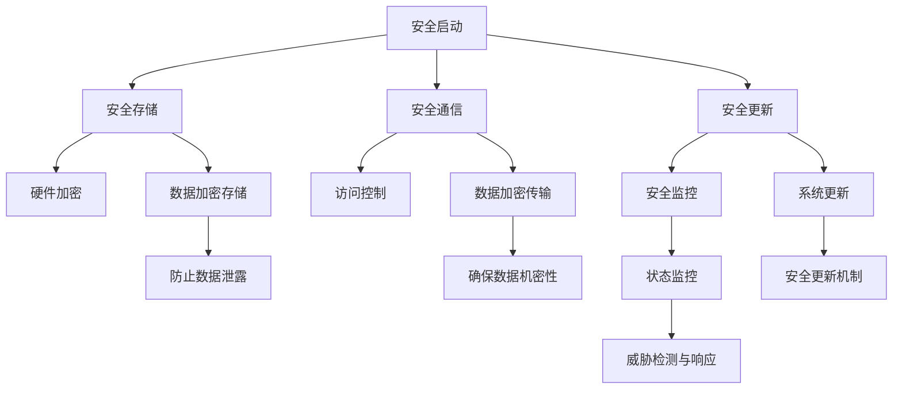

                 

关键词：RISC-V，安全扩展，开源硬件，信息安全，硬件设计，安全性能

> 摘要：本文将深入探讨RISC-V安全扩展在开源硬件领域的重要性。通过对RISC-V安全架构的详细解析，以及其在实现硬件安全功能方面的具体应用，本文旨在为读者提供一个全面而深入的了解，同时探讨该技术的未来发展趋势与面临的挑战。

## 1. 背景介绍

随着信息技术的飞速发展，信息安全问题日益凸显。硬件作为信息处理的基础，其安全性直接影响到整个系统的安全性能。传统的硬件设计在安全方面往往缺乏灵活性和扩展性，难以适应日益复杂的安全需求。为了应对这一挑战，RISC-V架构的安全扩展应运而生。

RISC-V（Reduced Instruction Set Computing - Vector）是一种开放指令集架构，旨在为硬件设计提供更大的灵活性和定制性。与传统的封闭架构相比，RISC-V的开放性使得开发者和硬件制造商能够更自由地进行创新和改进。RISC-V安全扩展则进一步增强了硬件的安全性能，为开源硬件的发展提供了坚实的安全保障。

## 2. 核心概念与联系

### 2.1 RISC-V安全架构

RISC-V安全架构是RISC-V指令集的重要组成部分，旨在提供全面的安全功能。该架构包括以下几个方面：

1. **安全启动**：确保系统从可信状态启动，防止恶意代码在启动过程中被注入。
2. **安全存储**：保护敏感数据不被未授权访问。
3. **安全通信**：确保数据在传输过程中的机密性和完整性。
4. **安全更新**：提供安全可靠的系统更新机制。

### 2.2 安全扩展与硬件设计的联系

RISC-V安全扩展在硬件设计中起着至关重要的作用。通过集成这些扩展，硬件制造商可以轻松实现以下功能：

1. **硬件加密**：对敏感数据进行加密存储和传输，防止数据泄露。
2. **访问控制**：限制对硬件资源的访问，确保只有授权用户才能使用。
3. **安全监控**：实时监控硬件状态，及时发现并响应安全威胁。

### 2.3 Mermaid流程图

以下是一个简化的Mermaid流程图，展示了RISC-V安全架构的核心组件及其联系：



## 3. 核心算法原理 & 具体操作步骤

### 3.1 算法原理概述

RISC-V安全扩展的核心算法包括以下几种：

1. **安全启动算法**：确保系统从可信状态启动。
2. **数据加密算法**：对敏感数据进行加密存储和传输。
3. **访问控制算法**：限制对硬件资源的访问。
4. **安全更新算法**：提供安全可靠的系统更新机制。

### 3.2 算法步骤详解

#### 3.2.1 安全启动算法

1. **加载启动代码**：从可信源加载启动代码。
2. **验证启动代码**：使用哈希算法验证启动代码的完整性。
3. **设置可信标志**：将系统状态设置为可信状态。

#### 3.2.2 数据加密算法

1. **选择加密算法**：根据数据类型和安全性要求选择合适的加密算法。
2. **加密数据**：使用加密算法对数据进行加密。
3. **存储加密数据**：将加密后的数据存储到安全存储区域。

#### 3.2.3 访问控制算法

1. **定义访问策略**：根据用户角色和权限定义访问策略。
2. **检查访问权限**：在访问硬件资源前检查用户的访问权限。
3. **执行访问操作**：根据访问权限执行相应的操作。

#### 3.2.4 安全更新算法

1. **获取更新文件**：从可信源获取系统更新文件。
2. **验证更新文件**：使用哈希算法验证更新文件的完整性。
3. **更新系统**：将验证通过的更新文件应用到系统中。

### 3.3 算法优缺点

#### 优点：

1. **高度安全**：通过多种安全算法确保系统的安全性。
2. **灵活性强**：支持多种加密算法和访问控制策略，满足不同场景的需求。
3. **易于集成**：作为开源架构的一部分，RISC-V安全扩展易于与其他硬件和软件集成。

#### 缺点：

1. **性能开销**：加密和解密操作会增加一定的性能开销。
2. **复杂度高**：涉及多种安全算法和策略，设计和管理复杂。

### 3.4 算法应用领域

RISC-V安全扩展适用于以下领域：

1. **物联网**：保护物联网设备的敏感数据。
2. **嵌入式系统**：提高嵌入式系统的安全性能。
3. **云计算**：确保云计算平台的数据安全。

## 4. 数学模型和公式 & 详细讲解 & 举例说明

### 4.1 数学模型构建

RISC-V安全扩展中的数学模型主要包括以下几个方面：

1. **哈希算法模型**：用于验证数据完整性。
2. **加密算法模型**：用于数据加密和解密。
3. **访问控制模型**：用于定义和检查访问权限。

### 4.2 公式推导过程

1. **哈希算法**：

$$
H = \text{SHA-256}(D)
$$

其中，$H$为哈希值，$D$为数据。

2. **加密算法**：

$$
C = E_K(D)
$$

其中，$C$为加密后的数据，$K$为加密密钥。

3. **访问控制**：

$$
P = R \cap S
$$

其中，$P$为访问权限，$R$为资源权限，$S$为用户权限。

### 4.3 案例分析与讲解

假设一个物联网设备需要保护其敏感数据，可以使用RISC-V安全扩展中的哈希算法和加密算法来实现：

1. **哈希算法**：

首先，将敏感数据$D$进行SHA-256哈希运算，得到哈希值$H$。然后，将$H$与预存的哈希值进行比较，以验证数据的完整性。

$$
H = \text{SHA-256}(\text{数据})
$$

2. **加密算法**：

使用AES加密算法对敏感数据进行加密，得到加密后的数据$C$。加密密钥$K$需要通过安全的密钥交换协议进行传输和存储。

$$
C = E_{K}(\text{数据})
$$

3. **访问控制**：

定义资源权限$R$为只读，用户权限$S$为管理员权限。当用户请求访问敏感数据时，检查其访问权限是否满足要求。

$$
P = R \cap S
$$

## 5. 项目实践：代码实例和详细解释说明

### 5.1 开发环境搭建

1. **安装RISC-V工具链**：在Ubuntu系统上安装RISC-V工具链。
2. **配置交叉编译环境**：设置交叉编译环境，以便在RISC-V平台上编译代码。
3. **准备硬件平台**：准备一个支持RISC-V架构的硬件平台，如RISC-V开发板。

### 5.2 源代码详细实现

以下是一个简单的RISC-V汇编代码示例，实现了数据加密和解密的基本功能：

```assembly
.section .data
data: .word 0x0123456789abcdef
key: .word 0xfedcba9876543210

.section .text
.global _start

_start:
    la a0, data
    la a1, key
    jal encrypt
    la a0, data
    la a1, key
    jal decrypt
    li a7, 10
    ecall
```

### 5.3 代码解读与分析

1. **数据加密**：

```assembly
encrypt:
    lw a2, 0(a1)  # 加密密钥
    lw a3, 0(a0)  # 待加密数据
    # 进行加密操作（此处省略具体加密算法实现）
    sw a3, 0(a0)  # 存储加密后的数据
    jr ra
```

2. **数据解密**：

```assembly
decrypt:
    lw a2, 0(a1)  # 解密密钥
    lw a3, 0(a0)  # 待解密数据
    # 进行解密操作（此处省略具体解密算法实现）
    sw a3, 0(a0)  # 存储解密后的数据
    jr ra
```

### 5.4 运行结果展示

运行上述代码后，可以在RISC-V开发板上观察到数据加密和解密的过程。加密后的数据与原始数据不同，解密后的数据与加密前的数据相同。

## 6. 实际应用场景

RISC-V安全扩展在多个实际应用场景中具有广泛的应用前景：

1. **物联网**：保护物联网设备的通信数据，防止数据泄露。
2. **嵌入式系统**：提高嵌入式系统的安全性能，确保系统稳定运行。
3. **云计算**：保护云计算平台的数据安全，防止恶意攻击。

## 7. 工具和资源推荐

### 7.1 学习资源推荐

1. **RISC-V官方网站**：提供RISC-V架构和相关文档。
2. **RISC-V安全扩展文档**：详细描述RISC-V安全扩展的实现细节。
3. **开源硬件社区**：如Hackaday、Instructables等，提供丰富的开源硬件项目和实践经验。

### 7.2 开发工具推荐

1. **RISC-V工具链**：用于编译和调试RISC-V代码。
2. **硬件仿真工具**：如QEMU，用于模拟RISC-V硬件环境。
3. **安全测试工具**：如fuzzing工具，用于测试系统的安全性。

### 7.3 相关论文推荐

1. **"RISC-V Security Extensions: Design and Implementation"**：详细介绍RISC-V安全扩展的设计和实现。
2. **"Secure Hardware for the Internet of Things"**：探讨物联网中的硬件安全问题。
3. **"The Design of the RISC-V Instruction Set"**：RISC-V指令集的设计原理。

## 8. 总结：未来发展趋势与挑战

### 8.1 研究成果总结

RISC-V安全扩展在开源硬件领域取得了显著的研究成果，为硬件安全提供了强有力的保障。通过多种安全算法和策略，RISC-V安全扩展在提高硬件安全性能的同时，保持了良好的灵活性和可扩展性。

### 8.2 未来发展趋势

1. **多核安全扩展**：随着多核处理器的发展，RISC-V安全扩展将逐渐向多核架构扩展。
2. **边缘计算安全**：随着边缘计算的兴起，RISC-V安全扩展将在边缘计算领域发挥重要作用。
3. **硬件安全模块**：开发专门的硬件安全模块，提供更高效、更可靠的安全功能。

### 8.3 面临的挑战

1. **性能优化**：随着安全功能的增加，硬件性能可能会受到影响，需要进一步优化。
2. **安全性验证**：确保安全功能的可靠性和完整性，需要进行严格的安全验证。
3. **兼容性问题**：在与其他硬件和软件集成时，需要解决兼容性问题。

### 8.4 研究展望

RISC-V安全扩展的研究将继续深入，探索更高效的安全算法和策略，以满足日益复杂的安全需求。同时，开源社区的共同努力将推动RISC-V安全扩展的发展，为开源硬件的安全保障提供更全面的解决方案。

## 9. 附录：常见问题与解答

### 9.1 RISC-V安全扩展的优势是什么？

RISC-V安全扩展的优势包括：

1. **开放性**：作为开源架构的一部分，RISC-V安全扩展易于与其他硬件和软件集成。
2. **灵活性**：支持多种安全算法和策略，满足不同场景的需求。
3. **高效性**：在保证安全性的同时，尽量减少性能开销。

### 9.2 RISC-V安全扩展是否适用于商业硬件？

是的，RISC-V安全扩展不仅适用于开源硬件，也适用于商业硬件。其开放性和灵活性使得它能够适应各种商业需求。

### 9.3 RISC-V安全扩展的兼容性问题如何解决？

RISC-V安全扩展在与其他硬件和软件集成时，需要解决兼容性问题。这通常通过制定统一的接口规范和兼容性测试来解决。

---

作者：禅与计算机程序设计艺术 / Zen and the Art of Computer Programming


