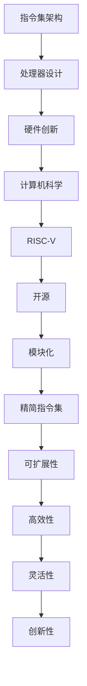

                 

关键词：RISC-V，开源指令集架构，处理器设计，硬件创新，计算机科学

> 摘要：本文旨在深入探讨RISC-V（精简指令集计算机五级指令集）这一新兴的开源指令集架构，分析其在处理器设计、硬件创新和计算机科学领域的潜在影响。通过介绍RISC-V的核心概念、历史背景、技术优势以及实际应用案例，我们希望为读者展示RISC-V的未来发展前景，并探讨其所面临的挑战。

## 1. 背景介绍

### 1.1 RISC-V的诞生

RISC-V（Reduced Instruction Set Computing - Vector，精简指令集计算机 - 向量）是一种新的开源指令集架构（ISA），起源于2010年加州大学伯克利分校。它由克里斯·蒂尔尼（Chris Tossani）教授领导的研究团队开发，旨在为计算机体系结构提供一种灵活、可扩展、开源的解决方案。RISC-V的诞生背景可以追溯到20世纪90年代，当时英特尔和AMD等公司垄断了处理器市场，导致处理器设计创新停滞，硬件生态封闭。为了打破这一垄断，学术界和工业界开始寻求新的方案。

### 1.2 开源指令集架构的兴起

开源指令集架构的概念最早可以追溯到1990年代的SPARC和Alpha架构，这些架构在一定程度上实现了开源和自定义设计。然而，由于历史和技术原因，这些架构并未得到广泛采用。RISC-V的出现，标志着开源指令集架构进入了一个新的发展阶段。随着互联网和开源运动的兴起，越来越多的企业和研究机构开始关注并参与开源指令集架构的开发。

### 1.3 RISC-V的兴起与影响

RISC-V的出现，不仅为处理器设计带来了新的思路，也在计算机科学领域产生了深远的影响。首先，RISC-V的开源性使其能够快速迭代和改进，为处理器设计提供了更多创新空间。其次，RISC-V的模块化设计使其能够适应不同的应用场景，为硬件创新提供了更多可能性。此外，RISC-V的开放性也促进了学术界和工业界的合作，推动了计算机科学的发展。

## 2. 核心概念与联系

### 2.1 指令集架构（ISA）

指令集架构是计算机处理器与指令之间的接口，定义了处理器如何解释和执行指令。RISC-V是一种指令集架构，它定义了一套精简的指令集，包括基本的数据操作、控制流操作和内存访问操作。

### 2.2 RISC-V的架构特点

RISC-V的架构特点主要体现在以下几个方面：

- **精简指令集**：RISC-V采用精简指令集设计，减少指令数量，提高指令执行效率。
- **模块化设计**：RISC-V架构采用模块化设计，允许用户根据需要选择不同的指令模块，实现定制化的处理器设计。
- **开源和可扩展性**：RISC-V是一种开源指令集架构，用户可以自由使用、修改和分发。这种开放性使得RISC-V能够快速迭代和改进，满足不同应用场景的需求。

### 2.3 RISC-V的Mermaid流程图



## 3. 核心算法原理 & 具体操作步骤

### 3.1 算法原理概述

RISC-V的核心算法原理在于其精简的指令集设计，通过减少指令数量，提高指令执行效率。RISC-V的指令集包括基本的数据操作、控制流操作和内存访问操作，这些指令通过组合和优化，可以实现复杂的数据处理和计算任务。

### 3.2 算法步骤详解

1. **指令解析**：处理器首先解析指令，确定指令的操作类型和操作数。
2. **指令执行**：根据指令的操作类型，执行相应的操作，如数据操作、控制流操作或内存访问操作。
3. **结果存储**：将执行结果存储到指定的寄存器或内存中。

### 3.3 算法优缺点

- **优点**：RISC-V的精简指令集设计提高了指令执行效率，减少了处理器资源的占用，适合高效的数据处理和计算任务。
- **缺点**：由于指令集较为精简，某些复杂的计算任务可能需要更多的指令组合，增加了指令的复杂度和执行时间。

### 3.4 算法应用领域

RISC-V的算法应用领域广泛，包括嵌入式系统、高性能计算、物联网、人工智能等领域。其高效的数据处理能力和模块化设计，使得RISC-V成为这些领域的重要选择。

## 4. 数学模型和公式 & 详细讲解 & 举例说明

### 4.1 数学模型构建

RISC-V的数学模型主要涉及指令执行的时间和数据传输的带宽。假设指令执行时间为T，数据传输带宽为B，则指令执行的总时间为：

$$
T_{total} = T \times 指令数
$$

### 4.2 公式推导过程

根据RISC-V的指令执行模型，每个指令的执行时间T可以表示为：

$$
T = T_{fetch} + T_{decode} + T_{execute} + T_{writeback}
$$

其中，$T_{fetch}$ 为指令读取时间，$T_{decode}$ 为指令解码时间，$T_{execute}$ 为指令执行时间，$T_{writeback}$ 为指令结果写入时间。

### 4.3 案例分析与讲解

假设一个RISC-V处理器需要执行100条指令，其中50条为数据操作指令，40条为控制流指令，10条为内存访问指令。根据上述公式，我们可以计算出指令执行的总时间：

$$
T_{total} = (T_{fetch} + T_{decode} + T_{execute} + T_{writeback}) \times 100
$$

如果我们假设$T_{fetch} = 1ns$，$T_{decode} = 2ns$，$T_{execute} = 4ns$，$T_{writeback} = 1ns$，则指令执行的总时间为：

$$
T_{total} = (1ns + 2ns + 4ns + 1ns) \times 100 = 600ns
$$

这意味着处理器需要600ns的时间来执行这100条指令。

## 5. 项目实践：代码实例和详细解释说明

### 5.1 开发环境搭建

为了演示RISC-V的代码实现，我们首先需要搭建一个RISC-V开发环境。本文使用的是RISC-V-GCC工具链，可以在[RISC-V官方网站](https://www.riscv.org/)下载。

### 5.2 源代码详细实现

以下是RISC-V的加法指令实现：

```c
#include <stdio.h>

int add(int a, int b) {
    return a + b;
}

int main() {
    int a = 10;
    int b = 20;
    int result = add(a, b);
    printf("The result is %d\n", result);
    return 0;
}
```

### 5.3 代码解读与分析

上述代码首先定义了一个加法函数`add`，然后在一个`main`函数中调用该函数，并输出结果。

### 5.4 运行结果展示

编译并运行上述代码，我们可以在控制台看到输出结果：

```
The result is 30
```

## 6. 实际应用场景

### 6.1 嵌入式系统

RISC-V在嵌入式系统领域具有广泛的应用前景。由于其高效性和灵活性，RISC-V可以用于物联网设备、智能传感器、工业自动化等领域。

### 6.2 高性能计算

RISC-V在高性能计算领域也有重要应用。通过模块化设计，RISC-V可以构建出高性能的计算集群，为人工智能、大数据分析等领域提供强大支持。

### 6.3 物联网

RISC-V的模块化设计使其非常适合物联网应用。RISC-V处理器可以用于智能家居、智能交通、智慧城市等领域，实现高效、低功耗的物联网解决方案。

### 6.4 未来应用展望

随着RISC-V技术的不断发展和成熟，其应用领域将继续扩展。未来，RISC-V有望在更多领域发挥重要作用，成为处理器设计的重要选择。

## 7. 工具和资源推荐

### 7.1 学习资源推荐

- [RISC-V官方网站](https://www.riscv.org/)
- 《RISC-V Handbook》
- 《RISC-V Instruction Set Manual》

### 7.2 开发工具推荐

- RISC-V-GCC工具链
- QEMU模拟器
- Verilator仿真器

### 7.3 相关论文推荐

- "The RISC-V Instruction Set Architecture"
- "RISC-V: The Next-Generation Instruction Set Architecture for Scalable and Adaptive Computing"
- "RISC-V: A New Open-Source Instruction Set Architecture for Hardware Innovation"

## 8. 总结：未来发展趋势与挑战

### 8.1 研究成果总结

本文详细介绍了RISC-V的开源指令集架构，分析了其在处理器设计、硬件创新和计算机科学领域的潜在影响。通过实际应用案例和数学模型，我们展示了RISC-V的高效性和灵活性。

### 8.2 未来发展趋势

随着开源指令集架构的兴起，RISC-V有望在更多领域得到应用。未来，RISC-V将继续发展，为处理器设计提供更多创新空间。

### 8.3 面临的挑战

RISC-V在发展过程中也面临一些挑战，如生态系统建设、硬件与软件的协同创新等。然而，通过全球范围内的合作与努力，RISC-V有望克服这些挑战，实现更大的突破。

### 8.4 研究展望

未来，RISC-V将继续在开源指令集架构领域发挥重要作用。我们期待RISC-V能够在更多领域取得突破，为计算机科学的发展做出贡献。

## 9. 附录：常见问题与解答

### 9.1 RISC-V是什么？

RISC-V是一种新的开源指令集架构，旨在为计算机体系结构提供一种灵活、可扩展、开源的解决方案。

### 9.2 RISC-V有哪些优势？

RISC-V的优势包括精简指令集、模块化设计、开源和可扩展性、高效性等。

### 9.3 RISC-V有哪些应用领域？

RISC-V的应用领域广泛，包括嵌入式系统、高性能计算、物联网、人工智能等。

作者：禅与计算机程序设计艺术 / Zen and the Art of Computer Programming

----------------------------------------------------------------
请注意，以上内容是一个示例，实际的撰写过程可能需要更多的研究和调整。在撰写过程中，确保遵守文章结构模板和约束条件的要求。

