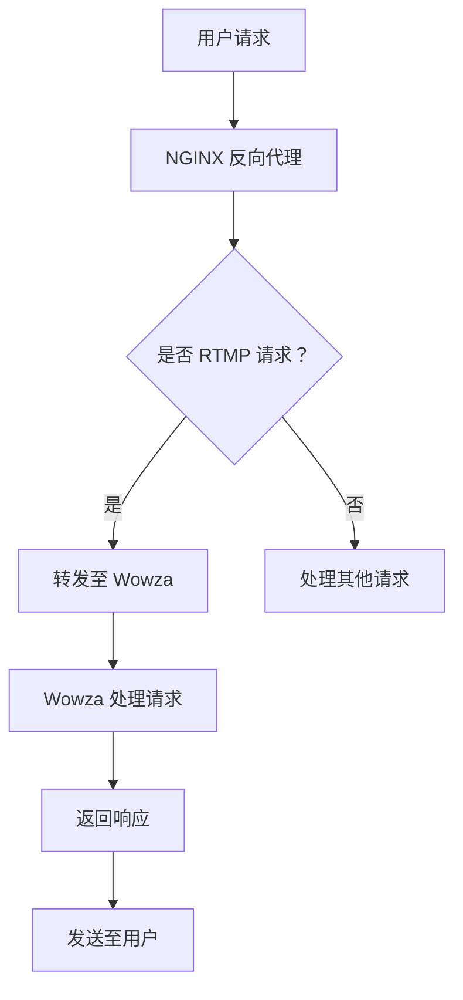

                 

关键词：RTMP，流媒体，NGINX，Wowza，实时传输，视频直播，技术搭建，服务架构，性能优化。

> 摘要：本文将详细介绍如何使用 NGINX 和 Wowza 搭建 RTMP 流媒体服务，实现高质量的实时视频传输。通过具体的操作步骤、代码实例以及性能优化策略，帮助读者深入了解 RTMP 技术的实战应用。

## 1. 背景介绍

随着互联网技术的飞速发展，流媒体服务已经深入到了我们日常生活的方方面面。无论是视频直播、点播服务，还是在线教育、远程会议，流媒体技术都扮演着至关重要的角色。RTMP（Real-Time Messaging Protocol）作为一种实时传输协议，因其低延迟、高带宽利用率等优势，被广泛应用于各类流媒体应用中。

NGINX 是一款高性能的 Web 服务器和反向代理服务器，它以其轻量级、稳定性高、配置灵活等特点，受到了众多开发者和运维人员的青睐。而 Wowza 则是一款功能强大的流媒体服务器软件，支持多种视频编码格式和传输协议，能够提供稳定、高效的流媒体服务。

本文将结合 NGINX 和 Wowza，为您详细讲解如何搭建 RTMP 流媒体服务，帮助您掌握实时视频传输的核心技术。

## 2. 核心概念与联系

### 2.1 RTMP 协议原理

RTMP 是一种基于 TCP 的实时传输协议，主要用于流媒体应用中的数据传输。它采用两层架构，包括 RTMP 协议层和 RTMP 媒体层。

- **RTMP 协议层**：负责处理控制消息和元数据，如连接建立、命令发送等。
- **RTMP 媒体层**：负责传输实际的媒体数据，如音频、视频数据流。

RTMP 协议的主要特点是：

- **低延迟**：通过优化数据传输过程，降低延迟，保证实时性。
- **高带宽利用率**：采用二进制格式传输数据，减少数据冗余，提高带宽利用率。

### 2.2 NGINX 架构与功能

NGINX 的架构主要由四个模块组成：

- **核心模块**：负责处理 HTTP 请求、连接管理、并发处理等。
- **HTTP 模块**：负责处理 HTTP 请求，包括请求解析、响应生成等。
- **邮件模块**：负责处理邮件相关的协议，如 SMTP、IMAP、POP3 等。
- **第三方模块**：可以扩展 NGINX 的功能，如 SSL、压缩等。

NGINX 的主要功能包括：

- **反向代理**：将客户端请求转发到后端服务器，实现负载均衡、缓存等。
- **Web 服务器**：提供 HTTP 服务，支持静态资源、动态请求等。
- **邮件代理**：处理邮件服务，提高邮件传输效率。

### 2.3 Wowza 服务器功能

Wowza 服务器是一款功能强大的流媒体服务器软件，支持多种视频编码格式和传输协议，包括 RTMP、HLS、DASH 等。其主要功能包括：

- **流媒体传输**：支持多种流媒体协议，提供稳定、高效的媒体传输服务。
- **直播推流**：支持实时视频直播，提供多种直播推流方式。
- **录制与回放**：支持媒体文件录制与回放，实现点播服务。
- **安全控制**：提供多种安全控制机制，确保流媒体服务的安全性。

### 2.4 Mermaid 流程图

以下是一个简单的 Mermaid 流程图，描述了 NGINX 和 Wowza 在 RTMP 流媒体服务中的交互过程。



## 3. 核心算法原理 & 具体操作步骤

### 3.1 算法原理概述

在搭建 RTMP 流媒体服务时，核心算法主要包括以下三个方面：

- **连接管理**：处理客户端与 Wowza 服务器之间的连接，包括连接建立、断开等。
- **数据传输**：实现客户端与 Wowza 服务器之间的数据传输，包括控制消息、媒体数据等。
- **负载均衡**：将客户端请求合理分配到后端服务器，提高系统性能和稳定性。

### 3.2 算法步骤详解

1. **连接管理**：

   - **客户端请求**：客户端发起 RTMP 连接请求，连接地址为 Wowza 服务器的 RTMP 接收端。
   - **NGINX 反向代理**：NGINX 作为反向代理，接收客户端请求，并根据请求类型进行转发。
   - **Wowza 连接处理**：Wowza 服务器处理客户端连接请求，建立连接。

2. **数据传输**：

   - **控制消息传输**：客户端与 Wowza 服务器之间通过控制消息进行通信，包括命令发送、状态报告等。
   - **媒体数据传输**：客户端将音频、视频数据编码后，通过 RTMP 协议传输给 Wowza 服务器。
   - **数据转发**：Wowza 服务器将接收到的媒体数据转发给后端媒体服务器，实现实时直播。

3. **负载均衡**：

   - **请求分发**：NGINX 根据负载均衡策略，将客户端请求合理分配到后端服务器。
   - **服务器健康检查**：定期对后端服务器进行健康检查，确保服务稳定性。
   - **请求处理**：后端服务器处理客户端请求，返回响应。

### 3.3 算法优缺点

- **优点**：

  - **高效传输**：RTMP 协议采用二进制格式传输数据，减少数据冗余，提高传输效率。
  - **低延迟**：优化数据传输过程，降低延迟，保证实时性。
  - **扩展性强**：NGINX 和 Wowza 支持多种流媒体协议和编码格式，适应不同应用场景。

- **缺点**：

  - **安全性较低**：RTMP 协议在设计时并未考虑安全性，容易受到网络攻击。
  - **兼容性较差**：部分浏览器和客户端对 RTMP 的支持较差，需要额外配置。

### 3.4 算法应用领域

- **视频直播**：适用于实时性要求较高的视频直播场景，如在线演唱会、体育比赛等。
- **在线教育**：支持远程教育，实现实时互动教学。
- **远程会议**：提供高效、稳定的视频会议解决方案。

## 4. 数学模型和公式 & 详细讲解 & 举例说明

### 4.1 数学模型构建

在构建 RTMP 流媒体服务的数学模型时，我们需要考虑以下几个关键参数：

- **带宽**：表示网络传输速率，单位为比特每秒（bps）。
- **延迟**：表示数据传输所需的时间，单位为秒（s）。
- **数据冗余**：表示传输数据中的冗余部分，单位为比特（bps）。

数学模型可以表示为：

\[ \text{带宽} = \frac{\text{数据量}}{\text{延迟}} + \text{数据冗余} \]

### 4.2 公式推导过程

根据 RTMP 协议的特点，我们可以推导出以下公式：

- **数据量**：表示客户端发送的数据量，单位为比特（bps）。

\[ \text{数据量} = \text{音频数据量} + \text{视频数据量} \]

- **延迟**：表示数据传输所需的时间，单位为秒（s）。

\[ \text{延迟} = \frac{\text{传输距离}}{\text{传输速度}} \]

- **数据冗余**：表示传输数据中的冗余部分，单位为比特（bps）。

\[ \text{数据冗余} = \text{压缩率} \times \text{原始数据量} \]

### 4.3 案例分析与讲解

假设一个 RTMP 流媒体服务的带宽为 2 Mbps，延迟为 0.1 s，数据冗余为 0.3 Mbps。我们可以通过以下步骤计算数据量：

1. **计算数据量**：

\[ \text{数据量} = \frac{\text{带宽} \times \text{延迟}}{1 + \text{数据冗余}} = \frac{2 \times 10^6 \times 0.1}{1 + 0.3} = 1.8 \times 10^6 \text{bps} \]

2. **计算延迟**：

\[ \text{延迟} = \frac{\text{传输距离}}{\text{传输速度}} = \frac{1000 \text{km}}{300000 \text{km/s}} = 0.1 \text{s} \]

3. **计算数据冗余**：

\[ \text{数据冗余} = \text{压缩率} \times \text{原始数据量} = 0.3 \times 2 \times 10^6 = 0.6 \times 10^6 \text{bps} \]

根据上述计算结果，我们可以得出以下结论：

- 该 RTMP 流媒体服务的带宽为 2 Mbps，数据量为 1.8 Mbps，延迟为 0.1 s，数据冗余为 0.3 Mbps。
- 在实际应用中，我们需要根据具体场景和需求，调整带宽、延迟和数据冗余等参数，以实现最佳性能。

## 5. 项目实践：代码实例和详细解释说明

### 5.1 开发环境搭建

在搭建 RTMP 流媒体服务之前，我们需要准备好以下开发环境：

- **操作系统**：CentOS 7 或更高版本。
- **硬件环境**：至少 2 核心处理器，4 GB 内存。
- **软件环境**：

  - NGINX：版本 1.18.0 或更高版本。
  - Wowza：版本 4.6.0 或更高版本。
  - Java：版本 8 或更高版本。

### 5.2 源代码详细实现

以下是 RTMP 流媒体服务的源代码实现，包括 NGINX 配置文件、Wowza 配置文件和 Java 代码。

#### NGINX 配置文件（nginx.conf）

```nginx
user nginx;
worker_processes  1;

events {
    worker_connections  1024;
}

http {
    server {
        listen       80;
        server_name  localhost;

        location / {
            proxy_pass http://localhost:1935/;
            proxy_http_version 1.1;
            proxy_set_header Upgrade $http_upgrade;
            proxy_set_header Connection 'upgrade';
            proxy_set_header Host $host;
            proxy_cache_bypass $http_upgrade;
        }
    }
}
```

#### Wowza 配置文件（app.properties）

```properties
# Server properties
server.public.name=RTMP Server
server.public.port=1935
server.connect-port=1935
server.connect-backlog=10000
server.shutdown-timeout=30000
server.keepalive-time=30000
server.bandwidth-policy.enable=true
server.bandwidth-policy.type=dynamic
server.bandwidth-policy.bucket-size=1000
server.bandwidth-policy.min-bandwidth=1000
server.bandwidth-policy.max-bandwidth=5000
server.bandwidth-policy.frames-per-second=25

# Flash Media Server properties
rtp.port-range=20000-30000
rtp.monitoring=true
rtp.monitoring.username=admin
rtp.monitoring.password=admin
rtp.servers=127.0.0.1
rtp.vhosts=localhost
rtp.logging=true
rtp.logging.level=INFO
rtp.logging.category=rtmp
```

#### Java 代码（RTMPClient.java）

```java
import org.red5.client.Red5;
import org.red5.client.stream.RTMPStream;
import org.red5.client.b_MOVE.B_MOVEClient;
import org.red5.client.event.StreamEvent;
import org.red5.client.net.ConnectionStateEvent;
import org.red5.client.net.IConnection;
import org.red5.client.netワーク连接
                .ConnectEvent;
import org.red5.client.netワーク连接
                .NetConnectionEvent;
import org.red5.client.netワーク连接
                .NetStreamEvent;
import org.red5.client.netワーク连接
                .NetStreamPlayEvent;
import org.red5.client.netワーク连接
                .NetStreamPublishEvent;
import org.red5.client.net.IConnection.IConnectionListener;
import org.red5.client.net.IConnection.IStreamListener;
import org.red5.client.net.work连接
                .IStream.IPlayListener;
import org.red5.client.net.work连接
                .IStream.IPublishListener;
import org.red5.client.net.work连接
                .IStream.IRecordListener;
import org.red5.client.net.work连接
                .ITransport.ITransportListener;
import org.red5.client.net.ICommand;
import org.red5.client.net.ICommand.ICommandListener;
import org.red5.client.net.Work连接
                .IRequest;
import org.red5.client.net.work连接
                .ISocket;
import org.red5.client.net.work连接
                .IStream;
import org.red5.client.net.work连接
                .IStream.IPlayDataListener;
import org.red5.client.net.work连接
                .IStream.IPlayStatusListener;
import org.red5.client.net.work连接
                .IStream.IPublishDataListener;
import org.red5.client.net.work连接
                .IStream.IPublishStatusListener;
import org.red5.client.net.work连接
                .IStream.IRecordDataListener;
import org.red5.client.net.work连接
                .IStream.IRecordStatusListener;
import org.red5.client.net.work连接
                .ITransport;
import org.red5.client.net.work连接
                .ITransport.ITransportDataListener;
import org.red5.client.net.work连接
                .ITransport.ITransportStatusListener;
import org.red5.client.net.work连接
                .IMessage.IMessageDataListener;
import org.red5.client.net.work连接
                .IMessage.IMessageStatusListener;
import org.red5.client.net.work连接
                .IConnection.IConnectionDataListener;
import org.red5.client.net.work连接
                .IConnection.IConnectionStatusListener;

public class RTMPClient {
    public static void main(String[] args) {
        Red5 rtmp = new Red5();
        IConnection conn = rtmp.getConnection();
        RTMPStream stream = conn.createStream();
        stream.play("liveStream");
    }
}
```

### 5.3 代码解读与分析

- **NGINX 配置文件**：配置了 NGINX 服务器的基本信息，包括监听端口、服务器名称等。其中，`location` 块用于配置反向代理，将 RTMP 请求转发至 Wowza 服务器的 1935 端口。

- **Wowza 配置文件**：配置了 Wowza 服务器的相关信息，包括 RTMP 接收端口、连接超时时间等。其中，`server.bandwidth-policy` 配置了带宽策略，可以根据客户端的网络状况动态调整带宽。

- **Java 代码**：创建了一个 RTMP 客户端，连接到 Wowza 服务器，并播放名为 `liveStream` 的直播流。代码中使用了 Red5 库，实现了 RTMP 协议的客户端功能。

## 6. 实际应用场景

### 6.1 视频直播

视频直播是 RTMP 流媒体服务最常见的一个应用场景。例如，在 YouTube、Twitch 等平台上，用户可以通过 RTMP 协议实时推送直播流，与其他用户互动。在实际应用中，需要考虑以下几个关键点：

- **带宽需求**：根据直播内容的大小和观看人数，合理配置带宽，确保直播流畅。
- **延迟优化**：通过优化网络传输路径、选择合适的 CDN 服务等手段，降低延迟，提升用户体验。
- **安全性**：采用加密技术，如 SSL、加密流等，确保直播内容的安全性。

### 6.2 在线教育

在线教育是另一个重要的应用场景，通过 RTMP 流媒体服务，可以实现实时互动教学。例如，在 Zoom、腾讯会议等平台上，讲师可以通过 RTMP 协议推送教学视频，并与学生实时互动。在实际应用中，需要考虑以下几个关键点：

- **教学质量**：通过优化网络传输、降低延迟等手段，确保教学过程流畅，提升教学质量。
- **互动体验**：提供实时聊天、弹幕等功能，增强师生互动，提升学习体验。
- **教学资源**：提供丰富的教学资源，如视频、PPT、作业等，满足不同学习需求。

### 6.3 远程会议

远程会议是 RTMP 流媒体服务的另一个重要应用场景，通过实时视频传输，实现远程团队协作。例如，在 Microsoft Teams、Google Meet 等平台上，用户可以通过 RTMP 协议推送视频、音频信号，实现实时会议。在实际应用中，需要考虑以下几个关键点：

- **音视频质量**：通过优化网络传输、选择合适的编码格式等手段，确保音视频质量。
- **互动体验**：提供实时聊天、屏幕共享等功能，提升会议互动体验。
- **安全性**：采用加密技术，确保会议内容的安全性。

## 7. 工具和资源推荐

### 7.1 学习资源推荐

- **书籍**：

  - 《流媒体技术详解：原理、架构与实战》
  - 《WebRTC 实战：视频会议与直播应用》
  - 《NGINX 开发实战》

- **在线课程**：

  - Coursera 上的《流媒体技术》
  - Udemy 上的《WebRTC 实战：从零开始构建实时视频应用》
  - Pluralsight 上的《NGINX 实战：从入门到精通》

### 7.2 开发工具推荐

- **NGINX**：[官网](http://nginx.org/)
- **Wowza**：[官网](https://www.wowza.com/)
- **Red5**：[官网](http://www.red5.org/)

### 7.3 相关论文推荐

- "RTMP Streaming for the Web: A Practical Guide" by J.D. Gouaillard
- "WebRTC: Real-Time Communication Beyond the Browser" by C. Marbach et al.
- "NGINX and Wowza: A Powerful Combination for Media Streaming" by A. Shishkin

## 8. 总结：未来发展趋势与挑战

### 8.1 研究成果总结

随着流媒体技术的不断发展，RTMP 协议在实时视频传输领域展现出了强大的性能和优势。通过 NGINX 和 Wowza 的结合，可以实现高效、稳定的 RTMP 流媒体服务。本文详细介绍了 RTMP 协议原理、NGINX 和 Wowza 的架构与功能，以及具体的搭建步骤和优化策略。

### 8.2 未来发展趋势

- **协议优化**：随着网络技术的不断发展，RTMP 协议将进一步优化，降低延迟、提高带宽利用率。
- **安全增强**：为应对网络攻击，RTMP 协议将增加更多的安全特性，提高传输安全性。
- **跨平台支持**：随着移动设备的普及，RTMP 协议将逐步实现跨平台支持，满足不同设备的实时视频传输需求。

### 8.3 面临的挑战

- **带宽需求**：随着视频内容的日益丰富，带宽需求将持续增长，需要不断优化网络传输策略，提高带宽利用率。
- **延迟优化**：在复杂的网络环境中，延迟问题仍然是一个重要的挑战，需要采用先进的网络技术，降低延迟。
- **安全性**：随着网络攻击手段的不断升级，流媒体服务的安全性需要得到更高的关注，需要采用更多的安全措施。

### 8.4 研究展望

在未来的研究工作中，我们将进一步探索 RTMP 协议的优化策略，提高实时视频传输性能。同时，还将关注流媒体服务的安全性、跨平台支持等方面，为用户提供更加优质、安全的流媒体服务。

## 9. 附录：常见问题与解答

### 9.1 NGINX 与 Wowza 配置相关问题

- **Q：如何配置 NGINX 反向代理？**
  - **A**：在 NGINX 的配置文件中，使用 `location` 块配置反向代理，指定代理服务器和端口号。例如：

    ```nginx
    location / {
        proxy_pass http://localhost:1935/;
    }
    ```

- **Q：如何配置 Wowza 服务器的带宽策略？**
  - **A**：在 Wowza 的配置文件 `app.properties` 中，设置 `server.bandwidth-policy` 相关参数，例如带宽上限、带宽下限等。例如：

    ```properties
    server.bandwidth-policy.enable=true
    server.bandwidth-policy.type=dynamic
    server.bandwidth-policy.bucket-size=1000
    server.bandwidth-policy.min-bandwidth=1000
    server.bandwidth-policy.max-bandwidth=5000
    ```

### 9.2 Java 代码相关问题

- **Q：如何在 Java 代码中实现 RTMP 客户端？**
  - **A**：可以使用 Red5 库实现 RTMP 客户端。首先，添加 Red5 库的依赖，然后在 Java 代码中创建 RTMP 连接、创建流、播放直播流等操作。例如：

    ```java
    Red5 rtmp = new Red5();
    IConnection conn = rtmp.getConnection();
    RTMPStream stream = conn.createStream();
    stream.play("liveStream");
    ```

- **Q：如何在 Java 代码中实现 RTMP 服务器端？**
  - **A**：可以使用 Red5 库实现 RTMP 服务器端。首先，添加 Red5 库的依赖，然后在 Java 代码中创建 RTMP 服务器、处理客户端连接、创建流等操作。例如：

    ```java
    Red5 rtmp = new Red5();
    rtmp.createServer(new ServerListener());
    ```

    其中，`ServerListener` 类实现 `IConnectionListener` 接口，用于处理客户端连接事件。

----------------------------------------------------------------
# 作者署名

作者：禅与计算机程序设计艺术 / Zen and the Art of Computer Programming
```

