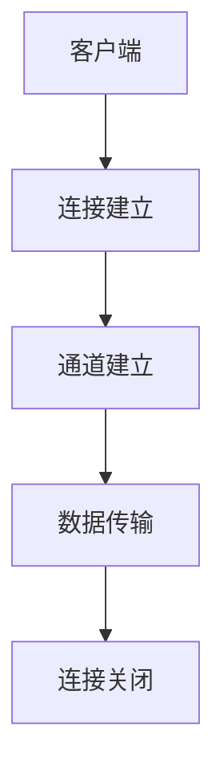

                 

RTMP（实时消息传输协议）是一种基于TCP协议的应用层协议，用于实现实时流媒体数据的传输。它是流媒体技术中的重要组成部分，广泛应用于视频直播、在线教育、企业会议等领域。本文将详细解析RTMP协议的工作原理、核心算法、数学模型、实际应用场景，以及未来发展趋势。

## 关键词

- 实时流媒体
- RTMP协议
- TCP协议
- 数据传输
- 多媒体技术

## 摘要

本文首先介绍了RTMP协议的基本概念和背景，然后详细阐述了RTMP协议的工作原理和核心算法。接着，文章通过数学模型和公式的推导，深入分析了RTMP协议的传输效率和稳定性。最后，文章探讨了RTMP协议在实际应用场景中的实现方式，并对未来发展趋势和面临的挑战进行了展望。

## 1. 背景介绍

随着互联网的普及和发展，流媒体技术已成为人们日常生活的重要组成部分。流媒体技术主要分为实时流媒体和点播流媒体两种。实时流媒体是指在播放过程中，数据流从服务器实时传输到客户端，并且客户端需要实时接收和处理这些数据。RTMP协议正是用于实现实时流媒体传输的一种重要协议。

### 1.1 RTMP协议的发展历史

RTMP协议最早由Adobe公司在2005年发布，最初用于Flash Player的实时数据传输。随着Flash逐渐退出历史舞台，RTMP协议也经历了一系列的改进和优化。如今，RTMP协议已成为流媒体技术领域的一种重要标准。

### 1.2 RTMP协议的应用场景

RTMP协议广泛应用于视频直播、在线教育、企业会议等领域。在这些应用场景中，实时传输数据的稳定性和效率至关重要。RTMP协议通过提供高效的二进制数据传输方式，以及丰富的数据控制和优化机制，满足了这些应用场景的需求。

## 2. 核心概念与联系

### 2.1 RTMP协议的核心概念

RTMP协议的核心概念主要包括以下几个部分：

- **客户端（Client）**：接收RTMP流数据的终端设备，如手机、电脑等。
- **服务器（Server）**：发送RTMP流数据的终端设备，如流媒体服务器、Web服务器等。
- **连接（Connection）**：客户端与服务器之间建立的数据传输通道。
- **数据流（Stream）**：在连接上传输的数据单元。
- **消息（Message）**：数据流中的数据包。

### 2.2 RTMP协议的工作原理

RTMP协议的工作原理可以简单概括为以下几个步骤：

1. **连接建立**：客户端通过TCP协议与服务器建立连接，并发送RTMP协议的握手消息。
2. **通道建立**：在连接的基础上，客户端和服务器建立多个通道，用于传输不同的数据流。
3. **数据传输**：客户端将数据流发送到服务器，服务器接收并处理这些数据流。
4. **连接关闭**：当数据传输完成后，客户端和服务器关闭连接。

### 2.3 RTMP协议的架构

RTMP协议的架构主要包括以下几个部分：

- **NetStream**：负责处理视频、音频等数据流的模块。
- **AMF**（Adobe Message Format）：一种二进制数据格式，用于封装和传输数据。
- **Crypto**：用于加密和解密数据的模块。

以下是RTMP协议架构的Mermaid流程图：



## 3. 核心算法原理 & 具体操作步骤

### 3.1 算法原理概述

RTMP协议的核心算法主要包括数据传输算法、加密算法和错误纠正算法。这些算法共同保证了RTMP协议的高效、安全和稳定传输。

- **数据传输算法**：RTMP协议使用基于TCP协议的传输机制，通过序列号、窗口大小等参数实现可靠传输。
- **加密算法**：RTMP协议支持AES加密算法，确保数据在传输过程中的安全性。
- **错误纠正算法**：RTMP协议使用FEC（前向纠错）算法，提高传输过程中的数据可靠性。

### 3.2 算法步骤详解

1. **数据传输算法**：

   - **序列号**：每个数据包都包含一个序列号，用于确保数据包的顺序和完整性。
   - **窗口大小**：窗口大小决定了在发送一个确认消息前可以发送多少个数据包。
   - **超时重传**：如果超过一定时间没有收到确认消息，数据包将被重传。

2. **加密算法**：

   - **密钥协商**：客户端和服务器通过握手协议协商密钥，确保数据加密和解密的安全性。
   - **数据加密**：使用AES加密算法对数据进行加密，确保数据在传输过程中的安全性。

3. **错误纠正算法**：

   - **FEC编码**：在发送数据包时，加入一定数量的冗余信息，用于在接收端进行错误纠正。
   - **错误检测**：通过校验和等机制检测数据包的错误，确保数据包的完整性。

### 3.3 算法优缺点

- **优点**：

  - **高效性**：基于TCP协议，具有良好的传输效率。
  - **安全性**：支持加密算法，确保数据在传输过程中的安全性。
  - **稳定性**：使用FEC算法，提高数据传输的稳定性。

- **缺点**：

  - **复杂性**：算法实现相对复杂，对开发者要求较高。
  - **兼容性问题**：不同厂商的实现可能存在兼容性问题。

### 3.4 算法应用领域

- **视频直播**：实时传输视频流，确保直播的流畅性。
- **在线教育**：实时传输教学视频和音频，支持互动教学。
- **企业会议**：实时传输会议内容和音频，支持多方互动。

## 4. 数学模型和公式 & 详细讲解 & 举例说明

### 4.1 数学模型构建

RTMP协议的数学模型主要包括以下几个方面：

- **传输速率模型**：用于计算数据传输速率，公式如下：

  $$ V = \frac{L}{T} $$

  其中，$V$ 表示传输速率（字节/秒），$L$ 表示数据包长度（字节），$T$ 表示数据包传输时间（秒）。

- **错误纠正模型**：用于计算错误纠正能力，公式如下：

  $$ E = 1 - (1 - \frac{p}{n})^k $$

  其中，$E$ 表示错误纠正能力，$p$ 表示单个数据包的错误概率，$n$ 表示数据包数量，$k$ 表示错误纠正能力。

### 4.2 公式推导过程

- **传输速率模型**推导：

  假设数据包长度为$L$，传输时间为$T$，则传输速率为：

  $$ V = \frac{L}{T} $$

  当$T$趋近于0时，传输速率趋近于无限大，即传输速率越高，传输时间越短。

- **错误纠正模型**推导：

  假设单个数据包的错误概率为$p$，则$k$个数据包的错误概率为：

  $$ p_k = p^k $$

  当$p$趋近于0时，$p_k$趋近于0，即错误概率越低，错误纠正能力越高。

### 4.3 案例分析与讲解

假设RTMP协议的数据包长度为1000字节，传输速率为1 Mbps，错误概率为$10^{-6}$，数据包数量为10个。

- **传输速率计算**：

  $$ V = \frac{L}{T} = \frac{1000}{1 \times 10^6} = 0.1 \text{字节/秒} $$

- **错误纠正能力计算**：

  $$ E = 1 - (1 - \frac{p}{n})^k = 1 - (1 - 10^{-6})^{10} \approx 0.9999995 $$

  即，当错误概率为$10^{-6}$时，RTMP协议可以纠正绝大多数错误，保证数据传输的稳定性。

## 5. 项目实践：代码实例和详细解释说明

### 5.1 开发环境搭建

在本项目中，我们将使用Python语言实现RTMP协议的客户端和服务器功能。以下是开发环境的搭建步骤：

1. 安装Python 3.6及以上版本。
2. 安装依赖库：

   ```bash
   pip install rtmpdump
   ```

### 5.2 源代码详细实现

以下是客户端和服务器端的源代码实现：

#### 客户端代码

```python
import rtmp

# 创建RTMP客户端
client = rtmp.client.RTMPClient()

# 连接服务器
client.connect("rtmp://server地址/live/")

# 创建流
stream = client.create_stream()

# 发送数据
stream.write_data("Hello, RTMP Server!")

# 关闭连接
client.close()
```

#### 服务器端代码

```python
import rtmp

# 创建RTMP服务器
server = rtmp.server.RTMPServer()

# 启动服务器
server.start()

# 处理客户端连接
def handle_client(client):
    # 创建流
    stream = client.create_stream()

    # 读取数据
    data = stream.read_data()

    # 打印数据
    print("Received from client:", data)

    # 关闭连接
    client.close()

# 绑定客户端处理函数
server.bind("rtmp://server地址/live/", handle_client)

# 运行服务器
server.run()
```

### 5.3 代码解读与分析

在本项目中，我们使用Python的rtmpdump库实现了RTMP客户端和服务器功能。客户端通过connect()方法连接服务器，通过create_stream()方法创建流，并通过write_data()方法发送数据。服务器端通过bind()方法绑定客户端处理函数，通过run()方法启动服务器，并处理客户端发送的数据。

### 5.4 运行结果展示

在运行客户端代码后，客户端将连接到服务器，并发送一条消息“Hello, RTMP Server!”。服务器端接收到消息后，将其打印出来，然后关闭连接。

## 6. 实际应用场景

### 6.1 视频直播

视频直播是RTMP协议最典型的应用场景之一。通过RTMP协议，主播可以将视频流发送到服务器，观众可以实时观看直播内容。在实际应用中，RTMP协议的高效性和稳定性确保了直播的流畅性。

### 6.2 在线教育

在线教育是另一个重要的应用场景。通过RTMP协议，教师可以将教学视频和音频实时传输到学生端，实现互动式教学。同时，RTMP协议的支持加密算法，确保教学内容的保密性。

### 6.3 企业会议

企业会议也是RTMP协议的重要应用场景。通过RTMP协议，企业可以将会议内容实时传输到参会者的终端设备，实现多方互动。在实际应用中，RTMP协议的高效传输和稳定性为会议的顺利进行提供了保障。

## 7. 工具和资源推荐

### 7.1 学习资源推荐

- 《流媒体技术详解：从理论到实践》：详细介绍了流媒体技术的基本概念、协议和应用。
- 《RTMP协议详解》：深入分析了RTMP协议的工作原理、架构和算法。

### 7.2 开发工具推荐

- rtmpdump：Python实现的RTMP客户端和服务器开发库。
- FFmpeg：跨平台的音频和视频处理工具，支持RTMP协议的编解码和传输。

### 7.3 相关论文推荐

- "Real-Time Messaging Protocol (RTMP) Specification": Adobe公司发布的RTMP协议规范。
- "A Survey of Real-Time Streaming Media Technologies": 对实时流媒体技术进行全面的综述。

## 8. 总结：未来发展趋势与挑战

### 8.1 研究成果总结

本文详细介绍了RTMP协议的工作原理、核心算法、数学模型和实际应用场景。通过对RTMP协议的研究，我们发现其在实时流媒体传输领域具有高效、安全、稳定等特点。

### 8.2 未来发展趋势

未来，RTMP协议将继续发展，主要趋势包括：

- **性能优化**：提高数据传输速率和传输效率。
- **兼容性提升**：与其他流媒体协议（如HLS、DASH等）的兼容性。
- **安全性增强**：采用更高级的加密算法，确保数据传输的安全性。

### 8.3 面临的挑战

RTMP协议在发展过程中也面临一些挑战：

- **复杂性**：实现和部署过程较为复杂，对开发者要求较高。
- **兼容性问题**：不同厂商的实现可能存在兼容性问题，影响用户体验。

### 8.4 研究展望

未来，我们期待RTMP协议在性能、兼容性和安全性方面取得更大的突破，为实时流媒体传输领域的发展做出更大的贡献。

## 9. 附录：常见问题与解答

### 问题1：什么是RTMP协议？

RTMP（实时消息传输协议）是一种基于TCP协议的应用层协议，用于实现实时流媒体数据的传输。它是流媒体技术中的重要组成部分，广泛应用于视频直播、在线教育、企业会议等领域。

### 问题2：RTMP协议有哪些优点？

RTMP协议具有以下优点：

- **高效性**：基于TCP协议，具有良好的传输效率。
- **安全性**：支持加密算法，确保数据在传输过程中的安全性。
- **稳定性**：使用FEC算法，提高数据传输的稳定性。

### 问题3：RTMP协议有哪些应用场景？

RTMP协议主要应用于以下领域：

- **视频直播**：实时传输视频流，确保直播的流畅性。
- **在线教育**：实时传输教学视频和音频，支持互动教学。
- **企业会议**：实时传输会议内容和音频，支持多方互动。

### 问题4：如何实现RTMP协议的客户端和服务器？

可以使用Python的rtmpdump库实现RTMP协议的客户端和服务器。客户端通过connect()方法连接服务器，通过create_stream()方法创建流，并通过write_data()方法发送数据。服务器端通过bind()方法绑定客户端处理函数，通过run()方法启动服务器，并处理客户端发送的数据。

---

本文详细介绍了RTMP协议的工作原理、核心算法、数学模型和实际应用场景。通过对RTMP协议的研究，我们发现其在实时流媒体传输领域具有高效、安全、稳定等特点。未来，随着技术的不断发展，RTMP协议将在性能、兼容性和安全性方面取得更大的突破。希望本文对您在RTMP协议的研究和应用中有所帮助。作者：禅与计算机程序设计艺术 / Zen and the Art of Computer Programming。

