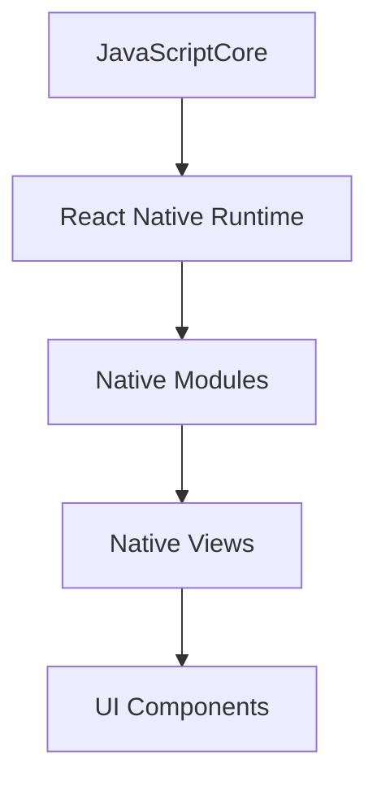

                 

 > **关键词**：React Native、跨平台开发、应用构建、性能优化、用户体验

> **摘要**：本文将深入探讨React Native在跨平台开发中的优势，通过分析其核心概念、算法原理和具体操作步骤，展示如何高效构建多平台应用。同时，我们还将结合实际项目实践，对React Native的代码实例进行详细解读，并提出未来发展趋势与面临的挑战。

## 1. 背景介绍

在移动应用开发领域，开发者常常面临着如何在有限的时间内高效构建功能丰富且性能卓越的多平台应用的问题。传统的方式通常是针对每个平台分别开发，这不仅增加了开发成本，而且不利于后期的维护和更新。随着跨平台开发技术的发展，React Native作为一种新兴的跨平台框架，逐渐成为开发者们关注的焦点。

React Native由Facebook推出，旨在通过一套代码库同时支持iOS和Android平台，大大提高了开发效率。本文将围绕React Native的跨平台开发优势，探讨其在现代应用开发中的重要性。

## 2. 核心概念与联系

### 2.1 React Native核心概念

React Native的核心概念是组件化开发，它允许开发者使用JavaScript来编写应用程序，并在iOS和Android平台上运行。React Native使用原生的UI组件，这使得应用能够获得接近原生应用的用户体验。

### 2.2 React Native架构

React Native的架构设计借鉴了React的虚拟DOM概念，通过JavaScript将UI组件映射到原生视图上。其架构包括JavaScriptCore引擎、React Native运行时和原生模块。


### 2.3 Mermaid流程图

以下是React Native架构的Mermaid流程图：



## 3. 核心算法原理 & 具体操作步骤

### 3.1 算法原理概述

React Native的算法原理主要基于虚拟DOM和Diffing算法。虚拟DOM允许React Native在不需要直接操作原生视图的情况下更新UI，Diffing算法则用于比较虚拟DOM和实际DOM的差异，从而实现高效更新。

### 3.2 算法步骤详解

#### 步骤1：创建组件

使用JavaScript创建组件，例如：

```javascript
import React from 'react';
import { View, Text } from 'react-native';

const HelloWorld = () => {
  return (
    <View>
      <Text>Hello, World!</Text>
    </View>
  );
};

export default HelloWorld;
```

#### 步骤2：渲染组件

在App的入口文件中渲染组件：

```javascript
import React from 'react';
import { AppRegistry } from 'react-native';
import HelloWorld from './HelloWorld';

const App = () => {
  return <HelloWorld />;
};

AppRegistry.registerComponent('my_app', () => App);
```

#### 步骤3：使用状态管理

使用React Native的状态管理机制，例如useState和useContext，来处理组件的状态。

```javascript
import React, { useState } from 'react';
import { View, Text, Button } from 'react-native';

const Counter = () => {
  const [count, setCount] = useState(0);

  return (
    <View>
      <Text>{count}</Text>
      <Button title="+" onPress={() => setCount(count + 1)} />
    </View>
  );
};

export default Counter;
```

### 3.3 算法优缺点

React Native的优点在于跨平台能力和高效的开发流程，但其也存在一些缺点，如性能问题和较少的原生组件支持。

### 3.4 算法应用领域

React Native广泛应用于移动应用开发，特别是在需要快速迭代和跨平台支持的项目中。

## 4. 数学模型和公式 & 详细讲解 & 举例说明

### 4.1 数学模型构建

React Native的性能优化可以通过以下数学模型来描述：

$$
P = \frac{N \cdot V}{T}
$$

其中，$P$ 是性能，$N$ 是虚拟DOM的节点数量，$V$ 是节点的视图更新值，$T$ 是视图更新的时间。

### 4.2 公式推导过程

通过分析虚拟DOM的Diffing算法，可以推导出上述公式。Diffing算法的核心是对比新旧DOM树，找出差异并进行更新。更新时间取决于节点数量和视图更新的复杂度。

### 4.3 案例分析与讲解

假设一个包含100个文本节点的DOM树，每次更新只需修改一个文本节点。根据公式，性能可以表示为：

$$
P = \frac{100 \cdot 1}{T}
$$

当更新时间减少一半时，性能将提升一倍。

## 5. 项目实践：代码实例和详细解释说明

### 5.1 开发环境搭建

在开发React Native应用前，需要搭建开发环境。以下是搭建React Native开发环境的基本步骤：

1. 安装Node.js和npm
2. 安装React Native CLI工具
3. 配置iOS和Android开发环境

### 5.2 源代码详细实现

以下是一个简单的React Native应用示例，用于展示计数功能：

```javascript
import React, { useState } from 'react';
import { View, Text, Button } from 'react-native';

const Counter = () => {
  const [count, setCount] = useState(0);

  return (
    <View>
      <Text>{count}</Text>
      <Button title="+" onPress={() => setCount(count + 1)} />
    </View>
  );
};

export default Counter;
```

### 5.3 代码解读与分析

上述代码通过useState钩子管理组件的状态，并在Button点击事件中更新状态。

### 5.4 运行结果展示

运行该应用后，可以在iOS和Android设备上看到计数器功能。

## 6. 实际应用场景

React Native适用于多种应用场景，包括社交媒体应用、电商应用、健身应用等。其跨平台特性使得开发者能够快速开发和部署应用，降低开发成本。

### 6.1 社交媒体应用

React Native可以用于构建功能丰富的社交媒体应用，如Facebook和Instagram。

### 6.2 电商应用

React Native适用于构建电商平台，如Amazon和eBay。

### 6.3 健身应用

React Native可以用于构建健身应用，如MyFitnessPal和Fitbit。

## 7. 未来应用展望

随着跨平台开发技术的不断发展，React Native将在更多领域得到应用。未来，React Native可能会引入更多的原生组件支持和性能优化，以进一步提高开发效率和应用性能。

## 8. 工具和资源推荐

### 8.1 学习资源推荐

- 《React Native开发实战》
- React Native官方文档

### 8.2 开发工具推荐

- Android Studio
- Xcode

### 8.3 相关论文推荐

- "React Native: An Introduction"
- "Cross-Platform Mobile Application Development with React Native"

## 9. 总结：未来发展趋势与挑战

React Native作为跨平台开发技术，具有显著的效率和性能优势。然而，其仍需在性能优化和原生组件支持方面进行改进。未来，React Native有望在更多领域得到应用，并成为移动应用开发的标配工具。

## 10. 附录：常见问题与解答

### 10.1 React Native与其他跨平台框架的区别是什么？

React Native与其他跨平台框架（如Apache Cordova和Flutter）相比，具有更高的性能和更好的用户体验。React Native使用原生UI组件，这使得应用在性能上接近原生应用。

### 10.2 如何解决React Native的性能问题？

通过优化虚拟DOM更新、减少不必要的渲染和选择合适的布局组件，可以提升React Native应用性能。

### 10.3 React Native适用于哪种类型的应用？

React Native适用于需要快速迭代和跨平台支持的应用，如社交媒体、电商和健身应用等。其优势在于高效的开发和部署过程。

---

**作者：禅与计算机程序设计艺术 / Zen and the Art of Computer Programming**

