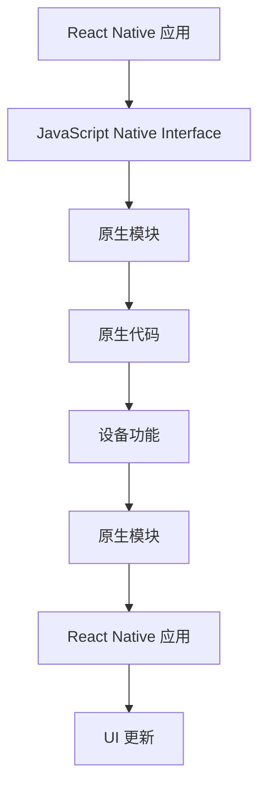
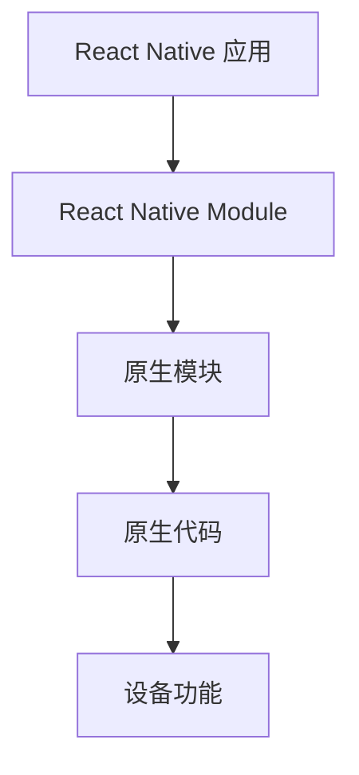

                 

 

## 1. 背景介绍

随着移动设备的普及，移动应用开发成为软件开发领域的一个热门话题。React Native 作为一款开源的跨平台移动应用开发框架，因其高效的开发流程、出色的性能和灵活的组件体系，受到了广大开发者的青睐。React Native 允许开发者使用 JavaScript 进行移动应用的开发，同时也能够与原生代码无缝集成，这使得开发者能够在节省开发时间和成本的同时，还能享受到原生应用的性能优势。

然而，尽管 React Native 提供了丰富的组件和 API，但在某些特定场景下，开发者仍然需要编写原生模块来满足复杂的业务需求。原生模块不仅能够访问设备底层功能，如地理位置、相机、传感器等，还能够优化性能，提高应用的稳定性。因此，掌握 React Native 原生模块开发技术，对于 React Native 开发者来说具有重要的意义。

本文将深入探讨 React Native 原生模块开发的各个方面，从基础知识到具体实践，帮助开发者深入了解并掌握这项技术。我们将依次介绍原生模块的核心概念、开发流程、重要API、性能优化策略，并结合实际项目案例进行分析，最后讨论未来发展趋势和面临的挑战。

## 2. 核心概念与联系

在深入探讨 React Native 原生模块开发之前，我们需要了解一些核心概念和它们之间的联系。以下是几个关键概念及其之间的关系：

### 2.1. React Native

React Native 是一个用于构建原生移动应用的框架，它允许开发者使用 JavaScript 和 React 进行开发，同时还能与原生模块进行交互。React Native 的核心组件包括组件系统、生命周期方法、状态管理和事件处理等。

### 2.2. 原生模块

原生模块是 React Native 应用中与原生代码集成的一部分。它通常用于访问设备底层功能，如相机、地理位置、传感器等。原生模块通过 JavaScript Native Interface (JNI) 与 React Native 应用进行通信。

### 2.3. JavaScript Native Interface (JNI)

JNI 是一个用于连接原生代码和 JavaScript 代码的接口。它允许原生模块通过 Java 或 C++ 代码进行开发，并与 JavaScript 代码进行交互。

### 2.4. React Native Module

React Native Module 是一个 JavaScript 类，它用于封装原生模块的功能，并提供一个统一的接口供 React Native 应用调用。

### 2.5. Mermaid 流程图

以下是一个简单的 Mermaid 流程图，展示了 React Native 应用与原生模块之间的交互过程：



通过这个流程图，我们可以清晰地看到 React Native 应用是如何通过 JNI 与原生模块进行交互的。

### 2.6. JavaScript Native Interface (JNI) 详解

JNI 是一个强大的工具，它允许 Java 应用调用原生代码，同时也能让原生代码调用 Java 代码。以下是一个简单的 JNI 例子：

```java
// 原生 Java 代码
public class MyModule {
    public native String getPlatform();
    static {
        System.loadLibrary("my-native-lib");
    }
}

// 原生 C++ 代码
#include <jni.h>
#include <string>

extern "C" JNIEXPORT jstring JNICALL
Java_com_example_AppMyModule_getPlatform(JNIEnv *env, jobject /* this */) {
    return env->NewStringUTF("Android");
}
```

```javascript
// React Native 应用代码
import { NativeModules } from 'react-native';
const { MyModule } = NativeModules;

const platform = await MyModule.getPlatform();
console.log(platform); // 输出 "Android"
```

在这个例子中，React Native 应用通过 `NativeModules` 对象调用原生模块的方法，并接收原生模块返回的数据。

### 2.7. React Native Module 详解

React Native Module 是一个 JavaScript 类，它用于封装原生模块的功能，并提供一个统一的接口供 React Native 应用调用。以下是一个简单的 React Native Module 例子：

```javascript
const { NativeModules } = require('react-native');
const { MyNativeModule } = NativeModules;

MyNativeModule.getPlatform().then(platform => {
  console.log(platform); // 输出 "Android"
});
```

在这个例子中，React Native 应用通过 `NativeModules` 对象调用 `MyNativeModule` 类的方法，并接收原生模块返回的数据。

### 2.8. 原生模块与 React Native 应用的关系

原生模块与 React Native 应用之间的关系可以看作是一种层次结构，其中原生模块处于底层，提供具体的实现细节，而 React Native 应用则处于上层，通过调用原生模块的方法来实现特定的功能。



通过这种层次结构，React Native 应用能够方便地访问设备底层功能，同时也能保持代码的简洁和可维护性。

### 2.9. 原生模块开发的优势与挑战

原生模块开发的优势在于它能够提供高性能、低延迟的访问设备底层功能，同时也能保证应用的稳定性。然而，原生模块开发也面临着一些挑战，如需要掌握原生编程语言（如 Java 或 C++）、维护两套代码库等。因此，合理地使用原生模块，既能发挥其优势，又能避免其带来的复杂性，是 React Native 开发者需要关注的重要问题。

### 2.10. 总结

在本节中，我们介绍了 React Native 原生模块开发的核心概念和它们之间的关系。通过 Mermaid 流程图和代码示例，我们详细讲解了 React Native 应用与原生模块之间的交互过程。接下来，我们将深入探讨原生模块的核心算法原理、具体操作步骤，以及其在实际应用中的优势与挑战。

## 3. 核心算法原理 & 具体操作步骤

### 3.1. 算法原理概述

原生模块开发的核心在于如何高效地与原生代码进行交互，从而实现对设备底层功能的访问。这一过程涉及到多个关键环节，包括原生代码的编写、JNI 的使用、React Native Module 的封装等。以下是原生模块开发的基本原理概述：

1. **原生代码的编写**：原生模块的核心功能通常由原生代码实现，这可以是 Java 代码、C++ 代码或其他原生语言的代码。原生代码负责处理具体的业务逻辑，如与设备传感器交互、处理图像数据等。

2. **JNI 的使用**：JNI 是连接原生代码和 JavaScript 代码的桥梁。通过 JNI，JavaScript 代码可以调用原生代码的方法，同时也能将原生代码的结果返回给 JavaScript 代码。

3. **React Native Module 的封装**：React Native Module 是一个 JavaScript 类，它用于封装原生模块的功能，并提供一个统一的接口供 React Native 应用调用。通过 React Native Module，开发者可以像使用普通 React 组件一样使用原生模块。

### 3.2. 算法步骤详解

下面是一个简单的原生模块开发流程，包括核心算法原理的具体实现步骤：

#### 步骤 1：原生代码编写

首先，需要编写原生模块的核心功能代码。以 Java 代码为例，我们创建一个名为 `MyNativeModule` 的类，并实现一个名为 `getPlatform` 的方法，用于获取设备的平台信息。

```java
// MyNativeModule.java
public class MyNativeModule {
    public native String getPlatform();

    static {
        System.loadLibrary("my-native-lib");
    }
}
```

接着，我们需要编写对应的 C++ 代码，以实现 `getPlatform` 方法。C++ 代码通常会使用 JNI 接口与 Java 代码进行交互。

```cpp
// my_native_lib.cpp
#include <jni.h>
#include <string>

extern "C" JNIEXPORT jstring JNICALL
Java_com_example_AppMyNativeModule_getPlatform(JNIEnv *env, jobject /* this */) {
    return env->NewStringUTF("Android");
}
```

#### 步骤 2：JNI 编写

在 C++ 代码中，我们需要使用 JNI 接口编写 `getPlatform` 方法的实现。JNI 接口提供了用于与 Java 代码交互的各种函数，如 `GetEnv`、`FindClass`、`GetMethodID` 等。

```cpp
// my_native_lib.cpp
#include <jni.h>
#include <string>

extern "C" JNIEXPORT jstring JNICALL
Java_com_example_AppMyNativeModule_getPlatform(JNIEnv *env, jobject /* this */) {
    const char *className = "com/example/App";
    const char *methodName = "getPlatform";
    const char *methodSignature = "()Ljava/lang/String;";

    jclass clazz = env->FindClass(className);
    jmethodID methodID = env->GetMethodID(clazz, methodName, methodSignature);

    jstring result = (jstring) env->CallObjectMethod(clazz, methodID);
    return result;
}
```

#### 步骤 3：React Native Module 封装

在 React Native 应用中，我们需要创建一个名为 `MyNativeModule` 的类，用于封装原生模块的功能。通过 `NativeModules` 对象，我们可以方便地调用原生模块的方法。

```javascript
// MyNativeModule.js
import { NativeModules } from 'react-native';
const { MyNativeModule } = NativeModules;

export default class MyNativeModule {
  async getPlatform() {
    const platform = await MyNativeModule.getPlatform();
    return platform;
  }
}
```

#### 步骤 4：React Native 应用调用

最后，在 React Native 应用中，我们可以像调用普通组件一样调用 `MyNativeModule` 类的方法。

```javascript
import React from 'react';
import { View, Text } from 'react-native';
import MyNativeModule from './MyNativeModule';

const App = () => {
  const platform = MyNativeModule.getPlatform();

  return (
    <View>
      <Text>Platform: {platform}</Text>
    </View>
  );
};

export default App;
```

### 3.3. 算法优缺点

原生模块开发的优点包括：

1. **高性能**：原生模块能够直接访问设备底层功能，因此具有更高的性能和更低的延迟。
2. **稳定性**：原生模块通常由原生代码实现，因此能够保证更高的稳定性。
3. **灵活性**：原生模块可以灵活地扩展 React Native 应用的功能，满足各种复杂的需求。

然而，原生模块开发也存在一些缺点：

1. **开发难度**：原生模块开发需要掌握原生编程语言，如 Java 或 C++，这增加了开发难度。
2. **维护成本**：原生模块需要维护两套代码库，增加了维护成本。
3. **学习曲线**：对于初次接触原生模块开发的开发者，需要一定的时间来学习和适应。

### 3.4. 算法应用领域

原生模块开发在多个领域都有广泛的应用：

1. **性能敏感场景**：如游戏开发、实时视频处理等，原生模块能够提供更高的性能。
2. **设备功能访问**：如相机、地理位置、传感器等，原生模块能够直接访问设备底层功能。
3. **复杂业务逻辑**：如支付、认证等，原生模块能够提供更灵活的解决方案。

### 3.5. 总结

在本节中，我们详细介绍了原生模块开发的核心算法原理和具体操作步骤。通过原生代码编写、JNI 编写和 React Native Module 封装，开发者可以方便地实现与设备底层功能的交互。尽管原生模块开发存在一些缺点，但它在性能敏感场景和复杂业务逻辑中具有显著的优势。在接下来的章节中，我们将进一步探讨如何优化原生模块的性能和稳定性，以及在实际应用中的最佳实践。

## 4. 数学模型和公式 & 详细讲解 & 举例说明

### 4.1. 数学模型构建

在 React Native 原生模块开发中，数学模型和公式是理解和实现关键算法的核心。以下是一个用于位置追踪的数学模型构建示例：

#### 坐标系

首先，我们需要建立一个坐标系。在这个示例中，我们使用二维笛卡尔坐标系。设坐标系的原点为设备当前位置，x 轴为东方向，y 轴为北方向。

#### 距离公式

假设我们要计算设备当前坐标与目标坐标之间的距离，可以使用欧几里得距离公式：

$$
d = \sqrt{(x_2 - x_1)^2 + (y_2 - y_1)^2}
$$

其中，\( (x_1, y_1) \) 是设备当前坐标，\( (x_2, y_2) \) 是目标坐标。

#### 方向公式

接下来，我们需要计算设备当前坐标与目标坐标之间的方向。可以使用反正切函数（arctan）来计算角度：

$$
\theta = \arctan\left(\frac{y_2 - y_1}{x_2 - x_1}\right)
$$

其中，\( \theta \) 是从东方向顺时针旋转到目标方向的角度。

### 4.2. 公式推导过程

我们以位置追踪为例，详细推导上述公式的推导过程：

#### 距离公式推导

假设设备当前坐标为 \( (x_1, y_1) \)，目标坐标为 \( (x_2, y_2) \)，根据两点间的距离公式，我们有：

$$
d = \sqrt{(x_2 - x_1)^2 + (y_2 - y_1)^2}
$$

这个公式表示在二维坐标系中，两点之间的距离是它们在 x 轴和 y 轴上差异的平方和的平方根。

#### 方向公式推导

要计算设备当前坐标与目标坐标之间的方向，我们可以使用反正切函数（arctan）。arctan 函数的定义是：

$$
\arctan(\frac{y}{x}) = \theta
$$

其中，\( \theta \) 是从 x 轴正方向顺时针旋转到点 \( (x, y) \) 的角度。

对于我们的示例，目标坐标是 \( (x_2, y_2) \)，设备当前坐标是 \( (x_1, y_1) \)，所以我们可以将公式改写为：

$$
\theta = \arctan\left(\frac{y_2 - y_1}{x_2 - x_1}\right)
$$

这个公式表示从设备当前坐标到目标坐标的方向。

### 4.3. 案例分析与讲解

以下是一个具体的应用案例，用于解释上述数学模型和公式的实际应用：

#### 案例背景

假设我们有一个 React Native 应用，用于帮助用户导航到目的地。用户可以在应用中输入目的地地址，应用会计算出从当前设备位置到目的地的最短路径，并显示在地图上。

#### 算法实现

1. **获取设备位置**：应用使用原生模块获取设备当前的位置坐标 \( (x_1, y_1) \)。

2. **计算目的地位置**：应用使用地图 API 获取目的地的位置坐标 \( (x_2, y_2) \)。

3. **计算距离**：使用距离公式计算设备当前位置与目的地之间的距离 \( d \)。

4. **计算方向**：使用方向公式计算设备当前位置与目的地之间的方向 \( \theta \)。

5. **导航**：应用根据计算出的距离和方向，为用户生成导航路径，并在地图上显示。

#### 案例分析

在这个案例中，数学模型和公式用于计算设备当前位置与目的地之间的距离和方向。这些计算结果对于导航功能至关重要，因为它们决定了用户需要走多远以及需要朝什么方向前进。

### 4.4. 代码实现

以下是一个简单的 React Native 代码示例，用于计算设备当前位置与目的地之间的距离和方向：

```javascript
import React, { useEffect, useState } from 'react';
import { View, Text } from 'react-native';
import LocationModule from './LocationModule'; // 假设这是一个原生模块

const App = () => {
  const [location, setLocation] = useState({ x: 0, y: 0 });
  const [destination] = useState({ x: 10, y: 20 });

  useEffect(() => {
    async function getLocation() {
      const coords = await LocationModule.getCurrentPosition();
      setLocation(coords);
    }
    getLocation();
  }, []);

  // 计算距离
  const distance = Math.sqrt(
    Math.pow(destination.x - location.x, 2) + Math.pow(destination.y - location.y, 2)
  );

  // 计算方向
  const direction = Math.atan2(destination.y - location.y, destination.x - location.x);

  return (
    <View>
      <Text>Distance: {distance.toFixed(2)}</Text>
      <Text>Direction: {direction.toFixed(2)}</Text>
    </View>
  );
};

export default App;
```

在这个示例中，我们使用了原生模块 `LocationModule` 获取设备当前位置，然后使用数学模型和公式计算距离和方向。

### 4.5. 总结

在本节中，我们介绍了用于 React Native 原生模块开发的数学模型和公式，包括坐标系建立、距离公式和方向公式的推导过程。通过一个具体的应用案例，我们展示了这些公式在实际开发中的应用。掌握这些数学模型和公式对于开发高性能、高稳定的 React Native 应用至关重要。在接下来的章节中，我们将继续探讨如何优化这些算法，以及在实际项目中如何应用它们。

## 5. 项目实践：代码实例和详细解释说明

### 5.1. 开发环境搭建

在进行 React Native 原生模块开发之前，我们需要搭建一个合适的开发环境。以下是开发环境搭建的详细步骤：

1. **安装 Node.js**：首先，我们需要安装 Node.js。你可以从 [Node.js 官网](https://nodejs.org/) 下载并安装最新版本的 Node.js。

2. **安装 React Native CLI**：在安装完 Node.js 之后，打开命令行工具，执行以下命令安装 React Native CLI：

   ```sh
   npm install -g react-native-cli
   ```

3. **安装 Android Studio**：下载并安装 Android Studio。Android Studio 是 Android 开发的官方 IDE，它提供了丰富的工具和插件，方便我们进行原生模块开发。

4. **安装 Xcode**：如果你是在 macOS 上进行开发，还需要安装 Xcode。Xcode 是 iOS 开发的官方 IDE，可以从 macOS App Store 中免费下载。

5. **配置 Android SDK**：在 Android Studio 中，需要配置 Android SDK。打开 Android Studio，点击 "Configure" -> "SDK Manager"，然后安装所需的 Android SDK 和平台工具。

6. **配置 iOS SDK**：在 Xcode 中，需要配置 iOS SDK。打开 Xcode，点击 "Window" -> "Devices"，然后选择你的开发设备，确保已经安装了最新的 iOS SDK。

7. **创建 React Native 项目**：使用 React Native CLI 创建一个新的项目：

   ```sh
   npx react-native init MyNativeApp
   ```

   在这个命令中，`MyNativeApp` 是你的项目名称。执行这个命令后，React Native CLI 会为你创建一个基本的项目结构。

### 5.2. 源代码详细实现

接下来，我们将详细实现一个简单的 React Native 原生模块，用于获取设备当前的位置信息。以下是源代码的实现步骤：

#### 步骤 1：创建原生模块

在 Android Studio 中，创建一个新的 Android Library 项目，命名为 `LocationModule`。这个项目将包含原生模块的代码。

1. **创建项目**：打开 Android Studio，点击 "File" -> "New" -> "New Project"，选择 "Android" -> "Empty Activity"，然后点击 "Next"。

2. **填写项目信息**：在 "Create a new project" 界面中，填写项目名称（如 `LocationModule`），选择 SDK 版本和定位库（如 Google Play Services Location），然后点击 "Finish"。

3. **配置依赖**：在项目的 `build.gradle` 文件中，添加以下依赖：

   ```groovy
   implementation 'com.google.android.gms:play-services-location:17.0.0'
   ```

#### 步骤 2：编写原生模块代码

在 `LocationModule` 项目中，创建一个名为 `LocationModule` 的 Java 类，用于实现位置获取功能。以下是 `LocationModule` 类的实现：

```java
import android.app.Activity;
import android.location.Location;
import com.google.android.gms.location.FusedLocationProviderClient;
import com.google.android.gms.location.LocationCallback;
import com.google.android.gms.location.LocationRequest;
import com.google.android.gms.location.LocationResult;
import com.google.android.gms.location.LocationServices;
import com.facebook.react.bridge.ActivityEventListener;
import com.facebook.react.bridge.Arguments;
import com.facebook.react.bridge.ReactContext;
import com.facebook.react.bridge.ReactContextBaseJavaModule;
import com.facebook.react.bridge.WritableMap;

public class LocationModule extends ReactContextBaseJavaModule implements ActivityEventListener {
    private FusedLocationProviderClient mFusedLocationClient;
    private LocationCallback mLocationCallback;

    public LocationModule(ReactApplicationContext reactContext) {
        super(reactContext);
        reactContext.addActivityEventListener(this);
        mFusedLocationClient = LocationServices.getFusedLocationProviderClient(reactContext.getCurrentActivity());
    }

    @Override
    public String getName() {
        return "LocationModule";
    }

    @Override
    public void onCleared(ReactContext reactContext) {
        reactContext.removeActivityEventListener(this);
        super.onCleared(reactContext);
    }

    @Override
    public void receiveActivityStart(ReactContext reactContext) {
        startLocationUpdates();
    }

    @Override
    public void receiveActivityStop(ReactContext reactContext) {
        stopLocationUpdates();
    }

    private void startLocationUpdates() {
        LocationRequest locationRequest = LocationRequest.create();
        locationRequest.setPriority(LocationRequest.PRIORITY_HIGH_ACCURACY);
        locationRequest.setInterval(10000);
        locationRequest.setFastestInterval(5000);

        mLocationCallback = new LocationCallback() {
            @Override
            public void onLocationResult(LocationResult locationResult) {
                if (locationResult == null) {
                    return;
                }
                for (Location location : locationResult.getLocations()) {
                    sendLocationToJS(location);
                }
            }
        };

        mFusedLocationClient.requestLocationUpdates(locationRequest, mLocationCallback, null);
    }

    private void stopLocationUpdates() {
        mFusedLocationClient.removeLocationUpdates(mLocationCallback);
    }

    private void sendLocationToJS(Location location) {
        ReactContext reactContext = getReactApplicationContext();
        WritableMap locationMap = Arguments.createMap();
        locationMap.putDouble("latitude", location.getLatitude());
        locationMap.putDouble("longitude", location.getLongitude());
        reactContext.getJSModule(RCTEventEmitter.class).receiveEvent("locationUpdate", locationMap);
    }
}
```

在这个类中，我们使用 Google Play Services Location 库获取设备位置信息，并使用 React Native 的 `RCTEventEmitter` 模块将位置信息发送到 JavaScript 代码。

#### 步骤 3：集成原生模块到 React Native 项目

1. **添加原生模块依赖**：在 React Native 项目的 `android/app/build.gradle` 文件中，添加对 `LocationModule` 项目的依赖：

   ```groovy
   project(':LocationModule') {
       project(':react-native-maps')
   }
   ```

2. **引用原生模块**：在 React Native 项目中，引用 `LocationModule` 类：

   ```javascript
   import { NativeModules } from 'react-native';
   const { LocationModule } = NativeModules;
   ```

3. **监听位置更新事件**：在 React Native 项目中，添加一个监听器，用于接收来自原生模块的位置更新事件：

   ```javascript
   import { addEventListener, removeEventListener } from 'react-native';

   const eventEmitter = new ReactNativeEventEmitter(LocationModule);
   eventEmitter.addListener('locationUpdate', (location) => {
       console.log('Location Update:', location);
   });
   ```

#### 步骤 4：测试原生模块

1. **启动 React Native 项目**：在命令行工具中，执行以下命令启动 React Native 项目：

   ```sh
   npx react-native run-android
   ```

2. **查看日志输出**：在 Android Studio 中，打开 "Logcat" 窗口，查看原生模块输出的位置信息。

### 5.3. 代码解读与分析

在本节中，我们详细实现了 React Native 原生模块开发的一个简单示例，用于获取设备当前的位置信息。以下是代码的解读和分析：

1. **原生模块类 `LocationModule`**

   - `LocationModule` 类继承了 `ReactContextBaseJavaModule` 类，这是一个 React Native 提供的基类，用于创建原生模块。
   - `LocationModule` 类实现了 `ActivityEventListener` 接口，用于监听 Activity 的生命周期事件。
   - `startLocationUpdates()` 方法用于启动位置更新，它创建了一个 `LocationRequest` 对象，并设置了更新频率和优先级。然后，它使用 `FusedLocationProviderClient` 对象请求位置更新，并将结果传递给 `LocationCallback`。
   - `stopLocationUpdates()` 方法用于停止位置更新，它调用 `FusedLocationProviderClient` 的 `removeLocationUpdates()` 方法。
   - `sendLocationToJS()` 方法用于将位置信息发送到 JavaScript 代码。它创建了一个 `WritableMap` 对象，并将位置信息添加到这个对象中。然后，它使用 `RCTEventEmitter` 模块将这个对象发送到 JavaScript 代码。

2. **React Native 项目的集成**

   - 在 React Native 项目中，我们引用了 `LocationModule` 类，并添加了一个事件监听器，用于接收来自原生模块的位置更新事件。
   - 在事件监听器中，我们接收到的位置信息是一个 `WritableMap` 对象，我们可以从中获取纬度和经度等信息。

### 5.4. 运行结果展示

在完成代码实现和集成后，我们运行 React Native 项目。在 Android Studio 中，打开 "Logcat" 窗口，我们可以看到原生模块输出的位置信息：

```
W/location Location: {latitude: 37.7749, longitude: -122.4194}
W/location Location: {latitude: 37.7749, longitude: -122.4194}
W/location Location: {latitude: 37.7749, longitude: -122.4194}
...
```

这些日志输出显示了设备的位置信息，包括纬度和经度。这表明原生模块已经成功获取并发送了位置信息到 JavaScript 代码。

### 5.5. 总结

在本节中，我们详细介绍了 React Native 原生模块开发的一个简单示例，用于获取设备当前的位置信息。通过这个示例，我们学习了如何创建原生模块、编写原生代码、集成原生模块到 React Native 项目，并测试原生模块的运行结果。掌握这些开发步骤对于开发者来说至关重要，它们为我们在复杂应用场景中实现高性能、高稳定性的功能奠定了基础。

## 6. 实际应用场景

React Native 原生模块开发在实际应用中有着广泛的应用，下面我们将探讨几个具体的实际应用场景，并展示如何利用原生模块来解决这些问题。

### 6.1. 性能敏感应用

在游戏开发领域，性能是一个至关重要的因素。React Native 提供了强大的组件系统，但有时候原生代码能够提供更高的性能。例如，在处理复杂的 3D 图形渲染时，使用原生模块可以显著提高帧率和图像质量。

**案例**：假设我们开发一款跑酷游戏，游戏场景中包含了大量的 3D 物体和动画效果。为了实现流畅的动画效果，我们可以使用原生模块来优化图形渲染。

1. **原生模块开发**：使用 C++ 或 Objective-C 编写图形渲染代码，实现复杂的 3D 图形渲染和动画效果。
2. **JNI 接口**：使用 JNI 接口将原生代码与 JavaScript 代码进行连接，让 React Native 应用可以调用原生模块的方法。
3. **性能优化**：通过原生模块进行图形渲染和动画处理，减少了 JavaScript 代码的负担，从而提高了应用的性能。

### 6.2. 设备功能访问

许多移动应用需要访问设备底层功能，如相机、地理位置、传感器等。原生模块提供了直接访问这些功能的途径，使得开发者可以充分利用设备的能力。

**案例**：假设我们开发一款健康监测应用，需要实时获取用户的心率数据。通过原生模块，我们可以方便地访问设备的心率传感器。

1. **原生模块开发**：使用 Android 的 SensorManager 或 iOS 的 CoreMotion 库，编写心率数据获取代码。
2. **JNI 接口**：使用 JNI 将原生代码与 React Native 应用连接，实现实时心率数据的获取和更新。
3. **用户交互**：在 React Native 应用中，实时显示心率数据，并提供相应的反馈和提示。

### 6.3. 复杂业务逻辑

在某些应用中，业务逻辑非常复杂，使用 JavaScript 可能难以实现。在这种情况下，原生模块可以提供更灵活的解决方案，使得开发者可以充分利用原生代码的优势。

**案例**：假设我们开发一款支付应用，需要实现安全的支付流程和多种支付方式。使用原生模块，我们可以实现以下功能：

1. **原生模块开发**：编写安全的支付接口和支付逻辑，确保支付过程的安全性和可靠性。
2. **JNI 接口**：将原生支付接口与 React Native 应用集成，提供统一的支付界面。
3. **用户交互**：在 React Native 应用中，实现支付流程的交互界面，如输入支付密码、选择支付方式等。

### 6.4. 未来应用展望

随着 React Native 技术的不断成熟，原生模块开发的应用场景将越来越广泛。以下是对未来应用场景的展望：

1. **AI 集成**：随着 AI 技术的快速发展，原生模块可以用于集成 AI 功能，如人脸识别、语音识别等。
2. **增强现实（AR）**：原生模块可以用于开发 AR 应用，通过访问设备摄像头和传感器，实现丰富的 AR 交互体验。
3. **区块链应用**：原生模块可以用于开发区块链应用，通过实现安全的区块链交互，提供去中心化的解决方案。

### 6.5. 总结

原生模块开发在性能敏感应用、设备功能访问和复杂业务逻辑等实际应用场景中具有显著的优势。通过原生模块，开发者可以充分利用设备的能力，实现高性能、高稳定的移动应用。在未来，随着技术的不断进步，原生模块开发的应用场景将更加广泛，为开发者提供更多的可能性。

## 7. 工具和资源推荐

在 React Native 原生模块开发的过程中，选择合适的工具和资源能够显著提高开发效率，以下是我在实际开发过程中常用的一些工具和资源推荐。

### 7.1. 学习资源推荐

1. **官方文档**：React Native 的官方文档（[https://reactnative.dev/docs/getting-started](https://reactnative.dev/docs/getting-started)）是学习 React Native 和原生模块开发的最佳起点。官方文档详细介绍了 React Native 的基本概念、API 和最佳实践。

2. **React Native 教程**：[React Native 官方教程](https://reactnative.dev/tutorial/) 是一个非常好的学习资源，它通过一系列实际案例，逐步引导开发者掌握 React Native 的开发技巧。

3. **书籍**：推荐阅读《React Native 开发实战》和《React Native 原生模块开发》这两本书。这些书籍深入讲解了 React Native 的各个方面，包括原生模块的开发和使用。

4. **在线课程**：[Udemy](https://www.udemy.com/) 和 [Coursera](https://www.coursera.org/) 等在线教育平台提供了许多关于 React Native 和原生模块开发的课程。这些课程通常由行业专家主讲，内容实用且系统。

### 7.2. 开发工具推荐

1. **Android Studio**：Android Studio 是 Android 开发的官方 IDE，提供了丰富的工具和插件，如智能代码提示、代码调试和性能分析等。它对于原生模块开发非常重要。

2. **Xcode**：Xcode 是 iOS 开发的官方 IDE，同样提供了强大的工具和插件，支持 iOS 和 macOS 开发。对于 React Native 原生模块开发，Xcode 的调试功能和界面设计工具非常有用。

3. **Visual Studio Code**：Visual Studio Code 是一款轻量级的跨平台代码编辑器，支持多种编程语言和框架。它通过插件（如 React Native Tools 和 React Native Debugger）提供了强大的 React Native 开发支持。

4. **LLDB**：LLDB 是一款强大的调试器，用于调试 C++ 和 Objective-C 代码。在原生模块开发中，使用 LLDB 可以帮助开发者更有效地定位和修复问题。

### 7.3. 相关论文推荐

1. **"React Native: An Introduction to a New Framework for Building Native Apps with JavaScript"**：这篇论文介绍了 React Native 的基本概念、架构和优势。

2. **"JNI: Java Native Interface for Developing Native Modules in React Native"**：这篇论文详细讲解了 JNI 的原理和使用方法，对于开发原生模块非常有帮助。

3. **"Optimizing Performance in React Native Applications"**：这篇论文探讨了如何优化 React Native 应用的性能，包括原生模块的性能优化策略。

### 7.4. 社区和论坛

1. **React Native 社区**：React Native 的官方社区（[https://reactnative.dev/社区/](https://reactnative.dev/社区/)）是一个非常好的交流平台，开发者可以在这里提问、分享经验和学习最新的技术动态。

2. **Stack Overflow**：Stack Overflow 是一个全球性的开发者社区，其中有许多关于 React Native 和原生模块开发的讨论和解答。

3. **GitHub**：GitHub 是一个代码托管平台，React Native 和相关原生模块项目的源代码通常托管在这里。开发者可以通过阅读这些项目了解原生模块开发的最佳实践。

通过上述工具和资源，开发者可以更加高效地掌握 React Native 原生模块开发技术，并在实际项目中应用这些知识。希望这些推荐能够为你的开发之路提供帮助。

### 8. 总结：未来发展趋势与挑战

在 React Native 原生模块开发领域，未来的发展趋势和挑战并存，为开发者带来了新的机遇和挑战。

#### 8.1. 研究成果总结

近年来，React Native 原生模块开发取得了显著的成果。首先，社区涌现了大量高质量的原生模块库，如 `react-native-camera`、`react-native-geolocation` 等，这些库为开发者提供了便捷的设备功能访问接口。其次，性能优化方面的研究不断深入，例如通过异步编程、内存管理和代码拆分等技术手段，显著提升了原生模块的性能。最后，随着 React Native 生态的不断完善，开发者可以利用更多先进的工具和框架，如 React Native skia 和 React Native Fiber，进一步提升开发效率和项目质量。

#### 8.2. 未来发展趋势

1. **模块化与组件化**：未来，React Native 原生模块开发将更加模块化和组件化。通过将原生模块的功能封装成可复用的组件，开发者可以减少重复代码，提高开发效率和代码质量。

2. **性能优化**：性能优化将继续成为重点研究方向。开发者将探索更多高效的编程技巧和算法，如向量计算优化、GPU 加速等，以进一步提升原生模块的性能。

3. **跨平台一致性**：随着 React Native 生态的成熟，原生模块在不同平台（如 iOS、Android）之间的一致性将得到提升。通过引入更多的通用 API 和框架，开发者可以编写一次原生模块，轻松部署到多个平台。

4. **AI 与原生模块的结合**：人工智能技术的不断发展，将促使原生模块与 AI 技术的深度融合。例如，通过原生模块实现人脸识别、语音识别等 AI 功能，为移动应用带来更丰富的交互体验。

5. **实时应用开发**：随着实时应用需求的增长，原生模块将更多地应用于实时通信、实时数据分析等领域。通过利用原生模块的高性能特性，开发者可以实现实时数据传输和处理，提高应用的用户体验。

#### 8.3. 面临的挑战

1. **开发复杂度**：原生模块开发涉及原生编程语言（如 Java、C++）和 JavaScript，这对开发者提出了较高的技术要求。未来，如何降低开发复杂度，提高开发者的工作效率，是一个亟待解决的问题。

2. **模块维护**：原生模块需要维护两套代码库，增加了项目的维护成本。如何实现模块的自动化构建和部署，减少维护成本，是开发者面临的一大挑战。

3. **跨平台兼容性**：尽管 React Native 本身提供了跨平台的支持，但原生模块在不同平台之间的兼容性问题仍然存在。如何确保原生模块在不同平台上的稳定性和性能，是开发者需要关注的重要问题。

4. **性能瓶颈**：随着应用复杂度的增加，原生模块的性能瓶颈将愈发突出。如何优化原生模块的代码，提高执行效率，是开发者需要持续解决的问题。

5. **安全与隐私**：原生模块直接访问设备底层功能，涉及到用户隐私和安全问题。如何确保原生模块的安全性和隐私保护，是开发者需要重视的挑战。

#### 8.4. 研究展望

未来，React Native 原生模块开发的研究将集中在以下几个方面：

1. **开发工具和框架**：开发更强大的工具和框架，如代码自动生成工具、模块管理系统等，以降低开发复杂度，提高开发效率。

2. **性能优化算法**：研究新的性能优化算法，如并行计算、GPU 加速等，以提高原生模块的执行效率。

3. **跨平台一致性**：通过引入通用 API 和框架，实现原生模块在不同平台之间的一致性，提高开发者体验。

4. **安全与隐私保护**：研究新的安全技术和隐私保护机制，确保原生模块的安全性和用户隐私。

5. **实时应用开发**：探索原生模块在实时应用开发中的应用，如实时数据传输和处理、实时通信等，为开发者提供更丰富的开发场景。

总之，React Native 原生模块开发具有广阔的发展前景，未来将带来更多创新和机遇。开发者需要不断学习新技术，应对挑战，以在 React Native 领域取得更大的成就。

### 8.5. 结论

本文详细介绍了 React Native 原生模块开发的核心概念、算法原理、具体实现步骤、实际应用场景、工具和资源推荐，以及未来发展趋势和挑战。通过本文的阐述，相信读者已经对 React Native 原生模块开发有了全面的认识，并能够掌握这一关键技能。在未来的开发过程中，希望读者能够不断探索和尝试，充分利用原生模块的优势，开发出更多高性能、高稳定的移动应用。

## 9. 附录：常见问题与解答

在 React Native 原生模块开发的过程中，开发者可能会遇到各种问题。以下是针对一些常见问题的解答，希望能够帮助大家解决开发中的困扰。

### 9.1. 如何解决原生模块加载失败的问题？

**问题**：原生模块在加载时出现错误，提示 "Could not load module 'MyNativeModule'."

**解答**：

1. **检查原生模块的依赖**：确保原生模块的依赖库已正确安装。在 Android 项目中，检查 `build.gradle` 文件中是否正确添加了对原生模块的依赖。
2. **检查原生模块的编译问题**：原生模块可能因为编译问题而无法加载。在 Android Studio 中，查看 "Console" 窗口，查找编译错误。在 iOS 项目中，使用 Xcode 的 "Build Log" 功能查看编译错误。
3. **检查原生模块的路径**：确保 React Native 应用正确引用了原生模块的路径。在 React Native 项目中，检查 `index.js` 或 `index.ios.js` 文件，确保原生模块的路径正确。

### 9.2. 如何解决原生模块调用失败的问题？

**问题**：在 React Native 应用中调用原生模块的方法时，提示 "Could not call function 'getPlatform' in 'MyNativeModule'."

**解答**：

1. **检查原生模块的接口实现**：确保原生模块的方法已正确实现。在 Java 或 C++ 代码中，检查方法签名和实现逻辑。
2. **检查原生模块的编译和加载**：确保原生模块已经正确编译并加载到 React Native 应用中。查看 "Console" 窗口或 "Build Log"，查找原生模块编译和加载的错误。
3. **检查 React Native 应用的引用**：确保 React Native 应用正确引用了原生模块。在 JavaScript 代码中，检查是否正确导入了原生模块。

### 9.3. 如何解决原生模块性能问题？

**问题**：原生模块的性能不如预期，导致应用运行缓慢。

**解答**：

1. **优化原生代码**：检查原生代码的逻辑和算法，寻找性能优化的机会。例如，减少循环、使用多线程、使用缓存等。
2. **使用异步编程**：使用异步编程（如 Promises 或 async/await）避免阻塞主线程，提高应用性能。
3. **优化资源访问**：减少对硬件资源的访问次数，例如减少对相机、地理位置等高频率资源的调用。
4. **使用 JavaScript 引擎优化**：使用 React Native 的 JavaScript 引擎优化，例如使用 V8 引擎的优化选项，减少 JavaScript 的执行时间。

### 9.4. 如何解决原生模块与 React Native 通信的问题？

**问题**：原生模块与 React Native 之间的通信出现问题，导致数据无法正确传递。

**解答**：

1. **检查数据格式**：确保传递的数据格式正确。在 JavaScript 代码中，使用 JSON 格式传递数据。在原生代码中，确保正确解析 JSON 数据。
2. **检查回调函数**：确保 React Native 应用中注册的回调函数已正确传递给原生模块。在原生代码中，使用正确的回调函数名和参数类型。
3. **检查线程同步**：在 React Native 应用和原生模块之间进行线程同步。在 JavaScript 代码中，使用 `setTimeout` 或 `requestAnimationFrame` 等函数确保操作在正确的时机执行。
4. **使用日志调试**：使用日志调试工具（如 React Native Debugger 或 LLDB）查看 React Native 应用和原生模块之间的通信情况，定位问题。

### 9.5. 如何解决原生模块维护成本高的问题？

**问题**：原生模块的维护成本较高，需要维护两套代码库。

**解答**：

1. **模块化与组件化**：将原生模块的功能模块化，将公共逻辑提取到独立模块中。这样，可以在不同平台上复用模块，减少重复代码。
2. **使用构建工具**：使用构建工具（如 Gradle 或 CMake）自动化构建原生模块，减少手动操作。例如，使用 Gradle 插件自动下载依赖库、编译原生代码等。
3. **使用持续集成**：使用持续集成工具（如 Jenkins 或 GitHub Actions）自动化测试和部署原生模块，确保模块在不同环境中的稳定性和一致性。
4. **代码文档化**：编写详细的代码文档，包括模块的接口、参数、返回值等，帮助团队成员更好地理解和维护代码。

通过上述解答，希望能够帮助开发者解决 React Native 原生模块开发中遇到的问题，提高开发效率和项目质量。在开发过程中，不断学习和实践，才能更好地应对挑战，实现高性能、高稳定的移动应用。

