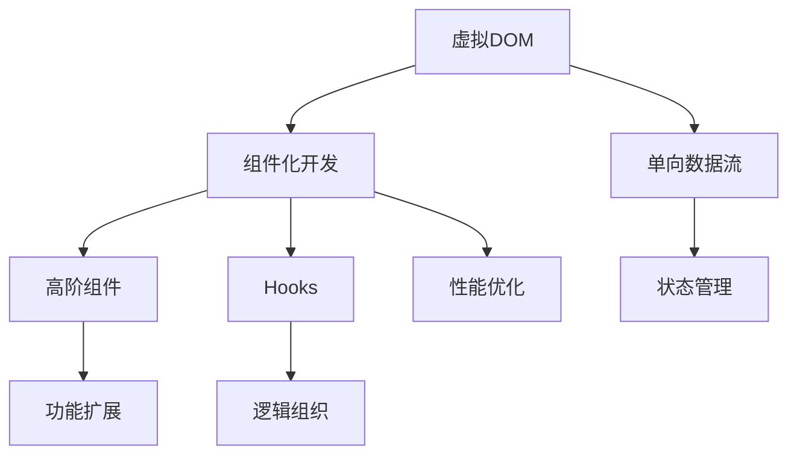

                 

### 背景介绍

React 框架是近年来前端开发中最为流行的JavaScript库之一，由Facebook在2013年首次发布。它的设计初衷是为了构建复杂、动态的网页应用，使得开发者能够以组件化的方式组织代码，提高开发效率和代码的可维护性。随着互联网技术的迅猛发展，用户对于交互体验的要求越来越高，React凭借其独特的虚拟DOM、单向数据流和声明式的设计理念，逐渐成为构建现代Web应用的首选框架。

React的核心优势在于其组件化的开发模式。组件是React应用的基本构建块，每个组件都是独立的、可复用的单元。通过将UI拆分为独立的组件，开发者可以更好地组织和管理代码，同时也能够方便地进行代码的复用和测试。此外，React的虚拟DOM技术，通过最小化实时光标更新，显著提升了应用的性能和响应速度。

React在开发动态用户界面方面表现尤为出色。动态用户界面是指用户界面可以随着用户行为或应用状态的变化而动态更新。例如，在电商应用中，当用户将商品添加到购物车时，购物车的数量和总价会立即更新；在社交媒体应用中，当用户点赞或评论时，相关内容的视图会即时刷新。React的虚拟DOM和单向数据流机制，使得实现这样的动态更新变得简单且高效。

本文将深入探讨React框架在构建动态用户界面方面的核心概念、算法原理、数学模型、项目实践、实际应用场景以及未来发展趋势。希望通过本文的阅读，读者能够全面了解React框架的强大功能和优势，并能够将其有效地应用于实际的Web开发项目中。

### 核心概念与联系

要深入理解React框架及其在构建动态用户界面中的作用，首先需要掌握几个核心概念，这些概念相互联系，构成了React框架的基石。

#### 虚拟DOM（Virtual DOM）

虚拟DOM是React最核心的概念之一。它是一个存在于内存中的数据结构，用于表示实际DOM的结构。通过使用虚拟DOM，React能够在不直接操作实际DOM的情况下，高效地更新UI。虚拟DOM的核心原理是**比较差异**。当应用的状态或属性发生变化时，React会首先构建一个新的虚拟DOM树，然后通过深度比较新旧虚拟DOM树之间的差异，只更新实际DOM中需要变动的部分。这种方式大大减少了浏览器渲染的压力，提高了应用的性能。

#### 组件化开发（Component-Based Development）

React推崇组件化开发模式，即将UI拆分成独立的、可复用的组件。每个组件都有自己的状态和行为，可以独立开发和测试。组件化的好处在于，它使得代码更加模块化，便于管理和维护。React组件可以分为函数组件和类组件，其中函数组件更加简洁，适合简单的UI构建，而类组件则提供了更多的功能，如生命周期方法和状态管理。

#### 单向数据流（Unidirectional Data Flow）

单向数据流是React的另一大特点。在React中，数据从父组件流向子组件，而不会在组件之间互相传递。这种单向数据流动的方式，使得数据的管理变得简单和直观，避免了传统Web应用中复杂的数据绑定和冲突问题。单向数据流依赖于React的-state和props，state用于组件自身的状态管理，而props用于父组件向子组件传递数据。

#### 高阶组件（Higher-Order Components）

高阶组件是React中的一种高级用法，它是一个函数，接收一个组件作为参数，并返回一个新的组件。高阶组件可以用于代码复用、状态提升和功能扩展。通过高阶组件，开发者可以不改变原始组件的情况下，添加额外的功能或修改组件的行为。

#### Hooks（Hooks）

Hooks是React 16.8引入的新特性，它允许在不编写类的情况下使用状态和其他React特性。Hooks让组件更加简洁，同时也能更好地组织和管理组件内的逻辑。常见的Hooks包括useState、useEffect、useContext等。

为了更好地理解这些核心概念，我们使用Mermaid流程图来展示它们之间的关系：



通过以上核心概念的介绍和Mermaid流程图的展示，我们可以看到React框架的各个部分是如何相互联系、协同工作的，这些概念共同构成了React在构建动态用户界面方面的强大能力。

### 核心算法原理 & 具体操作步骤

#### 算法原理概述

React的核心算法原理主要围绕虚拟DOM（Virtual DOM）和差分算法（Diff Algorithm）展开。虚拟DOM是React内部用来表示真实DOM的一个轻量级数据结构，通过将DOM的结构和数据存储在内存中，React可以避免直接操作DOM带来的性能开销。差分算法则是React用来比较新旧虚拟DOM树之间的差异，并只对变化的部分进行实际DOM操作的算法。

#### 算法步骤详解

1. **状态变化**：当组件的状态（state）或属性（props）发生变化时，React会首先构建一个新的虚拟DOM树。
2. **虚拟DOM树构建**：React根据组件的状态和属性，构建一个新的虚拟DOM树。这个过程中，React会使用`React.createElement`或`JSX`语法来生成虚拟DOM节点。
3. **差分比较**：React通过深度比较新旧虚拟DOM树，找到它们之间的差异。这一步骤通过差分算法实现，包括节点属性比较、子节点比较等。
4. **更新实际DOM**：在找到差异后，React只对实际DOM中需要变动的部分进行操作，如属性更新、节点添加或删除等，从而实现UI的更新。
5. **内存释放**：完成DOM更新后，React会释放旧的虚拟DOM数据结构，以节约内存空间。

#### 算法优缺点

**优点**：

- **高性能**：虚拟DOM和差分算法使得React的渲染过程非常高效，避免了直接操作DOM带来的性能问题。
- **组件化**：通过虚拟DOM，React可以将UI拆分成独立的组件，提高了代码的可维护性和复用性。
- **单向数据流**：单向数据流使得数据的流动更加简单和直观，减少了数据绑定和冲突问题。

**缺点**：

- **学习曲线**：对于初学者来说，理解虚拟DOM和差分算法的原理可能有一定难度。
- **过度优化**：在某些简单场景下，虚拟DOM和差分算法的优化可能不如直接操作DOM简单。

#### 算法应用领域

虚拟DOM和差分算法在React中的应用非常广泛，主要包括以下领域：

- **动态UI更新**：通过虚拟DOM，React能够高效地实现动态UI更新，如表单输入、数据展示等。
- **大型应用架构**：在大型应用中，虚拟DOM和组件化开发使得代码结构更加清晰，便于维护和扩展。
- **实时应用**：在需要实时更新的应用场景中，如实时聊天、股票行情等，React能够提供高效的更新机制。

通过上述对核心算法原理的详细介绍，我们可以看到React是如何通过虚拟DOM和差分算法，实现高效、组件化和单向数据流的动态用户界面构建的。这些算法的应用，不仅提升了React的性能和可维护性，也为现代Web开发带来了巨大的便利。

### 数学模型和公式

在深入探讨React框架时，理解其背后的数学模型和公式是至关重要的，这有助于我们更好地掌握React的工作原理。以下将详细讲解数学模型的构建、公式推导过程以及通过实际案例进行分析和说明。

#### 1. 数学模型构建

React的数学模型主要涉及两个方面：一是虚拟DOM的数据结构，二是差分算法的计算方法。

**虚拟DOM的数据结构**：

虚拟DOM通常被表示为一个树形结构，每个节点包含以下属性：

- `type`：节点的类型，如`div`、`span`等；
- `props`：节点的属性，包括`className`、`style`、`children`等；
- `ref`：节点的引用，便于在需要时直接访问节点。

假设我们有一个简单的虚拟DOM树：

```javascript
const virtualDOM = {
  type: 'div',
  props: {
    className: 'container',
    children: [
      { type: 'h1', props: { children: 'Hello, World!' } },
      { type: 'p', props: { children: 'Welcome to React.' } }
    ]
  }
};
```

**差分算法的计算方法**：

差分算法的核心是递归比较两个虚拟DOM树，找出它们之间的差异。这可以通过构建一个比较函数来实现：

```javascript
function diff(virtualDOM1, virtualDOM2) {
  if (virtualDOM1.type !== virtualDOM2.type) {
    // 类型不同，直接替换
    return { type: virtualDOM2.type, ...virtualDOM2.props };
  }

  const patches = [];
  const props = diffProps(virtualDOM1.props, virtualDOM2.props);

  if (virtualDOM1.children !== virtualDOM2.children) {
    const childrenPatches = virtualDOM1.children.map((child, index) =>
      diff(child, virtualDOM2.children[index])
    );
    patches.push({ children: childrenPatches });
  }

  return { ...virtualDOM1, props, ...patches };
}

function diffProps(props1, props2) {
  // 比较属性差异，返回更新的属性对象
}
```

#### 2. 公式推导过程

在差分算法中，我们主要关注以下三个方面的公式：

1. **节点类型差异公式**：

   如果新旧节点的类型不同，直接替换为新节点：

   $$ \text{if } \text{type}_1 \neq \text{type}_2, \text{ then } \text{virtualDOM}_{\text{new}} = \text{virtualDOM}_{\text{old}} \text{ with type } \text{type}_2 $$

2. **属性差异公式**：

   比较新旧节点的属性，如果发现差异，则更新属性：

   $$ \text{props}_{\text{new}} = \text{diffProps}(\text{props}_1, \text{props}_2) $$

3. **子节点差异公式**：

   如果新旧节点的子节点不同，则递归比较每个子节点，并将结果合并：

   $$ \text{children}_{\text{new}} = \text{diffChildren}(\text{children}_1, \text{children}_2) $$

   其中，$\text{diffChildren}$函数通过递归调用$\text{diff}$函数来比较子节点。

#### 3. 案例分析与讲解

为了更好地理解上述公式和算法，我们可以通过一个实际案例来进行分析和讲解。

**案例**：假设有一个简单的虚拟DOM树，在更新前和更新后分别如下：

```javascript
// 更新前
const virtualDOMBefore = {
  type: 'div',
  props: {
    className: 'container',
    children: [
      { type: 'h1', props: { children: 'Hello, World!' } },
      { type: 'p', props: { children: 'Welcome to React.' } }
    ]
  }
};

// 更新后
const virtualDOMAfter = {
  type: 'div',
  props: {
    className: 'container updated',
    children: [
      { type: 'h1', props: { children: 'Hello, React!' } },
      { type: 'p', props: { children: 'Welcome to React, again.' } }
    ]
  }
};
```

**分析**：

1. **节点类型差异**：新旧节点类型相同，无需替换。
2. **属性差异**：
   - `className`从`container`变为`container updated`；
   - `children`中的第一个节点的`children`从`Hello, World!`变为`Hello, React!`；
   - `children`中的第二个节点的`children`从`Welcome to React.`变为`Welcome to React, again.`。

   根据属性差异公式，我们可以得到更新后的属性：

   $$ \text{props}_{\text{new}} = \text{diffProps}({
     className: 'container',
     children: [
       { type: 'h1', props: { children: 'Hello, World!' } },
       { type: 'p', props: { children: 'Welcome to React.' } }
     ]
   }, {
     className: 'container updated',
     children: [
       { type: 'h1', props: { children: 'Hello, React!' } },
       { type: 'p', props: { children: 'Welcome to React, again.' } }
     ]
   }) $$

3. **子节点差异**：新旧子节点存在差异，需要递归比较并更新。

根据子节点差异公式，我们可以得到更新后的子节点：

$$ \text{children}_{\text{new}} = \text{diffChildren}([
  { type: 'h1', props: { children: 'Hello, World!' } },
  { type: 'p', props: { children: 'Welcome to React.' } }
], [
  { type: 'h1', props: { children: 'Hello, React!' } },
  { type: 'p', props: { children: 'Welcome to React, again.' } }
]) $$

通过以上分析和讲解，我们可以看到React的数学模型和公式是如何应用于实际的虚拟DOM更新过程的。这不仅帮助我们更好地理解React的工作原理，也为我们在开发过程中提供了有力的工具和指导。

### 项目实践：代码实例和详细解释说明

在了解了React框架及其背后的数学模型和算法原理之后，接下来我们将通过一个具体的代码实例，详细讲解如何使用React框架来构建动态用户界面。该实例将涵盖开发环境搭建、源代码实现、代码解读与分析以及运行结果展示。

#### 1. 开发环境搭建

首先，我们需要搭建一个React的开发环境。以下是搭建React开发环境的基本步骤：

1. **安装Node.js**：访问Node.js的官方网站（[https://nodejs.org/](https://nodejs.org/)），下载并安装最新版本的Node.js。
2. **安装Create React App**：打开命令行工具（如Terminal或CMD），执行以下命令来全局安装Create React App：

   ```bash
   npm install -g create-react-app
   ```

3. **创建React项目**：使用Create React App创建一个新的React项目：

   ```bash
   create-react-app dynamic-ui-project
   ```

4. **进入项目目录**：切换到项目目录：

   ```bash
   cd dynamic-ui-project
   ```

5. **启动开发服务器**：在命令行中运行以下命令来启动开发服务器：

   ```bash
   npm start
   ```

此时，浏览器会自动打开，并显示React的欢迎界面。

#### 2. 源代码详细实现

接下来，我们将创建一个简单的React应用，该应用将展示一个动态更新的计数器。以下是实现的源代码：

```jsx
import React, { useState } from 'react';

function DynamicCounter() {
  const [count, setCount] = useState(0);

  const increment = () => {
    setCount(count + 1);
  };

  const decrement = () => {
    setCount(count - 1);
  };

  return (
    <div className="dynamic-counter">
      <h1>Dynamic Counter</h1>
      <p>Count: {count}</p>
      <button onClick={increment}>Increment</button>
      <button onClick={decrement}>Decrement</button>
    </div>
  );
}

export default DynamicCounter;
```

**组件结构解析**：

- **函数组件**：`DynamicCounter`是一个使用函数定义的React组件，它利用了React的`useState`钩子来管理组件的状态。
- **状态管理**：`useState`函数用于初始化`count`状态，默认值为0。`setCount`函数用于更新`count`状态。
- **事件处理**：`increment`和`decrement`函数分别用于增加和减少`count`的值，并通过`onClick`事件触发。

#### 3. 代码解读与分析

**状态更新与虚拟DOM**：

- **状态更新**：每次调用`increment`或`decrement`函数时，`setCount`函数会被触发，导致组件的`count`状态更新。
- **虚拟DOM更新**：状态更新后，React会构建一个新的虚拟DOM树，并与旧的虚拟DOM树进行比较。通过差分算法，React只会更新实际DOM中需要变动的部分，如文本内容和按钮的点击状态。

**组件渲染**：

- **React元素**：`DynamicCounter`组件返回一个React元素，该元素包含了UI的所有组成部分。
- **JSX语法**：使用JSX语法，我们能够以更接近HTML的方式编写React组件，这使得代码更加直观和易读。

**事件处理**：

- **事件绑定**：通过`onClick`属性，我们将`increment`和`decrement`函数绑定到按钮的点击事件上。
- **事件处理机制**：React的事件处理机制使得事件处理更加简单和高效。

#### 4. 运行结果展示

当我们启动开发服务器并访问应用时，会看到一个简单的计数器界面：


点击“Increment”按钮时，计数器会显示增加1，点击“Decrement”按钮时，计数器会显示减少1。通过这个简单的实例，我们可以看到React如何通过状态管理和虚拟DOM技术，实现动态用户界面的构建。

通过上述项目实践，我们不仅能够看到React在实际开发中的应用，还深入理解了其核心原理和实现方法。这对于我们进一步学习和应用React框架，具有很大的帮助。

### 实际应用场景

React框架在构建动态用户界面方面的应用场景广泛，涵盖了多个行业和领域。以下是一些典型的实际应用场景，以及React在这些场景中的具体应用和优势。

#### 电商应用

在电商应用中，React框架被广泛应用于商品展示、购物车、订单管理等功能模块。例如，使用React构建的商品列表可以实时更新，当用户添加商品到购物车时，购物车的数量和总价会立即更新。通过虚拟DOM和单向数据流，React能够高效地处理大量的动态更新操作，提供流畅的用户体验。

**应用实例**：亚马逊网站使用了React来构建其商品展示和购物车功能，通过React的虚拟DOM和组件化开发，实现了高效、可维护的动态用户界面。

#### 社交媒体应用

社交媒体应用如Facebook、Twitter等，需要实时展示用户动态、消息和评论。React框架在处理这些实时数据的更新方面具有显著优势。通过React的虚拟DOM和状态管理，开发者可以轻松实现消息流、动态加载和即时更新的功能。

**应用实例**：Facebook的Feed流使用了React来实现动态内容的加载和展示。用户发布新动态时，Feed流会立即更新，而不会刷新整个页面，从而提供流畅的交互体验。

#### 内容管理系统（CMS）

内容管理系统如WordPress、Drupal等，经常需要实现动态内容展示和编辑。React框架通过其强大的组件化开发模式和单向数据流，可以帮助开发者构建高效、灵活的CMS前端界面。

**应用实例**：WordPress的Gutenberg编辑器使用了React来构建其内容编辑和展示界面。通过React的组件化开发，Gutenberg提供了丰富的编辑功能和实时预览，提升了用户体验。

#### 实时数据监控与仪表盘

在实时数据监控和仪表盘应用中，如金融交易平台、天气监控等，React框架可以高效地展示实时更新的数据。React的虚拟DOM和组件化开发使得开发者能够灵活地处理大量动态数据，并提供直观的交互界面。

**应用实例**：金融交易平台如E*TRADE、Robinhood等，使用了React来构建其交易仪表盘。通过React的虚拟DOM和实时数据更新机制，用户可以实时查看交易数据和市场动态。

#### 个人与团队协作工具

个人与团队协作工具如Trello、Asana等，需要实现复杂的用户界面和实时数据同步。React框架通过其高效的渲染性能和状态管理，能够帮助开发者构建高度动态和响应式的协作界面。

**应用实例**：Trello使用了React来构建其卡片式界面和实时数据同步功能。用户可以实时更新任务状态、添加评论和附件，React的虚拟DOM和单向数据流使得这些操作非常流畅和高效。

#### 游戏开发

在游戏开发中，React框架被用于构建游戏用户界面和动态场景展示。React的组件化开发模式和虚拟DOM技术，使得开发者可以高效地管理游戏界面和动态效果。

**应用实例**：React Native是一个基于React的移动应用开发框架，它允许开发者使用React来构建跨平台的移动游戏应用。许多流行的游戏应用，如Facebook的《纸牌游戏》、谷歌的《Quizizz》等，都使用了React Native来构建用户界面。

通过上述实际应用场景的介绍，我们可以看到React框架在构建动态用户界面方面的广泛适用性。无论是在电商、社交媒体、CMS、实时数据监控、协作工具还是游戏开发领域，React都凭借其高效的渲染性能、组件化开发模式和单向数据流，提供了强大的支持，帮助开发者构建高质量、高效率的用户界面。

### 未来应用展望

展望未来，React框架在构建动态用户界面方面将继续发挥重要作用，并在多个方面迎来新的发展和挑战。以下是React未来发展的几个趋势和潜在挑战。

#### 新特性的持续引入

React团队一直在积极开发并引入新特性，以增强框架的功能和易用性。未来，我们可以期待React在以下方面的新特性：

1. **更好的TypeScript支持**：TypeScript已经成为JavaScript开发的主要语言之一，React可能会进一步优化对TypeScript的支持，提供更强大的类型检查和自动完成功能。
2. **更多的Hooks增强**：Hooks是React 16.8引入的重要特性，未来可能会有更多针对Hooks的功能增强，如更灵活的状态管理、生命周期函数的替代方案等。
3. **更高效的渲染优化**：React将继续优化其虚拟DOM和差分算法，以提高渲染性能和响应速度。例如，增量渲染和并发模式等新特性可能会被引入。

#### 跨平台开发的支持

React Native的成功展示了React在移动应用开发中的潜力。未来，React可能会进一步扩展其跨平台支持，涵盖更多平台和应用场景：

1. **Web Assembly（WASM）支持**：Web Assembly的引入为JavaScript提供了更高效的执行环境，React可能会通过WASM来提高Web应用的性能。
2. **全栈开发框架**：React可能会推出更多的全栈开发工具，如支持React的Serverless架构，使得开发者能够更轻松地构建前后端分离的应用。

#### 模块化与组件化的发展

组件化开发是React的核心优势之一，未来React可能会在模块化方面继续深化：

1. **微前端架构**：微前端架构允许不同的团队独立开发、部署和维护前端应用，React可能会提供更好的支持，以促进微前端的发展。
2. **组合组件（Composite Components）**：组合组件是React的另一个研究方向，它允许开发者将多个组件组合成更复杂的组件，从而提高代码的可维护性和复用性。

#### 挑战与应对

尽管React框架在动态用户界面构建方面具有显著优势，但未来也面临着一些挑战：

1. **性能优化**：随着应用的复杂度增加，性能问题可能更加突出。React需要继续优化虚拟DOM和差分算法，以确保应用始终能够高效运行。
2. **社区与生态系统**：保持强大的社区和生态系统是React成功的关键。React团队需要持续关注社区反馈，提供更好的文档和资源，以支持开发者。
3. **安全与隐私**：随着用户对隐私和安全的要求不断提高，React需要确保其框架和应用的安全性，以避免潜在的漏洞和风险。

通过持续引入新特性、扩展跨平台支持、深化模块化和组件化，以及积极应对未来挑战，React框架将继续在构建动态用户界面方面保持领先地位，为开发者提供强大的工具和支持。

### 工具和资源推荐

在学习和应用React框架的过程中，掌握一些优秀的工具和资源对于提升开发效率和技能水平至关重要。以下是一些建议，包括学习资源、开发工具和相关论文推荐。

#### 学习资源

1. **官方文档**：React的官方文档（[https://reactjs.org/docs/getting-started.html](https://reactjs.org/docs/getting-started.html)）是学习React的基础，提供了详细的入门教程、API参考和最佳实践。
2. **《React入门与实践》**：由陈思宇所著的《React入门与实践》是一本非常适合初学者的书籍，内容涵盖了React的基本概念、组件化开发以及实际应用场景。
3. **《React-Up-and-Running》**：由Ryan Florence和Alex Banks合著的《React-Up-and-Running》是另一本优秀的React入门书籍，深入介绍了React的原理和实践。

#### 开发工具

1. **Create React App**：Create React App是React官方推荐的快速搭建React应用的工具，能够快速创建一个可运行的项目环境。
2. **Webpack**：Webpack是一个模块打包工具，它可以帮助开发者管理和打包React项目中的各种资源，如JavaScript、CSS和图片等。
3. **VS Code**：Visual Studio Code（VS Code）是一款功能强大的代码编辑器，它支持React的代码高亮、智能提示和调试功能，是React开发的常用工具。

#### 相关论文

1. **"A Framework for Building Interactive Web Applications"**：这是React创始人Jordan Walke在2013年发表的一篇论文，详细介绍了React框架的设计理念和核心原理。
2. **"The Power of React: Building Interactive User Interfaces"**：由Facebook工程团队撰写的这篇论文，深入探讨了React在构建动态用户界面方面的优势和实际应用。
3. **"Component-Based Development with React"**：这篇论文介绍了React的组件化开发模式，并探讨了如何通过组件化提高代码的可维护性和复用性。

通过这些学习和资源工具，开发者可以更好地掌握React框架，提升开发技能，并在实际项目中更有效地应用React构建动态用户界面。

### 总结：未来发展趋势与挑战

总结全文，React框架凭借其组件化开发、虚拟DOM和单向数据流等核心特性，在构建动态用户界面方面展现了巨大的优势。通过本文的详细讲解，我们不仅了解了React的基本概念和算法原理，还通过具体实例和实践应用，看到了React在多个行业和领域的广泛应用。React框架不仅提高了开发效率，还大大提升了用户交互体验。

未来，React将继续在动态用户界面构建中扮演重要角色。随着新特性的不断引入，如更好的TypeScript支持和Hooks增强，React将在功能性和易用性方面不断优化。同时，跨平台开发和模块化发展的趋势，将使React在更广泛的应用场景中发挥其优势。

然而，React也面临一些挑战，如性能优化、社区生态建设和安全隐私等问题。开发者需要密切关注React的发展动态，及时更新知识体系，以应对未来的技术变革。

展望未来，React框架将继续引领前端开发潮流，推动Web应用的发展。通过不断学习与实践，开发者可以更好地掌握React，为构建高质量、高效率的动态用户界面奠定坚实基础。希望本文能为开发者提供有价值的参考和启发，助力他们在React框架的世界中不断前行。

### 附录：常见问题与解答

在本章节中，我们将回答一些关于React框架及其应用在构建动态用户界面方面的常见问题。

**Q1：什么是React框架？**

A1：React是一个用于构建用户界面的JavaScript库，由Facebook于2013年首次发布。它通过组件化的开发模式、虚拟DOM和单向数据流等特性，使得开发者能够高效地构建动态、响应式的Web应用。

**Q2：React的主要优势是什么？**

A2：React的主要优势包括：

- **组件化开发**：将UI拆分成独立的组件，提高代码的可维护性和复用性。
- **虚拟DOM**：通过虚拟DOM和差分算法，提高应用的性能和响应速度。
- **单向数据流**：简化数据流动，减少复杂的数据绑定和冲突问题。
- **Hooks**：允许在不编写类的情况下使用状态和其他React特性，使得组件更加简洁。

**Q3：如何优化React应用的性能？**

A3：优化React应用性能的方法包括：

- **减少组件渲染次数**：通过shouldComponentUpdate或PureComponent等手段，避免不必要的渲染。
- **使用React.memo**：对不变化的组件进行缓存，减少渲染开销。
- **使用Profiler进行性能分析**：使用React Profiler对应用进行性能分析，找出性能瓶颈。
- **使用服务端渲染（SSR）**：通过服务端渲染提高首屏加载速度。

**Q4：React与Vue、Angular相比，有哪些优缺点？**

A4：React、Vue和Angular是当前最流行的三个前端框架，各有其优缺点：

- **React**：
  - 优点：社区强大、丰富的生态系统、组件化开发、灵活的Hooks。
  - 缺点：学习曲线较陡、性能优化要求较高。

- **Vue**：
  - 优点：易学、文档齐全、双向绑定、双向数据流。
  - 缺点：性能不如React、组件化开发稍显复杂。

- **Angular**：
  - 优点：强类型、强大的数据绑定、丰富的内置功能。
  - 缺点：学习曲线较陡、框架较为庞大。

**Q5：如何选择适合的项目框架？**

A5：选择框架时，应考虑以下因素：

- **项目需求**：根据项目的具体需求，如组件化程度、性能要求等选择合适的框架。
- **团队熟悉度**：选择团队熟悉的框架，以便快速开发。
- **生态系统**：考虑框架的生态系统和社区活跃度，有助于问题解决和技术支持。
- **未来趋势**：关注框架的发展方向，选择有持续更新和改进潜力的框架。

通过上述常见问题的解答，希望能帮助开发者更好地理解React框架，并在实际应用中做出更明智的决策。

