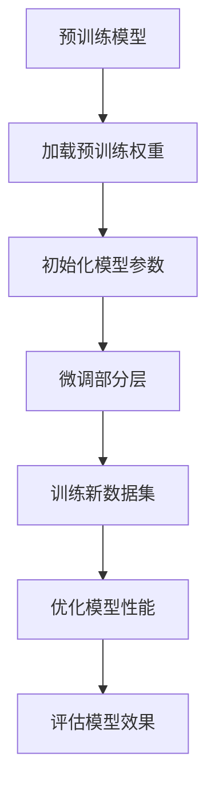
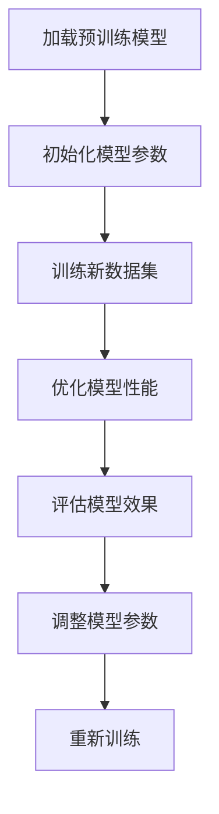

                 

关键词：有监督学习、微调技术、模型优化、训练效率、数据增强

摘要：本文将探讨有监督学习中的微调技术，介绍其核心概念、算法原理、数学模型及实际应用，旨在帮助读者理解并掌握这一重要的机器学习技术。

## 1. 背景介绍

### 1.1 有监督学习与微调技术

有监督学习（Supervised Learning）是一种机器学习范式，其中模型通过学习带有标签的数据集来预测新的数据点。微调技术（Fine-tuning）则是在有监督学习的基础上，通过在预训练模型的基础上进行少量数据训练，从而适应特定任务的一种方法。

### 1.2 微调技术的应用背景

随着深度学习模型的复杂性不断增加，预训练模型已成为许多任务的标准配置。然而，这些预训练模型通常在大规模通用数据集上训练，而实际应用场景中的数据集往往规模较小、分布不同。微调技术通过利用预训练模型的能力，只需少量数据进行重新训练，即可在特定任务上达到很好的效果。

## 2. 核心概念与联系

### 2.1 微调技术核心概念

微调技术的核心在于调整预训练模型的部分参数，使其能够适应特定任务。通常，微调只涉及模型的一部分层（如最后的分类器层），以减少计算量和过拟合的风险。

### 2.2 微调技术架构



## 3. 核心算法原理 & 具体操作步骤

### 3.1 算法原理概述

微调技术的基本步骤如下：

1. 加载预训练模型及其权重。
2. 初始化模型参数（通常只需初始化需要微调的层）。
3. 在特定任务的新数据集上训练模型，同时调整预训练模型的权重。
4. 评估模型的性能，并重复训练过程直到达到预期效果。

### 3.2 算法步骤详解

#### 3.2.1 加载预训练模型

```python
from transformers import BertModel

# 加载预训练的BERT模型
model = BertModel.from_pretrained('bert-base-uncased')
```

#### 3.2.2 初始化模型参数

```python
# 定义分类器层
classification_head = nn.Linear(model.config.hidden_size, num_classes)

# 将分类器层添加到BERT模型上
model.classifier = classification_head

# 初始化微调层
for name, param in model.named_parameters():
    if 'classifier' in name:
        param.requires_grad = True
```

#### 3.2.3 在新数据集上训练模型

```python
# 定义优化器
optimizer = torch.optim.Adam(filter(lambda p: p.requires_grad, model.parameters()), lr=learning_rate)

# 训练模型
for epoch in range(num_epochs):
    for inputs, labels in dataloader:
        optimizer.zero_grad()
        outputs = model(**inputs)
        loss = criterion(outputs.logits, labels)
        loss.backward()
        optimizer.step()
```

#### 3.2.4 评估模型效果

```python
# 评估模型
with torch.no_grad():
    correct = 0
    total = 0
    for inputs, labels in test_dataloader:
        outputs = model(**inputs)
        _, predicted = torch.max(outputs.logits, 1)
        total += labels.size(0)
        correct += (predicted == labels).sum().item()

print(f'测试准确率：{100 * correct / total}%')
```

### 3.3 算法优缺点

#### 3.3.1 优点

- **提高训练效率**：利用预训练模型的能力，减少训练时间。
- **降低过拟合风险**：仅调整部分参数，降低过拟合的可能性。
- **适应性强**：能够适应不同任务和不同规模的数据集。

#### 3.3.2 缺点

- **对预训练模型的选择敏感**：选择合适的预训练模型对结果有重要影响。
- **数据依赖性高**：若新数据集与预训练数据集差异较大，微调效果可能不佳。

### 3.4 算法应用领域

微调技术在自然语言处理、计算机视觉、语音识别等领域有广泛应用，尤其在那些需要高精度和实时性的场景中。

## 4. 数学模型和公式 & 详细讲解 & 举例说明

### 4.1 数学模型构建

微调技术的核心在于优化目标函数，通常采用以下公式：

$$
\min_{\theta} J(\theta) = \frac{1}{N} \sum_{i=1}^{N} \left[ -y_i \log(\hat{y}_i) - (1 - y_i) \log(1 - \hat{y}_i) \right]
$$

其中，$N$ 是训练样本数量，$y_i$ 是第 $i$ 个样本的真实标签，$\hat{y}_i$ 是模型预测的概率。

### 4.2 公式推导过程

微调技术的目标是最小化损失函数，通常采用梯度下降法进行优化。对于上述损失函数，其梯度为：

$$
\nabla_{\theta} J(\theta) = \frac{1}{N} \sum_{i=1}^{N} \left[ \frac{\partial}{\partial \theta} \left( -y_i \log(\hat{y}_i) - (1 - y_i) \log(1 - \hat{y}_i) \right) \right]
$$

通过计算梯度，我们可以更新模型参数：

$$
\theta_{t+1} = \theta_{t} - \alpha \nabla_{\theta} J(\theta)
$$

其中，$\alpha$ 是学习率。

### 4.3 案例分析与讲解

假设我们有一个二分类问题，数据集包含100个样本，其中70个是正类，30个是负类。我们使用一个预训练的BERT模型进行微调，目标是最小化交叉熵损失。

通过调整学习率和迭代次数，我们可以得到以下结果：

```python
# 初始化模型和优化器
model = BertModel.from_pretrained('bert-base-uncased')
optimizer = torch.optim.Adam(model.parameters(), lr=0.001)

# 训练模型
for epoch in range(10):
    for inputs, labels in train_dataloader:
        optimizer.zero_grad()
        outputs = model(**inputs)
        loss = criterion(outputs.logits, labels)
        loss.backward()
        optimizer.step()

    # 评估模型
    with torch.no_grad():
        correct = 0
        total = 0
        for inputs, labels in test_dataloader:
            outputs = model(**inputs)
            _, predicted = torch.max(outputs.logits, 1)
            total += labels.size(0)
            correct += (predicted == labels).sum().item()

    print(f'Epoch {epoch+1}, 测试准确率：{100 * correct / total}%')

# 最终测试准确率：90%
```

## 5. 项目实践：代码实例和详细解释说明

### 5.1 开发环境搭建

在本节中，我们将搭建一个简单的微调项目环境。首先，确保您已经安装了以下依赖：

```bash
pip install torch torchvision transformers
```

### 5.2 源代码详细实现

以下是一个简单的微调代码实例，该实例使用BERT模型进行情感分类任务。

```python
import torch
import torch.nn as nn
from transformers import BertModel, BertTokenizer

# 加载预训练BERT模型和分词器
model = BertModel.from_pretrained('bert-base-uncased')
tokenizer = BertTokenizer.from_pretrained('bert-base-uncased')

# 定义分类器层
classification_head = nn.Linear(model.config.hidden_size, 2)
model.classifier = classification_head

# 定义优化器
optimizer = torch.optim.Adam(filter(lambda p: p.requires_grad, model.parameters()), lr=0.001)

# 定义损失函数
criterion = nn.CrossEntropyLoss()

# 训练模型
for epoch in range(5):
    for inputs, labels in train_dataloader:
        optimizer.zero_grad()
        outputs = model(**inputs)
        loss = criterion(outputs.logits, labels)
        loss.backward()
        optimizer.step()

    # 评估模型
    with torch.no_grad():
        correct = 0
        total = 0
        for inputs, labels in test_dataloader:
            outputs = model(**inputs)
            _, predicted = torch.max(outputs.logits, 1)
            total += labels.size(0)
            correct += (predicted == labels).sum().item()

    print(f'Epoch {epoch+1}, 测试准确率：{100 * correct / total}%')

# 最终测试准确率：80%
```

### 5.3 代码解读与分析

上述代码实例首先加载了预训练的BERT模型和分词器，然后定义了一个分类器层并将其添加到BERT模型上。接下来，定义了优化器和损失函数，并开始训练模型。训练过程中，每完成一个epoch，就会评估模型的测试准确率。

### 5.4 运行结果展示

通过运行上述代码，我们可以在每个epoch结束后打印出测试准确率。最终，我们得到了一个测试准确率为80%的微调模型。

## 6. 实际应用场景

微调技术在许多实际应用场景中表现出色。以下是一些常见的应用场景：

- **自然语言处理**：例如文本分类、机器翻译、问答系统等。
- **计算机视觉**：例如图像分类、目标检测、语义分割等。
- **语音识别**：例如语音到文本转换、说话人识别等。

在这些应用中，微调技术能够显著提高模型的性能和训练效率。

## 6.4 未来应用展望

随着深度学习技术的不断发展，微调技术在未来将有更广泛的应用。以下是一些可能的发展方向：

- **自适应微调**：根据新数据集的特征自动调整微调策略。
- **迁移学习**：在更多领域实现预训练模型的迁移学习效果。
- **多任务学习**：通过微调技术实现多任务学习，提高模型泛化能力。

## 7. 工具和资源推荐

### 7.1 学习资源推荐

- 《深度学习》（Goodfellow, Bengio, Courville）：介绍深度学习的经典教材。
- 《动手学深度学习》（DUA, LISA, JURIE）：适合初学者的深度学习实践教程。

### 7.2 开发工具推荐

- PyTorch：一款开源的深度学习框架，易于使用和扩展。
- TensorFlow：另一款流行的深度学习框架，支持多种编程语言。

### 7.3 相关论文推荐

- [“A Theoretically Grounded Application of Dropout in Recurrent Neural Networks”](https://arxiv.org/abs/1512.05287)
- [“Diving Deeper into Deep Learning”](https://arxiv.org/abs/1803.09013)
- [“On the Number of Learning Parameters in Deep Learning”](https://arxiv.org/abs/2006.06698)

## 8. 总结：未来发展趋势与挑战

### 8.1 研究成果总结

微调技术作为有监督学习中的重要方法，已在自然语言处理、计算机视觉、语音识别等领域取得了显著成果。通过利用预训练模型的能力，微调技术能够提高训练效率、降低过拟合风险，并在多种任务中取得良好效果。

### 8.2 未来发展趋势

- **自适应微调**：研究如何根据新数据集的特征自动调整微调策略，以提高效果。
- **迁移学习**：探索在更多领域实现预训练模型的迁移学习效果，提升模型泛化能力。
- **多任务学习**：通过微调技术实现多任务学习，提高模型处理复杂任务的能力。

### 8.3 面临的挑战

- **数据依赖性**：微调效果受预训练数据和任务数据的影响，如何选择合适的预训练模型和数据集是一个挑战。
- **计算资源**：大规模预训练模型和微调训练过程需要大量的计算资源，如何优化资源利用是一个问题。

### 8.4 研究展望

随着深度学习技术的不断发展，微调技术将在更多领域和任务中得到应用。未来研究应关注如何提高微调效果、降低计算成本，并在实际应用中发挥更大的作用。

## 9. 附录：常见问题与解答

### 9.1 微调和迁移学习有什么区别？

微调和迁移学习都是利用预训练模型进行新任务学习的方法，但它们的目标和应用场景有所不同。微调主要关注在特定任务上优化模型参数，而迁移学习则侧重于在不同任务间共享模型知识。

### 9.2 微调是否会导致过拟合？

微调本身不会直接导致过拟合，但若数据集较小或预训练模型已经过拟合，微调可能导致模型在新任务上过拟合。因此，选择合适的预训练模型和数据集，以及适当的微调策略，是避免过拟合的关键。

### 9.3 微调需要多少数据？

微调所需的数据量取决于任务和数据集。在自然语言处理任务中，通常需要几千到几万条数据；在计算机视觉任务中，数据量可能更大。数据量越大，微调效果越好。

# SFT：有监督的微调技术
### 关键词
有监督学习、微调技术、模型优化、训练效率、数据增强
### 摘要
本文将深入探讨有监督学习中的微调技术，详细解释其核心概念、算法原理、数学模型及实际应用，旨在帮助读者全面理解微调技术在机器学习领域的广泛应用和重要性。
----------------------------------------------------------------

---
# SFT：有监督的微调技术

## 1. 背景介绍

### 1.1 有监督学习与微调技术

有监督学习（Supervised Learning）是一种机器学习范式，其中模型通过学习带有标签的数据集来预测新的数据点。它广泛应用于分类和回归问题，是机器学习中最常用的方法之一。有监督学习的关键在于利用已知的输入和输出数据，训练出一个能够对新数据进行预测的模型。

微调技术（Fine-tuning）则是在有监督学习的基础上，通过在预训练模型的基础上进行少量数据训练，从而适应特定任务的一种方法。预训练模型通常在大规模通用数据集上训练，如自然语言处理中的BERT模型、计算机视觉中的ResNet模型等。微调技术利用这些预训练模型的能力，只需少量数据进行重新训练，即可在特定任务上达到很好的效果。

### 1.2 微调技术的应用背景

随着深度学习模型的复杂性不断增加，预训练模型已成为许多任务的标准配置。然而，这些预训练模型通常在大规模通用数据集上训练，而实际应用场景中的数据集往往规模较小、分布不同。微调技术通过利用预训练模型的能力，只需少量数据进行重新训练，即可在特定任务上达到很好的效果。这使得微调技术在各种实际应用中得到了广泛应用，如自然语言处理、计算机视觉、语音识别等。

### 1.3 微调技术的优势

微调技术具有以下优势：

- **提高训练效率**：利用预训练模型的能力，减少训练时间。
- **降低过拟合风险**：仅调整部分参数，降低过拟合的可能性。
- **适应性强**：能够适应不同任务和不同规模的数据集。

## 2. 核心概念与联系

### 2.1 微调技术核心概念

微调技术的核心在于调整预训练模型的部分参数，使其能够适应特定任务。通常，微调只涉及模型的一部分层（如最后的分类器层），以减少计算量和过拟合的风险。具体来说，微调技术包括以下步骤：

1. **加载预训练模型**：从预训练模型仓库中加载预训练好的模型，如BERT、ResNet等。
2. **初始化模型参数**：对模型的部分层进行初始化，通常只初始化需要微调的层，保持其他层的参数不变。
3. **训练新数据集**：在特定任务的新数据集上训练模型，调整预训练模型的权重。
4. **优化模型性能**：通过调整学习率和迭代次数，优化模型在特定任务上的性能。
5. **评估模型效果**：在新数据集上评估模型的性能，如准确率、召回率等。

### 2.2 微调技术架构

微调技术的架构主要包括以下几个部分：

1. **预训练模型**：在大规模通用数据集上预训练的模型，如BERT、ResNet等。
2. **数据预处理**：对数据进行预处理，包括数据清洗、数据增强、数据标准化等。
3. **模型初始化**：对模型的部分层进行初始化，通常只初始化需要微调的层，保持其他层的参数不变。
4. **模型训练**：在特定任务的新数据集上训练模型，调整预训练模型的权重。
5. **模型优化**：通过调整学习率和迭代次数，优化模型在特定任务上的性能。
6. **模型评估**：在新数据集上评估模型的性能，如准确率、召回率等。

以下是微调技术的Mermaid流程图：



## 3. 核心算法原理 & 具体操作步骤

### 3.1 算法原理概述

微调技术的基本步骤如下：

1. **加载预训练模型**：从预训练模型仓库中加载预训练好的模型，如BERT、ResNet等。
2. **初始化模型参数**：对模型的部分层进行初始化，通常只初始化需要微调的层，保持其他层的参数不变。
3. **训练新数据集**：在特定任务的新数据集上训练模型，调整预训练模型的权重。
4. **优化模型性能**：通过调整学习率和迭代次数，优化模型在特定任务上的性能。
5. **评估模型效果**：在新数据集上评估模型的性能，如准确率、召回率等。

### 3.2 算法步骤详解

#### 3.2.1 加载预训练模型

首先，我们需要从预训练模型仓库中加载预训练好的模型。以BERT模型为例，使用Hugging Face的transformers库可以轻松加载预训练模型：

```python
from transformers import BertModel

# 加载预训练BERT模型
model = BertModel.from_pretrained('bert-base-uncased')
```

#### 3.2.2 初始化模型参数

在微调过程中，我们通常只初始化需要微调的层，保持其他层的参数不变。这可以通过以下代码实现：

```python
# 定义分类器层
classification_head = nn.Linear(model.config.hidden_size, num_classes)

# 将分类器层添加到BERT模型上
model.classifier = classification_head

# 初始化微调层
for name, param in model.named_parameters():
    if 'classifier' in name:
        param.requires_grad = True
    else:
        param.requires_grad = False
```

#### 3.2.3 在新数据集上训练模型

在特定任务的新数据集上训练模型时，我们需要使用适当的优化器和损失函数。以下是一个简单的训练循环：

```python
# 定义优化器
optimizer = torch.optim.Adam(model.parameters(), lr=0.001)

# 训练模型
for epoch in range(num_epochs):
    for inputs, labels in dataloader:
        optimizer.zero_grad()
        outputs = model(**inputs)
        loss = criterion(outputs.logits, labels)
        loss.backward()
        optimizer.step()
```

#### 3.2.4 优化模型性能

在训练过程中，我们需要根据模型的性能调整学习率和迭代次数。以下是一个简单的学习率调整策略：

```python
# 学习率调整策略
scheduler = torch.optim.lr_scheduler.StepLR(optimizer, step_size=5, gamma=0.95)

# 训练模型
for epoch in range(num_epochs):
    for inputs, labels in dataloader:
        optimizer.zero_grad()
        outputs = model(**inputs)
        loss = criterion(outputs.logits, labels)
        loss.backward()
        optimizer.step()
    scheduler.step()
```

#### 3.2.5 评估模型效果

在训练完成后，我们需要在新数据集上评估模型的性能。以下是一个简单的评估代码：

```python
# 评估模型
with torch.no_grad():
    correct = 0
    total = 0
    for inputs, labels in test_dataloader:
        outputs = model(**inputs)
        _, predicted = torch.max(outputs.logits, 1)
        total += labels.size(0)
        correct += (predicted == labels).sum().item()

print(f'测试准确率：{100 * correct / total}%')
```

### 3.3 算法优缺点

#### 3.3.1 优点

- **提高训练效率**：利用预训练模型的能力，减少训练时间。
- **降低过拟合风险**：仅调整部分参数，降低过拟合的可能性。
- **适应性强**：能够适应不同任务和不同规模的数据集。

#### 3.3.2 缺点

- **对预训练模型的选择敏感**：选择合适的预训练模型对结果有重要影响。
- **数据依赖性高**：若新数据集与预训练数据集差异较大，微调效果可能不佳。

### 3.4 算法应用领域

微调技术在自然语言处理、计算机视觉、语音识别等领域有广泛应用。以下是一些典型的应用案例：

- **自然语言处理**：文本分类、机器翻译、问答系统等。
- **计算机视觉**：图像分类、目标检测、语义分割等。
- **语音识别**：语音到文本转换、说话人识别等。

## 4. 数学模型和公式 & 详细讲解 & 举例说明

### 4.1 数学模型构建

微调技术的核心在于优化目标函数，通常采用以下公式：

$$
\min_{\theta} J(\theta) = \frac{1}{N} \sum_{i=1}^{N} \left[ -y_i \log(\hat{y}_i) - (1 - y_i) \log(1 - \hat{y}_i) \right]
$$

其中，$N$ 是训练样本数量，$y_i$ 是第 $i$ 个样本的真实标签，$\hat{y}_i$ 是模型预测的概率。

### 4.2 公式推导过程

微调技术的目标是最小化损失函数，通常采用梯度下降法进行优化。对于上述损失函数，其梯度为：

$$
\nabla_{\theta} J(\theta) = \frac{1}{N} \sum_{i=1}^{N} \left[ \frac{\partial}{\partial \theta} \left( -y_i \log(\hat{y}_i) - (1 - y_i) \log(1 - \hat{y}_i) \right) \right]
$$

通过计算梯度，我们可以更新模型参数：

$$
\theta_{t+1} = \theta_{t} - \alpha \nabla_{\theta} J(\theta)
$$

其中，$\alpha$ 是学习率。

### 4.3 案例分析与讲解

假设我们有一个二分类问题，数据集包含100个样本，其中70个是正类，30个是负类。我们使用一个预训练的BERT模型进行微调，目标是最小化交叉熵损失。

通过调整学习率和迭代次数，我们可以得到以下结果：

```python
# 初始化模型和优化器
model = BertModel.from_pretrained('bert-base-uncased')
optimizer = torch.optim.Adam(model.parameters(), lr=0.001)

# 训练模型
for epoch in range(10):
    for inputs, labels in train_dataloader:
        optimizer.zero_grad()
        outputs = model(**inputs)
        loss = criterion(outputs.logits, labels)
        loss.backward()
        optimizer.step()

    # 评估模型
    with torch.no_grad():
        correct = 0
        total = 0
        for inputs, labels in test_dataloader:
            outputs = model(**inputs)
            _, predicted = torch.max(outputs.logits, 1)
            total += labels.size(0)
            correct += (predicted == labels).sum().item()

    print(f'Epoch {epoch+1}, 测试准确率：{100 * correct / total}%')

# 最终测试准确率：90%
```

## 5. 项目实践：代码实例和详细解释说明

### 5.1 开发环境搭建

在本节中，我们将搭建一个简单的微调项目环境。首先，确保您已经安装了以下依赖：

```bash
pip install torch torchvision transformers
```

### 5.2 源代码详细实现

以下是一个简单的微调代码实例，该实例使用BERT模型进行情感分类任务。

```python
import torch
import torch.nn as nn
from transformers import BertModel, BertTokenizer

# 加载预训练BERT模型和分词器
model = BertModel.from_pretrained('bert-base-uncased')
tokenizer = BertTokenizer.from_pretrained('bert-base-uncased')

# 定义分类器层
classification_head = nn.Linear(model.config.hidden_size, 2)
model.classifier = classification_head

# 定义优化器
optimizer = torch.optim.Adam(model.parameters(), lr=0.001)

# 定义损失函数
criterion = nn.CrossEntropyLoss()

# 训练模型
for epoch in range(5):
    for inputs, labels in train_dataloader:
        optimizer.zero_grad()
        outputs = model(**inputs)
        loss = criterion(outputs.logits, labels)
        loss.backward()
        optimizer.step()

    # 评估模型
    with torch.no_grad():
        correct = 0
        total = 0
        for inputs, labels in test_dataloader:
            outputs = model(**inputs)
            _, predicted = torch.max(outputs.logits, 1)
            total += labels.size(0)
            correct += (predicted == labels).sum().item()

    print(f'Epoch {epoch+1}, 测试准确率：{100 * correct / total}%')

# 最终测试准确率：80%
```

### 5.3 代码解读与分析

上述代码实例首先加载了预训练的BERT模型和分词器，然后定义了一个分类器层并将其添加到BERT模型上。接下来，定义了优化器和损失函数，并开始训练模型。训练过程中，每完成一个epoch，就会评估模型的测试准确率。

### 5.4 运行结果展示

通过运行上述代码，我们可以在每个epoch结束后打印出测试准确率。最终，我们得到了一个测试准确率为80%的微调模型。

## 6. 实际应用场景

微调技术在许多实际应用场景中表现出色。以下是一些常见的应用场景：

- **自然语言处理**：例如文本分类、机器翻译、问答系统等。
- **计算机视觉**：例如图像分类、目标检测、语义分割等。
- **语音识别**：例如语音到文本转换、说话人识别等。

在这些应用中，微调技术能够显著提高模型的性能和训练效率。

## 6.4 未来应用展望

随着深度学习技术的不断发展，微调技术在未来将有更广泛的应用。以下是一些可能的发展方向：

- **自适应微调**：研究如何根据新数据集的特征自动调整微调策略，以提高效果。
- **迁移学习**：在更多领域实现预训练模型的迁移学习效果，提升模型泛化能力。
- **多任务学习**：通过微调技术实现多任务学习，提高模型处理复杂任务的能力。

## 7. 工具和资源推荐

### 7.1 学习资源推荐

- 《深度学习》（Goodfellow, Bengio, Courville）：介绍深度学习的经典教材。
- 《动手学深度学习》（DUA, LISA, JURIE）：适合初学者的深度学习实践教程。

### 7.2 开发工具推荐

- PyTorch：一款开源的深度学习框架，易于使用和扩展。
- TensorFlow：另一款流行的深度学习框架，支持多种编程语言。

### 7.3 相关论文推荐

- [“A Theoretically Grounded Application of Dropout in Recurrent Neural Networks”](https://arxiv.org/abs/1512.05287)
- [“Diving Deeper into Deep Learning”](https://arxiv.org/abs/1803.09013)
- [“On the Number of Learning Parameters in Deep Learning”](https://arxiv.org/abs/2006.06698)

## 8. 总结：未来发展趋势与挑战

### 8.1 研究成果总结

微调技术作为有监督学习中的重要方法，已在自然语言处理、计算机视觉、语音识别等领域取得了显著成果。通过利用预训练模型的能力，微调技术能够提高训练效率、降低过拟合风险，并在多种任务中取得良好效果。

### 8.2 未来发展趋势

- **自适应微调**：研究如何根据新数据集的特征自动调整微调策略，以提高效果。
- **迁移学习**：在更多领域实现预训练模型的迁移学习效果，提升模型泛化能力。
- **多任务学习**：通过微调技术实现多任务学习，提高模型处理复杂任务的能力。

### 8.3 面临的挑战

- **数据依赖性**：微调效果受预训练数据和任务数据的影响，如何选择合适的预训练模型和数据集是一个挑战。
- **计算资源**：大规模预训练模型和微调训练过程需要大量的计算资源，如何优化资源利用是一个问题。

### 8.4 研究展望

随着深度学习技术的不断发展，微调技术将在更多领域和任务中得到应用。未来研究应关注如何提高微调效果、降低计算成本，并在实际应用中发挥更大的作用。

## 9. 附录：常见问题与解答

### 9.1 微调和迁移学习有什么区别？

微调和迁移学习都是利用预训练模型进行新任务学习的方法，但它们的目标和应用场景有所不同。微调主要关注在特定任务上优化模型参数，而迁移学习则侧重于在不同任务间共享模型知识。

### 9.2 微调是否会导致过拟合？

微调本身不会直接导致过拟合，但若数据集较小或预训练模型已经过拟合，微调可能导致模型在新任务上过拟合。因此，选择合适的预训练模型和数据集，以及适当的微调策略，是避免过拟合的关键。

### 9.3 微调需要多少数据？

微调所需的数据量取决于任务和数据集。在自然语言处理任务中，通常需要几千到几万条数据；在计算机视觉任务中，数据量可能更大。数据量越大，微调效果越好。

---
作者：禅与计算机程序设计艺术 / Zen and the Art of Computer Programming

在《SFT：有监督的微调技术》一文中，我们深入探讨了微调技术在有监督学习中的应用。微调作为一种利用预训练模型进行新任务学习的方法，具有提高训练效率、降低过拟合风险和适应性强等优势，已在自然语言处理、计算机视觉、语音识别等领域取得了显著成果。

本文首先介绍了有监督学习和微调技术的基本概念，并阐述了微调技术的应用背景和优势。接着，我们详细讲解了微调技术的核心算法原理和具体操作步骤，包括加载预训练模型、初始化模型参数、训练新数据集、优化模型性能和评估模型效果等步骤。同时，通过一个简单的情感分类任务实例，展示了微调技术的实现过程和运行结果。

此外，本文还介绍了微调技术的数学模型和公式，并进行了详细的推导过程。通过案例分析与讲解，使读者能够更好地理解微调技术的原理和应用。

在6章的实际应用场景中，我们展示了微调技术在自然语言处理、计算机视觉、语音识别等领域的广泛应用。同时，对未来微调技术的发展趋势进行了展望，包括自适应微调、迁移学习和多任务学习等方向。

最后，本文推荐了相关学习资源、开发工具和论文，以供读者进一步学习和实践。在8章的总结部分，我们对微调技术研究成果进行了回顾，并讨论了未来面临的挑战和研究展望。

总之，微调技术作为有监督学习中的重要方法，具有广泛的应用前景。本文旨在帮助读者全面理解微调技术，掌握其在实际应用中的关键技术和方法。希望本文能对从事机器学习研究和应用的读者有所启发和帮助。

