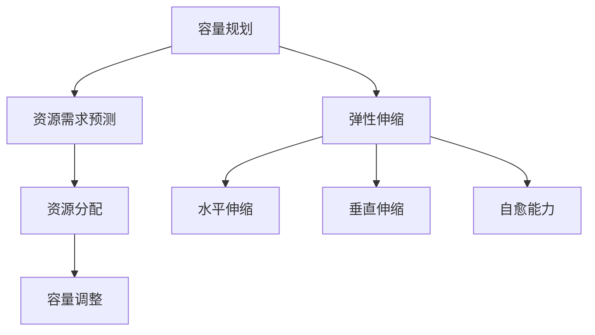

                 

关键词：SRE、容量规划、弹性伸缩、性能优化、云计算、分布式系统

> 摘要：本文将深入探讨SRE（Site Reliability Engineering）中的容量规划与弹性伸缩策略，分析其在现代分布式系统和云计算环境中的重要性，并提供一系列具体操作步骤和案例，帮助读者更好地理解和实践这一关键领域。

## 1. 背景介绍

在现代信息技术飞速发展的时代，分布式系统和云计算已经成为企业和组织的关键基础设施。这些系统不仅规模庞大、复杂度高，而且需要具备高可用性、高性能和灵活性的特点。为了实现这些目标，SRE（Site Reliability Engineering）作为一种工程实践应运而生。SRE的核心目标是通过系统化、工程化的方法确保系统的高可靠性和可伸缩性。

然而，SRE并不是一蹴而就的，其中的一项关键任务就是容量规划与弹性伸缩。容量规划涉及到对系统资源需求的预测和分配，以确保系统在不同负载情况下都能保持稳定运行。而弹性伸缩则是在系统负载发生变化时，能够自动调整资源以应对突发流量，从而避免系统过载或资源浪费。

## 2. 核心概念与联系

在深入探讨SRE中的容量规划与弹性伸缩之前，我们需要了解一些核心概念和它们之间的关系。

### 2.1 SRE的基本原则

SRE是建立在一系列基本原则之上的，包括：

- **自动化**：尽可能使用自动化工具和流程来减少人为干预。
- **度量**：通过精确的监控和度量，实时了解系统的状态和性能。
- **反馈**：基于监控数据，快速响应并调整系统配置。
- **弹性**：系统应具备应对突发流量和异常情况的能力。

### 2.2 容量规划的概念

容量规划是指在系统设计和部署阶段，根据预期的负载需求和资源限制，合理配置系统资源。它主要包括：

- **资源需求预测**：根据历史数据和业务模型，预测未来负载需求。
- **资源分配**：在硬件、网络、存储等各个层面合理分配资源。
- **容量调整**：根据系统性能和负载变化，动态调整资源。

### 2.3 弹性伸缩的机制

弹性伸缩是通过自动化机制，根据系统负载的变化自动调整资源。它通常包括：

- **水平伸缩**：通过增加或减少节点数量来调整系统容量。
- **垂直伸缩**：通过增加或减少单个节点的资源（如CPU、内存）来调整系统性能。
- **自愈能力**：在系统出现故障时，自动进行故障转移或节点替换。

### 2.4 Mermaid流程图

以下是一个简单的Mermaid流程图，展示了SRE中容量规划和弹性伸缩的基本流程：



## 3. 核心算法原理 & 具体操作步骤

### 3.1 算法原理概述

SRE中的容量规划与弹性伸缩算法主要基于以下几个核心原理：

- **历史数据分析**：通过分析历史负载数据，预测未来负载趋势。
- **动态资源调整**：根据实时监控数据，动态调整系统资源。
- **阈值设定**：设定合理的阈值，以触发弹性伸缩操作。

### 3.2 算法步骤详解

1. **数据收集与预处理**：收集系统负载数据，并进行预处理，如数据清洗、归一化等。
2. **历史数据分析**：使用时间序列分析方法，分析历史负载数据，预测未来负载。
3. **容量规划**：根据预测结果，确定初始资源分配。
4. **实时监控**：使用监控工具，实时收集系统性能数据。
5. **动态调整**：根据监控数据，动态调整系统资源。
6. **弹性伸缩操作**：在负载变化时，触发水平或垂直伸缩操作。
7. **自愈机制**：在系统出现故障时，自动进行故障转移或节点替换。

### 3.3 算法优缺点

**优点**：

- **高可用性**：通过自动化和弹性伸缩，确保系统在高负载和异常情况下仍能稳定运行。
- **性能优化**：合理配置资源，提高系统整体性能。
- **降低成本**：通过动态调整资源，避免资源浪费。

**缺点**：

- **复杂性**：涉及多个层面和环节，设计和实现较为复杂。
- **数据依赖**：预测准确性依赖于历史数据和监控数据的质量。

### 3.4 算法应用领域

SRE中的容量规划与弹性伸缩算法广泛应用于以下领域：

- **电子商务**：在促销活动期间，应对大量用户请求。
- **社交媒体**：在高峰时段，处理大量用户互动。
- **在线教育**：在课程直播时，确保教学平台的稳定性。
- **金融科技**：确保交易系统的实时性和可靠性。

## 4. 数学模型和公式 & 详细讲解 & 举例说明

### 4.1 数学模型构建

在SRE中的容量规划与弹性伸缩，我们可以使用以下数学模型：

1. **负载预测模型**：

$$
L(t) = \alpha \cdot T(t) + \beta
$$

其中，$L(t)$为时刻$t$的预测负载，$T(t)$为历史负载数据，$\alpha$和$\beta$为模型参数。

2. **资源需求模型**：

$$
R(t) = f(L(t))
$$

其中，$R(t)$为时刻$t$的资源需求，$f()$为资源需求函数。

### 4.2 公式推导过程

负载预测模型通过线性回归分析，基于历史负载数据拟合出预测模型。资源需求模型则根据负载预测结果，结合系统性能指标，确定具体资源需求。

### 4.3 案例分析与讲解

假设某电商平台的日平均访问量为1000次，历史数据表明访问量在促销期间会增长20%。我们使用上述模型进行预测和规划。

1. **历史数据分析**：

$$
L(t) = \alpha \cdot T(t) + \beta
$$

通过线性回归分析，得到$\alpha = 0.8$，$\beta = 200$。

2. **负载预测**：

$$
L(t) = 0.8 \cdot T(t) + 200
$$

假设促销期间的访问量增长20%，则预测负载为：

$$
L(t) = 0.8 \cdot (1000 + 0.2 \cdot 1000) + 200 = 1000
$$

3. **资源需求**：

假设每个用户请求需要100MB的资源，则资源需求为：

$$
R(t) = 100 \cdot L(t) = 100 \cdot 1000 = 100000 \text{ MB}
$$

根据资源需求，我们可以提前进行容量规划和资源分配，以确保系统在高负载期间仍能稳定运行。

## 5. 项目实践：代码实例和详细解释说明

### 5.1 开发环境搭建

为了演示SRE中的容量规划和弹性伸缩，我们将使用Kubernetes（K8s）作为容器编排平台。首先，确保您已经安装了K8s集群，并可以使用kubectl进行操作。

### 5.2 源代码详细实现

以下是一个简单的Kubernetes部署文件，用于演示弹性伸缩：

```yaml
apiVersion: apps/v1
kind: Deployment
metadata:
  name: webapp
spec:
  replicas: 3
  selector:
    matchLabels:
      app: webapp
  template:
    metadata:
      labels:
        app: webapp
    spec:
      containers:
      - name: webapp
        image: mywebapp:latest
        resources:
          requests:
            memory: "256Mi"
            cpu: "500m"
          limits:
            memory: "512Mi"
            cpu: "1000m"
---
apiVersion: autoscaling/v2beta2
kind: HorizontalPodAutoscaler
metadata:
  name: webapp-hpa
spec:
  scaleTargetRef:
    apiVersion: apps/v1
    kind: Deployment
    name: webapp
  minReplicas: 3
  maxReplicas: 10
  metrics:
  - type: Resource
    resource:
      name: memory
      target:
        type: Utilization
        averageUtilization: 80
```

### 5.3 代码解读与分析

1. **Deployment**：

- **replicas**：指定部署的Pod副本数。
- **selector**：用于匹配部署的Pod。
- **template**：定义Pod的配置。
- **resources**：指定容器请求和限制的资源量。

2. **HorizontalPodAutoscaler**：

- **scaleTargetRef**：指定要调整副本数的Deployment。
- **minReplicas**：最小副本数。
- **maxReplicas**：最大副本数。
- **metrics**：定义触发伸缩的指标。

### 5.4 运行结果展示

1. **启动Deployment**：

```shell
kubectl apply -f deployment.yaml
```

2. **查看Pod状态**：

```shell
kubectl get pods
```

3. **增加负载，观察自动伸缩**：

- 使用负载生成工具（如wrk）模拟大量用户请求。
- 观察K8s集群自动增加Pod副本数，以应对负载。

```shell
wrk -t12 -c400 http://<webapp-service-name>:80
```

## 6. 实际应用场景

### 6.1 电子商务平台

电子商务平台在促销活动期间，需要应对大量用户请求。通过容量规划和弹性伸缩，平台可以在活动开始前预先配置资源，活动期间自动调整Pod副本数，确保服务稳定。

### 6.2 社交媒体

社交媒体平台在高峰时段，如早晚上班时间，用户活跃度高。通过实时监控和弹性伸缩，平台可以动态调整资源，确保用户互动的流畅性。

### 6.3 在线教育

在线教育平台在课程直播时，需要确保平台的稳定性。通过弹性伸缩，平台可以自动调整资源，应对突然增加的访问量。

### 6.4 金融科技

金融科技平台需要确保交易系统的实时性和可靠性。通过自动化容量规划和弹性伸缩，平台可以快速响应交易高峰，避免系统过载。

## 7. 工具和资源推荐

### 7.1 学习资源推荐

- 《Kubernetes权威指南》
- 《SRE：谷歌如何运行像魔法一样的云服务》
- 《时间序列分析：理论与应用》

### 7.2 开发工具推荐

- Kubernetes Dashboard
- Prometheus
- Grafana

### 7.3 相关论文推荐

- "Auto Scaling in Public Clouds: State of the Art and Research Challenges"
- "Learning to Scale Resources in Public Clouds"
- "Kubernetes Autoscaling: From Simple to Advanced Techniques"

## 8. 总结：未来发展趋势与挑战

### 8.1 研究成果总结

近年来，随着云计算和分布式系统的普及，SRE中的容量规划和弹性伸缩技术取得了显著成果。自动化、实时监控和机器学习等技术的引入，使得系统能够更高效地应对负载变化，提高整体性能。

### 8.2 未来发展趋势

- **智能化**：结合人工智能技术，实现更精准的负载预测和资源调整。
- **多租户**：在多租户环境中，实现更精细的资源管理和调度策略。
- **云原生**：在云原生架构中，进一步优化容器和服务的部署与管理。

### 8.3 面临的挑战

- **数据质量**：依赖高质量的数据进行负载预测和资源调整。
- **复杂性**：多维度资源管理和调度策略的复杂性。
- **安全性**：确保系统在弹性伸缩过程中，数据安全和隐私不受威胁。

### 8.4 研究展望

未来，SRE中的容量规划和弹性伸缩将继续朝着智能化、自动化和高效化的方向发展。通过不断创新和优化，我们有理由相信，SRE将更好地服务于现代分布式系统和云计算环境，为企业和组织提供更可靠、更高效的技术保障。

## 9. 附录：常见问题与解答

### 9.1 容量规划与弹性伸缩的区别是什么？

容量规划是指在系统设计和部署阶段，根据预期负载需求和资源限制，合理配置系统资源。而弹性伸缩是在系统运行过程中，根据实际负载变化，动态调整系统资源。简单来说，容量规划是预先规划，弹性伸缩是实时调整。

### 9.2 如何选择水平伸缩和垂直伸缩？

水平伸缩适用于处理负载变化较大的场景，如用户请求量的增加。垂直伸缩适用于处理单个节点性能优化的情况，如增加CPU或内存资源。通常，混合使用水平伸缩和垂直伸缩可以实现最佳性能和资源利用。

### 9.3 如何保证数据安全和隐私？

在弹性伸缩过程中，确保数据安全和隐私至关重要。可以采取以下措施：

- 使用加密技术保护数据传输和存储。
- 实施访问控制和身份验证机制。
- 定期进行安全审计和漏洞扫描。

作者：禅与计算机程序设计艺术 / Zen and the Art of Computer Programming
----------------------------------------------------------------

以上是关于SRE容量规划与弹性伸缩的技术博客文章，希望对您有所帮助。如果您有其他问题或需求，请随时告诉我。

