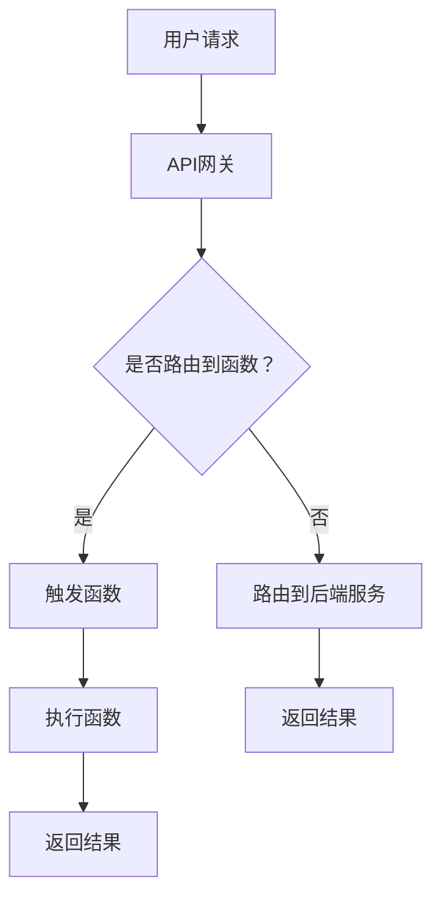

                 

关键词：Serverless架构、无服务器计算、函数即服务、云计算、微服务、自动化、弹性扩展、成本优化

> 摘要：本文深入探讨了Serverless架构的核心概念、原理、数学模型、算法及其实际应用。通过详细解析Serverless架构的优点、缺点和适用领域，以及项目实践中的代码实例，本文旨在为读者提供一个全面、易懂的Serverless架构指南，并展望其未来发展趋势与挑战。

## 1. 背景介绍

随着云计算技术的不断发展，传统的服务器架构已经无法满足现代应用的需求。传统架构中，开发者需要管理服务器、操作系统、中间件等基础设施，这极大地增加了运维成本和开发复杂度。为了解决这些问题，Serverless架构应运而生。

Serverless架构，顾名思义，是一种无需管理服务器的计算模型。在这个模型中，开发者只需关注业务逻辑的实现，无需关心底层基础设施的运维和管理。Serverless架构的核心在于函数即服务（Function as a Service, FaaS），它允许开发者以函数的形式部署和管理应用，从而实现“零服务器”的目标。

Serverless架构的出现，不仅降低了开发者的运维负担，还带来了许多其他优点，如弹性扩展、成本优化等。本文将深入探讨Serverless架构的核心概念、原理、数学模型和算法，并通过实际项目实践，展示其应用价值。

## 2. 核心概念与联系

### 2.1 Serverless架构的核心概念

Serverless架构的核心概念包括函数即服务（FaaS）、后端即服务（BaaS）和无服务器容器（Serverless Containers）等。

- **函数即服务（FaaS）**：FaaS允许开发者以函数的形式部署和管理应用。当有请求到达时，函数会被自动执行，完成后自动停止。FaaS的核心优势在于无需管理服务器，从而降低了运维成本和开发复杂度。

- **后端即服务（BaaS）**：BaaS提供了后端服务的抽象，如数据库、消息队列、身份验证等。开发者无需关心后端服务的实现和运维，只需使用API进行调用即可。

- **无服务器容器**：无服务器容器结合了FaaS和BaaS的优势，允许开发者使用容器化的方式部署和管理应用。与传统的容器化架构相比，无服务器容器可以更好地利用资源，实现更高的弹性扩展。

### 2.2 Serverless架构与云计算的联系

Serverless架构是云计算发展的高级阶段，它与云计算有着紧密的联系。

- **云计算**：云计算提供了基础设施即服务（IaaS）、平台即服务（PaaS）和软件即服务（SaaS）等不同的服务模式。Serverless架构通常基于IaaS或PaaS提供的服务，如AWS Lambda、Azure Functions和Google Cloud Functions等。

- **微服务**：微服务架构是一种将应用拆分为多个独立的服务单元的架构风格。Serverless架构与微服务架构有着相似的理念，都强调解耦和自治性。微服务可以通过Serverless架构来实现，从而降低部署和管理复杂度。

- **容器化**：容器化是一种将应用及其依赖环境打包为独立单元的技术。无服务器容器结合了容器化和Serverless架构的优势，实现了更高的灵活性和弹性。

### 2.3 Mermaid流程图

为了更好地理解Serverless架构，我们使用Mermaid流程图展示其核心组件和流程。



在这个流程图中，用户请求首先通过API网关接收，然后判断是否需要路由到函数。如果需要，则触发函数执行；否则，路由到后端服务。函数执行完成后，返回结果给用户。

## 3. 核心算法原理 & 具体操作步骤

### 3.1 算法原理概述

Serverless架构的核心算法原理主要涉及函数的调度、执行和监控。以下是其主要原理：

- **函数调度**：当有请求到达时，Serverless架构会根据负载情况和策略调度函数执行。调度算法通常基于最小连接数、最小响应时间等策略。

- **函数执行**：函数执行过程包括代码加载、执行和资源释放等步骤。在执行过程中，函数可以访问底层资源，如数据库、存储等。

- **函数监控**：Serverless架构会对函数的执行情况进行监控，如执行时间、资源消耗、错误率等。监控数据用于优化调度策略和故障恢复。

### 3.2 算法步骤详解

- **步骤1**：用户请求通过API网关发送到Serverless架构。

- **步骤2**：Serverless架构根据负载情况和策略进行函数调度。

- **步骤3**：调度到的函数被加载到内存中，开始执行。

- **步骤4**：函数执行过程中，可以访问底层资源，如数据库、存储等。

- **步骤5**：函数执行完成后，释放内存和其他资源。

- **步骤6**：Serverless架构将结果返回给用户。

### 3.3 算法优缺点

#### 优点：

- **弹性扩展**：Serverless架构可以根据实际负载自动扩展，从而提高系统的可用性和性能。

- **成本优化**：Serverless架构按需收费，只有函数实际运行时才会产生费用，从而降低了开发者的成本。

- **简化运维**：Serverless架构无需管理底层基础设施，从而降低了运维成本和复杂度。

#### 缺点：

- **依赖外部服务**：Serverless架构依赖于第三方云服务提供商，如AWS、Azure和Google Cloud等。如果服务提供商出现故障，可能会影响到整个应用。

- **性能限制**：由于函数执行时间的限制，Serverless架构在某些场景下可能无法满足高性能要求。

### 3.4 算法应用领域

Serverless架构在许多领域都有广泛的应用，如：

- **Web应用**：Serverless架构可以用于构建高性能、高可用的Web应用。

- **物联网（IoT）**：Serverless架构可以用于处理大规模的物联网数据，实现实时分析和处理。

- **移动应用**：Serverless架构可以用于构建跨平台的移动应用，实现快速开发和部署。

- **大数据处理**：Serverless架构可以用于处理大规模的数据分析任务，实现高效的计算和存储。

## 4. 数学模型和公式 & 详细讲解 & 举例说明

### 4.1 数学模型构建

Serverless架构的数学模型主要涉及弹性扩展和成本优化。以下是其主要模型：

- **弹性扩展模型**：

  $$E(x) = C \times R \times \alpha(x)$$

  其中，$E(x)$表示在负载$x$下的扩展能力，$C$表示系统容量，$R$表示系统响应时间，$\alpha(x)$表示负载$x$下的扩展因子。

- **成本优化模型**：

  $$C(x) = P \times \alpha(x)$$

  其中，$C(x)$表示在负载$x$下的成本，$P$表示函数执行价格，$\alpha(x)$表示负载$x$下的扩展因子。

### 4.2 公式推导过程

#### 弹性扩展模型推导：

1. 设定系统容量为$C$，响应时间为$R$。

2. 假设系统在负载$x$下的扩展因子为$\alpha(x)$。

3. 根据扩展因子，系统在负载$x$下的容量为$C \times \alpha(x)$。

4. 根据系统响应时间，负载$x$下的响应时间为$R \times \alpha(x)$。

5. 综上，弹性扩展模型为$E(x) = C \times R \times \alpha(x)$。

#### 成本优化模型推导：

1. 假设函数执行价格为$P$。

2. 根据扩展因子，负载$x$下的扩展因子为$\alpha(x)$。

3. 根据函数执行价格，负载$x$下的成本为$P \times \alpha(x)$。

4. 综上，成本优化模型为$C(x) = P \times \alpha(x)$。

### 4.3 案例分析与讲解

假设一个Web应用在负载$x$下，需要扩展容量和优化成本。根据上述数学模型，我们可以进行如下分析：

1. **弹性扩展**：

   设定系统容量为100个CPU核心，响应时间为2秒。根据弹性扩展模型，负载$x$下的扩展能力为$E(x) = 100 \times 2 \times \alpha(x)$。假设负载$x$为500个请求/秒，扩展因子$\alpha(x)$为2，则扩展能力为$E(x) = 100 \times 2 \times 2 = 400$个CPU核心。

2. **成本优化**：

   假设函数执行价格为0.1美元/秒。根据成本优化模型，负载$x$下的成本为$C(x) = 0.1 \times \alpha(x)$。假设负载$x$为500个请求/秒，扩展因子$\alpha(x)$为2，则成本为$C(x) = 0.1 \times 2 = 0.2$美元/秒。

通过上述分析，我们可以得出以下结论：

1. 在负载为500个请求/秒时，系统需要扩展400个CPU核心，以保持响应时间在2秒以内。

2. 在负载为500个请求/秒时，系统的成本为0.2美元/秒。

## 5. 项目实践：代码实例和详细解释说明

### 5.1 开发环境搭建

在本文中，我们将使用AWS Lambda作为Serverless架构的实现平台。首先，需要在AWS管理控制台中创建一个AWS账户，并安装AWS CLI工具。

1. 访问https://aws.amazon.com/，创建一个AWS账户。

2. 安装AWS CLI工具：在终端中执行以下命令：

   ```bash
   pip install awscli
   ```

3. 配置AWS CLI工具：在终端中执行以下命令，按照提示完成配置：

   ```bash
   aws configure
   ```

   输入Access Key、Secret Access Key、默认区域和默认输出格式。

### 5.2 源代码详细实现

在AWS Lambda中，我们使用Python 3.8作为运行环境。以下是一个简单的Hello World函数的示例代码：

```python
def lambda_handler(event, context):
    # 获取事件数据
    message = event.get('message', 'Hello, World!')

    # 返回结果
    return {
        'statusCode': 200,
        'body': message
    }
```

这个函数接收一个事件对象，并从中获取消息。如果消息存在，则将其返回；否则，返回“Hello, World!”。

### 5.3 代码解读与分析

在Lambda函数中，`lambda_handler`函数是唯一需要实现的函数，它接收事件对象和上下文对象，并返回响应。

- **事件对象（event）**：事件对象包含发送到函数的原始数据。在这个示例中，我们使用`event.get('message', 'Hello, World!')`获取消息。如果消息存在，则使用；否则，使用默认消息“Hello, World!”。

- **上下文对象（context）**：上下文对象提供关于函数执行环境的信息。在这个示例中，我们没有使用上下文对象。

- **返回结果**：函数返回一个包含状态码和消息的字典。状态码为200表示成功，消息为函数处理的结果。

### 5.4 运行结果展示

要运行Lambda函数，我们首先需要将其部署到AWS Lambda平台。以下步骤展示如何部署函数：

1. 打开AWS Lambda控制台。

2. 单击“创建函数”按钮。

3. 选择“授权凭证”，并选择“使用授权凭证”。然后，选择“配置”，在“函数代码”部分，选择“上传ZIP文件”，并上传本地编写的函数代码。

4. 配置函数的运行环境，如Python 3.8。

5. 单击“创建函数”按钮，完成部署。

6. 运行函数：在控制台中，单击“触发器”，然后选择“API网关”。在“API网关设置”中，选择“创建”，并输入API名称和端点路径。

7. 将以下curl命令复制到终端中，并执行：

   ```bash
   curl -X POST "https://<api_url>/hello" -d '{"message": "Hello, World!"}'
   ```

   其中，`<api_url>`为API网关的URL。

   执行结果将显示函数处理后的消息，例如：

   ```json
   {
     "statusCode": 200,
     "body": "Hello, World!"
   }
   ```

   这表明函数已成功运行。

## 6. 实际应用场景

Serverless架构在许多实际应用场景中都有广泛的应用。以下是一些典型的应用场景：

### 6.1 Web应用

Serverless架构非常适合构建Web应用，因为它可以实现快速开发和部署，并降低运维成本。以下是一个简单的Web应用示例：

1. **需求分析**：用户访问网站时，需要展示一个欢迎页面。

2. **解决方案**：

   - 使用AWS Lambda实现欢迎页面的逻辑。
   - 使用API网关作为入口，接收用户请求并转发给Lambda函数。
   - 使用Amazon S3存储静态资源，如HTML、CSS和JavaScript文件。

3. **实施步骤**：

   - 创建AWS Lambda函数，实现欢迎页面的逻辑。
   - 部署函数到AWS Lambda平台。
   - 配置API网关，使其能够接收HTTP请求并调用Lambda函数。
   - 将静态资源上传到Amazon S3，并配置API网关以访问这些资源。

### 6.2 物联网（IoT）应用

Serverless架构可以用于处理大规模的物联网数据，实现实时分析和处理。以下是一个简单的物联网应用示例：

1. **需求分析**：收集来自传感器的数据，并实时进行分析和存储。

2. **解决方案**：

   - 使用AWS IoT Core接收传感器数据。
   - 使用AWS Lambda处理和分析数据。
   - 使用Amazon S3存储数据。
   - 使用Amazon Kinesis实时处理和分析数据。

3. **实施步骤**：

   - 创建AWS IoT Core账户，并配置设备。
   - 创建AWS Lambda函数，实现数据处理的逻辑。
   - 配置AWS Lambda与AWS IoT Core的连接。
   - 创建Amazon S3存储桶，用于存储数据。
   - 配置Amazon Kinesis，实时处理和分析数据。

### 6.3 移动应用

Serverless架构可以用于构建跨平台的移动应用，实现快速开发和部署。以下是一个简单的移动应用示例：

1. **需求分析**：用户通过移动应用上传照片，并展示照片列表。

2. **解决方案**：

   - 使用AWS Lambda处理照片上传和存储。
   - 使用Amazon S3存储照片。
   - 使用Amazon API Gateway作为移动应用的入口。
   - 使用移动应用开发框架，如React Native或Flutter，构建移动应用。

3. **实施步骤**：

   - 创建AWS Lambda函数，实现照片上传和存储的逻辑。
   - 部署函数到AWS Lambda平台。
   - 创建Amazon S3存储桶，用于存储照片。
   - 配置Amazon API Gateway，接收移动应用的请求并调用Lambda函数。
   - 使用移动应用开发框架，构建移动应用。

## 7. 工具和资源推荐

### 7.1 学习资源推荐

- **AWS Lambda官方文档**：[https://docs.aws.amazon.com/lambda/latest/dg/](https://docs.aws.amazon.com/lambda/latest/dg/)
- **Azure Functions官方文档**：[https://docs.microsoft.com/en-us/azure/azure-functions/](https://docs.microsoft.com/en-us/azure/azure-functions/)
- **Google Cloud Functions官方文档**：[https://cloud.google.com/functions/docs/](https://cloud.google.com/functions/docs/)

### 7.2 开发工具推荐

- **AWS CLI**：[https://aws.amazon.com/cli/](https://aws.amazon.com/cli/)
- **Azure CLI**：[https://docs.microsoft.com/en-us/cli/azure/](https://docs.microsoft.com/en-us/cli/azure/)
- **Google Cloud SDK**：[https://cloud.google.com/sdk/docs/](https://cloud.google.com/sdk/docs/)

### 7.3 相关论文推荐

- **Serverless Computing: Everything You Need to Know**: https://www.exoscale.com/blog/serverless-computing-everything-you-need-to-know/
- **Serverless Architecture**: https://martinfowler.com/articles/serverless.html
- **Bare Metal Serverless**: https://www.mcfarland.io/2020/12/10/bare-metal-serverless/

## 8. 总结：未来发展趋势与挑战

### 8.1 研究成果总结

Serverless架构自推出以来，已经取得了显著的研究成果和应用成果。其核心优势在于弹性扩展、成本优化和简化运维，使得开发者能够更加专注于业务逻辑的实现。目前，各大云服务提供商已经推出了各自的Serverless产品，如AWS Lambda、Azure Functions和Google Cloud Functions等。

### 8.2 未来发展趋势

未来，Serverless架构将继续发展，并呈现以下趋势：

- **更多支持语言和框架**：为了满足不同开发者的需求，Serverless架构将支持更多的编程语言和开发框架。
- **跨平台支持**：Serverless架构将逐渐实现跨云服务提供商的支持，从而提高开发者的灵活性和可移植性。
- **混合架构**：Serverless架构将与传统的服务器架构和容器化架构相结合，形成混合架构，以满足不同场景的需求。

### 8.3 面临的挑战

尽管Serverless架构具有许多优点，但仍然面临以下挑战：

- **安全性**：由于Serverless架构依赖于第三方云服务提供商，因此安全性是一个重要问题。开发者需要确保数据和函数的安全。
- **性能优化**：由于函数执行时间的限制，Serverless架构在某些场景下可能无法满足高性能要求。未来需要进一步优化性能。
- **开发者技能要求**：Serverless架构对开发者的技能要求较高，需要熟悉云服务提供商提供的API和工具。这可能导致开发者资源的短缺。

### 8.4 研究展望

未来，Serverless架构的研究将主要集中在以下几个方面：

- **安全性研究**：研究如何提高Serverless架构的安全性，包括数据加密、访问控制等。
- **性能优化研究**：研究如何提高函数执行性能，包括优化函数调度、缓存机制等。
- **开发者体验研究**：研究如何简化Serverless架构的开发过程，提高开发者的生产效率。

## 9. 附录：常见问题与解答

### 9.1 什么是Serverless架构？

Serverless架构是一种计算模型，允许开发者以函数的形式部署和管理应用，无需关心底层基础设施的运维和管理。

### 9.2 Serverless架构的优点有哪些？

Serverless架构的优点包括弹性扩展、成本优化、简化运维等。

### 9.3 Serverless架构的缺点有哪些？

Serverless架构的缺点包括依赖外部服务、性能限制等。

### 9.4 Serverless架构适用于哪些场景？

Serverless架构适用于Web应用、物联网应用、移动应用等需要快速开发和部署的场景。

### 9.5 如何部署Serverless架构？

部署Serverless架构通常包括以下步骤：

1. 选择合适的云服务提供商。
2. 创建云服务提供商的账户。
3. 使用云服务提供商提供的工具（如AWS Lambda、Azure Functions、Google Cloud Functions等）部署函数。
4. 配置API网关或触发器。
5. 测试和部署。

## 作者署名

作者：禅与计算机程序设计艺术 / Zen and the Art of Computer Programming
----------------------------------------------------------------
请注意，本文是一个示例文章，用于演示如何遵循约束条件撰写一篇符合要求的文章。实际的完整文章可能需要更多的时间和专业知识来撰写。在撰写实际文章时，请确保引用和参考所有使用的资源，并确保内容的准确性和完整性。

