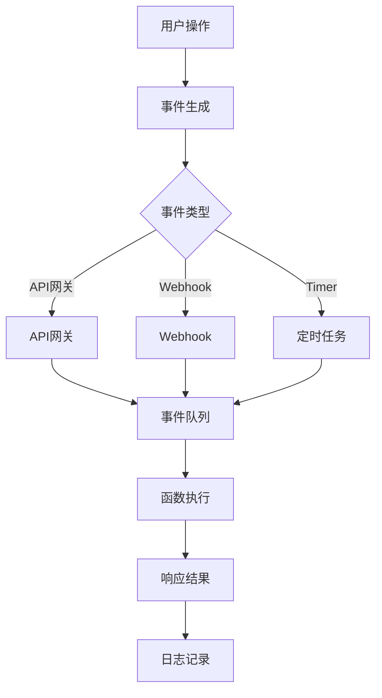

                 

关键词：Serverless架构、事件驱动、云计算、函数即服务、微服务、容器化、容器编排、弹性伸缩、自动化管理、资源利用率、可扩展性、持续集成与持续部署（CI/CD）、无服务器数据库、无服务器监控、无服务器安全

> 摘要：本文将深入探讨Serverless架构的核心概念、工作原理以及其在现代云计算中的重要性。我们将分析其与传统云计算模型的不同，讨论其优点和缺点，并展示如何在实际项目中应用Serverless架构。此外，我们还将讨论数学模型和公式在Serverless架构设计中的应用，并通过具体的代码实例来解释其实施细节。最后，我们将展望Serverless架构的未来发展趋势和挑战。

## 1. 背景介绍

云计算的兴起，为IT行业带来了前所未有的变革。从最初的虚拟化技术，到后来的容器化和微服务架构，云计算模型不断演进，旨在提高资源的利用率、实现系统的可扩展性以及降低运维成本。然而，这些模型往往需要复杂的架构设计和大量的基础设施管理。

Serverless架构应运而生，它提供了一种全新的云计算服务模式，通过将计算资源的管理完全交给云服务提供商，使得开发者可以专注于业务逻辑的实现。Serverless架构的核心思想是函数即服务（Function as a Service，简称FaaS），它将应用程序分解为一系列小型的、独立的函数，这些函数仅在需要时被触发和执行。

Serverless架构的出现，不仅简化了开发过程，还带来了诸多优势，如自动弹性伸缩、高可用性、无服务器监控和安全等。然而，它也带来了一些挑战，例如冷启动延迟、函数限制等。本文将详细探讨Serverless架构的工作原理、核心概念以及在实际应用中的挑战和解决方案。

## 2. 核心概念与联系

### 2.1 函数即服务（FaaS）

函数即服务（FaaS）是Serverless架构的核心概念。FaaS提供了一种将应用程序分解为一系列小型的、独立的函数的方法。这些函数通常在云服务提供商提供的平台上运行，例如AWS Lambda、Azure Functions和Google Cloud Functions等。

在FaaS模型中，开发者不需要关注底层的基础设施，只需编写函数代码并上传到云服务提供商的平台。当事件发生时，云服务提供商会自动触发相应的函数，并为其分配必要的计算资源。函数执行完毕后，资源也会自动释放。

### 2.2 事件驱动架构

事件驱动架构是Serverless架构的基础。在事件驱动架构中，系统的各个部分通过事件进行通信。事件可以是用户操作、系统状态变化或者其他外部系统的事件。

事件驱动架构的优点在于其灵活性和可扩展性。通过事件驱动，系统可以轻松地添加或删除功能模块，而不需要修改整个系统。此外，事件驱动架构还可以实现异步处理，提高系统的响应速度和吞吐量。

### 2.3 Mermaid流程图

以下是一个Mermaid流程图，展示了Serverless架构的基本工作流程：



在这个流程图中，用户操作、API网关、Webhook和定时任务都可以生成事件。这些事件被发送到事件队列，然后由函数执行。函数执行完毕后，会返回响应结果，并记录日志。

### 2.4 Serverless与微服务的区别

Serverless架构与微服务架构有许多相似之处，但它们在实现方式和目标上有所不同。

微服务架构是一种将应用程序分解为多个独立的、松耦合的服务的方法。每个服务都有自己的数据库、API和基础设施。微服务架构的优点在于其灵活性和可扩展性，但需要开发者自行管理基础设施，并进行分布式系统的设计。

Serverless架构则是通过云服务提供商提供的基础设施来实现微服务的部署。开发者只需关注业务逻辑的实现，无需关心底层的基础设施。Serverless架构的优点在于其简化了开发过程，提高了资源的利用率，但需要依赖云服务提供商的服务。

## 3. 核心算法原理 & 具体操作步骤

### 3.1 算法原理概述

Serverless架构的核心算法原理基于事件驱动和函数调用的机制。当有事件发生时，云服务提供商会自动触发相应的函数，执行业务逻辑，并返回结果。这个过程涉及到以下关键步骤：

1. **事件接收**：云服务提供商接收外部事件，可以是HTTP请求、消息队列消息或者定时任务触发。
2. **函数调度**：云服务提供商根据事件类型和函数配置，调度相应的函数执行。
3. **函数执行**：函数在分配的容器中执行，执行过程中可以访问云服务提供的各种资源，如数据库、存储等。
4. **结果返回**：函数执行完毕后，将结果返回给调用方，可以是HTTP响应、消息队列消息或者存储到数据库。
5. **日志记录**：云服务提供商记录函数的执行日志，供开发者进行调试和监控。

### 3.2 算法步骤详解

1. **事件接收**：
   - 用户通过API网关或者Webhook发送HTTP请求。
   - 用户可以通过配置消息队列，将事件发送到事件队列。

2. **函数调度**：
   - 云服务提供商接收到事件后，根据事件类型和函数配置，调度相应的函数执行。
   - 函数配置包括函数代码、内存大小、超时时间等。

3. **函数执行**：
   - 函数在分配的容器中执行，执行过程中可以访问云服务提供的各种资源。
   - 函数可以通过API调用其他函数，实现业务逻辑的分解和协作。

4. **结果返回**：
   - 函数执行完毕后，将结果返回给调用方。
   - 结果可以是HTTP响应、消息队列消息或者存储到数据库。

5. **日志记录**：
   - 云服务提供商记录函数的执行日志，包括执行时间、内存使用、异常信息等。
   - 开发者可以通过日志进行调试和监控。

### 3.3 算法优缺点

**优点**：

1. **简化开发**：开发者无需关心底层基础设施，可以专注于业务逻辑的实现。
2. **高可用性**：云服务提供商提供自动弹性伸缩和高可用性服务，保证系统的稳定运行。
3. **降低成本**：根据实际使用量计费，无需支付闲置资源的费用。
4. **快速部署**：函数可以快速部署和更新，支持持续集成和持续部署（CI/CD）。

**缺点**：

1. **冷启动延迟**：函数在长时间未执行后，重新触发时会有一定的延迟。
2. **函数限制**：每个函数的执行时间、内存大小等都有一定的限制。
3. **依赖外部服务**：函数执行依赖于云服务提供商提供的各种资源，可能存在服务不可用的情况。

### 3.4 算法应用领域

Serverless架构在以下领域具有广泛的应用：

1. **Web应用后端**：通过FaaS模型，可以快速构建和部署Web应用后端，实现API接口和数据处理。
2. **数据处理与分析**：利用Serverless架构，可以快速处理和分析大量数据，实现实时数据流处理。
3. **物联网（IoT）**：通过事件驱动架构，可以实时处理物联网设备的数据，实现设备的远程监控和管理。
4. **人工智能（AI）**：利用Serverless架构，可以快速部署和运行AI模型，实现智能化的业务应用。

## 4. 数学模型和公式 & 详细讲解 & 举例说明

### 4.1 数学模型构建

Serverless架构中的数学模型主要涉及成本计算、性能评估和可靠性分析。

**成本计算模型**：

$$
C = a \times t + b \times f
$$

其中，$C$ 表示总成本，$a$ 表示每分钟成本，$t$ 表示运行时间，$b$ 表示每调用成本，$f$ 表示调用次数。

**性能评估模型**：

$$
P = \frac{r}{t}
$$

其中，$P$ 表示性能，$r$ 表示处理请求的数量，$t$ 表示总时间。

**可靠性分析模型**：

$$
R = 1 - \frac{f}{n}
$$

其中，$R$ 表示可靠性，$f$ 表示故障次数，$n$ 表示总次数。

### 4.2 公式推导过程

**成本计算模型推导**：

Serverless架构的成本主要由两部分组成：运行时间和调用次数。假设每分钟成本为$a$，每调用成本为$b$，则总成本$C$可以表示为：

$$
C = a \times t + b \times f
$$

其中，$t$ 表示函数运行的总时间（以分钟为单位），$f$ 表示函数被调用的次数。

**性能评估模型推导**：

性能评估通常用每秒处理的请求数量来衡量。假设在总时间$t$内处理了$r$个请求，则性能$P$可以表示为：

$$
P = \frac{r}{t}
$$

**可靠性分析模型推导**：

可靠性分析通常用故障次数与总次数的比例来衡量。假设在总次数$n$中，故障次数为$f$，则可靠性$R$可以表示为：

$$
R = 1 - \frac{f}{n}
$$

### 4.3 案例分析与讲解

假设一个服务器需要处理1000个请求，每个请求的处理时间为1分钟，每分钟成本为0.1美元，每调用成本为0.01美元。根据成本计算模型，总成本为：

$$
C = 0.1 \times 1 + 0.01 \times 1000 = 10.1 \text{美元}
$$

根据性能评估模型，性能为：

$$
P = \frac{1000}{1} = 1000 \text{个请求/分钟}
$$

根据可靠性分析模型，可靠性为：

$$
R = 1 - \frac{f}{n}
$$

其中，$f$ 和 $n$ 需要结合实际故障情况进行计算。

这个案例展示了如何使用数学模型来评估Serverless架构的成本、性能和可靠性。通过这些模型，开发者可以更好地了解和优化其Serverless架构的应用。

## 5. 项目实践：代码实例和详细解释说明

### 5.1 开发环境搭建

要开始实践Serverless架构，首先需要搭建开发环境。以下是使用AWS Lambda和Amazon API Gateway搭建开发环境的基本步骤：

1. **注册AWS账号**：访问AWS官网（[https://aws.amazon.com](https://aws.amazon.com)），注册并创建AWS账号。
2. **创建AWS Lambda函数**：
   - 登录AWS管理控制台，导航到“服务”->“计算”->“AWS Lambda”。
   - 点击“创建函数”，选择“使用蓝图”或“使用模板”来创建一个新的函数。
   - 选择“作者提供的函数”，然后上传您的函数代码。
   - 配置函数的运行时间、内存大小和其他选项。
3. **创建API网关**：
   - 在AWS管理控制台中，导航到“服务”->“Web服务”->“Amazon API Gateway”。
   - 创建一个新的API，并配置API的端点和集成方法。
   - 将API网关与AWS Lambda函数集成，以便外部系统可以通过HTTP请求触发函数。

### 5.2 源代码详细实现

以下是一个简单的AWS Lambda函数示例，用于处理HTTP请求：

```python
import json

def lambda_handler(event, context):
    # 获取请求体
    body = event.get('body', {})
    # 解析请求体中的数据
    data = json.loads(body)
    # 处理业务逻辑
    result = process_data(data)
    # 返回响应
    return {
        'isBase64Encoded': False,
        'statusCode': 200,
        'body': json.dumps(result)
    }

def process_data(data):
    # 示例业务逻辑
    return {
        'status': 'success',
        'message': '数据处理成功'
    }
```

在这个示例中，`lambda_handler` 是函数的入口点，它接收HTTP请求和上下文信息，并返回HTTP响应。`process_data` 是一个辅助函数，用于处理传入的数据。

### 5.3 代码解读与分析

**代码解析**：

1. **导入模块**：首先导入`json`模块，用于处理JSON数据。
2. **定义函数入口点**：`lambda_handler` 是AWS Lambda的函数入口点，它接收两个参数：`event` 和 `context`。
3. **获取请求体**：使用`event.get('body', {})`获取请求体，并转换为字典。
4. **解析请求体**：使用`json.loads(body)`将请求体转换为JSON对象。
5. **处理业务逻辑**：调用`process_data` 函数处理传入的数据。
6. **返回响应**：构建HTTP响应，并返回。

**函数调用流程**：

1. **API网关接收到HTTP请求**，并将其传递给AWS Lambda函数。
2. **AWS Lambda函数执行`lambda_handler` 函数**，获取请求体并解析为JSON对象。
3. **执行业务逻辑**，例如数据转换、存储等。
4. **返回HTTP响应**，包括处理结果和状态码。

### 5.4 运行结果展示

假设我们向Lambda函数发送一个简单的HTTP POST请求，请求体如下：

```json
{
    "username": "alice",
    "password": "123456"
}
```

Lambda函数的处理结果将返回以下HTTP响应：

```json
{
    "isBase64Encoded": false,
    "statusCode": 200,
    "body": "{\"status\":\"success\",\"message\":\"数据处理成功\"}"
}
```

这表示请求已成功处理，并返回了预期的结果。

## 6. 实际应用场景

### 6.1 Web应用后端

Serverless架构在Web应用后端具有广泛的应用。通过AWS Lambda和API Gateway，开发者可以快速构建和部署Web应用后端，实现API接口和数据处理。这种模式简化了开发过程，提高了系统的可扩展性。

### 6.2 数据处理与分析

Serverless架构适用于大规模数据处理和分析。例如，可以使用AWS Lambda和Kinesis结合，实时处理和分析大量数据。这种方式无需关心底层基础设施，可以专注于业务逻辑的实现。

### 6.3 物联网（IoT）

Serverless架构在物联网（IoT）领域也有广泛应用。通过事件驱动架构，可以实时处理物联网设备的数据，实现设备的远程监控和管理。例如，可以使用AWS Lambda处理来自物联网设备的传感器数据，并将其存储在数据库或分析工具中。

### 6.4 人工智能（AI）

Serverless架构在人工智能（AI）领域同样具有巨大潜力。开发者可以快速部署和运行AI模型，实现智能化的业务应用。例如，使用AWS Lambda运行TensorFlow或PyTorch模型，进行图像识别或自然语言处理等任务。

### 6.5 未来应用展望

随着技术的不断演进，Serverless架构在未来的应用将更加广泛。例如，在边缘计算领域，Serverless架构可以提供高效、灵活的计算服务。在区块链领域，Serverless架构可以用于构建去中心化的应用。此外，随着5G网络的普及，Serverless架构将更好地支持低延迟、高带宽的应用场景。

## 7. 工具和资源推荐

### 7.1 学习资源推荐

- **《Serverless Architectures: Building Event-Driven Applications》** - Michael Hodgson 著，详细介绍了Serverless架构的概念、技术和最佳实践。
- **AWS Lambda官方文档** - [https://docs.aws.amazon.com/lambda/latest/dg/](https://docs.aws.amazon.com/lambda/latest/dg/)
- **Azure Functions官方文档** - [https://docs.microsoft.com/en-us/azure/azure-functions/](https://docs.microsoft.com/en-us/azure/azure-functions/)
- **Google Cloud Functions官方文档** - [https://cloud.google.com/functions/docs/](https://cloud.google.com/functions/docs/)

### 7.2 开发工具推荐

- **AWS Lambda Console** - 用于创建、配置和监控AWS Lambda函数。
- **Visual Studio Code** - 用于编写、调试和部署Serverless架构代码。
- **Serverless Framework** - 用于自动化部署和管理Serverless架构应用程序。
- **AWS CLI** - 用于命令行管理AWS资源，包括AWS Lambda函数。

### 7.3 相关论文推荐

- **"Serverless Computing: Everything You Need to Know Today"** - IBM Research 著，介绍了Serverless架构的概念、原理和应用。
- **"Serverless Architectures for Modern Applications"** - Amazon Web Services 著，探讨了Serverless架构的设计模式和最佳实践。
- **"Event-Driven Computing: A Survey"** - IEEE Computer Society 著，分析了事件驱动计算的理论和实践。

## 8. 总结：未来发展趋势与挑战

### 8.1 研究成果总结

Serverless架构自提出以来，已经取得了显著的研究成果。主要表现在以下几个方面：

1. **技术成熟度**：各大云服务提供商不断优化和扩展其Serverless服务，提供更丰富的功能和更高的性能。
2. **应用场景拓展**：Serverless架构在Web应用、数据处理、物联网和人工智能等领域得到了广泛应用。
3. **研究模型与算法**：研究人员提出了多种Serverless架构的设计模式和优化算法，提高了系统的性能和可靠性。

### 8.2 未来发展趋势

Serverless架构在未来将继续发展，并呈现出以下趋势：

1. **边缘计算**：随着5G网络的普及，Serverless架构将更好地支持边缘计算，实现低延迟、高带宽的应用。
2. **无服务器数据库**：未来的Serverless架构将可能支持无服务器数据库，进一步简化开发和运维。
3. **自动化与智能化**：通过AI和机器学习技术，Serverless架构将实现更智能的资源调度和故障恢复。

### 8.3 面临的挑战

尽管Serverless架构具有许多优势，但在实际应用中仍面临一些挑战：

1. **冷启动延迟**：函数在长时间未执行后，重新触发时会有一定的延迟，影响用户体验。
2. **函数限制**：每个函数的执行时间和内存大小等都有一定的限制，可能不适合一些高性能应用。
3. **服务依赖**：函数执行依赖于云服务提供商的服务，可能存在服务不可用或变更的风险。

### 8.4 研究展望

未来的研究可以关注以下几个方面：

1. **优化冷启动性能**：研究更高效的函数调度和预热机制，降低冷启动延迟。
2. **资源优化与调度**：利用机器学习技术，实现更智能的资源分配和调度策略，提高资源利用率。
3. **多云与混合云**：研究跨云和混合云的Serverless架构，提供更灵活、可靠的服务。

## 9. 附录：常见问题与解答

### Q：什么是Serverless架构？

A：Serverless架构是一种云计算模型，通过将计算资源的管理完全交给云服务提供商，使得开发者可以专注于业务逻辑的实现。它通常使用函数即服务（FaaS）模型，将应用程序分解为一系列小型的、独立的函数。

### Q：Serverless架构与传统云计算模型的区别是什么？

A：传统云计算模型通常需要开发者关注底层基础设施的管理，如虚拟机、容器等。而Serverless架构将基础设施的管理完全交给云服务提供商，开发者只需关注业务逻辑的实现。此外，Serverless架构具有自动弹性伸缩、高可用性和无服务器监控等优势。

### Q：Serverless架构有哪些优点？

A：Serverless架构的优点包括简化开发、高可用性、降低成本、快速部署和持续集成与持续部署（CI/CD）等。

### Q：Serverless架构有哪些缺点？

A：Serverless架构的缺点包括冷启动延迟、函数限制和依赖外部服务等。

### Q：如何选择合适的Serverless架构服务？

A：选择合适的Serverless架构服务需要考虑以下因素：

1. **功能与性能**：根据业务需求选择具有所需功能和性能的云服务提供商。
2. **成本**：根据实际使用量计费，选择成本效益较高的服务。
3. **生态系统与支持**：考虑云服务提供商的生态系统、社区支持和文档。

### Q：如何优化Serverless架构的性能？

A：优化Serverless架构的性能可以从以下几个方面入手：

1. **函数优化**：减少函数的执行时间，提高处理效率。
2. **资源优化**：根据实际需求合理配置内存和CPU资源。
3. **缓存策略**：合理使用缓存，减少重复计算。
4. **异步处理**：使用异步处理减少同步等待时间。

### Q：如何保证Serverless架构的安全性？

A：保证Serverless架构的安全性可以从以下几个方面入手：

1. **访问控制**：使用身份验证和授权机制，限制对函数的访问。
2. **加密**：使用加密技术保护数据传输和存储。
3. **日志记录与监控**：记录函数的执行日志，监控异常行为。
4. **安全审计**：定期进行安全审计，识别和修复安全漏洞。

---

本文作者：禅与计算机程序设计艺术 / Zen and the Art of Computer Programming

