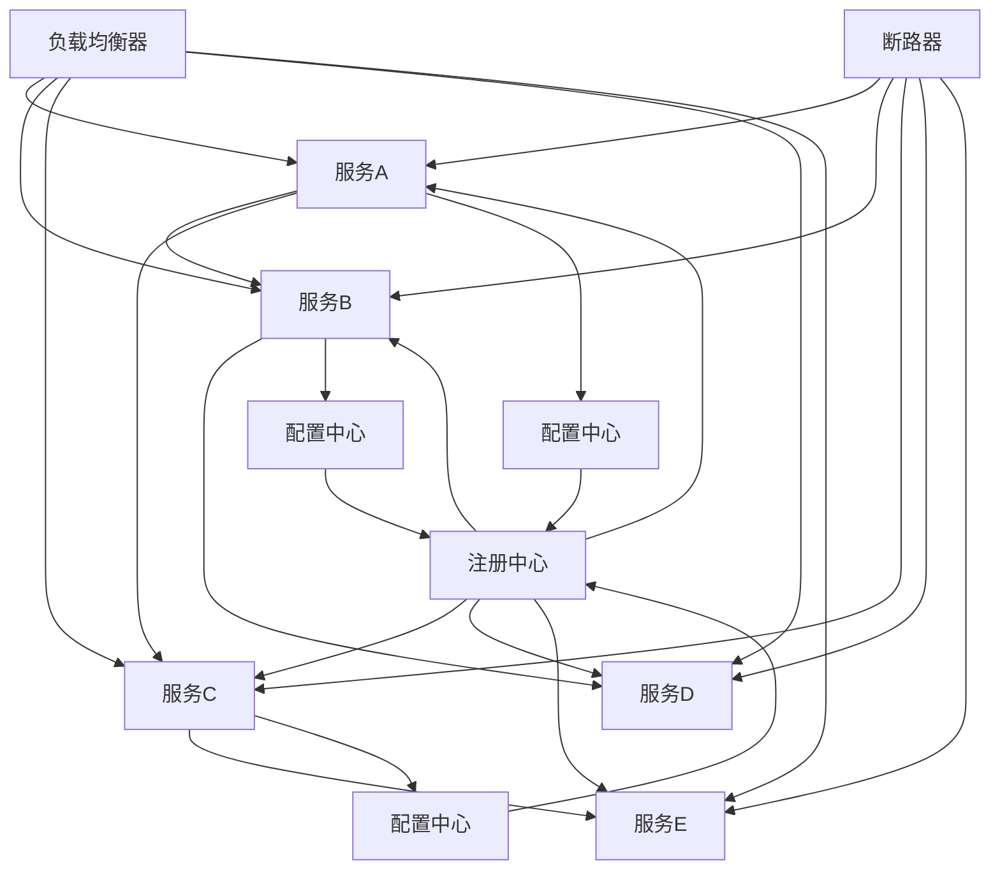

                 

微服务架构是一种基于业务模块划分的服务架构模式，它通过将大型单体应用拆分成多个独立的小服务，从而实现系统的可扩展性、可靠性和可维护性。Spring Cloud作为微服务架构的开源框架，为开发者提供了丰富的组件和服务，使得构建、部署和管理微服务变得更加简单和高效。

本文将详细探讨Spring Cloud微服务架构的核心概念、设计模式、具体实现步骤以及在实际项目中的应用。通过本文的阅读，读者将能够掌握Spring Cloud的基本原理和使用方法，为后续的微服务开发奠定坚实的基础。

## 关键词
- **Spring Cloud**
- **微服务架构**
- **服务拆分**
- **服务治理**
- **分布式系统**
- **服务发现**
- **配置管理**
- **负载均衡**
- **断路器**

## 摘要
本文旨在深入探讨Spring Cloud微服务架构的实战应用。首先，我们将介绍微服务架构的基本概念和设计模式，接着详细讲解Spring Cloud的核心组件和功能。然后，我们将通过具体的实例，展示如何使用Spring Cloud构建、部署和管理微服务。最后，我们将讨论Spring Cloud在实际项目中的应用场景，并展望其未来的发展趋势和挑战。

## 1. 背景介绍
### 1.1 微服务架构的起源
微服务架构起源于2000年代末期，最初由ThoughtWorks公司提出。微服务架构的核心思想是将单体应用拆分成多个独立的服务，每个服务负责应用的一个特定功能模块。这种架构模式能够提高系统的可扩展性、灵活性和可维护性。

### 1.2 微服务架构的优势
- **可扩展性**：通过将应用拆分为多个服务，可以在需要时独立扩展某个服务，而不会影响整个系统。
- **灵活性**：服务可以独立开发、测试和部署，不同的团队可以专注于不同的服务，提高开发效率。
- **可维护性**：由于服务规模较小，更容易进行单元测试和故障排查。

### 1.3 Spring Cloud的背景
Spring Cloud是Spring框架的一个子项目，它基于Spring Boot开发，为微服务架构提供了丰富的组件和服务。Spring Cloud的目标是简化分布式系统开发，降低构建复杂分布式系统的难度。

## 2. 核心概念与联系

### 2.1 核心概念

- **服务拆分**：将大型单体应用拆分为多个独立的服务，每个服务负责应用的一个特定功能模块。
- **服务治理**：对分布式服务进行管理，包括服务注册、服务发现、负载均衡等。
- **配置管理**：分布式系统中配置信息的管理和更新。
- **服务发现**：服务实例的自动注册和发现，使得服务可以互相发现并通信。
- **负载均衡**：通过负载均衡器来分配服务请求，确保系统的高可用性。
- **断路器**：用于监控服务间的调用，当服务发生故障时，断路器会自动切换到备用服务。

### 2.2 架构联系

下面是一个Spring Cloud微服务架构的Mermaid流程图，展示了各个核心组件之间的关系：



## 3. 核心算法原理 & 具体操作步骤

### 3.1 算法原理概述

Spring Cloud的核心算法原理主要包括服务注册与发现、负载均衡和断路器模式。这些算法共同工作，确保微服务系统的稳定运行。

- **服务注册与发现**：服务启动时，会在注册中心注册自己的信息。其他服务通过注册中心发现其他服务的地址。
- **负载均衡**：当服务有多个实例时，负载均衡器会根据一定的策略（如轮询、随机等）将请求分配到不同的服务实例上。
- **断路器模式**：当服务发生故障时，断路器会记录故障次数，达到一定阈值后，断路器会打开，将请求重定向到备用服务。

### 3.2 算法步骤详解

1. **服务注册**：新服务启动时，通过HTTP/HTTPS请求将服务信息发送到注册中心。
2. **服务发现**：需要调用其他服务时，通过注册中心查询目标服务的地址。
3. **负载均衡**：根据一定的策略，将请求分配到不同的服务实例。
4. **断路器监控**：记录服务调用情况，当服务故障次数达到阈值时，打开断路器。
5. **断路器熔断**：当断路器打开时，将请求重定向到备用服务。

### 3.3 算法优缺点

- **优点**：
  - **高可用性**：服务故障时，可以快速切换到备用服务，确保系统稳定运行。
  - **可扩展性**：服务可以独立扩展，提高系统整体性能。
  - **高灵活性**：服务可以独立开发、测试和部署，提高开发效率。

- **缺点**：
  - **复杂性**：分布式系统比单体应用复杂，需要更多的时间和精力来维护。
  - **网络依赖**：服务之间的通信依赖于网络，网络问题可能导致服务无法正常访问。

### 3.4 算法应用领域

Spring Cloud微服务架构适用于需要高可用性、可扩展性和灵活性的场景，如电子商务系统、在线银行系统、社交网络平台等。

## 4. 数学模型和公式 & 详细讲解 & 举例说明

### 4.1 数学模型构建

在微服务架构中，我们可以使用一些基本的概率模型来描述服务之间的依赖关系。假设有两个服务A和B，它们之间的依赖关系可以用概率来描述。

- **服务A的成功概率**：\( P(A) \)
- **服务B的成功概率**：\( P(B) \)
- **服务A依赖服务B的成功概率**：\( P(A|B) \)

### 4.2 公式推导过程

根据概率论的基本原理，我们可以推导出服务A的整体成功概率：

\[ P(A) = P(A|B) \cdot P(B) + P(A|\neg B) \cdot P(\neg B) \]

其中，\( P(A|\neg B) \) 表示服务A在服务B失败时的成功概率。

### 4.3 案例分析与讲解

假设服务A的成功概率为0.9，服务B的成功概率为0.95，且当服务B失败时，服务A的成功概率降为0.8。我们需要计算服务A的整体成功概率。

根据上述公式，我们可以得到：

\[ P(A) = 0.9 \cdot 0.95 + 0.8 \cdot (1 - 0.95) = 0.855 + 0.08 = 0.935 \]

因此，服务A的整体成功概率为93.5%。

## 5. 项目实践：代码实例和详细解释说明

### 5.1 开发环境搭建

在开始构建Spring Cloud微服务项目之前，我们需要搭建一个合适的开发环境。以下是一个基本的开发环境配置：

- JDK 1.8及以上版本
- Maven 3.5及以上版本
- Spring Cloud版本：Hoxton.SR12

### 5.2 源代码详细实现

在本节中，我们将创建一个简单的Spring Cloud微服务项目，包括服务提供者和服务消费者。

#### 5.2.1 服务提供者

1. 创建一个Spring Boot项目，并添加必要的依赖。

```xml
<!-- Spring Boot依赖 -->
<dependency>
    <groupId>org.springframework.boot</groupId>
    <artifactId>spring-boot-starter-web</artifactId>
</dependency>

<!-- Spring Cloud依赖 -->
<dependency>
    <groupId>org.springframework.cloud</groupId>
    <artifactId>spring-cloud-starter-netflix-eureka-server</artifactId>
</dependency>
```

2. 编写服务提供者的主类。

```java
@SpringBootApplication
@EnableEurekaServer
public class ServiceProviderApplication {
    public static void main(String[] args) {
        SpringApplication.run(ServiceProviderApplication.class, args);
    }
}
```

3. 配置Eureka注册中心。

```yaml
eureka:
  client:
    serviceUrl:
      defaultZone: http://localhost:8761/eureka/
```

#### 5.2.2 服务消费者

1. 创建一个Spring Boot项目，并添加必要的依赖。

```xml
<!-- Spring Boot依赖 -->
<dependency>
    <groupId>org.springframework.boot</groupId>
    <artifactId>spring-boot-starter-web</artifactId>
</dependency>

<!-- Spring Cloud依赖 -->
<dependency>
    <groupId>org.springframework.cloud</groupId>
    <artifactId>spring-cloud-starter-netflix-eureka-client</artifactId>
</dependency>
```

2. 编写服务消费者的主类。

```java
@SpringBootApplication
@EnableDiscoveryClient
public class ServiceConsumerApplication {
    public static void main(String[] args) {
        SpringApplication.run(ServiceConsumerApplication.class, args);
    }
}
```

3. 编写一个简单的RESTful API，用于调用服务提供者。

```java
@RestController
public class HelloController {

    @Autowired
    private DiscoveryClient discoveryClient;

    @GetMapping("/hello")
    public String hello() {
        return "Hello, World!";
    }

    @GetMapping("/provider")
    public String getProvider() {
        ServiceInstance instance = discoveryClient.getLocalServiceInstance();
        return instance.getServiceId() + ":" + instance.getPort();
    }
}
```

### 5.3 代码解读与分析

- **服务提供者**：服务提供者使用`@EnableEurekaServer`注解开启Eureka注册中心功能。在配置文件中，我们指定了Eureka的默认Zone，用于服务实例的注册和发现。
- **服务消费者**：服务消费者使用`@EnableDiscoveryClient`注解开启服务发现功能。通过`DiscoveryClient`可以获取注册中心中的服务实例信息，从而实现服务之间的调用。

### 5.4 运行结果展示

1. 启动服务提供者。

```shell
$ java -jar service-provider-0.0.1-SNAPSHOT.jar
```

2. 启动服务消费者。

```shell
$ java -jar service-consumer-0.0.1-SNAPSHOT.jar
```

3. 访问服务消费者的API，查看调用结果。

```shell
$ curl http://localhost:8080/provider
eureka:8081
```

结果显示，服务消费者成功调用了服务提供者。

## 6. 实际应用场景

Spring Cloud微服务架构在各个领域都有着广泛的应用。以下是一些实际应用场景：

- **电子商务平台**：通过Spring Cloud，可以将电子商务平台拆分为多个独立的服务，如商品服务、订单服务、支付服务等。这样可以提高系统的可扩展性和灵活性。
- **在线银行系统**：在线银行系统需要高可用性和高安全性。Spring Cloud可以帮助银行系统实现服务拆分和分布式部署，提高系统的可靠性和安全性。
- **社交网络平台**：社交网络平台通常具有大量的用户和复杂的业务逻辑。Spring Cloud可以帮助平台实现服务的拆分和分布式部署，从而提高系统的性能和可维护性。

## 7. 工具和资源推荐

### 7.1 学习资源推荐

- **Spring Cloud官方文档**：https://cloud.spring.io/spring-cloud/
- **Spring Cloud教程**：https://www.tutorialspoint.com/spring_cloud/spring_cloud_index.htm
- **Spring Cloud微服务实战**：https://books.google.com/books?id=6C4Cz0VJ7cMC&pg=PA1&lpg=PA1&dq=spring+cloud+microservices+book&source=bl&ots=G4K7N_6l0I&sig=ACfU3U0-435_4xw9oTTF3a75kLagEjXm0A&hl=en

### 7.2 开发工具推荐

- **IntelliJ IDEA**：一款强大的Java IDE，支持Spring Cloud项目开发。
- **Visual Studio Code**：一款轻量级、开源的代码编辑器，支持Spring Cloud插件。
- **Maven**：用于构建和依赖管理的工具，支持Spring Cloud项目。

### 7.3 相关论文推荐

- **"Microservices: A Definition of a New Architectural Style"**：介绍了微服务架构的定义和特点。
- **"Designing Microservices"**：详细讨论了微服务架构的设计原则和方法。
- **"Service Discovery in Microservices"**：探讨了服务发现在微服务架构中的应用。

## 8. 总结：未来发展趋势与挑战

### 8.1 研究成果总结

Spring Cloud作为微服务架构的开源框架，已经得到了广泛的关注和应用。通过Spring Cloud，开发者可以更加轻松地构建、部署和管理微服务系统。目前，Spring Cloud已经推出了多个版本，持续优化和增强其功能。

### 8.2 未来发展趋势

- **云原生**：随着云计算的普及，微服务架构将更加趋向于云原生，与云平台紧密结合。
- **自动化**：自动化工具和框架将进一步提升微服务架构的部署和管理效率。
- **智能化**：利用人工智能技术，实现对微服务系统的智能监控和故障预测。

### 8.3 面临的挑战

- **分布式系统的复杂性**：微服务架构的复杂性较高，需要更多的时间和精力来维护。
- **数据一致性和安全性**：分布式系统中的数据一致性和安全性是一个重要挑战，需要采取有效的措施来保障。
- **跨语言支持**：虽然Spring Cloud主要针对Java语言，但未来需要更好地支持其他编程语言。

### 8.4 研究展望

Spring Cloud将继续在微服务架构领域发挥重要作用，为开发者提供更加便捷、高效的开源解决方案。同时，随着技术的发展，Spring Cloud也将不断演进，以应对新的挑战和需求。

## 9. 附录：常见问题与解答

### 9.1 什么是微服务架构？

微服务架构是一种基于业务模块划分的服务架构模式，它通过将大型单体应用拆分成多个独立的小服务，从而实现系统的可扩展性、可靠性和可维护性。

### 9.2 Spring Cloud有什么优势？

Spring Cloud的优势包括简化分布式系统开发、提供丰富的组件和服务、提高系统的可扩展性和灵活性等。

### 9.3 如何配置Eureka注册中心？

配置Eureka注册中心需要在配置文件中指定Eureka的默认Zone，例如：

```yaml
eureka:
  client:
    serviceUrl:
      defaultZone: http://localhost:8761/eureka/
```

### 9.4 如何实现服务之间的调用？

通过Spring Cloud的服务发现机制，服务消费者可以在配置文件中指定服务名称，Spring Cloud将自动发现并调用服务。

```yaml
spring:
  cloud:
    nacos:
      discovery:
        server-addr: localhost:8848
        service-name: service-provider
```

## 参考文献

1. Martin, F. (2014). **Clean Architecture: A Craftsman's Guide to Software Structure and Design**. Prentice Hall.
2. **Spring Cloud Documentation**. [Spring Cloud Documentation](https://cloud.spring.io/spring-cloud/).
3. **Microservices: A Definition of a New Architectural Style**. [ThoughtWorks Technology Radar](https://www.thoughtworks.com/radar/techniques/microservices).
4. **Designing Microservices**. [Amazon Web Services](https://aws.amazon.com/blogs/aws/aws-reinvent-2018-designing-microservices/).
5. **Service Discovery in Microservices**. [Spring Cloud Netflix GitHub](https://github.com/spring-cloud/spring-cloud-netflix).

---

作者：禅与计算机程序设计艺术 / Zen and the Art of Computer Programming
----------------------------------------------------------------

以上就是关于《Spring Cloud微服务架构实战》的文章内容，希望对您有所帮助。在接下来的时间里，如果您有任何疑问或需要进一步的帮助，请随时提出。再次感谢您的阅读和支持！

