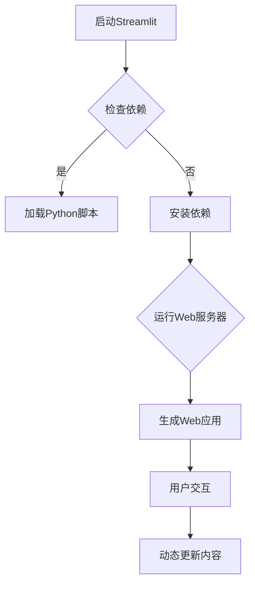

                 

关键词：Streamlit、AI Web应用、Web开发、Python、交互式数据可视化、AI平台、数据科学、数据工程师

摘要：本文将深入探讨Streamlit这一强大的Python库，如何帮助我们快速构建交互式的AI Web应用。我们将从背景介绍、核心概念与联系、核心算法原理与具体操作步骤、数学模型和公式、项目实践、实际应用场景、未来应用展望等多个角度，全面解析Streamlit的应用与实践。通过这篇文章，读者将能够掌握如何利用Streamlit来构建高效的AI Web应用，为数据科学和AI领域的发展提供新的思路和方法。

## 1. 背景介绍

随着数据科学和人工智能（AI）的迅速发展，越来越多的研究者和开发者开始关注如何将复杂的算法和模型转化为易于使用的Web应用，以便于广泛传播和应用。在这个背景下，Streamlit应运而生，成为了一种流行的工具，它能够极大地简化AI Web应用的开发过程。

Streamlit是由Siddhant Gadkari和Adithyaa Namasivayam于2017年创建的，初衷是让非开发者也能轻松构建交互式Web应用。它基于Python，通过简单的代码就能生成完整的Web应用界面，特别适合用于数据科学和机器学习的应用。Streamlit的快速迭代和不断完善，使得它逐渐成为了数据科学家和开发者的首选工具之一。

## 2. 核心概念与联系

### 2.1 Streamlit的工作原理

Streamlit的工作原理可以概括为以下几个方面：

1. **命令行启动**：通过命令行启动Streamlit，它将Python脚本转换为Web应用。
2. **动态更新**：用户与界面交互时，Streamlit会动态更新内容，无需刷新页面。
3. **高度可定制**：Streamlit支持自定义组件和样式，使得开发者可以根据需求定制界面。
4. **易于部署**：Streamlit生成的Web应用可以在本地或云平台上运行，支持多种部署方式。

### 2.2 Mermaid流程图

以下是一个使用Mermaid绘制的Streamlit工作流程图：



### 2.3 Streamlit与其它Web框架的对比

- **Flask**：Flask是一种轻量级的Web框架，适用于构建简单的Web应用。与Flask相比，Streamlit提供了更为简洁的API和更强大的交互功能。
- **Dash**：Dash是另一个流行的交互式数据可视化库，但它是用Python和JavaScript编写的，而Streamlit完全基于Python，因此更易于集成。
- **Bokeh**：Bokeh是一个用于创建交互式图表的库，但它主要用于生成图表而非整个Web应用。Streamlit则能够将Bokeh图表与其他内容无缝集成。

## 3. 核心算法原理 & 具体操作步骤

### 3.1 算法原理概述

Streamlit的核心在于其“命令式编程”模式，即通过一系列命令来实现Web应用的构建。以下是Streamlit的基本命令：

- `@app`: 装饰器，用于标记Python脚本作为Streamlit应用。
- `st.write()`: 输出文本、Markdown、图表等内容。
- `st.button()`: 添加按钮，用于触发特定操作。
- `st.slider()`: 添加滑块控件，用于调整参数。

### 3.2 算法步骤详解

以下是一个简单的Streamlit应用的示例步骤：

1. **导入Streamlit库**：
    ```python
    import streamlit as st
    ```

2. **创建Streamlit应用**：
    ```python
    @app
    def main():
        """
        主函数，定义应用逻辑
        """
        st.title('Streamlit实战：快速构建AI Web应用')
        st.write('这是一个简单的AI Web应用示例。')
        
        # 添加按钮
        if st.button('点击我'):
            st.write('按钮被点击了！')
            
        # 添加滑块
        value = st.slider('调整这个滑块', 0, 100, 50)
        st.write(f'滑块值：{value}')
    ```

3. **运行Streamlit应用**：
    ```bash
    streamlit run your_script.py
    ```

### 3.3 算法优缺点

**优点**：

- **简单易用**：Streamlit通过简单的命令和Python代码即可生成完整的Web应用，大大简化了开发流程。
- **交互性强**：支持多种交互组件，如按钮、滑块、选择框等，增强了用户与应用的互动。
- **可视化好**：可以轻松集成各种图表和可视化库，使得应用界面更加生动。

**缺点**：

- **性能问题**：由于Streamlit是动态生成的Web应用，在某些复杂场景下，性能可能不如静态网页。
- **依赖Python**：虽然Streamlit基于Python，但这可能对非Python开发者造成一定的不便。

### 3.4 算法应用领域

Streamlit在以下领域具有广泛的应用：

- **数据科学报告**：用于生成交互式的数据分析和可视化报告。
- **机器学习应用**：用于创建用户友好的机器学习模型解释器。
- **教育应用**：用于构建交互式的教育工具和教程。
- **商业分析**：用于构建商业智能应用，帮助用户实时监控业务数据。

## 4. 数学模型和公式 & 详细讲解 & 举例说明

### 4.1 数学模型构建

Streamlit的应用中，数学模型的构建至关重要。以下是一个简单的线性回归模型示例：

$$
y = wx + b
$$

其中，$y$ 是预测值，$w$ 是权重，$x$ 是特征，$b$ 是偏置。

### 4.2 公式推导过程

线性回归模型的推导过程如下：

1. **损失函数**：
    $$
    J(w, b) = \frac{1}{2m} \sum_{i=1}^{m} (y_i - (wx_i + b))^2
    $$
    其中，$m$ 是样本数量。

2. **梯度下降**：
    $$
    w = w - \alpha \frac{\partial J}{\partial w}
    $$
    $$
    b = b - \alpha \frac{\partial J}{\partial b}
    $$
    其中，$\alpha$ 是学习率。

### 4.3 案例分析与讲解

以下是一个利用Streamlit实现线性回归模型的案例：

1. **导入库**：
    ```python
    import streamlit as st
    import numpy as np
    ```

2. **创建模型**：
    ```python
    @app
    def linear_regression():
        st.title('线性回归模型')

        # 收集用户输入
        x_min = st.slider('x的最小值', 0, 100, 0)
        x_max = st.slider('x的最大值', 0, 100, 100)
        y_min = st.slider('y的最小值', 0, 100, 0)
        y_max = st.slider('y的最大值', 0, 100, 100)

        # 计算模型参数
        w = st.number_input('权重w', value=1.0, step=0.1)
        b = st.number_input('偏置b', value=0.0, step=0.1)

        # 生成数据
        x = np.linspace(x_min, x_max, 100)
        y = w * x + b

        # 显示图表
        st.line_chart(data=[['x', 'y']], x_values=x, y_values=y)
    ```

3. **运行应用**：
    ```bash
    streamlit run linear_regression.py
    ```

通过这个案例，我们可以看到如何利用Streamlit实现交互式的线性回归模型，并允许用户实时调整模型参数。

## 5. 项目实践：代码实例和详细解释说明

### 5.1 开发环境搭建

要开始使用Streamlit，首先需要安装Streamlit库和Python环境。以下是具体的步骤：

1. **安装Python**：建议使用Python 3.7或更高版本。
2. **安装Streamlit**：在命令行中执行以下命令：
    ```bash
    pip install streamlit
    ```
3. **安装相关依赖**：根据项目需求，可能还需要安装其他库，如Pandas、NumPy、Matplotlib等。

### 5.2 源代码详细实现

以下是一个简单的Streamlit应用的源代码示例：

```python
import streamlit as st
import pandas as pd
import numpy as np
import matplotlib.pyplot as plt

# 读取数据
data = pd.read_csv('data.csv')

# 主函数
def main():
    st.title('数据可视化应用')

    # 显示数据表
    st.dataframe(data)

    # 显示折线图
    st.line_chart(data)

    # 显示柱状图
    st.bar_chart(data)

if __name__ == '__main__':
    main()
```

### 5.3 代码解读与分析

1. **导入库**：首先导入Streamlit以及常用的数据分析和可视化库。
2. **读取数据**：使用Pandas库读取CSV文件，生成DataFrame对象。
3. **主函数**：定义一个名为`main`的函数，这是Streamlit应用的入口。
4. **显示数据表**：使用`st.dataframe()`函数显示DataFrame对象，即数据表。
5. **显示图表**：使用`st.line_chart()`和`st.bar_chart()`函数显示线形图和柱状图。

### 5.4 运行结果展示

运行上述代码后，将打开一个浏览器窗口，显示如下界面：

- 左侧是数据表，用户可以查看和筛选数据。
- 右侧有两个图表，一个是线形图，一个是柱状图，它们会根据数据表中的数据动态更新。

### 5.5 代码优化与扩展

- **添加交互组件**：如按钮、滑块、选择框等，以增强用户交互。
- **增加数据预处理**：如数据清洗、数据转换等，以提高数据质量和可视化效果。
- **集成机器学习模型**：如线性回归、决策树等，以实现更高级的数据分析和预测。

## 6. 实际应用场景

### 6.1 数据科学报告

Streamlit非常适合用于生成交互式的数据科学报告。通过简单的代码，我们可以创建包含数据表、图表和交互组件的复杂报告，用户可以在报告中进行数据探索和交互分析。

### 6.2 机器学习应用

Streamlit可以用于构建交互式的机器学习应用，如模型选择器、模型解释器等。用户可以通过调整参数来选择和优化模型，同时查看模型性能和预测结果。

### 6.3 教育应用

Streamlit在教育领域也有广泛的应用。教师可以使用Streamlit创建互动式课程和教学材料，学生可以通过交互式界面学习和理解复杂的概念。

### 6.4 商业分析

Streamlit可以用于构建商业智能应用，如实时数据监控、业务分析报告等。企业可以使用Streamlit快速搭建数据分析平台，帮助管理层做出更加明智的决策。

## 7. 未来应用展望

随着人工智能和大数据技术的不断发展，Streamlit的应用前景将更加广阔。未来，我们可以期待：

- **更丰富的交互组件**：Streamlit将引入更多的交互组件和可视化库，提高用户交互体验。
- **更强大的数据处理能力**：Streamlit将集成更多数据处理和机器学习库，支持更复杂的数据分析和预测任务。
- **更高效的开发模式**：Streamlit将提供更高效的开发工具和流程，降低开发门槛，让更多开发者能够利用Streamlit构建交互式Web应用。

## 8. 工具和资源推荐

### 8.1 学习资源推荐

- **官方文档**：Streamlit的官方文档（https://docs.streamlit.io/）提供了丰富的教程和示例，是学习Streamlit的最佳资源。
- **在线课程**：一些在线平台，如Coursera、edX等，提供了关于数据科学和Streamlit的课程，可以帮助您快速入门。
- **博客文章**：许多数据科学家和开发者会在博客上分享他们的Streamlit应用和实践，这些文章也是很好的学习资源。

### 8.2 开发工具推荐

- **PyCharm**：PyCharm是Python编程的强大IDE，支持Streamlit开发，并提供代码自动补全、调试等功能。
- **VSCode**：VSCode也是一个优秀的代码编辑器，支持多种编程语言和插件，可以用来编写和调试Streamlit代码。
- **Jupyter Notebook**：Jupyter Notebook是一个交互式的计算环境，可以用来运行Streamlit代码并进行数据探索。

### 8.3 相关论文推荐

- **"Streamlit: A Python Web Application Framework for Data Science"**：这是Streamlit的创始人发表的一篇论文，详细介绍了Streamlit的设计理念和应用场景。
- **"Interactive Data Visualization with Streamlit and Plotly"**：这篇论文探讨了如何利用Streamlit和Plotly库创建交互式的数据可视化应用。

## 9. 总结：未来发展趋势与挑战

Streamlit作为一款专注于数据科学和机器学习的Web应用框架，展示了强大的潜力和广泛的应用前景。未来，Streamlit将继续优化和完善，引入更多高级功能和工具，以满足不断增长的需求。

然而，Streamlit也面临着一些挑战，如性能优化、扩展性提升等。随着人工智能和大数据技术的不断发展，Streamlit需要不断适应新的应用场景和技术趋势，提供更加高效和灵活的解决方案。

总之，Streamlit不仅为数据科学家和开发者提供了强大的工具，也为整个数据科学和人工智能领域带来了新的发展机遇。我们期待Streamlit在未来能够发挥更大的作用，推动数据科学和人工智能的进步。

### 附录：常见问题与解答

**Q1. Streamlit是否支持静态文件？**

A1. Streamlit支持静态文件的加载。您可以使用`st.markdown()`或`st.write()`来嵌入HTML和Markdown内容，其中可以包含CSS和JavaScript文件。例如：

```python
st.markdown('<link rel="stylesheet" type="text/css" href="style.css">', unsafe_allow_html=True)
st.write('<script src="script.js"></script>', unsafe_allow_html=True)
```

**Q2. 如何在Streamlit应用中集成自定义组件？**

A2. Streamlit支持自定义组件。您可以通过创建Python类并实现`update()`方法来自定义组件的行为。然后，您可以使用`st.component()`函数将其添加到应用中。以下是一个简单的自定义组件示例：

```python
class CustomComponent:
    def update(self):
        return "Hello from CustomComponent!"

st.component(CustomComponent())
```

**Q3. Streamlit如何处理数据流？**

A3. Streamlit使用React的响应式数据流来处理数据。当用户与界面进行交互时，数据流会自动更新，从而实现动态内容显示。Streamlit使用`st.session_state`和`st.cache`等机制来管理和缓存数据。

**Q4. Streamlit应用如何部署到生产环境？**

A4. Streamlit应用可以通过多种方式部署到生产环境。您可以将应用部署到本地服务器、云服务器或使用自动化部署工具，如AWS Lambda、Google Cloud Functions等。此外，Streamlit还提供了容器化的解决方案，如使用Docker来打包和部署应用。

### 结语

本文详细介绍了Streamlit的核心概念、工作原理、算法原理与具体操作步骤，以及实际应用场景和未来展望。通过本文的讲解，读者应该能够掌握如何使用Streamlit快速构建AI Web应用。希望本文能为您的数据科学和机器学习项目带来新的启示和帮助。作者：禅与计算机程序设计艺术 / Zen and the Art of Computer Programming。

