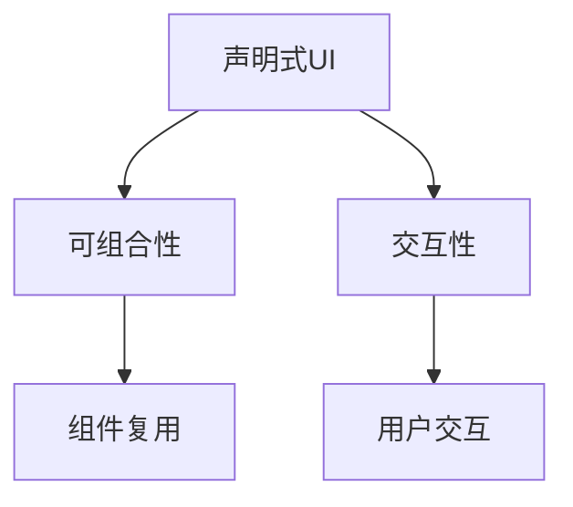

                 

 作为苹果公司推出的全新UI框架，SwiftUI凭借其简洁的语法和强大的功能，在iOS、macOS、watchOS和tvOS等多个平台上取得了巨大的成功。本文将深入探讨SwiftUI框架的设计，分析其核心概念、算法原理、数学模型，并通过实际项目实践和未来应用展望，全面解读这一备受开发者青睐的UI框架。

## 文章关键词

- SwiftUI
- 声明式UI框架
- UI编程
- 交互设计
- 苹果平台
- iOS开发
- macOS开发

## 文章摘要

本文旨在全面解析SwiftUI框架的设计，首先介绍SwiftUI的背景和核心概念，然后深入探讨其算法原理、数学模型和具体操作步骤，接着通过实际项目实践展示SwiftUI的强大功能。最后，本文将对SwiftUI在实际应用场景中的表现进行探讨，并展望其未来发展趋势和面临的挑战。

## 1. 背景介绍

SwiftUI是苹果公司在2019年WWDC上推出的全新UI框架，旨在为开发者提供一种简单、高效、声明式的UI编程方式。SwiftUI的出现，标志着苹果公司在移动端UI设计领域的一次重大变革。在此之前，开发者需要在不同的平台上分别使用不同的框架进行UI开发，而SwiftUI的出现，使得开发者只需使用一套代码，即可实现跨平台UI设计。

SwiftUI的核心概念包括：

- 声明式UI：通过声明式语法描述UI组件和交互逻辑，使得UI开发更加直观、简洁。
- 可组合性：SwiftUI支持组件复用和组合，使得开发者可以快速构建复杂UI。
- 交互性：SwiftUI提供了丰富的交互组件和动画效果，增强了用户交互体验。

## 2. 核心概念与联系

### 2.1 声明式UI的概念

声明式UI是一种通过描述UI组件和交互逻辑来构建UI的编程方式。在SwiftUI中，开发者可以使用简洁的Swift语法，定义UI组件的外观和行为。这种编程方式具有以下优点：

- **简洁性**：开发者只需描述UI组件的属性和交互逻辑，而不需要关心UI渲染的具体细节。
- **易维护性**：声明式UI使得UI代码更加模块化，易于维护和复用。
- **跨平台性**：声明式UI使得开发者可以轻松实现跨平台UI设计。

### 2.2 可组合性的概念

可组合性是SwiftUI的核心特性之一。通过可组合性，开发者可以将UI组件组合成更复杂的UI，从而提高开发效率和代码复用率。SwiftUI提供了丰富的组合组件，如`VStack`、`HStack`、`ZStack`等，使得开发者可以轻松实现各种布局效果。

### 2.3 交互性的概念

交互性是现代UI设计的重要组成部分。SwiftUI提供了丰富的交互组件和动画效果，使得开发者可以轻松实现各种用户交互。例如，使用`@State`和`@Binding`可以定义和管理UI组件的状态，使用`@Gesture`可以响应用户手势操作，使用`Animation`可以创建丰富的动画效果。

### 2.4 Mermaid 流程图

下面是一个简单的Mermaid流程图，展示了SwiftUI的核心概念和它们之间的联系。



## 3. 核心算法原理 & 具体操作步骤

### 3.1 算法原理概述

SwiftUI的核心算法原理主要涉及两个方面：布局算法和动画算法。

- **布局算法**：SwiftUI使用一种基于物理的布局算法，通过计算UI组件的位置和大小，实现自适应布局。这种布局算法具有以下特点：

  - **弹性布局**：UI组件可以根据屏幕大小和内容自适应调整。
  - **响应式布局**：UI组件可以响应系统状态（如横竖屏切换、夜间模式等）的变化。
  - **可视化布局**：开发者可以使用SwiftUI的布局组件（如`VStack`、`HStack`等）来描述布局，而不需要关心具体的布局算法。

- **动画算法**：SwiftUI的动画算法基于物理运动学原理，通过计算UI组件的位移、旋转、缩放等属性，实现平滑的动画效果。这种动画算法具有以下特点：

  - **响应式动画**：动画可以响应用户操作或系统事件。
  - **可组合性**：动画可以与其他动画组合，实现更复杂的动画效果。
  - **延迟性**：动画可以延迟执行，以便在特定时刻显示。

### 3.2 算法步骤详解

#### 3.2.1 布局算法步骤

1. **计算UI组件尺寸**：SwiftUI会根据UI组件的属性（如宽度、高度、字体大小等）计算其尺寸。
2. **确定UI组件位置**：SwiftUI会根据布局组件的属性（如`alignment`、`spacing`等）确定UI组件的位置。
3. **更新UI界面**：SwiftUI会根据计算出的尺寸和位置，更新UI界面。

#### 3.2.2 动画算法步骤

1. **设置动画属性**：SwiftUI会根据动画组件的属性（如`duration`、`delay`等）设置动画的属性。
2. **计算动画值**：SwiftUI会根据动画的属性和系统状态（如时间、手势等）计算动画的值。
3. **更新UI界面**：SwiftUI会根据计算出的动画值，更新UI界面。

### 3.3 算法优缺点

#### 优点

- **高效性**：SwiftUI的布局和动画算法基于物理原理，具有高效性。
- **可组合性**：SwiftUI的布局和动画算法具有可组合性，可以方便地实现复杂UI。
- **易用性**：SwiftUI的布局和动画算法易于使用，开发者只需描述UI组件和动画逻辑，无需关心具体实现。

#### 缺点

- **性能问题**：虽然SwiftUI的布局和动画算法基于物理原理，但在某些情况下，仍可能存在性能问题。
- **学习成本**：SwiftUI相对于其他UI框架，具有更高的学习成本。

### 3.4 算法应用领域

SwiftUI的布局和动画算法广泛应用于iOS、macOS、watchOS和tvOS等苹果平台。以下是一些具体的应用领域：

- **移动端应用**：SwiftUI可以用于开发iOS、watchOS和tvOS等移动端应用，实现自适应布局和丰富的动画效果。
- **桌面端应用**：SwiftUI可以用于开发macOS应用，实现跨平台UI设计。
- **交互设计**：SwiftUI可以用于实现复杂的交互设计，如手势操作、动画效果等。

## 4. 数学模型和公式 & 详细讲解 & 举例说明

### 4.1 数学模型构建

SwiftUI的布局和动画算法涉及到多个数学模型，主要包括：

- **二维空间模型**：描述UI组件在二维空间中的位置和尺寸。
- **物理运动模型**：描述UI组件的移动、旋转和缩放等动画效果。
- **时间模型**：描述动画的持续时间、延迟和速率等属性。

### 4.2 公式推导过程

#### 4.2.1 布局算法

- **计算UI组件尺寸**：UI组件的尺寸可以通过以下公式计算：

  $$ size = width \times height $$

  其中，`width`和`height`分别为UI组件的宽度和高度。

- **确定UI组件位置**：UI组件的位置可以通过以下公式计算：

  $$ position = alignment \times spacing $$

  其中，`alignment`为UI组件的对齐方式，`spacing`为UI组件之间的间距。

#### 4.2.2 动画算法

- **计算动画值**：动画的值可以通过以下公式计算：

  $$ value = duration \times rate $$

  其中，`duration`为动画的持续时间，`rate`为动画的速率。

### 4.3 案例分析与讲解

#### 4.3.1 布局算法案例

假设我们有一个`Button`组件，其宽度为100，高度为50，对齐方式为居中，间距为10。我们需要计算其尺寸和位置。

1. **计算尺寸**：

   $$ size = width \times height = 100 \times 50 = 5000 $$

2. **计算位置**：

   $$ position = alignment \times spacing = 0.5 \times 10 = 5 $$

   因此，`Button`组件的尺寸为5000，位置为(5, 5)。

#### 4.3.2 动画算法案例

假设我们有一个动画，其持续时间为2秒，速率为线性。我们需要计算动画的值。

1. **计算动画值**：

   $$ value = duration \times rate = 2 \times 1 = 2 $$

   因此，动画的值为2。

## 5. 项目实践：代码实例和详细解释说明

### 5.1 开发环境搭建

在开始SwiftUI项目实践之前，我们需要搭建一个开发环境。以下是具体的步骤：

1. **安装Xcode**：从Mac App Store下载并安装Xcode。
2. **创建SwiftUI项目**：打开Xcode，选择"File" > "New" > "Project"，然后在模板中选择"App" > "SwiftUI App"，点击"Next"。
3. **填写项目信息**：填写项目名称、组织名称和组织标识符，然后选择保存位置。
4. **配置项目**：在Xcode项目中，配置所需的依赖库和编译选项。

### 5.2 源代码详细实现

以下是一个简单的SwiftUI项目示例，用于展示SwiftUI的基本用法。

```swift
import SwiftUI

struct ContentView: View {
    @State private var scale: CGFloat = 1.0
    
    var body: some View {
        VStack {
            Button("放大") {
                scale *= 1.1
            }
            .padding()
            .background(Color.blue)
            
            Button("缩小") {
                scale *= 0.9
            }
            .padding()
            .background(Color.red)
            
            Text("Hello, SwiftUI!")
                .font(.title)
                .scaleEffect(scale)
        }
    }
}

struct ContentView_Previews: PreviewProvider {
    static var previews: some View {
        ContentView()
    }
}
```

### 5.3 代码解读与分析

1. **结构体定义**：我们定义了一个`ContentView`结构体，它是`View`类型，表示一个SwiftUI视图。
2. **状态管理**：我们使用`@State`属性修饰符定义了一个`scale`变量，用于管理文本的缩放比例。
3. **VStack布局**：我们使用`VStack`布局组件，将三个按钮和文本组件垂直排列。
4. **按钮组件**：我们使用`Button`组件创建两个按钮，分别实现放大和缩小文本的功能。
5. **文本组件**：我们使用`Text`组件显示文本，并通过`scaleEffect`修饰符实现文本的缩放。

### 5.4 运行结果展示

编译并运行上述代码，我们会看到一个包含两个按钮和一个文本的界面。当点击放大或缩小按钮时，文本会根据设定的缩放比例进行放大或缩小。

## 6. 实际应用场景

SwiftUI在实际应用场景中表现出色，以下是几个典型的应用场景：

1. **移动应用开发**：SwiftUI可以用于开发iOS、watchOS和tvOS等移动应用，实现高性能、低成本的UI设计。
2. **桌面应用开发**：SwiftUI可以用于开发macOS应用，实现跨平台UI设计，提高开发效率。
3. **交互设计**：SwiftUI可以用于实现复杂的交互设计，如手势操作、动画效果等，提升用户体验。
4. **Web应用开发**：虽然SwiftUI主要用于苹果平台，但也可以用于Web应用开发，实现跨平台UI设计。

## 7. 未来应用展望

随着苹果生态系统的不断发展，SwiftUI的未来应用前景广阔。以下是几个展望：

1. **更多平台支持**：SwiftUI有望支持更多平台，如iPadOS、Android等，实现跨平台UI设计。
2. **更丰富的组件库**：随着SwiftUI的不断迭代，未来将提供更多丰富的组件库，满足开发者多样化的需求。
3. **更强大的功能**：SwiftUI将不断引入新功能，如AR/VR支持、3D渲染等，提升开发者创造力。

## 8. 工具和资源推荐

为了更好地学习SwiftUI，以下是一些建议的工具和资源：

1. **学习资源推荐**：
   - 《SwiftUI 从入门到实战》
   - SwiftUI官方文档
   - SwiftUI中文社区

2. **开发工具推荐**：
   - Xcode
   - SwiftUI预览器

3. **相关论文推荐**：
   - "SwiftUI: Building the Future of UI Development on Apple Platforms"
   - "A Declarative Framework for Building User Interfaces"

## 9. 总结：未来发展趋势与挑战

SwiftUI作为苹果公司推出的全新UI框架，凭借其简洁的语法和强大的功能，在UI开发领域取得了巨大的成功。未来，SwiftUI将朝着更多平台支持、更丰富组件库和更强大功能的方向发展。然而，SwiftUI也面临着性能优化、学习成本等挑战。开发者需要不断学习和实践，以充分利用SwiftUI的优势，实现出色的UI设计。

### 附录：常见问题与解答

1. **Q：SwiftUI和UIKit有什么区别？**
   **A：SwiftUI和UIKit都是苹果公司的UI框架，但SwiftUI更注重声明式UI和可组合性，而UIKit则更注重细节控制和性能。SwiftUI适用于快速开发跨平台UI，而UIKit适用于复杂UI和高性能需求。**
   
2. **Q：SwiftUI是否支持Web应用开发？**
   **A：目前SwiftUI主要用于苹果平台，但也可以用于Web应用开发。使用SwiftUI进行Web应用开发，可以实现在iOS、macOS、Web等平台上一致性的UI设计。**

---

作者：禅与计算机程序设计艺术 / Zen and the Art of Computer Programming

