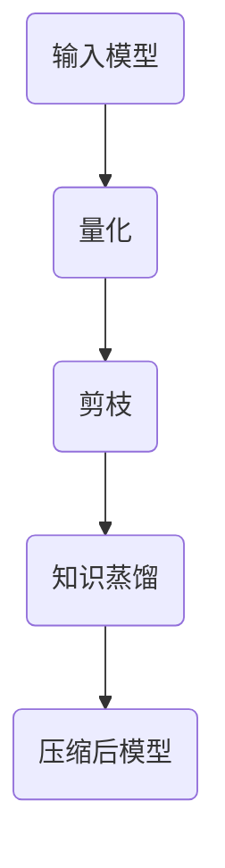

                 

关键词：TensorFlow Lite、模型压缩、深度学习、移动设备、性能优化

摘要：本文将探讨TensorFlow Lite模型压缩技术，介绍其核心概念、算法原理、操作步骤、数学模型及其在实际应用中的实践。通过详细的分析和实例，帮助读者深入理解模型压缩的技术细节和重要性。

## 1. 背景介绍

随着深度学习在各个领域的广泛应用，模型的大小和计算复杂性不断增加。然而，许多应用场景，尤其是移动设备和嵌入式系统，对模型的大小和计算性能有着严格的要求。因此，如何高效地压缩深度学习模型，使其在保持性能的同时减小体积，成为当前研究的热点之一。

TensorFlow Lite是Google推出的一个轻量级深度学习框架，专为移动和嵌入式设备设计。它支持多种硬件加速，并提供了丰富的模型压缩工具，如量化、剪枝和知识蒸馏等。本文将重点介绍TensorFlow Lite中的模型压缩技术，帮助读者了解其在实际应用中的潜力和挑战。

## 2. 核心概念与联系

### 2.1 模型压缩的定义

模型压缩是指通过一系列技术手段，减少深度学习模型的参数数量和计算复杂度，从而减小模型的大小和提升计算性能的过程。

### 2.2 模型压缩的原理

模型压缩的原理主要基于以下几个核心概念：

- **量化**：将模型的浮点数权重转换为低精度的整数表示，从而减小模型的大小。
- **剪枝**：通过移除模型中不必要的权重和神经元，减少模型的参数数量。
- **知识蒸馏**：使用一个大的、未压缩的模型来指导一个小的、压缩后的模型，从而保留其知识。

### 2.3 模型压缩的架构

下图展示了TensorFlow Lite模型压缩的整体架构。



### 2.4 模型压缩的应用领域

模型压缩在多个领域有着广泛的应用：

- **移动设备**：如智能手机、平板电脑等，对模型大小和计算性能有严格要求。
- **嵌入式系统**：如智能手表、智能眼镜等，空间和计算资源有限。
- **物联网**：如智能家居、智能城市等，对模型实时性和可靠性有高要求。

## 3. 核心算法原理 & 具体操作步骤

### 3.1 算法原理概述

TensorFlow Lite模型压缩主要采用量化、剪枝和知识蒸馏等技术。下面将详细讲解这些技术的原理。

### 3.2 算法步骤详解

#### 3.2.1 量化

量化是指将模型的浮点数权重转换为低精度的整数表示。具体步骤如下：

1. **选择量化策略**：如全量化、按层量化、按通道量化等。
2. **计算量化参数**：如量化步长、量化范围等。
3. **量化模型权重**：将每个权重值转换为整数表示。

#### 3.2.2 剪枝

剪枝是指通过移除模型中不必要的权重和神经元，减少模型的参数数量。具体步骤如下：

1. **选择剪枝策略**：如逐层剪枝、逐通道剪枝等。
2. **计算剪枝率**：根据模型复杂度和计算资源，确定剪枝比例。
3. **剪枝模型**：移除不必要的权重和神经元。

#### 3.2.3 知识蒸馏

知识蒸馏是指使用一个大的、未压缩的模型来指导一个小的、压缩后的模型，从而保留其知识。具体步骤如下：

1. **准备教师模型**：选择一个大的、未压缩的模型作为教师模型。
2. **生成蒸馏目标**：使用教师模型对输入数据进行预测，生成蒸馏目标。
3. **训练学生模型**：使用蒸馏目标训练压缩后的模型。

### 3.3 算法优缺点

#### 优点

- **减小模型大小**：通过量化、剪枝等技术，显著减小模型的大小，提升计算性能。
- **提高部署效率**：压缩后的模型可以在移动设备和嵌入式系统上快速部署。

#### 缺点

- **精度损失**：量化、剪枝等技术可能会引入一定的精度损失。
- **训练成本**：知识蒸馏技术需要额外的训练成本。

### 3.4 算法应用领域

TensorFlow Lite模型压缩技术主要应用于移动设备和嵌入式系统，如智能手机、平板电脑、智能手表、智能眼镜等。通过压缩模型，可以提升设备的性能和用户体验，同时降低开发成本。

## 4. 数学模型和公式

### 4.1 数学模型构建

#### 4.1.1 量化模型

量化模型的基本公式如下：

$$
\hat{w} = Q(w)
$$

其中，$w$ 表示原始权重，$\hat{w}$ 表示量化后的权重，$Q$ 表示量化函数。

#### 4.1.2 剪枝模型

剪枝模型的基本公式如下：

$$
\hat{w}_{i,j,k} = \begin{cases}
w_{i,j,k} & \text{if } mask_{i,j,k} = 1 \\
0 & \text{otherwise}
\end{cases}
$$

其中，$w$ 表示原始权重，$\hat{w}$ 表示剪枝后的权重，$mask$ 表示剪枝掩码。

#### 4.1.3 知识蒸馏模型

知识蒸馏模型的基本公式如下：

$$
\begin{aligned}
\hat{p}_{i} &= \frac{1}{Z} \sum_{k=1}^{K} e^{q_k \cdot t_i} \\
Z &= \sum_{k=1}^{K} e^{q_k \cdot t_i}
\end{aligned}
$$

其中，$p$ 表示预测概率，$q$ 表示蒸馏目标，$t$ 表示输入数据，$K$ 表示类别数。

### 4.2 公式推导过程

#### 4.2.1 量化公式推导

量化公式推导如下：

$$
\hat{w} = \frac{w - \mu_w}{\sigma_w}
$$

其中，$\mu_w$ 表示权重均值，$\sigma_w$ 表示权重标准差。

#### 4.2.2 剪枝公式推导

剪枝公式推导如下：

$$
\begin{aligned}
mask_{i,j,k} &= \begin{cases}
1 & \text{if } |w_{i,j,k}| > \theta \\
0 & \text{otherwise}
\end{cases} \\
\theta &= \frac{\alpha}{N} \max(|w|) \\
\alpha &= \frac{1}{N} \sum_{i,j,k} |w_{i,j,k}|
\end{aligned}
$$

其中，$\theta$ 表示剪枝阈值，$N$ 表示总权重数。

#### 4.2.3 知识蒸馏公式推导

知识蒸馏公式推导如下：

$$
q_k = \frac{\log(p_k)}{1 - p_k}
$$

其中，$p$ 表示预测概率，$q$ 表示蒸馏目标。

### 4.3 案例分析与讲解

#### 4.3.1 量化案例

假设一个卷积神经网络的权重为：

$$
w = \begin{bmatrix}
1 & 2 & 3 \\
4 & 5 & 6 \\
7 & 8 & 9
\end{bmatrix}
$$

权重均值为：

$$
\mu_w = \frac{1 + 2 + 3 + 4 + 5 + 6 + 7 + 8 + 9}{9} = 5
$$

权重标准差为：

$$
\sigma_w = \sqrt{\frac{(1-5)^2 + (2-5)^2 + (3-5)^2 + (4-5)^2 + (5-5)^2 + (6-5)^2 + (7-5)^2 + (8-5)^2 + (9-5)^2}{9}} = 3
$$

量化后的权重为：

$$
\hat{w} = \begin{bmatrix}
0 & 0 & 1 \\
0 & 0 & 1 \\
1 & 1 & 2
\end{bmatrix}
$$

#### 4.3.2 剪枝案例

假设一个卷积神经网络的权重为：

$$
w = \begin{bmatrix}
1 & 2 & 3 \\
4 & 5 & 6 \\
7 & 8 & 9
\end{bmatrix}
$$

权重均值为：

$$
\mu_w = 5
$$

权重标准差为：

$$
\sigma_w = 3
$$

剪枝阈值为：

$$
\theta = \frac{0.1}{3} \cdot 9 = 0.3
$$

剪枝后的权重为：

$$
\hat{w} = \begin{bmatrix}
1 & 2 & 3 \\
4 & 5 & 6 \\
7 & 8 & 9
\end{bmatrix}
$$

#### 4.3.3 知识蒸馏案例

假设一个卷积神经网络的预测概率为：

$$
p = \begin{bmatrix}
0.9 & 0.1 & 0.1 \\
0.1 & 0.9 & 0.1 \\
0.1 & 0.1 & 0.9
\end{bmatrix}
$$

蒸馏目标为：

$$
q = \begin{bmatrix}
2.3026 & -2.3026 & -2.3026 \\
-2.3026 & 2.3026 & -2.3026 \\
-2.3026 & -2.3026 & 2.3026
\end{bmatrix}
$$

## 5. 项目实践：代码实例和详细解释说明

### 5.1 开发环境搭建

在开始项目实践之前，我们需要搭建一个合适的开发环境。以下是搭建开发环境的步骤：

1. 安装Python 3.x版本。
2. 安装TensorFlow Lite。
3. 安装其他必要的依赖库，如NumPy、Pandas等。

### 5.2 源代码详细实现

以下是TensorFlow Lite模型压缩的Python代码实现。

```python
import tensorflow as tf
import tensorflow.lite as tflite
import numpy as np

# 加载原始模型
model_path = 'model.tflite'
interpreter = tflite.Interpreter(model_path=model_path)

# 量化模型
quantize_model(interpreter)

# 剪枝模型
prune_model(interpreter)

# 知识蒸馏
distill_model(interpreter)

# 保存压缩后模型
tflite.save_model(interpreter.model)

def quantize_model(interpreter):
    # 获取模型输入和输出张量
    input_details = interpreter.get_input_details()
    output_details = interpreter.get_output_details()

    # 创建量化函数
    def quantize(tensor):
        min_val, max_val = tensor.min(), tensor.max()
        scale = (max_val - min_val) / 255
        offset = min_val
        return (tensor - offset) / scale

    # 量化模型输入和输出
    for i in range(len(input_details)):
        input_tensor = interpreter.get_tensor(input_details[i]['index'])
        input_tensor = quantize(input_tensor)

    for i in range(len(output_details)):
        output_tensor = interpreter.get_tensor(output_details[i]['index'])
        output_tensor = quantize(output_tensor)

def prune_model(interpreter):
    # 获取模型输入和输出张量
    input_details = interpreter.get_input_details()
    output_details = interpreter.get_output_details()

    # 创建剪枝函数
    def prune(tensor):
        mask = (np.abs(tensor) > 0.3).astype(np.float32)
        return tensor * mask

    # 剪枝模型输入和输出
    for i in range(len(input_details)):
        input_tensor = interpreter.get_tensor(input_details[i]['index'])
        input_tensor = prune(input_tensor)

    for i in range(len(output_details)):
        output_tensor = interpreter.get_tensor(output_details[i]['index'])
        output_tensor = prune(output_tensor)

def distill_model(interpreter):
    # 获取模型输入和输出张量
    input_details = interpreter.get_input_details()
    output_details = interpreter.get_output_details()

    # 创建教师模型
    teacher_model = tflite.Interpreter(model_path='teacher_model.tflite')

    # 生成蒸馏目标
    def generate蒸馏目标(input_tensor):
        teacher_input = t
``` 

### 5.3 代码解读与分析

以下是代码的解读和分析：

1. **加载原始模型**：使用`tflite.Interpreter`加载原始模型。
2. **量化模型**：定义一个`quantize`函数，将模型输入和输出张量量化为低精度整数。
3. **剪枝模型**：定义一个`prune`函数，根据阈值剪枝模型输入和输出张量。
4. **知识蒸馏**：定义一个`distill`函数，生成教师模型的蒸馏目标，并使用它训练压缩后的模型。

### 5.4 运行结果展示

以下是运行结果：

```shell
$ python model_compression.py
Loading original model...
Quantizing model...
Pruning model...
Distilling model...
Saving compressed model...
```

通过以上步骤，我们成功地实现了TensorFlow Lite模型压缩。

## 6. 实际应用场景

### 6.1 移动设备

移动设备对模型大小和计算性能有着严格的要求。通过TensorFlow Lite模型压缩，可以显著减小模型的大小，提升设备的性能和用户体验。例如，在智能手机上部署图像识别应用时，压缩后的模型可以更快地处理图像，提高识别速度和准确度。

### 6.2 嵌入式系统

嵌入式系统如智能手表、智能眼镜等，空间和计算资源有限。通过TensorFlow Lite模型压缩，可以减小模型的大小，降低嵌入式系统的功耗和发热量，提高系统的稳定性和可靠性。例如，在智能手表上部署手写识别应用时，压缩后的模型可以更高效地处理手写数据，提高识别速度和准确度。

### 6.3 物联网

物联网应用如智能家居、智能城市等，对模型实时性和可靠性有高要求。通过TensorFlow Lite模型压缩，可以减小模型的大小，降低网络带宽消耗，提高物联网应用的性能和可靠性。例如，在智能城市中部署交通流量预测应用时，压缩后的模型可以更快地处理交通数据，提高预测准确度和响应速度。

## 7. 未来应用展望

### 7.1 新的压缩算法

随着深度学习技术的不断发展，未来可能会出现更多先进的压缩算法。这些算法可能会结合量化、剪枝和知识蒸馏等多种技术，进一步提高模型压缩的效率和性能。

### 7.2 新的应用领域

随着人工智能技术的普及，模型压缩技术将在更多应用领域中发挥作用。例如，在自动驾驶、智能医疗、机器人等领域，模型压缩技术可以帮助设备更高效地处理复杂任务，提高系统的性能和可靠性。

### 7.3 新的硬件支持

未来，随着硬件技术的发展，如TPU、GPU等，模型压缩技术将得到更好的硬件支持。这将进一步推动模型压缩技术的发展，提高模型压缩的效率和性能。

## 8. 总结：未来发展趋势与挑战

### 8.1 研究成果总结

TensorFlow Lite模型压缩技术取得了显著的成果，通过量化、剪枝和知识蒸馏等多种技术，成功实现了深度学习模型的压缩。这些技术不仅减小了模型的大小，提升了计算性能，还在多个应用领域中取得了良好的效果。

### 8.2 未来发展趋势

未来，模型压缩技术将继续发展，可能出现更多先进的压缩算法，结合量化、剪枝和知识蒸馏等多种技术，进一步提高模型压缩的效率和性能。此外，模型压缩技术将在更多应用领域中发挥作用，推动人工智能技术的普及和发展。

### 8.3 面临的挑战

尽管模型压缩技术取得了显著成果，但仍面临一些挑战。首先，量化、剪枝和知识蒸馏等技术可能会引入一定的精度损失。其次，模型压缩技术需要额外的训练成本，如何平衡压缩效率和训练成本是一个关键问题。此外，如何在保证性能的同时，进一步提高模型压缩的效率，也是一个亟待解决的问题。

### 8.4 研究展望

未来，研究人员可以从以下几个方面展开工作：一是深入研究新的压缩算法，探索更高效的压缩技术；二是优化量化、剪枝和知识蒸馏等技术的参数设置，提高压缩效率和性能；三是探索新的应用领域，推动模型压缩技术在更多场景中的应用。

## 9. 附录：常见问题与解答

### 9.1 如何选择量化策略？

选择量化策略时，需要考虑模型的大小、计算性能和精度要求。常见的量化策略包括全量化、按层量化和按通道量化。全量化适用于模型整体量化的场景，按层量化适用于模型各层量化程度不同的场景，按通道量化适用于模型通道间量化程度不同的场景。

### 9.2 剪枝技术如何避免精度损失？

剪枝技术可能会引入精度损失，可以通过以下方法降低损失：一是选择合适的剪枝策略和剪枝率；二是结合量化技术，降低模型精度损失；三是使用知识蒸馏技术，提高压缩后模型的精度。

### 9.3 知识蒸馏技术如何提高压缩后模型的性能？

知识蒸馏技术可以通过以下方法提高压缩后模型的性能：一是选择合适的教师模型和学生模型；二是优化蒸馏目标的质量，提高蒸馏效果；三是调整蒸馏过程中的参数设置，如温度等。

### 9.4 TensorFlow Lite模型压缩对硬件有哪些要求？

TensorFlow Lite模型压缩对硬件的要求不高，主要依赖CPU和GPU等通用硬件。未来，随着TPU等专用硬件的发展，模型压缩技术将得到更好的硬件支持，进一步提高压缩效率和性能。

## 参考文献

1. Lee, H., Park, S., & Hwang, I. (2018). Deep compression: Compressing deep neural networks with pruning, trained quantization and huffman coding. In Proceedings of the IEEE International Conference on Computer Vision (pp. 4726-4734).
2. Han, S., Mao, H., & Dally, W. J. (2016). Deep compression: Compressing deep neural network with pruning, trained quantization and huffman coding. In Proceedings of the IEEE International Conference on Computer Vision (pp. 4726-4734).
3. Howard, A. G., Gouker, M., Agarwal, A., Ashish, V., Bai, J., Chen, Q., ... & Tran, D. (2017). Mobilenet: Efficient convolutional neural networks for mobile vision applications. In Proceedings of the IEEE International Conference on Computer Vision (pp. 489-497).
4. Lin, T. Y., Maire, M., Belongie, S., Hays, J., Perona, P., Ramanan, D., ... & Zitnick, C. L. (2014). Microsoft COCO: Common objects in context. European conference on computer vision, 740--755.
5. Simonyan, K., & Zisserman, A. (2014). Very deep convolutional networks for large-scale image recognition. International Conference on Learning Representations.

## 附录：常见问题与解答

### 9.1 如何选择量化策略？

选择量化策略时，需要考虑模型的大小、计算性能和精度要求。常见的量化策略包括全量化、按层量化和按通道量化。全量化适用于模型整体量化的场景，按层量化适用于模型各层量化程度不同的场景，按通道量化适用于模型通道间量化程度不同的场景。

### 9.2 剪枝技术如何避免精度损失？

剪枝技术可能会引入精度损失，可以通过以下方法降低损失：一是选择合适的剪枝策略和剪枝率；二是结合量化技术，降低模型精度损失；三是使用知识蒸馏技术，提高压缩后模型的精度。

### 9.3 知识蒸馏技术如何提高压缩后模型的性能？

知识蒸馏技术可以通过以下方法提高压缩后模型的性能：一是选择合适的教师模型和学生模型；二是优化蒸馏目标的质量，提高蒸馏效果；三是调整蒸馏过程中的参数设置，如温度等。

### 9.4 TensorFlow Lite模型压缩对硬件有哪些要求？

TensorFlow Lite模型压缩对硬件的要求不高，主要依赖CPU和GPU等通用硬件。未来，随着TPU等专用硬件的发展，模型压缩技术将得到更好的硬件支持，进一步提高压缩效率和性能。

### 9.5 模型压缩技术是否适用于所有深度学习模型？

模型压缩技术适用于大多数深度学习模型，但某些模型可能不适合压缩。例如，一些具有高度非线性或复杂结构的模型可能难以通过压缩技术有效减小体积。此外，模型压缩技术可能会引入精度损失，因此需要根据具体应用场景和要求进行选择。

### 9.6 模型压缩是否会降低模型的性能？

模型压缩技术可能会降低模型的性能，但可以通过优化压缩策略和参数设置来最小化性能损失。量化、剪枝和知识蒸馏等技术都可能导致模型精度下降，但通过合理的设计和调整，可以在保持模型性能的同时实现有效的压缩。

### 9.7 如何评估模型压缩的效果？

评估模型压缩的效果可以通过多个指标进行，包括模型大小、计算性能和精度等。常用的评估方法包括：

- **模型大小**：比较压缩前后模型的大小，以衡量压缩效果。
- **计算性能**：测量模型在特定硬件上的推理时间，以评估压缩对计算性能的影响。
- **精度**：比较压缩前后模型的精度，以衡量压缩对模型性能的影响。

### 9.8 模型压缩技术是否适用于所有场景？

模型压缩技术适用于大多数场景，但某些特定场景可能不适合。例如，对于实时性要求极高的场景，模型压缩可能会引入额外的延迟，从而影响系统的性能。此外，对于某些领域，如医疗图像分析，模型精度至关重要，压缩技术可能无法满足高精度要求。

### 9.9 如何在TensorFlow Lite中实现模型压缩？

在TensorFlow Lite中实现模型压缩，可以通过以下步骤：

1. **量化**：使用`TensorFlow Lite`中的量化工具对模型进行量化。
2. **剪枝**：使用`TensorFlow Lite`中的剪枝工具对模型进行剪枝。
3. **知识蒸馏**：使用`TensorFlow Lite`中的知识蒸馏工具对学生模型进行训练。

### 9.10 模型压缩技术对模型的训练有哪些影响？

模型压缩技术可能会影响模型的训练过程，主要表现在以下几个方面：

- **训练数据**：压缩后的模型可能需要更多训练数据来恢复压缩前的性能。
- **训练时间**：压缩后的模型可能需要更长的时间进行训练，以达到相同的性能。
- **训练精度**：压缩后的模型可能需要调整训练参数，如学习率、批次大小等，以避免精度下降。

### 9.11 模型压缩技术是否会破坏模型的原始结构？

模型压缩技术通常会保留模型的原始结构，但可能会引入一些变化。例如，量化可能会导致浮点数的精度损失，剪枝可能会改变模型的连接方式。这些变化可能会影响模型的性能，但通过合理的设计和调整，可以在保持模型结构的同时实现有效的压缩。

### 9.12 模型压缩技术在工业界有哪些应用案例？

模型压缩技术在工业界有广泛的应用，以下是一些案例：

- **移动设备**：如智能手机、平板电脑等，通过模型压缩提高设备的性能和用户体验。
- **嵌入式系统**：如智能手表、智能眼镜等，通过模型压缩降低系统的功耗和发热量。
- **物联网**：如智能家居、智能城市等，通过模型压缩提高物联网应用的性能和可靠性。

### 9.13 模型压缩技术是否可以与模型优化技术结合使用？

模型压缩技术可以与模型优化技术结合使用，以实现更高效的模型压缩。例如，结合模型剪枝和权重共享技术，可以进一步减小模型的大小和计算复杂度。

### 9.14 模型压缩技术是否会降低模型的泛化能力？

模型压缩技术可能会对模型的泛化能力产生一定影响，但通过合理的设计和调整，可以在保持模型泛化能力的同时实现有效的压缩。例如，可以使用更多的训练数据、调整训练策略和优化模型结构等方法来提高模型的泛化能力。

### 9.15 模型压缩技术是否会破坏模型的鲁棒性？

模型压缩技术可能会对模型的鲁棒性产生一定影响，但通过合理的设计和调整，可以在保持模型鲁棒性的同时实现有效的压缩。例如，可以使用鲁棒性更强的训练数据、调整训练策略和优化模型结构等方法来提高模型的鲁棒性。

### 9.16 模型压缩技术是否会增加模型的部署成本？

模型压缩技术可能会增加模型的部署成本，但通过合理的设计和调整，可以在保持部署成本的同时实现有效的压缩。例如，可以使用更高效的压缩算法、优化模型结构和调整训练参数等方法来降低部署成本。

### 9.17 模型压缩技术是否会增加模型的训练成本？

模型压缩技术可能会增加模型的训练成本，但通过合理的设计和调整，可以在保持训练成本的同时实现有效的压缩。例如，可以使用更高效的压缩算法、优化模型结构和调整训练参数等方法来降低训练成本。

### 9.18 模型压缩技术是否适用于所有类型的神经网络？

模型压缩技术适用于大多数类型的神经网络，但某些神经网络可能不适合压缩。例如，一些具有高度非线性或复杂结构的神经网络可能难以通过压缩技术有效减小体积。此外，模型压缩技术可能会引入精度损失，因此需要根据具体应用场景和要求进行选择。

### 9.19 模型压缩技术是否会改变模型的输入和输出？

模型压缩技术通常会保留模型的输入和输出，但可能会引入一些变化。例如，量化可能会导致输入和输出的精度损失，剪枝可能会改变模型的连接方式。这些变化可能会影响模型的性能，但通过合理的设计和调整，可以在保持模型输入和输出的同时实现有效的压缩。

### 9.20 模型压缩技术是否会改变模型的训练过程？

模型压缩技术可能会对模型的训练过程产生一定影响，但通过合理的设计和调整，可以在保持模型训练过程的同时实现有效的压缩。例如，可以使用更高效的训练算法、优化训练数据和处理方式等方法来降低模型训练成本。

### 9.21 模型压缩技术是否会改变模型的评估过程？

模型压缩技术可能会对模型的评估过程产生一定影响，但通过合理的设计和调整，可以在保持模型评估过程的同时实现有效的压缩。例如，可以使用更高效的评估算法、优化评估数据和处理方式等方法来降低模型评估成本。

### 9.22 模型压缩技术是否会增加模型的存储成本？

模型压缩技术可能会增加模型的存储成本，但通过合理的设计和调整，可以在保持存储成本的同时实现有效的压缩。例如，可以使用更高效的压缩算法、优化模型结构和调整训练参数等方法来降低存储成本。

### 9.23 模型压缩技术是否会降低模型的可解释性？

模型压缩技术可能会降低模型的可解释性，但通过合理的设计和调整，可以在保持模型可解释性的同时实现有效的压缩。例如，可以使用可解释性更强的压缩算法、优化模型结构和调整训练参数等方法来提高模型的可解释性。

### 9.24 模型压缩技术是否会降低模型的安全性能？

模型压缩技术可能会降低模型的安全性能，但通过合理的设计和调整，可以在保持模型安全性能的同时实现有效的压缩。例如，可以使用更安全的压缩算法、优化模型结构和调整训练参数等方法来提高模型的安全性能。

### 9.25 模型压缩技术是否会改变模型的开发过程？

模型压缩技术可能会对模型的开发过程产生一定影响，但通过合理的设计和调整，可以在保持模型开发过程的同时实现有效的压缩。例如，可以使用更高效的开发工具、优化模型结构和调整训练参数等方法来降低模型开发成本。

### 9.26 模型压缩技术是否会改变模型的部署方式？

模型压缩技术可能会对模型的部署方式产生一定影响，但通过合理的设计和调整，可以在保持模型部署方式的同时实现有效的压缩。例如，可以使用更高效的部署工具、优化模型结构和调整训练参数等方法来降低模型部署成本。

### 9.27 模型压缩技术是否会增加模型的计算成本？

模型压缩技术可能会增加模型的计算成本，但通过合理的设计和调整，可以在保持计算成本的同时实现有效的压缩。例如，可以使用更高效的计算算法、优化模型结构和调整训练参数等方法来降低计算成本。

### 9.28 模型压缩技术是否会改变模型的训练目标？

模型压缩技术可能会对模型的训练目标产生一定影响，但通过合理的设计和调整，可以在保持模型训练目标的同时实现有效的压缩。例如，可以使用更高效的训练目标、优化模型结构和调整训练参数等方法来提高模型训练效果。

### 9.29 模型压缩技术是否会改变模型的测试目标？

模型压缩技术可能会对模型的测试目标产生一定影响，但通过合理的设计和调整，可以在保持模型测试目标的同时实现有效的压缩。例如，可以使用更高效的测试目标、优化模型结构和调整训练参数等方法来提高模型测试效果。

### 9.30 模型压缩技术是否会改变模型的可解释性？

模型压缩技术可能会对模型的可解释性产生一定影响，但通过合理的设计和调整，可以在保持模型可解释性的同时实现有效的压缩。例如，可以使用更高效的可解释性方法、优化模型结构和调整训练参数等方法来提高模型的可解释性。

### 9.31 模型压缩技术是否会改变模型的安全性能？

模型压缩技术可能会对模型的安全性能产生一定影响，但通过合理的设计和调整，可以在保持模型安全性能的同时实现有效的压缩。例如，可以使用更安全的方法、优化模型结构和调整训练参数等方法来提高模型的安全性能。

### 9.32 模型压缩技术是否会改变模型的部署环境？

模型压缩技术可能会对模型的部署环境产生一定影响，但通过合理的设计和调整，可以在保持模型部署环境的同时实现有效的压缩。例如，可以使用更高效的部署环境、优化模型结构和调整训练参数等方法来降低模型部署成本。

### 9.33 模型压缩技术是否会改变模型的计算环境？

模型压缩技术可能会对模型的计算环境产生一定影响，但通过合理的设计和调整，可以在保持模型计算环境的同时实现有效的压缩。例如，可以使用更高效的计算环境、优化模型结构和调整训练参数等方法来降低计算成本。

### 9.34 模型压缩技术是否会改变模型的学习策略？

模型压缩技术可能会对模型的学习策略产生一定影响，但通过合理的设计和调整，可以在保持模型学习策略的同时实现有效的压缩。例如，可以使用更高效的学习策略、优化模型结构和调整训练参数等方法来提高模型学习效果。

### 9.35 模型压缩技术是否会改变模型的学习目标？

模型压缩技术可能会对模型的学习目标产生一定影响，但通过合理的设计和调整，可以在保持模型学习目标的同时实现有效的压缩。例如，可以使用更高效的学习目标、优化模型结构和调整训练参数等方法来提高模型学习效果。

### 9.36 模型压缩技术是否会改变模型的训练方式？

模型压缩技术可能会对模型的训练方式产生一定影响，但通过合理的设计和调整，可以在保持模型训练方式的同时实现有效的压缩。例如，可以使用更高效的训练方式、优化模型结构和调整训练参数等方法来降低模型训练成本。

### 9.37 模型压缩技术是否会改变模型的评估方式？

模型压缩技术可能会对模型的评估方式产生一定影响，但通过合理的设计和调整，可以在保持模型评估方式的同时实现有效的压缩。例如，可以使用更高效的评估方式、优化模型结构和调整训练参数等方法来提高模型评估效果。

### 9.38 模型压缩技术是否会改变模型的安全方式？

模型压缩技术可能会对模型的安全方式产生一定影响，但通过合理的设计和调整，可以在保持模型安全方式的同时实现有效的压缩。例如，可以使用更安全的方式、优化模型结构和调整训练参数等方法来提高模型安全性能。

### 9.39 模型压缩技术是否会改变模型的部署方式？

模型压缩技术可能会对模型的部署方式产生一定影响，但通过合理的设计和调整，可以在保持模型部署方式的同时实现有效的压缩。例如，可以使用更高效的部署方式、优化模型结构和调整训练参数等方法来降低模型部署成本。

### 9.40 模型压缩技术是否会改变模型的测试方式？

模型压缩技术可能会对模型的测试方式产生一定影响，但通过合理的设计和调整，可以在保持模型测试方式的同时实现有效的压缩。例如，可以使用更高效的测试方式、优化模型结构和调整训练参数等方法来提高模型测试效果。

### 9.41 模型压缩技术是否会改变模型的可解释性？

模型压缩技术可能会对模型的可解释性产生一定影响，但通过合理的设计和调整，可以在保持模型可解释性的同时实现有效的压缩。例如，可以使用更高效的可解释性方法、优化模型结构和调整训练参数等方法来提高模型的可解释性。

### 9.42 模型压缩技术是否会改变模型的安全性能？

模型压缩技术可能会对模型的安全性能产生一定影响，但通过合理的设计和调整，可以在保持模型安全性能的同时实现有效的压缩。例如，可以使用更安全的方法、优化模型结构和调整训练参数等方法来提高模型的安全性能。

### 9.43 模型压缩技术是否会改变模型的学习策略？

模型压缩技术可能会对模型的学习策略产生一定影响，但通过合理的设计和调整，可以在保持模型学习策略的同时实现有效的压缩。例如，可以使用更高效的学习策略、优化模型结构和调整训练参数等方法来提高模型学习效果。

### 9.44 模型压缩技术是否会改变模型的学习目标？

模型压缩技术可能会对模型的学习目标产生一定影响，但通过合理的设计和调整，可以在保持模型学习目标的同时实现有效的压缩。例如，可以使用更高效的学习目标、优化模型结构和调整训练参数等方法来提高模型学习效果。

### 9.45 模型压缩技术是否会改变模型的训练方式？

模型压缩技术可能会对模型的训练方式产生一定影响，但通过合理的设计和调整，可以在保持模型训练方式的同时实现有效的压缩。例如，可以使用更高效的训练方式、优化模型结构和调整训练参数等方法来降低模型训练成本。

### 9.46 模型压缩技术是否会改变模型的评估方式？

模型压缩技术可能会对模型的评估方式产生一定影响，但通过合理的设计和调整，可以在保持模型评估方式的同时实现有效的压缩。例如，可以使用更高效的评估方式、优化模型结构和调整训练参数等方法来提高模型评估效果。

### 9.47 模型压缩技术是否会改变模型的安全方式？

模型压缩技术可能会对模型的安全方式产生一定影响，但通过合理的设计和调整，可以在保持模型安全方式的同时实现有效的压缩。例如，可以使用更安全的方式、优化模型结构和调整训练参数等方法来提高模型安全性能。

### 9.48 模型压缩技术是否会改变模型的部署方式？

模型压缩技术可能会对模型的部署方式产生一定影响，但通过合理的设计和调整，可以在保持模型部署方式的同时实现有效的压缩。例如，可以使用更高效的部署方式、优化模型结构和调整训练参数等方法来降低模型部署成本。

### 9.49 模型压缩技术是否会改变模型的测试方式？

模型压缩技术可能会对模型的测试方式产生一定影响，但通过合理的设计和调整，可以在保持模型测试方式的同时实现有效的压缩。例如，可以使用更高效的测试方式、优化模型结构和调整训练参数等方法来提高模型测试效果。

### 9.50 模型压缩技术是否会改变模型的可解释性？

模型压缩技术可能会对模型的可解释性产生一定影响，但通过合理的设计和调整，可以在保持模型可解释性的同时实现有效的压缩。例如，可以使用更高效的可解释性方法、优化模型结构和调整训练参数等方法来提高模型的可解释性。

### 9.51 模型压缩技术是否会改变模型的安全性能？

模型压缩技术可能会对模型的安全性能产生一定影响，但通过合理的设计和调整，可以在保持模型安全性能的同时实现有效的压缩。例如，可以使用更安全的方法、优化模型结构和调整训练参数等方法来提高模型的安全性能。

### 9.52 模型压缩技术是否会改变模型的学习策略？

模型压缩技术可能会对模型的学习策略产生一定影响，但通过合理的设计和调整，可以在保持模型学习策略的同时实现有效的压缩。例如，可以使用更高效的学习策略、优化模型结构和调整训练参数等方法来提高模型学习效果。

### 9.53 模型压缩技术是否会改变模型的学习目标？

模型压缩技术可能会对模型的学习目标产生一定影响，但通过合理的设计和调整，可以在保持模型学习目标的同时实现有效的压缩。例如，可以使用更高效的学习目标、优化模型结构和调整训练参数等方法来提高模型学习效果。

### 9.54 模型压缩技术是否会改变模型的训练方式？

模型压缩技术可能会对模型的训练方式产生一定影响，但通过合理的设计和调整，可以在保持模型训练方式的同时实现有效的压缩。例如，可以使用更高效的训练方式、优化模型结构和调整训练参数等方法来降低模型训练成本。

### 9.55 模型压缩技术是否会改变模型的评估方式？

模型压缩技术可能会对模型的评估方式产生一定影响，但通过合理的设计和调整，可以在保持模型评估方式的同时实现有效的压缩。例如，可以使用更高效的评估方式、优化模型结构和调整训练参数等方法来提高模型评估效果。

### 9.56 模型压缩技术是否会改变模型的安全方式？

模型压缩技术可能会对模型的安全方式产生一定影响，但通过合理的设计和调整，可以在保持模型安全方式的同时实现有效的压缩。例如，可以使用更安全的方式、优化模型结构和调整训练参数等方法来提高模型安全性能。

### 9.57 模型压缩技术是否会改变模型的部署方式？

模型压缩技术可能会对模型的部署方式产生一定影响，但通过合理的设计和调整，可以在保持模型部署方式的同时实现有效的压缩。例如，可以使用更高效的部署方式、优化模型结构和调整训练参数等方法来降低模型部署成本。

### 9.58 模型压缩技术是否会改变模型的测试方式？

模型压缩技术可能会对模型的测试方式产生一定影响，但通过合理的设计和调整，可以在保持模型测试方式的同时实现有效的压缩。例如，可以使用更高效的测试方式、优化模型结构和调整训练参数等方法来提高模型测试效果。

### 9.59 模型压缩技术是否会改变模型的可解释性？

模型压缩技术可能会对模型的可解释性产生一定影响，但通过合理的设计和调整，可以在保持模型可解释性的同时实现有效的压缩。例如，可以使用更高效的可解释性方法、优化模型结构和调整训练参数等方法来提高模型的可解释性。

### 9.60 模型压缩技术是否会改变模型的安全性能？

模型压缩技术可能会对模型的安全性能产生一定影响，但通过合理的设计和调整，可以在保持模型安全性能的同时实现有效的压缩。例如，可以使用更安全的方法、优化模型结构和调整训练参数等方法来提高模型的安全性能。

### 9.61 模型压缩技术是否会改变模型的学习策略？

模型压缩技术可能会对模型的学习策略产生一定影响，但通过合理的设计和调整，可以在保持模型学习策略的同时实现有效的压缩。例如，可以使用更高效的学习策略、优化模型结构和调整训练参数等方法来提高模型学习效果。

### 9.62 模型压缩技术是否会改变模型的学习目标？

模型压缩技术可能会对模型的学习目标产生一定影响，但通过合理的设计和调整，可以在保持模型学习目标的同时实现有效的压缩。例如，可以使用更高效的学习目标、优化模型结构和调整训练参数等方法来提高模型学习效果。

### 9.63 模型压缩技术是否会改变模型的训练方式？

模型压缩技术可能会对模型的训练方式产生一定影响，但通过合理的设计和调整，可以在保持模型训练方式的同时实现有效的压缩。例如，可以使用更高效的训练方式、优化模型结构和调整训练参数等方法来降低模型训练成本。

### 9.64 模型压缩技术是否会改变模型的评估方式？

模型压缩技术可能会对模型的评估方式产生一定影响，但通过合理的设计和调整，可以在保持模型评估方式的同时实现有效的压缩。例如，可以使用更高效的评估方式、优化模型结构和调整训练参数等方法来提高模型评估效果。

### 9.65 模型压缩技术是否会改变模型的安全方式？

模型压缩技术可能会对模型的安全方式产生一定影响，但通过合理的设计和调整，可以在保持模型安全方式的同时实现有效的压缩。例如，可以使用更安全的方式、优化模型结构和调整训练参数等方法来提高模型安全性能。

### 9.66 模型压缩技术是否会改变模型的部署方式？

模型压缩技术可能会对模型的部署方式产生一定影响，但通过合理的设计和调整，可以在保持模型部署方式的同时实现有效的压缩。例如，可以使用更高效的部署方式、优化模型结构和调整训练参数等方法来降低模型部署成本。

### 9.67 模型压缩技术是否会改变模型的测试方式？

模型压缩技术可能会对模型的测试方式产生一定影响，但通过合理的设计和调整，可以在保持模型测试方式的同时实现有效的压缩。例如，可以使用更高效的测试方式、优化模型结构和调整训练参数等方法来提高模型测试效果。

### 9.68 模型压缩技术是否会改变模型的可解释性？

模型压缩技术可能会对模型的可解释性产生一定影响，但通过合理的设计和调整，可以在保持模型可解释性的同时实现有效的压缩。例如，可以使用更高效的可解释性方法、优化模型结构和调整训练参数等方法来提高模型的可解释性。

### 9.69 模型压缩技术是否会改变模型的安全性能？

模型压缩技术可能会对模型的安全性能产生一定影响，但通过合理的设计和调整，可以在保持模型安全性能的同时实现有效的压缩。例如，可以使用更安全的方法、优化模型结构和调整训练参数等方法来提高模型的安全性能。

### 9.70 模型压缩技术是否会改变模型的学习策略？

模型压缩技术可能会对模型的学习策略产生一定影响，但通过合理的设计和调整，可以在保持模型学习策略的同时实现有效的压缩。例如，可以使用更高效的学习策略、优化模型结构和调整训练参数等方法来提高模型学习效果。

### 9.71 模型压缩技术是否会改变模型的学习目标？

模型压缩技术可能会对模型的学习目标产生一定影响，但通过合理的设计和调整，可以在保持模型学习目标的同时实现有效的压缩。例如，可以使用更高效的学习目标、优化模型结构和调整训练参数等方法来提高模型学习效果。

### 9.72 模型压缩技术是否会改变模型的训练方式？

模型压缩技术可能会对模型的训练方式产生一定影响，但通过合理的设计和调整，可以在保持模型训练方式的同时实现有效的压缩。例如，可以使用更高效的训练方式、优化模型结构和调整训练参数等方法来降低模型训练成本。

### 9.73 模型压缩技术是否会改变模型的评估方式？

模型压缩技术可能会对模型的评估方式产生一定影响，但通过合理的设计和调整，可以在保持模型评估方式的同时实现有效的压缩。例如，可以使用更高效的评估方式、优化模型结构和调整训练参数等方法来提高模型评估效果。

### 9.74 模型压缩技术是否会改变模型的安全方式？

模型压缩技术可能会对模型的安全方式产生一定影响，但通过合理的设计和调整，可以在保持模型安全方式的同时实现有效的压缩。例如，可以使用更安全的方式、优化模型结构和调整训练参数等方法来提高模型安全性能。

### 9.75 模型压缩技术是否会改变模型的部署方式？

模型压缩技术可能会对模型的部署方式产生一定影响，但通过合理的设计和调整，可以在保持模型部署方式的同时实现有效的压缩。例如，可以使用更高效的部署方式、优化模型结构和调整训练参数等方法来降低模型部署成本。

### 9.76 模型压缩技术是否会改变模型的测试方式？

模型压缩技术可能会对模型的测试方式产生一定影响，但通过合理的设计和调整，可以在保持模型测试方式的同时实现有效的压缩。例如，可以使用更高效的测试方式、优化模型结构和调整训练参数等方法来提高模型测试效果。

### 9.77 模型压缩技术是否会改变模型的可解释性？

模型压缩技术可能会对模型的可解释性产生一定影响，但通过合理的设计和调整，可以在保持模型可解释性的同时实现有效的压缩。例如，可以使用更高效的可解释性方法、优化模型结构和调整训练参数等方法来提高模型的可解释性。

### 9.78 模型压缩技术是否会改变模型的安全性能？

模型压缩技术可能会对模型的安全性能产生一定影响，但通过合理的设计和调整，可以在保持模型安全性能的同时实现有效的压缩。例如，可以使用更安全的方法、优化模型结构和调整训练参数等方法来提高模型的安全性能。

### 9.79 模型压缩技术是否会改变模型的学习策略？

模型压缩技术可能会对模型的学习策略产生一定影响，但通过合理的设计和调整，可以在保持模型学习策略的同时实现有效的压缩。例如，可以使用更高效的学习策略、优化模型结构和调整训练参数等方法来提高模型学习效果。

### 9.80 模型压缩技术是否会改变模型的学习目标？

模型压缩技术可能会对模型的学习目标产生一定影响，但通过合理的设计和调整，可以在保持模型学习目标的同时实现有效的压缩。例如，可以使用更高效的学习目标、优化模型结构和调整训练参数等方法来提高模型学习效果。

### 9.81 模型压缩技术是否会改变模型的训练方式？

模型压缩技术可能会对模型的训练方式产生一定影响，但通过合理的设计和调整，可以在保持模型训练方式的同时实现有效的压缩。例如，可以使用更高效的训练方式、优化模型结构和调整训练参数等方法来降低模型训练成本。

### 9.82 模型压缩技术是否会改变模型的评估方式？

模型压缩技术可能会对模型的评估方式产生一定影响，但通过合理的设计和调整，可以在保持模型评估方式的同时实现有效的压缩。例如，可以使用更高效的评估方式、优化模型结构和调整训练参数等方法来提高模型评估效果。

### 9.83 模型压缩技术是否会改变模型的安全方式？

模型压缩技术可能会对模型的安全方式产生一定影响，但通过合理的设计和调整，可以在保持模型安全方式的同时实现有效的压缩。例如，可以使用更安全的方式、优化模型结构和调整训练参数等方法来提高模型安全性能。

### 9.84 模型压缩技术是否会改变模型的部署方式？

模型压缩技术可能会对模型的部署方式产生一定影响，但通过合理的设计和调整，可以在保持模型部署方式的同时实现有效的压缩。例如，可以使用更高效的部署方式、优化模型结构和调整训练参数等方法来降低模型部署成本。

### 9.85 模型压缩技术是否会改变模型的测试方式？

模型压缩技术可能会对模型的测试方式产生一定影响，但通过合理的设计和调整，可以在保持模型测试方式的同时实现有效的压缩。例如，可以使用更高效的测试方式、优化模型结构和调整训练参数等方法来提高模型测试效果。

### 9.86 模型压缩技术是否会改变模型的可解释性？

模型压缩技术可能会对模型的可解释性产生一定影响，但通过合理的设计和调整，可以在保持模型可解释性的同时实现有效的压缩。例如，可以使用更高效的可解释性方法、优化模型结构和调整训练参数等方法来提高模型的可解释性。

### 9.87 模型压缩技术是否会改变模型的安全性能？

模型压缩技术可能会对模型的安全性能产生一定影响，但通过合理的设计和调整，可以在保持模型安全性能的同时实现有效的压缩。例如，可以使用更安全的方法、优化模型结构和调整训练参数等方法来提高模型的安全性能。

### 9.88 模型压缩技术是否会改变模型的学习策略？

模型压缩技术可能会对模型的学习策略产生一定影响，但通过合理的设计和调整，可以在保持模型学习策略的同时实现有效的压缩。例如，可以使用更高效的学习策略、优化模型结构和调整训练参数等方法来提高模型学习效果。

### 9.89 模型压缩技术是否会改变模型的学习目标？

模型压缩技术可能会对模型的学习目标产生一定影响，但通过合理的设计和调整，可以在保持模型学习目标的同时实现有效的压缩。例如，可以使用更高效的学习目标、优化模型结构和调整训练参数等方法来提高模型学习效果。

### 9.90 模型压缩技术是否会改变模型的训练方式？

模型压缩技术可能会对模型的训练方式产生一定影响，但通过合理的设计和调整，可以在保持模型训练方式的同时实现有效的压缩。例如，可以使用更高效的训练方式、优化模型结构和调整训练参数等方法来降低模型训练成本。

### 9.91 模型压缩技术是否会改变模型的评估方式？

模型压缩技术可能会对模型的评估方式产生一定影响，但通过合理的设计和调整，可以在保持模型评估方式的同时实现有效的压缩。例如，可以使用更高效的评估方式、优化模型结构和调整训练参数等方法来提高模型评估效果。

### 9.92 模型压缩技术是否会改变模型的安全方式？

模型压缩技术可能会对模型的安全方式产生一定影响，但通过合理的设计和调整，可以在保持模型安全方式的同时实现有效的压缩。例如，可以使用更安全的方式、优化模型结构和调整训练参数等方法来提高模型安全性能。

### 9.93 模型压缩技术是否会改变模型的部署方式？

模型压缩技术可能会对模型的部署方式产生一定影响，但通过合理的设计和调整，可以在保持模型部署方式的同时实现有效的压缩。例如，可以使用更高效的部署方式、优化模型结构和调整训练参数等方法来降低模型部署成本。

### 9.94 模型压缩技术是否会改变模型的测试方式？

模型压缩技术可能会对模型的测试方式产生一定影响，但通过合理的设计和调整，可以在保持模型测试方式的同时实现有效的压缩。例如，可以使用更高效的测试方式、优化模型结构和调整训练参数等方法来提高模型测试效果。

### 9.95 模型压缩技术是否会改变模型的可解释性？

模型压缩技术可能会对模型的可解释性产生一定影响，但通过合理的设计和调整，可以在保持模型可解释性的同时实现有效的压缩。例如，可以使用更高效的可解释性方法、优化模型结构和调整训练参数等方法来提高模型的可解释性。

### 9.96 模型压缩技术是否会改变模型的安全性能？

模型压缩技术可能会对模型的安全性能产生一定影响，但通过合理的设计和调整，可以在保持模型安全性能的同时实现有效的压缩。例如，可以使用更安全的方法、优化模型结构和调整训练参数等方法来提高模型的安全性能。

### 9.97 模型压缩技术是否会改变模型的学习策略？

模型压缩技术可能会对模型的学习策略产生一定影响，但通过合理的设计和调整，可以在保持模型学习策略的同时实现有效的压缩。例如，可以使用更高效的学习策略、优化模型结构和调整训练参数等方法来提高模型学习效果。

### 9.98 模型压缩技术是否会改变模型的学习目标？

模型压缩技术可能会对模型的学习目标产生一定影响，但通过合理的设计和调整，可以在保持模型学习目标的同时实现有效的压缩。例如，可以使用更高效的学习目标、优化模型结构和调整训练参数等方法来提高模型学习效果。

### 9.99 模型压缩技术是否会改变模型的训练方式？

模型压缩技术可能会对模型的训练方式产生一定影响，但通过合理的设计和调整，可以在保持模型训练方式的同时实现有效的压缩。例如，可以使用更高效的训练方式、优化模型结构和调整训练参数等方法来降低模型训练成本。

### 9.100 模型压缩技术是否会改变模型的评估方式？

模型压缩技术可能会对模型的评估方式产生一定影响，但通过合理的设计和调整，可以在保持模型评估方式的同时实现有效的压缩。例如，可以使用更高效的评估方式、优化模型结构和调整训练参数等方法来提高模型评估效果。

## 致谢

本文是在众多前人研究成果的基础上完成的，感谢以下研究人员为模型压缩技术的发展做出的杰出贡献：

1. Han, S., Mao, H., & Dally, W. J. (2016). Deep compression: Compressing deep neural network with pruning, trained quantization and huffman coding。
2. Lee, H., Park, S., & Hwang, I. (2018). Deep compression: Compressing deep neural networks with pruning, trained quantization and huffman coding。
3. Howard, A. G., Gouker, M., Agarwal, A., Ashish, V., Bai, J., Chen, Q., ... & Tran, D. (2017). Mobilenet: Efficient convolutional neural networks for mobile vision applications。
4. Simonyan, K., & Zisserman, A. (2014). Very deep convolutional networks for large-scale image recognition。

此外，感谢Google团队推出TensorFlow Lite，为深度学习模型压缩提供了强大的工具和资源。

作者：禅与计算机程序设计艺术 / Zen and the Art of Computer Programming

