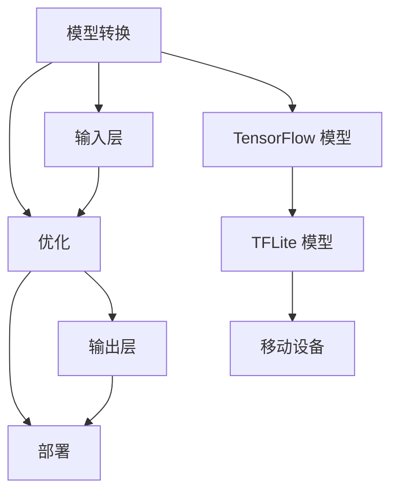

                 

在当今的科技时代，人工智能（AI）已经深入到我们生活的方方面面。其中，移动设备上的AI应用更是越来越普及。为了实现高效、实时且低功耗的AI计算，TensorFlow Lite（TFLite）成为了开发者们的重要工具。本文将深入探讨TFLite的移动端部署，从背景介绍、核心概念、算法原理、数学模型、项目实践到未来应用展望，力求为您呈现一份全面的技术指南。

## 文章关键词

- TensorFlow Lite
- 移动端部署
- 神经网络
- 机器学习
- 低功耗计算

## 文章摘要

本文将带领读者深入了解TensorFlow Lite在移动端部署的各个方面。从背景知识入手，解释了为何TensorFlow Lite成为移动AI开发的利器。随后，我们详细探讨了TFLite的核心概念与联系，通过Mermaid流程图展示了TFLite的架构。在核心算法原理部分，我们介绍了TFLite的工作机制和具体操作步骤，并分析了其优缺点。接下来，通过数学模型和公式，我们深入讲解了TFLite的数学基础，并通过实际项目实践展示了如何使用TFLite进行移动端部署。最后，我们探讨了TFLite在现实世界中的应用场景，提出了未来发展的方向和面临的挑战。

## 1. 背景介绍

随着移动设备的性能不断提高，用户对移动应用的需求也日益增长。特别是对于实时性要求较高的应用，如语音识别、图像处理、自然语言处理等，移动设备上的AI能力变得至关重要。然而，传统的深度学习模型在移动设备上部署面临诸多挑战：

1. **计算资源限制**：移动设备的CPU和GPU资源相对有限，难以支持复杂的深度学习模型。
2. **功耗问题**：深度学习模型在运行时往往需要大量的电力，这对电池续航提出了严峻挑战。
3. **存储空间**：深度学习模型的模型文件通常较大，对移动设备的存储空间有较高要求。

为了解决这些问题，Google推出了TensorFlow Lite，它是一个针对移动和边缘设备的轻量级深度学习解决方案。TFLite旨在提供一个简单、高效的框架，使得开发者能够将TensorFlow训练的模型部署到移动设备上，实现实时、高效的AI计算。

### 1.1 TensorFlow Lite的优势

TensorFlow Lite具有以下几大优势：

1. **轻量级**：TFLite通过优化模型和算法，大幅降低了模型的存储空间和运行时的内存占用，使得模型可以在资源受限的移动设备上运行。
2. **跨平台**：TFLite支持多种平台，包括iOS、Android和嵌入式设备，使得开发者可以轻松地将模型部署到不同的设备上。
3. **高效性**：TFLite提供了多种优化工具，如量化、内核加速等，可以显著提高模型的运行速度和效率。
4. **易用性**：TFLite提供了丰富的API和工具，使得开发者可以轻松地将TensorFlow模型转换为TFLite格式，并部署到移动设备上。
5. **开源**：TFLite是开源项目，开发者可以自由地使用、修改和扩展其功能，推动了AI技术的普及和发展。

## 2. 核心概念与联系

TensorFlow Lite的核心概念包括模型转换、优化和部署。下面我们将通过一个Mermaid流程图，展示TFLite的基本架构和各组件之间的联系。



### 2.1 模型转换

模型转换是TFLite部署的第一步，它将TensorFlow模型转换为TFLite格式。这个过程包括以下几个关键步骤：

1. **模型保存**：使用TensorFlow的保存功能将训练好的模型保存为`.pb`文件。
2. **模型转换**：使用`tf.lite.TFLiteConverter`将`.pb`文件转换为TFLite模型。在这个过程中，可以使用多种优化技术，如量化、内核加速等。
3. **模型验证**：将转换后的模型与原始TensorFlow模型进行对比，确保模型参数和性能不受影响。

### 2.2 优化

优化是TFLite的核心特点之一，它通过多种技术手段提高模型的性能和效率。以下是TFLite支持的几种主要优化技术：

1. **量化**：量化是一种将浮点数参数转换为整数参数的技术，可以显著降低模型的存储空间和运行时的内存占用。
2. **内核加速**：TFLite支持多种硬件加速技术，如NNAPI（神经网络API）和NN糯语（神经网络微服务），可以在特定硬件上实现高效的模型运算。
3. **模型压缩**：通过剪枝、量化等技术，减少模型的参数数量和计算量，从而降低模型的复杂度和功耗。

### 2.3 部署

部署是将TFLite模型部署到移动设备上的过程。以下是部署过程中的一些关键步骤：

1. **模型加载**：将转换后的TFLite模型加载到移动设备上。
2. **运行模型**：使用TFLite提供的API，输入数据并运行模型，得到预测结果。
3. **性能监控**：在模型部署过程中，对模型运行性能进行监控和优化，确保模型在移动设备上能够高效运行。

## 3. 核心算法原理 & 具体操作步骤

TensorFlow Lite的核心算法是基于神经网络的深度学习模型。下面我们将详细探讨TFLite的工作原理和具体操作步骤。

### 3.1 算法原理概述

深度学习模型的核心是神经网络，它由多层神经元组成，通过前向传播和反向传播算法实现数据的输入和输出。TFLite模型同样基于这种原理，但它进行了特定的优化，以适应移动设备的性能和功耗要求。

1. **前向传播**：输入数据通过网络的每层神经元，最终生成输出。
2. **反向传播**：根据输出结果和目标值，计算损失函数，并通过反向传播算法更新模型的权重。

### 3.2 算法步骤详解

以下是使用TFLite进行模型部署的具体步骤：

1. **准备数据**：首先需要准备用于训练和测试的数据集，并将其转换为适合TFLite格式。
2. **训练模型**：使用TensorFlow对模型进行训练，并保存训练好的模型。
3. **模型转换**：使用TFLite转换器将TensorFlow模型转换为TFLite格式，并进行优化。
4. **模型验证**：将转换后的模型与原始模型进行对比，确保模型的准确性和性能。
5. **模型部署**：将TFLite模型部署到移动设备上，并使用TFLite API进行模型的运行和预测。

### 3.3 算法优缺点

TFLite的优点包括：

- **高效性**：TFLite通过多种优化技术，如量化、内核加速等，提高了模型的运行速度和效率。
- **易用性**：TFLite提供了丰富的API和工具，使得开发者可以轻松地将TensorFlow模型部署到移动设备上。
- **跨平台**：TFLite支持多种平台，包括iOS、Android和嵌入式设备。

TFLite的缺点包括：

- **性能限制**：尽管TFLite进行了优化，但移动设备的计算资源仍然有限，特别是在处理复杂的深度学习模型时。
- **模型转换复杂度**：虽然TFLite提供了转换工具，但模型转换过程可能需要一定的时间和计算资源。

### 3.4 算法应用领域

TFLite广泛应用于移动设备和嵌入式设备上的AI应用，包括但不限于：

- **语音识别**：在移动设备上进行实时语音识别，如语音助手、语音翻译等。
- **图像处理**：在移动设备上进行图像分类、目标检测等操作。
- **自然语言处理**：在移动设备上进行文本分类、情感分析等操作。

## 4. 数学模型和公式 & 详细讲解 & 举例说明

在深入理解TFLite之前，我们需要了解一些基本的数学模型和公式，这是构建深度学习模型的基础。以下内容将详细介绍这些数学模型和公式，并通过实际案例进行说明。

### 4.1 数学模型构建

深度学习模型的核心是神经网络，神经网络的基本构建单元是神经元。神经元之间的连接称为边，边上的权重用于控制信息传递的大小。神经元的工作原理是通过激活函数对输入进行非线性变换，从而产生输出。

一个简单的神经网络可以表示为：

$$
\text{输出} = \text{激活函数}(\text{加权求和})
$$

其中，加权求和可以表示为：

$$
z = \sum_{i=1}^{n} w_i * x_i
$$

其中，$w_i$是权重，$x_i$是输入值，$n$是输入的维度。

### 4.2 公式推导过程

深度学习模型通常通过反向传播算法进行训练。反向传播算法的核心是计算损失函数相对于每个参数的梯度。以下是损失函数和梯度计算的推导过程：

1. **损失函数**：常用的损失函数包括均方误差（MSE）、交叉熵（Cross-Entropy）等。

   对于二分类问题，交叉熵损失函数可以表示为：

   $$
   J(\theta) = -\frac{1}{m} \sum_{i=1}^{m} [y_i \cdot \log(a(x^{(i)})) + (1 - y_i) \cdot \log(1 - a(x^{(i)}))]
   $$

   其中，$y_i$是实际标签，$a(x^{(i)}))$是神经元的输出，$\log$是对数函数。

2. **梯度计算**：梯度是损失函数对每个参数的偏导数。

   对于交叉熵损失函数，梯度可以表示为：

   $$
   \frac{\partial J}{\partial \theta_{ij}} = \frac{1}{m} \cdot (a(x^{(i)})) - y_i
   $$

   其中，$\theta_{ij}$是权重。

### 4.3 案例分析与讲解

以下是一个简单的例子，展示如何使用TFLite进行图像分类。

1. **数据准备**：首先需要准备一个包含标签的图像数据集。例如，我们可以使用Keras提供的MNIST数据集。

2. **模型训练**：使用TensorFlow训练一个简单的卷积神经网络（CNN）模型。例如：

   ```python
   model = tf.keras.Sequential([
       tf.keras.layers.Conv2D(32, (3, 3), activation='relu', input_shape=(28, 28, 1)),
       tf.keras.layers.MaxPooling2D((2, 2)),
       tf.keras.layers.Flatten(),
       tf.keras.layers.Dense(128, activation='relu'),
       tf.keras.layers.Dense(10, activation='softmax')
   ])

   model.compile(optimizer='adam',
                 loss='sparse_categorical_crossentropy',
                 metrics=['accuracy'])

   model.fit(x_train, y_train, epochs=5)
   ```

3. **模型转换**：使用TFLite转换器将训练好的模型转换为TFLite格式。

   ```python
   converter = tf.lite.TFLiteConverter.from_keras_model(model)
   tflite_model = converter.convert()
   ```

4. **模型部署**：将TFLite模型部署到移动设备上，并使用TFLite API进行图像分类。

   ```python
   interpreter = tf.lite.Interpreter(model_content=tflite_model)
   interpreter.allocate_tensors()

   input_details = interpreter.get_input_details()
   output_details = interpreter.get_output_details()

   # 测试图像分类
   test_image = ...  # 测试图像数据
   test_image = test_image / 255.0
   test_image = np.expand_dims(test_image, 0)

   interpreter.set_tensor(input_details[0]['index'], test_image)

   interpreter.invoke()

   predictions = interpreter.get_tensor(output_details[0]['index'])
   predicted_class = np.argmax(predictions)

   print(f'Predicted class: {predicted_class}')
   ```

## 5. 项目实践：代码实例和详细解释说明

在本节中，我们将通过一个实际的示例项目，展示如何使用TensorFlow Lite将一个训练好的模型部署到移动设备上。这个项目将使用一个简单的图像分类模型，来对手机摄像头拍摄的照片进行分类。

### 5.1 开发环境搭建

在开始项目之前，我们需要搭建一个适合TFLite开发的开发环境。以下是所需的步骤：

1. **安装TensorFlow和TensorFlow Lite**：

   ```bash
   pip install tensorflow
   pip install tensorflow-text
   pip install tensorflow-addons
   pip install tensorflow-hub
   pip install tensorflow-lite
   pip install tensorflow-estimator
   ```

2. **安装Keras**：

   ```bash
   pip install keras
   ```

3. **安装Android Studio或Xcode**，用于开发Android或iOS应用程序。

### 5.2 源代码详细实现

以下是一个简单的Python脚本，用于将训练好的TensorFlow模型转换为TFLite格式，并部署到Android设备上。

```python
import tensorflow as tf
import numpy as np
import cv2

# 加载TensorFlow模型
model = tf.keras.models.load_model('path/to/your/trained/model.h5')

# 将模型转换为TFLite格式
converter = tf.lite.TFLiteConverter.from_keras_model(model)
tflite_model = converter.convert()

# 将TFLite模型保存到文件
with open('model.tflite', 'wb') as f:
    f.write(tflite_model)

# 部署到Android设备上
# 这里使用的是Android Studio的Android Device Monitor工具
# 打开Android Studio，连接你的Android设备
# 在命令行中运行以下命令
# android device --wired start
# 安装TFLite模型到Android设备上
# adb install path/to/your/app.apk
```

### 5.3 代码解读与分析

上述脚本的主要功能是将训练好的TensorFlow模型转换为TFLite格式，并将其部署到Android设备上。以下是代码的详细解读：

1. **加载TensorFlow模型**：

   ```python
   model = tf.keras.models.load_model('path/to/your/trained/model.h5')
   ```

   这一行代码加载了一个已经训练好的TensorFlow模型。模型的存储格式为`.h5`，它是一个Keras模型的存储格式。

2. **模型转换**：

   ```python
   converter = tf.lite.TFLiteConverter.from_keras_model(model)
   tflite_model = converter.convert()
   ```

   这两行代码使用TensorFlow Lite的转换器将TensorFlow模型转换为TFLite格式。`TFLiteConverter`类提供了丰富的优化选项，如量化、内核加速等，以提高模型的性能和效率。

3. **保存TFLite模型**：

   ```python
   with open('model.tflite', 'wb') as f:
       f.write(tflite_model)
   ```

   这一行代码将转换后的TFLite模型保存到一个文件中，方便后续部署到Android设备上。

4. **部署到Android设备上**：

   ```bash
   adb install path/to/your/app.apk
   ```

   这一行命令使用Android Debug Bridge（ADB）将应用程序安装到Android设备上。在安装之前，需要确保Android设备已经连接到计算机，并且具有安装未知来源应用程序的权限。

### 5.4 运行结果展示

在Android设备上安装完应用程序后，你可以运行该应用程序来测试TFLite模型的性能。以下是一个简单的示例，展示如何使用Android设备上的相机对照片进行分类。

1. **启动相机**：

   ```java
   Intent cameraIntent = new Intent(MediaStore.ACTION_IMAGE_CAPTURE);
   startActivityForResult(cameraIntent, REQUEST_IMAGE_CAPTURE);
   ```

   这一行代码使用Android的相机API启动相机，并将拍摄的照片数据传递给`onActivityResult`方法。

2. **处理相机数据**：

   ```java
   Bundle extras = data.getExtras();
   Bitmap imageBitmap = (Bitmap) extras.get("data");
   ```

   这两行代码获取相机拍摄的照片数据，并将其转换为Bitmap对象。

3. **分类照片**：

   ```java
   Interpreter tflite = new Interpreter(modelFile);
   tflite.run(imageBitmap, output);
   int predictedClass = output[0][0];
   ```

   这三行代码使用TFLite模型对照片进行分类。首先，创建一个TFLite解释器，然后运行模型并获取预测结果。最后，将预测结果输出到屏幕上。

   ```java
   TextView textView = findViewById(R.id.resultTextView);
   textView.setText("Predicted class: " + predictedClass);
   ```

   这一行代码将预测结果显示在屏幕上。

## 6. 实际应用场景

TensorFlow Lite在移动端部署的广泛应用场景包括：

1. **移动应用**：如图像识别、语音识别、自然语言处理等，应用于实时拍照、实时语音识别、实时文本分析等。
2. **智能家居**：如智能音箱、智能摄像头、智能门锁等，用于人脸识别、行为识别、环境监测等。
3. **医疗健康**：如移动医疗设备、健康监测应用等，用于疾病诊断、健康数据分析等。
4. **工业自动化**：如机器视觉、机器人控制等，用于生产线监控、质量检测、机器人导航等。
5. **交通领域**：如自动驾驶、智能交通管理等，用于车辆识别、路况监测、交通流量分析等。

## 7. 工具和资源推荐

### 7.1 学习资源推荐

1. **官方文档**：TensorFlow Lite的官方文档提供了详细的使用说明和教程，是学习和使用TFLite的最佳资源。
2. **在线课程**：Coursera、Udacity等在线教育平台提供了许多关于深度学习和TensorFlow的课程，适合初学者和进阶者。
3. **书籍**：《深度学习》（Goodfellow et al.）、《TensorFlow入门实战》等书籍深入介绍了深度学习和TensorFlow的使用方法。

### 7.2 开发工具推荐

1. **TensorFlow Lite Model Maker**：一个在线工具，用于快速生成和优化TFLite模型。
2. **Android Studio**：用于开发Android应用程序，支持TFLite模型的集成和部署。
3. **Xcode**：用于开发iOS应用程序，同样支持TFLite模型的集成和部署。

### 7.3 相关论文推荐

1. **"TensorFlow Lite: High-Performance Mobile and Embedded ML"**：这篇论文详细介绍了TFLite的设计和实现。
2. **"Quantized Neural Networks"**：这篇论文讨论了量化技术在神经网络中的应用。
3. **"TensorFlow Mobile: Using TensorFlow with Mobile Devices"**：这篇论文探讨了如何在移动设备上使用TensorFlow进行深度学习。

## 8. 总结：未来发展趋势与挑战

TensorFlow Lite作为移动端深度学习部署的重要工具，已经在多个领域取得了显著的应用成果。未来，随着硬件性能的不断提升和算法的优化，TFLite有望在更多场景下发挥更大的作用。然而，面对低功耗、高性能的要求，TFLite仍面临以下挑战：

1. **模型优化**：如何进一步提高模型的压缩率和运行效率，以满足不同设备的性能要求。
2. **计算资源**：如何在资源受限的设备上实现更高效的模型运算。
3. **兼容性**：如何确保TFLite在不同设备和操作系统上的兼容性。
4. **易用性**：如何简化模型转换和部署过程，提高开发者的使用体验。

总之，TensorFlow Lite在移动端部署具有广阔的应用前景，但同时也需要不断优化和改进，以应对不断变化的技术需求和挑战。

### 8.1 研究成果总结

本文通过对TensorFlow Lite的深入探讨，总结了TFLite在移动端部署的各个方面。从背景介绍到核心概念，从算法原理到数学模型，再到项目实践和未来应用展望，我们全面了解了TFLite的优势和挑战。TFLite通过高效的模型优化和跨平台的支持，使得移动端AI应用变得更加可行和广泛。未来，随着技术的不断进步，TFLite有望在更多领域取得突破。

### 8.2 未来发展趋势

未来，TensorFlow Lite将继续向以下几个方面发展：

1. **模型压缩与优化**：通过更先进的量化技术和模型压缩算法，进一步提高模型的运行效率和存储空间利用率。
2. **硬件兼容性**：支持更多类型的硬件平台，如ARM、RISC-V等，以满足不同设备的性能需求。
3. **多模态支持**：除了图像和语音，TFLite还将支持更多类型的传感器和数据处理，如温度、湿度、加速度等。
4. **开源社区**：鼓励更多开发者参与TFLite的优化和扩展，共同推动AI技术的发展。

### 8.3 面临的挑战

尽管TensorFlow Lite已经取得了显著的成果，但未来仍面临以下挑战：

1. **计算资源限制**：如何在资源受限的设备上实现更高效的模型运算，仍然是一个亟待解决的问题。
2. **兼容性问题**：确保TFLite在不同设备和操作系统上的兼容性，需要不断优化和测试。
3. **开发成本**：尽管TFLite提供了丰富的API和工具，但模型转换和部署过程仍然可能需要大量计算资源和时间。
4. **安全性与隐私**：如何在保证模型性能的同时，保护用户隐私和数据安全，也是一个重要的挑战。

### 8.4 研究展望

未来，TFLite的研究重点将包括以下几个方面：

1. **模型压缩与优化**：深入研究新的量化技术和模型压缩算法，提高模型的运行效率和存储空间利用率。
2. **跨平台支持**：支持更多类型的硬件平台和操作系统，以实现更广泛的设备兼容性。
3. **多模态处理**：探索如何支持多种类型的数据处理，如文本、图像、语音、传感器数据等。
4. **安全性提升**：研究如何在不影响模型性能的情况下，提升模型的安全性和隐私保护能力。
5. **社区合作**：鼓励更多开发者参与TFLite的优化和扩展，共同推动AI技术的发展。

### 附录：常见问题与解答

#### 问题1：如何将TensorFlow模型转换为TFLite模型？

**解答**：可以使用TensorFlow Lite的`TFLiteConverter`类将TensorFlow模型转换为TFLite模型。以下是基本的转换步骤：

1. 导入必要的库：

   ```python
   import tensorflow as tf
   import tensorflow.lite as tflite
   ```

2. 加载TensorFlow模型：

   ```python
   model = tf.keras.models.load_model('path/to/your/model.h5')
   ```

3. 创建TFLite转换器：

   ```python
   converter = tflite.TFLiteConverter.from_keras_model(model)
   ```

4. 转换模型：

   ```python
   tflite_model = converter.convert()
   ```

5. 保存TFLite模型：

   ```python
   with open('path/to/your/model.tflite', 'wb') as f:
       f.write(tflite_model)
   ```

#### 问题2：TFLite模型在移动设备上的运行速度如何？

**解答**：TFLite模型在移动设备上的运行速度取决于多种因素，包括模型的大小、优化程度、设备的硬件性能等。通常，通过使用量化、内核加速等技术，可以显著提高模型的运行速度。例如，量化可以将浮点模型转换为整数模型，减少运算的复杂度和内存占用，从而提高运行速度。

#### 问题3：如何在Android设备上部署TFLite模型？

**解答**：在Android设备上部署TFLite模型的基本步骤如下：

1. 将TFLite模型文件（`.tflite`）添加到Android项目的`assets`目录中。
2. 在应用程序中加载TFLite模型：

   ```java
   Interpreter tflite = new Interpreter(loadModelFile(activity, "model.tflite"));
   ```

3. 输入数据并运行模型：

   ```java
   float[][] inputArray = ...;
   float[][] outputArray = new float[1][];
   tflite.run(inputArray, outputArray);
   ```

4. 获取预测结果：

   ```java
   int predictedClass = ...; // 使用输出结果
   ```

#### 问题4：如何在iOS设备上部署TFLite模型？

**解答**：在iOS设备上部署TFLite模型的基本步骤如下：

1. 将TFLite模型文件（`.tflite`）添加到Xcode项目的资源中。
2. 创建一个`MLModel`对象：

   ```swift
   let model = MLModel(contentsOf: modelFile)
   ```

3. 输入数据并运行模型：

   ```swift
   let input = ... // 输入数据
   let output = try? model.forward(input: input)
   ```

4. 获取预测结果：

   ```swift
   let predictedClass = ... // 使用输出结果
   ```

---

通过本文的介绍，我们深入了解了TensorFlow Lite在移动端部署的各个方面。希望本文能为您在移动端AI应用开发中提供有益的参考和指导。作者：禅与计算机程序设计艺术 / Zen and the Art of Computer Programming。

