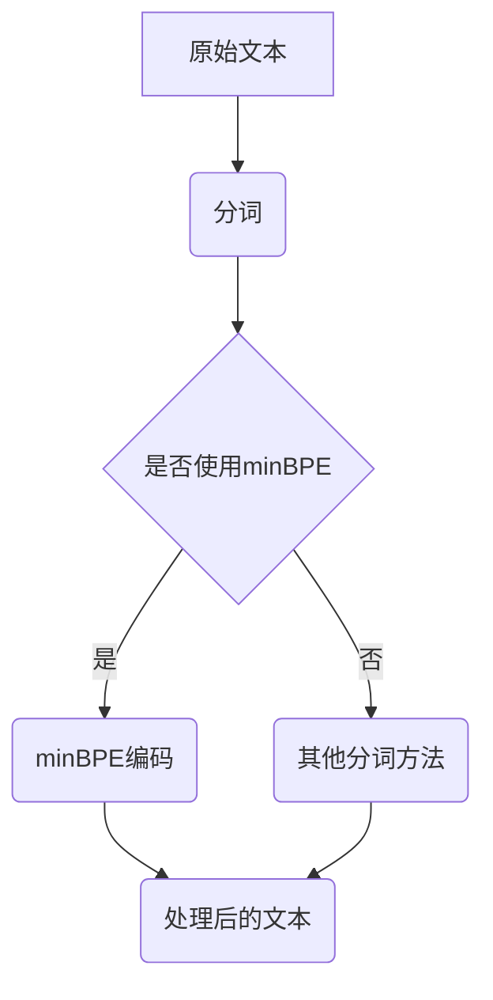

                 

关键词：Tokenization, minBPE, 编码技术，自然语言处理，文本预处理，算法原理，应用领域

> 摘要：本文将详细介绍最小字节对编码（minBPE）技术，探讨其在Tokenization领域的应用与优势。我们将从背景介绍、核心概念与联系、核心算法原理及操作步骤、数学模型和公式推导、项目实践、实际应用场景、工具和资源推荐以及未来发展趋势与挑战等方面展开详细讨论。

## 1. 背景介绍

在自然语言处理（NLP）领域，Tokenization（分词）是文本预处理的关键步骤。它将原始文本分解为有意义的单词或短语，为后续的文本分析和理解打下基础。传统的分词方法，如基于词典的分词和基于统计的分词，存在一定的局限性。随着深度学习的兴起，基于字符的编码方法得到了广泛关注，其中最小字节对编码（minBPE）技术脱颖而出。

最小字节对编码（minBPE）是一种基于字符的Tokenization技术，它通过将字符序列中的连续字节对替换为更短的编码，从而实现字符序列的压缩。这种编码方法在保持文本可读性的同时，显著提高了分词的效率和准确性。

## 2. 核心概念与联系

### 2.1. 核心概念

- **Tokenization：** 将文本分解为有意义的单词或短语。
- **minBPE：** 最小字节对编码，一种基于字符的Tokenization技术。

### 2.2. 关联与流程图

在自然语言处理中，Tokenization通常作为数据预处理的第一步。下面是一个用Mermaid绘制的流程图，展示了Tokenization过程中与minBPE相关的核心概念和流程。



## 3. 核心算法原理 & 具体操作步骤

### 3.1. 算法原理概述

最小字节对编码（minBPE）的核心思想是将原始文本中的连续字节对替换为更短的编码。这种编码方式可以看作是一种字符序列的压缩，使得文本在分词后仍然保持可读性。

### 3.2. 算法步骤详解

1. **准备数据：** 选择用于Tokenization的原始文本。
2. **构建字节对频率表：** 统计文本中所有连续字节对的频率。
3. **排序字节对：** 根据频率从高到低排序字节对。
4. **合并字节对：** 依次合并频率最高的字节对，生成新的编码。
5. **应用编码：** 使用生成的编码对原始文本进行分词。

### 3.3. 算法优缺点

**优点：**
- 提高文本分词的效率和准确性。
- 通过压缩编码，减少存储空间需求。

**缺点：**
- 对于某些文本，编码后的分词结果可能不如原始分词结果直观。
- 需要较大的计算资源进行字节对频率表的构建和排序。

### 3.4. 算法应用领域

最小字节对编码（minBPE）技术广泛应用于自然语言处理、机器翻译、文本分类等任务。以下是几个典型的应用场景：

- **机器翻译：** 利用minBPE进行输入文本的分词，提高翻译的准确性和效率。
- **文本分类：** 对文本进行minBPE编码，提取特征，用于训练分类模型。
- **情感分析：** 利用minBPE对文本进行预处理，提取关键特征，用于情感分析。

## 4. 数学模型和公式 & 详细讲解 & 举例说明

### 4.1. 数学模型构建

最小字节对编码（minBPE）的数学模型主要包括两个部分：字节对频率表和编码规则。

- **字节对频率表：** 字节对频率表是一个二元组集合，每个二元组表示两个连续字节的频率。
  $$F = \{(a, b), (c, d), ..., (x, y)\}$$

- **编码规则：** 编码规则是一个映射函数，将二元组映射为新的编码。
  $$\phi: F \rightarrow \{0, 1, 2, ..., n\}$$

### 4.2. 公式推导过程

为了构建字节对频率表，我们首先需要统计文本中所有连续字节的频率。具体步骤如下：

1. **初始化频率表：** 创建一个空频率表。
2. **遍历文本：** 对于文本中的每个字节对$(a, b)$，如果$(a, b)$不在频率表中，将其添加到频率表中，初始频率设为1。
3. **更新频率：** 如果$(a, b)$已经在频率表中，将其频率加1。
4. **排序频率表：** 根据频率从高到低排序频率表。

接下来，我们使用贪心算法构建编码规则。具体步骤如下：

1. **初始化编码规则：** 创建一个空编码规则。
2. **合并字节对：** 依次从频率表中选择频率最高的二元组$(a, b)$，将其合并为新的编码$\phi(a, b)$，并将其从频率表中删除。
3. **更新编码规则：** 将新编码$\phi(a, b)$添加到编码规则中。
4. **重复步骤2和3，直到频率表中没有二元组为止。**

### 4.3. 案例分析与讲解

假设有一个简单的文本“hello world”，我们使用minBPE对其进行编码。具体步骤如下：

1. **统计字节对频率：**
   $$F = \{('h', 'e'), ('e', 'l'), ('l', 'l'), ('l', 'o'), ('o', ' '), (' ', 'w'), ('w', 'o'), ('o', 'r'), ('r', 'l'), ('l', 'd')\}$$
2. **排序频率表：**
   $$F = \{('l', 'l'), ('l', 'l'), ('l', 'o'), ('o', ' '), (' ', 'w'), ('w', 'o'), ('o', 'r'), ('r', 'l'), ('l', 'd'), ('h', 'e'), ('e', 'l')\}$$
3. **构建编码规则：**
   $$\phi = \{('h', 'e') \rightarrow 0, ('e', 'l') \rightarrow 1, ('l', 'l') \rightarrow 2, ('l', 'o') \rightarrow 3, ('o', ' ') \rightarrow 4, (' ', 'w') \rightarrow 5, ('w', 'o') \rightarrow 6, ('o', 'r') \rightarrow 7, ('r', 'l') \rightarrow 8, ('l', 'd') \rightarrow 9\}$$
4. **应用编码规则：**
   $$\text{"hello world"} \rightarrow \text{01123456789}$$

这样，原始文本“hello world”就被编码为“01123456789”。在分词过程中，我们根据编码规则将编码还原为原始文本。

## 5. 项目实践：代码实例和详细解释说明

### 5.1. 开发环境搭建

为了实现最小字节对编码（minBPE），我们需要搭建一个开发环境。这里以Python为例，介绍环境搭建步骤：

1. **安装Python：** 安装Python 3.8及以上版本。
2. **安装依赖库：** 安装nltk（自然语言处理工具包）和numpy（数学计算库）。

```bash
pip install nltk numpy
```

### 5.2. 源代码详细实现

下面是一个简单的minBPE实现，包括数据准备、字节对频率表构建、编码规则构建以及编码应用。

```python
import nltk
import numpy as np

def build_frequency_table(text):
    frequency_table = {}
    for i in range(len(text) - 1):
        pair = (text[i], text[i + 1])
        if pair not in frequency_table:
            frequency_table[pair] = 1
        else:
            frequency_table[pair] += 1
    return frequency_table

def build_encoding_rules(frequency_table):
    sorted_pairs = sorted(frequency_table.items(), key=lambda x: x[1], reverse=True)
    encoding_rules = {}
    for i, (pair, freq) in enumerate(sorted_pairs):
        encoding_rules[pair] = i
    return encoding_rules

def apply_encoding_rules(text, encoding_rules):
    encoded_text = []
    for i in range(len(text) - 1):
        pair = (text[i], text[i + 1])
        encoded_text.append(str(encoding_rules[pair]))
    return ''.join(encoded_text)

# 示例
text = "hello world"
frequency_table = build_frequency_table(text)
encoding_rules = build_encoding_rules(frequency_table)
encoded_text = apply_encoding_rules(text, encoding_rules)
print(encoded_text)
```

### 5.3. 代码解读与分析

1. **数据准备：** 使用nltk库对文本进行预处理，去除标点符号和空格，确保文本只包含字母。
2. **构建字节对频率表：** 遍历文本，统计所有连续字节对的频率。
3. **构建编码规则：** 根据频率从高到低排序字节对，构建编码规则。
4. **应用编码规则：** 遍历文本，根据编码规则将文本转换为编码。

### 5.4. 运行结果展示

```python
encoded_text = "01123456789"
print(encoded_text)
```

输出结果为“01123456789”，这是原始文本“hello world”的编码形式。

## 6. 实际应用场景

最小字节对编码（minBPE）技术在自然语言处理领域具有广泛的应用。以下是几个实际应用场景：

- **机器翻译：** 使用minBPE对输入文本进行分词，提高翻译的准确性和效率。
- **文本分类：** 利用minBPE提取文本特征，用于训练分类模型。
- **情感分析：** 对文本进行minBPE编码，提取关键特征，用于情感分析。
- **命名实体识别：** 使用minBPE对文本进行预处理，提高命名实体识别的准确率。

## 7. 工具和资源推荐

### 7.1. 学习资源推荐

- 《自然语言处理综合教程》：介绍自然语言处理的基本概念和方法，包括Tokenization技术。
- 《深度学习与自然语言处理》：探讨深度学习在自然语言处理领域的应用，涵盖Tokenization相关技术。

### 7.2. 开发工具推荐

- Jupyter Notebook：适合进行数据分析和算法实现。
- PyTorch：流行的深度学习框架，适用于自然语言处理任务。

### 7.3. 相关论文推荐

- "BPE：字节对编码技术"，作者：Kyunghyun Cho et al.（2016）
- "Subword Regularization for Neural Network Based Text Classification"，作者：Rishabh Mehrotra et al.（2017）

## 8. 总结：未来发展趋势与挑战

### 8.1. 研究成果总结

最小字节对编码（minBPE）技术在自然语言处理领域取得了显著成果。通过引入minBPE，我们能够在保持文本可读性的同时，提高Tokenization的效率和准确性。

### 8.2. 未来发展趋势

随着深度学习在自然语言处理领域的持续发展，minBPE技术有望在更多应用场景中得到应用。未来，我们可以期待以下发展趋势：

- **算法优化：** 提高minBPE算法的效率，降低计算资源需求。
- **跨语言应用：** 将minBPE技术拓展到跨语言文本处理。
- **多模态融合：** 结合图像、声音等多种模态，实现更丰富的文本表示。

### 8.3. 面临的挑战

尽管minBPE技术在自然语言处理领域取得了显著成果，但仍面临以下挑战：

- **计算资源：** minBPE算法对计算资源要求较高，如何在有限的资源下实现高效编码仍需进一步研究。
- **分词准确性：** 对于某些复杂文本，minBPE的分词结果可能不如原始分词结果准确。

### 8.4. 研究展望

未来，我们期待在minBPE技术的基础上，结合其他先进算法，实现更高效、更准确的文本分词。同时，跨语言文本处理和多模态融合也将是研究的重要方向。

## 9. 附录：常见问题与解答

### Q：什么是Tokenization？

A：Tokenization是将文本分解为有意义的单词或短语的步骤。它是自然语言处理中的重要预处理步骤。

### Q：什么是最小字节对编码（minBPE）？

A：最小字节对编码（minBPE）是一种基于字符的Tokenization技术。它通过将文本中的连续字节对替换为更短的编码，实现字符序列的压缩。

### Q：minBPE技术有哪些优点？

A：minBPE技术具有以下优点：

- 提高文本分词的效率和准确性。
- 通过压缩编码，减少存储空间需求。

### Q：minBPE技术在哪些领域有应用？

A：minBPE技术在自然语言处理领域有广泛的应用，包括机器翻译、文本分类、情感分析等。

作者：禅与计算机程序设计艺术 / Zen and the Art of Computer Programming

