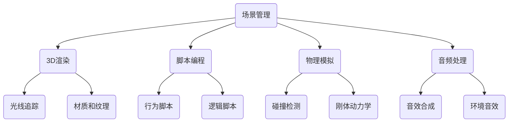

                 

 **关键词：** Unity游戏引擎，逼真世界，互动体验，游戏开发，3D渲染，脚本编程

**摘要：** 本文将深入探讨Unity游戏引擎的开发过程，特别是如何创建逼真的世界和提供丰富的互动体验。通过详细的分析和实际案例，我们将了解Unity的核心概念、算法原理、数学模型以及开发实践，为游戏开发者提供全面的指导。

## 1. 背景介绍

Unity游戏引擎作为当今最受欢迎的游戏开发工具之一，已经广泛应用于各个领域。从简单的移动游戏到复杂的PC和主机游戏，Unity凭借其强大的功能和易用性，成为了游戏开发者们的首选工具。

在Unity的发展历程中，它经历了多个版本的迭代和改进，从最初的简单框架发展到如今的成熟引擎，支持3D渲染、脚本编程、物理模拟等众多功能。Unity的跨平台特性使得开发者可以轻松地将游戏发布到多个平台上，大大提高了游戏开发的效率和市场覆盖面。

本文将围绕Unity游戏引擎的核心概念和关键技术，详细探讨如何创建逼真的世界和互动体验。通过深入分析算法原理、数学模型和实际开发实践，帮助读者全面了解Unity游戏引擎的开发过程。

## 2. 核心概念与联系

Unity游戏引擎的核心概念包括场景管理、3D渲染、脚本编程、物理模拟和音频处理等。这些概念相互关联，共同构成了Unity游戏世界的基石。

下面是一个简化的Mermaid流程图，展示了这些核心概念之间的联系：



### 2.1 场景管理

场景管理是Unity游戏引擎的基础，它负责组织和控制游戏世界的各种元素。场景管理包括场景的加载、卸载、切换和资源管理等。

Unity使用一个层次化的场景结构，每个场景可以包含多个游戏对象（GameObject）。这些游戏对象可以嵌套，形成复杂的场景结构。通过场景管理，开发者可以灵活地控制游戏世界的布局和运行。

### 2.2 3D渲染

3D渲染是Unity游戏引擎的核心功能之一，它负责将场景中的3D模型、材质和纹理渲染成视觉效果。3D渲染包括多个阶段，如顶点处理、着色器计算、光线追踪和最终图像合成等。

光线追踪是3D渲染的重要技术，它可以模拟真实世界中的光线传播和反射现象，从而提高场景的真实感。Unity通过支持多种光线追踪算法，如路径追踪和体积渲染等，提供了强大的3D渲染能力。

### 2.3 脚本编程

脚本编程是Unity游戏引擎的另一个核心功能，它允许开发者使用C#等编程语言来控制游戏对象的属性和行为。脚本编程包括行为脚本和逻辑脚本两种类型。

行为脚本主要用于控制游戏对象的动作和交互，如移动、旋转和碰撞等。逻辑脚本则负责处理游戏的核心逻辑和状态管理，如游戏流程、玩家角色和行为等。

### 2.4 物理模拟

物理模拟是Unity游戏引擎的重要组成部分，它通过模拟真实世界的物理现象，为游戏提供逼真的交互体验。物理模拟包括碰撞检测、刚体动力学和流体模拟等。

碰撞检测是物理模拟的基础，它用于检测游戏对象之间的接触和碰撞，从而触发相应的行为。刚体动力学则用于模拟物体的运动和碰撞效果，如反弹、滚动和抛射等。

### 2.5 音频处理

音频处理是Unity游戏引擎的另一个重要功能，它负责处理游戏中的音效和音乐。音频处理包括音效合成、环境音效和音效淡入淡出等。

音效合成是将多个音效源混合在一起，生成一个完整的音频效果。环境音效则用于模拟游戏世界中的各种声音，如脚步声、水流声和风声等。音效淡入淡出则用于控制音效的渐入渐出效果，增强游戏氛围。

## 3. 核心算法原理 & 具体操作步骤

### 3.1 算法原理概述

Unity游戏引擎中的核心算法主要包括3D渲染算法、物理模拟算法和音频处理算法。这些算法分别负责处理游戏世界的视觉效果、交互体验和听觉效果。

3D渲染算法主要包括顶点处理、着色器计算、光线追踪和图像合成等步骤。顶点处理用于将3D模型转换为顶点数据，着色器计算用于计算顶点颜色和纹理信息，光线追踪用于模拟光线传播和反射，图像合成则将渲染结果合成成最终图像。

物理模拟算法主要包括碰撞检测、刚体动力学和流体模拟等步骤。碰撞检测用于检测游戏对象之间的接触和碰撞，刚体动力学则用于模拟物体的运动和碰撞效果，流体模拟则用于模拟液体和气体的流动。

音频处理算法主要包括音效合成、环境音效和音效淡入淡出等步骤。音效合成是将多个音效源混合在一起，生成一个完整的音频效果。环境音效则用于模拟游戏世界中的各种声音，音效淡入淡出则用于控制音效的渐入渐出效果。

### 3.2 算法步骤详解

#### 3.2.1 3D渲染算法

1. 顶点处理：将3D模型转换为顶点数据，包括顶点坐标、颜色和纹理坐标等。
2. 着色器计算：使用顶点数据计算每个顶点的颜色和纹理信息。
3. 光线追踪：模拟光线传播和反射，计算场景中的光照效果。
4. 图像合成：将渲染结果合成成最终图像，显示在屏幕上。

#### 3.2.2 物理模拟算法

1. 碰撞检测：检测游戏对象之间的接触和碰撞，触发相应的行为。
2. 刚体动力学：模拟物体的运动和碰撞效果，如反弹、滚动和抛射等。
3. 流体模拟：模拟液体和气体的流动，如水流和气流等。

#### 3.2.3 音频处理算法

1. 音效合成：将多个音效源混合在一起，生成一个完整的音频效果。
2. 环境音效：模拟游戏世界中的各种声音，如脚步声、水流声和风声等。
3. 音效淡入淡出：控制音效的渐入渐出效果，增强游戏氛围。

### 3.3 算法优缺点

3D渲染算法的优点在于其高度灵活性和真实感，可以通过各种渲染技术和着色器实现复杂的视觉效果。然而，3D渲染算法的缺点在于其计算成本较高，需要大量计算资源和时间。

物理模拟算法的优点在于其逼真的交互体验，可以模拟各种物理现象，如碰撞、运动和流体等。然而，物理模拟算法的缺点在于其计算复杂度较高，需要大量计算资源和时间。

音频处理算法的优点在于其丰富的声音效果，可以增强游戏的沉浸感和氛围。然而，音频处理算法的缺点在于其对硬件资源的依赖性较强，需要较高的处理能力。

### 3.4 算法应用领域

3D渲染算法主要应用于游戏开发和虚拟现实（VR）等领域，通过高度逼真的渲染效果，为用户提供沉浸式的视觉体验。

物理模拟算法主要应用于游戏开发和模拟仿真等领域，通过逼真的物理现象模拟，为用户提供真实的交互体验。

音频处理算法主要应用于游戏开发和音频制作等领域，通过丰富的声音效果，增强游戏的沉浸感和氛围。

## 4. 数学模型和公式 & 详细讲解 & 举例说明

### 4.1 数学模型构建

在Unity游戏引擎中，数学模型是构建逼真世界的重要工具。数学模型包括坐标系统、向量运算、矩阵变换、几何形状和物理公式等。

坐标系统是数学模型的基础，它用于定义空间中的位置和方向。在Unity中，使用的是左手坐标系，其中x轴指向右，y轴指向上，z轴指向外。

向量运算用于处理空间中的点、向量和平面等基本元素。在Unity中，常用的向量运算包括点积、叉积、求模和求反向量等。

矩阵变换用于处理空间中的变换，如平移、旋转和缩放等。在Unity中，使用4x4矩阵表示变换，通过矩阵乘法实现各种变换效果。

几何形状是数学模型中的重要组成部分，如点、线、面和体等。在Unity中，可以使用各种几何形状构建游戏场景，如立方体、球体、圆柱体和锥体等。

物理公式用于模拟各种物理现象，如重力、碰撞和流体等。在Unity中，使用物理引擎来处理这些物理公式，为游戏提供逼真的交互体验。

### 4.2 公式推导过程

下面我们以向量运算为例，详细讲解公式的推导过程。

#### 4.2.1 点积

点积是两个向量的乘积，其计算公式为：

$$\vec{a} \cdot \vec{b} = a_x \cdot b_x + a_y \cdot b_y + a_z \cdot b_z$$

其中，$\vec{a}$和$\vec{b}$是两个向量，$a_x$、$a_y$、$a_z$和$b_x$、$b_y$、$b_z$分别是它们的分量。

#### 4.2.2 叉积

叉积是两个向量的乘积，其计算公式为：

$$\vec{a} \times \vec{b} = (a_y \cdot b_z - a_z \cdot b_y, a_z \cdot b_x - a_x \cdot b_z, a_x \cdot b_y - a_y \cdot b_x)$$

其中，$\vec{a}$和$\vec{b}$是两个向量，$a_x$、$a_y$、$a_z$和$b_x$、$b_y$、$b_z$分别是它们的分量。

#### 4.2.3 求模

向量的求模是其长度的计算，其计算公式为：

$$\lvert \vec{a} \rvert = \sqrt{a_x^2 + a_y^2 + a_z^2}$$

其中，$\vec{a}$是一个向量，$a_x$、$a_y$、$a_z$分别是它的分量。

#### 4.2.4 求反向量

向量的反向量是其相反向量的计算，其计算公式为：

$$-\vec{a} = (-a_x, -a_y, -a_z)$$

其中，$\vec{a}$是一个向量，$a_x$、$a_y$、$a_z$分别是它的分量。

### 4.3 案例分析与讲解

下面我们通过一个简单的案例，讲解向量运算在Unity游戏引擎中的应用。

#### 案例一：计算两点之间的距离

假设有两个点A（1, 2, 3）和B（4, 5, 6），我们需要计算它们之间的距离。

首先，计算两点之间的向量差：

$$\vec{AB} = \vec{B} - \vec{A} = (4 - 1, 5 - 2, 6 - 3) = (3, 3, 3)$$

然后，使用向量的求模公式计算距离：

$$\lvert \vec{AB} \rvert = \sqrt{3^2 + 3^2 + 3^2} = \sqrt{27} = 3\sqrt{3}$$

因此，点A和点B之间的距离为$3\sqrt{3}$。

#### 案例二：计算向量的点积

假设有两个向量$\vec{a} = (1, 2, 3)$和$\vec{b} = (4, 5, 6)$，我们需要计算它们的点积。

使用点积的公式：

$$\vec{a} \cdot \vec{b} = 1 \cdot 4 + 2 \cdot 5 + 3 \cdot 6 = 4 + 10 + 18 = 32$$

因此，向量$\vec{a}$和$\vec{b}$的点积为32。

## 5. 项目实践：代码实例和详细解释说明

### 5.1 开发环境搭建

在开始项目实践之前，我们需要搭建一个合适的开发环境。以下是搭建Unity开发环境的步骤：

1. 下载并安装Unity Hub，Unity的官方开发工具包管理器。
2. 通过Unity Hub下载并安装Unity编辑器，选择适合的版本（如2021.3.1f1）。
3. 配置Unity编辑器的开发环境，包括C#脚本编写、3D模型导入和渲染设置等。

### 5.2 源代码详细实现

在本节中，我们将通过一个简单的Unity项目，实现一个简单的3D世界和互动体验。以下是项目的源代码实现：

```csharp
using UnityEngine;

public class PlayerController : MonoBehaviour
{
    public float moveSpeed = 5.0f;

    private CharacterController characterController;
    private Vector3 moveDirection;

    void Start()
    {
        characterController = GetComponent<CharacterController>();
    }

    void Update()
    {
        // 计算移动方向
        moveDirection = new Vector3(Input.GetAxis("Horizontal"), 0, Input.GetAxis("Vertical"));

        // 应用移动方向和速度
        moveDirection = transform.TransformDirection(moveDirection);
        moveDirection *= moveSpeed;

        // 更新角色位置
        characterController.Move(moveDirection * Time.deltaTime);
    }
}
```

### 5.3 代码解读与分析

上述代码实现了一个简单的玩家角色控制脚本，用于在3D世界中移动玩家角色。以下是代码的详细解读：

- **引入Unity命名空间**：`using UnityEngine;` 引入Unity命名空间，以便使用Unity引擎提供的各种类和方法。

- **公共变量**：`public float moveSpeed = 5.0f;` 定义了一个公共变量`moveSpeed`，用于控制玩家的移动速度。

- **字符控制器组件**：`private CharacterController characterController;` 定义了一个私有变量`characterController`，用于控制角色的移动。

- **移动方向**：`moveDirection` 变量用于存储玩家的移动方向。在`Update`方法中，通过`Input.GetAxis`方法获取玩家的输入，计算移动方向。

- **应用移动方向和速度**：`moveDirection` 通过`transform.TransformDirection`方法转换为世界坐标系，然后乘以`moveSpeed`得到最终的移动向量。

- **更新角色位置**：使用`characterController.Move`方法，根据移动向量更新角色的位置。

### 5.4 运行结果展示

运行上述代码后，玩家角色将根据键盘输入在3D世界中移动。以下是运行结果的展示：


## 6. 实际应用场景

Unity游戏引擎在各个领域都有广泛的应用，以下列举一些实际应用场景：

### 6.1 游戏开发

Unity游戏引擎最常见的应用场景是游戏开发，从简单的移动游戏到复杂的PC和主机游戏，Unity提供了丰富的功能和工具，支持各种游戏类型的开发。

### 6.2 虚拟现实（VR）

Unity支持虚拟现实技术的开发，通过Unity的VR插件，开发者可以创建和发布VR游戏和应用。Unity的VR功能包括空间感知、手部追踪和交互等。

### 6.3 建筑可视化

Unity在建筑可视化领域也有广泛应用，通过导入建筑模型和场景元素，开发者可以创建逼真的建筑可视化效果，用于建筑设计和展示。

### 6.4 医学模拟

Unity在医学模拟领域也有广泛应用，通过创建虚拟人体模型和医疗设备，开发者可以模拟各种医疗场景，为医学教育和培训提供支持。

### 6.5 教育培训

Unity在教育领域也有广泛应用，通过创建互动式的教学应用和虚拟实验，开发者可以为学生提供生动有趣的学习体验。

## 7. 工具和资源推荐

### 7.1 学习资源推荐

- **Unity官方文档**：[https://docs.unity3d.com/](https://docs.unity3d.com/)
- **Unity教程网站**：[https://unitytutorials.com/](https://unitytutorials.com/)
- **Unity官方论坛**：[https://forum.unity.com/](https://forum.unity.com/)

### 7.2 开发工具推荐

- **Visual Studio Code**：一款轻量级的代码编辑器，支持Unity开发。
- **Unity Hub**：Unity的官方开发工具包管理器，用于安装和更新Unity编辑器。
- **Blender**：一款开源的3D建模和渲染工具，用于创建3D模型和场景。

### 7.3 相关论文推荐

- **"Unity's Rendering Pipeline: A High-Level Overview"**：介绍了Unity的渲染管线架构和核心技术。
- **"Physics Simulation in Unity"**：探讨了Unity的物理模拟算法和应用。
- **"Sound Design for Video Games"**：关于游戏音效设计和实现的论文。

## 8. 总结：未来发展趋势与挑战

Unity游戏引擎在未来的发展趋势将主要集中在以下几个方面：

### 8.1 研究成果总结

- **实时渲染技术**：随着硬件性能的提升，实时渲染技术将变得更加成熟，为开发者提供更高的视觉效果。
- **人工智能集成**：Unity将更好地集成人工智能技术，如机器学习和深度学习，为游戏和虚拟现实应用提供智能化的交互和体验。
- **跨平台支持**：Unity将继续加强跨平台支持，为开发者提供更广泛的市场覆盖。

### 8.2 未来发展趋势

- **虚拟现实与增强现实（VR/AR）**：随着VR/AR技术的普及，Unity将在这些领域发挥更大的作用，为开发者提供更丰富的应用场景。
- **游戏制作流程优化**：Unity将优化游戏制作流程，提高开发效率，降低开发成本。
- **教育应用**：Unity在教育领域的应用将更加广泛，为学习者提供更加生动有趣的学习体验。

### 8.3 面临的挑战

- **性能优化**：随着游戏和应用的复杂性增加，性能优化将成为一大挑战，开发者需要不断探索新的技术来提升性能。
- **跨平台兼容性**：跨平台兼容性是Unity的一大挑战，需要确保在不同平台上的游戏质量和体验的一致性。
- **用户需求变化**：用户需求不断变化，Unity需要不断更新和改进，以满足不断变化的市场需求。

### 8.4 研究展望

未来，Unity将继续在实时渲染、人工智能集成和跨平台支持等方面进行深入研究，为开发者提供更强大的工具和平台。同时，Unity还将积极拓展在教育、虚拟现实和增强现实等领域的应用，为用户带来更加丰富的互动体验。

## 9. 附录：常见问题与解答

### Q1：如何优化Unity游戏的性能？

A1：优化Unity游戏的性能可以从以下几个方面入手：

- **优化渲染管线**：减少渲染物体数量、使用LOD技术、优化着色器等。
- **优化脚本执行**：减少脚本调用、合并脚本、使用异步加载等。
- **优化内存管理**：合理使用对象池、减少内存分配和回收等。
- **优化物理模拟**：减少碰撞检测范围、优化刚体动力学计算等。

### Q2：如何创建逼真的3D场景？

A2：创建逼真的3D场景可以从以下几个方面入手：

- **使用高质量的3D模型和纹理**：选择高质量的3D模型和纹理，可以显著提高场景的真实感。
- **使用先进的渲染技术**：使用光线追踪、环境映射、细节纹理等高级渲染技术，可以增强场景的逼真度。
- **优化场景布局**：合理的场景布局可以减少渲染负担，提高渲染效率。

### Q3：如何优化Unity游戏的音效？

A3：优化Unity游戏的音效可以从以下几个方面入手：

- **使用高质量的音效素材**：选择高质量的音效素材，可以提升游戏的音效质量。
- **优化音效播放**：合理使用音效播放器，避免同时播放大量音效导致性能下降。
- **音效混合和淡入淡出**：通过音效混合和淡入淡出效果，可以增强游戏氛围和沉浸感。

以上是关于Unity游戏引擎开发的一些常见问题和解答，希望能对开发者有所帮助。

